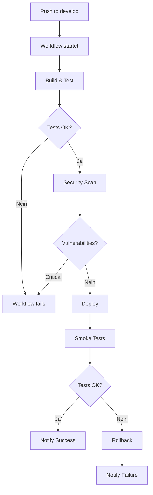

# GitHub Actions - Staging Deployment Setup

**Repository:** https://github.com/JochenWeerda/VALEO-NeuroERP-3.0  
**Workflow-Datei:** `.github/workflows/deploy-staging.yml`  
**Status:** ✅ **READY TO USE**

---

## 🎯 Übersicht

Der GitHub Actions Workflow `deploy-staging.yml` automatisiert das Deployment auf die Staging-Umgebung.

**Features:**
- ✅ Auto-Deploy bei Push auf `develop`-Branch
- ✅ Manueller Trigger via GitHub UI
- ✅ Automatische Security-Scans (Trivy, TruffleHog)
- ✅ Docker-Image-Build & Push
- ✅ Smoke-Tests nach Deployment
- ✅ Auto-Rollback bei Fehler
- ✅ Notifications bei Success/Failure

---

## 🔐 GitHub Secrets konfigurieren

### Erforderliche Secrets

Gehe zu: https://github.com/JochenWeerda/VALEO-NeuroERP-3.0/settings/secrets/actions

Erstelle folgende **Repository Secrets:**

#### 1. Staging-Credentials

```
STAGING_POSTGRES_PASSWORD
```
**Wert:** Passwort für PostgreSQL-Datenbank (Staging)  
**Beispiel:** `valeo_staging_secure_2024!`

```
STAGING_KEYCLOAK_PASSWORD
```
**Wert:** Keycloak Admin-Passwort (Staging)  
**Beispiel:** `keycloak_admin_secure_2024!`

```
STAGING_PGADMIN_PASSWORD
```
**Wert:** pgAdmin Admin-Passwort (Staging)  
**Beispiel:** `pgadmin_secure_2024!`

```
STAGING_REDIS_PASSWORD
```
**Wert:** Redis Commander-Passwort (Staging)  
**Beispiel:** `redis_secure_2024!`

#### 2. Docker Registry (Optional)

Falls du Docker-Images in ein Registry pushen möchtest:

```
DOCKER_REGISTRY_USERNAME
```
**Wert:** Username für Docker Hub / GitHub Container Registry  
**Beispiel:** `JochenWeerda`

```
DOCKER_REGISTRY_TOKEN
```
**Wert:** Access Token für Docker Hub / GitHub Container Registry  
**Wie erstellen:**
- Docker Hub: https://hub.docker.com/settings/security
- GitHub: https://github.com/settings/tokens (mit `write:packages` Scope)

#### 3. Notifications (Optional)

```
SLACK_WEBHOOK_URL
```
**Wert:** Slack Webhook-URL für Deployment-Notifications  
**Wie erstellen:** https://api.slack.com/messaging/webhooks

---

## 🚀 Workflow aktivieren

### Option 1: Auto-Deploy bei Push auf `develop`

```bash
# 1. Branch wechseln
git checkout develop

# 2. Änderungen committen
git add .
git commit -m "feat: neues Feature für Staging"

# 3. Pushen (triggert automatisch Workflow)
git push origin develop
```

**Workflow startet automatisch:**
1. Build & Test
2. Security-Scans
3. Deploy to Staging
4. Smoke-Tests
5. Notification

### Option 2: Manueller Trigger (Workflow Dispatch)

1. Gehe zu: https://github.com/JochenWeerda/VALEO-NeuroERP-3.0/actions/workflows/deploy-staging.yml
2. Klicke "Run workflow"
3. Wähle Branch: `develop` (oder anderen)
4. Optional: "Skip tests" auswählen
5. Klicke "Run workflow"

**Workflow startet manuell:**
- Vollständiger Deploy-Prozess
- Smoke-Tests (optional überspringen)
- Notification

---

## 📊 Workflow-Jobs

Der Workflow besteht aus **6 Jobs:**

### 1. Build & Test
- ⏱️ Dauer: ~5-10 Minuten
- 🔨 Node.js & Python Setup
- 📦 Dependencies installieren
- 🧪 Unit-Tests ausführen (optional)
- 🏗️ Docker-Images bauen
- 💾 Images als Artifacts speichern

### 2. Security Scan
- ⏱️ Dauer: ~3-5 Minuten
- 🔍 Trivy Vulnerability Scanner
- 🔐 TruffleHog Secret Scanner
- 📤 SARIF-Upload zu GitHub Security

### 3. Deploy
- ⏱️ Dauer: ~3-5 Minuten
- 📥 Docker-Images laden
- 🚀 Docker-Compose-Stack starten
- ⏳ Health-Checks warten
- 💾 Database-Migration

### 4. Smoke Tests
- ⏱️ Dauer: ~2-3 Minuten
- ✅ 18 automatisierte Tests
- 🏥 Health-Checks
- 🔑 OIDC-Tests
- 📡 API-Tests

### 5. Notify
- ⏱️ Dauer: ~1 Minute
- 📧 Email-Notification (optional)
- 💬 Slack-Notification (optional)
- ✅/❌ Success/Failure-Status

### 6. Rollback (bei Fehler)
- ⏱️ Dauer: ~2 Minuten
- ⏪ Automatischer Rollback
- 📋 Previous-Version wiederherstellen
- 🚨 Notification

---

## 📈 Workflow-Status überwachen

### GitHub UI

**Workflow-Übersicht:**  
https://github.com/JochenWeerda/VALEO-NeuroERP-3.0/actions

**Letzter Workflow-Run:**  
https://github.com/JochenWeerda/VALEO-NeuroERP-3.0/actions/workflows/deploy-staging.yml

### Workflow-Badge in README

Füge diesen Badge in die `README.md` ein:

```markdown

```

**Ergebnis:**  


### GitHub CLI

```bash
# Installiere GitHub CLI
# https://cli.github.com/

# Workflow-Status prüfen
gh workflow list

# Letzte Runs anzeigen
gh run list --workflow=deploy-staging.yml

# Logs anzeigen
gh run view <run-id> --log

# Workflow manuell triggern
gh workflow run deploy-staging.yml --ref develop
```

---

## 🐛 Troubleshooting

### Problem: Workflow startet nicht

**Mögliche Ursachen:**
1. Branch-Name falsch (nur `develop` triggert Auto-Deploy)
2. Workflow-Datei nicht im `main`-Branch
3. GitHub Actions für Repository deaktiviert

**Lösung:**
```bash
# Prüfen ob Workflow-Datei existiert
git ls-files .github/workflows/

# Workflow-Status prüfen
gh workflow list

# GitHub Actions aktivieren
# Settings → Actions → General → "Allow all actions"
```

### Problem: Secrets nicht gefunden

**Symptom:**
```
Error: Required secret STAGING_POSTGRES_PASSWORD not found
```

**Lösung:**
1. Gehe zu: https://github.com/JochenWeerda/VALEO-NeuroERP-3.0/settings/secrets/actions
2. Erstelle fehlendes Secret
3. Workflow neu starten

### Problem: Docker-Build schlägt fehl

**Symptom:**
```
Error: failed to solve: process "/bin/sh -c npm install" did not complete successfully
```

**Lösung:**
```yaml
# In .github/workflows/deploy-staging.yml prüfen:
# - Node.js-Version korrekt? (20)
# - Python-Version korrekt? (3.11)
# - Cache-Konfiguration OK?
```

### Problem: Smoke-Tests schlagen fehl

**Symptom:**
```
❌ PostgreSQL Health Check
❌ Keycloak Health Check
```

**Lösung:**
```yaml
# Health-Check-Timeouts erhöhen:
- name: Wait for Health Checks
  run: |
    timeout 180 bash -c '...'  # Von 60 auf 180 erhöhen
```

### Problem: Rollback funktioniert nicht

**Symptom:**
```
Error: Previous Docker images not found
```

**Lösung:**
- Beim ersten Deployment ist kein Rollback möglich (keine Previous-Version)
- Ab zweitem Deployment funktioniert Auto-Rollback

---

## 🔧 Workflow anpassen

### Build-Schritt überspringen

Wenn Images bereits gebaut sind:

```yaml
# In .github/workflows/deploy-staging.yml:
# Job "build" entfernen oder:
- name: Build Docker Images
  if: ${{ github.event.inputs.skip_build != 'true' }}
  run: |
    docker-compose -f docker-compose.staging.yml build
```

Dann manuell triggern mit Parameter.

### Tests überspringen

Bereits implementiert:

```bash
# Via GitHub UI: "Skip tests" = true auswählen
# Via CLI:
gh workflow run deploy-staging.yml --ref develop -f skip_tests=true
```

### Notifications hinzufügen

Aktiviere Slack-Notifications:

```yaml
# In .github/workflows/deploy-staging.yml auskommentieren:
- name: Slack Notification
  uses: slackapi/slack-github-action@v1
  if: always()
  with:
    webhook-url: ${{ secrets.SLACK_WEBHOOK_URL }}
    payload: |
      {
        "text": "Staging Deployment: ${{ needs.smoke-tests.result }}"
      }
```

Dann `SLACK_WEBHOOK_URL` Secret erstellen.

---

## 📋 Deployment-Checklist

Vor dem ersten Deployment:

### GitHub-Setup
- [ ] Repository ist öffentlich oder Private-Access konfiguriert
- [ ] GitHub Actions aktiviert (Settings → Actions)
- [ ] Workflow-Datei in `main`-Branch vorhanden
- [ ] Branch `develop` existiert

### Secrets konfiguriert
- [ ] `STAGING_POSTGRES_PASSWORD` gesetzt
- [ ] `STAGING_KEYCLOAK_PASSWORD` gesetzt
- [ ] `STAGING_PGADMIN_PASSWORD` gesetzt
- [ ] `STAGING_REDIS_PASSWORD` gesetzt
- [ ] (Optional) `DOCKER_REGISTRY_USERNAME` gesetzt
- [ ] (Optional) `DOCKER_REGISTRY_TOKEN` gesetzt
- [ ] (Optional) `SLACK_WEBHOOK_URL` gesetzt

### Staging-Server
- [ ] Docker & Docker-Compose installiert
- [ ] Server erreichbar via SSH (falls Remote-Deploy)
- [ ] Genug Disk-Space (min. 20 GB)
- [ ] Ports verfügbar (3001, 8001, 8180, etc.)

### Code bereit
- [ ] `docker-compose.staging.yml` committed
- [ ] `config/keycloak/realm-staging.json` committed
- [ ] `scripts/smoke-tests-staging.sh` committed
- [ ] `env.example.staging` committed

---

## 🔄 Workflow-Lifecycle

### Typischer Deployment-Ablauf



### Zeit-Übersicht

| Phase | Dauer | Kumuliert |
|-------|-------|-----------|
| Build & Test | 5-10 min | 10 min |
| Security Scan | 3-5 min | 15 min |
| Deploy | 3-5 min | 20 min |
| Smoke Tests | 2-3 min | 23 min |
| Notify | 1 min | 24 min |
| **Total** | **14-24 min** | - |

---

## 📚 Weitere Ressourcen

### GitHub Actions Dokumentation
- [GitHub Actions Overview](https://docs.github.com/en/actions)
- [Workflow Syntax](https://docs.github.com/en/actions/using-workflows/workflow-syntax-for-github-actions)
- [Secrets Management](https://docs.github.com/en/actions/security-guides/encrypted-secrets)

### VALEO-NeuroERP Dokumentation
- [STAGING-DEPLOYMENT.md](./STAGING-DEPLOYMENT.md) - Staging-Setup
- [DEPLOYMENT-PLAN.md](./DEPLOYMENT-PLAN.md) - Production-Deployment
- [scripts/README.md](./scripts/README.md) - Scripts-Dokumentation

### Monitoring
- [GitHub Actions Dashboard](https://github.com/JochenWeerda/VALEO-NeuroERP-3.0/actions)
- [Security Alerts](https://github.com/JochenWeerda/VALEO-NeuroERP-3.0/security)

---

## ✅ Quick-Start

Minimale Schritte für erstes Deployment:

```bash
# 1. Secrets konfigurieren (siehe oben)

# 2. Code committen
git checkout develop
git add .
git commit -m "feat: staging deployment setup"
git push origin develop

# 3. Workflow überwachen
# https://github.com/JochenWeerda/VALEO-NeuroERP-3.0/actions

# 4. Nach erfolgreichem Deploy testen
# http://localhost:3001
```

---

**Status:** ✅ **GITHUB ACTIONS BEREIT - READY TO DEPLOY!**

**Repository:** https://github.com/JochenWeerda/VALEO-NeuroERP-3.0  
**Workflow:** https://github.com/JochenWeerda/VALEO-NeuroERP-3.0/actions/workflows/deploy-staging.yml

---

**🚀 Auto-Deploy aktiviert! 🎉**

