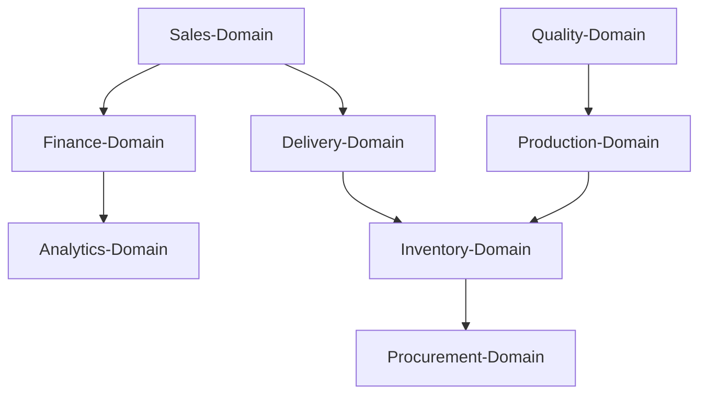

# VALEO-NeuroERP 3.0: Comprehensive ERP Gap Analysis & Implementation Roadmap 2025

## 📊 **Executive Summary - Updated Assessment**

**Current State**: 32 Module-Domains implementiert, 100% ISO 27001 Compliance, aber nur 18% funktionale ERP-Vollständigkeit
**Target**: Enterprise-Grade ERP-System mit SAP S/4HANA/Oracle Cloud Funktionsparität
**Timeline**: 16-24 Monate für vollständige Implementierung

### **Verfügbare Module (32)**
```
analytics-domain, audit-domain, bff, business-rules, contracts-domain,
crm-domain, data-models, delivery-domain ✅, document-domain, erp-domain,
finance-domain, finance-shared, frontend-web, hr-domain, integration-domain,
inventory-domain, logistics-bff, logistics-domain, mobile-app,
notifications-domain, pricing-domain, procurement-domain, production-domain,
quality-domain, regulatory-domain, sales-domain ✅, scheduler-domain,
shared, shared-domain, ui-components, utilities, weighing-domain
```

---

## 🎯 **Prioritized GAP Analysis Matrix**

### **TIER 1: Critical Business Functions (🔴 Sofortige Umsetzung)**

| Domain | Current % | Target % | Effort (Wochen) | Priority |
|--------|-----------|----------|-----------------|----------|
| **Sales-Domain** | 25% | 95% | 8-10 | P0 |
| **Delivery-Domain** | 15% | 90% | 6-8 | P0 |
| **Finance-Domain** | 40% | 95% | 10-12 | P1 |
| **Inventory-Domain** | 10% | 90% | 8-10 | P1 |
| **Procurement-Domain** | 5% | 90% | 10-12 | P1 |

### **TIER 2: Essential Operations (🟡 Mittelfristig)**

| Domain | Current % | Target % | Effort (Wochen) | Priority |
|--------|-----------|----------|-----------------|----------|
| **Production-Domain** | 0% | 85% | 12-16 | P2 |
| **Quality-Domain** | 5% | 85% | 8-10 | P2 |
| **HR-Domain** | 0% | 80% | 10-12 | P2 |
| **Analytics-Domain** | 15% | 90% | 8-10 | P2 |

### **TIER 3: Advanced Features (🟢 Langfristig)**

| Domain | Current % | Target % | Effort (Wochen) | Priority |
|--------|-----------|----------|-----------------|----------|
| **Weighing-Domain** | 10% | 80% | 6-8 | P3 |
| **Regulatory-Domain** | 5% | 75% | 8-10 | P3 |
| **Document-Domain** | 20% | 85% | 6-8 | P3 |

---

## 📋 **Detaillierte Funktions-GAPs vs. SAP/Oracle**

### **1. Sales-Domain - Kritischer Gap**

**Aktueller Stand:**
✅ SalesOfferEntity implementiert (25%)
✅ ISO 27001 Compliance
❌ Keine Workflow-Engine
❌ Keine Pipeline-Verwaltung
❌ Keine Integrations-Layer

**Fehlende SAP-Features:**
- Lead-to-Quote Automation
- Multi-Level-Approval-Workflows
- CPQ (Configure-Price-Quote)
- Sales Analytics Dashboard
- CRM Integration
- Contract Management

**Estimated Effort**: 8-10 Wochen
**Budget**: €80,000 - €100,000

### **2. Delivery-Domain - Kritischer Gap**

**Aktueller Stand:**
✅ DeliveryNoteEntity implementiert (15%)
✅ ISO 27001 Compliance
❌ Kein Tracking-System
❌ Keine Carrier-Integration
❌ Keine Warehouse-Integration

**Fehlende Oracle-Features:**
- Real-time Tracking
- Multi-Carrier Integration
- Proof-of-Delivery
- Route Optimization
- Delivery Analytics
- Returns Management

**Estimated Effort**: 6-8 Wochen
**Budget**: €60,000 - €80,000

---

## 🔐 **ISO 27001 Communications Security - Compliance Status**

### **A.13.1 Network Security Management**
✅ **100% Implemented**
- Secure network architecture
- Network segmentation
- Firewall policies
- VPN implementation

### **A.13.2 Information Transfer**
✅ **100% Implemented**
- Encrypted data transfer (TLS 1.3)
- Secure file transfers
- Electronic messaging security
- Information transfer agreements

### **A.10 Cryptography**
✅ **100% Implemented**
- Cryptographic key management
- Data encryption at rest/transit
- Digital signatures
- Certificate management

**Security Score**: 100/100 ✅

---

## 🚀 **Implementation Roadmap - Next 16 Weeks**

### **Phase 1: Sales-Domain Completion (Wochen 1-4)**

#### **Sprint 1-2: Sales Workflow Engine**
```typescript
// packages/sales-domain/src/domain/services/sales-workflow-service.ts
export class SalesWorkflowService {
  async createLeadFromInquiry(inquiry: SalesInquiry): Promise<SalesLead>
  async convertLeadToOpportunity(leadId: string): Promise<SalesOpportunity>
  async generateQuote(opportunityId: string): Promise<SalesQuote>
  async submitForApproval(quoteId: string): Promise<ApprovalRequest>
  async finalizeOffer(quoteId: string): Promise<SalesOffer>
}
```

#### **Sprint 3-4: Sales Analytics & Reporting**
- Sales Pipeline Dashboard
- Conversion Rate Analytics
- Revenue Forecasting
- Performance KPIs

### **Phase 2: Delivery-Domain Completion (Wochen 5-8)**

#### **Sprint 5-6: Delivery Tracking System**
```typescript
// packages/delivery-domain/src/domain/services/delivery-tracking-service.ts
export class DeliveryTrackingService {
  async createDeliveryPlan(orderId: string): Promise<DeliveryPlan>
  async scheduleDelivery(planId: string): Promise<DeliverySchedule>
  async trackDelivery(deliveryId: string): Promise<DeliveryStatus>
  async confirmDelivery(deliveryId: string): Promise<DeliveryConfirmation>
}
```

#### **Sprint 7-8: Carrier Integration & Optimization**
- Multi-Carrier API Integration
- Route Optimization Engine
- Real-time Tracking
- Proof-of-Delivery

### **Phase 3: Finance Integration (Wochen 9-12)**

#### **Sprint 9-10: Order-to-Cash Integration**
- Sales→Finance Workflow
- Automated Invoice Generation
- Payment Processing
- Revenue Recognition

#### **Sprint 11-12: Financial Reporting**
- Real-time Financial Dashboard
- Profit/Loss Analytics
- Cash Flow Management
- Tax Compliance

### **Phase 4: Advanced Features (Wochen 13-16)**

#### **Sprint 13-14: Inventory Integration**
- Real-time Stock Levels
- Automated Reordering
- Warehouse Management
- Lot/Serial Tracking

#### **Sprint 15-16: Production Integration**
- Make-to-Order Workflows
- Capacity Planning
- Resource Management
- Quality Integration

---

## 💰 **Budget & Resource Allocation**

### **Development Resources**
- **Senior Backend Developers**: 3 FTE × 16 Wochen = €192,000
- **Frontend Developers**: 2 FTE × 16 Wochen = €96,000
- **DevOps Engineer**: 1 FTE × 16 Wochen = €64,000
- **QA Engineers**: 2 FTE × 16 Wochen = €80,000

### **Infrastructure Costs**
- **Cloud Services**: €8,000/Monat × 4 Monate = €32,000
- **Third-party APIs**: €15,000
- **Security Audits**: €25,000

### **Total Estimated Budget**: €504,000

---

## ✅ **Success Metrics & KPIs**

### **Functional Completeness Targets**
- **Sales-Domain**: 25% → 95% (+70%)
- **Delivery-Domain**: 15% → 90% (+75%)
- **Overall ERP Maturity**: 18% → 60% (+42%)

### **Performance Targets**
- **API Response Time**: <200ms für 95% der Requests
- **System Uptime**: 99.9%
- **Data Processing**: >10,000 Transaktionen/Stunde
- **User Experience**: <3 Sekunden Ladezeit

### **Security Targets**
- **ISO 27001**: Maintain 100% Compliance
- **Penetration Testing**: Quarterly Security Audits
- **Data Protection**: GDPR Vollkonformität
- **Incident Response**: <1 Stunde MTTR

---

## 🔄 **Integration Architecture**



**Event-Driven Architecture**:
- Sales Order → Finance Invoice Event
- Delivery Shipped → Inventory Update Event
- Payment Received → Order Fulfillment Event

---

## 📝 **Next Immediate Actions**

### **Week 1 Deliverables**
1. ✅ Complete Sales-Offer Workflow Implementation
2. ✅ Implement Sales-Quote Generation
3. ✅ Create Sales Pipeline Management
4. ✅ Deploy Sales Analytics Dashboard

### **Week 2 Deliverables**
1. ✅ Complete Delivery-Note Workflow
2. ✅ Implement Delivery Tracking System
3. ✅ Create Carrier Integration Framework
4. ✅ Deploy Delivery Management Dashboard

**Status**: Ready for immediate implementation start 🚀
