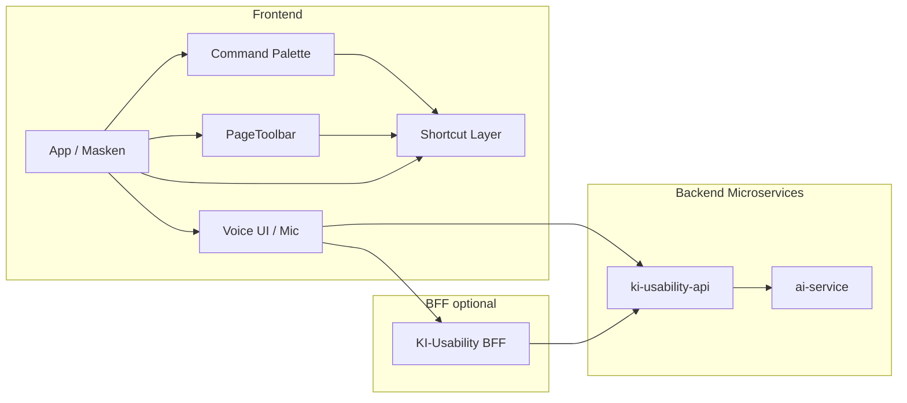

# KI Usability – Modul als Microservices (Frontend & Backend)

**Ziel:** Einheitliche KI-gestützte Usability (Sprachsteuerung, Intents, Shortcuts) über alle Masken – wie aus einem Guss mit PageToolbar und Tastaturkürzeln. Umsetzung als **Microservices** (Backend) und **einheitliche Frontend-Integration**.

**Bezug:** [docs/UX-STANDARD-VALEO.md](../UX-STANDARD-VALEO.md) (PageToolbar + Sprachsteuerung + Tastaturkürzel)

---

## 1. Überblick



- **Ein Kanal für Aktionen:** Alle Aktionen (Toolbar, Command Palette, Shortcut, Sprache) münden in dieselbe **Action-ID** und denselben Handler.
- **Backend:** Microservice **ki-usability-api** (Intent-Registry, Spracherkennung-Anbindung, optional STT/TTS).
- **Frontend:** Gemeinsames **KI-Usability-Feature** (Hooks, Voice-UI, Anbindung an PageToolbar/Command Palette/Shortcuts).

---

## 2. Backend: Microservice `ki-usability-api`

### 2.1 Verantwortung

| Bereich | Verantwortung |
|--------|----------------|
| **Action Registry** | Zentrale Liste aller Aktionen (ID, Label DE/EN, Shortcut, Intent-Phrasen, Domäne, Masken). Wird vom Frontend für Command Palette und Shortcut-Help abgefragt. |
| **Voice-to-Intent** | Text (aus Browser-STT oder von Client) → Intent-Auflösung → `{ actionId, params, confidence }`. Nutzt Regeln + optional NLU/LLM (ai-service). |
| **STT-Proxy** (optional) | Audio-Upload → Transkript. Kann Browser-Web-Speech nutzen oder Server-STT (z. B. Whisper). |
| **TTS-Proxy** (optional) | Text → Audio (Feedback „Befehl ausgeführt“). |

### 2.2 API-Entwurf (REST)

**Basis-URL:** z. B. `http://ki-usability-api:5200` (intern) / über BFF nach außen.

| Methode | Pfad | Beschreibung |
|---------|------|--------------|
| GET | `/api/v1/actions` | Liste aller registrierten Aktionen (für aktuelle App/Mandant). Query: `?domain=finance&mask=ap-invoices`. |
| GET | `/api/v1/actions/{actionId}` | Eine Aktion (Shortcut, Label, Intent-Phrasen). |
| POST | `/api/v1/voice/resolve` | Text → Intent. Body: `{ "text": "Neue Rechnung", "context": { "domain", "mask" } }`. Response: `{ "actionId", "params", "confidence" }`. |
| POST | `/api/v1/voice/transcribe` | (Optional) Audio (multipart) → Text. |
| POST | `/api/v1/voice/speak` | (Optional) Text → Audio-URL oder Stream. |

**Action-Registry (Beispiel):**

- Aktionen kommen aus Konfiguration oder DB; gleiche IDs wie im Frontend (PageToolbar, Command Palette, `global-shortcuts`).
- Pro Aktion: `id`, `label`, `shortcut`, `intentPhrases` (z. B. `["Neue Rechnung", "Rechnung anlegen"]`), `domain`, `mask`, `requiredData`.

### 2.3 Ordnerstruktur (Vorschlag)

```
services/ki-usability/
├── app/
│   ├── main.py
│   ├── config.py
│   ├── api/
│   │   └── v1/
│   │       ├── api.py
│   │       └── endpoints/
│   │           ├── actions.py   # GET /actions, /actions/{id}
│   │           ├── voice.py    # POST /voice/resolve, /transcribe, /speak
│   │           └── health.py
│   ├── services/
│   │   ├── action_registry.py  # Laden/Konfiguration Aktionen
│   │   ├── intent_resolver.py  # Text → actionId (Regeln + optional LLM)
│   │   └── stt_tts.py         # optional STT/TTS-Adapter
│   └── schemas/
│       └── ...
├── tests/
├── Dockerfile
├── pyproject.toml
└── README.md
```

### 2.4 Abhängigkeiten

- **Eigenständig:** Action Registry, Intent-Resolver (regelbasiert).
- **Optional:** Aufruf **ai-service** für bessere NLU (z. B. `/api/v1/assistants` oder eigener Endpoint) bei unklarem Text.
- **Optional:** STT/TTS über externe Dienste oder bestehenden `scripts/voice_assistant.py`-Stack (Whisper, TTS).

---

## 3. Frontend: KI-Usability-Feature

### 3.1 Verantwortung

| Bereich | Verantwortung |
|--------|----------------|
| **Action-Dispatcher** | Eine Stelle, die eine **Action-ID** (+ Parameter) ausführt – aufgerufen von Toolbar, Command Palette, Shortcut und **Sprache**. |
| **Voice-UI** | Mikrofon-Button, Aufnahme (Web Speech API oder Upload an ki-usability-api), Anzeige Transkript + erkannte Aktion, ggf. TTS-Feedback. |
| **Shortcuts** | Bereits vorhanden (`global-shortcuts`, Command Palette). Nur anbinden: gleiche Action-IDs wie Backend. |
| **Action-Registry (Client)** | Optional: Aktionen von ki-usability-api laden und Command Palette + Shortcut-Help füllen (single source of truth). |

### 3.2 Ordnerstruktur (Vorschlag)

```
packages/frontend-web/src/
├── features/
│   └── ki-usability/
│       ├── api/
│       │   ├── actions.ts      # fetch actions, resolve intent
│       │   └── voice.ts        # transcribe, speak (falls Backend)
│       ├── hooks/
│       │   ├── useVoiceIntent.ts   # Mikrofon → Text → resolve → dispatch
│       │   ├── useActionDispatch.ts # eine Funktion: actionId + params → ausführen
│       │   └── useActionsForMask.ts # Aktionen für aktuelle Maske (von API oder lokal)
│       ├── context/
│       │   └── ActionDispatchContext.tsx  # Provider: registerHandler(actionId, fn)
│       ├── components/
│       │   ├── VoiceButton.tsx     # Mic-Button, Aufnahme, Feedback
│       │   └── VoiceFeedback.tsx   # „Erkannt: Neue Rechnung“ / Fehler
│       └── index.ts
```

### 3.3 Ablauf Sprachsteuerung

1. User klickt Mikrofon (oder Tastenkürzel für „Sprache an“).
2. Frontend: Aufnahme (Web Speech API oder Upload zu `/voice/transcribe`).
3. Text an `POST /voice/resolve` senden → `{ actionId, params, confidence }`.
4. Bei ausreichendem `confidence`: **Action-Dispatcher** aufrufen mit `actionId` + `params` (dieselbe Funktion, die auch Toolbar/Shortcut nutzt).
5. Optional: TTS oder Toast („Befehl ausgeführt“).

### 3.4 Einbindung in App

- **ActionDispatchContext** oberhalb der Routen: Masken registrieren ihre Handler für Action-IDs (z. B. `save-document`, `new-invoice`, `go-to-orders`).
- **PageToolbar / Command Palette:** Rufen bei Klick/Shortcut den Dispatcher mit derselben Action-ID auf.
- **VoiceButton** in AppShell oder pro Seite: nutzt `useVoiceIntent` → resolve → dispatch.

---

## 4. Gemeinsamer Action-Katalog

Damit Toolbar, Shortcuts, Command Palette und **Sprache** identisch sind, gibt es eine gemeinsame **Action-ID**- und Phrasen-Definition.

**Beispiele (Auszug):**

| Action-ID | Shortcut | Intent-Phrasen (DE) | Domäne |
|-----------|----------|---------------------|--------|
| `open-customer-selection` | Strg+F1 | Kundenauswahl, Kunde wählen, Kundendialog | sales, finance |
| `save-document` | Strg+F4 | Speichern, Beleg speichern | * |
| `new-invoice` | – | Neue Rechnung, Rechnung anlegen | finance, sales |
| `go-to-orders` | G A | Aufträge, Auftragsliste, Gehe zu Aufträge | sales |
| `go-to-ap-invoices` | – | Eingangsrechnungen, Kreditorenrechnungen | finance |

- **Backend:** Diese Tabelle (oder Konfiguration) liegt im **ki-usability-api** (Action Registry) und wird für `/voice/resolve` und ggf. für `/actions` genutzt.
- **Frontend:** Command Palette und Shortcut-Help können dieselbe Quelle nutzen (GET `/actions`) oder eine synchrone Kopie (z. B. aus `route-aliases.json` + global-shortcuts erweitert).

---

## 5. BFF (optional)

Wenn das Frontend nicht direkt mit ki-usability-api spricht (z. B. aus Sicherheit/Netzwerk):

- **BFF** (z. B. bestehender BFF oder neuer Endpoint in `main`-Backend) proxied:
  - `GET /api/mcp/ki-usability/actions` → ki-usability-api
  - `POST /api/mcp/ki-usability/voice/resolve` → ki-usability-api
- Frontend ruft nur BFF auf; Tenant/User-Header setzt der BFF.

---

## 6. Technologie-Überblick

| Schicht | Technologie |
|---------|-------------|
| **ki-usability-api** | Python 3.11+, FastAPI, Pydantic. Optional: httpx für Aufrufe an ai-service. |
| **Intent-Resolver** | Zuerst regelbasiert (Keyword + Muster wie in `voice_assistant.py` IntentRouter); optional LLM über ai-service. |
| **Frontend** | React, TypeScript. Web Speech API (Browser) für STT; optional Backend-STT/TTS. |
| **Action-Dispatcher** | React Context + Registry (Map&lt;actionId, Handler&gt;) pro Maske. |

---

## 7. Phasierung

| Phase | Inhalt |
|-------|--------|
| **1** | Action Registry (Backend) + GET `/actions`. Frontend: ActionDispatchContext + Anbindung PageToolbar/Command Palette an dieselben IDs. |
| **2** | POST `/voice/resolve` (regelbasiert), Frontend VoiceButton + useVoiceIntent, Dispatcher-Anbindung. |
| **3** | Optional: STT/TTS im Backend, BFF-Proxy, LLM-NLU für bessere Intent-Erkennung. |

---

## 8. Handler in einer Maske registrieren

Damit Sprachbefehle (z. B. „Speichern“, „Kundenauswahl“) in einer konkreten Maske ausgeführt werden, die Maske einen Handler beim zentralen Dispatcher registrieren:

```tsx
import { useActionDispatch } from '@/features/ki-usability'

export default function OrderEditorPage() {
  const { registerHandler } = useActionDispatch()

  useEffect(() => {
    const unreg = registerHandler('save-document', () => handleSave())
    return () => unreg()
  }, [registerHandler, handleSave])

  return (/* ... */)
}
```

Navigation (`nav-*`) und globale Shortcut-Aktionen (`save-document`, `open-customer-selection` etc.) werden auch ohne Registrierung ausgeführt, sofern die Maske `useGlobalShortcuts` nutzt oder der Dispatcher die Aktion einer Route zuordnet.

---

## 9. Referenzen

- UX-Standard: [docs/UX-STANDARD-VALEO.md](../UX-STANDARD-VALEO.md)
- Globale Shortcuts: `packages/frontend-web/src/lib/shortcuts/global-shortcuts.ts`
- Command Palette: `packages/frontend-web/src/components/navigation/CommandPalette.tsx`, `components/innendienst/CommandPalette.tsx`
- PageToolbar: `packages/frontend-web/src/components/navigation/PageToolbar.tsx`
- Voice-Assistent (Skript): `scripts/voice_assistant.py` (IntentRouter, Skills)
- AI-Service: `services/ai/` (Assistants, RAG, Agents)
- Logistics BFF Voice: `packages/logistics-bff/src/services/voice-chat-service.ts`
