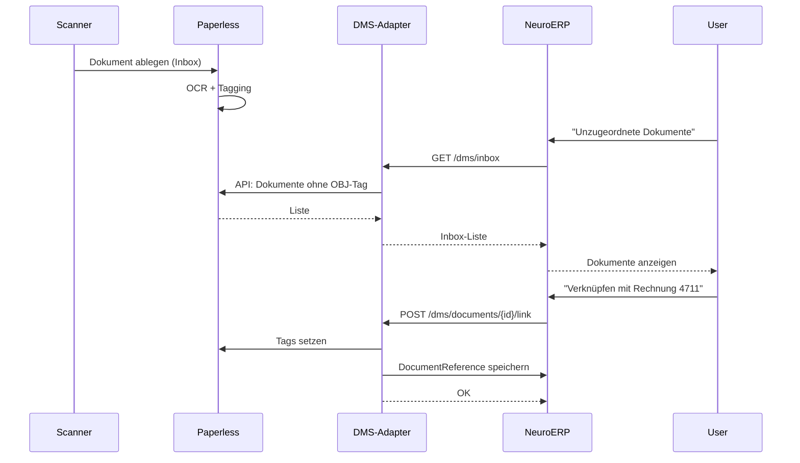
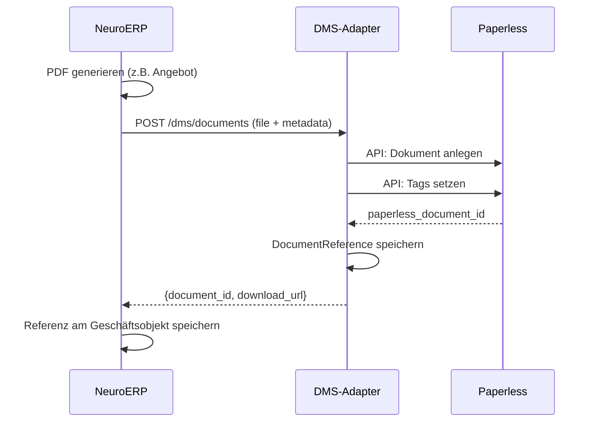

# DMS Integration: Paperless-ngx als Slave-Backend

## 📋 Übersicht

Paperless-ngx wird als reines DMS-Backend (Slave) für NeuroERP eingesetzt. Das ERP bleibt "Single Source of Truth" für alle Geschäftsobjekte, während Paperless-ngx als "Dokumenten-Gehirn im Keller" fungiert.

## 🏗️ Architektur

```
┌─────────────────────────────────────────────────────────────────┐
│                        NeuroERP (Master)                        │
│  ┌─────────────┐ ┌─────────────┐ ┌─────────────┐ ┌───────────┐  │
│  │   Aufträge  │ │  Rechnungen │ │   Kunden    │ │  Projekte │  │
│  └──────┬──────┘ └──────┬──────┘ └──────┬──────┘ └─────┬─────┘  │
│         │               │               │              │        │
│         └───────────────┴───────────────┴──────────────┘        │
│                                │                                │
│                    ┌───────────┴───────────┐                    │
│                    │   Document Reference  │                    │
│                    │   (paperless_doc_id)  │                    │
│                    └───────────┬───────────┘                    │
└────────────────────────────────┼────────────────────────────────┘
                                 │
                                 ▼
┌────────────────────────────────────────────────────────────────┐
│                     DMS-Adapter Service                        │
│  ┌──────────────────────────────────────────────────────────┐  │
│  │  POST /dms/documents         - Upload & Verknüpfung      │  │
│  │  GET  /dms/documents         - Liste nach Geschäftsobjekt│  │
│  │  GET  /dms/documents/{id}    - Download                  │  │
│  │  POST /dms/documents/{id}/link - Nachträgliche Verknüpf. │  │
│  │  GET  /dms/search            - Volltextsuche             │  │
│  │  GET  /dms/inbox             - Unzugeordnete Dokumente   │  │
│  └──────────────────────────────────────────────────────────┘  │
│                           │                                    │
│                    Rechte-Check                                │
│                    Tenant-Isolation                            │
│                    Tag-Mapping                                 │
└───────────────────────────┬────────────────────────────────────┘
                            │
                            ▼
┌────────────────────────────────────────────────────────────────┐
│                   Paperless-ngx (Slave)                        │
│  ┌──────────────────────────────────────────────────────────┐  │
│  │  • Binärdaten (PDF, Bilder, E-Mails)                     │  │
│  │  • OCR & Volltextsuche                                   │  │
│  │  • Tags & Kategorisierung                                │  │
│  │  • Technische Metadaten                                  │  │
│  │  • KEINE Business-Logik                                  │  │
│  └──────────────────────────────────────────────────────────┘  │
└────────────────────────────────────────────────────────────────┘
```

## 📊 Datenmodell

### Gemeinsame Identifikatoren

Jedes Dokument, das zu einem Geschäftsobjekt gehört, benötigt:

| Feld | Beschreibung | Beispiel |
|------|-------------|----------|
| `tenant_id` | Mandanten-ID | `TENANT:1234` |
| `business_object_type` | Geschäftsobjekt-Typ | `OBJ:INVOICE` |
| `business_object_id` | Geschäftsobjekt-ID | `OBJID:4711` |

### Tag-Konvention in Paperless-ngx

```
TENANT:{tenant_id}
OBJ:{business_object_type}
OBJID:{business_object_id}
DOCTYPE:{document_type}
```

Beispiele für `business_object_type`:
- `ORDER` - Auftrag
- `INVOICE` - Rechnung  
- `DELIVERY_NOTE` - Lieferschein
- `OFFER` - Angebot
- `CONTRACT` - Vertrag
- `PURCHASE_ORDER` - Einkaufsbestellung
- `GOODS_RECEIPT` - Wareneingang
- `CUSTOMER` - Kundenstammakte
- `SUPPLIER` - Lieferantenstammakte
- `PROJECT` - Projekt
- `QM_CERT` - QM-Zertifikat
- `QM_AUDIT` - Audit-Bericht

### ERP-seitige Speicherung

```typescript
interface DocumentReference {
  id: string;                    // ERP-interne ID
  paperless_document_id: number; // Paperless-ngx Document ID
  tenant_id: string;
  business_object_type: string;
  business_object_id: string;
  document_type?: string;        // z.B. 'rechnung', 'lieferschein'
  title: string;
  created_at: Date;
  created_by: string;
}
```

## 🔌 DMS-Adapter API

### Endpoints

#### 1. Dokument hochladen und verknüpfen
```http
POST /api/dms/documents
Content-Type: multipart/form-data

file: <binary>
tenant_id: "1234"
business_object_type: "INVOICE"
business_object_id: "4711"
document_type: "rechnung"
title: "Rechnung 4711"
tags: ["wichtig", "steuer"]
```

**Response:**
```json
{
  "ok": true,
  "document_id": 42,
  "paperless_id": 12345,
  "title": "Rechnung 4711",
  "download_url": "/api/dms/documents/42/download"
}
```

#### 2. Dokumente nach Geschäftsobjekt abrufen
```http
GET /api/dms/documents?business_object_type=INVOICE&business_object_id=4711
X-Tenant-ID: 1234
```

**Response:**
```json
{
  "ok": true,
  "data": [
    {
      "id": 42,
      "paperless_id": 12345,
      "title": "Rechnung 4711",
      "document_type": "rechnung",
      "file_type": "pdf",
      "size_kb": 245,
      "created_at": "2025-01-15T10:30:00Z",
      "download_url": "/api/dms/documents/42/download",
      "thumbnail_url": "/api/dms/documents/42/thumbnail"
    }
  ],
  "total": 1
}
```

#### 3. Dokument herunterladen
```http
GET /api/dms/documents/{id}/download
X-Tenant-ID: 1234
```

#### 4. Nachträgliche Verknüpfung (Inbox → Geschäftsobjekt)
```http
POST /api/dms/documents/{paperless_id}/link
Content-Type: application/json
X-Tenant-ID: 1234

{
  "business_object_type": "INVOICE",
  "business_object_id": "4711",
  "document_type": "rechnung"
}
```

#### 5. Volltextsuche
```http
GET /api/dms/search?q=Rechnung+Müller&limit=20
X-Tenant-ID: 1234
```

#### 6. Inbox (unzugeordnete Dokumente)
```http
GET /api/dms/inbox
X-Tenant-ID: 1234
```

## 🔄 Workflows

### A) Eingehende Dokumente (Scan / E-Mail)



### B) Dokumente aus ERP erzeugen



## 🔐 Sicherheit & Rechte

### Rechte-Management

- **NeuroERP** führt alle Rollen und Berechtigungen
- **DMS-Adapter** prüft bei jedem Request:
  - Tenant-ID (Mandantentrennung)
  - User-Rolle (Darf dieser User das Dokument sehen?)
  - Business-Object-Berechtigung
- **Paperless-ngx** kennt nur technische IDs, keine Business-Logik

### Multi-Tenant-Strategie

**Option A: Single-Instance mit Tag-Trennung**
```
TENANT:1234  → Mandant A
TENANT:5678  → Mandant B
```
- Einfacher zu betreiben
- Tag-basierte Filterung im Adapter

**Option B: Multi-Instance**
```
paperless-tenant-a.neuroerp.local
paperless-tenant-b.neuroerp.local
```
- Strikte Trennung
- Höherer Betriebsaufwand

**Empfehlung:** Option A für die meisten Szenarien, Option B nur bei strikt regulatorischen Anforderungen.

## 🐳 Docker-Compose Erweiterung

```yaml
services:
  # ... bestehende Services ...
  
  paperless-redis:
    image: redis:7-alpine
    restart: unless-stopped
    networks:
      - neuroerp-network
    volumes:
      - paperless-redis-data:/data

  paperless-db:
    image: postgres:15-alpine
    restart: unless-stopped
    environment:
      POSTGRES_DB: paperless
      POSTGRES_USER: paperless
      POSTGRES_PASSWORD: ${PAPERLESS_DB_PASSWORD:-paperless}
    networks:
      - neuroerp-network
    volumes:
      - paperless-db-data:/var/lib/postgresql/data

  paperless:
    image: ghcr.io/paperless-ngx/paperless-ngx:latest
    restart: unless-stopped
    depends_on:
      - paperless-db
      - paperless-redis
    ports:
      - "8001:8000"  # Paperless UI (nur intern)
    environment:
      PAPERLESS_REDIS: redis://paperless-redis:6379
      PAPERLESS_DBHOST: paperless-db
      PAPERLESS_DBUSER: paperless
      PAPERLESS_DBPASS: ${PAPERLESS_DB_PASSWORD:-paperless}
      PAPERLESS_SECRET_KEY: ${PAPERLESS_SECRET_KEY}
      PAPERLESS_TIME_ZONE: Europe/Berlin
      PAPERLESS_OCR_LANGUAGE: deu+eng
      PAPERLESS_ADMIN_USER: admin
      PAPERLESS_ADMIN_PASSWORD: ${PAPERLESS_ADMIN_PASSWORD}
      PAPERLESS_URL: http://localhost:8001
      # API-Token für DMS-Adapter
      PAPERLESS_AUTO_LOGIN_USERNAME: ""
    networks:
      - neuroerp-network
    volumes:
      - paperless-data:/usr/src/paperless/data
      - paperless-media:/usr/src/paperless/media
      - paperless-export:/usr/src/paperless/export
      - paperless-consume:/usr/src/paperless/consume

  dms-adapter:
    build:
      context: ./services/dms-adapter
      dockerfile: Dockerfile
    restart: unless-stopped
    depends_on:
      - paperless
      - postgres
    ports:
      - "8002:8000"
    environment:
      PAPERLESS_URL: http://paperless:8000
      PAPERLESS_TOKEN: ${PAPERLESS_API_TOKEN}
      DATABASE_URL: postgresql://postgres:${DB_PASSWORD:-postgres}@postgres:5432/neuroerp
      JWT_SECRET: ${JWT_SECRET}
    networks:
      - neuroerp-network

volumes:
  paperless-redis-data:
  paperless-db-data:
  paperless-data:
  paperless-media:
  paperless-export:
  paperless-consume:
```

## 📁 Projektstruktur

```
services/
└── dms-adapter/
    ├── Dockerfile
    ├── requirements.txt
    ├── alembic/
    │   └── versions/
    ├── app/
    │   ├── __init__.py
    │   ├── main.py
    │   ├── config.py
    │   ├── api/
    │   │   ├── __init__.py
    │   │   ├── routes.py
    │   │   └── dependencies.py
    │   ├── services/
    │   │   ├── __init__.py
    │   │   ├── paperless_client.py
    │   │   └── document_service.py
    │   ├── models/
    │   │   ├── __init__.py
    │   │   └── document.py
    │   └── schemas/
    │       ├── __init__.py
    │       └── document.py
    └── tests/
```

## ✅ Nächste Schritte

1. [ ] DMS-Adapter Service Grundstruktur erstellen
2. [ ] Paperless-ngx Client implementieren
3. [ ] API-Endpoints implementieren
4. [ ] Frontend DMS-Service erstellen
5. [ ] QM-Dokumente Seite anbinden
6. [ ] Docker-Compose erweitern
7. [ ] E2E Tests schreiben

## 📚 Referenzen

- [Paperless-ngx Dokumentation](https://docs.paperless-ngx.com/)
- [Paperless-ngx API](https://docs.paperless-ngx.com/api/)
- [Paperless-ngx GitHub](https://github.com/paperless-ngx/paperless-ngx)

