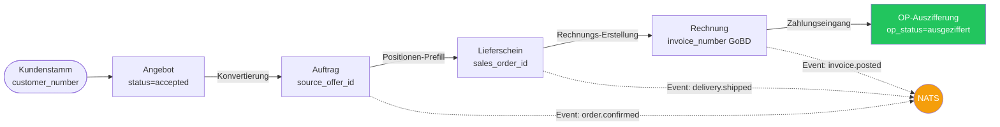
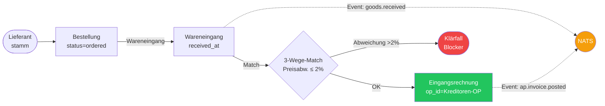
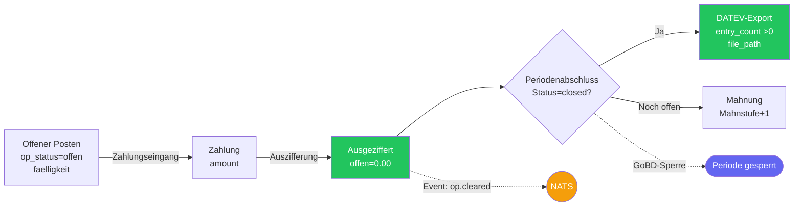
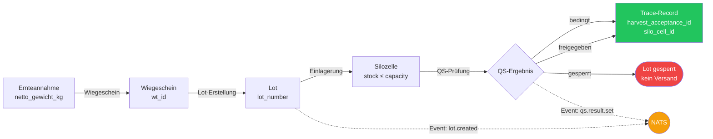
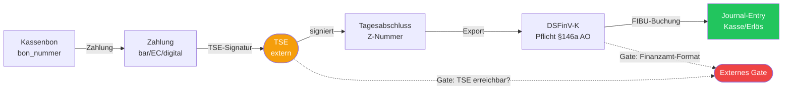
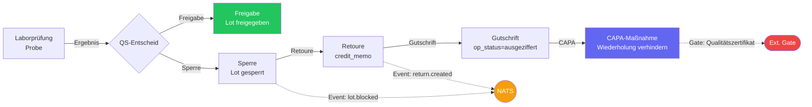

# ERP Prozesskarte

Visuelle Übersicht der 6 kritischen Geschäftsprozesse in VALEO NeuroERP 3.0.
Jede Kette zeigt Belege, Events, Policies und externe Gates.

---

## 1. O2C — Order-to-Cash (CRM360)

**Kette:** Kunde → Angebot → Auftrag → Lieferschein → Rechnung → Zahlung/OP-Auszifferung

**Kritische Invarianten:**

- `sales_order_id` auf Lieferschein muss mit Auftrag-ID übereinstimmen
- GoBD: `invoice_number` darf nicht `null` sein
- OP-Saldo nach Vollzahlung exakt 0

---

## 2. P2P — Procure-to-Pay

**Kette:** Lieferant → Bestellung → Wareneingang → 3-Wege-Match → Eingangsrechnung/Kreditoren-OP

**Kritische Invarianten:**

- Preisabweichung im 3-Wege-Match ≤ 2 % (sonst Klärfall)
- Kreditoren-OP muss bei Eingangsrechnung angelegt sein
- `received_at` Pflichtfeld für Wareneingang

---

## 3. FiBu — OP-Lifecycle & DATEV-Export

**Kette:** Offener Posten → Zahlung → Auszifferung → (Periodenabschluss) → DATEV-Export

**Kritische Invarianten:**

- Ausgezifferter OP-Saldo exakt 0,00
- DATEV-Export: `entry_count > 0` und `file_path` gesetzt
- GoBD: Periodensperre verhindert Nachbuchungen in geschlossener Periode

---

## 4. WMS/Agrar — Ernteannahme & Rückverfolgbarkeit

**Kette:** Annahme → Waage → Lot → Silozelle → QS-Freigabe → Trace

**Kritische Invarianten:**

- Silozelle darf `capacity_kg` nicht überschreiten
- QS-Status muss in `{freigegeben, gesperrt, bedingt}` — kein unbekannter Status
- Trace-Record verknüpft Lot mit Annahme und Silozelle (Rückverfolgbarkeit)

---

## 5. POS/TSE — Kassiervorgang & Tagesabschluss

**Kette:** Bon → Zahlung → TSE-Signatur → Tagesabschluss → DSFinV-K → FIBU

**Kritische Invarianten:**

- Jeder Bon muss TSE-signiert sein (§146a AO)
- Tagesabschluss: Z-Nummer eindeutig und fortlaufend
- DSFinV-K-Export: gesetzliches Pflichtformat für GoBD/BP

!!! warning "Externe Gates"
    TSE-Dienst und DSFinV-K-Validierung sind externe Systeme. Ausfall → Offline-Queue
    (POS läuft weiter, Nachsignierung beim Reconnect).

---

## 6. QS/Reklamation — Labor bis CAPA

**Kette:** Labor → Sperre/Freigabe → Retoure/Gutschrift → CAPA

**Kritische Invarianten:**

- Gesperrtes Lot darf nicht ausgeliefert werden
- Gutschrift muss Kreditoren-/Debitoren-OP ausziffern
- CAPA-Maßnahme schließt den Reklamationszyklus

---

## Legende

| Symbol | Bedeutung |
|---|---|
| 🟢 Grün | Endstatus / Erfolg |
| 🔴 Rot | Blockierung / Fehler |
| 🟡 Amber | Event / NATS-Nachricht |
| 🟣 Lila | Interner Gate / Sperre |
| `EVT` → NATS | Outbox-Event wird publiziert |
| `Ext. Gate` | Abhängigkeit von externem System |

## Semantische Tests

Die Business-Invarianten dieser Prozesskarten sind in
[`tests/test_semantic_e2e_matrix_001.py`](../../tests/test_semantic_e2e_matrix_001.py)
als automatisierte Unit-Tests abgesichert (44 Tests, O2C/P2P/FiBu/WMS).

---

*Generiert: 2026-06-26 · Quelle: `WORKFLOW-PROCESS-MAP-001` · Basis: `app/services/semantic_e2e_chain_service.py`*
