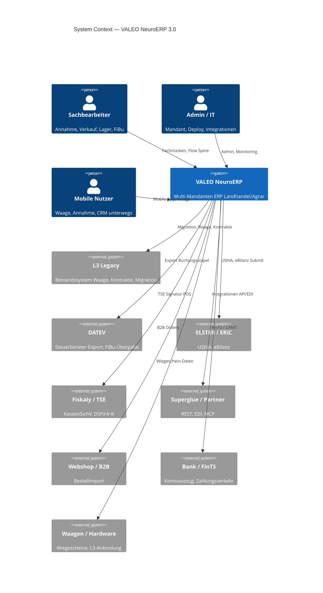

# C4 — System Context (Level 1)

> **Generierte View** — Quelle: [`docs/architecture/c4/workspace.dsl`] · Renderer: `python scripts/render_c4_views.py` · **Nicht manuell editieren.**

VALEO NeuroERP als **Software-System** in seiner Umgebung. Stand: Dev-Stack + dokumentierte Integrationen.

## Externe Systeme — Detailreferenzen

| System | Dokumentation |
|---|---|
| DATEV | [process-map § FiBu](../process-map.md), [fin-001 Workflow](../../workflows/fin-001-finance-to-reporting.md) |
| ELSTER | [Open Gaps VALEO-FIBU-006](../../project-context/open-gaps-and-known-issues.md) |
| Fiskaly/TSE | [POS Fiscalization](../pos-fiscalization-providers.md) |
| Paperless/DMS | [dms-paperless-integration.md](../dms-paperless-integration.md) |
| Keycloak | [Deployment](../../admin/deployment.md), [ADR-032](../../adr/adr-032-auth-enforcement-router-global-dependency.md) |
| L3 | [Open Gaps L3-*](../../project-context/open-gaps-and-known-issues.md) |
| Superglue | [superglue-integration-bewertung.md](../superglue-integration-bewertung.md) |
| Integration allgemein | [ADR-014](../../adr/adr-014-integrationsgrenzen-api-edi-mcp-partneradapter.md) |

## Nächste Zoom-Stufe

→ [C4 Container (Level 2)](c4-02-containers.md)
