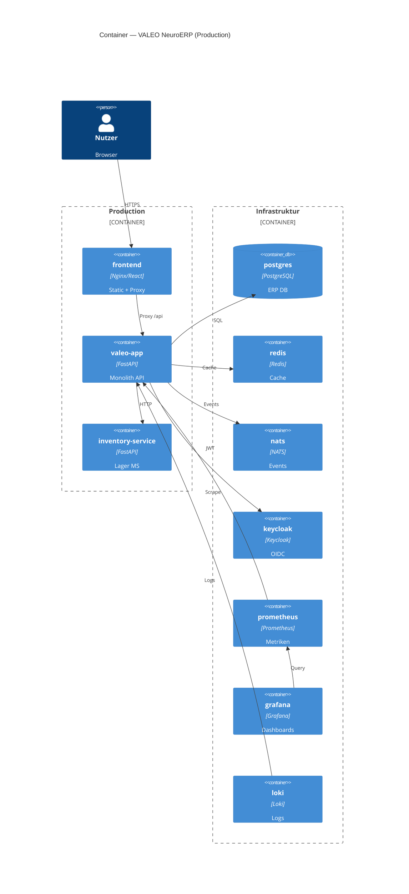

# C4 — Container (Level 2)

> **Generierte View** — Quelle: [`docs/architecture/c4/workspace.dsl`] · Renderer: `python scripts/render_c4_views.py` · **Nicht manuell editieren.**

Deploybare Anwendungs- und Infrastruktur-Container. **Quelle der Wahrheit (Modell):** [`workspace.dsl`](../c4/workspace.dsl) · **Compose:** [`docker-compose.yml`](../../../docker-compose.yml) — abgeglichen via [Container-Inventar](../../entwickler/container-inventory.md).

```mermaid
C4Container
  title Container — VALEO NeuroERP (docker-compose dev)

  Person(user, "Nutzer", "Browser / Mobile")

  Container_Boundary(valeo, "VALEO NeuroERP") {
    Container(frontend, "frontend-web", "React/Vite", "Fachmasken, Flow Spine")
    Container(bff, "bff-web", "Node BFF", "MCP, Aggregation")
    Container(sse, "dev-sse", "Node SSE", "Event-Stream Dev")
    Container(backend, "backend", "FastAPI", "Modularer Monolith /api/v1")
    Container(kiUsability, "ki-usability", "FastAPI", "Action Registry, Voice")
    Container(inventory, "inventory-service", "FastAPI", "Lager Microservice")
    Container(crmCluster, "crm-* Cluster", "FastAPI x8", "CRM bounded context")
    Container(dmsAdapter, "dms-adapter", "FastAPI", "DMS Brücke")
    Container(rations, "rations-optimization", "Python", "Futtermittel LP")
    Container(ai, "ai", "Python", "AI Service optional profile")
  }

  Container_Boundary(infra, "Infrastruktur") {
    ContainerDb(postgres, "postgres", "PostgreSQL 15", "ERP + Keycloak DB")
  }

  System_Ext(ext, "Externe Systeme", "DATEV, ELSTER, L3, …")

  Rel(frontend, bff, "API / MCP")
  Rel(frontend, backend, "/api/v1 proxy")
  Rel(frontend, sse, "SSE")
  Rel(frontend, keycloak, "OIDC")
  Rel(bff, backend, "Backend API")
  Rel(backend, postgres, "SQLAlchemy")
  Rel(backend, redis, "Cache")
  Rel(backend, nats, "Outbox publish")
  Rel(backend, inventory, "HTTP")
  Rel(backend, crmCluster, "HTTP CRM_*")
  Rel(backend, kiUsability, "HTTP")
  Rel(backend, dmsAdapter, "HTTP")
  Rel(backend, rations, "HTTP")
  Rel(backend, ai, "HTTP optional")
  Rel(backend, keycloak, "Token validation")
  Rel(dmsAdapter, paperless, "REST API")
  Rel(user, frontend, "HTTPS")
  Rel(backend, ext, "Integrationen")
```

## Container-Gruppen

| Gruppe | Services | Rolle |
|---|---|---|
| Presentation | `frontend-web`, `mobile-app` (Repo) | UI |
| Edge | `bff-web`, `dev-sse`, `logistics-bff` (Repo) | BFF, SSE |
| Core API | `backend` | FastAPI Monolith, Process Kernel |
| Domain MS | `crm-core`, `crm-sales`, `crm-service`, `crm-workflow`, `crm-analytics`, `crm-communication`, `crm-multichannel`, `crm-security`, `crm-ai` (profile) | CRM Bounded Context |
| Domain MS | `inventory-service`, `rations-optimization`, `ki-usability`, `ai` | Spezialdomänen |
| Integration | `dms-adapter` | DMS |
| DMS Stack | `paperless`, `paperless-db`, `paperless-redis` | Dokumentenarchiv |
| Data/Event | `postgres`, `redis`, `nats` | Persistenz, Cache, Events |
| Identity | `keycloak` | OIDC |
| Ops (optional) | `pgadmin`, `redis-commander` | Dev-Tools |

## CRM-Cluster (Ports)

| Container | Port | Fokus |
|---|---|---|
| crm-core | 5600 | Stammdaten, Kern |
| crm-sales | 5700 | Vertrieb |
| crm-service | 5800 | Servicefälle |
| crm-workflow | 5900 | CRM-Workflows |
| crm-analytics | 6000 | Auswertung |
| crm-communication | 6100 | E-Mail, Benachrichtigung |
| crm-ai | 6200 | KI (profile ai) |
| crm-multichannel | 6300 | Social, Webhooks |
| crm-security | 6400 | CRM Security Layer |

## Production-Stack (`docker-compose.production.yml`)

Observability und vereinfachtes Deployment ohne CRM-Microservice-Cluster:



## Wartung

```bash
python scripts/render_c4_views.py
python scripts/render_c4_views.py --check
python scripts/generate_container_inventory.py --check
```

→ [C4 Component CRM](components/c4-crm.md) | [Enterprise-Landkarte](enterprise-landscape.md)
