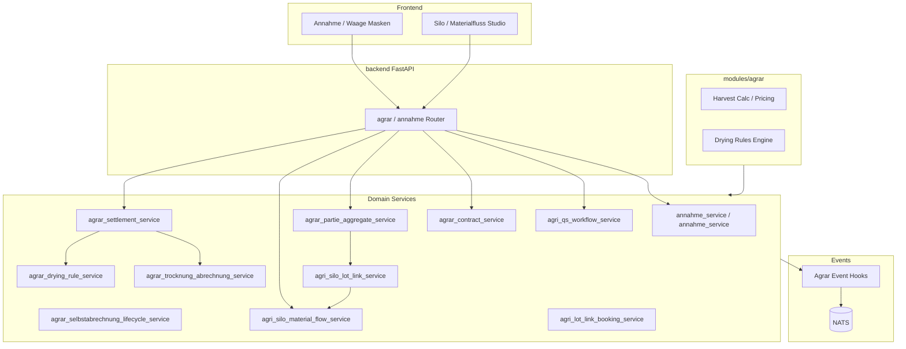

# C4 Component — Agrar / Annahme

Komponenten für Ernteannahme, Qualität, Partie, Settlement und Materialfluss.

## Kernaggregate (Agrar)

Weighing Ticket, Commodity Lot/Charge, Quality Result, Contract, Settlement — siehe [ADR-003](../../adr/adr-003-canonical-domain-model.md), [ADR-020](../../adr/adr-020-cross-domain-referenzmodell-kontrakt-charge-qualitaet-settlement.md).

Quellen: [agrar-event-hook-contracts.md](../../agrar-event-hook-contracts.md), [process-map § Agrar](../process-map.md)

→ [seq-agrar-settlement](../sequences/seq-agrar-settlement.md)
