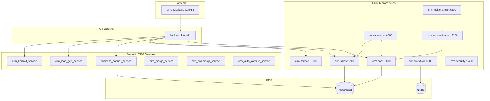

# C4 Component — CRM Bounded Context

Komponenten innerhalb des CRM-Clusters und Monolith-Compat-Layer. Siehe [ADR-CRM-001](../../adr/ADR-CRM-001.md).

## Kernaggregate (CRM)

- Business Partner / Kunde / Interessent
- Ansprechpartner, Kontakthistorie, Wiedervorlage
- Angebot → Auftrag (O2C-Einstieg)
- Lead-Kandidaten, Dubletten, Merge

Quellen: [Service-Inventar](../../entwickler/service-inventory.md) (`crm_*`), [process-map O2C](../process-map.md)

→ [C4 Container](../c4-02-containers.md) | [seq-o2c-fibu](../sequences/seq-o2c-fibu.md)
