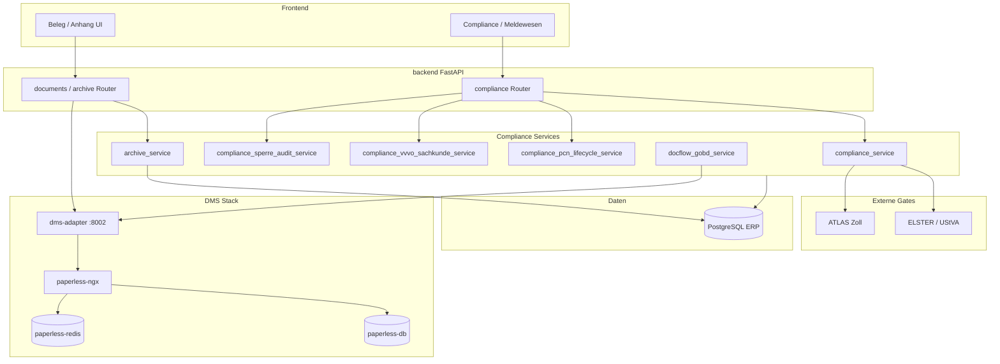

# C4 Component — DMS / Compliance

Komponenten für Belegarchiv (Paperless), GoBD-Dokumentenfluss und Regulatory/Compliance-Meldungen.

## Kernflüsse

1. **DMS:** Upload → dms-adapter → Paperless; `paperless_doc_id` auf Geschäftsobjekt ([dms-paperless-integration.md](../../dms-paperless-integration.md))
2. **GoBD:** Exportpaket + Archiv-Nachweis (`docflow_gobd_service`)
3. **Compliance-to-Report:** PCN, VVVO, Artikel-Sperre, UStVA/ELSTER ([process-map § QS/Compliance](../../process-map.md))

Quellen: [ADR-012](../../../adr/adr-012-dokument-audit-evidence-modell.md), [dms-paperless-integration.md](../../dms-paperless-integration.md)

→ [Sequenz DMS](../../dms-paperless-integration.md) | [C4 Container](../c4-02-containers.md)
