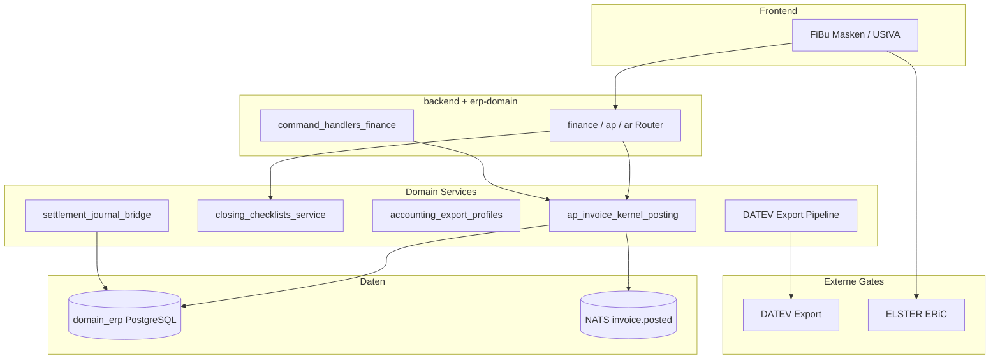

# C4 Component — Finance / FiBu

Komponenten für Offene Posten, Journal, Periodenabschluss, DATEV/ELSTER und Agrar-Settlement-Übergabe.

## Kernflüsse

1. **O2C:** Rechnung → OP → Zahlung → Auszifferung ([process-map § O2C](../process-map.md))
2. **P2P:** Eingangsrechnung → Kreditoren-OP ([process-map § P2P](../process-map.md))
3. **FiBu:** Periodenabschluss → DATEV ([process-map § FiBu](../process-map.md))
4. **Agrar:** Settlement → Journal Bridge → FiBu

Quellen: [ADR-001 FiBu Reuse](../../adr/adr-001-fibu-domain-reuse-vs-rewrite.md), [packages/erp-domain](../../../packages/erp-domain/README.md)

→ [seq-o2c-fibu](../sequences/seq-o2c-fibu.md)
