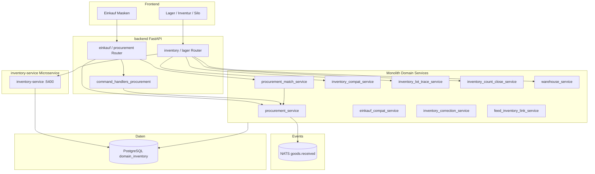

# C4 Component — Einkauf / Lager (P2P & Inventory)

Komponenten für Procure-to-Pay und Lager/Inventur — Monolith-Services plus `inventory-service` Microservice.

## Kernflüsse

1. **P2P:** Bestellung → Wareneingang → 3-Wege-Match → Eingangsrechnung ([process-map § P2P](../../process-map.md))
2. **Lager:** Bestand, Umlagerung, Inventur, FEFO/Chargen ([DOM-INV Services](../../../entwickler/service-inventory.md))
3. **Futtermittel-Kette:** `feed_inventory_link_service` ↔ `domain_inventory.articles`

Quellen: [inventory-service](../../../services/inventory/), [process-map § P2P](../../process-map.md)

→ [C4 Container](../c4-02-containers.md) | [Enterprise-Landkarte](../enterprise-landscape.md)
