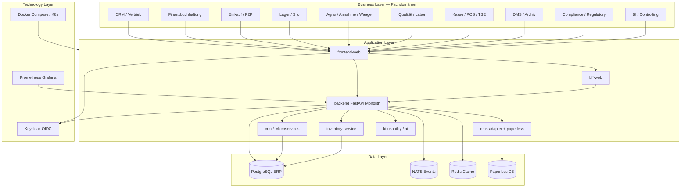

# Enterprise-Landkarte

Vereinfachtes **ArchiMate-äquivalentes** Schichtenmodell (80/20, Mermaid). Kein `.archimate`-Modell — siehe [ADR-036](../../adr/adr-036-architecture-documentation-stack.md).

## Domäne → Container → Prozess

| Fachdomäne | Application | Kernprozess |
|---|---|---|
| CRM | crm-*, backend CRM services | O2C, Lead-to-Customer |
| FiBu | backend finance services | Finance-to-Close, DATEV |
| Einkauf | backend procurement | P2P |
| Lager | inventory-service, backend | Inventory-to-Settlement |
| Agrar | modules/agrar, backend agrar_* | Harvest-to-Settlement |
| Waage | backend annahme, L3 | Wiegeschein → Partie |
| DMS | dms-adapter, paperless | Belegarchiv |
| POS/TSE | backend POS, Fiskaly | KassenSichV |
| Compliance | compliance_* services | Compliance-to-Report |
| QS | agri_qs_*, quality | QS-Freigabe |

## Referenzen

- [C4 System Context](c4-01-system-context.md)
- [C4 Container](c4-02-containers.md)
- [process-map.md](../process-map.md)
- [target-state-landhandel-erp.md](../target-state-landhandel-erp.md)
