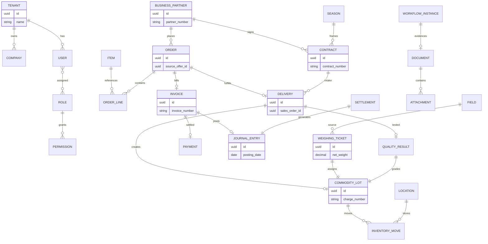

# ERD — Canonical Domain Model

Logisches **Entity-Relationship-Diagramm** der verbindlichen Kernaggregate ([ADR-003](../../adr/adr-003-canonical-domain-model.md)). Gegen ADR-003 geprueft am 2026-09-17: kein neues Kernaggregat seit 2026-03-11. Physische Tabellen, Spalten, Besitz und Verbraucher stehen im [Tabellenkatalog](../../admin/table-catalog.md), nicht in diesem Diagramm. Tenancy: [Datenmodell & Tenancy](../../entwickler/datenmodell-tenancy.md). Belegketten-**Layout**: [MASKEN.md](../../MASKEN.md).

## Agrar-Pflichtaggregate (Zusatz)

| Aggregat | Beziehung |
|---|---|
| Field / Schlag | → Weighing Ticket, Contract |
| Season / Campaign | → Contract, Harvest Window |
| Weighing Ticket | → Commodity Lot / Charge |
| Commodity Lot | → Quality, Inventory, Settlement |
| PSM / Duenger / Saatgut-Anwendung | Item auf Field (ADR-003 Pflichtaggregat; physische Tabellen im Katalog, kein drittes Klassendiagramm) |

## Regeln

1. Keine konkurrierenden Schattenmodelle pro Modul ([ADR-003](../../adr/adr-003-canonical-domain-model.md))
2. Cross-Domain-Referenzen: [ADR-020](../../adr/adr-020-cross-domain-referenzmodell-kontrakt-charge-qualitaet-settlement.md)
3. Tenant-Isolation: [ADR-034](../../adr/adr-034-tenant-isolation-klassifizierungssystem.md)
4. Belegketten-Layout bleibt [MASKEN.md](../../MASKEN.md); die Objekte bleiben dieses ERD
5. Kein Ticket, alle physischen Tabellen hier einzuzeichnen — das ist der [Tabellenkatalog](../../admin/table-catalog.md)

→ [C4 Component Agrar](components/c4-agrar.md) | [C4 Component Finance](components/c4-finance.md) | [UML Klassendiagramm](uml-canonical-domain-class.md)
