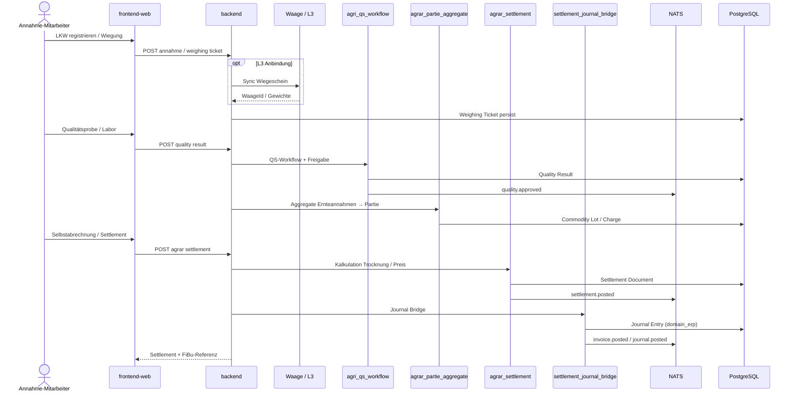

# Sequenzdiagramm — Annahme → Qualität → Settlement → Journal

Agrar-Kernkette Harvest-to-Settlement. Fachliche Übersicht: [process-map § Agrar](../../process-map.md).

## Referenzen

- [C4 Component Agrar](../components/c4-agrar.md)
- [agrar-event-hook-contracts.md](../../agrar-event-hook-contracts.md)
- [ADR-020 Cross-Domain Referenzmodell](../../../adr/adr-020-cross-domain-referenzmodell-kontrakt-charge-qualitaet-settlement.md)
