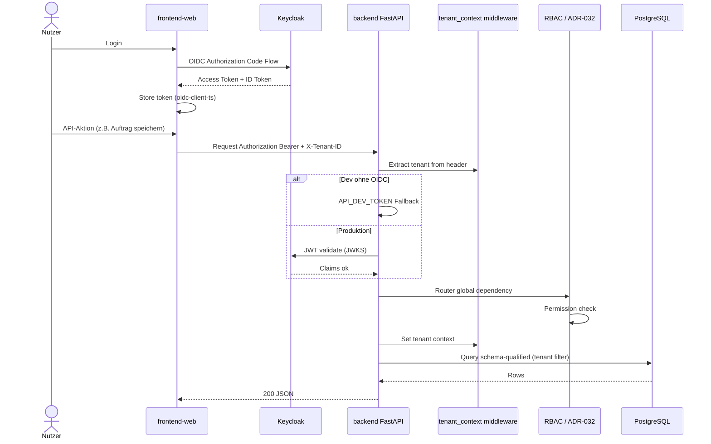

# Sequenzdiagramm — OIDC Auth & Tenant-Kontext

Authentifizierung und Mandantenisolation vom Browser bis zur Datenbank.

## Invarianten

- `X-Tenant-ID` Pflicht für mandantenfähige Routen
- Keine mandantenübergreifenden Queries ohne Review ([ADR-034](../../../adr/adr-034-tenant-isolation-klassifizierungssystem.md))
- Auth Enforcement global ([ADR-032](../../../adr/adr-032-auth-enforcement-router-global-dependency.md))

Quellen: [Datenmodell & Tenancy](../../../entwickler/datenmodell-tenancy.md), [Deployment](../../../admin/deployment.md)

→ [C4 Container](../c4-02-containers.md)
