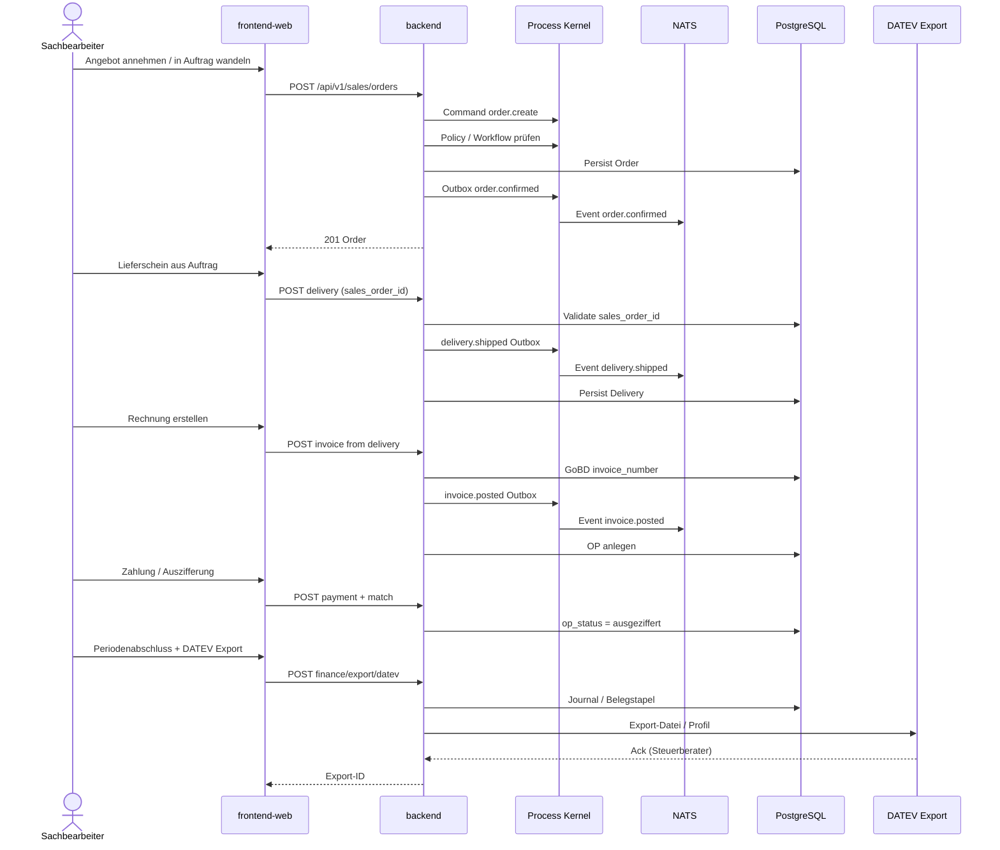

# Sequenzdiagramm — O2C → FiBu → DATEV

Technische Interaktion für die Kernkette Angebot → Auftrag → Lieferschein → Rechnung → OP → DATEV. Fachliche Übersicht: [process-map § O2C](../../process-map.md).

## Invarianten

- `sales_order_id` auf Lieferschein = Auftrag-ID
- `invoice_number` nicht null (GoBD)
- OP-Saldo nach Vollzahlung = 0

→ [C4 Component CRM](../components/c4-crm.md) | [C4 Component Finance](../components/c4-finance.md)
