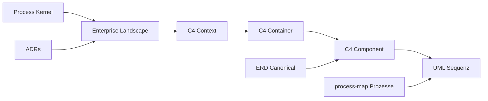

# Stakeholder, Concerns und Viewpoints

Ordnungsrahmen nach **ISO/IEC/IEEE 42010**. Festgelegt in [ADR-036](../../adr/adr-036-architecture-documentation-stack.md).

## Stakeholder → Concerns → Viewpoints

| Stakeholder | Concerns (Anliegen) | Viewpoint | Artefakt |
|---|---|---|---|
| Sachbearbeiter / Key-User | Prozessablauf, Sonderfälle | Prozess | [process-map.md](../process-map.md), [Workflows](../../workflows/) |
| Entwickler | Module, APIs, Datenmodell, Setup | Entwicklung | [C4 Container](c4-02-containers.md), [Service-Inventar](../../entwickler/service-inventory.md), [ERD](erd-canonical-domain.md) |
| Integrator / Partner | REST, Events, Auth, Webhooks | Integration | [C4 Context](c4-01-system-context.md), [Schnittstellen](../../schnittstellen/index.md) |
| Tenant-Admin | Module, RBAC, Mandant | Konfiguration | [Mandanten-Admin](../../admin/mandanten-administration.md) |
| Betrieb / SRE | Deploy, Skalierung, Monitoring | Deployment | [arc42 §7](../arc42/07-verteilungssicht.md), [Container-Inventar](../../entwickler/container-inventory.md) |
| Security / Compliance | GoBD, DSGVO, Audit | Compliance | [arc42 §2](../arc42/02-randbedingungen.md), [Compliance](../../compliance/index.md) |
| Product / Management | Reifegrad, Roadmap | Delivery | [Process Kernel STATUS](../process-kernel/STATUS.md) |
| Enterprise-Architekt | Domänen, Abhängigkeiten, EA | Enterprise | [enterprise-landscape.md](enterprise-landscape.md) |
| KI-Agent | Verträge, Guardrails, Lieferstand | Agent | [AGENTS.md](../../../AGENTS.md), [Agent-Docs](../../agent-docs/index.md) |

## Korrespondenz zwischen Sichten

## Pflege

Bei neuer externer Integration: **C4 Context** und ggf. **Enterprise-Landkarte** aktualisieren.
Bei neuem Docker-Service: **Container-Inventar** regenerieren + **C4 Container** prüfen.

→ [Viewpoint-Katalog](viewpoint-catalog.md)
