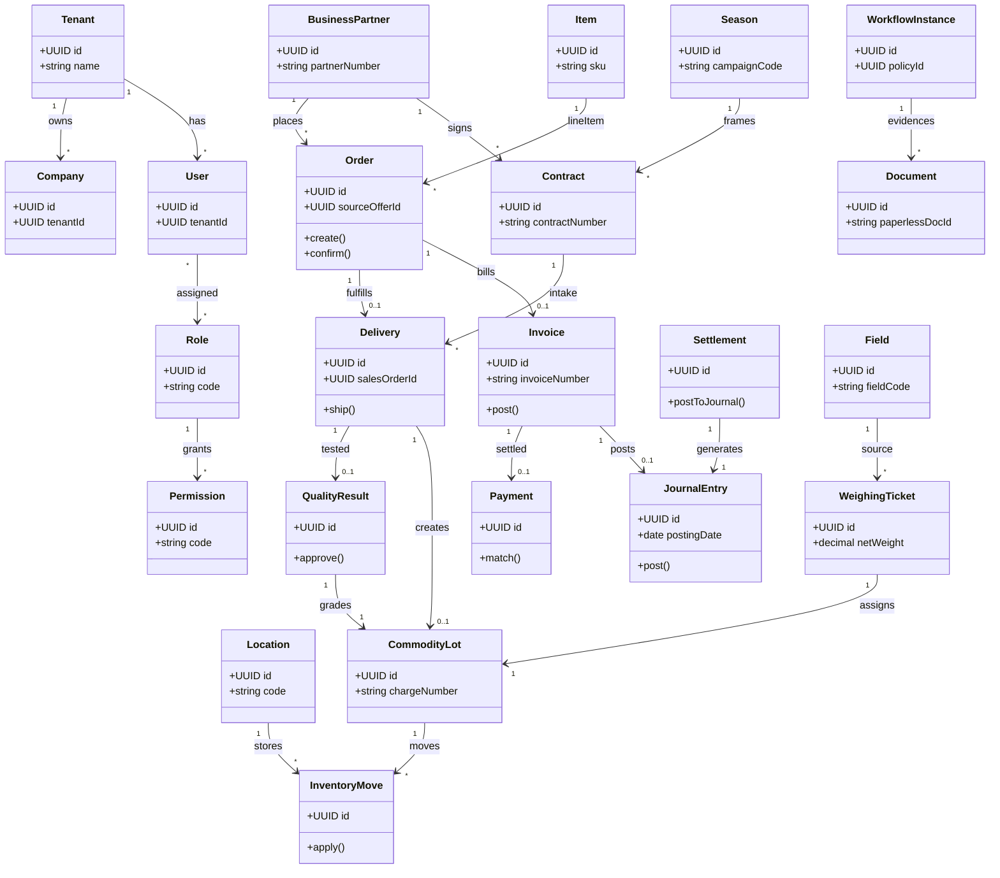

# UML Klassendiagramm — Canonical Domain Core

Logisches **UML-Klassendiagramm** der verbindlichen Kernaggregate ([ADR-003](../../adr/adr-003-canonical-domain-model.md)). Gegen ADR-003 geprueft am 2026-09-17: kein neues Kernaggregat seit 2026-03-11. Ergänzt das [ERD](erd-canonical-domain.md) um Verhalten/Ownership — **nicht** eine Code-generierte Abbildung aller SQLAlchemy-Modelle. Physischer Stand: [Tabellenkatalog](../../admin/table-catalog.md).

## Abgrenzung

| Artefakt | Zweck |
|---|---|
| Dieses Klassendiagramm | Aggregate, Ownership, zentrale Operationen (logisch) |
| [ERD](erd-canonical-domain.md) | Entitäten und Kardinalitäten |
| [Tabellenkatalog](../../admin/table-catalog.md) | Physische Tabellen, Spalten, Besitz, Verbraucher |
| Alembic / ORM | Physisches Schema — kann mehr Tabellen enthalten |
| [Service-Inventar](../../entwickler/service-inventory.md) | Implementierung pro Modul |
| [MASKEN.md](../../MASKEN.md) | Belegketten-Layout, nicht die Objektmenge |

## Regeln

- Kein monolithisches Klassendiagramm für das gesamte ERP ([ADR-036](../../adr/adr-036-architecture-documentation-stack.md))
- Erweiterungen nur über ADR-003-Prozess — kein Ticket „alle Tabellen ins classDiagram“
- `crm_consents`, Kreditlimite und Geschwistertabellen gehoeren in den Katalog, nicht hierher
- Cross-Domain: [ADR-020](../../adr/adr-020-cross-domain-referenzmodell-kontrakt-charge-qualitaet-settlement.md)

→ [ERD Canonical Domain](erd-canonical-domain.md) | [target-state Landhandel ERP](../../target-state-landhandel-erp.md)
