# Agrar-Kontrakte

Kontrakt, Fixierung, Erfüllung, Settlement.

## Ziel

Sie arbeiten sicher in allen Masken des Bereichs **Agrar-Kontrakte** — von der Navigation
bis zu Speichern, Freigabe und Folgebelegen.

## Voraussetzungen

- Gültige Anmeldung und Mandant (`X-Tenant-ID`).
- Modul für diesen Fachbereich ist installiert (siehe Administration → Module).
- Ihre Rolle hat Lese- bzw. Schreibberechtigung für die jeweilige Maske.

## Maskenregister

Vollständige Abdeckung: **20** App-Routen
(0 explizit in der Sidebar-Navigation).

| Maske | Route | Modul |
|-------|-------|-------|
| Contracts | `/contracts` | `@/pages/contracts-v2` |
| Contracts V2 | `/contracts-v2` | `@/pages/contracts-v2` |
| Kontrakte | `/kontrakte` | `@/pages/kontrakte/LstKontraktUebersicht` |
| :Id | `/kontrakte/:id` | `@/pages/kontrakte/KontraktDetailRoute` |
| Frmkontraktdetail | `/kontrakte/FrmKontraktDetail` | `@/pages/kontrakte/FrmKontraktDetail` |
| Frmkontraktprotokoll | `/kontrakte/FrmKontraktProtokoll` | `@/pages/kontrakte/FrmKontraktProtokoll` |
| Kontraktalarmdashboard | `/kontrakte/KontraktAlarmDashboard` | `@/pages/kontrakte/KontraktAlarmDashboard` |
| Kontraktpositionsmonitor | `/kontrakte/KontraktPositionsmonitor` | `@/pages/kontrakte/KontraktPositionsmonitor` |
| Lstkontraktuebersicht | `/kontrakte/LstKontraktUebersicht` | `@/pages/kontrakte/LstKontraktUebersicht` |
| Alarme | `/kontrakte/alarme` | `@/pages/kontrakte/KontraktAlarmDashboard` |
| Kontrakt Alarm Dashboard | `/kontrakte/kontrakt-alarm-dashboard` | `@/pages/kontrakte/KontraktAlarmDashboard` |
| Kontrakt Positionsmonitor | `/kontrakte/kontrakt-positionsmonitor` | `@/pages/kontrakte/KontraktPositionsmonitor` |
| Kontrakt Uebersicht | `/kontrakte/kontrakt-uebersicht` | `@/pages/kontrakte/LstKontraktUebersicht` |
| Kontraktklassen | `/kontrakte/kontraktklassen` | `@/pages/kontrakte/kontraktklassen` |
| Mengenzeitraeume | `/kontrakte/mengenzeitraeume` | `@/pages/kontrakte/mengenzeitraeume` |
| Neu | `/kontrakte/neu` | `@/pages/kontrakte/FrmKontraktDetail` |
| Positionen | `/kontrakte/positionen` | `@/pages/kontrakte/KontraktPositionsmonitor` |
| :Id | `/vertrag/:id` | `@/pages/kontrakte/FrmKontraktDetail` |
| Neu | `/vertrag/neu` | `@/pages/kontrakte/FrmKontraktDetail` |
| Rahmenvertraege | `/vertrag/rahmenvertraege` | `@/pages/vertrag/rahmenvertraege` |

## Masken im Detail

Für jede Route: Navigation, Bearbeitung, Ergebnis und typische Fehler.

### Contracts

**Route:** `/contracts` · **Modul:** `@/pages/contracts-v2`

**Ziel:** Contracts in VALEO NeuroERP öffnen, Daten prüfen oder erfassen und das Ergebnis in Liste bzw. Folgebeleg kontrollieren.

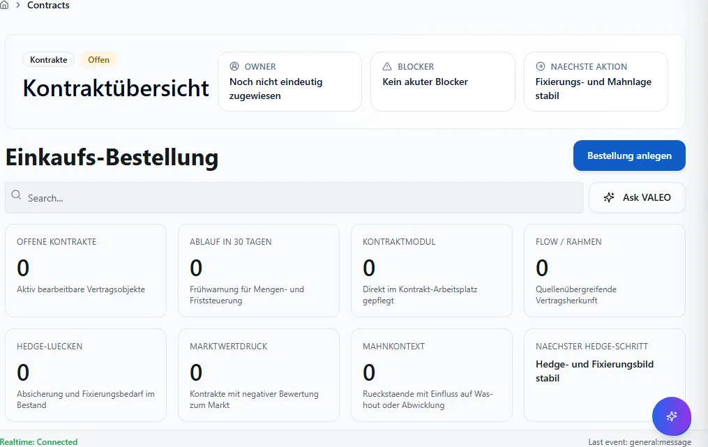

**Schritte:**

1. Sidebar oder Suche: **Contracts** öffnen (`/contracts`).
2. Filter und Spalten nach Bedarf setzen; bei ListReport Zeilen per Doppelklick oder Aktion öffnen.
3. Bei Belegen: Kopfdaten prüfen, Positionen erfassen oder ändern, **Speichern** bzw. workflowgebundene Aktion (Freigabe, Folgebeleg) ausführen.
4. Ergebnis in Liste, Detailansicht oder Folgebeleg verifizieren; bei Fehlern Meldungstext und Status prüfen.

**Ergebnis:** Datensatz gespeichert, Liste aktualisiert oder Folgeprozess ausgelöst.

**Häufige Fehler:**

| Symptom | Ursache | Maßnahme |
|---------|---------|----------|
| Maske lädt nicht | Modul nicht freigeschaltet oder fehlende Berechtigung | Administrator: Modul/RBAC prüfen |
| Speichern fehlgeschlagen | Pflichtfeld, Status oder Validierung | Meldung lesen, Pflichtfelder ergänzen |
| Aktion ausgegraut | Workflow-Status oder Sperre | Vorbeleg freigeben oder Berechtigung klären |

### Contracts V2

**Route:** `/contracts-v2` · **Modul:** `@/pages/contracts-v2`

**Ziel:** Contracts V2 in VALEO NeuroERP öffnen, Daten prüfen oder erfassen und das Ergebnis in Liste bzw. Folgebeleg kontrollieren.

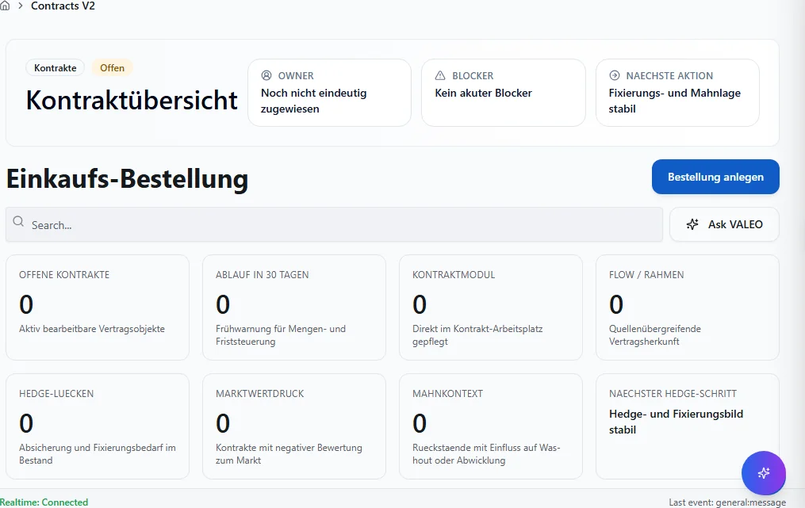

**Schritte:**

1. Sidebar oder Suche: **Contracts V2** öffnen (`/contracts-v2`).
2. Filter und Spalten nach Bedarf setzen; bei ListReport Zeilen per Doppelklick oder Aktion öffnen.
3. Bei Belegen: Kopfdaten prüfen, Positionen erfassen oder ändern, **Speichern** bzw. workflowgebundene Aktion (Freigabe, Folgebeleg) ausführen.
4. Ergebnis in Liste, Detailansicht oder Folgebeleg verifizieren; bei Fehlern Meldungstext und Status prüfen.

**Ergebnis:** Datensatz gespeichert, Liste aktualisiert oder Folgeprozess ausgelöst.

**Häufige Fehler:**

| Symptom | Ursache | Maßnahme |
|---------|---------|----------|
| Maske lädt nicht | Modul nicht freigeschaltet oder fehlende Berechtigung | Administrator: Modul/RBAC prüfen |
| Speichern fehlgeschlagen | Pflichtfeld, Status oder Validierung | Meldung lesen, Pflichtfelder ergänzen |
| Aktion ausgegraut | Workflow-Status oder Sperre | Vorbeleg freigeben oder Berechtigung klären |

### Kontrakte

**Route:** `/kontrakte` · **Modul:** `@/pages/kontrakte/LstKontraktUebersicht`

**Ziel:** Kontrakte in VALEO NeuroERP öffnen, Daten prüfen oder erfassen und das Ergebnis in Liste bzw. Folgebeleg kontrollieren.

**Schritte:**

1. Sidebar oder Suche: **Kontrakte** öffnen (`/kontrakte`).
2. Filter und Spalten nach Bedarf setzen; bei ListReport Zeilen per Doppelklick oder Aktion öffnen.
3. Bei Belegen: Kopfdaten prüfen, Positionen erfassen oder ändern, **Speichern** bzw. workflowgebundene Aktion (Freigabe, Folgebeleg) ausführen.
4. Ergebnis in Liste, Detailansicht oder Folgebeleg verifizieren; bei Fehlern Meldungstext und Status prüfen.

**Ergebnis:** Datensatz gespeichert, Liste aktualisiert oder Folgeprozess ausgelöst.

**Häufige Fehler:**

| Symptom | Ursache | Maßnahme |
|---------|---------|----------|
| Maske lädt nicht | Modul nicht freigeschaltet oder fehlende Berechtigung | Administrator: Modul/RBAC prüfen |
| Speichern fehlgeschlagen | Pflichtfeld, Status oder Validierung | Meldung lesen, Pflichtfelder ergänzen |
| Aktion ausgegraut | Workflow-Status oder Sperre | Vorbeleg freigeben oder Berechtigung klären |

### :Id

**Route:** `/kontrakte/:id` · **Modul:** `@/pages/kontrakte/KontraktDetailRoute`

**Ziel:** :Id in VALEO NeuroERP öffnen, Daten prüfen oder erfassen und das Ergebnis in Liste bzw. Folgebeleg kontrollieren.

**Schritte:**

1. Sidebar oder Suche: **:Id** öffnen (`/kontrakte/:id`).
2. Filter und Spalten nach Bedarf setzen; bei ListReport Zeilen per Doppelklick oder Aktion öffnen.
3. Bei Belegen: Kopfdaten prüfen, Positionen erfassen oder ändern, **Speichern** bzw. workflowgebundene Aktion (Freigabe, Folgebeleg) ausführen.
4. Ergebnis in Liste, Detailansicht oder Folgebeleg verifizieren; bei Fehlern Meldungstext und Status prüfen.

**Ergebnis:** Datensatz gespeichert, Liste aktualisiert oder Folgeprozess ausgelöst.

**Häufige Fehler:**

| Symptom | Ursache | Maßnahme |
|---------|---------|----------|
| Maske lädt nicht | Modul nicht freigeschaltet oder fehlende Berechtigung | Administrator: Modul/RBAC prüfen |
| Speichern fehlgeschlagen | Pflichtfeld, Status oder Validierung | Meldung lesen, Pflichtfelder ergänzen |
| Aktion ausgegraut | Workflow-Status oder Sperre | Vorbeleg freigeben oder Berechtigung klären |

### Frmkontraktdetail

**Route:** `/kontrakte/FrmKontraktDetail` · **Modul:** `@/pages/kontrakte/FrmKontraktDetail`

**Ziel:** Frmkontraktdetail in VALEO NeuroERP öffnen, Daten prüfen oder erfassen und das Ergebnis in Liste bzw. Folgebeleg kontrollieren.

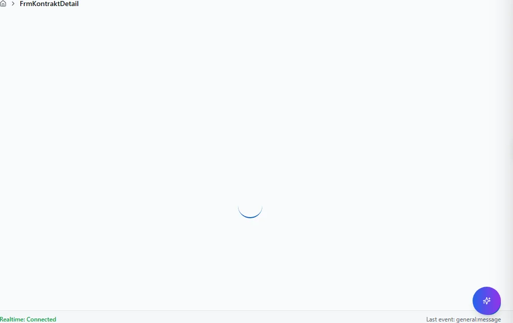

**Schritte:**

1. Sidebar oder Suche: **Frmkontraktdetail** öffnen (`/kontrakte/FrmKontraktDetail`).
2. Filter und Spalten nach Bedarf setzen; bei ListReport Zeilen per Doppelklick oder Aktion öffnen.
3. Bei Belegen: Kopfdaten prüfen, Positionen erfassen oder ändern, **Speichern** bzw. workflowgebundene Aktion (Freigabe, Folgebeleg) ausführen.
4. Ergebnis in Liste, Detailansicht oder Folgebeleg verifizieren; bei Fehlern Meldungstext und Status prüfen.

**Ergebnis:** Datensatz gespeichert, Liste aktualisiert oder Folgeprozess ausgelöst.

**Häufige Fehler:**

| Symptom | Ursache | Maßnahme |
|---------|---------|----------|
| Maske lädt nicht | Modul nicht freigeschaltet oder fehlende Berechtigung | Administrator: Modul/RBAC prüfen |
| Speichern fehlgeschlagen | Pflichtfeld, Status oder Validierung | Meldung lesen, Pflichtfelder ergänzen |
| Aktion ausgegraut | Workflow-Status oder Sperre | Vorbeleg freigeben oder Berechtigung klären |

### Frmkontraktprotokoll

**Route:** `/kontrakte/FrmKontraktProtokoll` · **Modul:** `@/pages/kontrakte/FrmKontraktProtokoll`

**Ziel:** Frmkontraktprotokoll in VALEO NeuroERP öffnen, Daten prüfen oder erfassen und das Ergebnis in Liste bzw. Folgebeleg kontrollieren.

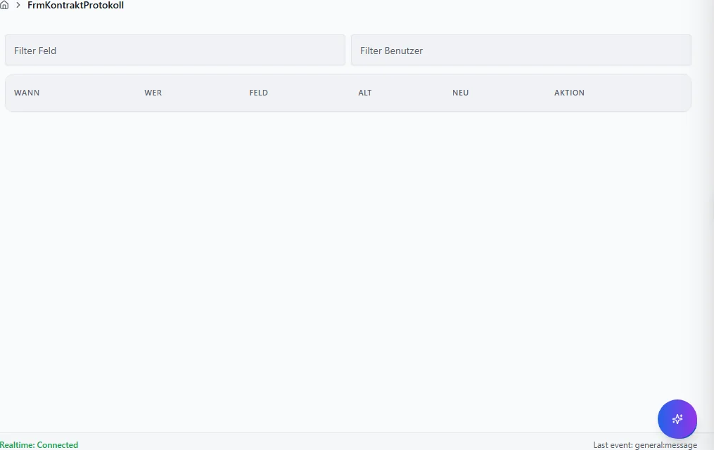

**Schritte:**

1. Sidebar oder Suche: **Frmkontraktprotokoll** öffnen (`/kontrakte/FrmKontraktProtokoll`).
2. Filter und Spalten nach Bedarf setzen; bei ListReport Zeilen per Doppelklick oder Aktion öffnen.
3. Bei Belegen: Kopfdaten prüfen, Positionen erfassen oder ändern, **Speichern** bzw. workflowgebundene Aktion (Freigabe, Folgebeleg) ausführen.
4. Ergebnis in Liste, Detailansicht oder Folgebeleg verifizieren; bei Fehlern Meldungstext und Status prüfen.

**Ergebnis:** Datensatz gespeichert, Liste aktualisiert oder Folgeprozess ausgelöst.

**Häufige Fehler:**

| Symptom | Ursache | Maßnahme |
|---------|---------|----------|
| Maske lädt nicht | Modul nicht freigeschaltet oder fehlende Berechtigung | Administrator: Modul/RBAC prüfen |
| Speichern fehlgeschlagen | Pflichtfeld, Status oder Validierung | Meldung lesen, Pflichtfelder ergänzen |
| Aktion ausgegraut | Workflow-Status oder Sperre | Vorbeleg freigeben oder Berechtigung klären |

### Kontraktalarmdashboard

**Route:** `/kontrakte/KontraktAlarmDashboard` · **Modul:** `@/pages/kontrakte/KontraktAlarmDashboard`

**Ziel:** Kontraktalarmdashboard in VALEO NeuroERP öffnen, Daten prüfen oder erfassen und das Ergebnis in Liste bzw. Folgebeleg kontrollieren.

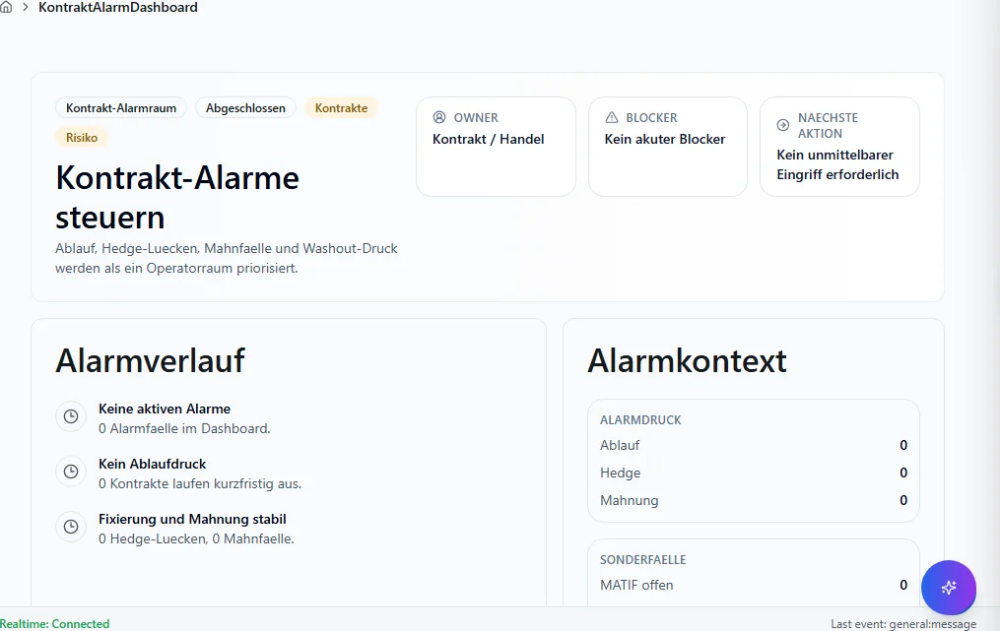

**Schritte:**

1. Sidebar oder Suche: **Kontraktalarmdashboard** öffnen (`/kontrakte/KontraktAlarmDashboard`).
2. Filter und Spalten nach Bedarf setzen; bei ListReport Zeilen per Doppelklick oder Aktion öffnen.
3. Bei Belegen: Kopfdaten prüfen, Positionen erfassen oder ändern, **Speichern** bzw. workflowgebundene Aktion (Freigabe, Folgebeleg) ausführen.
4. Ergebnis in Liste, Detailansicht oder Folgebeleg verifizieren; bei Fehlern Meldungstext und Status prüfen.

**Ergebnis:** Datensatz gespeichert, Liste aktualisiert oder Folgeprozess ausgelöst.

**Häufige Fehler:**

| Symptom | Ursache | Maßnahme |
|---------|---------|----------|
| Maske lädt nicht | Modul nicht freigeschaltet oder fehlende Berechtigung | Administrator: Modul/RBAC prüfen |
| Speichern fehlgeschlagen | Pflichtfeld, Status oder Validierung | Meldung lesen, Pflichtfelder ergänzen |
| Aktion ausgegraut | Workflow-Status oder Sperre | Vorbeleg freigeben oder Berechtigung klären |

### Kontraktpositionsmonitor

**Route:** `/kontrakte/KontraktPositionsmonitor` · **Modul:** `@/pages/kontrakte/KontraktPositionsmonitor`

**Ziel:** Kontraktpositionsmonitor in VALEO NeuroERP öffnen, Daten prüfen oder erfassen und das Ergebnis in Liste bzw. Folgebeleg kontrollieren.

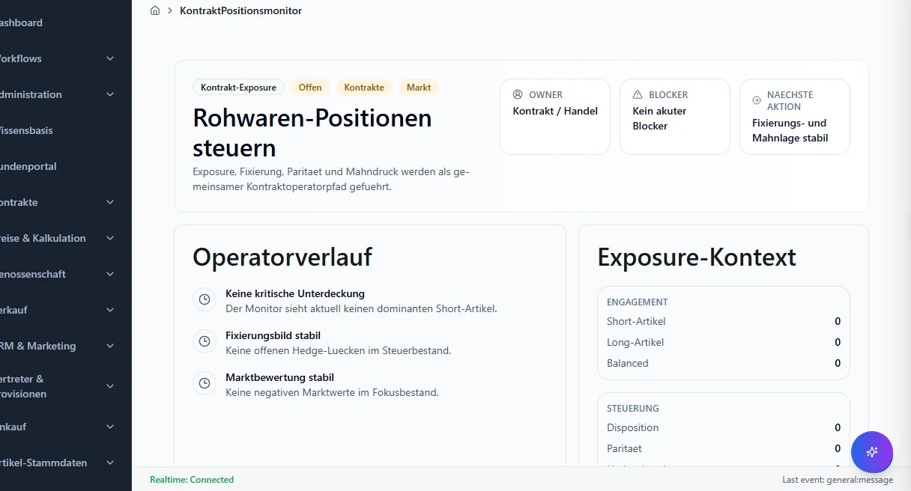

**Schritte:**

1. Sidebar oder Suche: **Kontraktpositionsmonitor** öffnen (`/kontrakte/KontraktPositionsmonitor`).
2. Filter und Spalten nach Bedarf setzen; bei ListReport Zeilen per Doppelklick oder Aktion öffnen.
3. Bei Belegen: Kopfdaten prüfen, Positionen erfassen oder ändern, **Speichern** bzw. workflowgebundene Aktion (Freigabe, Folgebeleg) ausführen.
4. Ergebnis in Liste, Detailansicht oder Folgebeleg verifizieren; bei Fehlern Meldungstext und Status prüfen.

**Ergebnis:** Datensatz gespeichert, Liste aktualisiert oder Folgeprozess ausgelöst.

**Häufige Fehler:**

| Symptom | Ursache | Maßnahme |
|---------|---------|----------|
| Maske lädt nicht | Modul nicht freigeschaltet oder fehlende Berechtigung | Administrator: Modul/RBAC prüfen |
| Speichern fehlgeschlagen | Pflichtfeld, Status oder Validierung | Meldung lesen, Pflichtfelder ergänzen |
| Aktion ausgegraut | Workflow-Status oder Sperre | Vorbeleg freigeben oder Berechtigung klären |

### Lstkontraktuebersicht

**Route:** `/kontrakte/LstKontraktUebersicht` · **Modul:** `@/pages/kontrakte/LstKontraktUebersicht`

**Ziel:** Lstkontraktuebersicht in VALEO NeuroERP öffnen, Daten prüfen oder erfassen und das Ergebnis in Liste bzw. Folgebeleg kontrollieren.

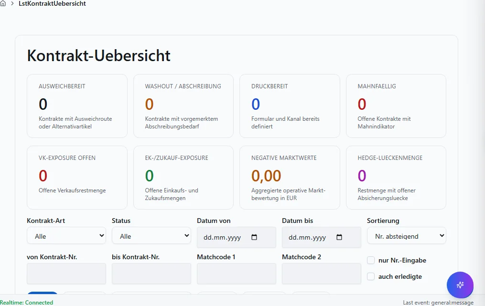

**Schritte:**

1. Sidebar oder Suche: **Lstkontraktuebersicht** öffnen (`/kontrakte/LstKontraktUebersicht`).
2. Filter und Spalten nach Bedarf setzen; bei ListReport Zeilen per Doppelklick oder Aktion öffnen.
3. Bei Belegen: Kopfdaten prüfen, Positionen erfassen oder ändern, **Speichern** bzw. workflowgebundene Aktion (Freigabe, Folgebeleg) ausführen.
4. Ergebnis in Liste, Detailansicht oder Folgebeleg verifizieren; bei Fehlern Meldungstext und Status prüfen.

**Ergebnis:** Datensatz gespeichert, Liste aktualisiert oder Folgeprozess ausgelöst.

**Häufige Fehler:**

| Symptom | Ursache | Maßnahme |
|---------|---------|----------|
| Maske lädt nicht | Modul nicht freigeschaltet oder fehlende Berechtigung | Administrator: Modul/RBAC prüfen |
| Speichern fehlgeschlagen | Pflichtfeld, Status oder Validierung | Meldung lesen, Pflichtfelder ergänzen |
| Aktion ausgegraut | Workflow-Status oder Sperre | Vorbeleg freigeben oder Berechtigung klären |

### Alarme

**Route:** `/kontrakte/alarme` · **Modul:** `@/pages/kontrakte/KontraktAlarmDashboard`

**Ziel:** Alarme in VALEO NeuroERP öffnen, Daten prüfen oder erfassen und das Ergebnis in Liste bzw. Folgebeleg kontrollieren.

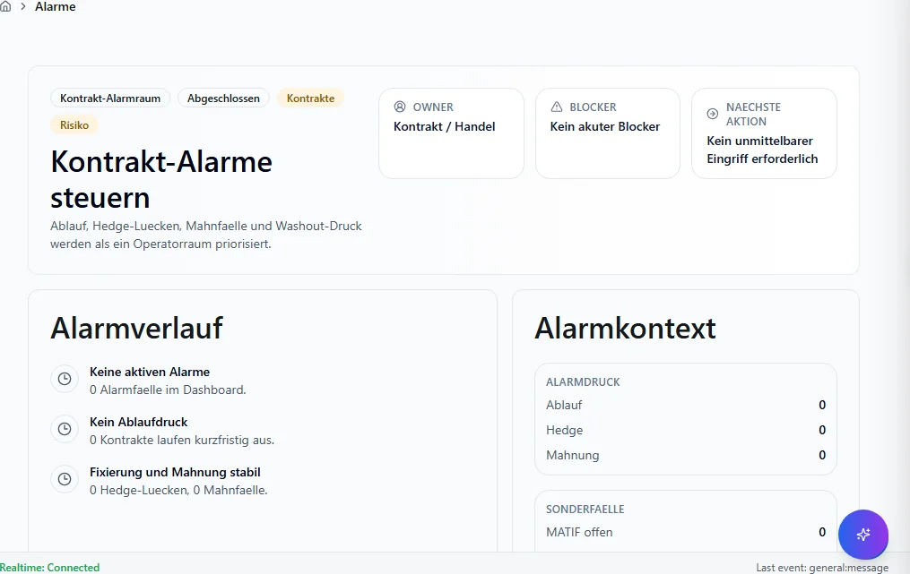

**Schritte:**

1. Sidebar oder Suche: **Alarme** öffnen (`/kontrakte/alarme`).
2. Filter und Spalten nach Bedarf setzen; bei ListReport Zeilen per Doppelklick oder Aktion öffnen.
3. Bei Belegen: Kopfdaten prüfen, Positionen erfassen oder ändern, **Speichern** bzw. workflowgebundene Aktion (Freigabe, Folgebeleg) ausführen.
4. Ergebnis in Liste, Detailansicht oder Folgebeleg verifizieren; bei Fehlern Meldungstext und Status prüfen.

**Ergebnis:** Datensatz gespeichert, Liste aktualisiert oder Folgeprozess ausgelöst.

**Häufige Fehler:**

| Symptom | Ursache | Maßnahme |
|---------|---------|----------|
| Maske lädt nicht | Modul nicht freigeschaltet oder fehlende Berechtigung | Administrator: Modul/RBAC prüfen |
| Speichern fehlgeschlagen | Pflichtfeld, Status oder Validierung | Meldung lesen, Pflichtfelder ergänzen |
| Aktion ausgegraut | Workflow-Status oder Sperre | Vorbeleg freigeben oder Berechtigung klären |

### Kontrakt Alarm Dashboard

**Route:** `/kontrakte/kontrakt-alarm-dashboard` · **Modul:** `@/pages/kontrakte/KontraktAlarmDashboard`

**Ziel:** Kontrakt Alarm Dashboard in VALEO NeuroERP öffnen, Daten prüfen oder erfassen und das Ergebnis in Liste bzw. Folgebeleg kontrollieren.

**Schritte:**

1. Sidebar oder Suche: **Kontrakt Alarm Dashboard** öffnen (`/kontrakte/kontrakt-alarm-dashboard`).
2. Filter und Spalten nach Bedarf setzen; bei ListReport Zeilen per Doppelklick oder Aktion öffnen.
3. Bei Belegen: Kopfdaten prüfen, Positionen erfassen oder ändern, **Speichern** bzw. workflowgebundene Aktion (Freigabe, Folgebeleg) ausführen.
4. Ergebnis in Liste, Detailansicht oder Folgebeleg verifizieren; bei Fehlern Meldungstext und Status prüfen.

**Ergebnis:** Datensatz gespeichert, Liste aktualisiert oder Folgeprozess ausgelöst.

**Häufige Fehler:**

| Symptom | Ursache | Maßnahme |
|---------|---------|----------|
| Maske lädt nicht | Modul nicht freigeschaltet oder fehlende Berechtigung | Administrator: Modul/RBAC prüfen |
| Speichern fehlgeschlagen | Pflichtfeld, Status oder Validierung | Meldung lesen, Pflichtfelder ergänzen |
| Aktion ausgegraut | Workflow-Status oder Sperre | Vorbeleg freigeben oder Berechtigung klären |

### Kontrakt Positionsmonitor

**Route:** `/kontrakte/kontrakt-positionsmonitor` · **Modul:** `@/pages/kontrakte/KontraktPositionsmonitor`

**Ziel:** Kontrakt Positionsmonitor in VALEO NeuroERP öffnen, Daten prüfen oder erfassen und das Ergebnis in Liste bzw. Folgebeleg kontrollieren.

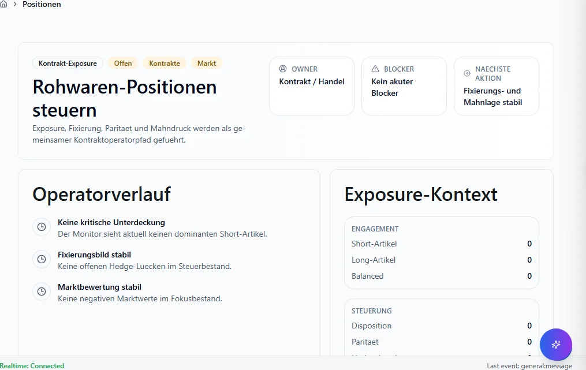

**Schritte:**

1. Sidebar oder Suche: **Kontrakt Positionsmonitor** öffnen (`/kontrakte/kontrakt-positionsmonitor`).
2. Filter und Spalten nach Bedarf setzen; bei ListReport Zeilen per Doppelklick oder Aktion öffnen.
3. Bei Belegen: Kopfdaten prüfen, Positionen erfassen oder ändern, **Speichern** bzw. workflowgebundene Aktion (Freigabe, Folgebeleg) ausführen.
4. Ergebnis in Liste, Detailansicht oder Folgebeleg verifizieren; bei Fehlern Meldungstext und Status prüfen.

**Ergebnis:** Datensatz gespeichert, Liste aktualisiert oder Folgeprozess ausgelöst.

**Häufige Fehler:**

| Symptom | Ursache | Maßnahme |
|---------|---------|----------|
| Maske lädt nicht | Modul nicht freigeschaltet oder fehlende Berechtigung | Administrator: Modul/RBAC prüfen |
| Speichern fehlgeschlagen | Pflichtfeld, Status oder Validierung | Meldung lesen, Pflichtfelder ergänzen |
| Aktion ausgegraut | Workflow-Status oder Sperre | Vorbeleg freigeben oder Berechtigung klären |

### Kontrakt Uebersicht

**Route:** `/kontrakte/kontrakt-uebersicht` · **Modul:** `@/pages/kontrakte/LstKontraktUebersicht`

**Ziel:** Kontrakt Uebersicht in VALEO NeuroERP öffnen, Daten prüfen oder erfassen und das Ergebnis in Liste bzw. Folgebeleg kontrollieren.

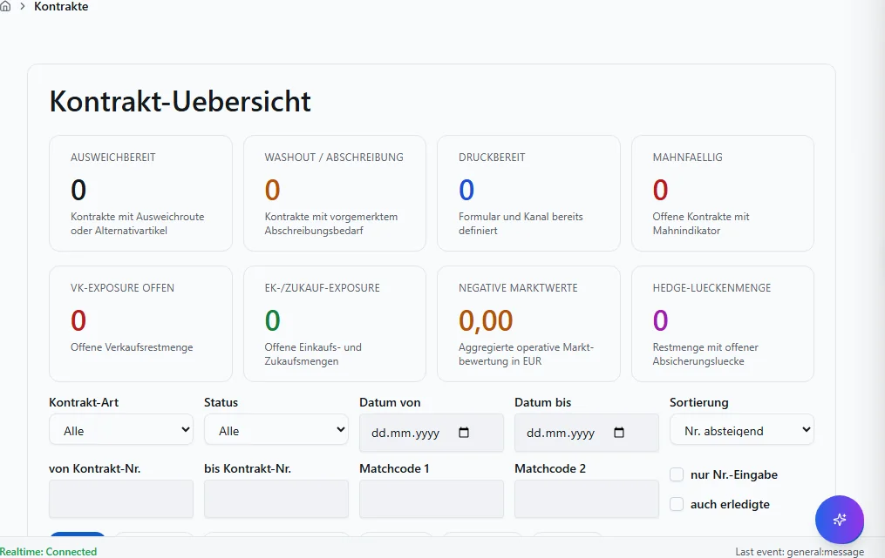

**Schritte:**

1. Sidebar oder Suche: **Kontrakt Uebersicht** öffnen (`/kontrakte/kontrakt-uebersicht`).
2. Filter und Spalten nach Bedarf setzen; bei ListReport Zeilen per Doppelklick oder Aktion öffnen.
3. Bei Belegen: Kopfdaten prüfen, Positionen erfassen oder ändern, **Speichern** bzw. workflowgebundene Aktion (Freigabe, Folgebeleg) ausführen.
4. Ergebnis in Liste, Detailansicht oder Folgebeleg verifizieren; bei Fehlern Meldungstext und Status prüfen.

**Ergebnis:** Datensatz gespeichert, Liste aktualisiert oder Folgeprozess ausgelöst.

**Häufige Fehler:**

| Symptom | Ursache | Maßnahme |
|---------|---------|----------|
| Maske lädt nicht | Modul nicht freigeschaltet oder fehlende Berechtigung | Administrator: Modul/RBAC prüfen |
| Speichern fehlgeschlagen | Pflichtfeld, Status oder Validierung | Meldung lesen, Pflichtfelder ergänzen |
| Aktion ausgegraut | Workflow-Status oder Sperre | Vorbeleg freigeben oder Berechtigung klären |

### Kontraktklassen

**Route:** `/kontrakte/kontraktklassen` · **Modul:** `@/pages/kontrakte/kontraktklassen`

**Ziel:** Kontraktklassen in VALEO NeuroERP öffnen, Daten prüfen oder erfassen und das Ergebnis in Liste bzw. Folgebeleg kontrollieren.

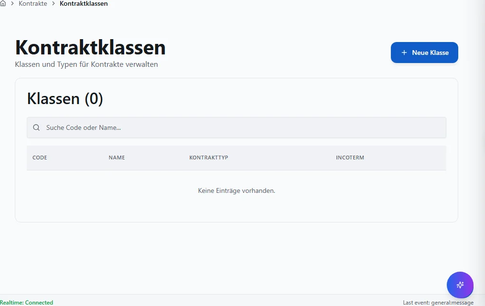

**Schritte:**

1. Sidebar oder Suche: **Kontraktklassen** öffnen (`/kontrakte/kontraktklassen`).
2. Filter und Spalten nach Bedarf setzen; bei ListReport Zeilen per Doppelklick oder Aktion öffnen.
3. Bei Belegen: Kopfdaten prüfen, Positionen erfassen oder ändern, **Speichern** bzw. workflowgebundene Aktion (Freigabe, Folgebeleg) ausführen.
4. Ergebnis in Liste, Detailansicht oder Folgebeleg verifizieren; bei Fehlern Meldungstext und Status prüfen.

**Ergebnis:** Datensatz gespeichert, Liste aktualisiert oder Folgeprozess ausgelöst.

**Häufige Fehler:**

| Symptom | Ursache | Maßnahme |
|---------|---------|----------|
| Maske lädt nicht | Modul nicht freigeschaltet oder fehlende Berechtigung | Administrator: Modul/RBAC prüfen |
| Speichern fehlgeschlagen | Pflichtfeld, Status oder Validierung | Meldung lesen, Pflichtfelder ergänzen |
| Aktion ausgegraut | Workflow-Status oder Sperre | Vorbeleg freigeben oder Berechtigung klären |

### Mengenzeitraeume

**Route:** `/kontrakte/mengenzeitraeume` · **Modul:** `@/pages/kontrakte/mengenzeitraeume`

**Ziel:** Mengenzeitraeume in VALEO NeuroERP öffnen, Daten prüfen oder erfassen und das Ergebnis in Liste bzw. Folgebeleg kontrollieren.

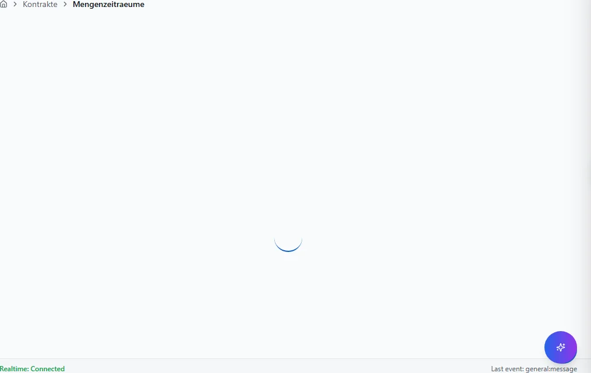

**Schritte:**

1. Sidebar oder Suche: **Mengenzeitraeume** öffnen (`/kontrakte/mengenzeitraeume`).
2. Filter und Spalten nach Bedarf setzen; bei ListReport Zeilen per Doppelklick oder Aktion öffnen.
3. Bei Belegen: Kopfdaten prüfen, Positionen erfassen oder ändern, **Speichern** bzw. workflowgebundene Aktion (Freigabe, Folgebeleg) ausführen.
4. Ergebnis in Liste, Detailansicht oder Folgebeleg verifizieren; bei Fehlern Meldungstext und Status prüfen.

**Ergebnis:** Datensatz gespeichert, Liste aktualisiert oder Folgeprozess ausgelöst.

**Häufige Fehler:**

| Symptom | Ursache | Maßnahme |
|---------|---------|----------|
| Maske lädt nicht | Modul nicht freigeschaltet oder fehlende Berechtigung | Administrator: Modul/RBAC prüfen |
| Speichern fehlgeschlagen | Pflichtfeld, Status oder Validierung | Meldung lesen, Pflichtfelder ergänzen |
| Aktion ausgegraut | Workflow-Status oder Sperre | Vorbeleg freigeben oder Berechtigung klären |

### Neu

**Route:** `/kontrakte/neu` · **Modul:** `@/pages/kontrakte/FrmKontraktDetail`

**Ziel:** Neu in VALEO NeuroERP öffnen, Daten prüfen oder erfassen und das Ergebnis in Liste bzw. Folgebeleg kontrollieren.

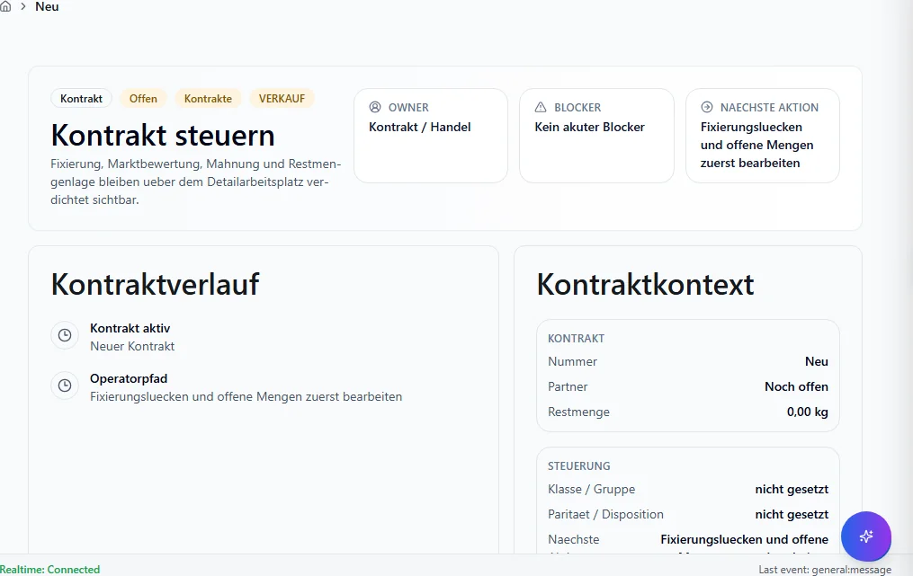

**Schritte:**

1. Sidebar oder Suche: **Neu** öffnen (`/kontrakte/neu`).
2. Filter und Spalten nach Bedarf setzen; bei ListReport Zeilen per Doppelklick oder Aktion öffnen.
3. Bei Belegen: Kopfdaten prüfen, Positionen erfassen oder ändern, **Speichern** bzw. workflowgebundene Aktion (Freigabe, Folgebeleg) ausführen.
4. Ergebnis in Liste, Detailansicht oder Folgebeleg verifizieren; bei Fehlern Meldungstext und Status prüfen.

**Ergebnis:** Datensatz gespeichert, Liste aktualisiert oder Folgeprozess ausgelöst.

**Häufige Fehler:**

| Symptom | Ursache | Maßnahme |
|---------|---------|----------|
| Maske lädt nicht | Modul nicht freigeschaltet oder fehlende Berechtigung | Administrator: Modul/RBAC prüfen |
| Speichern fehlgeschlagen | Pflichtfeld, Status oder Validierung | Meldung lesen, Pflichtfelder ergänzen |
| Aktion ausgegraut | Workflow-Status oder Sperre | Vorbeleg freigeben oder Berechtigung klären |

### Positionen

**Route:** `/kontrakte/positionen` · **Modul:** `@/pages/kontrakte/KontraktPositionsmonitor`

**Ziel:** Positionen in VALEO NeuroERP öffnen, Daten prüfen oder erfassen und das Ergebnis in Liste bzw. Folgebeleg kontrollieren.

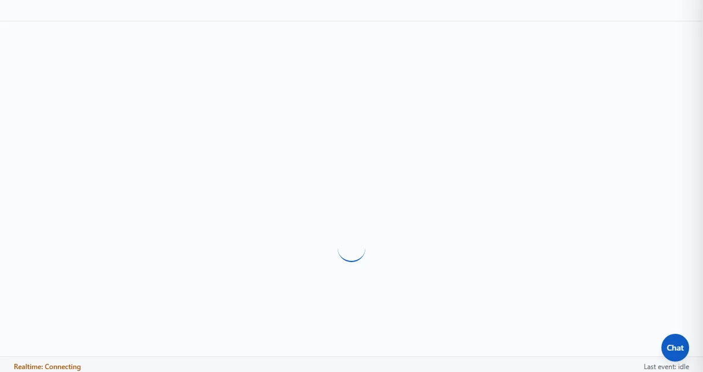

**Schritte:**

1. Sidebar oder Suche: **Positionen** öffnen (`/kontrakte/positionen`).
2. Filter und Spalten nach Bedarf setzen; bei ListReport Zeilen per Doppelklick oder Aktion öffnen.
3. Bei Belegen: Kopfdaten prüfen, Positionen erfassen oder ändern, **Speichern** bzw. workflowgebundene Aktion (Freigabe, Folgebeleg) ausführen.
4. Ergebnis in Liste, Detailansicht oder Folgebeleg verifizieren; bei Fehlern Meldungstext und Status prüfen.

**Ergebnis:** Datensatz gespeichert, Liste aktualisiert oder Folgeprozess ausgelöst.

**Häufige Fehler:**

| Symptom | Ursache | Maßnahme |
|---------|---------|----------|
| Maske lädt nicht | Modul nicht freigeschaltet oder fehlende Berechtigung | Administrator: Modul/RBAC prüfen |
| Speichern fehlgeschlagen | Pflichtfeld, Status oder Validierung | Meldung lesen, Pflichtfelder ergänzen |
| Aktion ausgegraut | Workflow-Status oder Sperre | Vorbeleg freigeben oder Berechtigung klären |

### :Id

**Route:** `/vertrag/:id` · **Modul:** `@/pages/kontrakte/FrmKontraktDetail`

**Ziel:** :Id in VALEO NeuroERP öffnen, Daten prüfen oder erfassen und das Ergebnis in Liste bzw. Folgebeleg kontrollieren.

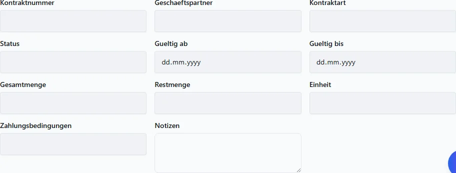

**Schritte:**

1. Sidebar oder Suche: **:Id** öffnen (`/vertrag/:id`).
2. Filter und Spalten nach Bedarf setzen; bei ListReport Zeilen per Doppelklick oder Aktion öffnen.
3. Bei Belegen: Kopfdaten prüfen, Positionen erfassen oder ändern, **Speichern** bzw. workflowgebundene Aktion (Freigabe, Folgebeleg) ausführen.
4. Ergebnis in Liste, Detailansicht oder Folgebeleg verifizieren; bei Fehlern Meldungstext und Status prüfen.

**Ergebnis:** Datensatz gespeichert, Liste aktualisiert oder Folgeprozess ausgelöst.

**Häufige Fehler:**

| Symptom | Ursache | Maßnahme |
|---------|---------|----------|
| Maske lädt nicht | Modul nicht freigeschaltet oder fehlende Berechtigung | Administrator: Modul/RBAC prüfen |
| Speichern fehlgeschlagen | Pflichtfeld, Status oder Validierung | Meldung lesen, Pflichtfelder ergänzen |
| Aktion ausgegraut | Workflow-Status oder Sperre | Vorbeleg freigeben oder Berechtigung klären |

### Neu

**Route:** `/vertrag/neu` · **Modul:** `@/pages/kontrakte/FrmKontraktDetail`

**Ziel:** Neu in VALEO NeuroERP öffnen, Daten prüfen oder erfassen und das Ergebnis in Liste bzw. Folgebeleg kontrollieren.

**Schritte:**

1. Sidebar oder Suche: **Neu** öffnen (`/vertrag/neu`).
2. Filter und Spalten nach Bedarf setzen; bei ListReport Zeilen per Doppelklick oder Aktion öffnen.
3. Bei Belegen: Kopfdaten prüfen, Positionen erfassen oder ändern, **Speichern** bzw. workflowgebundene Aktion (Freigabe, Folgebeleg) ausführen.
4. Ergebnis in Liste, Detailansicht oder Folgebeleg verifizieren; bei Fehlern Meldungstext und Status prüfen.

**Ergebnis:** Datensatz gespeichert, Liste aktualisiert oder Folgeprozess ausgelöst.

**Häufige Fehler:**

| Symptom | Ursache | Maßnahme |
|---------|---------|----------|
| Maske lädt nicht | Modul nicht freigeschaltet oder fehlende Berechtigung | Administrator: Modul/RBAC prüfen |
| Speichern fehlgeschlagen | Pflichtfeld, Status oder Validierung | Meldung lesen, Pflichtfelder ergänzen |
| Aktion ausgegraut | Workflow-Status oder Sperre | Vorbeleg freigeben oder Berechtigung klären |

### Rahmenvertraege

**Route:** `/vertrag/rahmenvertraege` · **Modul:** `@/pages/vertrag/rahmenvertraege`

**Ziel:** Rahmenvertraege in VALEO NeuroERP öffnen, Daten prüfen oder erfassen und das Ergebnis in Liste bzw. Folgebeleg kontrollieren.

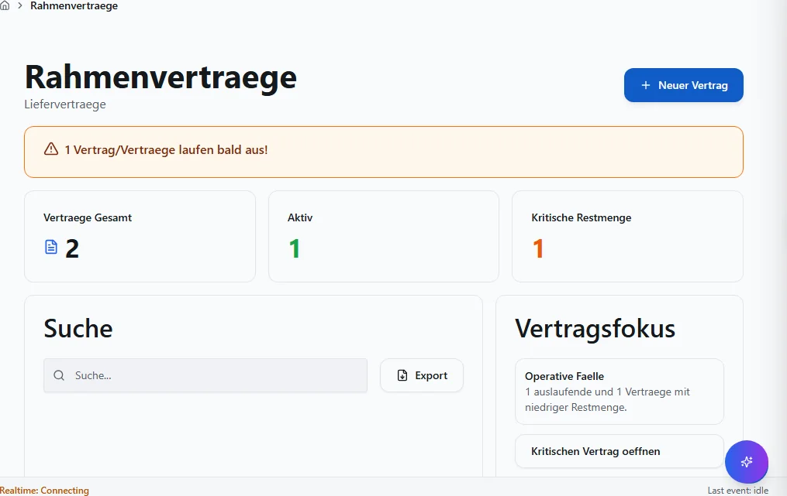

**Schritte:**

1. Sidebar oder Suche: **Rahmenvertraege** öffnen (`/vertrag/rahmenvertraege`).
2. Filter und Spalten nach Bedarf setzen; bei ListReport Zeilen per Doppelklick oder Aktion öffnen.
3. Bei Belegen: Kopfdaten prüfen, Positionen erfassen oder ändern, **Speichern** bzw. workflowgebundene Aktion (Freigabe, Folgebeleg) ausführen.
4. Ergebnis in Liste, Detailansicht oder Folgebeleg verifizieren; bei Fehlern Meldungstext und Status prüfen.

**Ergebnis:** Datensatz gespeichert, Liste aktualisiert oder Folgeprozess ausgelöst.

**Häufige Fehler:**

| Symptom | Ursache | Maßnahme |
|---------|---------|----------|
| Maske lädt nicht | Modul nicht freigeschaltet oder fehlende Berechtigung | Administrator: Modul/RBAC prüfen |
| Speichern fehlgeschlagen | Pflichtfeld, Status oder Validierung | Meldung lesen, Pflichtfelder ergänzen |
| Aktion ausgegraut | Workflow-Status oder Sperre | Vorbeleg freigeben oder Berechtigung klären |

## Quellen und Reverse-Pflege

- `packages/frontend-web/src/app/navigation/domains/*.tsx` — Sidebar-Navigation.
- `packages/frontend-web/src/app/routing/route-inventory.gen.json` — Routen-Inventar.
- `docs/MASKEN.md` — Layout-Standard (Gewohnheits-Prinzip).

Reverse-Pflege: Bei neuen Routen Generator `scripts/generate_benutzerhandbuch_full.py`
ausführen; `mkdocs.yml`, `index.md` und `generate_inapp_help_map.py` mitziehen.
