# Agrar-Warenwirtschaft

PSM, Düngung, Saatgut, Feldbuch, Tierhaltung.

## Ziel

Sie arbeiten sicher in allen Masken des Bereichs **Agrar-Warenwirtschaft** — von der Navigation
bis zu Speichern, Freigabe und Folgebelegen.

## Voraussetzungen

- Gültige Anmeldung und Mandant (`X-Tenant-ID`).
- Modul für diesen Fachbereich ist installiert (siehe Administration → Module).
- Ihre Rolle hat Lese- bzw. Schreibberechtigung für die jeweilige Maske.

## Maskenregister

Vollständige Abdeckung: **91** App-Routen
(0 explizit in der Sidebar-Navigation).

| Maske | Route | Modul |
|-------|-------|-------|
| Agrar | `/agrar` | `@/pages/agrar/aussaat/liste` |
| Aussaat | `/agrar/aussaat` | `@/pages/agrar/aussaat/liste` |
| :Id | `/agrar/aussaat/:id` | `@/pages/agrar/aussaat/liste` |
| Liste | `/agrar/aussaat/liste` | `@/pages/agrar/aussaat/liste` |
| Neu | `/agrar/aussaat/neu` | `@/pages/agrar/aussaat/liste` |
| Biostimulanzien | `/agrar/biostimulanzien` | `@/pages/agrar/biostimulanzien-liste` |
| Biostimulanzien Liste | `/agrar/biostimulanzien-liste` | `@/pages/agrar/biostimulanzien-liste` |
| Biostimulanzien Stamm | `/agrar/biostimulanzien-stamm` | `@/pages/agrar/biostimulanzien-liste` |
| :Id | `/agrar/biostimulanzien-stamm/:id` | `@/pages/agrar/biostimulanzien-liste` |
| :Id | `/agrar/bodenprobe/:id` | `@/pages/agrar/bodenproben/liste` |
| Neu | `/agrar/bodenprobe/neu` | `@/pages/agrar/bodenproben/liste` |
| Bodenproben | `/agrar/bodenproben` | `@/pages/agrar/bodenproben/liste` |
| Liste | `/agrar/bodenproben/liste` | `@/pages/agrar/bodenproben/liste` |
| Duenger | `/agrar/duenger` | `@/pages/agrar/duenger/liste` |
| Duenger Liste | `/agrar/duenger-liste` | `@/pages/agrar/duenger-liste` |
| Duenger Stamm | `/agrar/duenger-stamm` | `@/pages/agrar/duenger-stamm` |
| :Id | `/agrar/duenger-stamm/:id` | `@/pages/agrar/duenger-stamm` |
| :Id | `/agrar/duenger/:id` | `@/pages/agrar/duenger-native` |
| Bedarfsrechner | `/agrar/duenger/bedarfsrechner` | `@/pages/agrar/duenger/bedarfsrechner` |
| Liste | `/agrar/duenger/liste` | `@/pages/agrar/duenger/liste` |
| Mischungen | `/agrar/duenger/mischungen` | `@/pages/agrar/duenger/mischungen` |
| Stamm | `/agrar/duenger/stamm` | `@/pages/agrar/duenger/stamm` |
| :Id | `/agrar/duenger/stamm/:id` | `@/pages/agrar/duenger/stamm` |
| Edit | `/agrar/duenger/stamm/:id/edit` | `@/pages/agrar/duenger/stamm` |
| Planung | `/agrar/duengung/planung` | `@/pages/agrar/duengung/planung` |
| Ernte | `/agrar/ernte` | `@/pages/agrar/ernte/liste` |
| Ernte Annahme Erfassung | `/agrar/ernte-annahme-erfassung` | `@/pages/agrar/ernte-annahme-erfassung` |
| :Id | `/agrar/ernte-annahme-erfassung/:id` | `@/pages/agrar/ernte-annahme-erfassung` |
| :Id | `/agrar/ernte/:id` | `@/pages/agrar/ernte-annahme-erfassung` |
| Liste | `/agrar/ernte/liste` | `@/pages/agrar/ernte/liste` |
| Neu | `/agrar/ernte/neu` | `@/pages/agrar/ernte/neu` |
| Erntefenster Konfig | `/agrar/erntefenster-konfig` | `@/pages/agrar/erntefenster-konfig` |
| :Id | `/agrar/feldbuch/massnahme/:id` | `@/pages/agrar/feldbuch/massnahmen` |
| Neu | `/agrar/feldbuch/massnahme/neu` | `@/pages/agrar/feldbuch/massnahmen` |
| Massnahmen | `/agrar/feldbuch/massnahmen` | `@/pages/agrar/feldbuch/massnahmen` |
| :Id | `/agrar/feldbuch/schlag/:id` | `@/pages/agrar/feldbuch/schlagkartei` |
| Neu | `/agrar/feldbuch/schlag/neu` | `@/pages/agrar/feldbuch/schlag/neu` |
| Schlagkartei | `/agrar/feldbuch/schlagkartei` | `@/pages/agrar/feldbuch/schlagkartei` |
| :Id | `/agrar/harvest-settlement/:id` | `@/pages/agrar/ernte-abrechnung-native` |
| Kontrakt Engagement | `/agrar/kontrakt-engagement` | `@/pages/agrar/kontrakt-engagement` |
| Kontrakt Erfuellung | `/agrar/kontrakt-erfuellung` | `@/pages/agrar/kontrakt-erfuellung` |
| Kontrakt Fixierung | `/agrar/kontrakt-fixierung` | `@/pages/agrar/kontrakt-fixierung` |
| Kontrakt Settlement | `/agrar/kontrakt-settlement` | `@/pages/agrar/kontrakt-settlement` |
| Kulturpflanzen | `/agrar/kulturpflanzen` | `@/pages/agrar/kulturpflanzen/liste` |
| :Id | `/agrar/kulturpflanzen/:id` | `@/pages/agrar/kulturpflanzen/liste` |
| Liste | `/agrar/kulturpflanzen/liste` | `@/pages/agrar/kulturpflanzen/liste` |
| Neu | `/agrar/kulturpflanzen/neu` | `@/pages/agrar/kulturpflanzen/liste` |
| Kunden Schlagkartei | `/agrar/kunden-schlagkartei` | `@/pages/agrar/kunden-schlagkartei` |
| :Kunden Nr | `/agrar/kunden-schlagkartei/:kunden_nr` | `@/pages/agrar/kunden-schlagkartei` |
| Maschinenauslastung | `/agrar/maschinenauslastung` | `@/pages/agrar/maschinenauslastung` |
| Milchvieh Crosssell | `/agrar/milchvieh-crosssell` | `@/pages/agrar/milchvieh-crosssell` |
| Milchvieh Karte | `/agrar/milchvieh-karte` | `@/pages/agrar/milchvieh-karte` |
| Applikation | `/agrar/pflanzenschutz/applikation` | `@/pages/agrar/pflanzenschutz/applikation` |
| Psm | `/agrar/psm` | `@/pages/agrar/psm/liste` |
| Abgabedokumentation | `/agrar/psm/abgabedokumentation` | `@/pages/agrar/psm/abgabedokumentation` |
| Auflagen Manager | `/agrar/psm/auflagen-manager` | `@/pages/agrar/psm/auflagen-manager` |
| Bearbeiten | `/agrar/psm/auflagen/:id/bearbeiten` | `@/pages/agrar/psm/auflagen-manager` |
| Beratung | `/agrar/psm/beratung` | `@/pages/agrar/psm/beratung` |
| Liste | `/agrar/psm/liste` | `@/pages/agrar/psm/liste` |
| Resistenz | `/agrar/psm/resistenz` | `@/pages/agrar/psm/resistenz` |
| Sachkunde Register | `/agrar/psm/sachkunde-register` | `@/pages/agrar/psm/sachkunde-register` |
| Edit | `/agrar/psm/sachkunde/:id/edit` | `@/pages/agrar/psm/sachkunde-register` |
| Neu | `/agrar/psm/sachkunde/neu` | `@/pages/agrar/psm/sachkunde-register` |
| Stamm | `/agrar/psm/stamm` | `@/pages/agrar/psm/stamm` |
| :Id | `/agrar/psm/stamm/:id` | `@/pages/agrar/psm/stamm` |
| Wasserschutz | `/agrar/psm/wasserschutz` | `@/pages/agrar/psm/wasserschutz` |
| Rohwarengruppen | `/agrar/rohwarengruppen` | `@/pages/agrar/rohwarengruppen` |
| Saatgut | `/agrar/saatgut` | `@/pages/agrar/saatgut-liste` |
| Saatgut Liste | `/agrar/saatgut-liste` | `@/pages/agrar/saatgut-liste` |
| Saatgut Stamm | `/agrar/saatgut-stamm` | `@/pages/agrar/saatgut-stamm` |
| :Id | `/agrar/saatgut-stamm/:id` | `@/pages/agrar/saatgut-stamm` |
| :Id | `/agrar/saatgut/:id` | `@/pages/agrar/saatgut-native` |
| Bestellung | `/agrar/saatgut/bestellung` | `@/pages/agrar/saatgut/bestellung` |
| Liste | `/agrar/saatgut/liste` | `@/pages/agrar/saatgut/liste` |
| :Id | `/agrar/saatgut/sorte/:id` | `@/pages/agrar/saatgut/sortenregister` |
| Neu | `/agrar/saatgut/sorte/neu` | `@/pages/agrar/saatgut/sortenregister` |
| Sortenregister | `/agrar/saatgut/sortenregister` | `@/pages/agrar/saatgut/sortenregister` |
| Stamm | `/agrar/saatgut/stamm` | `@/pages/agrar/saatgut/stamm` |
| :Id | `/agrar/saatgut/stamm/:id` | `@/pages/agrar/saatgut/stamm` |
| Saatzucht | `/agrar/saatzucht` | `@/pages/agrar/saatzucht` |
| Sammelabrechnung | `/agrar/sammelabrechnung` | `@/pages/agrar/sammelabrechnung` |
| Karte | `/agrar/schlaege/karte` | `@/pages/agrar/schlaege/karte` |
| Vermehrungsvertraege | `/agrar/vermehrungsvertraege` | `@/pages/agrar/vermehrungsvertraege` |
| Wetterwarnung | `/agrar/wetterwarnung` | `@/pages/agrar/wetterwarnung` |
| Zinsabrechnung | `/agrar/zinsabrechnung` | `@/pages/agrar/zinsabrechnung` |
| Farmers | `/agribusiness/farmers` | `@/pages/agribusiness/farmers` |
| Field Service Task Edit | `/agribusiness/field-service-task-edit` | `@/pages/agribusiness/field-service-task-edit` |
| Field Service Task Neu | `/agribusiness/field-service-task-neu` | `@/pages/agribusiness/field-service-task-neu` |
| Field Service Tasks | `/agribusiness/field-service-tasks` | `@/pages/agribusiness/field-service-tasks` |
| Bearbeiten | `/agribusiness/field-service-tasks/:taskId/bearbeiten` | `@/pages/agribusiness/field-service-task-edit` |
| Neu | `/agribusiness/field-service-tasks/neu` | `@/pages/agribusiness/field-service-task-neu` |

## Masken im Detail

Für jede Route: Navigation, Bearbeitung, Ergebnis und typische Fehler.

### Agrar

**Route:** `/agrar` · **Modul:** `@/pages/agrar/aussaat/liste`

**Ziel:** Agrar in VALEO NeuroERP öffnen, Daten prüfen oder erfassen und das Ergebnis in Liste bzw. Folgebeleg kontrollieren.

**Schritte:**

1. Sidebar oder Suche: **Agrar** öffnen (`/agrar`).
2. Filter und Spalten nach Bedarf setzen; bei ListReport Zeilen per Doppelklick oder Aktion öffnen.
3. Bei Belegen: Kopfdaten prüfen, Positionen erfassen oder ändern, **Speichern** bzw. workflowgebundene Aktion (Freigabe, Folgebeleg) ausführen.
4. Ergebnis in Liste, Detailansicht oder Folgebeleg verifizieren; bei Fehlern Meldungstext und Status prüfen.

**Ergebnis:** Datensatz gespeichert, Liste aktualisiert oder Folgeprozess ausgelöst.

**Häufige Fehler:**

| Symptom | Ursache | Maßnahme |
|---------|---------|----------|
| Maske lädt nicht | Modul nicht freigeschaltet oder fehlende Berechtigung | Administrator: Modul/RBAC prüfen |
| Speichern fehlgeschlagen | Pflichtfeld, Status oder Validierung | Meldung lesen, Pflichtfelder ergänzen |
| Aktion ausgegraut | Workflow-Status oder Sperre | Vorbeleg freigeben oder Berechtigung klären |

### Aussaat

**Route:** `/agrar/aussaat` · **Modul:** `@/pages/agrar/aussaat/liste`

**Ziel:** Aussaat in VALEO NeuroERP öffnen, Daten prüfen oder erfassen und das Ergebnis in Liste bzw. Folgebeleg kontrollieren.

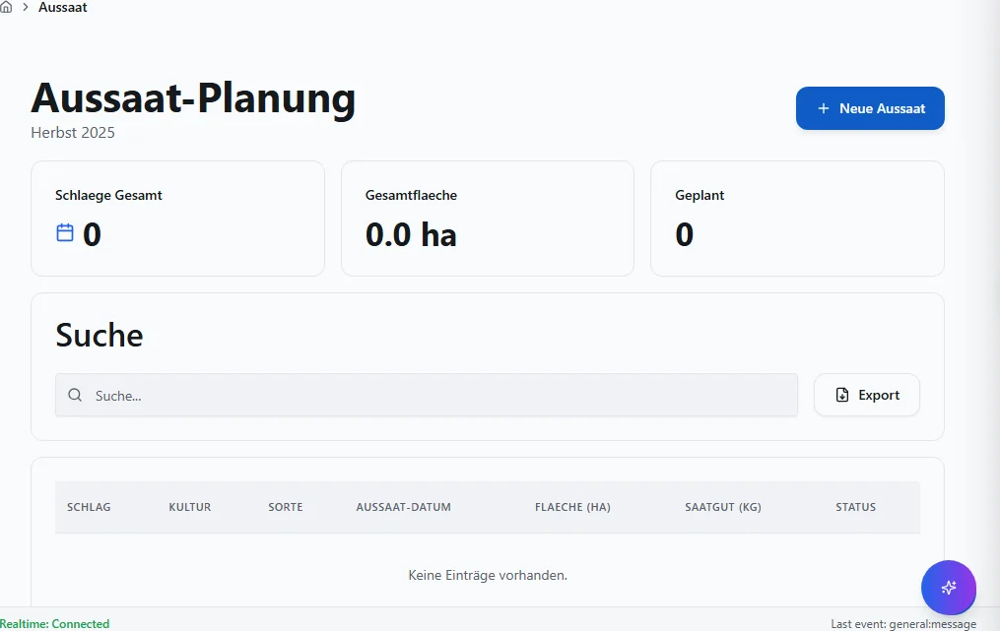

**Schritte:**

1. Sidebar oder Suche: **Aussaat** öffnen (`/agrar/aussaat`).
2. Filter und Spalten nach Bedarf setzen; bei ListReport Zeilen per Doppelklick oder Aktion öffnen.
3. Bei Belegen: Kopfdaten prüfen, Positionen erfassen oder ändern, **Speichern** bzw. workflowgebundene Aktion (Freigabe, Folgebeleg) ausführen.
4. Ergebnis in Liste, Detailansicht oder Folgebeleg verifizieren; bei Fehlern Meldungstext und Status prüfen.

**Ergebnis:** Datensatz gespeichert, Liste aktualisiert oder Folgeprozess ausgelöst.

**Häufige Fehler:**

| Symptom | Ursache | Maßnahme |
|---------|---------|----------|
| Maske lädt nicht | Modul nicht freigeschaltet oder fehlende Berechtigung | Administrator: Modul/RBAC prüfen |
| Speichern fehlgeschlagen | Pflichtfeld, Status oder Validierung | Meldung lesen, Pflichtfelder ergänzen |
| Aktion ausgegraut | Workflow-Status oder Sperre | Vorbeleg freigeben oder Berechtigung klären |

### :Id

**Route:** `/agrar/aussaat/:id` · **Modul:** `@/pages/agrar/aussaat/liste`

**Ziel:** :Id in VALEO NeuroERP öffnen, Daten prüfen oder erfassen und das Ergebnis in Liste bzw. Folgebeleg kontrollieren.

**Schritte:**

1. Sidebar oder Suche: **:Id** öffnen (`/agrar/aussaat/:id`).
2. Filter und Spalten nach Bedarf setzen; bei ListReport Zeilen per Doppelklick oder Aktion öffnen.
3. Bei Belegen: Kopfdaten prüfen, Positionen erfassen oder ändern, **Speichern** bzw. workflowgebundene Aktion (Freigabe, Folgebeleg) ausführen.
4. Ergebnis in Liste, Detailansicht oder Folgebeleg verifizieren; bei Fehlern Meldungstext und Status prüfen.

**Ergebnis:** Datensatz gespeichert, Liste aktualisiert oder Folgeprozess ausgelöst.

**Häufige Fehler:**

| Symptom | Ursache | Maßnahme |
|---------|---------|----------|
| Maske lädt nicht | Modul nicht freigeschaltet oder fehlende Berechtigung | Administrator: Modul/RBAC prüfen |
| Speichern fehlgeschlagen | Pflichtfeld, Status oder Validierung | Meldung lesen, Pflichtfelder ergänzen |
| Aktion ausgegraut | Workflow-Status oder Sperre | Vorbeleg freigeben oder Berechtigung klären |

### Liste

**Route:** `/agrar/aussaat/liste` · **Modul:** `@/pages/agrar/aussaat/liste`

**Ziel:** Liste in VALEO NeuroERP öffnen, Daten prüfen oder erfassen und das Ergebnis in Liste bzw. Folgebeleg kontrollieren.

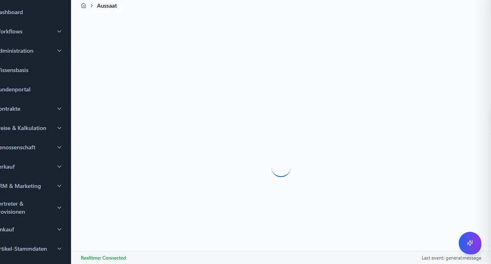

**Schritte:**

1. Sidebar oder Suche: **Liste** öffnen (`/agrar/aussaat/liste`).
2. Filter und Spalten nach Bedarf setzen; bei ListReport Zeilen per Doppelklick oder Aktion öffnen.
3. Bei Belegen: Kopfdaten prüfen, Positionen erfassen oder ändern, **Speichern** bzw. workflowgebundene Aktion (Freigabe, Folgebeleg) ausführen.
4. Ergebnis in Liste, Detailansicht oder Folgebeleg verifizieren; bei Fehlern Meldungstext und Status prüfen.

**Ergebnis:** Datensatz gespeichert, Liste aktualisiert oder Folgeprozess ausgelöst.

**Häufige Fehler:**

| Symptom | Ursache | Maßnahme |
|---------|---------|----------|
| Maske lädt nicht | Modul nicht freigeschaltet oder fehlende Berechtigung | Administrator: Modul/RBAC prüfen |
| Speichern fehlgeschlagen | Pflichtfeld, Status oder Validierung | Meldung lesen, Pflichtfelder ergänzen |
| Aktion ausgegraut | Workflow-Status oder Sperre | Vorbeleg freigeben oder Berechtigung klären |

### Neu

**Route:** `/agrar/aussaat/neu` · **Modul:** `@/pages/agrar/aussaat/liste`

**Ziel:** Neu in VALEO NeuroERP öffnen, Daten prüfen oder erfassen und das Ergebnis in Liste bzw. Folgebeleg kontrollieren.

**Schritte:**

1. Sidebar oder Suche: **Neu** öffnen (`/agrar/aussaat/neu`).
2. Filter und Spalten nach Bedarf setzen; bei ListReport Zeilen per Doppelklick oder Aktion öffnen.
3. Bei Belegen: Kopfdaten prüfen, Positionen erfassen oder ändern, **Speichern** bzw. workflowgebundene Aktion (Freigabe, Folgebeleg) ausführen.
4. Ergebnis in Liste, Detailansicht oder Folgebeleg verifizieren; bei Fehlern Meldungstext und Status prüfen.

**Ergebnis:** Datensatz gespeichert, Liste aktualisiert oder Folgeprozess ausgelöst.

**Häufige Fehler:**

| Symptom | Ursache | Maßnahme |
|---------|---------|----------|
| Maske lädt nicht | Modul nicht freigeschaltet oder fehlende Berechtigung | Administrator: Modul/RBAC prüfen |
| Speichern fehlgeschlagen | Pflichtfeld, Status oder Validierung | Meldung lesen, Pflichtfelder ergänzen |
| Aktion ausgegraut | Workflow-Status oder Sperre | Vorbeleg freigeben oder Berechtigung klären |

### Biostimulanzien

**Route:** `/agrar/biostimulanzien` · **Modul:** `@/pages/agrar/biostimulanzien-liste`

**Ziel:** Biostimulanzien in VALEO NeuroERP öffnen, Daten prüfen oder erfassen und das Ergebnis in Liste bzw. Folgebeleg kontrollieren.

**Schritte:**

1. Sidebar oder Suche: **Biostimulanzien** öffnen (`/agrar/biostimulanzien`).
2. Filter und Spalten nach Bedarf setzen; bei ListReport Zeilen per Doppelklick oder Aktion öffnen.
3. Bei Belegen: Kopfdaten prüfen, Positionen erfassen oder ändern, **Speichern** bzw. workflowgebundene Aktion (Freigabe, Folgebeleg) ausführen.
4. Ergebnis in Liste, Detailansicht oder Folgebeleg verifizieren; bei Fehlern Meldungstext und Status prüfen.

**Ergebnis:** Datensatz gespeichert, Liste aktualisiert oder Folgeprozess ausgelöst.

**Häufige Fehler:**

| Symptom | Ursache | Maßnahme |
|---------|---------|----------|
| Maske lädt nicht | Modul nicht freigeschaltet oder fehlende Berechtigung | Administrator: Modul/RBAC prüfen |
| Speichern fehlgeschlagen | Pflichtfeld, Status oder Validierung | Meldung lesen, Pflichtfelder ergänzen |
| Aktion ausgegraut | Workflow-Status oder Sperre | Vorbeleg freigeben oder Berechtigung klären |

### Biostimulanzien Liste

**Route:** `/agrar/biostimulanzien-liste` · **Modul:** `@/pages/agrar/biostimulanzien-liste`

**Ziel:** Biostimulanzien Liste in VALEO NeuroERP öffnen, Daten prüfen oder erfassen und das Ergebnis in Liste bzw. Folgebeleg kontrollieren.

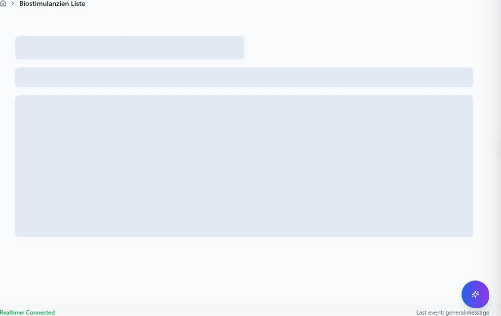

**Schritte:**

1. Sidebar oder Suche: **Biostimulanzien Liste** öffnen (`/agrar/biostimulanzien-liste`).
2. Filter und Spalten nach Bedarf setzen; bei ListReport Zeilen per Doppelklick oder Aktion öffnen.
3. Bei Belegen: Kopfdaten prüfen, Positionen erfassen oder ändern, **Speichern** bzw. workflowgebundene Aktion (Freigabe, Folgebeleg) ausführen.
4. Ergebnis in Liste, Detailansicht oder Folgebeleg verifizieren; bei Fehlern Meldungstext und Status prüfen.

**Ergebnis:** Datensatz gespeichert, Liste aktualisiert oder Folgeprozess ausgelöst.

**Häufige Fehler:**

| Symptom | Ursache | Maßnahme |
|---------|---------|----------|
| Maske lädt nicht | Modul nicht freigeschaltet oder fehlende Berechtigung | Administrator: Modul/RBAC prüfen |
| Speichern fehlgeschlagen | Pflichtfeld, Status oder Validierung | Meldung lesen, Pflichtfelder ergänzen |
| Aktion ausgegraut | Workflow-Status oder Sperre | Vorbeleg freigeben oder Berechtigung klären |

### Biostimulanzien Stamm

**Route:** `/agrar/biostimulanzien-stamm` · **Modul:** `@/pages/agrar/biostimulanzien-liste`

**Ziel:** Biostimulanzien Stamm in VALEO NeuroERP öffnen, Daten prüfen oder erfassen und das Ergebnis in Liste bzw. Folgebeleg kontrollieren.

**Schritte:**

1. Sidebar oder Suche: **Biostimulanzien Stamm** öffnen (`/agrar/biostimulanzien-stamm`).
2. Filter und Spalten nach Bedarf setzen; bei ListReport Zeilen per Doppelklick oder Aktion öffnen.
3. Bei Belegen: Kopfdaten prüfen, Positionen erfassen oder ändern, **Speichern** bzw. workflowgebundene Aktion (Freigabe, Folgebeleg) ausführen.
4. Ergebnis in Liste, Detailansicht oder Folgebeleg verifizieren; bei Fehlern Meldungstext und Status prüfen.

**Ergebnis:** Datensatz gespeichert, Liste aktualisiert oder Folgeprozess ausgelöst.

**Häufige Fehler:**

| Symptom | Ursache | Maßnahme |
|---------|---------|----------|
| Maske lädt nicht | Modul nicht freigeschaltet oder fehlende Berechtigung | Administrator: Modul/RBAC prüfen |
| Speichern fehlgeschlagen | Pflichtfeld, Status oder Validierung | Meldung lesen, Pflichtfelder ergänzen |
| Aktion ausgegraut | Workflow-Status oder Sperre | Vorbeleg freigeben oder Berechtigung klären |

### :Id

**Route:** `/agrar/biostimulanzien-stamm/:id` · **Modul:** `@/pages/agrar/biostimulanzien-liste`

**Ziel:** :Id in VALEO NeuroERP öffnen, Daten prüfen oder erfassen und das Ergebnis in Liste bzw. Folgebeleg kontrollieren.

**Schritte:**

1. Sidebar oder Suche: **:Id** öffnen (`/agrar/biostimulanzien-stamm/:id`).
2. Filter und Spalten nach Bedarf setzen; bei ListReport Zeilen per Doppelklick oder Aktion öffnen.
3. Bei Belegen: Kopfdaten prüfen, Positionen erfassen oder ändern, **Speichern** bzw. workflowgebundene Aktion (Freigabe, Folgebeleg) ausführen.
4. Ergebnis in Liste, Detailansicht oder Folgebeleg verifizieren; bei Fehlern Meldungstext und Status prüfen.

**Ergebnis:** Datensatz gespeichert, Liste aktualisiert oder Folgeprozess ausgelöst.

**Häufige Fehler:**

| Symptom | Ursache | Maßnahme |
|---------|---------|----------|
| Maske lädt nicht | Modul nicht freigeschaltet oder fehlende Berechtigung | Administrator: Modul/RBAC prüfen |
| Speichern fehlgeschlagen | Pflichtfeld, Status oder Validierung | Meldung lesen, Pflichtfelder ergänzen |
| Aktion ausgegraut | Workflow-Status oder Sperre | Vorbeleg freigeben oder Berechtigung klären |

### :Id

**Route:** `/agrar/bodenprobe/:id` · **Modul:** `@/pages/agrar/bodenproben/liste`

**Ziel:** :Id in VALEO NeuroERP öffnen, Daten prüfen oder erfassen und das Ergebnis in Liste bzw. Folgebeleg kontrollieren.

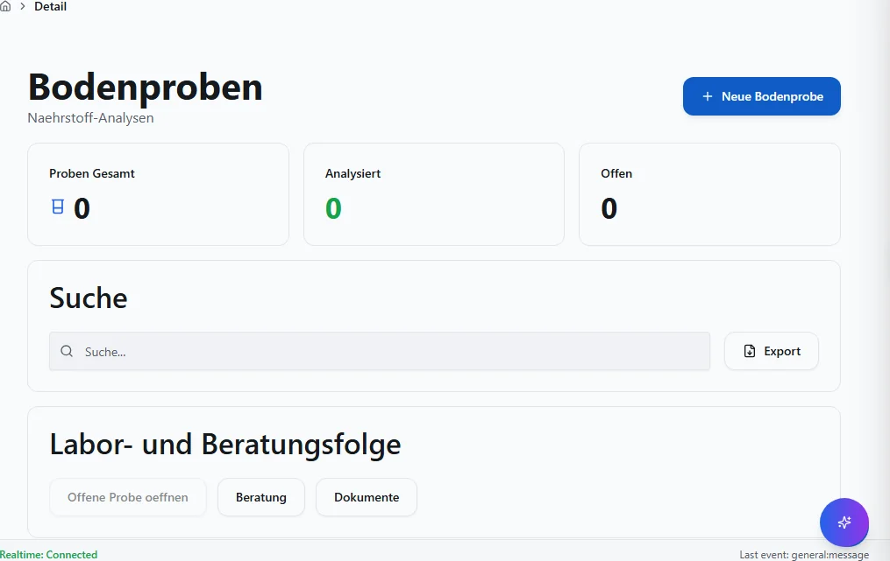

**Schritte:**

1. Sidebar oder Suche: **:Id** öffnen (`/agrar/bodenprobe/:id`).
2. Filter und Spalten nach Bedarf setzen; bei ListReport Zeilen per Doppelklick oder Aktion öffnen.
3. Bei Belegen: Kopfdaten prüfen, Positionen erfassen oder ändern, **Speichern** bzw. workflowgebundene Aktion (Freigabe, Folgebeleg) ausführen.
4. Ergebnis in Liste, Detailansicht oder Folgebeleg verifizieren; bei Fehlern Meldungstext und Status prüfen.

**Ergebnis:** Datensatz gespeichert, Liste aktualisiert oder Folgeprozess ausgelöst.

**Häufige Fehler:**

| Symptom | Ursache | Maßnahme |
|---------|---------|----------|
| Maske lädt nicht | Modul nicht freigeschaltet oder fehlende Berechtigung | Administrator: Modul/RBAC prüfen |
| Speichern fehlgeschlagen | Pflichtfeld, Status oder Validierung | Meldung lesen, Pflichtfelder ergänzen |
| Aktion ausgegraut | Workflow-Status oder Sperre | Vorbeleg freigeben oder Berechtigung klären |

### Neu

**Route:** `/agrar/bodenprobe/neu` · **Modul:** `@/pages/agrar/bodenproben/liste`

**Ziel:** Neu in VALEO NeuroERP öffnen, Daten prüfen oder erfassen und das Ergebnis in Liste bzw. Folgebeleg kontrollieren.

**Schritte:**

1. Sidebar oder Suche: **Neu** öffnen (`/agrar/bodenprobe/neu`).
2. Filter und Spalten nach Bedarf setzen; bei ListReport Zeilen per Doppelklick oder Aktion öffnen.
3. Bei Belegen: Kopfdaten prüfen, Positionen erfassen oder ändern, **Speichern** bzw. workflowgebundene Aktion (Freigabe, Folgebeleg) ausführen.
4. Ergebnis in Liste, Detailansicht oder Folgebeleg verifizieren; bei Fehlern Meldungstext und Status prüfen.

**Ergebnis:** Datensatz gespeichert, Liste aktualisiert oder Folgeprozess ausgelöst.

**Häufige Fehler:**

| Symptom | Ursache | Maßnahme |
|---------|---------|----------|
| Maske lädt nicht | Modul nicht freigeschaltet oder fehlende Berechtigung | Administrator: Modul/RBAC prüfen |
| Speichern fehlgeschlagen | Pflichtfeld, Status oder Validierung | Meldung lesen, Pflichtfelder ergänzen |
| Aktion ausgegraut | Workflow-Status oder Sperre | Vorbeleg freigeben oder Berechtigung klären |

### Bodenproben

**Route:** `/agrar/bodenproben` · **Modul:** `@/pages/agrar/bodenproben/liste`

**Ziel:** Bodenproben in VALEO NeuroERP öffnen, Daten prüfen oder erfassen und das Ergebnis in Liste bzw. Folgebeleg kontrollieren.

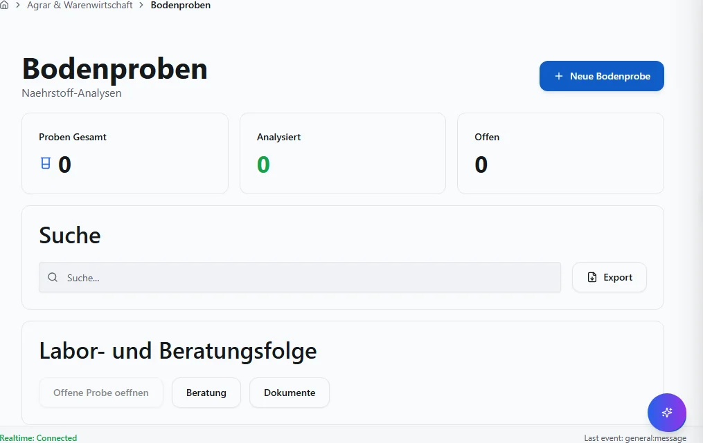

**Schritte:**

1. Sidebar oder Suche: **Bodenproben** öffnen (`/agrar/bodenproben`).
2. Filter und Spalten nach Bedarf setzen; bei ListReport Zeilen per Doppelklick oder Aktion öffnen.
3. Bei Belegen: Kopfdaten prüfen, Positionen erfassen oder ändern, **Speichern** bzw. workflowgebundene Aktion (Freigabe, Folgebeleg) ausführen.
4. Ergebnis in Liste, Detailansicht oder Folgebeleg verifizieren; bei Fehlern Meldungstext und Status prüfen.

**Ergebnis:** Datensatz gespeichert, Liste aktualisiert oder Folgeprozess ausgelöst.

**Häufige Fehler:**

| Symptom | Ursache | Maßnahme |
|---------|---------|----------|
| Maske lädt nicht | Modul nicht freigeschaltet oder fehlende Berechtigung | Administrator: Modul/RBAC prüfen |
| Speichern fehlgeschlagen | Pflichtfeld, Status oder Validierung | Meldung lesen, Pflichtfelder ergänzen |
| Aktion ausgegraut | Workflow-Status oder Sperre | Vorbeleg freigeben oder Berechtigung klären |

### Liste

**Route:** `/agrar/bodenproben/liste` · **Modul:** `@/pages/agrar/bodenproben/liste`

**Ziel:** Liste in VALEO NeuroERP öffnen, Daten prüfen oder erfassen und das Ergebnis in Liste bzw. Folgebeleg kontrollieren.

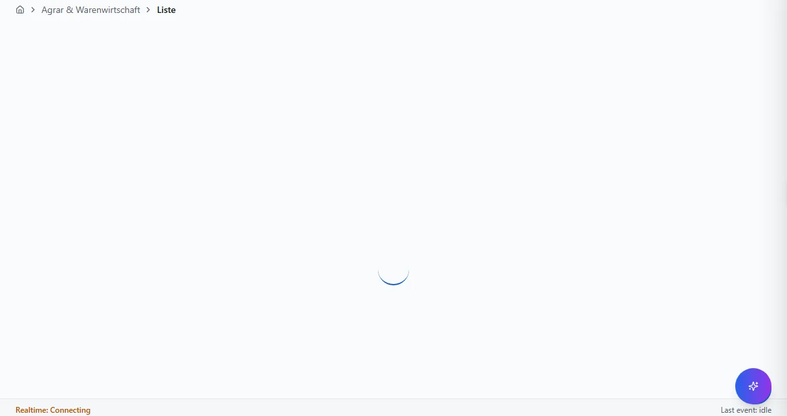

**Schritte:**

1. Sidebar oder Suche: **Liste** öffnen (`/agrar/bodenproben/liste`).
2. Filter und Spalten nach Bedarf setzen; bei ListReport Zeilen per Doppelklick oder Aktion öffnen.
3. Bei Belegen: Kopfdaten prüfen, Positionen erfassen oder ändern, **Speichern** bzw. workflowgebundene Aktion (Freigabe, Folgebeleg) ausführen.
4. Ergebnis in Liste, Detailansicht oder Folgebeleg verifizieren; bei Fehlern Meldungstext und Status prüfen.

**Ergebnis:** Datensatz gespeichert, Liste aktualisiert oder Folgeprozess ausgelöst.

**Häufige Fehler:**

| Symptom | Ursache | Maßnahme |
|---------|---------|----------|
| Maske lädt nicht | Modul nicht freigeschaltet oder fehlende Berechtigung | Administrator: Modul/RBAC prüfen |
| Speichern fehlgeschlagen | Pflichtfeld, Status oder Validierung | Meldung lesen, Pflichtfelder ergänzen |
| Aktion ausgegraut | Workflow-Status oder Sperre | Vorbeleg freigeben oder Berechtigung klären |

### Duenger

**Route:** `/agrar/duenger` · **Modul:** `@/pages/agrar/duenger/liste`

**Ziel:** Duenger in VALEO NeuroERP öffnen, Daten prüfen oder erfassen und das Ergebnis in Liste bzw. Folgebeleg kontrollieren.

**Schritte:**

1. Sidebar oder Suche: **Duenger** öffnen (`/agrar/duenger`).
2. Filter und Spalten nach Bedarf setzen; bei ListReport Zeilen per Doppelklick oder Aktion öffnen.
3. Bei Belegen: Kopfdaten prüfen, Positionen erfassen oder ändern, **Speichern** bzw. workflowgebundene Aktion (Freigabe, Folgebeleg) ausführen.
4. Ergebnis in Liste, Detailansicht oder Folgebeleg verifizieren; bei Fehlern Meldungstext und Status prüfen.

**Ergebnis:** Datensatz gespeichert, Liste aktualisiert oder Folgeprozess ausgelöst.

**Häufige Fehler:**

| Symptom | Ursache | Maßnahme |
|---------|---------|----------|
| Maske lädt nicht | Modul nicht freigeschaltet oder fehlende Berechtigung | Administrator: Modul/RBAC prüfen |
| Speichern fehlgeschlagen | Pflichtfeld, Status oder Validierung | Meldung lesen, Pflichtfelder ergänzen |
| Aktion ausgegraut | Workflow-Status oder Sperre | Vorbeleg freigeben oder Berechtigung klären |

### Duenger Liste

**Route:** `/agrar/duenger-liste` · **Modul:** `@/pages/agrar/duenger-liste`

**Ziel:** Duenger Liste in VALEO NeuroERP öffnen, Daten prüfen oder erfassen und das Ergebnis in Liste bzw. Folgebeleg kontrollieren.

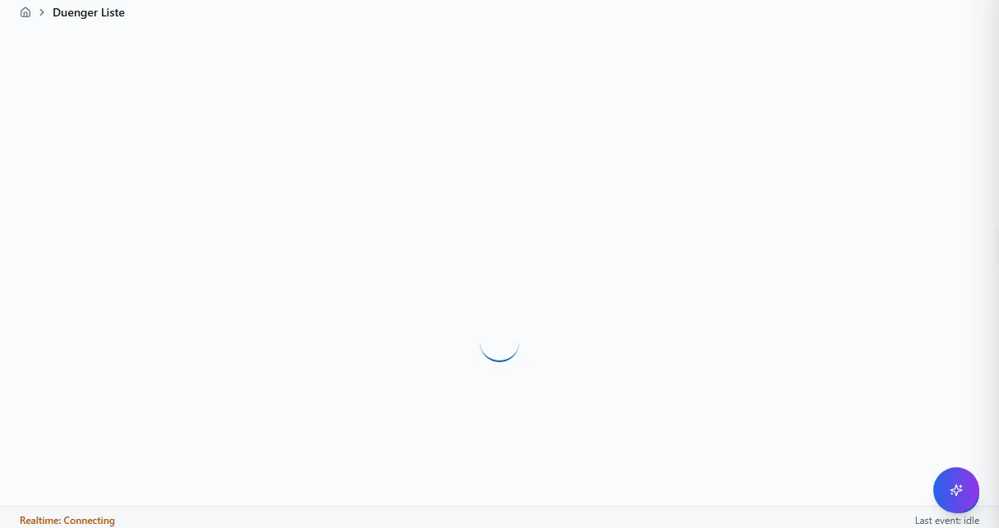

**Schritte:**

1. Sidebar oder Suche: **Duenger Liste** öffnen (`/agrar/duenger-liste`).
2. Filter und Spalten nach Bedarf setzen; bei ListReport Zeilen per Doppelklick oder Aktion öffnen.
3. Bei Belegen: Kopfdaten prüfen, Positionen erfassen oder ändern, **Speichern** bzw. workflowgebundene Aktion (Freigabe, Folgebeleg) ausführen.
4. Ergebnis in Liste, Detailansicht oder Folgebeleg verifizieren; bei Fehlern Meldungstext und Status prüfen.

**Ergebnis:** Datensatz gespeichert, Liste aktualisiert oder Folgeprozess ausgelöst.

**Häufige Fehler:**

| Symptom | Ursache | Maßnahme |
|---------|---------|----------|
| Maske lädt nicht | Modul nicht freigeschaltet oder fehlende Berechtigung | Administrator: Modul/RBAC prüfen |
| Speichern fehlgeschlagen | Pflichtfeld, Status oder Validierung | Meldung lesen, Pflichtfelder ergänzen |
| Aktion ausgegraut | Workflow-Status oder Sperre | Vorbeleg freigeben oder Berechtigung klären |

### Duenger Stamm

**Route:** `/agrar/duenger-stamm` · **Modul:** `@/pages/agrar/duenger-stamm`

**Ziel:** Duenger Stamm in VALEO NeuroERP öffnen, Daten prüfen oder erfassen und das Ergebnis in Liste bzw. Folgebeleg kontrollieren.

**Schritte:**

1. Sidebar oder Suche: **Duenger Stamm** öffnen (`/agrar/duenger-stamm`).
2. Filter und Spalten nach Bedarf setzen; bei ListReport Zeilen per Doppelklick oder Aktion öffnen.
3. Bei Belegen: Kopfdaten prüfen, Positionen erfassen oder ändern, **Speichern** bzw. workflowgebundene Aktion (Freigabe, Folgebeleg) ausführen.
4. Ergebnis in Liste, Detailansicht oder Folgebeleg verifizieren; bei Fehlern Meldungstext und Status prüfen.

**Ergebnis:** Datensatz gespeichert, Liste aktualisiert oder Folgeprozess ausgelöst.

**Häufige Fehler:**

| Symptom | Ursache | Maßnahme |
|---------|---------|----------|
| Maske lädt nicht | Modul nicht freigeschaltet oder fehlende Berechtigung | Administrator: Modul/RBAC prüfen |
| Speichern fehlgeschlagen | Pflichtfeld, Status oder Validierung | Meldung lesen, Pflichtfelder ergänzen |
| Aktion ausgegraut | Workflow-Status oder Sperre | Vorbeleg freigeben oder Berechtigung klären |

### :Id

**Route:** `/agrar/duenger-stamm/:id` · **Modul:** `@/pages/agrar/duenger-stamm`

**Ziel:** :Id in VALEO NeuroERP öffnen, Daten prüfen oder erfassen und das Ergebnis in Liste bzw. Folgebeleg kontrollieren.

**Schritte:**

1. Sidebar oder Suche: **:Id** öffnen (`/agrar/duenger-stamm/:id`).
2. Filter und Spalten nach Bedarf setzen; bei ListReport Zeilen per Doppelklick oder Aktion öffnen.
3. Bei Belegen: Kopfdaten prüfen, Positionen erfassen oder ändern, **Speichern** bzw. workflowgebundene Aktion (Freigabe, Folgebeleg) ausführen.
4. Ergebnis in Liste, Detailansicht oder Folgebeleg verifizieren; bei Fehlern Meldungstext und Status prüfen.

**Ergebnis:** Datensatz gespeichert, Liste aktualisiert oder Folgeprozess ausgelöst.

**Häufige Fehler:**

| Symptom | Ursache | Maßnahme |
|---------|---------|----------|
| Maske lädt nicht | Modul nicht freigeschaltet oder fehlende Berechtigung | Administrator: Modul/RBAC prüfen |
| Speichern fehlgeschlagen | Pflichtfeld, Status oder Validierung | Meldung lesen, Pflichtfelder ergänzen |
| Aktion ausgegraut | Workflow-Status oder Sperre | Vorbeleg freigeben oder Berechtigung klären |

### :Id

**Route:** `/agrar/duenger/:id` · **Modul:** `@/pages/agrar/duenger-native`

**Ziel:** :Id in VALEO NeuroERP öffnen, Daten prüfen oder erfassen und das Ergebnis in Liste bzw. Folgebeleg kontrollieren.

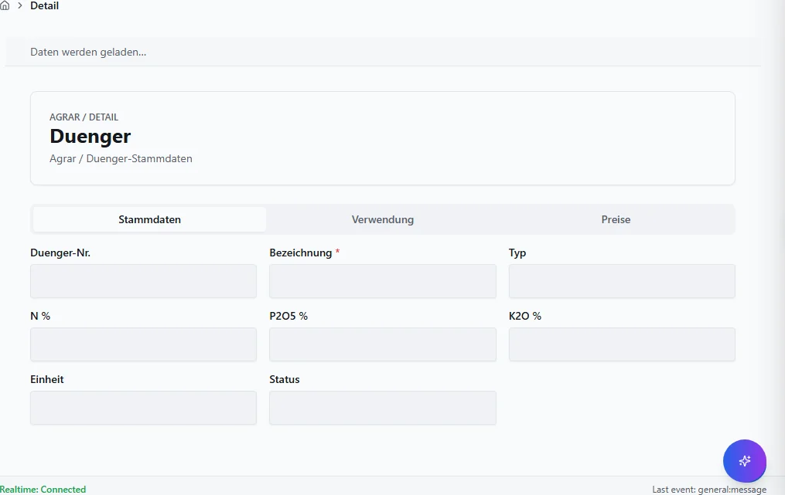

**Schritte:**

1. Sidebar oder Suche: **:Id** öffnen (`/agrar/duenger/:id`).
2. Filter und Spalten nach Bedarf setzen; bei ListReport Zeilen per Doppelklick oder Aktion öffnen.
3. Bei Belegen: Kopfdaten prüfen, Positionen erfassen oder ändern, **Speichern** bzw. workflowgebundene Aktion (Freigabe, Folgebeleg) ausführen.
4. Ergebnis in Liste, Detailansicht oder Folgebeleg verifizieren; bei Fehlern Meldungstext und Status prüfen.

**Ergebnis:** Datensatz gespeichert, Liste aktualisiert oder Folgeprozess ausgelöst.

**Häufige Fehler:**

| Symptom | Ursache | Maßnahme |
|---------|---------|----------|
| Maske lädt nicht | Modul nicht freigeschaltet oder fehlende Berechtigung | Administrator: Modul/RBAC prüfen |
| Speichern fehlgeschlagen | Pflichtfeld, Status oder Validierung | Meldung lesen, Pflichtfelder ergänzen |
| Aktion ausgegraut | Workflow-Status oder Sperre | Vorbeleg freigeben oder Berechtigung klären |

### Bedarfsrechner

**Route:** `/agrar/duenger/bedarfsrechner` · **Modul:** `@/pages/agrar/duenger/bedarfsrechner`

**Ziel:** Bedarfsrechner in VALEO NeuroERP öffnen, Daten prüfen oder erfassen und das Ergebnis in Liste bzw. Folgebeleg kontrollieren.

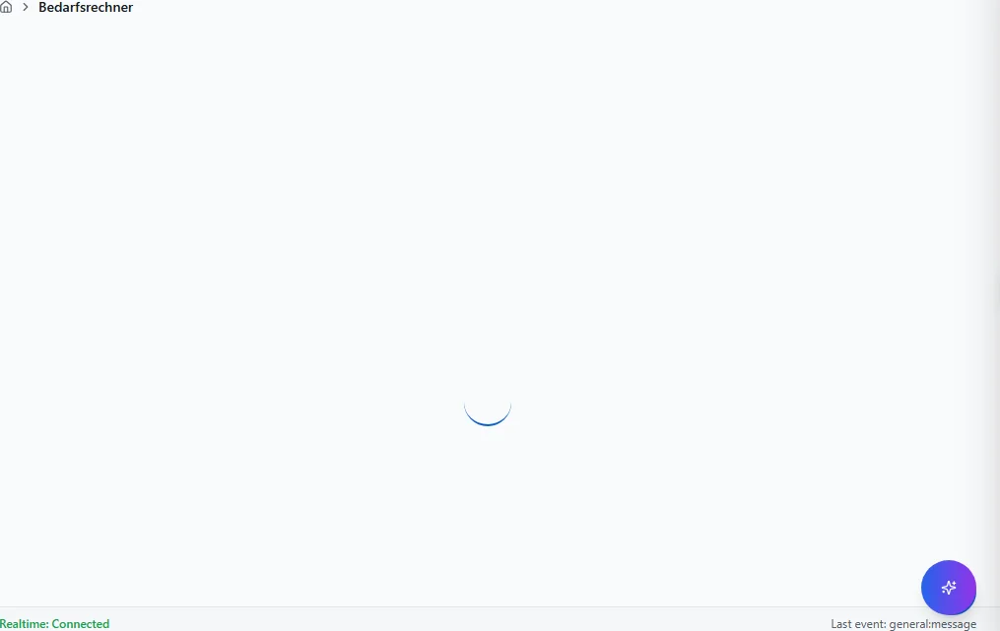

**Schritte:**

1. Sidebar oder Suche: **Bedarfsrechner** öffnen (`/agrar/duenger/bedarfsrechner`).
2. Filter und Spalten nach Bedarf setzen; bei ListReport Zeilen per Doppelklick oder Aktion öffnen.
3. Bei Belegen: Kopfdaten prüfen, Positionen erfassen oder ändern, **Speichern** bzw. workflowgebundene Aktion (Freigabe, Folgebeleg) ausführen.
4. Ergebnis in Liste, Detailansicht oder Folgebeleg verifizieren; bei Fehlern Meldungstext und Status prüfen.

**Ergebnis:** Datensatz gespeichert, Liste aktualisiert oder Folgeprozess ausgelöst.

**Häufige Fehler:**

| Symptom | Ursache | Maßnahme |
|---------|---------|----------|
| Maske lädt nicht | Modul nicht freigeschaltet oder fehlende Berechtigung | Administrator: Modul/RBAC prüfen |
| Speichern fehlgeschlagen | Pflichtfeld, Status oder Validierung | Meldung lesen, Pflichtfelder ergänzen |
| Aktion ausgegraut | Workflow-Status oder Sperre | Vorbeleg freigeben oder Berechtigung klären |

### Liste

**Route:** `/agrar/duenger/liste` · **Modul:** `@/pages/agrar/duenger/liste`

**Ziel:** Liste in VALEO NeuroERP öffnen, Daten prüfen oder erfassen und das Ergebnis in Liste bzw. Folgebeleg kontrollieren.

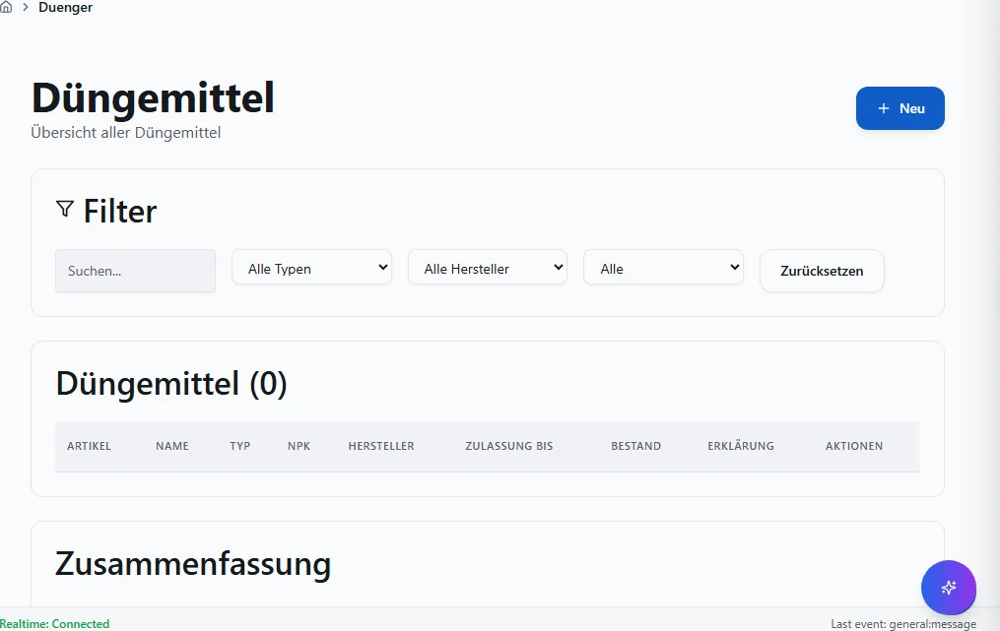

**Schritte:**

1. Sidebar oder Suche: **Liste** öffnen (`/agrar/duenger/liste`).
2. Filter und Spalten nach Bedarf setzen; bei ListReport Zeilen per Doppelklick oder Aktion öffnen.
3. Bei Belegen: Kopfdaten prüfen, Positionen erfassen oder ändern, **Speichern** bzw. workflowgebundene Aktion (Freigabe, Folgebeleg) ausführen.
4. Ergebnis in Liste, Detailansicht oder Folgebeleg verifizieren; bei Fehlern Meldungstext und Status prüfen.

**Ergebnis:** Datensatz gespeichert, Liste aktualisiert oder Folgeprozess ausgelöst.

**Häufige Fehler:**

| Symptom | Ursache | Maßnahme |
|---------|---------|----------|
| Maske lädt nicht | Modul nicht freigeschaltet oder fehlende Berechtigung | Administrator: Modul/RBAC prüfen |
| Speichern fehlgeschlagen | Pflichtfeld, Status oder Validierung | Meldung lesen, Pflichtfelder ergänzen |
| Aktion ausgegraut | Workflow-Status oder Sperre | Vorbeleg freigeben oder Berechtigung klären |

### Mischungen

**Route:** `/agrar/duenger/mischungen` · **Modul:** `@/pages/agrar/duenger/mischungen`

**Ziel:** Mischungen in VALEO NeuroERP öffnen, Daten prüfen oder erfassen und das Ergebnis in Liste bzw. Folgebeleg kontrollieren.

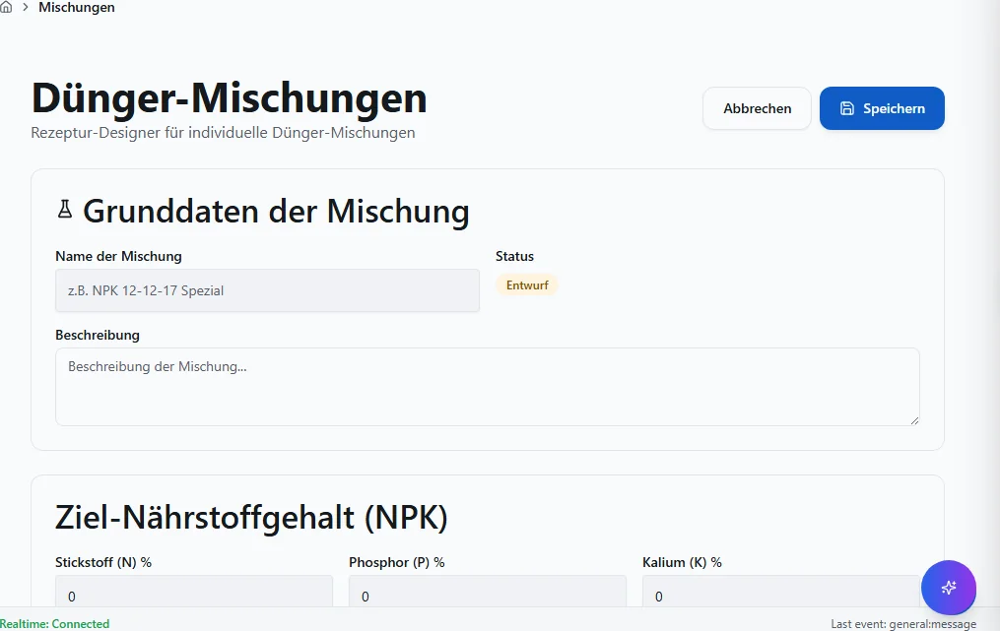

**Schritte:**

1. Sidebar oder Suche: **Mischungen** öffnen (`/agrar/duenger/mischungen`).
2. Filter und Spalten nach Bedarf setzen; bei ListReport Zeilen per Doppelklick oder Aktion öffnen.
3. Bei Belegen: Kopfdaten prüfen, Positionen erfassen oder ändern, **Speichern** bzw. workflowgebundene Aktion (Freigabe, Folgebeleg) ausführen.
4. Ergebnis in Liste, Detailansicht oder Folgebeleg verifizieren; bei Fehlern Meldungstext und Status prüfen.

**Ergebnis:** Datensatz gespeichert, Liste aktualisiert oder Folgeprozess ausgelöst.

**Häufige Fehler:**

| Symptom | Ursache | Maßnahme |
|---------|---------|----------|
| Maske lädt nicht | Modul nicht freigeschaltet oder fehlende Berechtigung | Administrator: Modul/RBAC prüfen |
| Speichern fehlgeschlagen | Pflichtfeld, Status oder Validierung | Meldung lesen, Pflichtfelder ergänzen |
| Aktion ausgegraut | Workflow-Status oder Sperre | Vorbeleg freigeben oder Berechtigung klären |

### Stamm

**Route:** `/agrar/duenger/stamm` · **Modul:** `@/pages/agrar/duenger/stamm`

**Ziel:** Stamm in VALEO NeuroERP öffnen, Daten prüfen oder erfassen und das Ergebnis in Liste bzw. Folgebeleg kontrollieren.

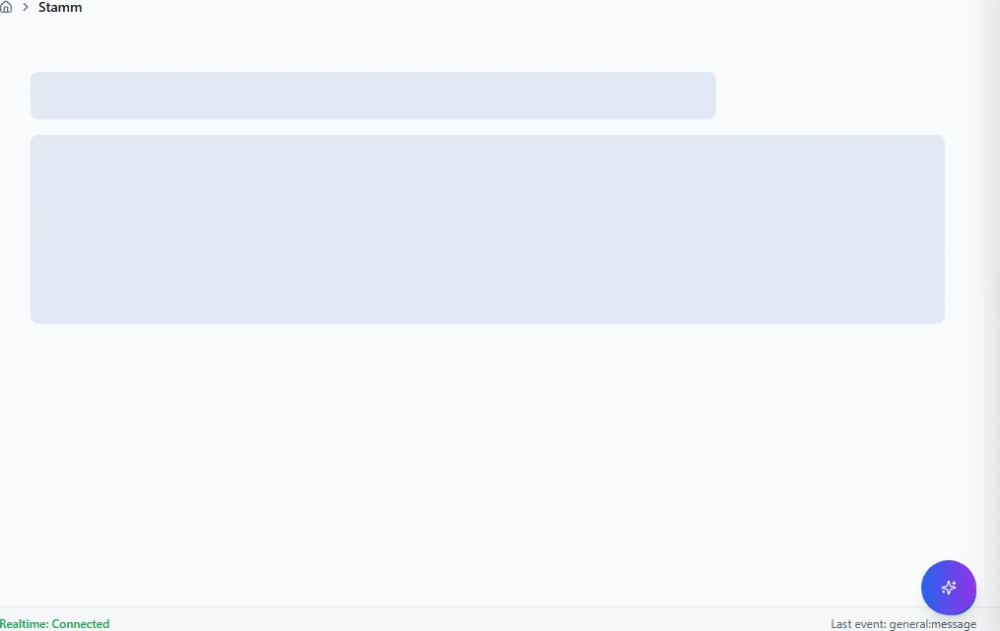

**Schritte:**

1. Sidebar oder Suche: **Stamm** öffnen (`/agrar/duenger/stamm`).
2. Filter und Spalten nach Bedarf setzen; bei ListReport Zeilen per Doppelklick oder Aktion öffnen.
3. Bei Belegen: Kopfdaten prüfen, Positionen erfassen oder ändern, **Speichern** bzw. workflowgebundene Aktion (Freigabe, Folgebeleg) ausführen.
4. Ergebnis in Liste, Detailansicht oder Folgebeleg verifizieren; bei Fehlern Meldungstext und Status prüfen.

**Ergebnis:** Datensatz gespeichert, Liste aktualisiert oder Folgeprozess ausgelöst.

**Häufige Fehler:**

| Symptom | Ursache | Maßnahme |
|---------|---------|----------|
| Maske lädt nicht | Modul nicht freigeschaltet oder fehlende Berechtigung | Administrator: Modul/RBAC prüfen |
| Speichern fehlgeschlagen | Pflichtfeld, Status oder Validierung | Meldung lesen, Pflichtfelder ergänzen |
| Aktion ausgegraut | Workflow-Status oder Sperre | Vorbeleg freigeben oder Berechtigung klären |

### :Id

**Route:** `/agrar/duenger/stamm/:id` · **Modul:** `@/pages/agrar/duenger/stamm`

**Ziel:** :Id in VALEO NeuroERP öffnen, Daten prüfen oder erfassen und das Ergebnis in Liste bzw. Folgebeleg kontrollieren.

**Schritte:**

1. Sidebar oder Suche: **:Id** öffnen (`/agrar/duenger/stamm/:id`).
2. Filter und Spalten nach Bedarf setzen; bei ListReport Zeilen per Doppelklick oder Aktion öffnen.
3. Bei Belegen: Kopfdaten prüfen, Positionen erfassen oder ändern, **Speichern** bzw. workflowgebundene Aktion (Freigabe, Folgebeleg) ausführen.
4. Ergebnis in Liste, Detailansicht oder Folgebeleg verifizieren; bei Fehlern Meldungstext und Status prüfen.

**Ergebnis:** Datensatz gespeichert, Liste aktualisiert oder Folgeprozess ausgelöst.

**Häufige Fehler:**

| Symptom | Ursache | Maßnahme |
|---------|---------|----------|
| Maske lädt nicht | Modul nicht freigeschaltet oder fehlende Berechtigung | Administrator: Modul/RBAC prüfen |
| Speichern fehlgeschlagen | Pflichtfeld, Status oder Validierung | Meldung lesen, Pflichtfelder ergänzen |
| Aktion ausgegraut | Workflow-Status oder Sperre | Vorbeleg freigeben oder Berechtigung klären |

### Edit

**Route:** `/agrar/duenger/stamm/:id/edit` · **Modul:** `@/pages/agrar/duenger/stamm`

**Ziel:** Edit in VALEO NeuroERP öffnen, Daten prüfen oder erfassen und das Ergebnis in Liste bzw. Folgebeleg kontrollieren.

**Schritte:**

1. Sidebar oder Suche: **Edit** öffnen (`/agrar/duenger/stamm/:id/edit`).
2. Filter und Spalten nach Bedarf setzen; bei ListReport Zeilen per Doppelklick oder Aktion öffnen.
3. Bei Belegen: Kopfdaten prüfen, Positionen erfassen oder ändern, **Speichern** bzw. workflowgebundene Aktion (Freigabe, Folgebeleg) ausführen.
4. Ergebnis in Liste, Detailansicht oder Folgebeleg verifizieren; bei Fehlern Meldungstext und Status prüfen.

**Ergebnis:** Datensatz gespeichert, Liste aktualisiert oder Folgeprozess ausgelöst.

**Häufige Fehler:**

| Symptom | Ursache | Maßnahme |
|---------|---------|----------|
| Maske lädt nicht | Modul nicht freigeschaltet oder fehlende Berechtigung | Administrator: Modul/RBAC prüfen |
| Speichern fehlgeschlagen | Pflichtfeld, Status oder Validierung | Meldung lesen, Pflichtfelder ergänzen |
| Aktion ausgegraut | Workflow-Status oder Sperre | Vorbeleg freigeben oder Berechtigung klären |

### Planung

**Route:** `/agrar/duengung/planung` · **Modul:** `@/pages/agrar/duengung/planung`

**Ziel:** Planung in VALEO NeuroERP öffnen, Daten prüfen oder erfassen und das Ergebnis in Liste bzw. Folgebeleg kontrollieren.

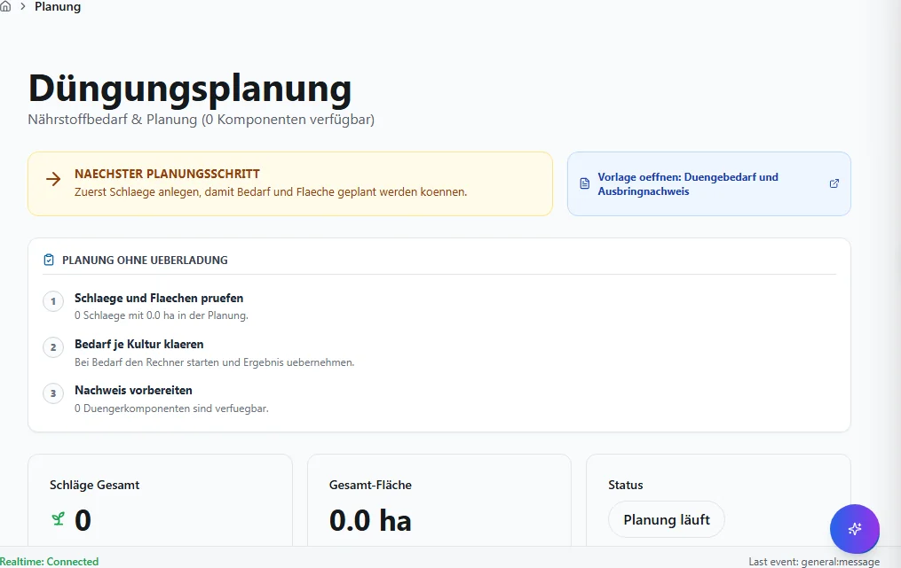

**Schritte:**

1. Sidebar oder Suche: **Planung** öffnen (`/agrar/duengung/planung`).
2. Filter und Spalten nach Bedarf setzen; bei ListReport Zeilen per Doppelklick oder Aktion öffnen.
3. Bei Belegen: Kopfdaten prüfen, Positionen erfassen oder ändern, **Speichern** bzw. workflowgebundene Aktion (Freigabe, Folgebeleg) ausführen.
4. Ergebnis in Liste, Detailansicht oder Folgebeleg verifizieren; bei Fehlern Meldungstext und Status prüfen.

**Ergebnis:** Datensatz gespeichert, Liste aktualisiert oder Folgeprozess ausgelöst.

**Häufige Fehler:**

| Symptom | Ursache | Maßnahme |
|---------|---------|----------|
| Maske lädt nicht | Modul nicht freigeschaltet oder fehlende Berechtigung | Administrator: Modul/RBAC prüfen |
| Speichern fehlgeschlagen | Pflichtfeld, Status oder Validierung | Meldung lesen, Pflichtfelder ergänzen |
| Aktion ausgegraut | Workflow-Status oder Sperre | Vorbeleg freigeben oder Berechtigung klären |

### Ernte

**Route:** `/agrar/ernte` · **Modul:** `@/pages/agrar/ernte/liste`

**Ziel:** Ernte in VALEO NeuroERP öffnen, Daten prüfen oder erfassen und das Ergebnis in Liste bzw. Folgebeleg kontrollieren.

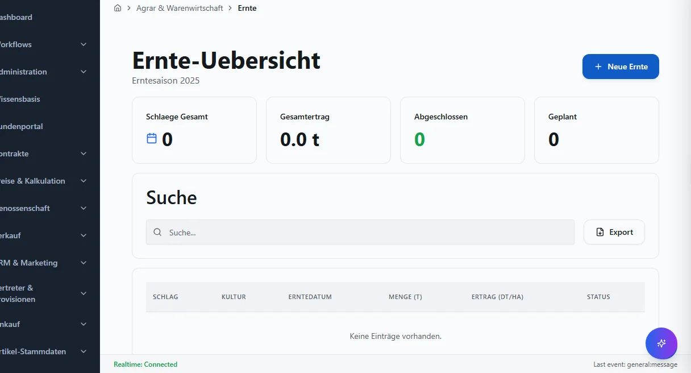

**Schritte:**

1. Sidebar oder Suche: **Ernte** öffnen (`/agrar/ernte`).
2. Filter und Spalten nach Bedarf setzen; bei ListReport Zeilen per Doppelklick oder Aktion öffnen.
3. Bei Belegen: Kopfdaten prüfen, Positionen erfassen oder ändern, **Speichern** bzw. workflowgebundene Aktion (Freigabe, Folgebeleg) ausführen.
4. Ergebnis in Liste, Detailansicht oder Folgebeleg verifizieren; bei Fehlern Meldungstext und Status prüfen.

**Ergebnis:** Datensatz gespeichert, Liste aktualisiert oder Folgeprozess ausgelöst.

**Häufige Fehler:**

| Symptom | Ursache | Maßnahme |
|---------|---------|----------|
| Maske lädt nicht | Modul nicht freigeschaltet oder fehlende Berechtigung | Administrator: Modul/RBAC prüfen |
| Speichern fehlgeschlagen | Pflichtfeld, Status oder Validierung | Meldung lesen, Pflichtfelder ergänzen |
| Aktion ausgegraut | Workflow-Status oder Sperre | Vorbeleg freigeben oder Berechtigung klären |

### Ernte Annahme Erfassung

**Route:** `/agrar/ernte-annahme-erfassung` · **Modul:** `@/pages/agrar/ernte-annahme-erfassung`

**Ziel:** Ernte Annahme Erfassung in VALEO NeuroERP öffnen, Daten prüfen oder erfassen und das Ergebnis in Liste bzw. Folgebeleg kontrollieren.

**Schritte:**

1. Sidebar oder Suche: **Ernte Annahme Erfassung** öffnen (`/agrar/ernte-annahme-erfassung`).
2. Filter und Spalten nach Bedarf setzen; bei ListReport Zeilen per Doppelklick oder Aktion öffnen.
3. Bei Belegen: Kopfdaten prüfen, Positionen erfassen oder ändern, **Speichern** bzw. workflowgebundene Aktion (Freigabe, Folgebeleg) ausführen.
4. Ergebnis in Liste, Detailansicht oder Folgebeleg verifizieren; bei Fehlern Meldungstext und Status prüfen.

**Ergebnis:** Datensatz gespeichert, Liste aktualisiert oder Folgeprozess ausgelöst.

**Häufige Fehler:**

| Symptom | Ursache | Maßnahme |
|---------|---------|----------|
| Maske lädt nicht | Modul nicht freigeschaltet oder fehlende Berechtigung | Administrator: Modul/RBAC prüfen |
| Speichern fehlgeschlagen | Pflichtfeld, Status oder Validierung | Meldung lesen, Pflichtfelder ergänzen |
| Aktion ausgegraut | Workflow-Status oder Sperre | Vorbeleg freigeben oder Berechtigung klären |

### :Id

**Route:** `/agrar/ernte-annahme-erfassung/:id` · **Modul:** `@/pages/agrar/ernte-annahme-erfassung`

**Ziel:** :Id in VALEO NeuroERP öffnen, Daten prüfen oder erfassen und das Ergebnis in Liste bzw. Folgebeleg kontrollieren.

**Schritte:**

1. Sidebar oder Suche: **:Id** öffnen (`/agrar/ernte-annahme-erfassung/:id`).
2. Filter und Spalten nach Bedarf setzen; bei ListReport Zeilen per Doppelklick oder Aktion öffnen.
3. Bei Belegen: Kopfdaten prüfen, Positionen erfassen oder ändern, **Speichern** bzw. workflowgebundene Aktion (Freigabe, Folgebeleg) ausführen.
4. Ergebnis in Liste, Detailansicht oder Folgebeleg verifizieren; bei Fehlern Meldungstext und Status prüfen.

**Ergebnis:** Datensatz gespeichert, Liste aktualisiert oder Folgeprozess ausgelöst.

**Häufige Fehler:**

| Symptom | Ursache | Maßnahme |
|---------|---------|----------|
| Maske lädt nicht | Modul nicht freigeschaltet oder fehlende Berechtigung | Administrator: Modul/RBAC prüfen |
| Speichern fehlgeschlagen | Pflichtfeld, Status oder Validierung | Meldung lesen, Pflichtfelder ergänzen |
| Aktion ausgegraut | Workflow-Status oder Sperre | Vorbeleg freigeben oder Berechtigung klären |

### :Id

**Route:** `/agrar/ernte/:id` · **Modul:** `@/pages/agrar/ernte-annahme-erfassung`

**Ziel:** :Id in VALEO NeuroERP öffnen, Daten prüfen oder erfassen und das Ergebnis in Liste bzw. Folgebeleg kontrollieren.

**Schritte:**

1. Sidebar oder Suche: **:Id** öffnen (`/agrar/ernte/:id`).
2. Filter und Spalten nach Bedarf setzen; bei ListReport Zeilen per Doppelklick oder Aktion öffnen.
3. Bei Belegen: Kopfdaten prüfen, Positionen erfassen oder ändern, **Speichern** bzw. workflowgebundene Aktion (Freigabe, Folgebeleg) ausführen.
4. Ergebnis in Liste, Detailansicht oder Folgebeleg verifizieren; bei Fehlern Meldungstext und Status prüfen.

**Ergebnis:** Datensatz gespeichert, Liste aktualisiert oder Folgeprozess ausgelöst.

**Häufige Fehler:**

| Symptom | Ursache | Maßnahme |
|---------|---------|----------|
| Maske lädt nicht | Modul nicht freigeschaltet oder fehlende Berechtigung | Administrator: Modul/RBAC prüfen |
| Speichern fehlgeschlagen | Pflichtfeld, Status oder Validierung | Meldung lesen, Pflichtfelder ergänzen |
| Aktion ausgegraut | Workflow-Status oder Sperre | Vorbeleg freigeben oder Berechtigung klären |

### Liste

**Route:** `/agrar/ernte/liste` · **Modul:** `@/pages/agrar/ernte/liste`

**Ziel:** Liste in VALEO NeuroERP öffnen, Daten prüfen oder erfassen und das Ergebnis in Liste bzw. Folgebeleg kontrollieren.

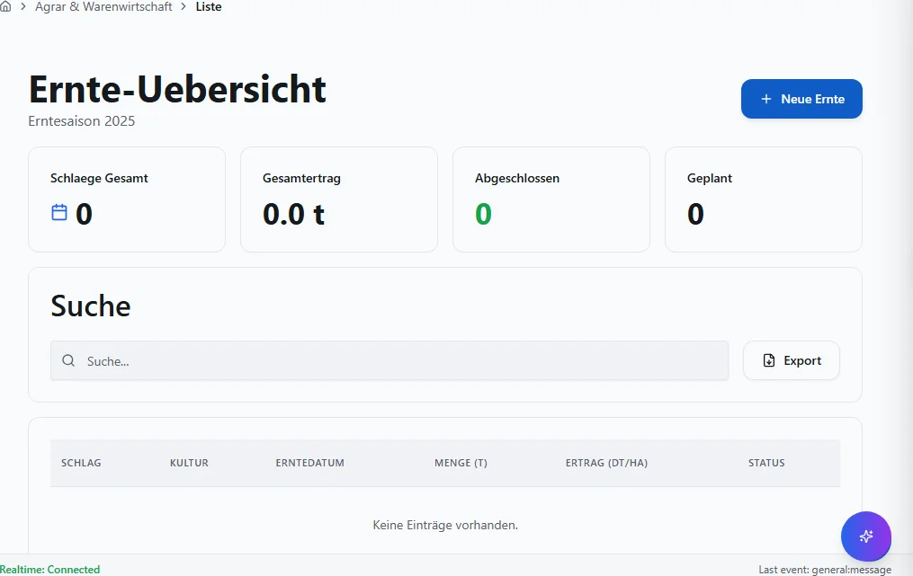

**Schritte:**

1. Sidebar oder Suche: **Liste** öffnen (`/agrar/ernte/liste`).
2. Filter und Spalten nach Bedarf setzen; bei ListReport Zeilen per Doppelklick oder Aktion öffnen.
3. Bei Belegen: Kopfdaten prüfen, Positionen erfassen oder ändern, **Speichern** bzw. workflowgebundene Aktion (Freigabe, Folgebeleg) ausführen.
4. Ergebnis in Liste, Detailansicht oder Folgebeleg verifizieren; bei Fehlern Meldungstext und Status prüfen.

**Ergebnis:** Datensatz gespeichert, Liste aktualisiert oder Folgeprozess ausgelöst.

**Häufige Fehler:**

| Symptom | Ursache | Maßnahme |
|---------|---------|----------|
| Maske lädt nicht | Modul nicht freigeschaltet oder fehlende Berechtigung | Administrator: Modul/RBAC prüfen |
| Speichern fehlgeschlagen | Pflichtfeld, Status oder Validierung | Meldung lesen, Pflichtfelder ergänzen |
| Aktion ausgegraut | Workflow-Status oder Sperre | Vorbeleg freigeben oder Berechtigung klären |

### Neu

**Route:** `/agrar/ernte/neu` · **Modul:** `@/pages/agrar/ernte/neu`

**Ziel:** Neu in VALEO NeuroERP öffnen, Daten prüfen oder erfassen und das Ergebnis in Liste bzw. Folgebeleg kontrollieren.

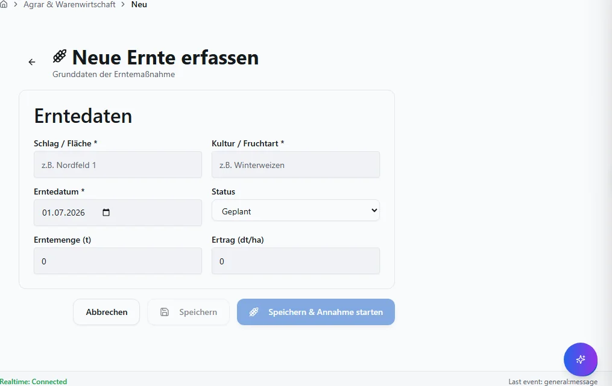

**Schritte:**

1. Sidebar oder Suche: **Neu** öffnen (`/agrar/ernte/neu`).
2. Filter und Spalten nach Bedarf setzen; bei ListReport Zeilen per Doppelklick oder Aktion öffnen.
3. Bei Belegen: Kopfdaten prüfen, Positionen erfassen oder ändern, **Speichern** bzw. workflowgebundene Aktion (Freigabe, Folgebeleg) ausführen.
4. Ergebnis in Liste, Detailansicht oder Folgebeleg verifizieren; bei Fehlern Meldungstext und Status prüfen.

**Ergebnis:** Datensatz gespeichert, Liste aktualisiert oder Folgeprozess ausgelöst.

**Häufige Fehler:**

| Symptom | Ursache | Maßnahme |
|---------|---------|----------|
| Maske lädt nicht | Modul nicht freigeschaltet oder fehlende Berechtigung | Administrator: Modul/RBAC prüfen |
| Speichern fehlgeschlagen | Pflichtfeld, Status oder Validierung | Meldung lesen, Pflichtfelder ergänzen |
| Aktion ausgegraut | Workflow-Status oder Sperre | Vorbeleg freigeben oder Berechtigung klären |

### Erntefenster Konfig

**Route:** `/agrar/erntefenster-konfig` · **Modul:** `@/pages/agrar/erntefenster-konfig`

**Ziel:** Erntefenster Konfig in VALEO NeuroERP öffnen, Daten prüfen oder erfassen und das Ergebnis in Liste bzw. Folgebeleg kontrollieren.

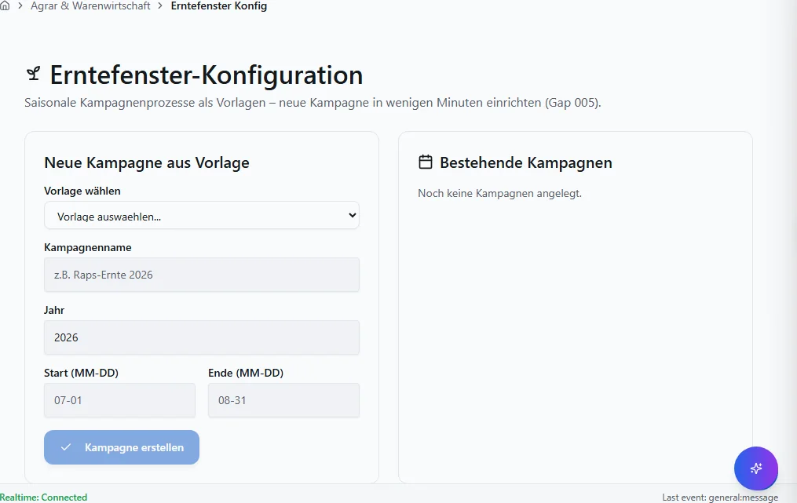

**Schritte:**

1. Sidebar oder Suche: **Erntefenster Konfig** öffnen (`/agrar/erntefenster-konfig`).
2. Filter und Spalten nach Bedarf setzen; bei ListReport Zeilen per Doppelklick oder Aktion öffnen.
3. Bei Belegen: Kopfdaten prüfen, Positionen erfassen oder ändern, **Speichern** bzw. workflowgebundene Aktion (Freigabe, Folgebeleg) ausführen.
4. Ergebnis in Liste, Detailansicht oder Folgebeleg verifizieren; bei Fehlern Meldungstext und Status prüfen.

**Ergebnis:** Datensatz gespeichert, Liste aktualisiert oder Folgeprozess ausgelöst.

**Häufige Fehler:**

| Symptom | Ursache | Maßnahme |
|---------|---------|----------|
| Maske lädt nicht | Modul nicht freigeschaltet oder fehlende Berechtigung | Administrator: Modul/RBAC prüfen |
| Speichern fehlgeschlagen | Pflichtfeld, Status oder Validierung | Meldung lesen, Pflichtfelder ergänzen |
| Aktion ausgegraut | Workflow-Status oder Sperre | Vorbeleg freigeben oder Berechtigung klären |

### :Id

**Route:** `/agrar/feldbuch/massnahme/:id` · **Modul:** `@/pages/agrar/feldbuch/massnahmen`

**Ziel:** :Id in VALEO NeuroERP öffnen, Daten prüfen oder erfassen und das Ergebnis in Liste bzw. Folgebeleg kontrollieren.

**Schritte:**

1. Sidebar oder Suche: **:Id** öffnen (`/agrar/feldbuch/massnahme/:id`).
2. Filter und Spalten nach Bedarf setzen; bei ListReport Zeilen per Doppelklick oder Aktion öffnen.
3. Bei Belegen: Kopfdaten prüfen, Positionen erfassen oder ändern, **Speichern** bzw. workflowgebundene Aktion (Freigabe, Folgebeleg) ausführen.
4. Ergebnis in Liste, Detailansicht oder Folgebeleg verifizieren; bei Fehlern Meldungstext und Status prüfen.

**Ergebnis:** Datensatz gespeichert, Liste aktualisiert oder Folgeprozess ausgelöst.

**Häufige Fehler:**

| Symptom | Ursache | Maßnahme |
|---------|---------|----------|
| Maske lädt nicht | Modul nicht freigeschaltet oder fehlende Berechtigung | Administrator: Modul/RBAC prüfen |
| Speichern fehlgeschlagen | Pflichtfeld, Status oder Validierung | Meldung lesen, Pflichtfelder ergänzen |
| Aktion ausgegraut | Workflow-Status oder Sperre | Vorbeleg freigeben oder Berechtigung klären |

### Neu

**Route:** `/agrar/feldbuch/massnahme/neu` · **Modul:** `@/pages/agrar/feldbuch/massnahmen`

**Ziel:** Neu in VALEO NeuroERP öffnen, Daten prüfen oder erfassen und das Ergebnis in Liste bzw. Folgebeleg kontrollieren.

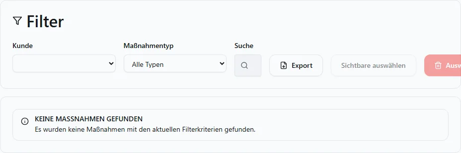

**Schritte:**

1. Sidebar oder Suche: **Neu** öffnen (`/agrar/feldbuch/massnahme/neu`).
2. Filter und Spalten nach Bedarf setzen; bei ListReport Zeilen per Doppelklick oder Aktion öffnen.
3. Bei Belegen: Kopfdaten prüfen, Positionen erfassen oder ändern, **Speichern** bzw. workflowgebundene Aktion (Freigabe, Folgebeleg) ausführen.
4. Ergebnis in Liste, Detailansicht oder Folgebeleg verifizieren; bei Fehlern Meldungstext und Status prüfen.

**Ergebnis:** Datensatz gespeichert, Liste aktualisiert oder Folgeprozess ausgelöst.

**Häufige Fehler:**

| Symptom | Ursache | Maßnahme |
|---------|---------|----------|
| Maske lädt nicht | Modul nicht freigeschaltet oder fehlende Berechtigung | Administrator: Modul/RBAC prüfen |
| Speichern fehlgeschlagen | Pflichtfeld, Status oder Validierung | Meldung lesen, Pflichtfelder ergänzen |
| Aktion ausgegraut | Workflow-Status oder Sperre | Vorbeleg freigeben oder Berechtigung klären |

### Massnahmen

**Route:** `/agrar/feldbuch/massnahmen` · **Modul:** `@/pages/agrar/feldbuch/massnahmen`

**Ziel:** Massnahmen in VALEO NeuroERP öffnen, Daten prüfen oder erfassen und das Ergebnis in Liste bzw. Folgebeleg kontrollieren.

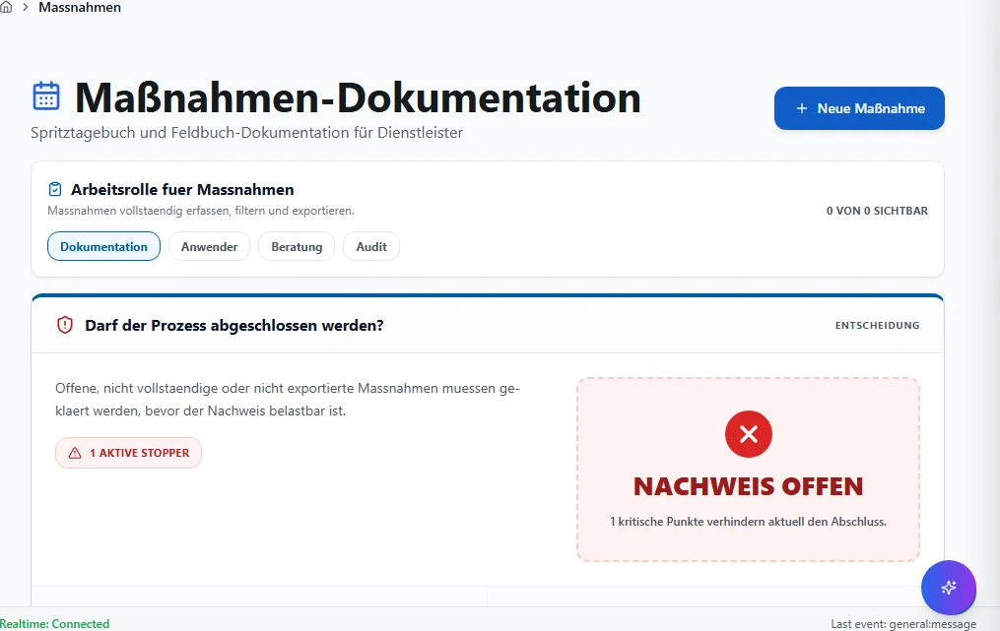

**Schritte:**

1. Sidebar oder Suche: **Massnahmen** öffnen (`/agrar/feldbuch/massnahmen`).
2. Filter und Spalten nach Bedarf setzen; bei ListReport Zeilen per Doppelklick oder Aktion öffnen.
3. Bei Belegen: Kopfdaten prüfen, Positionen erfassen oder ändern, **Speichern** bzw. workflowgebundene Aktion (Freigabe, Folgebeleg) ausführen.
4. Ergebnis in Liste, Detailansicht oder Folgebeleg verifizieren; bei Fehlern Meldungstext und Status prüfen.

**Ergebnis:** Datensatz gespeichert, Liste aktualisiert oder Folgeprozess ausgelöst.

**Häufige Fehler:**

| Symptom | Ursache | Maßnahme |
|---------|---------|----------|
| Maske lädt nicht | Modul nicht freigeschaltet oder fehlende Berechtigung | Administrator: Modul/RBAC prüfen |
| Speichern fehlgeschlagen | Pflichtfeld, Status oder Validierung | Meldung lesen, Pflichtfelder ergänzen |
| Aktion ausgegraut | Workflow-Status oder Sperre | Vorbeleg freigeben oder Berechtigung klären |

### :Id

**Route:** `/agrar/feldbuch/schlag/:id` · **Modul:** `@/pages/agrar/feldbuch/schlagkartei`

**Ziel:** :Id in VALEO NeuroERP öffnen, Daten prüfen oder erfassen und das Ergebnis in Liste bzw. Folgebeleg kontrollieren.

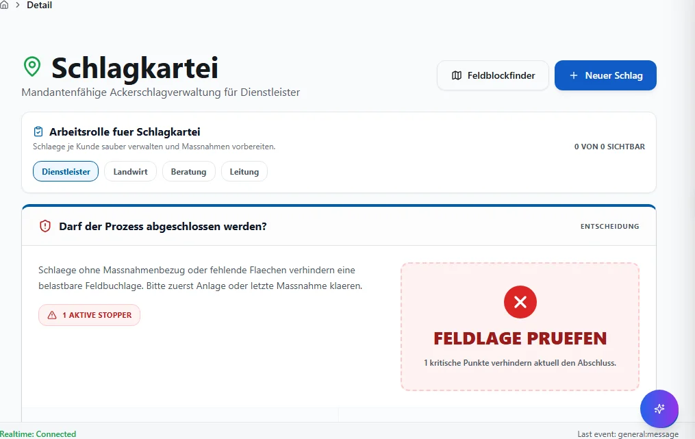

**Schritte:**

1. Sidebar oder Suche: **:Id** öffnen (`/agrar/feldbuch/schlag/:id`).
2. Filter und Spalten nach Bedarf setzen; bei ListReport Zeilen per Doppelklick oder Aktion öffnen.
3. Bei Belegen: Kopfdaten prüfen, Positionen erfassen oder ändern, **Speichern** bzw. workflowgebundene Aktion (Freigabe, Folgebeleg) ausführen.
4. Ergebnis in Liste, Detailansicht oder Folgebeleg verifizieren; bei Fehlern Meldungstext und Status prüfen.

**Ergebnis:** Datensatz gespeichert, Liste aktualisiert oder Folgeprozess ausgelöst.

**Häufige Fehler:**

| Symptom | Ursache | Maßnahme |
|---------|---------|----------|
| Maske lädt nicht | Modul nicht freigeschaltet oder fehlende Berechtigung | Administrator: Modul/RBAC prüfen |
| Speichern fehlgeschlagen | Pflichtfeld, Status oder Validierung | Meldung lesen, Pflichtfelder ergänzen |
| Aktion ausgegraut | Workflow-Status oder Sperre | Vorbeleg freigeben oder Berechtigung klären |

### Neu

**Route:** `/agrar/feldbuch/schlag/neu` · **Modul:** `@/pages/agrar/feldbuch/schlag/neu`

**Ziel:** Neu in VALEO NeuroERP öffnen, Daten prüfen oder erfassen und das Ergebnis in Liste bzw. Folgebeleg kontrollieren.

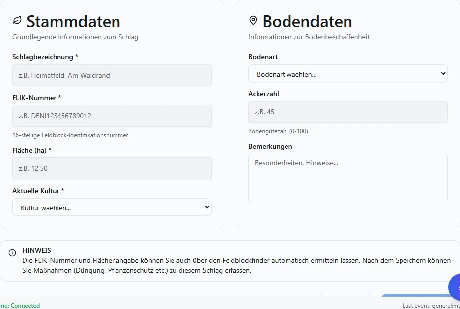

**Schritte:**

1. Sidebar oder Suche: **Neu** öffnen (`/agrar/feldbuch/schlag/neu`).
2. Filter und Spalten nach Bedarf setzen; bei ListReport Zeilen per Doppelklick oder Aktion öffnen.
3. Bei Belegen: Kopfdaten prüfen, Positionen erfassen oder ändern, **Speichern** bzw. workflowgebundene Aktion (Freigabe, Folgebeleg) ausführen.
4. Ergebnis in Liste, Detailansicht oder Folgebeleg verifizieren; bei Fehlern Meldungstext und Status prüfen.

**Ergebnis:** Datensatz gespeichert, Liste aktualisiert oder Folgeprozess ausgelöst.

**Häufige Fehler:**

| Symptom | Ursache | Maßnahme |
|---------|---------|----------|
| Maske lädt nicht | Modul nicht freigeschaltet oder fehlende Berechtigung | Administrator: Modul/RBAC prüfen |
| Speichern fehlgeschlagen | Pflichtfeld, Status oder Validierung | Meldung lesen, Pflichtfelder ergänzen |
| Aktion ausgegraut | Workflow-Status oder Sperre | Vorbeleg freigeben oder Berechtigung klären |

### Schlagkartei

**Route:** `/agrar/feldbuch/schlagkartei` · **Modul:** `@/pages/agrar/feldbuch/schlagkartei`

**Ziel:** Schlagkartei in VALEO NeuroERP öffnen, Daten prüfen oder erfassen und das Ergebnis in Liste bzw. Folgebeleg kontrollieren.

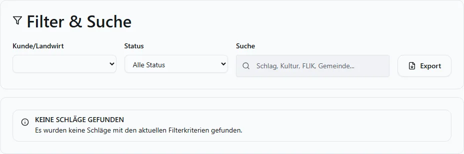

**Schritte:**

1. Sidebar oder Suche: **Schlagkartei** öffnen (`/agrar/feldbuch/schlagkartei`).
2. Filter und Spalten nach Bedarf setzen; bei ListReport Zeilen per Doppelklick oder Aktion öffnen.
3. Bei Belegen: Kopfdaten prüfen, Positionen erfassen oder ändern, **Speichern** bzw. workflowgebundene Aktion (Freigabe, Folgebeleg) ausführen.
4. Ergebnis in Liste, Detailansicht oder Folgebeleg verifizieren; bei Fehlern Meldungstext und Status prüfen.

**Ergebnis:** Datensatz gespeichert, Liste aktualisiert oder Folgeprozess ausgelöst.

**Häufige Fehler:**

| Symptom | Ursache | Maßnahme |
|---------|---------|----------|
| Maske lädt nicht | Modul nicht freigeschaltet oder fehlende Berechtigung | Administrator: Modul/RBAC prüfen |
| Speichern fehlgeschlagen | Pflichtfeld, Status oder Validierung | Meldung lesen, Pflichtfelder ergänzen |
| Aktion ausgegraut | Workflow-Status oder Sperre | Vorbeleg freigeben oder Berechtigung klären |

### :Id

**Route:** `/agrar/harvest-settlement/:id` · **Modul:** `@/pages/agrar/ernte-abrechnung-native`

**Ziel:** :Id in VALEO NeuroERP öffnen, Daten prüfen oder erfassen und das Ergebnis in Liste bzw. Folgebeleg kontrollieren.

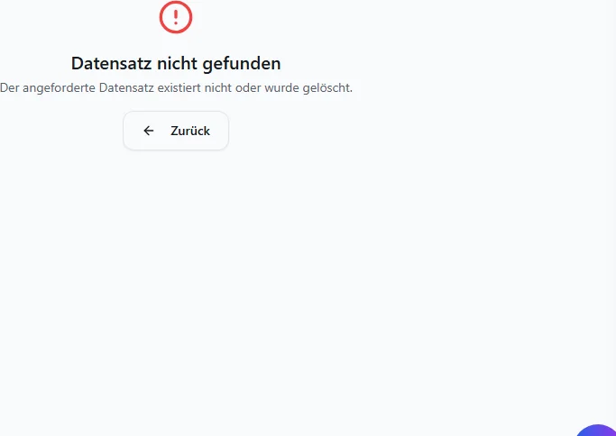

**Schritte:**

1. Sidebar oder Suche: **:Id** öffnen (`/agrar/harvest-settlement/:id`).
2. Filter und Spalten nach Bedarf setzen; bei ListReport Zeilen per Doppelklick oder Aktion öffnen.
3. Bei Belegen: Kopfdaten prüfen, Positionen erfassen oder ändern, **Speichern** bzw. workflowgebundene Aktion (Freigabe, Folgebeleg) ausführen.
4. Ergebnis in Liste, Detailansicht oder Folgebeleg verifizieren; bei Fehlern Meldungstext und Status prüfen.

**Ergebnis:** Datensatz gespeichert, Liste aktualisiert oder Folgeprozess ausgelöst.

**Häufige Fehler:**

| Symptom | Ursache | Maßnahme |
|---------|---------|----------|
| Maske lädt nicht | Modul nicht freigeschaltet oder fehlende Berechtigung | Administrator: Modul/RBAC prüfen |
| Speichern fehlgeschlagen | Pflichtfeld, Status oder Validierung | Meldung lesen, Pflichtfelder ergänzen |
| Aktion ausgegraut | Workflow-Status oder Sperre | Vorbeleg freigeben oder Berechtigung klären |

### Kontrakt Engagement

**Route:** `/agrar/kontrakt-engagement` · **Modul:** `@/pages/agrar/kontrakt-engagement`

**Ziel:** Kontrakt Engagement in VALEO NeuroERP öffnen, Daten prüfen oder erfassen und das Ergebnis in Liste bzw. Folgebeleg kontrollieren.

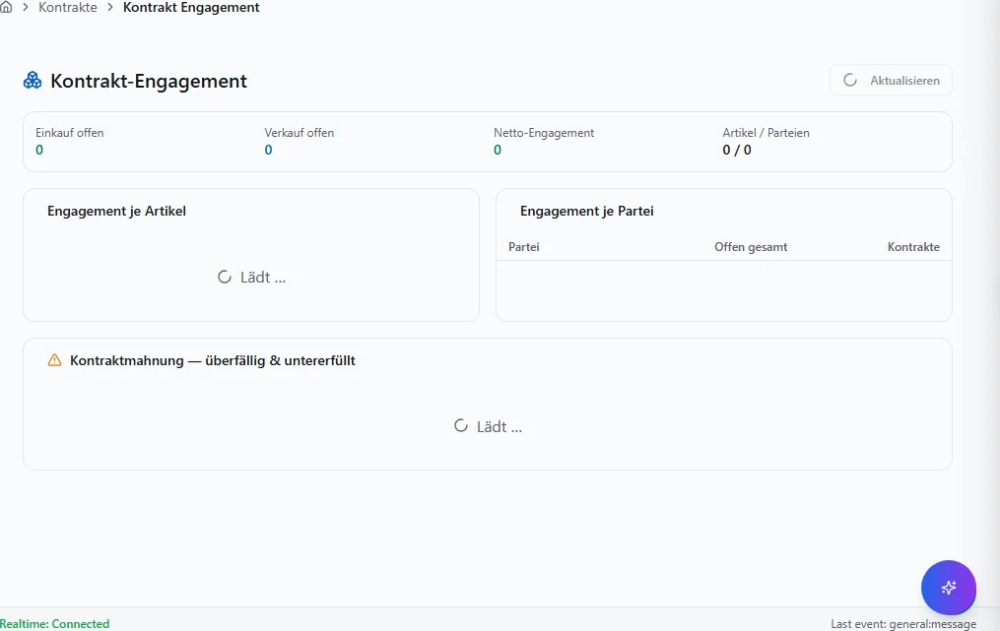

**Schritte:**

1. Sidebar oder Suche: **Kontrakt Engagement** öffnen (`/agrar/kontrakt-engagement`).
2. Filter und Spalten nach Bedarf setzen; bei ListReport Zeilen per Doppelklick oder Aktion öffnen.
3. Bei Belegen: Kopfdaten prüfen, Positionen erfassen oder ändern, **Speichern** bzw. workflowgebundene Aktion (Freigabe, Folgebeleg) ausführen.
4. Ergebnis in Liste, Detailansicht oder Folgebeleg verifizieren; bei Fehlern Meldungstext und Status prüfen.

**Ergebnis:** Datensatz gespeichert, Liste aktualisiert oder Folgeprozess ausgelöst.

**Häufige Fehler:**

| Symptom | Ursache | Maßnahme |
|---------|---------|----------|
| Maske lädt nicht | Modul nicht freigeschaltet oder fehlende Berechtigung | Administrator: Modul/RBAC prüfen |
| Speichern fehlgeschlagen | Pflichtfeld, Status oder Validierung | Meldung lesen, Pflichtfelder ergänzen |
| Aktion ausgegraut | Workflow-Status oder Sperre | Vorbeleg freigeben oder Berechtigung klären |

### Kontrakt Erfuellung

**Route:** `/agrar/kontrakt-erfuellung` · **Modul:** `@/pages/agrar/kontrakt-erfuellung`

**Ziel:** Kontrakt Erfuellung in VALEO NeuroERP öffnen, Daten prüfen oder erfassen und das Ergebnis in Liste bzw. Folgebeleg kontrollieren.

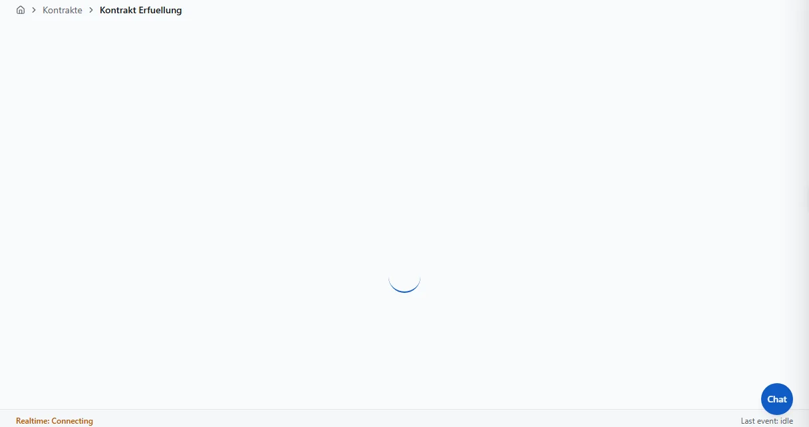

**Schritte:**

1. Sidebar oder Suche: **Kontrakt Erfuellung** öffnen (`/agrar/kontrakt-erfuellung`).
2. Filter und Spalten nach Bedarf setzen; bei ListReport Zeilen per Doppelklick oder Aktion öffnen.
3. Bei Belegen: Kopfdaten prüfen, Positionen erfassen oder ändern, **Speichern** bzw. workflowgebundene Aktion (Freigabe, Folgebeleg) ausführen.
4. Ergebnis in Liste, Detailansicht oder Folgebeleg verifizieren; bei Fehlern Meldungstext und Status prüfen.

**Ergebnis:** Datensatz gespeichert, Liste aktualisiert oder Folgeprozess ausgelöst.

**Häufige Fehler:**

| Symptom | Ursache | Maßnahme |
|---------|---------|----------|
| Maske lädt nicht | Modul nicht freigeschaltet oder fehlende Berechtigung | Administrator: Modul/RBAC prüfen |
| Speichern fehlgeschlagen | Pflichtfeld, Status oder Validierung | Meldung lesen, Pflichtfelder ergänzen |
| Aktion ausgegraut | Workflow-Status oder Sperre | Vorbeleg freigeben oder Berechtigung klären |

### Kontrakt Fixierung

**Route:** `/agrar/kontrakt-fixierung` · **Modul:** `@/pages/agrar/kontrakt-fixierung`

**Ziel:** Kontrakt Fixierung in VALEO NeuroERP öffnen, Daten prüfen oder erfassen und das Ergebnis in Liste bzw. Folgebeleg kontrollieren.

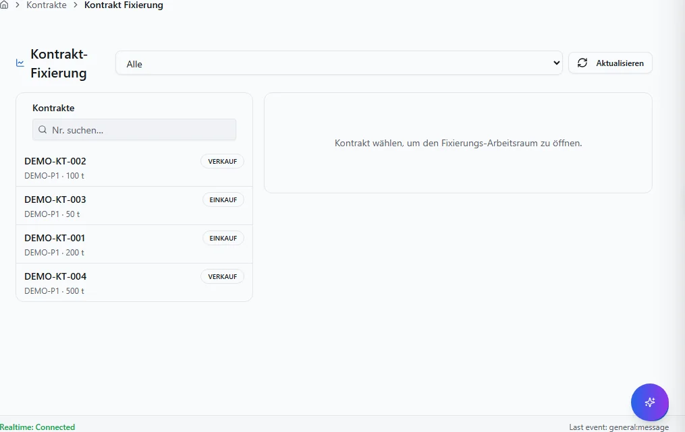

**Schritte:**

1. Sidebar oder Suche: **Kontrakt Fixierung** öffnen (`/agrar/kontrakt-fixierung`).
2. Filter und Spalten nach Bedarf setzen; bei ListReport Zeilen per Doppelklick oder Aktion öffnen.
3. Bei Belegen: Kopfdaten prüfen, Positionen erfassen oder ändern, **Speichern** bzw. workflowgebundene Aktion (Freigabe, Folgebeleg) ausführen.
4. Ergebnis in Liste, Detailansicht oder Folgebeleg verifizieren; bei Fehlern Meldungstext und Status prüfen.

**Ergebnis:** Datensatz gespeichert, Liste aktualisiert oder Folgeprozess ausgelöst.

**Häufige Fehler:**

| Symptom | Ursache | Maßnahme |
|---------|---------|----------|
| Maske lädt nicht | Modul nicht freigeschaltet oder fehlende Berechtigung | Administrator: Modul/RBAC prüfen |
| Speichern fehlgeschlagen | Pflichtfeld, Status oder Validierung | Meldung lesen, Pflichtfelder ergänzen |
| Aktion ausgegraut | Workflow-Status oder Sperre | Vorbeleg freigeben oder Berechtigung klären |

### Kontrakt Settlement

**Route:** `/agrar/kontrakt-settlement` · **Modul:** `@/pages/agrar/kontrakt-settlement`

**Ziel:** Kontrakt Settlement in VALEO NeuroERP öffnen, Daten prüfen oder erfassen und das Ergebnis in Liste bzw. Folgebeleg kontrollieren.

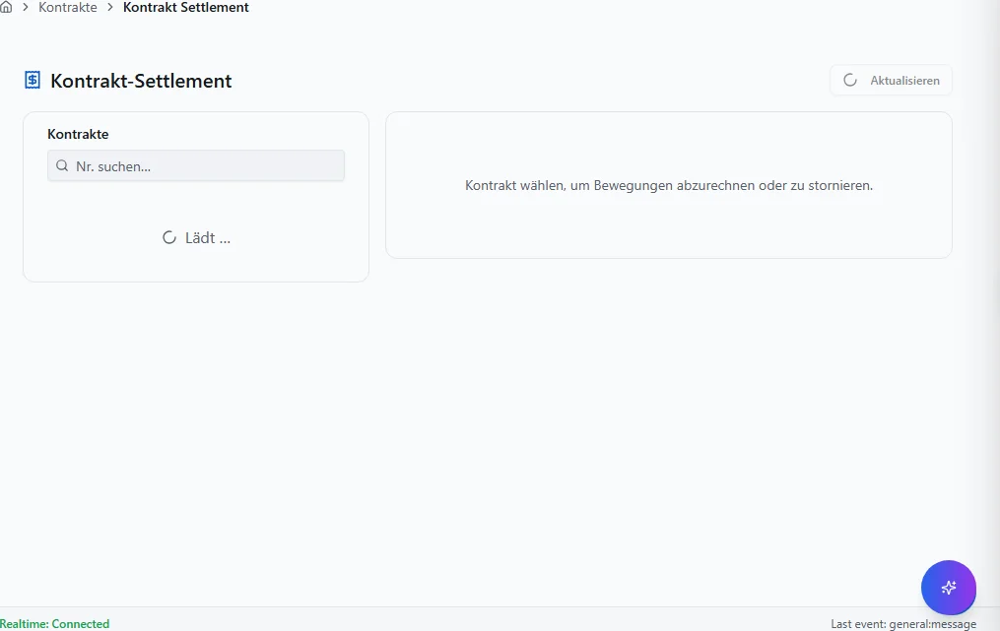

**Schritte:**

1. Sidebar oder Suche: **Kontrakt Settlement** öffnen (`/agrar/kontrakt-settlement`).
2. Filter und Spalten nach Bedarf setzen; bei ListReport Zeilen per Doppelklick oder Aktion öffnen.
3. Bei Belegen: Kopfdaten prüfen, Positionen erfassen oder ändern, **Speichern** bzw. workflowgebundene Aktion (Freigabe, Folgebeleg) ausführen.
4. Ergebnis in Liste, Detailansicht oder Folgebeleg verifizieren; bei Fehlern Meldungstext und Status prüfen.

**Ergebnis:** Datensatz gespeichert, Liste aktualisiert oder Folgeprozess ausgelöst.

**Häufige Fehler:**

| Symptom | Ursache | Maßnahme |
|---------|---------|----------|
| Maske lädt nicht | Modul nicht freigeschaltet oder fehlende Berechtigung | Administrator: Modul/RBAC prüfen |
| Speichern fehlgeschlagen | Pflichtfeld, Status oder Validierung | Meldung lesen, Pflichtfelder ergänzen |
| Aktion ausgegraut | Workflow-Status oder Sperre | Vorbeleg freigeben oder Berechtigung klären |

### Kulturpflanzen

**Route:** `/agrar/kulturpflanzen` · **Modul:** `@/pages/agrar/kulturpflanzen/liste`

**Ziel:** Kulturpflanzen in VALEO NeuroERP öffnen, Daten prüfen oder erfassen und das Ergebnis in Liste bzw. Folgebeleg kontrollieren.

**Schritte:**

1. Sidebar oder Suche: **Kulturpflanzen** öffnen (`/agrar/kulturpflanzen`).
2. Filter und Spalten nach Bedarf setzen; bei ListReport Zeilen per Doppelklick oder Aktion öffnen.
3. Bei Belegen: Kopfdaten prüfen, Positionen erfassen oder ändern, **Speichern** bzw. workflowgebundene Aktion (Freigabe, Folgebeleg) ausführen.
4. Ergebnis in Liste, Detailansicht oder Folgebeleg verifizieren; bei Fehlern Meldungstext und Status prüfen.

**Ergebnis:** Datensatz gespeichert, Liste aktualisiert oder Folgeprozess ausgelöst.

**Häufige Fehler:**

| Symptom | Ursache | Maßnahme |
|---------|---------|----------|
| Maske lädt nicht | Modul nicht freigeschaltet oder fehlende Berechtigung | Administrator: Modul/RBAC prüfen |
| Speichern fehlgeschlagen | Pflichtfeld, Status oder Validierung | Meldung lesen, Pflichtfelder ergänzen |
| Aktion ausgegraut | Workflow-Status oder Sperre | Vorbeleg freigeben oder Berechtigung klären |

### :Id

**Route:** `/agrar/kulturpflanzen/:id` · **Modul:** `@/pages/agrar/kulturpflanzen/liste`

**Ziel:** :Id in VALEO NeuroERP öffnen, Daten prüfen oder erfassen und das Ergebnis in Liste bzw. Folgebeleg kontrollieren.

**Schritte:**

1. Sidebar oder Suche: **:Id** öffnen (`/agrar/kulturpflanzen/:id`).
2. Filter und Spalten nach Bedarf setzen; bei ListReport Zeilen per Doppelklick oder Aktion öffnen.
3. Bei Belegen: Kopfdaten prüfen, Positionen erfassen oder ändern, **Speichern** bzw. workflowgebundene Aktion (Freigabe, Folgebeleg) ausführen.
4. Ergebnis in Liste, Detailansicht oder Folgebeleg verifizieren; bei Fehlern Meldungstext und Status prüfen.

**Ergebnis:** Datensatz gespeichert, Liste aktualisiert oder Folgeprozess ausgelöst.

**Häufige Fehler:**

| Symptom | Ursache | Maßnahme |
|---------|---------|----------|
| Maske lädt nicht | Modul nicht freigeschaltet oder fehlende Berechtigung | Administrator: Modul/RBAC prüfen |
| Speichern fehlgeschlagen | Pflichtfeld, Status oder Validierung | Meldung lesen, Pflichtfelder ergänzen |
| Aktion ausgegraut | Workflow-Status oder Sperre | Vorbeleg freigeben oder Berechtigung klären |

### Liste

**Route:** `/agrar/kulturpflanzen/liste` · **Modul:** `@/pages/agrar/kulturpflanzen/liste`

**Ziel:** Liste in VALEO NeuroERP öffnen, Daten prüfen oder erfassen und das Ergebnis in Liste bzw. Folgebeleg kontrollieren.

**Schritte:**

1. Sidebar oder Suche: **Liste** öffnen (`/agrar/kulturpflanzen/liste`).
2. Filter und Spalten nach Bedarf setzen; bei ListReport Zeilen per Doppelklick oder Aktion öffnen.
3. Bei Belegen: Kopfdaten prüfen, Positionen erfassen oder ändern, **Speichern** bzw. workflowgebundene Aktion (Freigabe, Folgebeleg) ausführen.
4. Ergebnis in Liste, Detailansicht oder Folgebeleg verifizieren; bei Fehlern Meldungstext und Status prüfen.

**Ergebnis:** Datensatz gespeichert, Liste aktualisiert oder Folgeprozess ausgelöst.

**Häufige Fehler:**

| Symptom | Ursache | Maßnahme |
|---------|---------|----------|
| Maske lädt nicht | Modul nicht freigeschaltet oder fehlende Berechtigung | Administrator: Modul/RBAC prüfen |
| Speichern fehlgeschlagen | Pflichtfeld, Status oder Validierung | Meldung lesen, Pflichtfelder ergänzen |
| Aktion ausgegraut | Workflow-Status oder Sperre | Vorbeleg freigeben oder Berechtigung klären |

### Neu

**Route:** `/agrar/kulturpflanzen/neu` · **Modul:** `@/pages/agrar/kulturpflanzen/liste`

**Ziel:** Neu in VALEO NeuroERP öffnen, Daten prüfen oder erfassen und das Ergebnis in Liste bzw. Folgebeleg kontrollieren.

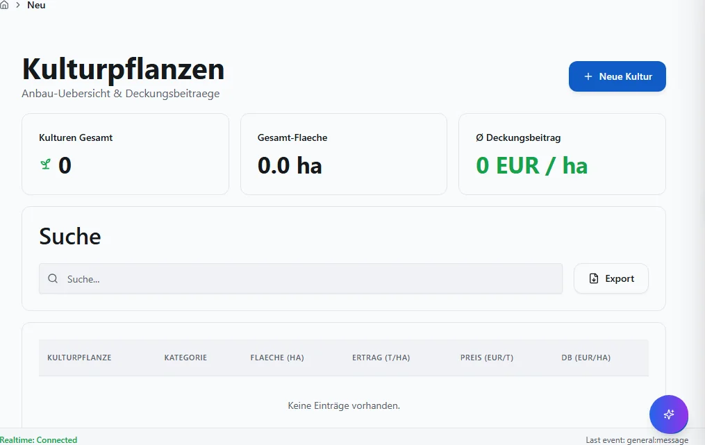

**Schritte:**

1. Sidebar oder Suche: **Neu** öffnen (`/agrar/kulturpflanzen/neu`).
2. Filter und Spalten nach Bedarf setzen; bei ListReport Zeilen per Doppelklick oder Aktion öffnen.
3. Bei Belegen: Kopfdaten prüfen, Positionen erfassen oder ändern, **Speichern** bzw. workflowgebundene Aktion (Freigabe, Folgebeleg) ausführen.
4. Ergebnis in Liste, Detailansicht oder Folgebeleg verifizieren; bei Fehlern Meldungstext und Status prüfen.

**Ergebnis:** Datensatz gespeichert, Liste aktualisiert oder Folgeprozess ausgelöst.

**Häufige Fehler:**

| Symptom | Ursache | Maßnahme |
|---------|---------|----------|
| Maske lädt nicht | Modul nicht freigeschaltet oder fehlende Berechtigung | Administrator: Modul/RBAC prüfen |
| Speichern fehlgeschlagen | Pflichtfeld, Status oder Validierung | Meldung lesen, Pflichtfelder ergänzen |
| Aktion ausgegraut | Workflow-Status oder Sperre | Vorbeleg freigeben oder Berechtigung klären |

### Kunden Schlagkartei

**Route:** `/agrar/kunden-schlagkartei` · **Modul:** `@/pages/agrar/kunden-schlagkartei`

**Ziel:** Kunden Schlagkartei in VALEO NeuroERP öffnen, Daten prüfen oder erfassen und das Ergebnis in Liste bzw. Folgebeleg kontrollieren.

**Schritte:**

1. Sidebar oder Suche: **Kunden Schlagkartei** öffnen (`/agrar/kunden-schlagkartei`).
2. Filter und Spalten nach Bedarf setzen; bei ListReport Zeilen per Doppelklick oder Aktion öffnen.
3. Bei Belegen: Kopfdaten prüfen, Positionen erfassen oder ändern, **Speichern** bzw. workflowgebundene Aktion (Freigabe, Folgebeleg) ausführen.
4. Ergebnis in Liste, Detailansicht oder Folgebeleg verifizieren; bei Fehlern Meldungstext und Status prüfen.

**Ergebnis:** Datensatz gespeichert, Liste aktualisiert oder Folgeprozess ausgelöst.

**Häufige Fehler:**

| Symptom | Ursache | Maßnahme |
|---------|---------|----------|
| Maske lädt nicht | Modul nicht freigeschaltet oder fehlende Berechtigung | Administrator: Modul/RBAC prüfen |
| Speichern fehlgeschlagen | Pflichtfeld, Status oder Validierung | Meldung lesen, Pflichtfelder ergänzen |
| Aktion ausgegraut | Workflow-Status oder Sperre | Vorbeleg freigeben oder Berechtigung klären |

### :Kunden Nr

**Route:** `/agrar/kunden-schlagkartei/:kunden_nr` · **Modul:** `@/pages/agrar/kunden-schlagkartei`

**Ziel:** :Kunden Nr in VALEO NeuroERP öffnen, Daten prüfen oder erfassen und das Ergebnis in Liste bzw. Folgebeleg kontrollieren.

**Schritte:**

1. Sidebar oder Suche: **:Kunden Nr** öffnen (`/agrar/kunden-schlagkartei/:kunden_nr`).
2. Filter und Spalten nach Bedarf setzen; bei ListReport Zeilen per Doppelklick oder Aktion öffnen.
3. Bei Belegen: Kopfdaten prüfen, Positionen erfassen oder ändern, **Speichern** bzw. workflowgebundene Aktion (Freigabe, Folgebeleg) ausführen.
4. Ergebnis in Liste, Detailansicht oder Folgebeleg verifizieren; bei Fehlern Meldungstext und Status prüfen.

**Ergebnis:** Datensatz gespeichert, Liste aktualisiert oder Folgeprozess ausgelöst.

**Häufige Fehler:**

| Symptom | Ursache | Maßnahme |
|---------|---------|----------|
| Maske lädt nicht | Modul nicht freigeschaltet oder fehlende Berechtigung | Administrator: Modul/RBAC prüfen |
| Speichern fehlgeschlagen | Pflichtfeld, Status oder Validierung | Meldung lesen, Pflichtfelder ergänzen |
| Aktion ausgegraut | Workflow-Status oder Sperre | Vorbeleg freigeben oder Berechtigung klären |

### Maschinenauslastung

**Route:** `/agrar/maschinenauslastung` · **Modul:** `@/pages/agrar/maschinenauslastung`

**Ziel:** Maschinenauslastung in VALEO NeuroERP öffnen, Daten prüfen oder erfassen und das Ergebnis in Liste bzw. Folgebeleg kontrollieren.

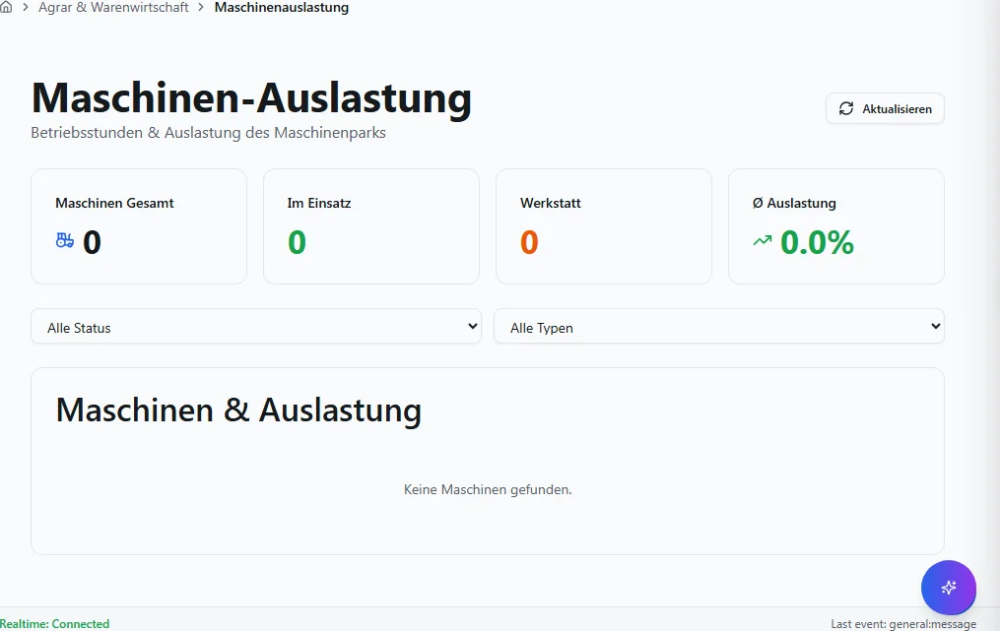

**Schritte:**

1. Sidebar oder Suche: **Maschinenauslastung** öffnen (`/agrar/maschinenauslastung`).
2. Filter und Spalten nach Bedarf setzen; bei ListReport Zeilen per Doppelklick oder Aktion öffnen.
3. Bei Belegen: Kopfdaten prüfen, Positionen erfassen oder ändern, **Speichern** bzw. workflowgebundene Aktion (Freigabe, Folgebeleg) ausführen.
4. Ergebnis in Liste, Detailansicht oder Folgebeleg verifizieren; bei Fehlern Meldungstext und Status prüfen.

**Ergebnis:** Datensatz gespeichert, Liste aktualisiert oder Folgeprozess ausgelöst.

**Häufige Fehler:**

| Symptom | Ursache | Maßnahme |
|---------|---------|----------|
| Maske lädt nicht | Modul nicht freigeschaltet oder fehlende Berechtigung | Administrator: Modul/RBAC prüfen |
| Speichern fehlgeschlagen | Pflichtfeld, Status oder Validierung | Meldung lesen, Pflichtfelder ergänzen |
| Aktion ausgegraut | Workflow-Status oder Sperre | Vorbeleg freigeben oder Berechtigung klären |

### Milchvieh Crosssell

**Route:** `/agrar/milchvieh-crosssell` · **Modul:** `@/pages/agrar/milchvieh-crosssell`

**Ziel:** Milchvieh Crosssell in VALEO NeuroERP öffnen, Daten prüfen oder erfassen und das Ergebnis in Liste bzw. Folgebeleg kontrollieren.

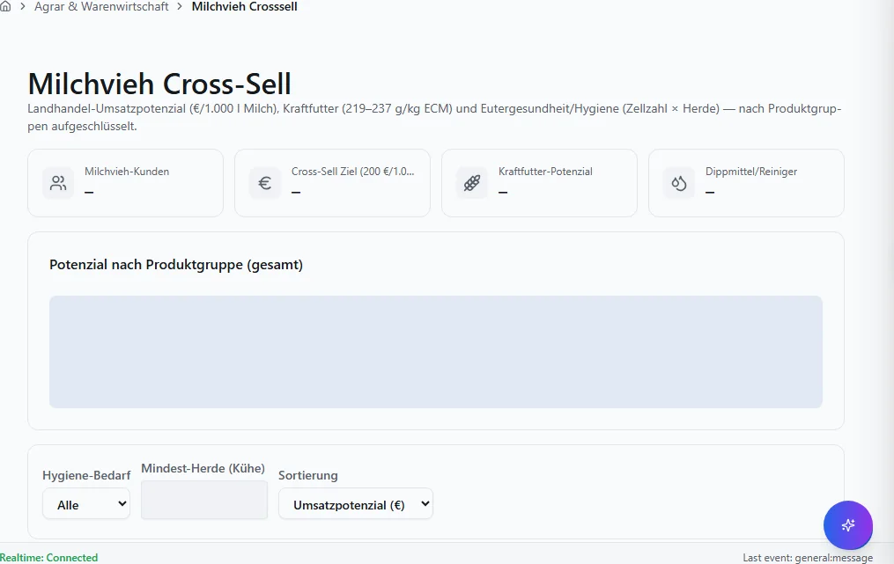

**Schritte:**

1. Sidebar oder Suche: **Milchvieh Crosssell** öffnen (`/agrar/milchvieh-crosssell`).
2. Filter und Spalten nach Bedarf setzen; bei ListReport Zeilen per Doppelklick oder Aktion öffnen.
3. Bei Belegen: Kopfdaten prüfen, Positionen erfassen oder ändern, **Speichern** bzw. workflowgebundene Aktion (Freigabe, Folgebeleg) ausführen.
4. Ergebnis in Liste, Detailansicht oder Folgebeleg verifizieren; bei Fehlern Meldungstext und Status prüfen.

**Ergebnis:** Datensatz gespeichert, Liste aktualisiert oder Folgeprozess ausgelöst.

**Häufige Fehler:**

| Symptom | Ursache | Maßnahme |
|---------|---------|----------|
| Maske lädt nicht | Modul nicht freigeschaltet oder fehlende Berechtigung | Administrator: Modul/RBAC prüfen |
| Speichern fehlgeschlagen | Pflichtfeld, Status oder Validierung | Meldung lesen, Pflichtfelder ergänzen |
| Aktion ausgegraut | Workflow-Status oder Sperre | Vorbeleg freigeben oder Berechtigung klären |

### Milchvieh Karte

**Route:** `/agrar/milchvieh-karte` · **Modul:** `@/pages/agrar/milchvieh-karte`

**Ziel:** Milchvieh Karte in VALEO NeuroERP öffnen, Daten prüfen oder erfassen und das Ergebnis in Liste bzw. Folgebeleg kontrollieren.

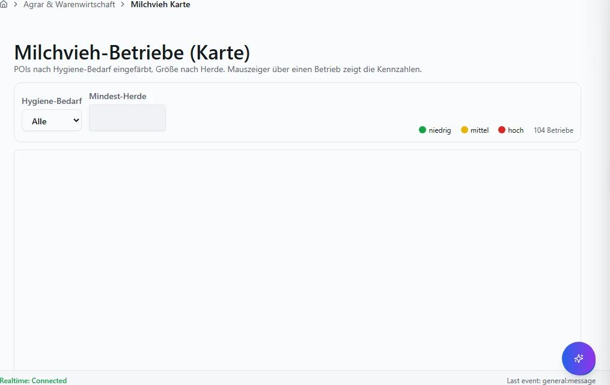

**Schritte:**

1. Sidebar oder Suche: **Milchvieh Karte** öffnen (`/agrar/milchvieh-karte`).
2. Filter und Spalten nach Bedarf setzen; bei ListReport Zeilen per Doppelklick oder Aktion öffnen.
3. Bei Belegen: Kopfdaten prüfen, Positionen erfassen oder ändern, **Speichern** bzw. workflowgebundene Aktion (Freigabe, Folgebeleg) ausführen.
4. Ergebnis in Liste, Detailansicht oder Folgebeleg verifizieren; bei Fehlern Meldungstext und Status prüfen.

**Ergebnis:** Datensatz gespeichert, Liste aktualisiert oder Folgeprozess ausgelöst.

**Häufige Fehler:**

| Symptom | Ursache | Maßnahme |
|---------|---------|----------|
| Maske lädt nicht | Modul nicht freigeschaltet oder fehlende Berechtigung | Administrator: Modul/RBAC prüfen |
| Speichern fehlgeschlagen | Pflichtfeld, Status oder Validierung | Meldung lesen, Pflichtfelder ergänzen |
| Aktion ausgegraut | Workflow-Status oder Sperre | Vorbeleg freigeben oder Berechtigung klären |

### Applikation

**Route:** `/agrar/pflanzenschutz/applikation` · **Modul:** `@/pages/agrar/pflanzenschutz/applikation`

**Ziel:** Applikation in VALEO NeuroERP öffnen, Daten prüfen oder erfassen und das Ergebnis in Liste bzw. Folgebeleg kontrollieren.

**Schritte:**

1. Sidebar oder Suche: **Applikation** öffnen (`/agrar/pflanzenschutz/applikation`).
2. Filter und Spalten nach Bedarf setzen; bei ListReport Zeilen per Doppelklick oder Aktion öffnen.
3. Bei Belegen: Kopfdaten prüfen, Positionen erfassen oder ändern, **Speichern** bzw. workflowgebundene Aktion (Freigabe, Folgebeleg) ausführen.
4. Ergebnis in Liste, Detailansicht oder Folgebeleg verifizieren; bei Fehlern Meldungstext und Status prüfen.

**Ergebnis:** Datensatz gespeichert, Liste aktualisiert oder Folgeprozess ausgelöst.

**Häufige Fehler:**

| Symptom | Ursache | Maßnahme |
|---------|---------|----------|
| Maske lädt nicht | Modul nicht freigeschaltet oder fehlende Berechtigung | Administrator: Modul/RBAC prüfen |
| Speichern fehlgeschlagen | Pflichtfeld, Status oder Validierung | Meldung lesen, Pflichtfelder ergänzen |
| Aktion ausgegraut | Workflow-Status oder Sperre | Vorbeleg freigeben oder Berechtigung klären |

### Psm

**Route:** `/agrar/psm` · **Modul:** `@/pages/agrar/psm/liste`

**Ziel:** Psm in VALEO NeuroERP öffnen, Daten prüfen oder erfassen und das Ergebnis in Liste bzw. Folgebeleg kontrollieren.

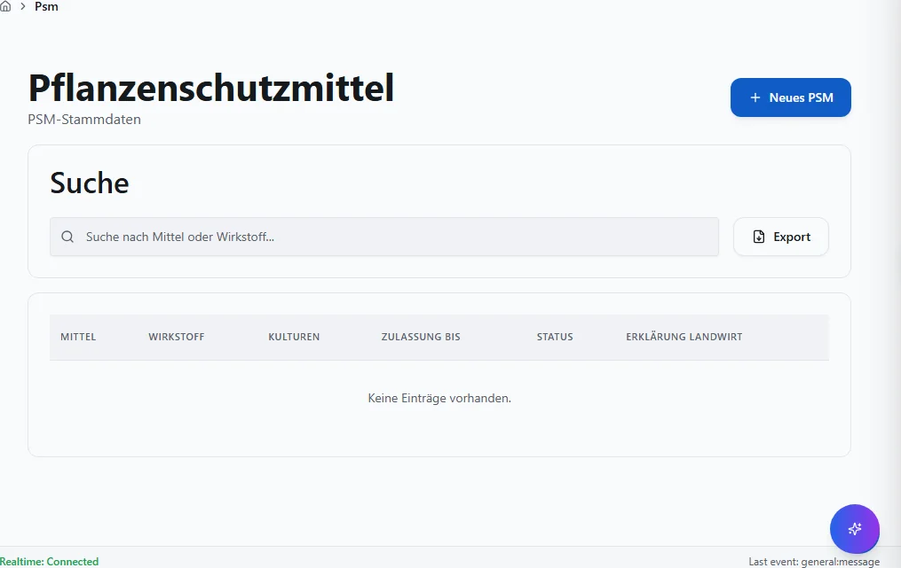

**Schritte:**

1. Sidebar oder Suche: **Psm** öffnen (`/agrar/psm`).
2. Filter und Spalten nach Bedarf setzen; bei ListReport Zeilen per Doppelklick oder Aktion öffnen.
3. Bei Belegen: Kopfdaten prüfen, Positionen erfassen oder ändern, **Speichern** bzw. workflowgebundene Aktion (Freigabe, Folgebeleg) ausführen.
4. Ergebnis in Liste, Detailansicht oder Folgebeleg verifizieren; bei Fehlern Meldungstext und Status prüfen.

**Ergebnis:** Datensatz gespeichert, Liste aktualisiert oder Folgeprozess ausgelöst.

**Häufige Fehler:**

| Symptom | Ursache | Maßnahme |
|---------|---------|----------|
| Maske lädt nicht | Modul nicht freigeschaltet oder fehlende Berechtigung | Administrator: Modul/RBAC prüfen |
| Speichern fehlgeschlagen | Pflichtfeld, Status oder Validierung | Meldung lesen, Pflichtfelder ergänzen |
| Aktion ausgegraut | Workflow-Status oder Sperre | Vorbeleg freigeben oder Berechtigung klären |

### Abgabedokumentation

**Route:** `/agrar/psm/abgabedokumentation` · **Modul:** `@/pages/agrar/psm/abgabedokumentation`

**Ziel:** Abgabedokumentation in VALEO NeuroERP öffnen, Daten prüfen oder erfassen und das Ergebnis in Liste bzw. Folgebeleg kontrollieren.

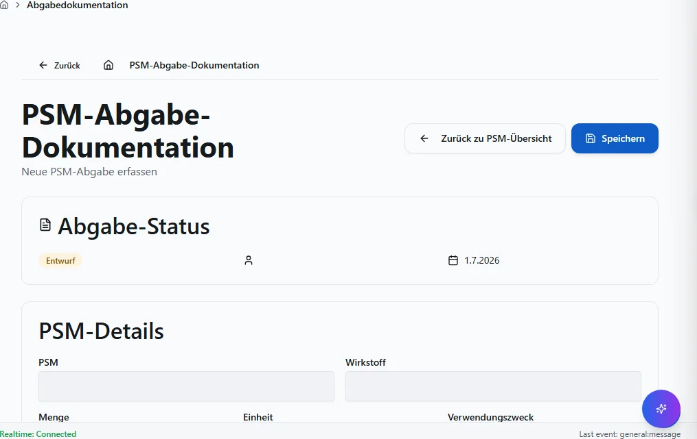

**Schritte:**

1. Sidebar oder Suche: **Abgabedokumentation** öffnen (`/agrar/psm/abgabedokumentation`).
2. Filter und Spalten nach Bedarf setzen; bei ListReport Zeilen per Doppelklick oder Aktion öffnen.
3. Bei Belegen: Kopfdaten prüfen, Positionen erfassen oder ändern, **Speichern** bzw. workflowgebundene Aktion (Freigabe, Folgebeleg) ausführen.
4. Ergebnis in Liste, Detailansicht oder Folgebeleg verifizieren; bei Fehlern Meldungstext und Status prüfen.

**Ergebnis:** Datensatz gespeichert, Liste aktualisiert oder Folgeprozess ausgelöst.

**Häufige Fehler:**

| Symptom | Ursache | Maßnahme |
|---------|---------|----------|
| Maske lädt nicht | Modul nicht freigeschaltet oder fehlende Berechtigung | Administrator: Modul/RBAC prüfen |
| Speichern fehlgeschlagen | Pflichtfeld, Status oder Validierung | Meldung lesen, Pflichtfelder ergänzen |
| Aktion ausgegraut | Workflow-Status oder Sperre | Vorbeleg freigeben oder Berechtigung klären |

### Auflagen Manager

**Route:** `/agrar/psm/auflagen-manager` · **Modul:** `@/pages/agrar/psm/auflagen-manager`

**Ziel:** Auflagen Manager in VALEO NeuroERP öffnen, Daten prüfen oder erfassen und das Ergebnis in Liste bzw. Folgebeleg kontrollieren.

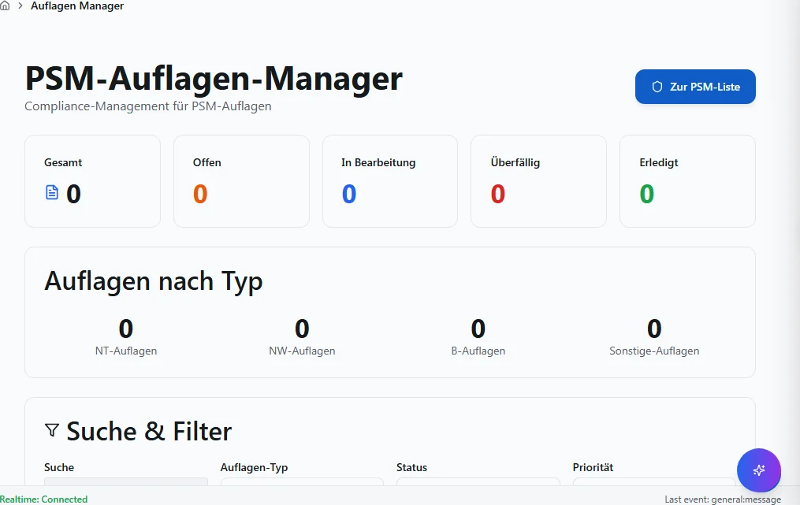

**Schritte:**

1. Sidebar oder Suche: **Auflagen Manager** öffnen (`/agrar/psm/auflagen-manager`).
2. Filter und Spalten nach Bedarf setzen; bei ListReport Zeilen per Doppelklick oder Aktion öffnen.
3. Bei Belegen: Kopfdaten prüfen, Positionen erfassen oder ändern, **Speichern** bzw. workflowgebundene Aktion (Freigabe, Folgebeleg) ausführen.
4. Ergebnis in Liste, Detailansicht oder Folgebeleg verifizieren; bei Fehlern Meldungstext und Status prüfen.

**Ergebnis:** Datensatz gespeichert, Liste aktualisiert oder Folgeprozess ausgelöst.

**Häufige Fehler:**

| Symptom | Ursache | Maßnahme |
|---------|---------|----------|
| Maske lädt nicht | Modul nicht freigeschaltet oder fehlende Berechtigung | Administrator: Modul/RBAC prüfen |
| Speichern fehlgeschlagen | Pflichtfeld, Status oder Validierung | Meldung lesen, Pflichtfelder ergänzen |
| Aktion ausgegraut | Workflow-Status oder Sperre | Vorbeleg freigeben oder Berechtigung klären |

### Bearbeiten

**Route:** `/agrar/psm/auflagen/:id/bearbeiten` · **Modul:** `@/pages/agrar/psm/auflagen-manager`

**Ziel:** Bearbeiten in VALEO NeuroERP öffnen, Daten prüfen oder erfassen und das Ergebnis in Liste bzw. Folgebeleg kontrollieren.

**Schritte:**

1. Sidebar oder Suche: **Bearbeiten** öffnen (`/agrar/psm/auflagen/:id/bearbeiten`).
2. Filter und Spalten nach Bedarf setzen; bei ListReport Zeilen per Doppelklick oder Aktion öffnen.
3. Bei Belegen: Kopfdaten prüfen, Positionen erfassen oder ändern, **Speichern** bzw. workflowgebundene Aktion (Freigabe, Folgebeleg) ausführen.
4. Ergebnis in Liste, Detailansicht oder Folgebeleg verifizieren; bei Fehlern Meldungstext und Status prüfen.

**Ergebnis:** Datensatz gespeichert, Liste aktualisiert oder Folgeprozess ausgelöst.

**Häufige Fehler:**

| Symptom | Ursache | Maßnahme |
|---------|---------|----------|
| Maske lädt nicht | Modul nicht freigeschaltet oder fehlende Berechtigung | Administrator: Modul/RBAC prüfen |
| Speichern fehlgeschlagen | Pflichtfeld, Status oder Validierung | Meldung lesen, Pflichtfelder ergänzen |
| Aktion ausgegraut | Workflow-Status oder Sperre | Vorbeleg freigeben oder Berechtigung klären |

### Beratung

**Route:** `/agrar/psm/beratung` · **Modul:** `@/pages/agrar/psm/beratung`

**Ziel:** Beratung in VALEO NeuroERP öffnen, Daten prüfen oder erfassen und das Ergebnis in Liste bzw. Folgebeleg kontrollieren.

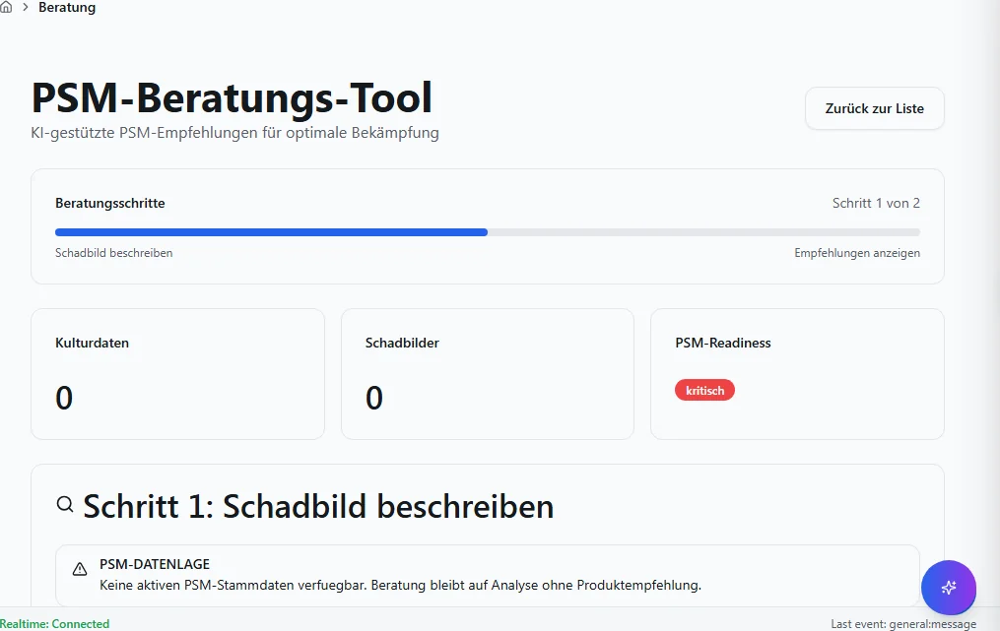

**Schritte:**

1. Sidebar oder Suche: **Beratung** öffnen (`/agrar/psm/beratung`).
2. Filter und Spalten nach Bedarf setzen; bei ListReport Zeilen per Doppelklick oder Aktion öffnen.
3. Bei Belegen: Kopfdaten prüfen, Positionen erfassen oder ändern, **Speichern** bzw. workflowgebundene Aktion (Freigabe, Folgebeleg) ausführen.
4. Ergebnis in Liste, Detailansicht oder Folgebeleg verifizieren; bei Fehlern Meldungstext und Status prüfen.

**Ergebnis:** Datensatz gespeichert, Liste aktualisiert oder Folgeprozess ausgelöst.

**Häufige Fehler:**

| Symptom | Ursache | Maßnahme |
|---------|---------|----------|
| Maske lädt nicht | Modul nicht freigeschaltet oder fehlende Berechtigung | Administrator: Modul/RBAC prüfen |
| Speichern fehlgeschlagen | Pflichtfeld, Status oder Validierung | Meldung lesen, Pflichtfelder ergänzen |
| Aktion ausgegraut | Workflow-Status oder Sperre | Vorbeleg freigeben oder Berechtigung klären |

### Liste

**Route:** `/agrar/psm/liste` · **Modul:** `@/pages/agrar/psm/liste`

**Ziel:** Liste in VALEO NeuroERP öffnen, Daten prüfen oder erfassen und das Ergebnis in Liste bzw. Folgebeleg kontrollieren.

**Schritte:**

1. Sidebar oder Suche: **Liste** öffnen (`/agrar/psm/liste`).
2. Filter und Spalten nach Bedarf setzen; bei ListReport Zeilen per Doppelklick oder Aktion öffnen.
3. Bei Belegen: Kopfdaten prüfen, Positionen erfassen oder ändern, **Speichern** bzw. workflowgebundene Aktion (Freigabe, Folgebeleg) ausführen.
4. Ergebnis in Liste, Detailansicht oder Folgebeleg verifizieren; bei Fehlern Meldungstext und Status prüfen.

**Ergebnis:** Datensatz gespeichert, Liste aktualisiert oder Folgeprozess ausgelöst.

**Häufige Fehler:**

| Symptom | Ursache | Maßnahme |
|---------|---------|----------|
| Maske lädt nicht | Modul nicht freigeschaltet oder fehlende Berechtigung | Administrator: Modul/RBAC prüfen |
| Speichern fehlgeschlagen | Pflichtfeld, Status oder Validierung | Meldung lesen, Pflichtfelder ergänzen |
| Aktion ausgegraut | Workflow-Status oder Sperre | Vorbeleg freigeben oder Berechtigung klären |

### Resistenz

**Route:** `/agrar/psm/resistenz` · **Modul:** `@/pages/agrar/psm/resistenz`

**Ziel:** Resistenz in VALEO NeuroERP öffnen, Daten prüfen oder erfassen und das Ergebnis in Liste bzw. Folgebeleg kontrollieren.

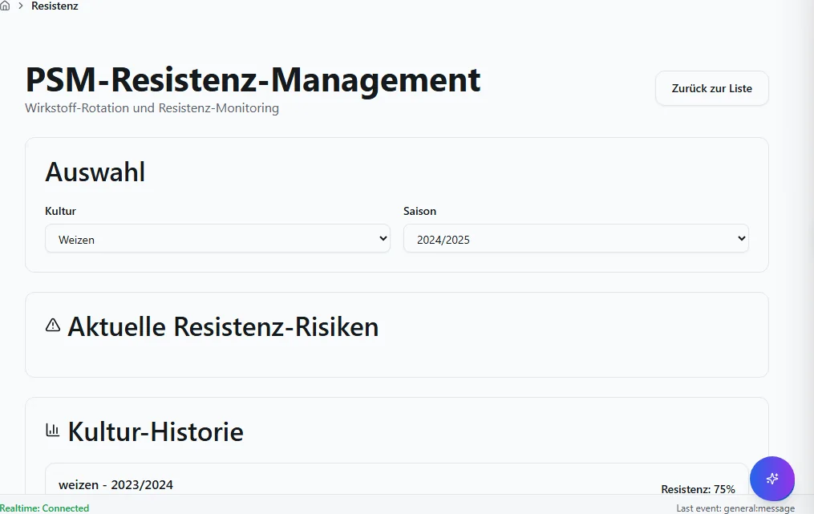

**Schritte:**

1. Sidebar oder Suche: **Resistenz** öffnen (`/agrar/psm/resistenz`).
2. Filter und Spalten nach Bedarf setzen; bei ListReport Zeilen per Doppelklick oder Aktion öffnen.
3. Bei Belegen: Kopfdaten prüfen, Positionen erfassen oder ändern, **Speichern** bzw. workflowgebundene Aktion (Freigabe, Folgebeleg) ausführen.
4. Ergebnis in Liste, Detailansicht oder Folgebeleg verifizieren; bei Fehlern Meldungstext und Status prüfen.

**Ergebnis:** Datensatz gespeichert, Liste aktualisiert oder Folgeprozess ausgelöst.

**Häufige Fehler:**

| Symptom | Ursache | Maßnahme |
|---------|---------|----------|
| Maske lädt nicht | Modul nicht freigeschaltet oder fehlende Berechtigung | Administrator: Modul/RBAC prüfen |
| Speichern fehlgeschlagen | Pflichtfeld, Status oder Validierung | Meldung lesen, Pflichtfelder ergänzen |
| Aktion ausgegraut | Workflow-Status oder Sperre | Vorbeleg freigeben oder Berechtigung klären |

### Sachkunde Register

**Route:** `/agrar/psm/sachkunde-register` · **Modul:** `@/pages/agrar/psm/sachkunde-register`

**Ziel:** Sachkunde Register in VALEO NeuroERP öffnen, Daten prüfen oder erfassen und das Ergebnis in Liste bzw. Folgebeleg kontrollieren.

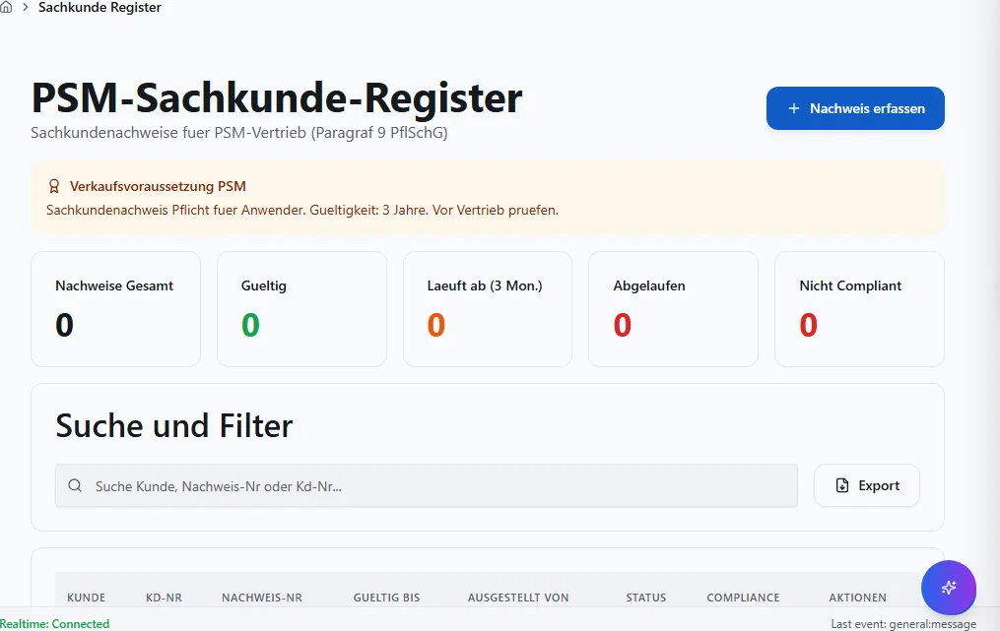

**Schritte:**

1. Sidebar oder Suche: **Sachkunde Register** öffnen (`/agrar/psm/sachkunde-register`).
2. Filter und Spalten nach Bedarf setzen; bei ListReport Zeilen per Doppelklick oder Aktion öffnen.
3. Bei Belegen: Kopfdaten prüfen, Positionen erfassen oder ändern, **Speichern** bzw. workflowgebundene Aktion (Freigabe, Folgebeleg) ausführen.
4. Ergebnis in Liste, Detailansicht oder Folgebeleg verifizieren; bei Fehlern Meldungstext und Status prüfen.

**Ergebnis:** Datensatz gespeichert, Liste aktualisiert oder Folgeprozess ausgelöst.

**Häufige Fehler:**

| Symptom | Ursache | Maßnahme |
|---------|---------|----------|
| Maske lädt nicht | Modul nicht freigeschaltet oder fehlende Berechtigung | Administrator: Modul/RBAC prüfen |
| Speichern fehlgeschlagen | Pflichtfeld, Status oder Validierung | Meldung lesen, Pflichtfelder ergänzen |
| Aktion ausgegraut | Workflow-Status oder Sperre | Vorbeleg freigeben oder Berechtigung klären |

### Edit

**Route:** `/agrar/psm/sachkunde/:id/edit` · **Modul:** `@/pages/agrar/psm/sachkunde-register`

**Ziel:** Edit in VALEO NeuroERP öffnen, Daten prüfen oder erfassen und das Ergebnis in Liste bzw. Folgebeleg kontrollieren.

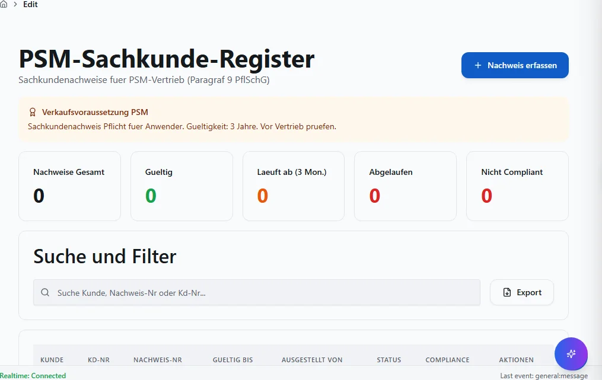

**Schritte:**

1. Sidebar oder Suche: **Edit** öffnen (`/agrar/psm/sachkunde/:id/edit`).
2. Filter und Spalten nach Bedarf setzen; bei ListReport Zeilen per Doppelklick oder Aktion öffnen.
3. Bei Belegen: Kopfdaten prüfen, Positionen erfassen oder ändern, **Speichern** bzw. workflowgebundene Aktion (Freigabe, Folgebeleg) ausführen.
4. Ergebnis in Liste, Detailansicht oder Folgebeleg verifizieren; bei Fehlern Meldungstext und Status prüfen.

**Ergebnis:** Datensatz gespeichert, Liste aktualisiert oder Folgeprozess ausgelöst.

**Häufige Fehler:**

| Symptom | Ursache | Maßnahme |
|---------|---------|----------|
| Maske lädt nicht | Modul nicht freigeschaltet oder fehlende Berechtigung | Administrator: Modul/RBAC prüfen |
| Speichern fehlgeschlagen | Pflichtfeld, Status oder Validierung | Meldung lesen, Pflichtfelder ergänzen |
| Aktion ausgegraut | Workflow-Status oder Sperre | Vorbeleg freigeben oder Berechtigung klären |

### Neu

**Route:** `/agrar/psm/sachkunde/neu` · **Modul:** `@/pages/agrar/psm/sachkunde-register`

**Ziel:** Neu in VALEO NeuroERP öffnen, Daten prüfen oder erfassen und das Ergebnis in Liste bzw. Folgebeleg kontrollieren.

**Schritte:**

1. Sidebar oder Suche: **Neu** öffnen (`/agrar/psm/sachkunde/neu`).
2. Filter und Spalten nach Bedarf setzen; bei ListReport Zeilen per Doppelklick oder Aktion öffnen.
3. Bei Belegen: Kopfdaten prüfen, Positionen erfassen oder ändern, **Speichern** bzw. workflowgebundene Aktion (Freigabe, Folgebeleg) ausführen.
4. Ergebnis in Liste, Detailansicht oder Folgebeleg verifizieren; bei Fehlern Meldungstext und Status prüfen.

**Ergebnis:** Datensatz gespeichert, Liste aktualisiert oder Folgeprozess ausgelöst.

**Häufige Fehler:**

| Symptom | Ursache | Maßnahme |
|---------|---------|----------|
| Maske lädt nicht | Modul nicht freigeschaltet oder fehlende Berechtigung | Administrator: Modul/RBAC prüfen |
| Speichern fehlgeschlagen | Pflichtfeld, Status oder Validierung | Meldung lesen, Pflichtfelder ergänzen |
| Aktion ausgegraut | Workflow-Status oder Sperre | Vorbeleg freigeben oder Berechtigung klären |

### Stamm

**Route:** `/agrar/psm/stamm` · **Modul:** `@/pages/agrar/psm/stamm`

**Ziel:** Stamm in VALEO NeuroERP öffnen, Daten prüfen oder erfassen und das Ergebnis in Liste bzw. Folgebeleg kontrollieren.

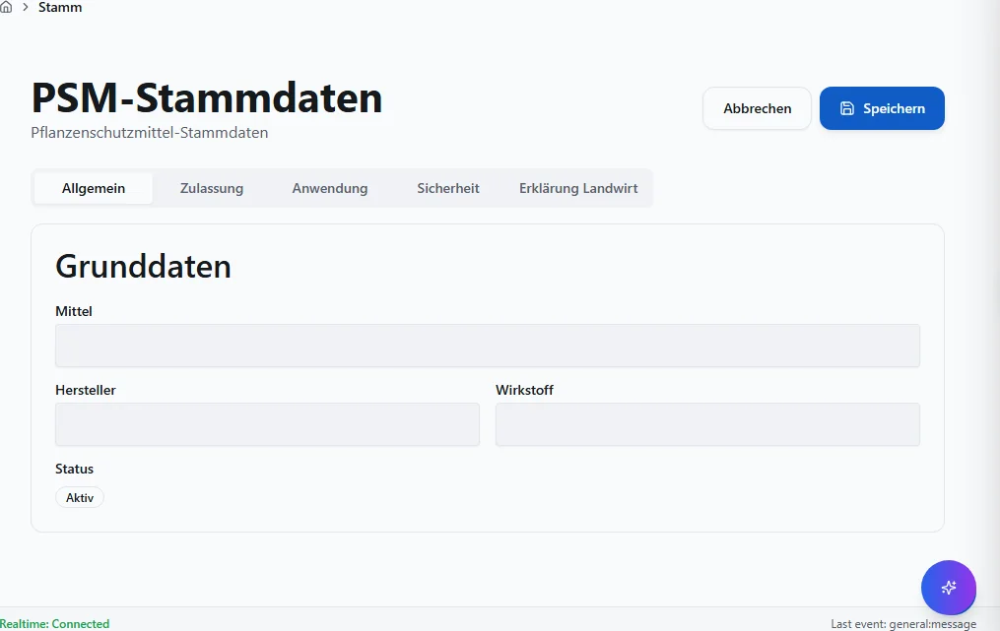

**Schritte:**

1. Sidebar oder Suche: **Stamm** öffnen (`/agrar/psm/stamm`).
2. Filter und Spalten nach Bedarf setzen; bei ListReport Zeilen per Doppelklick oder Aktion öffnen.
3. Bei Belegen: Kopfdaten prüfen, Positionen erfassen oder ändern, **Speichern** bzw. workflowgebundene Aktion (Freigabe, Folgebeleg) ausführen.
4. Ergebnis in Liste, Detailansicht oder Folgebeleg verifizieren; bei Fehlern Meldungstext und Status prüfen.

**Ergebnis:** Datensatz gespeichert, Liste aktualisiert oder Folgeprozess ausgelöst.

**Häufige Fehler:**

| Symptom | Ursache | Maßnahme |
|---------|---------|----------|
| Maske lädt nicht | Modul nicht freigeschaltet oder fehlende Berechtigung | Administrator: Modul/RBAC prüfen |
| Speichern fehlgeschlagen | Pflichtfeld, Status oder Validierung | Meldung lesen, Pflichtfelder ergänzen |
| Aktion ausgegraut | Workflow-Status oder Sperre | Vorbeleg freigeben oder Berechtigung klären |

### :Id

**Route:** `/agrar/psm/stamm/:id` · **Modul:** `@/pages/agrar/psm/stamm`

**Ziel:** :Id in VALEO NeuroERP öffnen, Daten prüfen oder erfassen und das Ergebnis in Liste bzw. Folgebeleg kontrollieren.

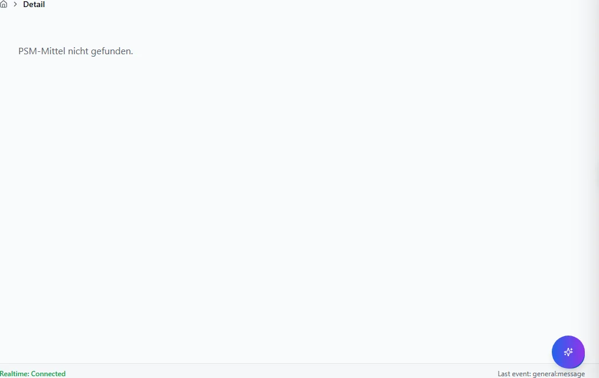

**Schritte:**

1. Sidebar oder Suche: **:Id** öffnen (`/agrar/psm/stamm/:id`).
2. Filter und Spalten nach Bedarf setzen; bei ListReport Zeilen per Doppelklick oder Aktion öffnen.
3. Bei Belegen: Kopfdaten prüfen, Positionen erfassen oder ändern, **Speichern** bzw. workflowgebundene Aktion (Freigabe, Folgebeleg) ausführen.
4. Ergebnis in Liste, Detailansicht oder Folgebeleg verifizieren; bei Fehlern Meldungstext und Status prüfen.

**Ergebnis:** Datensatz gespeichert, Liste aktualisiert oder Folgeprozess ausgelöst.

**Häufige Fehler:**

| Symptom | Ursache | Maßnahme |
|---------|---------|----------|
| Maske lädt nicht | Modul nicht freigeschaltet oder fehlende Berechtigung | Administrator: Modul/RBAC prüfen |
| Speichern fehlgeschlagen | Pflichtfeld, Status oder Validierung | Meldung lesen, Pflichtfelder ergänzen |
| Aktion ausgegraut | Workflow-Status oder Sperre | Vorbeleg freigeben oder Berechtigung klären |

### Wasserschutz

**Route:** `/agrar/psm/wasserschutz` · **Modul:** `@/pages/agrar/psm/wasserschutz`

**Ziel:** Wasserschutz in VALEO NeuroERP öffnen, Daten prüfen oder erfassen und das Ergebnis in Liste bzw. Folgebeleg kontrollieren.

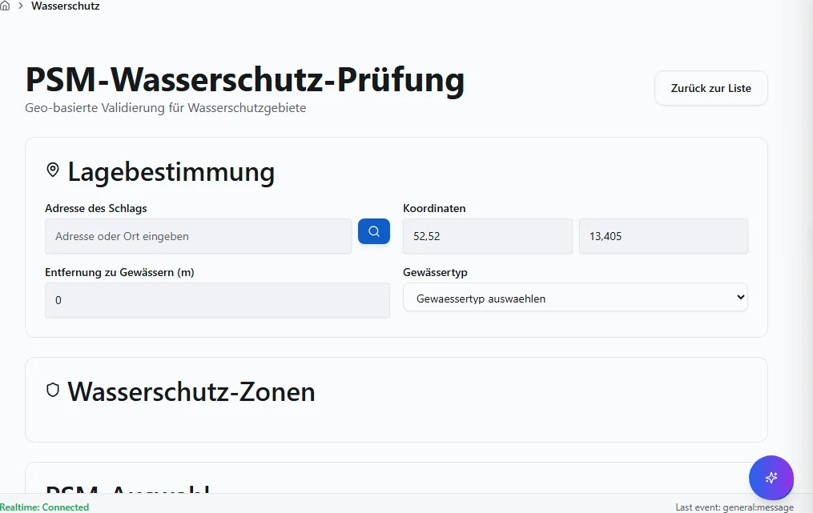

**Schritte:**

1. Sidebar oder Suche: **Wasserschutz** öffnen (`/agrar/psm/wasserschutz`).
2. Filter und Spalten nach Bedarf setzen; bei ListReport Zeilen per Doppelklick oder Aktion öffnen.
3. Bei Belegen: Kopfdaten prüfen, Positionen erfassen oder ändern, **Speichern** bzw. workflowgebundene Aktion (Freigabe, Folgebeleg) ausführen.
4. Ergebnis in Liste, Detailansicht oder Folgebeleg verifizieren; bei Fehlern Meldungstext und Status prüfen.

**Ergebnis:** Datensatz gespeichert, Liste aktualisiert oder Folgeprozess ausgelöst.

**Häufige Fehler:**

| Symptom | Ursache | Maßnahme |
|---------|---------|----------|
| Maske lädt nicht | Modul nicht freigeschaltet oder fehlende Berechtigung | Administrator: Modul/RBAC prüfen |
| Speichern fehlgeschlagen | Pflichtfeld, Status oder Validierung | Meldung lesen, Pflichtfelder ergänzen |
| Aktion ausgegraut | Workflow-Status oder Sperre | Vorbeleg freigeben oder Berechtigung klären |

### Rohwarengruppen

**Route:** `/agrar/rohwarengruppen` · **Modul:** `@/pages/agrar/rohwarengruppen`

**Ziel:** Rohwarengruppen in VALEO NeuroERP öffnen, Daten prüfen oder erfassen und das Ergebnis in Liste bzw. Folgebeleg kontrollieren.

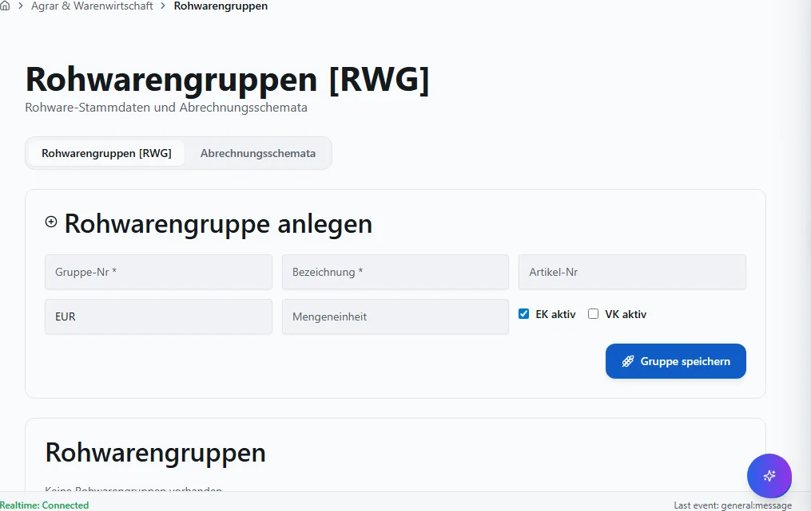

**Schritte:**

1. Sidebar oder Suche: **Rohwarengruppen** öffnen (`/agrar/rohwarengruppen`).
2. Filter und Spalten nach Bedarf setzen; bei ListReport Zeilen per Doppelklick oder Aktion öffnen.
3. Bei Belegen: Kopfdaten prüfen, Positionen erfassen oder ändern, **Speichern** bzw. workflowgebundene Aktion (Freigabe, Folgebeleg) ausführen.
4. Ergebnis in Liste, Detailansicht oder Folgebeleg verifizieren; bei Fehlern Meldungstext und Status prüfen.

**Ergebnis:** Datensatz gespeichert, Liste aktualisiert oder Folgeprozess ausgelöst.

**Häufige Fehler:**

| Symptom | Ursache | Maßnahme |
|---------|---------|----------|
| Maske lädt nicht | Modul nicht freigeschaltet oder fehlende Berechtigung | Administrator: Modul/RBAC prüfen |
| Speichern fehlgeschlagen | Pflichtfeld, Status oder Validierung | Meldung lesen, Pflichtfelder ergänzen |
| Aktion ausgegraut | Workflow-Status oder Sperre | Vorbeleg freigeben oder Berechtigung klären |

### Saatgut

**Route:** `/agrar/saatgut` · **Modul:** `@/pages/agrar/saatgut-liste`

**Ziel:** Saatgut in VALEO NeuroERP öffnen, Daten prüfen oder erfassen und das Ergebnis in Liste bzw. Folgebeleg kontrollieren.

**Schritte:**

1. Sidebar oder Suche: **Saatgut** öffnen (`/agrar/saatgut`).
2. Filter und Spalten nach Bedarf setzen; bei ListReport Zeilen per Doppelklick oder Aktion öffnen.
3. Bei Belegen: Kopfdaten prüfen, Positionen erfassen oder ändern, **Speichern** bzw. workflowgebundene Aktion (Freigabe, Folgebeleg) ausführen.
4. Ergebnis in Liste, Detailansicht oder Folgebeleg verifizieren; bei Fehlern Meldungstext und Status prüfen.

**Ergebnis:** Datensatz gespeichert, Liste aktualisiert oder Folgeprozess ausgelöst.

**Häufige Fehler:**

| Symptom | Ursache | Maßnahme |
|---------|---------|----------|
| Maske lädt nicht | Modul nicht freigeschaltet oder fehlende Berechtigung | Administrator: Modul/RBAC prüfen |
| Speichern fehlgeschlagen | Pflichtfeld, Status oder Validierung | Meldung lesen, Pflichtfelder ergänzen |
| Aktion ausgegraut | Workflow-Status oder Sperre | Vorbeleg freigeben oder Berechtigung klären |

### Saatgut Liste

**Route:** `/agrar/saatgut-liste` · **Modul:** `@/pages/agrar/saatgut-liste`

**Ziel:** Saatgut Liste in VALEO NeuroERP öffnen, Daten prüfen oder erfassen und das Ergebnis in Liste bzw. Folgebeleg kontrollieren.

**Schritte:**

1. Sidebar oder Suche: **Saatgut Liste** öffnen (`/agrar/saatgut-liste`).
2. Filter und Spalten nach Bedarf setzen; bei ListReport Zeilen per Doppelklick oder Aktion öffnen.
3. Bei Belegen: Kopfdaten prüfen, Positionen erfassen oder ändern, **Speichern** bzw. workflowgebundene Aktion (Freigabe, Folgebeleg) ausführen.
4. Ergebnis in Liste, Detailansicht oder Folgebeleg verifizieren; bei Fehlern Meldungstext und Status prüfen.

**Ergebnis:** Datensatz gespeichert, Liste aktualisiert oder Folgeprozess ausgelöst.

**Häufige Fehler:**

| Symptom | Ursache | Maßnahme |
|---------|---------|----------|
| Maske lädt nicht | Modul nicht freigeschaltet oder fehlende Berechtigung | Administrator: Modul/RBAC prüfen |
| Speichern fehlgeschlagen | Pflichtfeld, Status oder Validierung | Meldung lesen, Pflichtfelder ergänzen |
| Aktion ausgegraut | Workflow-Status oder Sperre | Vorbeleg freigeben oder Berechtigung klären |

### Saatgut Stamm

**Route:** `/agrar/saatgut-stamm` · **Modul:** `@/pages/agrar/saatgut-stamm`

**Ziel:** Saatgut Stamm in VALEO NeuroERP öffnen, Daten prüfen oder erfassen und das Ergebnis in Liste bzw. Folgebeleg kontrollieren.

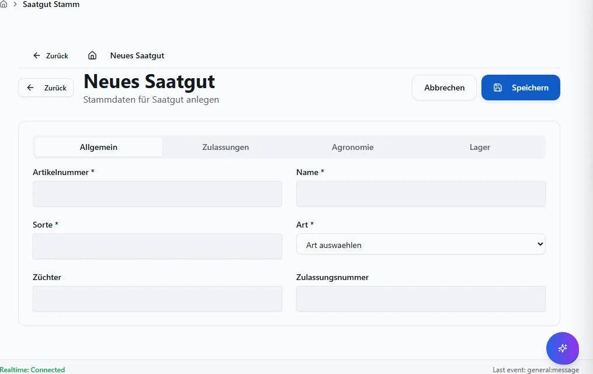

**Schritte:**

1. Sidebar oder Suche: **Saatgut Stamm** öffnen (`/agrar/saatgut-stamm`).
2. Filter und Spalten nach Bedarf setzen; bei ListReport Zeilen per Doppelklick oder Aktion öffnen.
3. Bei Belegen: Kopfdaten prüfen, Positionen erfassen oder ändern, **Speichern** bzw. workflowgebundene Aktion (Freigabe, Folgebeleg) ausführen.
4. Ergebnis in Liste, Detailansicht oder Folgebeleg verifizieren; bei Fehlern Meldungstext und Status prüfen.

**Ergebnis:** Datensatz gespeichert, Liste aktualisiert oder Folgeprozess ausgelöst.

**Häufige Fehler:**

| Symptom | Ursache | Maßnahme |
|---------|---------|----------|
| Maske lädt nicht | Modul nicht freigeschaltet oder fehlende Berechtigung | Administrator: Modul/RBAC prüfen |
| Speichern fehlgeschlagen | Pflichtfeld, Status oder Validierung | Meldung lesen, Pflichtfelder ergänzen |
| Aktion ausgegraut | Workflow-Status oder Sperre | Vorbeleg freigeben oder Berechtigung klären |

### :Id

**Route:** `/agrar/saatgut-stamm/:id` · **Modul:** `@/pages/agrar/saatgut-stamm`

**Ziel:** :Id in VALEO NeuroERP öffnen, Daten prüfen oder erfassen und das Ergebnis in Liste bzw. Folgebeleg kontrollieren.

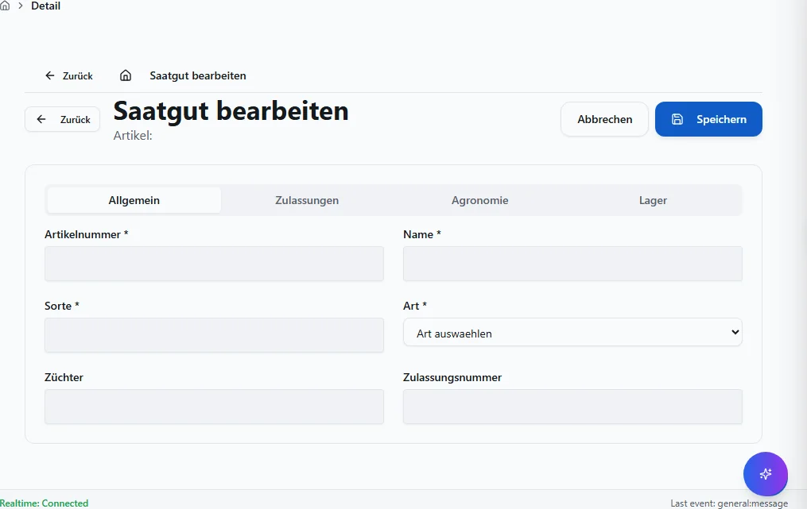

**Schritte:**

1. Sidebar oder Suche: **:Id** öffnen (`/agrar/saatgut-stamm/:id`).
2. Filter und Spalten nach Bedarf setzen; bei ListReport Zeilen per Doppelklick oder Aktion öffnen.
3. Bei Belegen: Kopfdaten prüfen, Positionen erfassen oder ändern, **Speichern** bzw. workflowgebundene Aktion (Freigabe, Folgebeleg) ausführen.
4. Ergebnis in Liste, Detailansicht oder Folgebeleg verifizieren; bei Fehlern Meldungstext und Status prüfen.

**Ergebnis:** Datensatz gespeichert, Liste aktualisiert oder Folgeprozess ausgelöst.

**Häufige Fehler:**

| Symptom | Ursache | Maßnahme |
|---------|---------|----------|
| Maske lädt nicht | Modul nicht freigeschaltet oder fehlende Berechtigung | Administrator: Modul/RBAC prüfen |
| Speichern fehlgeschlagen | Pflichtfeld, Status oder Validierung | Meldung lesen, Pflichtfelder ergänzen |
| Aktion ausgegraut | Workflow-Status oder Sperre | Vorbeleg freigeben oder Berechtigung klären |

### :Id

**Route:** `/agrar/saatgut/:id` · **Modul:** `@/pages/agrar/saatgut-native`

**Ziel:** :Id in VALEO NeuroERP öffnen, Daten prüfen oder erfassen und das Ergebnis in Liste bzw. Folgebeleg kontrollieren.

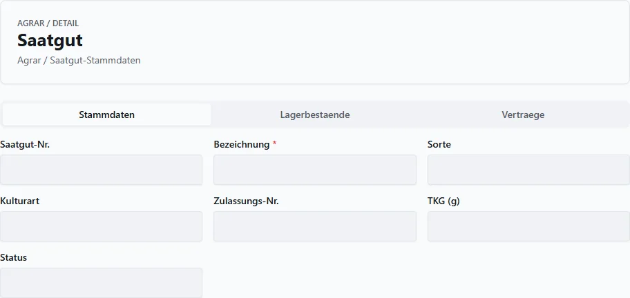

**Schritte:**

1. Sidebar oder Suche: **:Id** öffnen (`/agrar/saatgut/:id`).
2. Filter und Spalten nach Bedarf setzen; bei ListReport Zeilen per Doppelklick oder Aktion öffnen.
3. Bei Belegen: Kopfdaten prüfen, Positionen erfassen oder ändern, **Speichern** bzw. workflowgebundene Aktion (Freigabe, Folgebeleg) ausführen.
4. Ergebnis in Liste, Detailansicht oder Folgebeleg verifizieren; bei Fehlern Meldungstext und Status prüfen.

**Ergebnis:** Datensatz gespeichert, Liste aktualisiert oder Folgeprozess ausgelöst.

**Häufige Fehler:**

| Symptom | Ursache | Maßnahme |
|---------|---------|----------|
| Maske lädt nicht | Modul nicht freigeschaltet oder fehlende Berechtigung | Administrator: Modul/RBAC prüfen |
| Speichern fehlgeschlagen | Pflichtfeld, Status oder Validierung | Meldung lesen, Pflichtfelder ergänzen |
| Aktion ausgegraut | Workflow-Status oder Sperre | Vorbeleg freigeben oder Berechtigung klären |

### Bestellung

**Route:** `/agrar/saatgut/bestellung` · **Modul:** `@/pages/agrar/saatgut/bestellung`

**Ziel:** Bestellung in VALEO NeuroERP öffnen, Daten prüfen oder erfassen und das Ergebnis in Liste bzw. Folgebeleg kontrollieren.

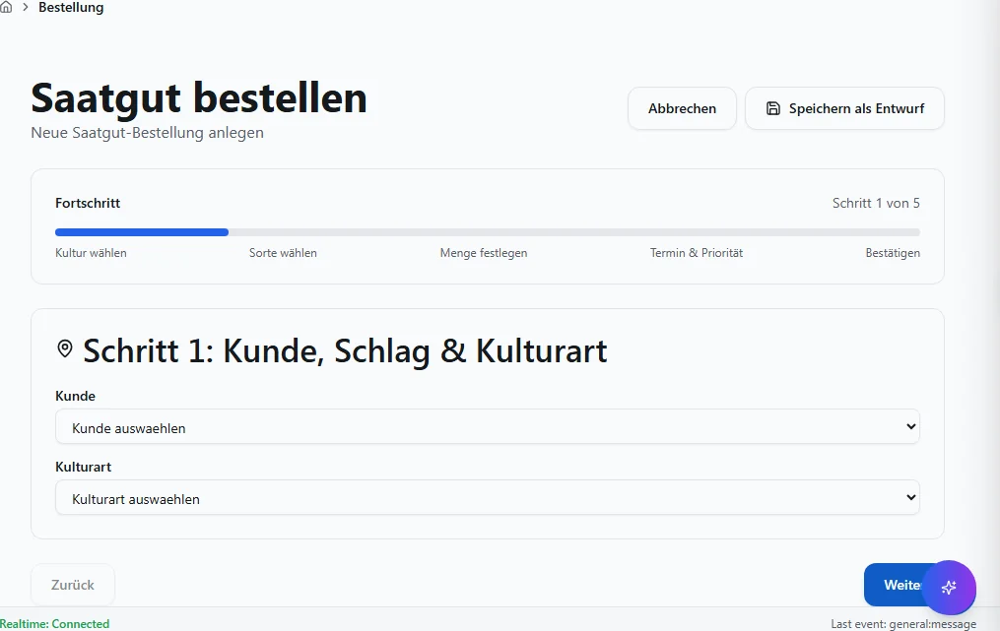

**Schritte:**

1. Sidebar oder Suche: **Bestellung** öffnen (`/agrar/saatgut/bestellung`).
2. Filter und Spalten nach Bedarf setzen; bei ListReport Zeilen per Doppelklick oder Aktion öffnen.
3. Bei Belegen: Kopfdaten prüfen, Positionen erfassen oder ändern, **Speichern** bzw. workflowgebundene Aktion (Freigabe, Folgebeleg) ausführen.
4. Ergebnis in Liste, Detailansicht oder Folgebeleg verifizieren; bei Fehlern Meldungstext und Status prüfen.

**Ergebnis:** Datensatz gespeichert, Liste aktualisiert oder Folgeprozess ausgelöst.

**Häufige Fehler:**

| Symptom | Ursache | Maßnahme |
|---------|---------|----------|
| Maske lädt nicht | Modul nicht freigeschaltet oder fehlende Berechtigung | Administrator: Modul/RBAC prüfen |
| Speichern fehlgeschlagen | Pflichtfeld, Status oder Validierung | Meldung lesen, Pflichtfelder ergänzen |
| Aktion ausgegraut | Workflow-Status oder Sperre | Vorbeleg freigeben oder Berechtigung klären |

### Liste

**Route:** `/agrar/saatgut/liste` · **Modul:** `@/pages/agrar/saatgut/liste`

**Ziel:** Liste in VALEO NeuroERP öffnen, Daten prüfen oder erfassen und das Ergebnis in Liste bzw. Folgebeleg kontrollieren.

**Schritte:**

1. Sidebar oder Suche: **Liste** öffnen (`/agrar/saatgut/liste`).
2. Filter und Spalten nach Bedarf setzen; bei ListReport Zeilen per Doppelklick oder Aktion öffnen.
3. Bei Belegen: Kopfdaten prüfen, Positionen erfassen oder ändern, **Speichern** bzw. workflowgebundene Aktion (Freigabe, Folgebeleg) ausführen.
4. Ergebnis in Liste, Detailansicht oder Folgebeleg verifizieren; bei Fehlern Meldungstext und Status prüfen.

**Ergebnis:** Datensatz gespeichert, Liste aktualisiert oder Folgeprozess ausgelöst.

**Häufige Fehler:**

| Symptom | Ursache | Maßnahme |
|---------|---------|----------|
| Maske lädt nicht | Modul nicht freigeschaltet oder fehlende Berechtigung | Administrator: Modul/RBAC prüfen |
| Speichern fehlgeschlagen | Pflichtfeld, Status oder Validierung | Meldung lesen, Pflichtfelder ergänzen |
| Aktion ausgegraut | Workflow-Status oder Sperre | Vorbeleg freigeben oder Berechtigung klären |

### :Id

**Route:** `/agrar/saatgut/sorte/:id` · **Modul:** `@/pages/agrar/saatgut/sortenregister`

**Ziel:** :Id in VALEO NeuroERP öffnen, Daten prüfen oder erfassen und das Ergebnis in Liste bzw. Folgebeleg kontrollieren.

**Schritte:**

1. Sidebar oder Suche: **:Id** öffnen (`/agrar/saatgut/sorte/:id`).
2. Filter und Spalten nach Bedarf setzen; bei ListReport Zeilen per Doppelklick oder Aktion öffnen.
3. Bei Belegen: Kopfdaten prüfen, Positionen erfassen oder ändern, **Speichern** bzw. workflowgebundene Aktion (Freigabe, Folgebeleg) ausführen.
4. Ergebnis in Liste, Detailansicht oder Folgebeleg verifizieren; bei Fehlern Meldungstext und Status prüfen.

**Ergebnis:** Datensatz gespeichert, Liste aktualisiert oder Folgeprozess ausgelöst.

**Häufige Fehler:**

| Symptom | Ursache | Maßnahme |
|---------|---------|----------|
| Maske lädt nicht | Modul nicht freigeschaltet oder fehlende Berechtigung | Administrator: Modul/RBAC prüfen |
| Speichern fehlgeschlagen | Pflichtfeld, Status oder Validierung | Meldung lesen, Pflichtfelder ergänzen |
| Aktion ausgegraut | Workflow-Status oder Sperre | Vorbeleg freigeben oder Berechtigung klären |

### Neu

**Route:** `/agrar/saatgut/sorte/neu` · **Modul:** `@/pages/agrar/saatgut/sortenregister`

**Ziel:** Neu in VALEO NeuroERP öffnen, Daten prüfen oder erfassen und das Ergebnis in Liste bzw. Folgebeleg kontrollieren.

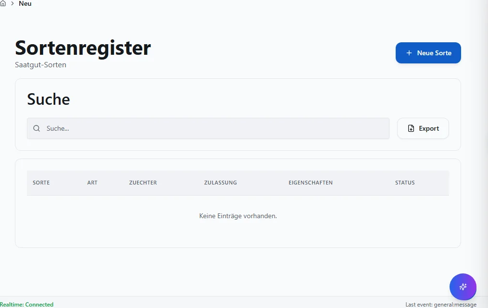

**Schritte:**

1. Sidebar oder Suche: **Neu** öffnen (`/agrar/saatgut/sorte/neu`).
2. Filter und Spalten nach Bedarf setzen; bei ListReport Zeilen per Doppelklick oder Aktion öffnen.
3. Bei Belegen: Kopfdaten prüfen, Positionen erfassen oder ändern, **Speichern** bzw. workflowgebundene Aktion (Freigabe, Folgebeleg) ausführen.
4. Ergebnis in Liste, Detailansicht oder Folgebeleg verifizieren; bei Fehlern Meldungstext und Status prüfen.

**Ergebnis:** Datensatz gespeichert, Liste aktualisiert oder Folgeprozess ausgelöst.

**Häufige Fehler:**

| Symptom | Ursache | Maßnahme |
|---------|---------|----------|
| Maske lädt nicht | Modul nicht freigeschaltet oder fehlende Berechtigung | Administrator: Modul/RBAC prüfen |
| Speichern fehlgeschlagen | Pflichtfeld, Status oder Validierung | Meldung lesen, Pflichtfelder ergänzen |
| Aktion ausgegraut | Workflow-Status oder Sperre | Vorbeleg freigeben oder Berechtigung klären |

### Sortenregister

**Route:** `/agrar/saatgut/sortenregister` · **Modul:** `@/pages/agrar/saatgut/sortenregister`

**Ziel:** Sortenregister in VALEO NeuroERP öffnen, Daten prüfen oder erfassen und das Ergebnis in Liste bzw. Folgebeleg kontrollieren.

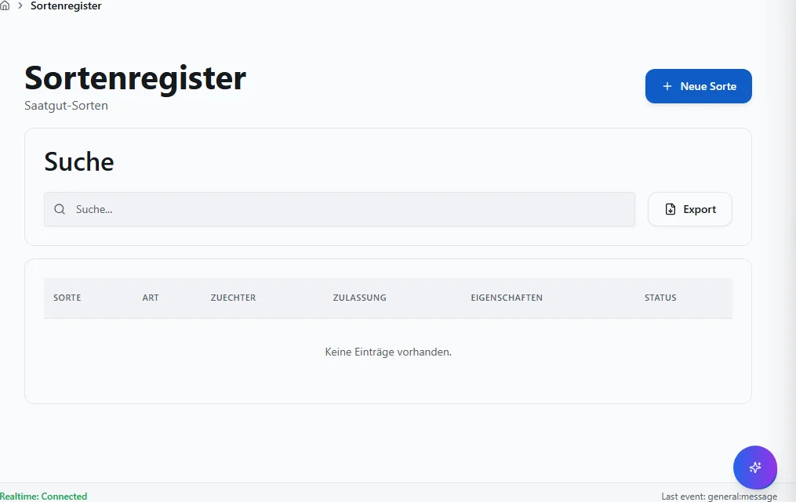

**Schritte:**

1. Sidebar oder Suche: **Sortenregister** öffnen (`/agrar/saatgut/sortenregister`).
2. Filter und Spalten nach Bedarf setzen; bei ListReport Zeilen per Doppelklick oder Aktion öffnen.
3. Bei Belegen: Kopfdaten prüfen, Positionen erfassen oder ändern, **Speichern** bzw. workflowgebundene Aktion (Freigabe, Folgebeleg) ausführen.
4. Ergebnis in Liste, Detailansicht oder Folgebeleg verifizieren; bei Fehlern Meldungstext und Status prüfen.

**Ergebnis:** Datensatz gespeichert, Liste aktualisiert oder Folgeprozess ausgelöst.

**Häufige Fehler:**

| Symptom | Ursache | Maßnahme |
|---------|---------|----------|
| Maske lädt nicht | Modul nicht freigeschaltet oder fehlende Berechtigung | Administrator: Modul/RBAC prüfen |
| Speichern fehlgeschlagen | Pflichtfeld, Status oder Validierung | Meldung lesen, Pflichtfelder ergänzen |
| Aktion ausgegraut | Workflow-Status oder Sperre | Vorbeleg freigeben oder Berechtigung klären |

### Stamm

**Route:** `/agrar/saatgut/stamm` · **Modul:** `@/pages/agrar/saatgut/stamm`

**Ziel:** Stamm in VALEO NeuroERP öffnen, Daten prüfen oder erfassen und das Ergebnis in Liste bzw. Folgebeleg kontrollieren.

**Schritte:**

1. Sidebar oder Suche: **Stamm** öffnen (`/agrar/saatgut/stamm`).
2. Filter und Spalten nach Bedarf setzen; bei ListReport Zeilen per Doppelklick oder Aktion öffnen.
3. Bei Belegen: Kopfdaten prüfen, Positionen erfassen oder ändern, **Speichern** bzw. workflowgebundene Aktion (Freigabe, Folgebeleg) ausführen.
4. Ergebnis in Liste, Detailansicht oder Folgebeleg verifizieren; bei Fehlern Meldungstext und Status prüfen.

**Ergebnis:** Datensatz gespeichert, Liste aktualisiert oder Folgeprozess ausgelöst.

**Häufige Fehler:**

| Symptom | Ursache | Maßnahme |
|---------|---------|----------|
| Maske lädt nicht | Modul nicht freigeschaltet oder fehlende Berechtigung | Administrator: Modul/RBAC prüfen |
| Speichern fehlgeschlagen | Pflichtfeld, Status oder Validierung | Meldung lesen, Pflichtfelder ergänzen |
| Aktion ausgegraut | Workflow-Status oder Sperre | Vorbeleg freigeben oder Berechtigung klären |

### :Id

**Route:** `/agrar/saatgut/stamm/:id` · **Modul:** `@/pages/agrar/saatgut/stamm`

**Ziel:** :Id in VALEO NeuroERP öffnen, Daten prüfen oder erfassen und das Ergebnis in Liste bzw. Folgebeleg kontrollieren.

**Schritte:**

1. Sidebar oder Suche: **:Id** öffnen (`/agrar/saatgut/stamm/:id`).
2. Filter und Spalten nach Bedarf setzen; bei ListReport Zeilen per Doppelklick oder Aktion öffnen.
3. Bei Belegen: Kopfdaten prüfen, Positionen erfassen oder ändern, **Speichern** bzw. workflowgebundene Aktion (Freigabe, Folgebeleg) ausführen.
4. Ergebnis in Liste, Detailansicht oder Folgebeleg verifizieren; bei Fehlern Meldungstext und Status prüfen.

**Ergebnis:** Datensatz gespeichert, Liste aktualisiert oder Folgeprozess ausgelöst.

**Häufige Fehler:**

| Symptom | Ursache | Maßnahme |
|---------|---------|----------|
| Maske lädt nicht | Modul nicht freigeschaltet oder fehlende Berechtigung | Administrator: Modul/RBAC prüfen |
| Speichern fehlgeschlagen | Pflichtfeld, Status oder Validierung | Meldung lesen, Pflichtfelder ergänzen |
| Aktion ausgegraut | Workflow-Status oder Sperre | Vorbeleg freigeben oder Berechtigung klären |

### Saatzucht

**Route:** `/agrar/saatzucht` · **Modul:** `@/pages/agrar/saatzucht`

**Ziel:** Saatzucht in VALEO NeuroERP öffnen, Daten prüfen oder erfassen und das Ergebnis in Liste bzw. Folgebeleg kontrollieren.

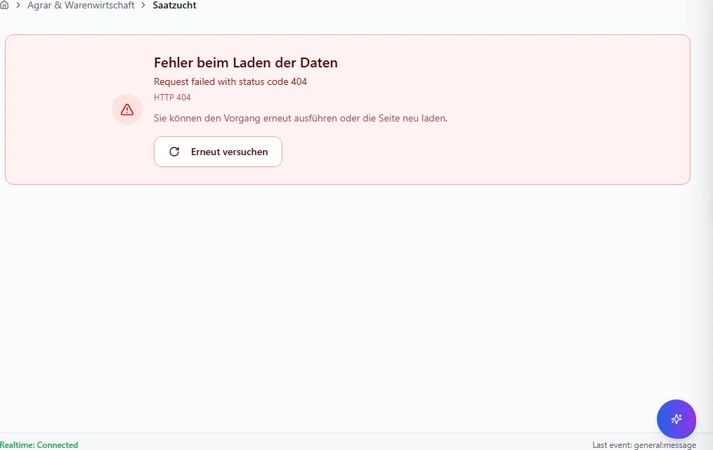

**Schritte:**

1. Sidebar oder Suche: **Saatzucht** öffnen (`/agrar/saatzucht`).
2. Filter und Spalten nach Bedarf setzen; bei ListReport Zeilen per Doppelklick oder Aktion öffnen.
3. Bei Belegen: Kopfdaten prüfen, Positionen erfassen oder ändern, **Speichern** bzw. workflowgebundene Aktion (Freigabe, Folgebeleg) ausführen.
4. Ergebnis in Liste, Detailansicht oder Folgebeleg verifizieren; bei Fehlern Meldungstext und Status prüfen.

**Ergebnis:** Datensatz gespeichert, Liste aktualisiert oder Folgeprozess ausgelöst.

**Häufige Fehler:**

| Symptom | Ursache | Maßnahme |
|---------|---------|----------|
| Maske lädt nicht | Modul nicht freigeschaltet oder fehlende Berechtigung | Administrator: Modul/RBAC prüfen |
| Speichern fehlgeschlagen | Pflichtfeld, Status oder Validierung | Meldung lesen, Pflichtfelder ergänzen |
| Aktion ausgegraut | Workflow-Status oder Sperre | Vorbeleg freigeben oder Berechtigung klären |

### Sammelabrechnung

**Route:** `/agrar/sammelabrechnung` · **Modul:** `@/pages/agrar/sammelabrechnung`

**Ziel:** Sammelabrechnung in VALEO NeuroERP öffnen, Daten prüfen oder erfassen und das Ergebnis in Liste bzw. Folgebeleg kontrollieren.

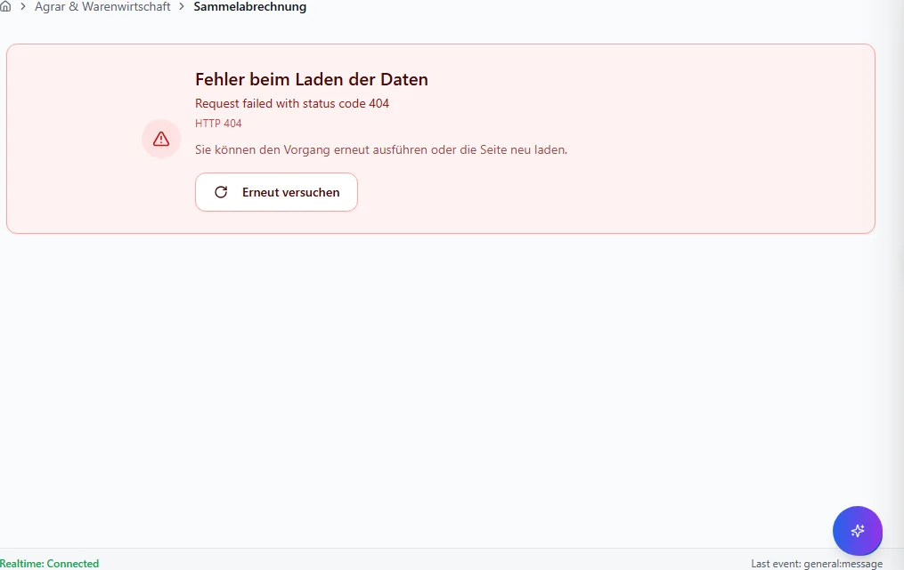

**Schritte:**

1. Sidebar oder Suche: **Sammelabrechnung** öffnen (`/agrar/sammelabrechnung`).
2. Filter und Spalten nach Bedarf setzen; bei ListReport Zeilen per Doppelklick oder Aktion öffnen.
3. Bei Belegen: Kopfdaten prüfen, Positionen erfassen oder ändern, **Speichern** bzw. workflowgebundene Aktion (Freigabe, Folgebeleg) ausführen.
4. Ergebnis in Liste, Detailansicht oder Folgebeleg verifizieren; bei Fehlern Meldungstext und Status prüfen.

**Ergebnis:** Datensatz gespeichert, Liste aktualisiert oder Folgeprozess ausgelöst.

**Häufige Fehler:**

| Symptom | Ursache | Maßnahme |
|---------|---------|----------|
| Maske lädt nicht | Modul nicht freigeschaltet oder fehlende Berechtigung | Administrator: Modul/RBAC prüfen |
| Speichern fehlgeschlagen | Pflichtfeld, Status oder Validierung | Meldung lesen, Pflichtfelder ergänzen |
| Aktion ausgegraut | Workflow-Status oder Sperre | Vorbeleg freigeben oder Berechtigung klären |

### Karte

**Route:** `/agrar/schlaege/karte` · **Modul:** `@/pages/agrar/schlaege/karte`

**Ziel:** Karte in VALEO NeuroERP öffnen, Daten prüfen oder erfassen und das Ergebnis in Liste bzw. Folgebeleg kontrollieren.

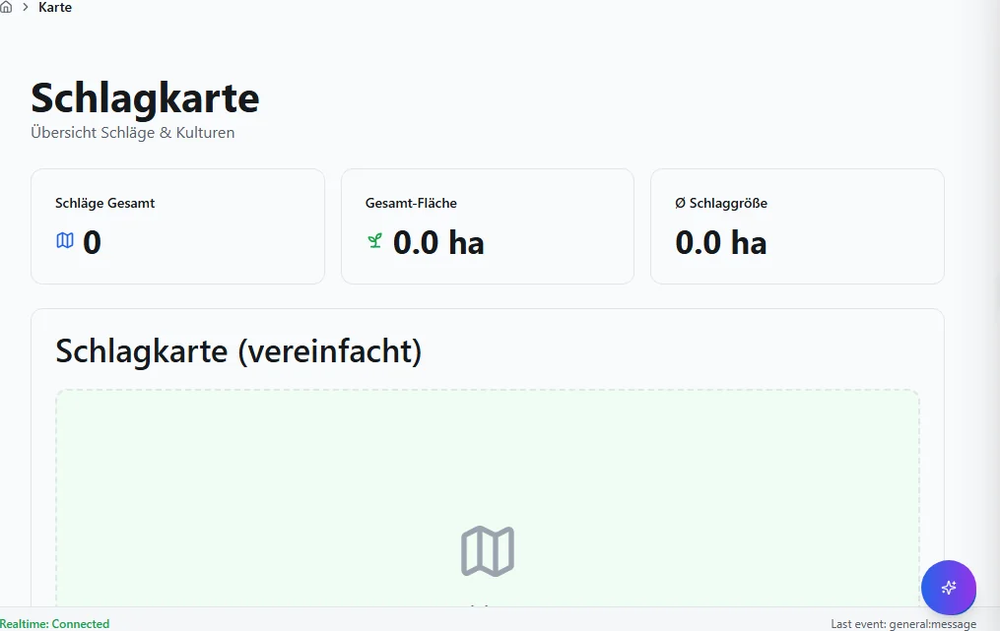

**Schritte:**

1. Sidebar oder Suche: **Karte** öffnen (`/agrar/schlaege/karte`).
2. Filter und Spalten nach Bedarf setzen; bei ListReport Zeilen per Doppelklick oder Aktion öffnen.
3. Bei Belegen: Kopfdaten prüfen, Positionen erfassen oder ändern, **Speichern** bzw. workflowgebundene Aktion (Freigabe, Folgebeleg) ausführen.
4. Ergebnis in Liste, Detailansicht oder Folgebeleg verifizieren; bei Fehlern Meldungstext und Status prüfen.

**Ergebnis:** Datensatz gespeichert, Liste aktualisiert oder Folgeprozess ausgelöst.

**Häufige Fehler:**

| Symptom | Ursache | Maßnahme |
|---------|---------|----------|
| Maske lädt nicht | Modul nicht freigeschaltet oder fehlende Berechtigung | Administrator: Modul/RBAC prüfen |
| Speichern fehlgeschlagen | Pflichtfeld, Status oder Validierung | Meldung lesen, Pflichtfelder ergänzen |
| Aktion ausgegraut | Workflow-Status oder Sperre | Vorbeleg freigeben oder Berechtigung klären |

### Vermehrungsvertraege

**Route:** `/agrar/vermehrungsvertraege` · **Modul:** `@/pages/agrar/vermehrungsvertraege`

**Ziel:** Vermehrungsvertraege in VALEO NeuroERP öffnen, Daten prüfen oder erfassen und das Ergebnis in Liste bzw. Folgebeleg kontrollieren.

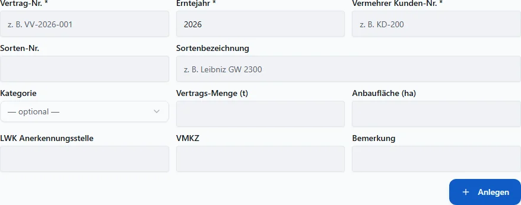

**Schritte:**

1. Sidebar oder Suche: **Vermehrungsvertraege** öffnen (`/agrar/vermehrungsvertraege`).
2. Filter und Spalten nach Bedarf setzen; bei ListReport Zeilen per Doppelklick oder Aktion öffnen.
3. Bei Belegen: Kopfdaten prüfen, Positionen erfassen oder ändern, **Speichern** bzw. workflowgebundene Aktion (Freigabe, Folgebeleg) ausführen.
4. Ergebnis in Liste, Detailansicht oder Folgebeleg verifizieren; bei Fehlern Meldungstext und Status prüfen.

**Ergebnis:** Datensatz gespeichert, Liste aktualisiert oder Folgeprozess ausgelöst.

**Häufige Fehler:**

| Symptom | Ursache | Maßnahme |
|---------|---------|----------|
| Maske lädt nicht | Modul nicht freigeschaltet oder fehlende Berechtigung | Administrator: Modul/RBAC prüfen |
| Speichern fehlgeschlagen | Pflichtfeld, Status oder Validierung | Meldung lesen, Pflichtfelder ergänzen |
| Aktion ausgegraut | Workflow-Status oder Sperre | Vorbeleg freigeben oder Berechtigung klären |

### Wetterwarnung

**Route:** `/agrar/wetterwarnung` · **Modul:** `@/pages/agrar/wetterwarnung`

**Ziel:** Wetterwarnung in VALEO NeuroERP öffnen, Daten prüfen oder erfassen und das Ergebnis in Liste bzw. Folgebeleg kontrollieren.

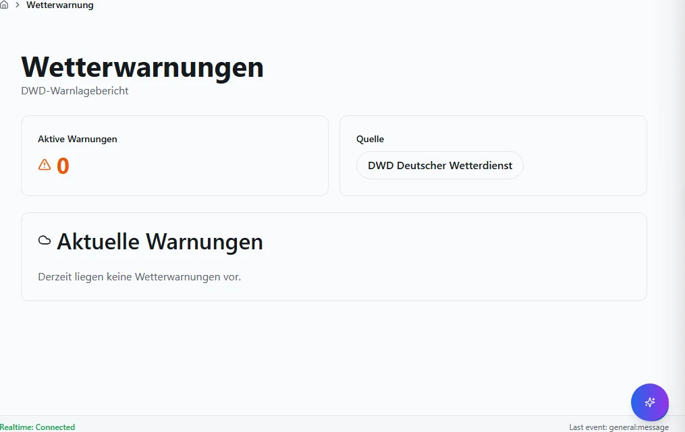

**Schritte:**

1. Sidebar oder Suche: **Wetterwarnung** öffnen (`/agrar/wetterwarnung`).
2. Filter und Spalten nach Bedarf setzen; bei ListReport Zeilen per Doppelklick oder Aktion öffnen.
3. Bei Belegen: Kopfdaten prüfen, Positionen erfassen oder ändern, **Speichern** bzw. workflowgebundene Aktion (Freigabe, Folgebeleg) ausführen.
4. Ergebnis in Liste, Detailansicht oder Folgebeleg verifizieren; bei Fehlern Meldungstext und Status prüfen.

**Ergebnis:** Datensatz gespeichert, Liste aktualisiert oder Folgeprozess ausgelöst.

**Häufige Fehler:**

| Symptom | Ursache | Maßnahme |
|---------|---------|----------|
| Maske lädt nicht | Modul nicht freigeschaltet oder fehlende Berechtigung | Administrator: Modul/RBAC prüfen |
| Speichern fehlgeschlagen | Pflichtfeld, Status oder Validierung | Meldung lesen, Pflichtfelder ergänzen |
| Aktion ausgegraut | Workflow-Status oder Sperre | Vorbeleg freigeben oder Berechtigung klären |

### Zinsabrechnung

**Route:** `/agrar/zinsabrechnung` · **Modul:** `@/pages/agrar/zinsabrechnung`

**Ziel:** Zinsabrechnung in VALEO NeuroERP öffnen, Daten prüfen oder erfassen und das Ergebnis in Liste bzw. Folgebeleg kontrollieren.

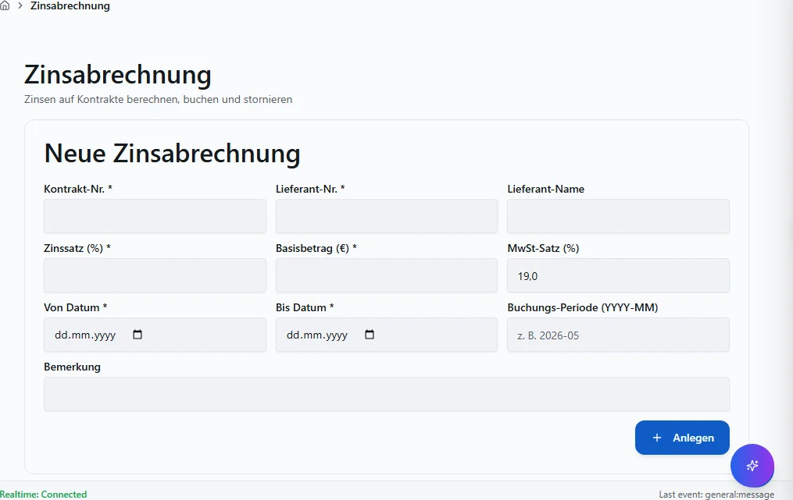

**Schritte:**

1. Sidebar oder Suche: **Zinsabrechnung** öffnen (`/agrar/zinsabrechnung`).
2. Filter und Spalten nach Bedarf setzen; bei ListReport Zeilen per Doppelklick oder Aktion öffnen.
3. Bei Belegen: Kopfdaten prüfen, Positionen erfassen oder ändern, **Speichern** bzw. workflowgebundene Aktion (Freigabe, Folgebeleg) ausführen.
4. Ergebnis in Liste, Detailansicht oder Folgebeleg verifizieren; bei Fehlern Meldungstext und Status prüfen.

**Ergebnis:** Datensatz gespeichert, Liste aktualisiert oder Folgeprozess ausgelöst.

**Häufige Fehler:**

| Symptom | Ursache | Maßnahme |
|---------|---------|----------|
| Maske lädt nicht | Modul nicht freigeschaltet oder fehlende Berechtigung | Administrator: Modul/RBAC prüfen |
| Speichern fehlgeschlagen | Pflichtfeld, Status oder Validierung | Meldung lesen, Pflichtfelder ergänzen |
| Aktion ausgegraut | Workflow-Status oder Sperre | Vorbeleg freigeben oder Berechtigung klären |

### Farmers

**Route:** `/agribusiness/farmers` · **Modul:** `@/pages/agribusiness/farmers`

**Ziel:** Farmers in VALEO NeuroERP öffnen, Daten prüfen oder erfassen und das Ergebnis in Liste bzw. Folgebeleg kontrollieren.

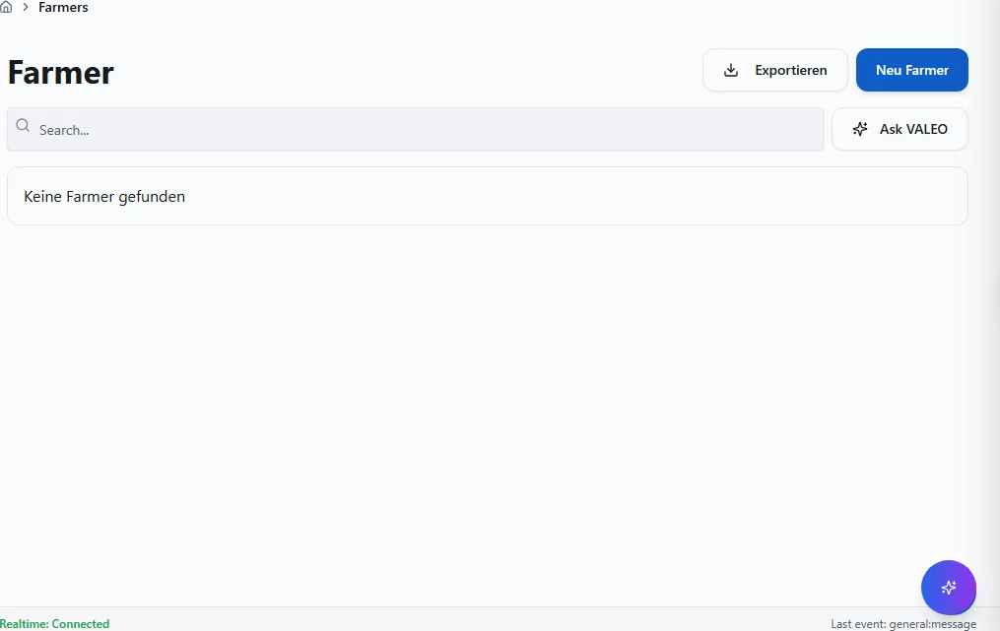

**Schritte:**

1. Sidebar oder Suche: **Farmers** öffnen (`/agribusiness/farmers`).
2. Filter und Spalten nach Bedarf setzen; bei ListReport Zeilen per Doppelklick oder Aktion öffnen.
3. Bei Belegen: Kopfdaten prüfen, Positionen erfassen oder ändern, **Speichern** bzw. workflowgebundene Aktion (Freigabe, Folgebeleg) ausführen.
4. Ergebnis in Liste, Detailansicht oder Folgebeleg verifizieren; bei Fehlern Meldungstext und Status prüfen.

**Ergebnis:** Datensatz gespeichert, Liste aktualisiert oder Folgeprozess ausgelöst.

**Häufige Fehler:**

| Symptom | Ursache | Maßnahme |
|---------|---------|----------|
| Maske lädt nicht | Modul nicht freigeschaltet oder fehlende Berechtigung | Administrator: Modul/RBAC prüfen |
| Speichern fehlgeschlagen | Pflichtfeld, Status oder Validierung | Meldung lesen, Pflichtfelder ergänzen |
| Aktion ausgegraut | Workflow-Status oder Sperre | Vorbeleg freigeben oder Berechtigung klären |

### Field Service Task Edit

**Route:** `/agribusiness/field-service-task-edit` · **Modul:** `@/pages/agribusiness/field-service-task-edit`

**Ziel:** Field Service Task Edit in VALEO NeuroERP öffnen, Daten prüfen oder erfassen und das Ergebnis in Liste bzw. Folgebeleg kontrollieren.

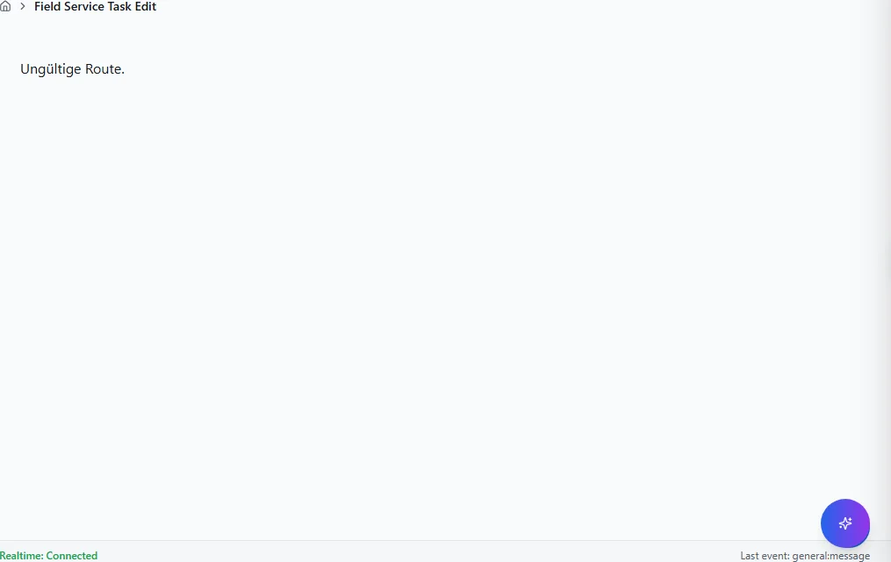

**Schritte:**

1. Sidebar oder Suche: **Field Service Task Edit** öffnen (`/agribusiness/field-service-task-edit`).
2. Filter und Spalten nach Bedarf setzen; bei ListReport Zeilen per Doppelklick oder Aktion öffnen.
3. Bei Belegen: Kopfdaten prüfen, Positionen erfassen oder ändern, **Speichern** bzw. workflowgebundene Aktion (Freigabe, Folgebeleg) ausführen.
4. Ergebnis in Liste, Detailansicht oder Folgebeleg verifizieren; bei Fehlern Meldungstext und Status prüfen.

**Ergebnis:** Datensatz gespeichert, Liste aktualisiert oder Folgeprozess ausgelöst.

**Häufige Fehler:**

| Symptom | Ursache | Maßnahme |
|---------|---------|----------|
| Maske lädt nicht | Modul nicht freigeschaltet oder fehlende Berechtigung | Administrator: Modul/RBAC prüfen |
| Speichern fehlgeschlagen | Pflichtfeld, Status oder Validierung | Meldung lesen, Pflichtfelder ergänzen |
| Aktion ausgegraut | Workflow-Status oder Sperre | Vorbeleg freigeben oder Berechtigung klären |

### Field Service Task Neu

**Route:** `/agribusiness/field-service-task-neu` · **Modul:** `@/pages/agribusiness/field-service-task-neu`

**Ziel:** Field Service Task Neu in VALEO NeuroERP öffnen, Daten prüfen oder erfassen und das Ergebnis in Liste bzw. Folgebeleg kontrollieren.

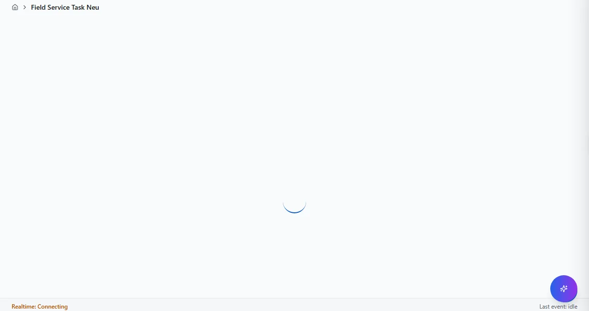

**Schritte:**

1. Sidebar oder Suche: **Field Service Task Neu** öffnen (`/agribusiness/field-service-task-neu`).
2. Filter und Spalten nach Bedarf setzen; bei ListReport Zeilen per Doppelklick oder Aktion öffnen.
3. Bei Belegen: Kopfdaten prüfen, Positionen erfassen oder ändern, **Speichern** bzw. workflowgebundene Aktion (Freigabe, Folgebeleg) ausführen.
4. Ergebnis in Liste, Detailansicht oder Folgebeleg verifizieren; bei Fehlern Meldungstext und Status prüfen.

**Ergebnis:** Datensatz gespeichert, Liste aktualisiert oder Folgeprozess ausgelöst.

**Häufige Fehler:**

| Symptom | Ursache | Maßnahme |
|---------|---------|----------|
| Maske lädt nicht | Modul nicht freigeschaltet oder fehlende Berechtigung | Administrator: Modul/RBAC prüfen |
| Speichern fehlgeschlagen | Pflichtfeld, Status oder Validierung | Meldung lesen, Pflichtfelder ergänzen |
| Aktion ausgegraut | Workflow-Status oder Sperre | Vorbeleg freigeben oder Berechtigung klären |

### Field Service Tasks

**Route:** `/agribusiness/field-service-tasks` · **Modul:** `@/pages/agribusiness/field-service-tasks`

**Ziel:** Field Service Tasks in VALEO NeuroERP öffnen, Daten prüfen oder erfassen und das Ergebnis in Liste bzw. Folgebeleg kontrollieren.

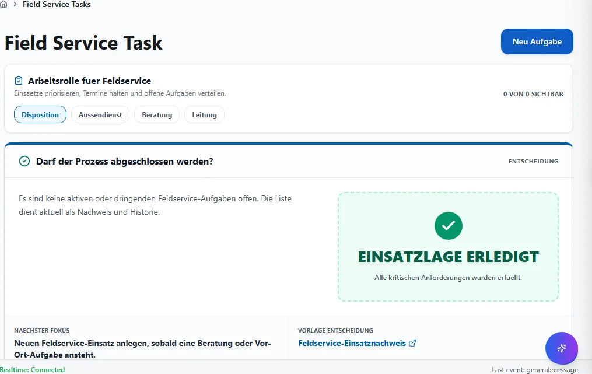

**Schritte:**

1. Sidebar oder Suche: **Field Service Tasks** öffnen (`/agribusiness/field-service-tasks`).
2. Filter und Spalten nach Bedarf setzen; bei ListReport Zeilen per Doppelklick oder Aktion öffnen.
3. Bei Belegen: Kopfdaten prüfen, Positionen erfassen oder ändern, **Speichern** bzw. workflowgebundene Aktion (Freigabe, Folgebeleg) ausführen.
4. Ergebnis in Liste, Detailansicht oder Folgebeleg verifizieren; bei Fehlern Meldungstext und Status prüfen.

**Ergebnis:** Datensatz gespeichert, Liste aktualisiert oder Folgeprozess ausgelöst.

**Häufige Fehler:**

| Symptom | Ursache | Maßnahme |
|---------|---------|----------|
| Maske lädt nicht | Modul nicht freigeschaltet oder fehlende Berechtigung | Administrator: Modul/RBAC prüfen |
| Speichern fehlgeschlagen | Pflichtfeld, Status oder Validierung | Meldung lesen, Pflichtfelder ergänzen |
| Aktion ausgegraut | Workflow-Status oder Sperre | Vorbeleg freigeben oder Berechtigung klären |

### Bearbeiten

**Route:** `/agribusiness/field-service-tasks/:taskId/bearbeiten` · **Modul:** `@/pages/agribusiness/field-service-task-edit`

**Ziel:** Bearbeiten in VALEO NeuroERP öffnen, Daten prüfen oder erfassen und das Ergebnis in Liste bzw. Folgebeleg kontrollieren.

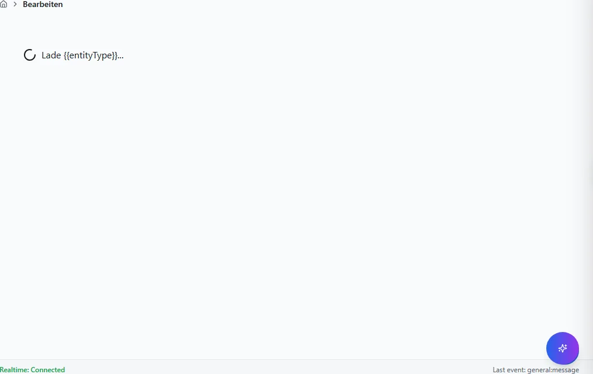

**Schritte:**

1. Sidebar oder Suche: **Bearbeiten** öffnen (`/agribusiness/field-service-tasks/:taskId/bearbeiten`).
2. Filter und Spalten nach Bedarf setzen; bei ListReport Zeilen per Doppelklick oder Aktion öffnen.
3. Bei Belegen: Kopfdaten prüfen, Positionen erfassen oder ändern, **Speichern** bzw. workflowgebundene Aktion (Freigabe, Folgebeleg) ausführen.
4. Ergebnis in Liste, Detailansicht oder Folgebeleg verifizieren; bei Fehlern Meldungstext und Status prüfen.

**Ergebnis:** Datensatz gespeichert, Liste aktualisiert oder Folgeprozess ausgelöst.

**Häufige Fehler:**

| Symptom | Ursache | Maßnahme |
|---------|---------|----------|
| Maske lädt nicht | Modul nicht freigeschaltet oder fehlende Berechtigung | Administrator: Modul/RBAC prüfen |
| Speichern fehlgeschlagen | Pflichtfeld, Status oder Validierung | Meldung lesen, Pflichtfelder ergänzen |
| Aktion ausgegraut | Workflow-Status oder Sperre | Vorbeleg freigeben oder Berechtigung klären |

### Neu

**Route:** `/agribusiness/field-service-tasks/neu` · **Modul:** `@/pages/agribusiness/field-service-task-neu`

**Ziel:** Neu in VALEO NeuroERP öffnen, Daten prüfen oder erfassen und das Ergebnis in Liste bzw. Folgebeleg kontrollieren.

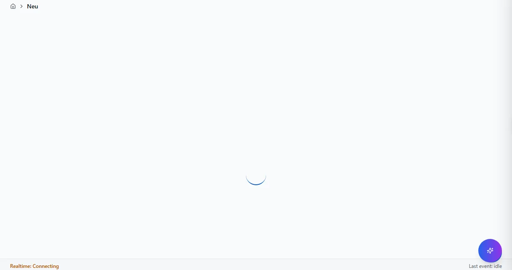

**Schritte:**

1. Sidebar oder Suche: **Neu** öffnen (`/agribusiness/field-service-tasks/neu`).
2. Filter und Spalten nach Bedarf setzen; bei ListReport Zeilen per Doppelklick oder Aktion öffnen.
3. Bei Belegen: Kopfdaten prüfen, Positionen erfassen oder ändern, **Speichern** bzw. workflowgebundene Aktion (Freigabe, Folgebeleg) ausführen.
4. Ergebnis in Liste, Detailansicht oder Folgebeleg verifizieren; bei Fehlern Meldungstext und Status prüfen.

**Ergebnis:** Datensatz gespeichert, Liste aktualisiert oder Folgeprozess ausgelöst.

**Häufige Fehler:**

| Symptom | Ursache | Maßnahme |
|---------|---------|----------|
| Maske lädt nicht | Modul nicht freigeschaltet oder fehlende Berechtigung | Administrator: Modul/RBAC prüfen |
| Speichern fehlgeschlagen | Pflichtfeld, Status oder Validierung | Meldung lesen, Pflichtfelder ergänzen |
| Aktion ausgegraut | Workflow-Status oder Sperre | Vorbeleg freigeben oder Berechtigung klären |

## Quellen und Reverse-Pflege

- `packages/frontend-web/src/app/navigation/domains/*.tsx` — Sidebar-Navigation.
- `packages/frontend-web/src/app/routing/route-inventory.gen.json` — Routen-Inventar.
- `docs/MASKEN.md` — Layout-Standard (Gewohnheits-Prinzip).

Reverse-Pflege: Bei neuen Routen Generator `scripts/generate_benutzerhandbuch_full.py`
ausführen; `mkdocs.yml`, `index.md` und `generate_inapp_help_map.py` mitziehen.
