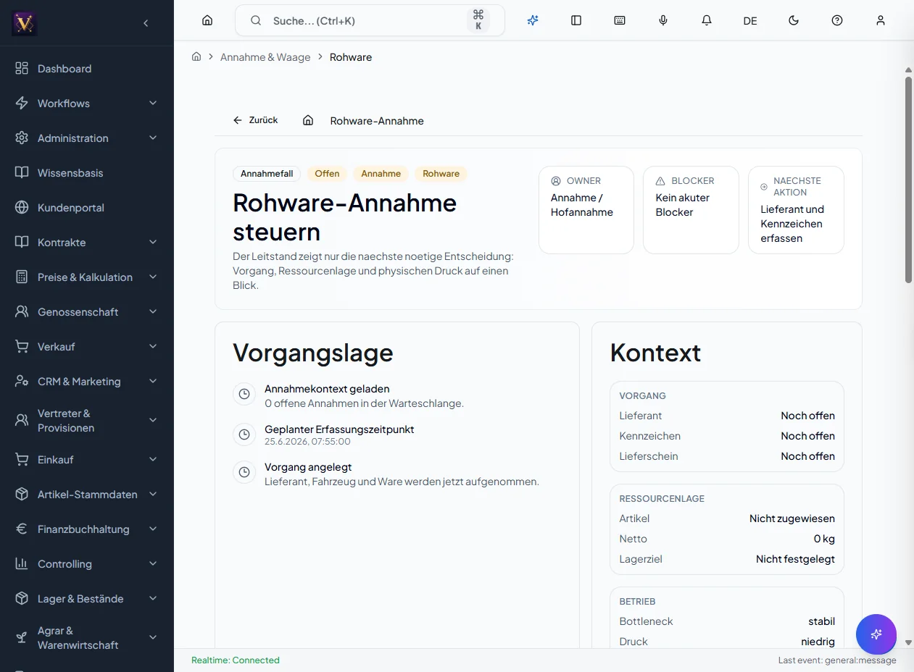

# Ernteannahme durchführen

So nehmen Sie eine Anlieferung (z. B. Getreide) vollständig an – von der
LKW-Registrierung bis zur abgeschlossenen Annahme mit Qualitätsdaten.

## Voraussetzungen

- Modul **Agrar/Annahme** ist für den Mandanten freigeschaltet.
- Stammdaten (Lieferant, Artikel/Frucht, Silozellen) sind gepflegt.
- Sie haben die Rolle für die Annahme.

## Schritte

1. **Annahme öffnen:** Bereich *Annahme* → *Neue Annahme*.
2. **LKW registrieren:** Kennzeichen, Lieferant und Frucht erfassen.
3. **Erstwiegung:** Bruttogewicht von der Waage übernehmen.
4. **Probe & Qualität:** Qualitätswerte (z. B. Feuchte, Besatz, Protein)
   erfassen. Trocknungs-/Abzugsregeln werden automatisch angewendet.
5. **Zielzelle wählen:** passende Silozelle zuweisen (QS-Status beachten).
6. **Zweitwiegung:** Taragewicht erfassen → Nettomenge wird berechnet.
7. **Annahme abschließen:** Beleg prüfen und **Speichern/Abschließen**.

**Ergebnis:** Die Annahme ist gebucht, die Menge der Silozelle zugeordnet und
für Folgeprozesse (Kontrakt-Erfüllung, Abrechnung) verfügbar.

## Trocknungs- und Abzugsregeln

Feuchte über dem Grenzwert führt zu einem Mengen-/Wertabzug gemäß hinterlegter
Trocknungsregel. Die angewandte Regel und der Abzug sind im Beleg nachvollziehbar
ausgewiesen.

## Häufige Fehler

- **Silozelle gesperrt / falscher QS-Status:** andere Zelle wählen oder QS
  freigeben lassen.
- **Qualitätswert fehlt:** Pflichtfelder vor dem Abschluss vollständig erfassen.
- **Waage liefert keinen Wert:** Gewicht manuell erfassen und Grund dokumentieren.

## Maskenregister

Vollständige Abdeckung: **19** App-Routen
(0 explizit in der Sidebar-Navigation).

| Maske | Route | Modul |
|-------|-------|-------|
| Prognose | `/agrar/wetter/prognose` | `@/pages/agrar/wetter/prognose` |
| Abrechnung | `/annahme/abrechnung` | `@/pages/annahme/abrechnung` |
| Annahme Qr | `/annahme/annahme-qr` | `@/pages/annahme/annahme-qr` |
| Klaerung Gesperrt | `/annahme/klaerung-gesperrt` | `@/pages/annahme/klaerung-gesperrt` |
| Lkw Registrierung | `/annahme/lkw-registrierung` | `@/pages/annahme/lkw-registrierung` |
| Qr | `/annahme/qr` | `@/pages/annahme/annahme-qr` |
| Qr Scanner | `/annahme/qr-scanner` | `@/pages/annahme/qr-scanner` |
| Qualitaets Check | `/annahme/qualitaets-check` | `@/pages/annahme/qualitaets-check` |
| Rohware | `/annahme/rohware` | `@/pages/annahme/rohware` |
| Warteschlange | `/annahme/warteschlange` | `@/pages/annahme/warteschlange` |
| Waage | `/waage` | `@/pages/waage/liste` |
| Hofliste | `/waage/hofliste` | `@/pages/waage/hofliste` |
| Liste | `/waage/liste` | `@/pages/waage/liste` |
| Neu | `/waage/neu` | `@/pages/waage/liste` |
| Vorlagen | `/waage/vorlagen` | `@/pages/waage/vorlagen` |
| Wiegeschein Detail | `/waage/wiegeschein-detail` | `@/pages/waage/wiegeschein-detail` |
| :Id | `/waage/wiegeschein/:id` | `@/pages/waage/wiegeschein-detail` |
| Wiegungen | `/waage/wiegungen` | `@/pages/waage/wiegungen` |
| Weighing | `/weighing` | `@/pages/weighing` |

## Masken im Detail

Für jede Route: Navigation, Bearbeitung, Ergebnis und typische Fehler.

### Prognose

**Route:** `/agrar/wetter/prognose` · **Modul:** `@/pages/agrar/wetter/prognose`

**Schritte:**

1. Sidebar oder Suche: **Prognose** öffnen (`/agrar/wetter/prognose`).
2. Filter und Spalten nach Bedarf setzen; bei ListReport Zeilen per Doppelklick oder Aktion öffnen.
3. Bei Belegen: Kopfdaten prüfen, Positionen erfassen oder ändern, **Speichern** bzw. workflowgebundene Aktion (Freigabe, Folgebeleg) ausführen.
4. Ergebnis in Liste, Detailansicht oder Folgebeleg verifizieren; bei Fehlern Meldungstext und Status prüfen.

**Ergebnis:** Datensatz gespeichert, Liste aktualisiert oder Folgeprozess ausgelöst.

**Häufige Fehler:**

| Symptom | Ursache | Maßnahme |
|---------|---------|----------|
| Maske lädt nicht | Modul nicht freigeschaltet oder fehlende Berechtigung | Administrator: Modul/RBAC prüfen |
| Speichern fehlgeschlagen | Pflichtfeld, Status oder Validierung | Meldung lesen, Pflichtfelder ergänzen |
| Aktion ausgegraut | Workflow-Status oder Sperre | Vorbeleg freigeben oder Berechtigung klären |

### Abrechnung

**Route:** `/annahme/abrechnung` · **Modul:** `@/pages/annahme/abrechnung`

**Schritte:**

1. Sidebar oder Suche: **Abrechnung** öffnen (`/annahme/abrechnung`).
2. Filter und Spalten nach Bedarf setzen; bei ListReport Zeilen per Doppelklick oder Aktion öffnen.
3. Bei Belegen: Kopfdaten prüfen, Positionen erfassen oder ändern, **Speichern** bzw. workflowgebundene Aktion (Freigabe, Folgebeleg) ausführen.
4. Ergebnis in Liste, Detailansicht oder Folgebeleg verifizieren; bei Fehlern Meldungstext und Status prüfen.

**Ergebnis:** Datensatz gespeichert, Liste aktualisiert oder Folgeprozess ausgelöst.

**Häufige Fehler:**

| Symptom | Ursache | Maßnahme |
|---------|---------|----------|
| Maske lädt nicht | Modul nicht freigeschaltet oder fehlende Berechtigung | Administrator: Modul/RBAC prüfen |
| Speichern fehlgeschlagen | Pflichtfeld, Status oder Validierung | Meldung lesen, Pflichtfelder ergänzen |
| Aktion ausgegraut | Workflow-Status oder Sperre | Vorbeleg freigeben oder Berechtigung klären |

### Annahme Qr

**Route:** `/annahme/annahme-qr` · **Modul:** `@/pages/annahme/annahme-qr`

**Schritte:**

1. Sidebar oder Suche: **Annahme Qr** öffnen (`/annahme/annahme-qr`).
2. Filter und Spalten nach Bedarf setzen; bei ListReport Zeilen per Doppelklick oder Aktion öffnen.
3. Bei Belegen: Kopfdaten prüfen, Positionen erfassen oder ändern, **Speichern** bzw. workflowgebundene Aktion (Freigabe, Folgebeleg) ausführen.
4. Ergebnis in Liste, Detailansicht oder Folgebeleg verifizieren; bei Fehlern Meldungstext und Status prüfen.

**Ergebnis:** Datensatz gespeichert, Liste aktualisiert oder Folgeprozess ausgelöst.

**Häufige Fehler:**

| Symptom | Ursache | Maßnahme |
|---------|---------|----------|
| Maske lädt nicht | Modul nicht freigeschaltet oder fehlende Berechtigung | Administrator: Modul/RBAC prüfen |
| Speichern fehlgeschlagen | Pflichtfeld, Status oder Validierung | Meldung lesen, Pflichtfelder ergänzen |
| Aktion ausgegraut | Workflow-Status oder Sperre | Vorbeleg freigeben oder Berechtigung klären |

### Klaerung Gesperrt

**Route:** `/annahme/klaerung-gesperrt` · **Modul:** `@/pages/annahme/klaerung-gesperrt`

**Schritte:**

1. Sidebar oder Suche: **Klaerung Gesperrt** öffnen (`/annahme/klaerung-gesperrt`).
2. Filter und Spalten nach Bedarf setzen; bei ListReport Zeilen per Doppelklick oder Aktion öffnen.
3. Bei Belegen: Kopfdaten prüfen, Positionen erfassen oder ändern, **Speichern** bzw. workflowgebundene Aktion (Freigabe, Folgebeleg) ausführen.
4. Ergebnis in Liste, Detailansicht oder Folgebeleg verifizieren; bei Fehlern Meldungstext und Status prüfen.

**Ergebnis:** Datensatz gespeichert, Liste aktualisiert oder Folgeprozess ausgelöst.

**Häufige Fehler:**

| Symptom | Ursache | Maßnahme |
|---------|---------|----------|
| Maske lädt nicht | Modul nicht freigeschaltet oder fehlende Berechtigung | Administrator: Modul/RBAC prüfen |
| Speichern fehlgeschlagen | Pflichtfeld, Status oder Validierung | Meldung lesen, Pflichtfelder ergänzen |
| Aktion ausgegraut | Workflow-Status oder Sperre | Vorbeleg freigeben oder Berechtigung klären |

### Lkw Registrierung

**Route:** `/annahme/lkw-registrierung` · **Modul:** `@/pages/annahme/lkw-registrierung`

**Schritte:**

1. Sidebar oder Suche: **Lkw Registrierung** öffnen (`/annahme/lkw-registrierung`).
2. Filter und Spalten nach Bedarf setzen; bei ListReport Zeilen per Doppelklick oder Aktion öffnen.
3. Bei Belegen: Kopfdaten prüfen, Positionen erfassen oder ändern, **Speichern** bzw. workflowgebundene Aktion (Freigabe, Folgebeleg) ausführen.
4. Ergebnis in Liste, Detailansicht oder Folgebeleg verifizieren; bei Fehlern Meldungstext und Status prüfen.

**Ergebnis:** Datensatz gespeichert, Liste aktualisiert oder Folgeprozess ausgelöst.

**Häufige Fehler:**

| Symptom | Ursache | Maßnahme |
|---------|---------|----------|
| Maske lädt nicht | Modul nicht freigeschaltet oder fehlende Berechtigung | Administrator: Modul/RBAC prüfen |
| Speichern fehlgeschlagen | Pflichtfeld, Status oder Validierung | Meldung lesen, Pflichtfelder ergänzen |
| Aktion ausgegraut | Workflow-Status oder Sperre | Vorbeleg freigeben oder Berechtigung klären |

### Qr

**Route:** `/annahme/qr` · **Modul:** `@/pages/annahme/annahme-qr`

**Schritte:**

1. Sidebar oder Suche: **Qr** öffnen (`/annahme/qr`).
2. Filter und Spalten nach Bedarf setzen; bei ListReport Zeilen per Doppelklick oder Aktion öffnen.
3. Bei Belegen: Kopfdaten prüfen, Positionen erfassen oder ändern, **Speichern** bzw. workflowgebundene Aktion (Freigabe, Folgebeleg) ausführen.
4. Ergebnis in Liste, Detailansicht oder Folgebeleg verifizieren; bei Fehlern Meldungstext und Status prüfen.

**Ergebnis:** Datensatz gespeichert, Liste aktualisiert oder Folgeprozess ausgelöst.

**Häufige Fehler:**

| Symptom | Ursache | Maßnahme |
|---------|---------|----------|
| Maske lädt nicht | Modul nicht freigeschaltet oder fehlende Berechtigung | Administrator: Modul/RBAC prüfen |
| Speichern fehlgeschlagen | Pflichtfeld, Status oder Validierung | Meldung lesen, Pflichtfelder ergänzen |
| Aktion ausgegraut | Workflow-Status oder Sperre | Vorbeleg freigeben oder Berechtigung klären |

### Qr Scanner

**Route:** `/annahme/qr-scanner` · **Modul:** `@/pages/annahme/qr-scanner`

**Schritte:**

1. Sidebar oder Suche: **Qr Scanner** öffnen (`/annahme/qr-scanner`).
2. Filter und Spalten nach Bedarf setzen; bei ListReport Zeilen per Doppelklick oder Aktion öffnen.
3. Bei Belegen: Kopfdaten prüfen, Positionen erfassen oder ändern, **Speichern** bzw. workflowgebundene Aktion (Freigabe, Folgebeleg) ausführen.
4. Ergebnis in Liste, Detailansicht oder Folgebeleg verifizieren; bei Fehlern Meldungstext und Status prüfen.

**Ergebnis:** Datensatz gespeichert, Liste aktualisiert oder Folgeprozess ausgelöst.

**Häufige Fehler:**

| Symptom | Ursache | Maßnahme |
|---------|---------|----------|
| Maske lädt nicht | Modul nicht freigeschaltet oder fehlende Berechtigung | Administrator: Modul/RBAC prüfen |
| Speichern fehlgeschlagen | Pflichtfeld, Status oder Validierung | Meldung lesen, Pflichtfelder ergänzen |
| Aktion ausgegraut | Workflow-Status oder Sperre | Vorbeleg freigeben oder Berechtigung klären |

### Qualitaets Check

**Route:** `/annahme/qualitaets-check` · **Modul:** `@/pages/annahme/qualitaets-check`

**Schritte:**

1. Sidebar oder Suche: **Qualitaets Check** öffnen (`/annahme/qualitaets-check`).
2. Filter und Spalten nach Bedarf setzen; bei ListReport Zeilen per Doppelklick oder Aktion öffnen.
3. Bei Belegen: Kopfdaten prüfen, Positionen erfassen oder ändern, **Speichern** bzw. workflowgebundene Aktion (Freigabe, Folgebeleg) ausführen.
4. Ergebnis in Liste, Detailansicht oder Folgebeleg verifizieren; bei Fehlern Meldungstext und Status prüfen.

**Ergebnis:** Datensatz gespeichert, Liste aktualisiert oder Folgeprozess ausgelöst.

**Häufige Fehler:**

| Symptom | Ursache | Maßnahme |
|---------|---------|----------|
| Maske lädt nicht | Modul nicht freigeschaltet oder fehlende Berechtigung | Administrator: Modul/RBAC prüfen |
| Speichern fehlgeschlagen | Pflichtfeld, Status oder Validierung | Meldung lesen, Pflichtfelder ergänzen |
| Aktion ausgegraut | Workflow-Status oder Sperre | Vorbeleg freigeben oder Berechtigung klären |

### Rohware

**Route:** `/annahme/rohware` · **Modul:** `@/pages/annahme/rohware`

**Schritte:**

1. Sidebar oder Suche: **Rohware** öffnen (`/annahme/rohware`).
2. Filter und Spalten nach Bedarf setzen; bei ListReport Zeilen per Doppelklick oder Aktion öffnen.
3. Bei Belegen: Kopfdaten prüfen, Positionen erfassen oder ändern, **Speichern** bzw. workflowgebundene Aktion (Freigabe, Folgebeleg) ausführen.
4. Ergebnis in Liste, Detailansicht oder Folgebeleg verifizieren; bei Fehlern Meldungstext und Status prüfen.

**Ergebnis:** Datensatz gespeichert, Liste aktualisiert oder Folgeprozess ausgelöst.

**Häufige Fehler:**

| Symptom | Ursache | Maßnahme |
|---------|---------|----------|
| Maske lädt nicht | Modul nicht freigeschaltet oder fehlende Berechtigung | Administrator: Modul/RBAC prüfen |
| Speichern fehlgeschlagen | Pflichtfeld, Status oder Validierung | Meldung lesen, Pflichtfelder ergänzen |
| Aktion ausgegraut | Workflow-Status oder Sperre | Vorbeleg freigeben oder Berechtigung klären |

### Warteschlange

**Route:** `/annahme/warteschlange` · **Modul:** `@/pages/annahme/warteschlange`

**Schritte:**

1. Sidebar oder Suche: **Warteschlange** öffnen (`/annahme/warteschlange`).
2. Filter und Spalten nach Bedarf setzen; bei ListReport Zeilen per Doppelklick oder Aktion öffnen.
3. Bei Belegen: Kopfdaten prüfen, Positionen erfassen oder ändern, **Speichern** bzw. workflowgebundene Aktion (Freigabe, Folgebeleg) ausführen.
4. Ergebnis in Liste, Detailansicht oder Folgebeleg verifizieren; bei Fehlern Meldungstext und Status prüfen.

**Ergebnis:** Datensatz gespeichert, Liste aktualisiert oder Folgeprozess ausgelöst.

**Häufige Fehler:**

| Symptom | Ursache | Maßnahme |
|---------|---------|----------|
| Maske lädt nicht | Modul nicht freigeschaltet oder fehlende Berechtigung | Administrator: Modul/RBAC prüfen |
| Speichern fehlgeschlagen | Pflichtfeld, Status oder Validierung | Meldung lesen, Pflichtfelder ergänzen |
| Aktion ausgegraut | Workflow-Status oder Sperre | Vorbeleg freigeben oder Berechtigung klären |

### Waage

**Route:** `/waage` · **Modul:** `@/pages/waage/liste`

**Schritte:**

1. Sidebar oder Suche: **Waage** öffnen (`/waage`).
2. Filter und Spalten nach Bedarf setzen; bei ListReport Zeilen per Doppelklick oder Aktion öffnen.
3. Bei Belegen: Kopfdaten prüfen, Positionen erfassen oder ändern, **Speichern** bzw. workflowgebundene Aktion (Freigabe, Folgebeleg) ausführen.
4. Ergebnis in Liste, Detailansicht oder Folgebeleg verifizieren; bei Fehlern Meldungstext und Status prüfen.

**Ergebnis:** Datensatz gespeichert, Liste aktualisiert oder Folgeprozess ausgelöst.

**Häufige Fehler:**

| Symptom | Ursache | Maßnahme |
|---------|---------|----------|
| Maske lädt nicht | Modul nicht freigeschaltet oder fehlende Berechtigung | Administrator: Modul/RBAC prüfen |
| Speichern fehlgeschlagen | Pflichtfeld, Status oder Validierung | Meldung lesen, Pflichtfelder ergänzen |
| Aktion ausgegraut | Workflow-Status oder Sperre | Vorbeleg freigeben oder Berechtigung klären |

### Hofliste

**Route:** `/waage/hofliste` · **Modul:** `@/pages/waage/hofliste`

**Schritte:**

1. Sidebar oder Suche: **Hofliste** öffnen (`/waage/hofliste`).
2. Filter und Spalten nach Bedarf setzen; bei ListReport Zeilen per Doppelklick oder Aktion öffnen.
3. Bei Belegen: Kopfdaten prüfen, Positionen erfassen oder ändern, **Speichern** bzw. workflowgebundene Aktion (Freigabe, Folgebeleg) ausführen.
4. Ergebnis in Liste, Detailansicht oder Folgebeleg verifizieren; bei Fehlern Meldungstext und Status prüfen.

**Ergebnis:** Datensatz gespeichert, Liste aktualisiert oder Folgeprozess ausgelöst.

**Häufige Fehler:**

| Symptom | Ursache | Maßnahme |
|---------|---------|----------|
| Maske lädt nicht | Modul nicht freigeschaltet oder fehlende Berechtigung | Administrator: Modul/RBAC prüfen |
| Speichern fehlgeschlagen | Pflichtfeld, Status oder Validierung | Meldung lesen, Pflichtfelder ergänzen |
| Aktion ausgegraut | Workflow-Status oder Sperre | Vorbeleg freigeben oder Berechtigung klären |

### Liste

**Route:** `/waage/liste` · **Modul:** `@/pages/waage/liste`

**Schritte:**

1. Sidebar oder Suche: **Liste** öffnen (`/waage/liste`).
2. Filter und Spalten nach Bedarf setzen; bei ListReport Zeilen per Doppelklick oder Aktion öffnen.
3. Bei Belegen: Kopfdaten prüfen, Positionen erfassen oder ändern, **Speichern** bzw. workflowgebundene Aktion (Freigabe, Folgebeleg) ausführen.
4. Ergebnis in Liste, Detailansicht oder Folgebeleg verifizieren; bei Fehlern Meldungstext und Status prüfen.

**Ergebnis:** Datensatz gespeichert, Liste aktualisiert oder Folgeprozess ausgelöst.

**Häufige Fehler:**

| Symptom | Ursache | Maßnahme |
|---------|---------|----------|
| Maske lädt nicht | Modul nicht freigeschaltet oder fehlende Berechtigung | Administrator: Modul/RBAC prüfen |
| Speichern fehlgeschlagen | Pflichtfeld, Status oder Validierung | Meldung lesen, Pflichtfelder ergänzen |
| Aktion ausgegraut | Workflow-Status oder Sperre | Vorbeleg freigeben oder Berechtigung klären |

### Neu

**Route:** `/waage/neu` · **Modul:** `@/pages/waage/liste`

**Schritte:**

1. Sidebar oder Suche: **Neu** öffnen (`/waage/neu`).
2. Filter und Spalten nach Bedarf setzen; bei ListReport Zeilen per Doppelklick oder Aktion öffnen.
3. Bei Belegen: Kopfdaten prüfen, Positionen erfassen oder ändern, **Speichern** bzw. workflowgebundene Aktion (Freigabe, Folgebeleg) ausführen.
4. Ergebnis in Liste, Detailansicht oder Folgebeleg verifizieren; bei Fehlern Meldungstext und Status prüfen.

**Ergebnis:** Datensatz gespeichert, Liste aktualisiert oder Folgeprozess ausgelöst.

**Häufige Fehler:**

| Symptom | Ursache | Maßnahme |
|---------|---------|----------|
| Maske lädt nicht | Modul nicht freigeschaltet oder fehlende Berechtigung | Administrator: Modul/RBAC prüfen |
| Speichern fehlgeschlagen | Pflichtfeld, Status oder Validierung | Meldung lesen, Pflichtfelder ergänzen |
| Aktion ausgegraut | Workflow-Status oder Sperre | Vorbeleg freigeben oder Berechtigung klären |

### Vorlagen

**Route:** `/waage/vorlagen` · **Modul:** `@/pages/waage/vorlagen`

**Schritte:**

1. Sidebar oder Suche: **Vorlagen** öffnen (`/waage/vorlagen`).
2. Filter und Spalten nach Bedarf setzen; bei ListReport Zeilen per Doppelklick oder Aktion öffnen.
3. Bei Belegen: Kopfdaten prüfen, Positionen erfassen oder ändern, **Speichern** bzw. workflowgebundene Aktion (Freigabe, Folgebeleg) ausführen.
4. Ergebnis in Liste, Detailansicht oder Folgebeleg verifizieren; bei Fehlern Meldungstext und Status prüfen.

**Ergebnis:** Datensatz gespeichert, Liste aktualisiert oder Folgeprozess ausgelöst.

**Häufige Fehler:**

| Symptom | Ursache | Maßnahme |
|---------|---------|----------|
| Maske lädt nicht | Modul nicht freigeschaltet oder fehlende Berechtigung | Administrator: Modul/RBAC prüfen |
| Speichern fehlgeschlagen | Pflichtfeld, Status oder Validierung | Meldung lesen, Pflichtfelder ergänzen |
| Aktion ausgegraut | Workflow-Status oder Sperre | Vorbeleg freigeben oder Berechtigung klären |

### Wiegeschein Detail

**Route:** `/waage/wiegeschein-detail` · **Modul:** `@/pages/waage/wiegeschein-detail`

**Schritte:**

1. Sidebar oder Suche: **Wiegeschein Detail** öffnen (`/waage/wiegeschein-detail`).
2. Filter und Spalten nach Bedarf setzen; bei ListReport Zeilen per Doppelklick oder Aktion öffnen.
3. Bei Belegen: Kopfdaten prüfen, Positionen erfassen oder ändern, **Speichern** bzw. workflowgebundene Aktion (Freigabe, Folgebeleg) ausführen.
4. Ergebnis in Liste, Detailansicht oder Folgebeleg verifizieren; bei Fehlern Meldungstext und Status prüfen.

**Ergebnis:** Datensatz gespeichert, Liste aktualisiert oder Folgeprozess ausgelöst.

**Häufige Fehler:**

| Symptom | Ursache | Maßnahme |
|---------|---------|----------|
| Maske lädt nicht | Modul nicht freigeschaltet oder fehlende Berechtigung | Administrator: Modul/RBAC prüfen |
| Speichern fehlgeschlagen | Pflichtfeld, Status oder Validierung | Meldung lesen, Pflichtfelder ergänzen |
| Aktion ausgegraut | Workflow-Status oder Sperre | Vorbeleg freigeben oder Berechtigung klären |

### :Id

**Route:** `/waage/wiegeschein/:id` · **Modul:** `@/pages/waage/wiegeschein-detail`

**Schritte:**

1. Sidebar oder Suche: **:Id** öffnen (`/waage/wiegeschein/:id`).
2. Filter und Spalten nach Bedarf setzen; bei ListReport Zeilen per Doppelklick oder Aktion öffnen.
3. Bei Belegen: Kopfdaten prüfen, Positionen erfassen oder ändern, **Speichern** bzw. workflowgebundene Aktion (Freigabe, Folgebeleg) ausführen.
4. Ergebnis in Liste, Detailansicht oder Folgebeleg verifizieren; bei Fehlern Meldungstext und Status prüfen.

**Ergebnis:** Datensatz gespeichert, Liste aktualisiert oder Folgeprozess ausgelöst.

**Häufige Fehler:**

| Symptom | Ursache | Maßnahme |
|---------|---------|----------|
| Maske lädt nicht | Modul nicht freigeschaltet oder fehlende Berechtigung | Administrator: Modul/RBAC prüfen |
| Speichern fehlgeschlagen | Pflichtfeld, Status oder Validierung | Meldung lesen, Pflichtfelder ergänzen |
| Aktion ausgegraut | Workflow-Status oder Sperre | Vorbeleg freigeben oder Berechtigung klären |

### Wiegungen

**Route:** `/waage/wiegungen` · **Modul:** `@/pages/waage/wiegungen`

**Schritte:**

1. Sidebar oder Suche: **Wiegungen** öffnen (`/waage/wiegungen`).
2. Filter und Spalten nach Bedarf setzen; bei ListReport Zeilen per Doppelklick oder Aktion öffnen.
3. Bei Belegen: Kopfdaten prüfen, Positionen erfassen oder ändern, **Speichern** bzw. workflowgebundene Aktion (Freigabe, Folgebeleg) ausführen.
4. Ergebnis in Liste, Detailansicht oder Folgebeleg verifizieren; bei Fehlern Meldungstext und Status prüfen.

**Ergebnis:** Datensatz gespeichert, Liste aktualisiert oder Folgeprozess ausgelöst.

**Häufige Fehler:**

| Symptom | Ursache | Maßnahme |
|---------|---------|----------|
| Maske lädt nicht | Modul nicht freigeschaltet oder fehlende Berechtigung | Administrator: Modul/RBAC prüfen |
| Speichern fehlgeschlagen | Pflichtfeld, Status oder Validierung | Meldung lesen, Pflichtfelder ergänzen |
| Aktion ausgegraut | Workflow-Status oder Sperre | Vorbeleg freigeben oder Berechtigung klären |

### Weighing

**Route:** `/weighing` · **Modul:** `@/pages/weighing`

**Schritte:**

1. Sidebar oder Suche: **Weighing** öffnen (`/weighing`).
2. Filter und Spalten nach Bedarf setzen; bei ListReport Zeilen per Doppelklick oder Aktion öffnen.
3. Bei Belegen: Kopfdaten prüfen, Positionen erfassen oder ändern, **Speichern** bzw. workflowgebundene Aktion (Freigabe, Folgebeleg) ausführen.
4. Ergebnis in Liste, Detailansicht oder Folgebeleg verifizieren; bei Fehlern Meldungstext und Status prüfen.

**Ergebnis:** Datensatz gespeichert, Liste aktualisiert oder Folgeprozess ausgelöst.

**Häufige Fehler:**

| Symptom | Ursache | Maßnahme |
|---------|---------|----------|
| Maske lädt nicht | Modul nicht freigeschaltet oder fehlende Berechtigung | Administrator: Modul/RBAC prüfen |
| Speichern fehlgeschlagen | Pflichtfeld, Status oder Validierung | Meldung lesen, Pflichtfelder ergänzen |
| Aktion ausgegraut | Workflow-Status oder Sperre | Vorbeleg freigeben oder Berechtigung klären |

## Quellen und Reverse-Pflege

- `packages/frontend-web/src/app/navigation/domains/*.tsx` — Sidebar-Navigation.
- `packages/frontend-web/src/app/routing/route-inventory.gen.json` — Routen-Inventar.
- `docs/MASKEN.md` — Layout-Standard (Gewohnheits-Prinzip).

Reverse-Pflege: Bei neuen Routen Generator `scripts/generate_benutzerhandbuch_full.py`
ausführen; `mkdocs.yml`, `index.md` und `generate_inapp_help_map.py` mitziehen.
