# Artikel und Stammdaten

Artikelstamm, Chargen, Warengruppen.

## Ziel

Sie arbeiten sicher in allen Masken des Bereichs **Artikel und Stammdaten** — von der Navigation
bis zu Speichern, Freigabe und Folgebelegen.

## Voraussetzungen

- Gültige Anmeldung und Mandant (`X-Tenant-ID`).
- Modul für diesen Fachbereich ist installiert (siehe Administration → Module).
- Ihre Rolle hat Lese- bzw. Schreibberechtigung für die jeweilige Maske.

## Maskenregister

Vollständige Abdeckung: **18** App-Routen
(0 explizit in der Sidebar-Navigation).

| Maske | Route | Modul |
|-------|-------|-------|
| Artikel | `/artikel` | `@/pages/artikel/liste` |
| :Id | `/artikel/:id` | `@/pages/artikel/stamm` |
| Liste | `/artikel/liste` | `@/pages/artikel/liste` |
| Neu | `/artikel/neu` | `@/pages/artikel/stamm` |
| Stamm | `/artikel/stamm` | `@/pages/artikel/stamm` |
| Liste | `/charge/liste` | `@/pages/charge/liste` |
| Rueckverfolgung | `/charge/rueckverfolgung` | `@/pages/charge/rueckverfolgung` |
| Stamm | `/charge/stamm` | `@/pages/charge/stamm` |
| :Id | `/charge/stamm/:id` | `@/pages/charge/stamm` |
| Wareneingang | `/charge/wareneingang` | `@/pages/charge/wareneingang` |
| Drucken | `/etiketten/drucken` | `@/pages/etiketten/drucken` |
| Artikel Stoffstrom | `/stammdaten/artikel-stoffstrom` | `@/pages/stammdaten/artikel-stoffstrom` |
| Artikelbestandteile | `/stammdaten/artikelbestandteile` | `@/pages/stammdaten/artikelbestandteile` |
| Artikelverpackung | `/stammdaten/artikelverpackung` | `@/pages/stammdaten/artikelverpackung` |
| Betriebsstaetten | `/stammdaten/betriebsstaetten` | `@/pages/stammdaten/betriebsstaetten` |
| Hausbanken | `/stammdaten/hausbanken` | `@/pages/stammdaten/hausbanken` |
| Individuelle Artikelnummern | `/stammdaten/individuelle-artikelnummern` | `@/pages/stammdaten/individuelle-artikelnummern` |
| Mengeneinheiten | `/stammdaten/mengeneinheiten` | `@/pages/stammdaten/mengeneinheiten` |

## Masken im Detail

Für jede Route: Navigation, Bearbeitung, Ergebnis und typische Fehler.

### Artikel

**Route:** `/artikel` · **Modul:** `@/pages/artikel/liste`

**Ziel:** Artikel in VALEO NeuroERP öffnen, Daten prüfen oder erfassen und das Ergebnis in Liste bzw. Folgebeleg kontrollieren.

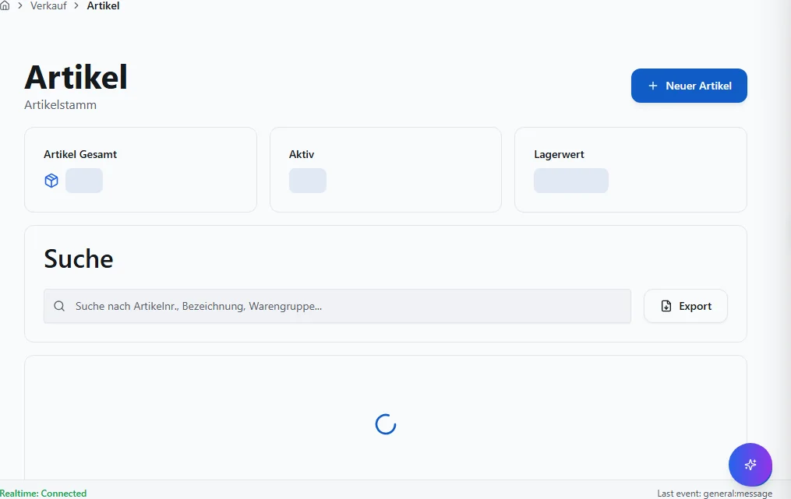

**Schritte:**

1. Sidebar oder Suche: **Artikel** öffnen (`/artikel`).
2. Filter und Spalten nach Bedarf setzen; bei ListReport Zeilen per Doppelklick oder Aktion öffnen.
3. Bei Belegen: Kopfdaten prüfen, Positionen erfassen oder ändern, **Speichern** bzw. workflowgebundene Aktion (Freigabe, Folgebeleg) ausführen.
4. Ergebnis in Liste, Detailansicht oder Folgebeleg verifizieren; bei Fehlern Meldungstext und Status prüfen.

**Ergebnis:** Datensatz gespeichert, Liste aktualisiert oder Folgeprozess ausgelöst.

**Häufige Fehler:**

| Symptom | Ursache | Maßnahme |
|---------|---------|----------|
| Maske lädt nicht | Modul nicht freigeschaltet oder fehlende Berechtigung | Administrator: Modul/RBAC prüfen |
| Speichern fehlgeschlagen | Pflichtfeld, Status oder Validierung | Meldung lesen, Pflichtfelder ergänzen |
| Aktion ausgegraut | Workflow-Status oder Sperre | Vorbeleg freigeben oder Berechtigung klären |

### :Id

**Route:** `/artikel/:id` · **Modul:** `@/pages/artikel/stamm`

**Ziel:** :Id in VALEO NeuroERP öffnen, Daten prüfen oder erfassen und das Ergebnis in Liste bzw. Folgebeleg kontrollieren.

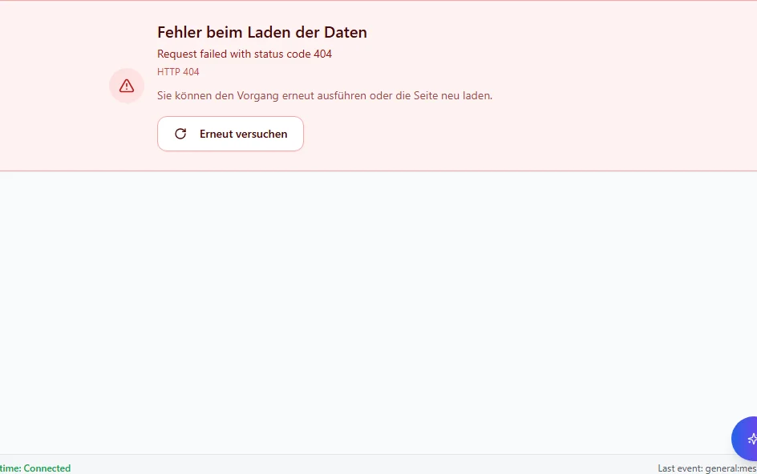

**Schritte:**

1. Sidebar oder Suche: **:Id** öffnen (`/artikel/:id`).
2. Filter und Spalten nach Bedarf setzen; bei ListReport Zeilen per Doppelklick oder Aktion öffnen.
3. Bei Belegen: Kopfdaten prüfen, Positionen erfassen oder ändern, **Speichern** bzw. workflowgebundene Aktion (Freigabe, Folgebeleg) ausführen.
4. Ergebnis in Liste, Detailansicht oder Folgebeleg verifizieren; bei Fehlern Meldungstext und Status prüfen.

**Ergebnis:** Datensatz gespeichert, Liste aktualisiert oder Folgeprozess ausgelöst.

**Häufige Fehler:**

| Symptom | Ursache | Maßnahme |
|---------|---------|----------|
| Maske lädt nicht | Modul nicht freigeschaltet oder fehlende Berechtigung | Administrator: Modul/RBAC prüfen |
| Speichern fehlgeschlagen | Pflichtfeld, Status oder Validierung | Meldung lesen, Pflichtfelder ergänzen |
| Aktion ausgegraut | Workflow-Status oder Sperre | Vorbeleg freigeben oder Berechtigung klären |

### Liste

**Route:** `/artikel/liste` · **Modul:** `@/pages/artikel/liste`

**Ziel:** Liste in VALEO NeuroERP öffnen, Daten prüfen oder erfassen und das Ergebnis in Liste bzw. Folgebeleg kontrollieren.

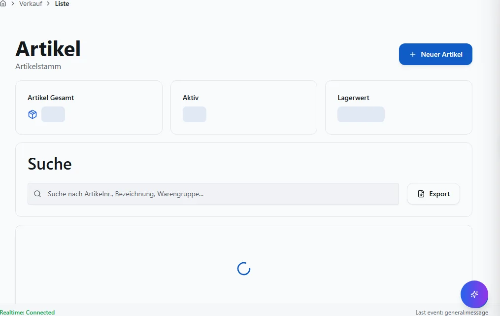

**Schritte:**

1. Sidebar oder Suche: **Liste** öffnen (`/artikel/liste`).
2. Filter und Spalten nach Bedarf setzen; bei ListReport Zeilen per Doppelklick oder Aktion öffnen.
3. Bei Belegen: Kopfdaten prüfen, Positionen erfassen oder ändern, **Speichern** bzw. workflowgebundene Aktion (Freigabe, Folgebeleg) ausführen.
4. Ergebnis in Liste, Detailansicht oder Folgebeleg verifizieren; bei Fehlern Meldungstext und Status prüfen.

**Ergebnis:** Datensatz gespeichert, Liste aktualisiert oder Folgeprozess ausgelöst.

**Häufige Fehler:**

| Symptom | Ursache | Maßnahme |
|---------|---------|----------|
| Maske lädt nicht | Modul nicht freigeschaltet oder fehlende Berechtigung | Administrator: Modul/RBAC prüfen |
| Speichern fehlgeschlagen | Pflichtfeld, Status oder Validierung | Meldung lesen, Pflichtfelder ergänzen |
| Aktion ausgegraut | Workflow-Status oder Sperre | Vorbeleg freigeben oder Berechtigung klären |

### Neu

**Route:** `/artikel/neu` · **Modul:** `@/pages/artikel/stamm`

**Ziel:** Neu in VALEO NeuroERP öffnen, Daten prüfen oder erfassen und das Ergebnis in Liste bzw. Folgebeleg kontrollieren.

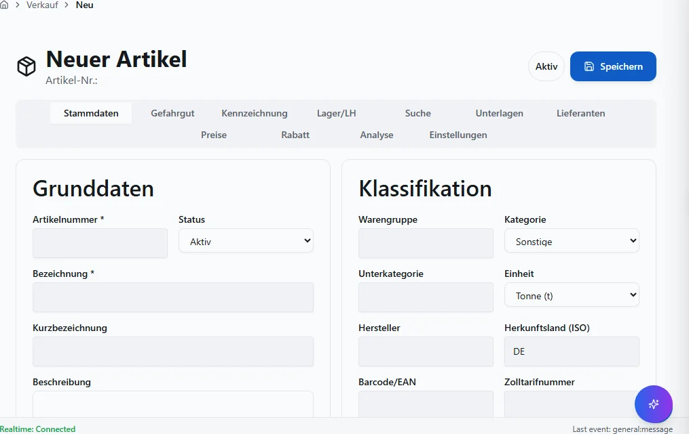

**Schritte:**

1. Sidebar oder Suche: **Neu** öffnen (`/artikel/neu`).
2. Filter und Spalten nach Bedarf setzen; bei ListReport Zeilen per Doppelklick oder Aktion öffnen.
3. Bei Belegen: Kopfdaten prüfen, Positionen erfassen oder ändern, **Speichern** bzw. workflowgebundene Aktion (Freigabe, Folgebeleg) ausführen.
4. Ergebnis in Liste, Detailansicht oder Folgebeleg verifizieren; bei Fehlern Meldungstext und Status prüfen.

**Ergebnis:** Datensatz gespeichert, Liste aktualisiert oder Folgeprozess ausgelöst.

**Häufige Fehler:**

| Symptom | Ursache | Maßnahme |
|---------|---------|----------|
| Maske lädt nicht | Modul nicht freigeschaltet oder fehlende Berechtigung | Administrator: Modul/RBAC prüfen |
| Speichern fehlgeschlagen | Pflichtfeld, Status oder Validierung | Meldung lesen, Pflichtfelder ergänzen |
| Aktion ausgegraut | Workflow-Status oder Sperre | Vorbeleg freigeben oder Berechtigung klären |

### Stamm

**Route:** `/artikel/stamm` · **Modul:** `@/pages/artikel/stamm`

**Ziel:** Stamm in VALEO NeuroERP öffnen, Daten prüfen oder erfassen und das Ergebnis in Liste bzw. Folgebeleg kontrollieren.

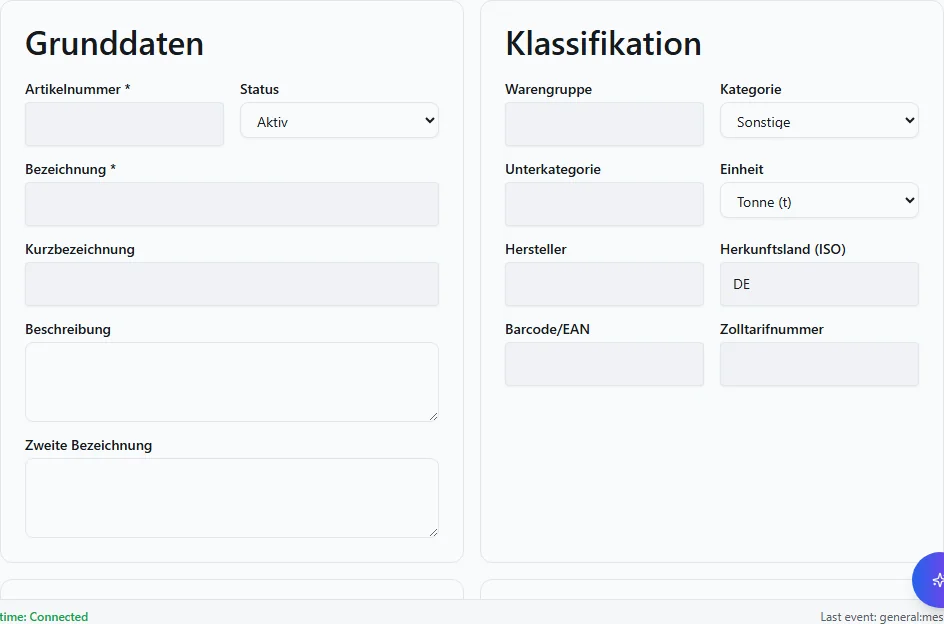

**Schritte:**

1. Sidebar oder Suche: **Stamm** öffnen (`/artikel/stamm`).
2. Filter und Spalten nach Bedarf setzen; bei ListReport Zeilen per Doppelklick oder Aktion öffnen.
3. Bei Belegen: Kopfdaten prüfen, Positionen erfassen oder ändern, **Speichern** bzw. workflowgebundene Aktion (Freigabe, Folgebeleg) ausführen.
4. Ergebnis in Liste, Detailansicht oder Folgebeleg verifizieren; bei Fehlern Meldungstext und Status prüfen.

**Ergebnis:** Datensatz gespeichert, Liste aktualisiert oder Folgeprozess ausgelöst.

**Häufige Fehler:**

| Symptom | Ursache | Maßnahme |
|---------|---------|----------|
| Maske lädt nicht | Modul nicht freigeschaltet oder fehlende Berechtigung | Administrator: Modul/RBAC prüfen |
| Speichern fehlgeschlagen | Pflichtfeld, Status oder Validierung | Meldung lesen, Pflichtfelder ergänzen |
| Aktion ausgegraut | Workflow-Status oder Sperre | Vorbeleg freigeben oder Berechtigung klären |

### Liste

**Route:** `/charge/liste` · **Modul:** `@/pages/charge/liste`

**Ziel:** Liste in VALEO NeuroERP öffnen, Daten prüfen oder erfassen und das Ergebnis in Liste bzw. Folgebeleg kontrollieren.

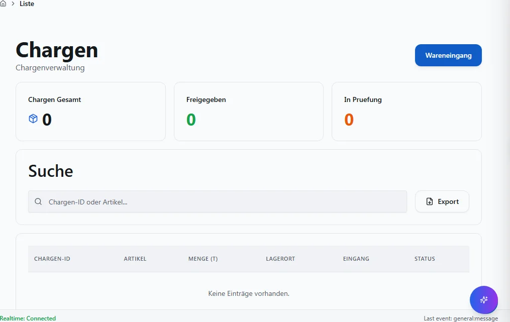

**Schritte:**

1. Sidebar oder Suche: **Liste** öffnen (`/charge/liste`).
2. Filter und Spalten nach Bedarf setzen; bei ListReport Zeilen per Doppelklick oder Aktion öffnen.
3. Bei Belegen: Kopfdaten prüfen, Positionen erfassen oder ändern, **Speichern** bzw. workflowgebundene Aktion (Freigabe, Folgebeleg) ausführen.
4. Ergebnis in Liste, Detailansicht oder Folgebeleg verifizieren; bei Fehlern Meldungstext und Status prüfen.

**Ergebnis:** Datensatz gespeichert, Liste aktualisiert oder Folgeprozess ausgelöst.

**Häufige Fehler:**

| Symptom | Ursache | Maßnahme |
|---------|---------|----------|
| Maske lädt nicht | Modul nicht freigeschaltet oder fehlende Berechtigung | Administrator: Modul/RBAC prüfen |
| Speichern fehlgeschlagen | Pflichtfeld, Status oder Validierung | Meldung lesen, Pflichtfelder ergänzen |
| Aktion ausgegraut | Workflow-Status oder Sperre | Vorbeleg freigeben oder Berechtigung klären |

### Rueckverfolgung

**Route:** `/charge/rueckverfolgung` · **Modul:** `@/pages/charge/rueckverfolgung`

**Ziel:** Rueckverfolgung in VALEO NeuroERP öffnen, Daten prüfen oder erfassen und das Ergebnis in Liste bzw. Folgebeleg kontrollieren.

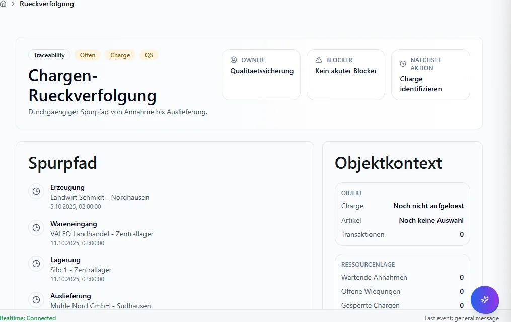

**Schritte:**

1. Sidebar oder Suche: **Rueckverfolgung** öffnen (`/charge/rueckverfolgung`).
2. Filter und Spalten nach Bedarf setzen; bei ListReport Zeilen per Doppelklick oder Aktion öffnen.
3. Bei Belegen: Kopfdaten prüfen, Positionen erfassen oder ändern, **Speichern** bzw. workflowgebundene Aktion (Freigabe, Folgebeleg) ausführen.
4. Ergebnis in Liste, Detailansicht oder Folgebeleg verifizieren; bei Fehlern Meldungstext und Status prüfen.

**Ergebnis:** Datensatz gespeichert, Liste aktualisiert oder Folgeprozess ausgelöst.

**Häufige Fehler:**

| Symptom | Ursache | Maßnahme |
|---------|---------|----------|
| Maske lädt nicht | Modul nicht freigeschaltet oder fehlende Berechtigung | Administrator: Modul/RBAC prüfen |
| Speichern fehlgeschlagen | Pflichtfeld, Status oder Validierung | Meldung lesen, Pflichtfelder ergänzen |
| Aktion ausgegraut | Workflow-Status oder Sperre | Vorbeleg freigeben oder Berechtigung klären |

### Stamm

**Route:** `/charge/stamm` · **Modul:** `@/pages/charge/stamm`

**Ziel:** Stamm in VALEO NeuroERP öffnen, Daten prüfen oder erfassen und das Ergebnis in Liste bzw. Folgebeleg kontrollieren.

**Schritte:**

1. Sidebar oder Suche: **Stamm** öffnen (`/charge/stamm`).
2. Filter und Spalten nach Bedarf setzen; bei ListReport Zeilen per Doppelklick oder Aktion öffnen.
3. Bei Belegen: Kopfdaten prüfen, Positionen erfassen oder ändern, **Speichern** bzw. workflowgebundene Aktion (Freigabe, Folgebeleg) ausführen.
4. Ergebnis in Liste, Detailansicht oder Folgebeleg verifizieren; bei Fehlern Meldungstext und Status prüfen.

**Ergebnis:** Datensatz gespeichert, Liste aktualisiert oder Folgeprozess ausgelöst.

**Häufige Fehler:**

| Symptom | Ursache | Maßnahme |
|---------|---------|----------|
| Maske lädt nicht | Modul nicht freigeschaltet oder fehlende Berechtigung | Administrator: Modul/RBAC prüfen |
| Speichern fehlgeschlagen | Pflichtfeld, Status oder Validierung | Meldung lesen, Pflichtfelder ergänzen |
| Aktion ausgegraut | Workflow-Status oder Sperre | Vorbeleg freigeben oder Berechtigung klären |

### :Id

**Route:** `/charge/stamm/:id` · **Modul:** `@/pages/charge/stamm`

**Ziel:** :Id in VALEO NeuroERP öffnen, Daten prüfen oder erfassen und das Ergebnis in Liste bzw. Folgebeleg kontrollieren.

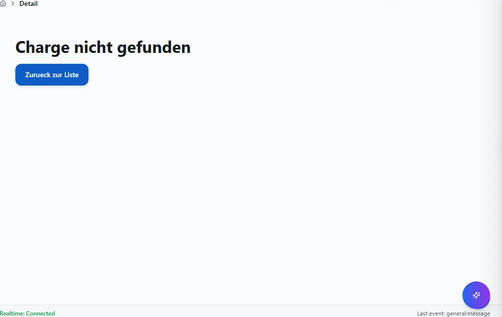

**Schritte:**

1. Sidebar oder Suche: **:Id** öffnen (`/charge/stamm/:id`).
2. Filter und Spalten nach Bedarf setzen; bei ListReport Zeilen per Doppelklick oder Aktion öffnen.
3. Bei Belegen: Kopfdaten prüfen, Positionen erfassen oder ändern, **Speichern** bzw. workflowgebundene Aktion (Freigabe, Folgebeleg) ausführen.
4. Ergebnis in Liste, Detailansicht oder Folgebeleg verifizieren; bei Fehlern Meldungstext und Status prüfen.

**Ergebnis:** Datensatz gespeichert, Liste aktualisiert oder Folgeprozess ausgelöst.

**Häufige Fehler:**

| Symptom | Ursache | Maßnahme |
|---------|---------|----------|
| Maske lädt nicht | Modul nicht freigeschaltet oder fehlende Berechtigung | Administrator: Modul/RBAC prüfen |
| Speichern fehlgeschlagen | Pflichtfeld, Status oder Validierung | Meldung lesen, Pflichtfelder ergänzen |
| Aktion ausgegraut | Workflow-Status oder Sperre | Vorbeleg freigeben oder Berechtigung klären |

### Wareneingang

**Route:** `/charge/wareneingang` · **Modul:** `@/pages/charge/wareneingang`

**Ziel:** Wareneingang in VALEO NeuroERP öffnen, Daten prüfen oder erfassen und das Ergebnis in Liste bzw. Folgebeleg kontrollieren.

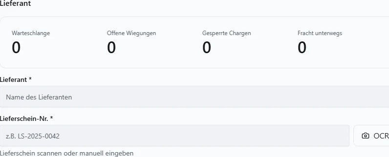

**Schritte:**

1. Sidebar oder Suche: **Wareneingang** öffnen (`/charge/wareneingang`).
2. Filter und Spalten nach Bedarf setzen; bei ListReport Zeilen per Doppelklick oder Aktion öffnen.
3. Bei Belegen: Kopfdaten prüfen, Positionen erfassen oder ändern, **Speichern** bzw. workflowgebundene Aktion (Freigabe, Folgebeleg) ausführen.
4. Ergebnis in Liste, Detailansicht oder Folgebeleg verifizieren; bei Fehlern Meldungstext und Status prüfen.

**Ergebnis:** Datensatz gespeichert, Liste aktualisiert oder Folgeprozess ausgelöst.

**Häufige Fehler:**

| Symptom | Ursache | Maßnahme |
|---------|---------|----------|
| Maske lädt nicht | Modul nicht freigeschaltet oder fehlende Berechtigung | Administrator: Modul/RBAC prüfen |
| Speichern fehlgeschlagen | Pflichtfeld, Status oder Validierung | Meldung lesen, Pflichtfelder ergänzen |
| Aktion ausgegraut | Workflow-Status oder Sperre | Vorbeleg freigeben oder Berechtigung klären |

### Drucken

**Route:** `/etiketten/drucken` · **Modul:** `@/pages/etiketten/drucken`

**Ziel:** Drucken in VALEO NeuroERP öffnen, Daten prüfen oder erfassen und das Ergebnis in Liste bzw. Folgebeleg kontrollieren.

**Schritte:**

1. Sidebar oder Suche: **Drucken** öffnen (`/etiketten/drucken`).
2. Filter und Spalten nach Bedarf setzen; bei ListReport Zeilen per Doppelklick oder Aktion öffnen.
3. Bei Belegen: Kopfdaten prüfen, Positionen erfassen oder ändern, **Speichern** bzw. workflowgebundene Aktion (Freigabe, Folgebeleg) ausführen.
4. Ergebnis in Liste, Detailansicht oder Folgebeleg verifizieren; bei Fehlern Meldungstext und Status prüfen.

**Ergebnis:** Datensatz gespeichert, Liste aktualisiert oder Folgeprozess ausgelöst.

**Häufige Fehler:**

| Symptom | Ursache | Maßnahme |
|---------|---------|----------|
| Maske lädt nicht | Modul nicht freigeschaltet oder fehlende Berechtigung | Administrator: Modul/RBAC prüfen |
| Speichern fehlgeschlagen | Pflichtfeld, Status oder Validierung | Meldung lesen, Pflichtfelder ergänzen |
| Aktion ausgegraut | Workflow-Status oder Sperre | Vorbeleg freigeben oder Berechtigung klären |

### Artikel Stoffstrom

**Route:** `/stammdaten/artikel-stoffstrom` · **Modul:** `@/pages/stammdaten/artikel-stoffstrom`

**Ziel:** Artikel Stoffstrom in VALEO NeuroERP öffnen, Daten prüfen oder erfassen und das Ergebnis in Liste bzw. Folgebeleg kontrollieren.

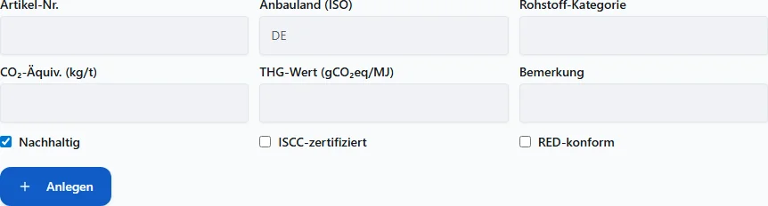

**Schritte:**

1. Sidebar oder Suche: **Artikel Stoffstrom** öffnen (`/stammdaten/artikel-stoffstrom`).
2. Filter und Spalten nach Bedarf setzen; bei ListReport Zeilen per Doppelklick oder Aktion öffnen.
3. Bei Belegen: Kopfdaten prüfen, Positionen erfassen oder ändern, **Speichern** bzw. workflowgebundene Aktion (Freigabe, Folgebeleg) ausführen.
4. Ergebnis in Liste, Detailansicht oder Folgebeleg verifizieren; bei Fehlern Meldungstext und Status prüfen.

**Ergebnis:** Datensatz gespeichert, Liste aktualisiert oder Folgeprozess ausgelöst.

**Häufige Fehler:**

| Symptom | Ursache | Maßnahme |
|---------|---------|----------|
| Maske lädt nicht | Modul nicht freigeschaltet oder fehlende Berechtigung | Administrator: Modul/RBAC prüfen |
| Speichern fehlgeschlagen | Pflichtfeld, Status oder Validierung | Meldung lesen, Pflichtfelder ergänzen |
| Aktion ausgegraut | Workflow-Status oder Sperre | Vorbeleg freigeben oder Berechtigung klären |

### Artikelbestandteile

**Route:** `/stammdaten/artikelbestandteile` · **Modul:** `@/pages/stammdaten/artikelbestandteile`

**Ziel:** Artikelbestandteile in VALEO NeuroERP öffnen, Daten prüfen oder erfassen und das Ergebnis in Liste bzw. Folgebeleg kontrollieren.

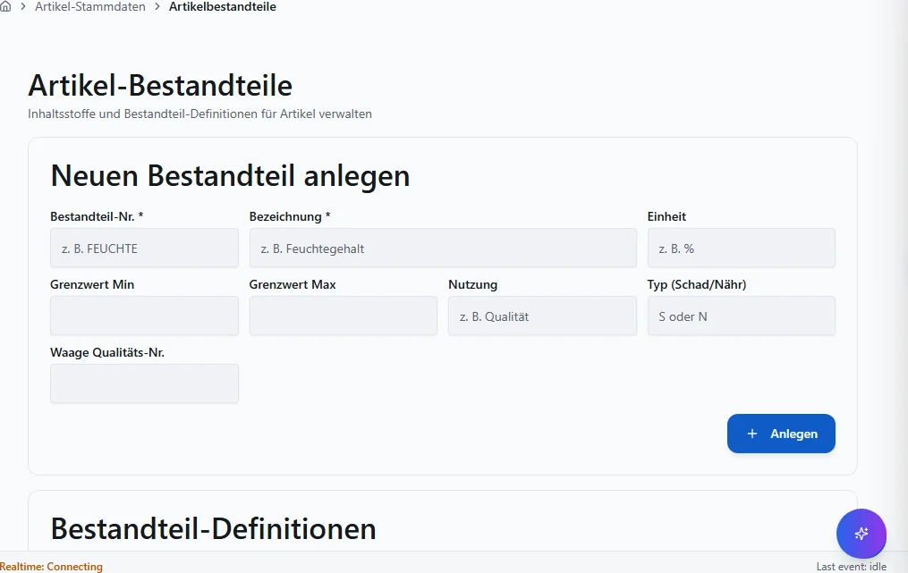

**Schritte:**

1. Sidebar oder Suche: **Artikelbestandteile** öffnen (`/stammdaten/artikelbestandteile`).
2. Filter und Spalten nach Bedarf setzen; bei ListReport Zeilen per Doppelklick oder Aktion öffnen.
3. Bei Belegen: Kopfdaten prüfen, Positionen erfassen oder ändern, **Speichern** bzw. workflowgebundene Aktion (Freigabe, Folgebeleg) ausführen.
4. Ergebnis in Liste, Detailansicht oder Folgebeleg verifizieren; bei Fehlern Meldungstext und Status prüfen.

**Ergebnis:** Datensatz gespeichert, Liste aktualisiert oder Folgeprozess ausgelöst.

**Häufige Fehler:**

| Symptom | Ursache | Maßnahme |
|---------|---------|----------|
| Maske lädt nicht | Modul nicht freigeschaltet oder fehlende Berechtigung | Administrator: Modul/RBAC prüfen |
| Speichern fehlgeschlagen | Pflichtfeld, Status oder Validierung | Meldung lesen, Pflichtfelder ergänzen |
| Aktion ausgegraut | Workflow-Status oder Sperre | Vorbeleg freigeben oder Berechtigung klären |

### Artikelverpackung

**Route:** `/stammdaten/artikelverpackung` · **Modul:** `@/pages/stammdaten/artikelverpackung`

**Ziel:** Artikelverpackung in VALEO NeuroERP öffnen, Daten prüfen oder erfassen und das Ergebnis in Liste bzw. Folgebeleg kontrollieren.

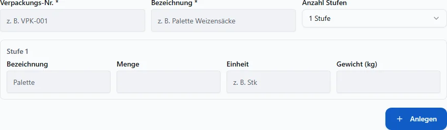

**Schritte:**

1. Sidebar oder Suche: **Artikelverpackung** öffnen (`/stammdaten/artikelverpackung`).
2. Filter und Spalten nach Bedarf setzen; bei ListReport Zeilen per Doppelklick oder Aktion öffnen.
3. Bei Belegen: Kopfdaten prüfen, Positionen erfassen oder ändern, **Speichern** bzw. workflowgebundene Aktion (Freigabe, Folgebeleg) ausführen.
4. Ergebnis in Liste, Detailansicht oder Folgebeleg verifizieren; bei Fehlern Meldungstext und Status prüfen.

**Ergebnis:** Datensatz gespeichert, Liste aktualisiert oder Folgeprozess ausgelöst.

**Häufige Fehler:**

| Symptom | Ursache | Maßnahme |
|---------|---------|----------|
| Maske lädt nicht | Modul nicht freigeschaltet oder fehlende Berechtigung | Administrator: Modul/RBAC prüfen |
| Speichern fehlgeschlagen | Pflichtfeld, Status oder Validierung | Meldung lesen, Pflichtfelder ergänzen |
| Aktion ausgegraut | Workflow-Status oder Sperre | Vorbeleg freigeben oder Berechtigung klären |

### Betriebsstaetten

**Route:** `/stammdaten/betriebsstaetten` · **Modul:** `@/pages/stammdaten/betriebsstaetten`

**Ziel:** Betriebsstaetten in VALEO NeuroERP öffnen, Daten prüfen oder erfassen und das Ergebnis in Liste bzw. Folgebeleg kontrollieren.

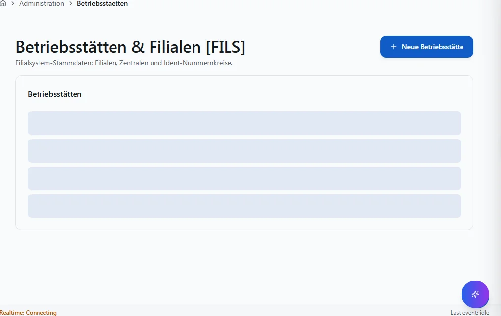

**Schritte:**

1. Sidebar oder Suche: **Betriebsstaetten** öffnen (`/stammdaten/betriebsstaetten`).
2. Filter und Spalten nach Bedarf setzen; bei ListReport Zeilen per Doppelklick oder Aktion öffnen.
3. Bei Belegen: Kopfdaten prüfen, Positionen erfassen oder ändern, **Speichern** bzw. workflowgebundene Aktion (Freigabe, Folgebeleg) ausführen.
4. Ergebnis in Liste, Detailansicht oder Folgebeleg verifizieren; bei Fehlern Meldungstext und Status prüfen.

**Ergebnis:** Datensatz gespeichert, Liste aktualisiert oder Folgeprozess ausgelöst.

**Häufige Fehler:**

| Symptom | Ursache | Maßnahme |
|---------|---------|----------|
| Maske lädt nicht | Modul nicht freigeschaltet oder fehlende Berechtigung | Administrator: Modul/RBAC prüfen |
| Speichern fehlgeschlagen | Pflichtfeld, Status oder Validierung | Meldung lesen, Pflichtfelder ergänzen |
| Aktion ausgegraut | Workflow-Status oder Sperre | Vorbeleg freigeben oder Berechtigung klären |

### Hausbanken

**Route:** `/stammdaten/hausbanken` · **Modul:** `@/pages/stammdaten/hausbanken`

**Ziel:** Hausbanken in VALEO NeuroERP öffnen, Daten prüfen oder erfassen und das Ergebnis in Liste bzw. Folgebeleg kontrollieren.

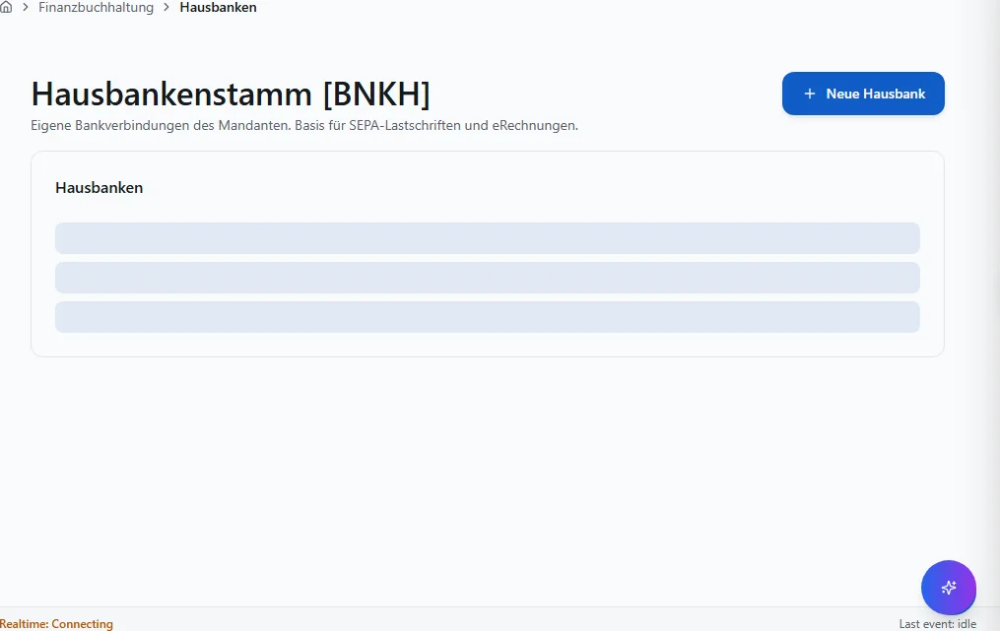

**Schritte:**

1. Sidebar oder Suche: **Hausbanken** öffnen (`/stammdaten/hausbanken`).
2. Filter und Spalten nach Bedarf setzen; bei ListReport Zeilen per Doppelklick oder Aktion öffnen.
3. Bei Belegen: Kopfdaten prüfen, Positionen erfassen oder ändern, **Speichern** bzw. workflowgebundene Aktion (Freigabe, Folgebeleg) ausführen.
4. Ergebnis in Liste, Detailansicht oder Folgebeleg verifizieren; bei Fehlern Meldungstext und Status prüfen.

**Ergebnis:** Datensatz gespeichert, Liste aktualisiert oder Folgeprozess ausgelöst.

**Häufige Fehler:**

| Symptom | Ursache | Maßnahme |
|---------|---------|----------|
| Maske lädt nicht | Modul nicht freigeschaltet oder fehlende Berechtigung | Administrator: Modul/RBAC prüfen |
| Speichern fehlgeschlagen | Pflichtfeld, Status oder Validierung | Meldung lesen, Pflichtfelder ergänzen |
| Aktion ausgegraut | Workflow-Status oder Sperre | Vorbeleg freigeben oder Berechtigung klären |

### Individuelle Artikelnummern

**Route:** `/stammdaten/individuelle-artikelnummern` · **Modul:** `@/pages/stammdaten/individuelle-artikelnummern`

**Ziel:** Individuelle Artikelnummern in VALEO NeuroERP öffnen, Daten prüfen oder erfassen und das Ergebnis in Liste bzw. Folgebeleg kontrollieren.

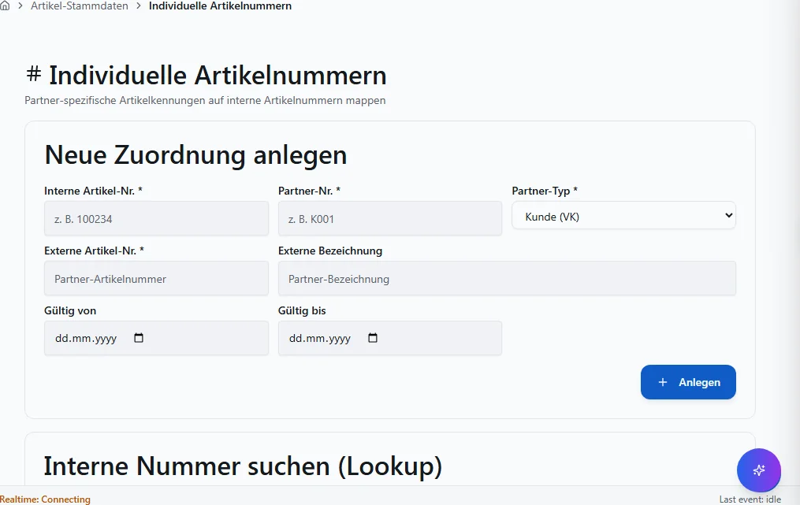

**Schritte:**

1. Sidebar oder Suche: **Individuelle Artikelnummern** öffnen (`/stammdaten/individuelle-artikelnummern`).
2. Filter und Spalten nach Bedarf setzen; bei ListReport Zeilen per Doppelklick oder Aktion öffnen.
3. Bei Belegen: Kopfdaten prüfen, Positionen erfassen oder ändern, **Speichern** bzw. workflowgebundene Aktion (Freigabe, Folgebeleg) ausführen.
4. Ergebnis in Liste, Detailansicht oder Folgebeleg verifizieren; bei Fehlern Meldungstext und Status prüfen.

**Ergebnis:** Datensatz gespeichert, Liste aktualisiert oder Folgeprozess ausgelöst.

**Häufige Fehler:**

| Symptom | Ursache | Maßnahme |
|---------|---------|----------|
| Maske lädt nicht | Modul nicht freigeschaltet oder fehlende Berechtigung | Administrator: Modul/RBAC prüfen |
| Speichern fehlgeschlagen | Pflichtfeld, Status oder Validierung | Meldung lesen, Pflichtfelder ergänzen |
| Aktion ausgegraut | Workflow-Status oder Sperre | Vorbeleg freigeben oder Berechtigung klären |

### Mengeneinheiten

**Route:** `/stammdaten/mengeneinheiten` · **Modul:** `@/pages/stammdaten/mengeneinheiten`

**Ziel:** Mengeneinheiten in VALEO NeuroERP öffnen, Daten prüfen oder erfassen und das Ergebnis in Liste bzw. Folgebeleg kontrollieren.

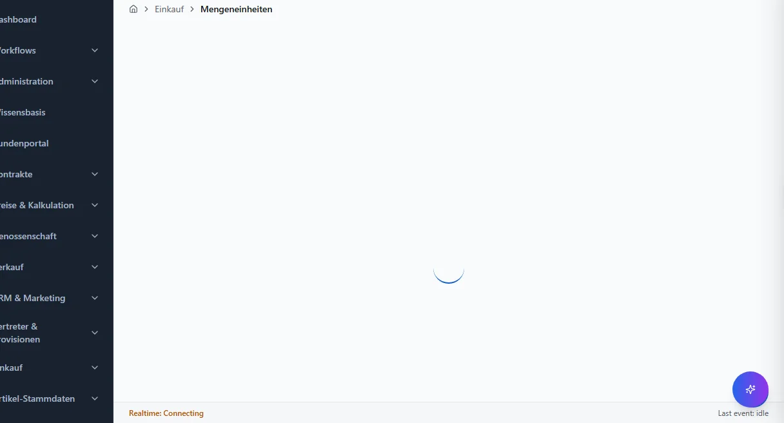

**Schritte:**

1. Sidebar oder Suche: **Mengeneinheiten** öffnen (`/stammdaten/mengeneinheiten`).
2. Filter und Spalten nach Bedarf setzen; bei ListReport Zeilen per Doppelklick oder Aktion öffnen.
3. Bei Belegen: Kopfdaten prüfen, Positionen erfassen oder ändern, **Speichern** bzw. workflowgebundene Aktion (Freigabe, Folgebeleg) ausführen.
4. Ergebnis in Liste, Detailansicht oder Folgebeleg verifizieren; bei Fehlern Meldungstext und Status prüfen.

**Ergebnis:** Datensatz gespeichert, Liste aktualisiert oder Folgeprozess ausgelöst.

**Häufige Fehler:**

| Symptom | Ursache | Maßnahme |
|---------|---------|----------|
| Maske lädt nicht | Modul nicht freigeschaltet oder fehlende Berechtigung | Administrator: Modul/RBAC prüfen |
| Speichern fehlgeschlagen | Pflichtfeld, Status oder Validierung | Meldung lesen, Pflichtfelder ergänzen |
| Aktion ausgegraut | Workflow-Status oder Sperre | Vorbeleg freigeben oder Berechtigung klären |

## Quellen und Reverse-Pflege

- `packages/frontend-web/src/app/navigation/domains/*.tsx` — Sidebar-Navigation.
- `packages/frontend-web/src/app/routing/route-inventory.gen.json` — Routen-Inventar.
- `docs/MASKEN.md` — Layout-Standard (Gewohnheits-Prinzip).

Reverse-Pflege: Bei neuen Routen Generator `scripts/generate_benutzerhandbuch_full.py`
ausführen; `mkdocs.yml`, `index.md` und `generate_inapp_help_map.py` mitziehen.
