# Compliance und Meldewesen

Register, Meldungen, GoBD, PCN/UFI.

## Ziel

Sie arbeiten sicher in allen Masken des Bereichs **Compliance und Meldewesen** — von der Navigation
bis zu Speichern, Freigabe und Folgebelegen.

## Voraussetzungen

- Gültige Anmeldung und Mandant (`X-Tenant-ID`).
- Modul für diesen Fachbereich ist installiert (siehe Administration → Module).
- Ihre Rolle hat Lese- bzw. Schreibberechtigung für die jeweilige Maske.

## Maskenregister

Vollständige Abdeckung: **35** App-Routen
(0 explizit in der Sidebar-Navigation).

| Maske | Route | Modul |
|-------|-------|-------|
| Bvl Meldungen | `/compliance/bvl-meldungen` | `@/pages/compliance/bvl-umsatzmeldung` |
| Bvl Umsatzmeldung | `/compliance/bvl-umsatzmeldung` | `@/pages/compliance/bvl-umsatzmeldung` |
| Cross Compliance | `/compliance/cross-compliance` | `@/pages/compliance/cross-compliance` |
| Datenpannen | `/compliance/datenpannen` | `@/pages/compliance/datenpannen` |
| Enni Meldungen | `/compliance/enni-meldungen` | `@/pages/compliance/enni-meldungen` |
| Enni Neu | `/compliance/enni-neu` | `@/pages/compliance/enni-meldungen` |
| Export Pruefprotokoll | `/compliance/export-pruefprotokoll` | `@/pages/compliance/export-pruefprotokoll` |
| Gelangensbestaetigung | `/compliance/gelangensbestaetigung` | `@/pages/compliance/gelangensbestaetigung` |
| Intrastat | `/compliance/intrastat` | `@/pages/compliance/intrastat` |
| Lksg | `/compliance/lksg` | `@/pages/compliance/lksg` |
| Meldewesen Konsole | `/compliance/meldewesen-konsole` | `@/pages/compliance/meldewesen-konsole` |
| Pcn Liste | `/compliance/pcn-liste` | `@/pages/compliance/pcn-liste` |
| Pcn Ufi | `/compliance/pcn-ufi` | `@/pages/compliance/pcn-ufi` |
| Qs Checkliste | `/compliance/qs-checkliste` | `@/pages/compliance/qs-checkliste` |
| Saatgut Nachbau | `/compliance/saatgut-nachbau` | `@/pages/compliance/saatgut-nachbau` |
| Saatgut Nachbau Neu | `/compliance/saatgut-nachbau-neu` | `@/pages/compliance/saatgut-nachbau` |
| Sachkunde Neu | `/compliance/sachkunde-neu` | `@/pages/compliance/sachkunde-register` |
| Sachkunde Register | `/compliance/sachkunde-register` | `@/pages/compliance/sachkunde-register` |
| Sanktionspruefung | `/compliance/sanktionspruefung` | `@/pages/compliance/sanktionspruefung` |
| Verarbeitungsverzeichnis | `/compliance/verarbeitungsverzeichnis` | `@/pages/compliance/verarbeitungsverzeichnis` |
| Vvvo Register | `/compliance/vvvo-register` | `@/pages/compliance/vvvo-register` |
| Zulassungen Register | `/compliance/zulassungen-register` | `@/pages/compliance/zulassungen-register` |
| Foerderung | `/foerderung` | `@/pages/foerderung/liste` |
| Antrag | `/foerderung/antrag` | `@/pages/foerderung/antrag` |
| :Id | `/foerderung/antrag/:id` | `@/pages/foerderung/antrag` |
| Liste | `/foerderung/liste` | `@/pages/foerderung/liste` |
| Biodiversitaet | `/nachhaltigkeit/biodiversitaet` | `@/pages/nachhaltigkeit/biodiversitaet` |
| Co2 Bilanz | `/nachhaltigkeit/co2-bilanz` | `@/pages/nachhaltigkeit/co2-bilanz` |
| Esg Report | `/nachhaltigkeit/esg-report` | `@/pages/nachhaltigkeit/esg-report` |
| Eudr Compliance | `/nachhaltigkeit/eudr-compliance` | `@/pages/nachhaltigkeit/eudr-compliance` |
| Dashboard | `/subventionen/dashboard` | `@/pages/subventionen/dashboard` |
| Zertifikate | `/zertifikate` | `@/pages/zertifikate/liste` |
| :Id | `/zertifikate/:id` | `@/pages/zertifikate/liste` |
| Liste | `/zertifikate/liste` | `@/pages/zertifikate/liste` |
| Neu | `/zertifikate/neu` | `@/pages/zertifikate/liste` |

## Masken im Detail

Für jede Route: Navigation, Bearbeitung, Ergebnis und typische Fehler.

### Bvl Meldungen

**Route:** `/compliance/bvl-meldungen` · **Modul:** `@/pages/compliance/bvl-umsatzmeldung`

**Ziel:** Bvl Meldungen in VALEO NeuroERP öffnen, Daten prüfen oder erfassen und das Ergebnis in Liste bzw. Folgebeleg kontrollieren.

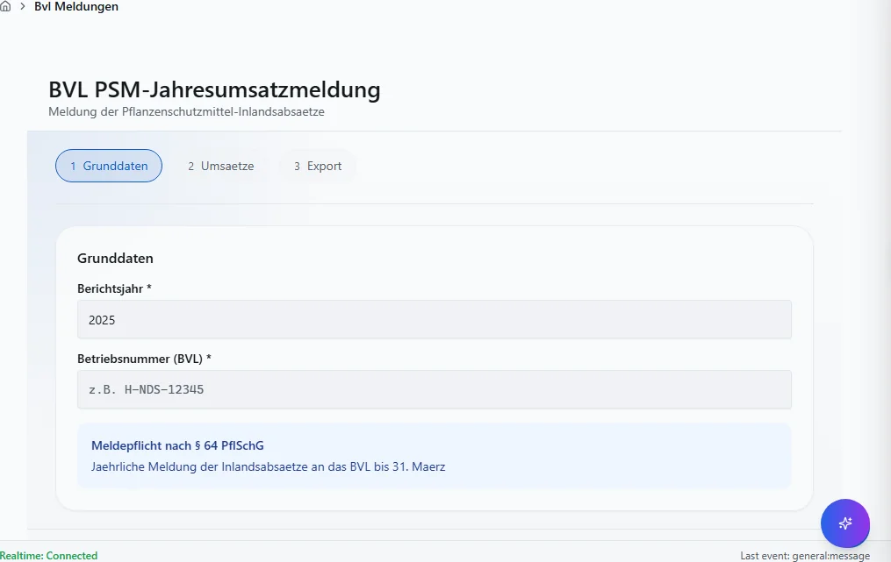

**Schritte:**

1. Sidebar oder Suche: **Bvl Meldungen** öffnen (`/compliance/bvl-meldungen`).
2. Filter und Spalten nach Bedarf setzen; bei ListReport Zeilen per Doppelklick oder Aktion öffnen.
3. Bei Belegen: Kopfdaten prüfen, Positionen erfassen oder ändern, **Speichern** bzw. workflowgebundene Aktion (Freigabe, Folgebeleg) ausführen.
4. Ergebnis in Liste, Detailansicht oder Folgebeleg verifizieren; bei Fehlern Meldungstext und Status prüfen.

**Ergebnis:** Datensatz gespeichert, Liste aktualisiert oder Folgeprozess ausgelöst.

**Häufige Fehler:**

| Symptom | Ursache | Maßnahme |
|---------|---------|----------|
| Maske lädt nicht | Modul nicht freigeschaltet oder fehlende Berechtigung | Administrator: Modul/RBAC prüfen |
| Speichern fehlgeschlagen | Pflichtfeld, Status oder Validierung | Meldung lesen, Pflichtfelder ergänzen |
| Aktion ausgegraut | Workflow-Status oder Sperre | Vorbeleg freigeben oder Berechtigung klären |

### Bvl Umsatzmeldung

**Route:** `/compliance/bvl-umsatzmeldung` · **Modul:** `@/pages/compliance/bvl-umsatzmeldung`

**Ziel:** Bvl Umsatzmeldung in VALEO NeuroERP öffnen, Daten prüfen oder erfassen und das Ergebnis in Liste bzw. Folgebeleg kontrollieren.

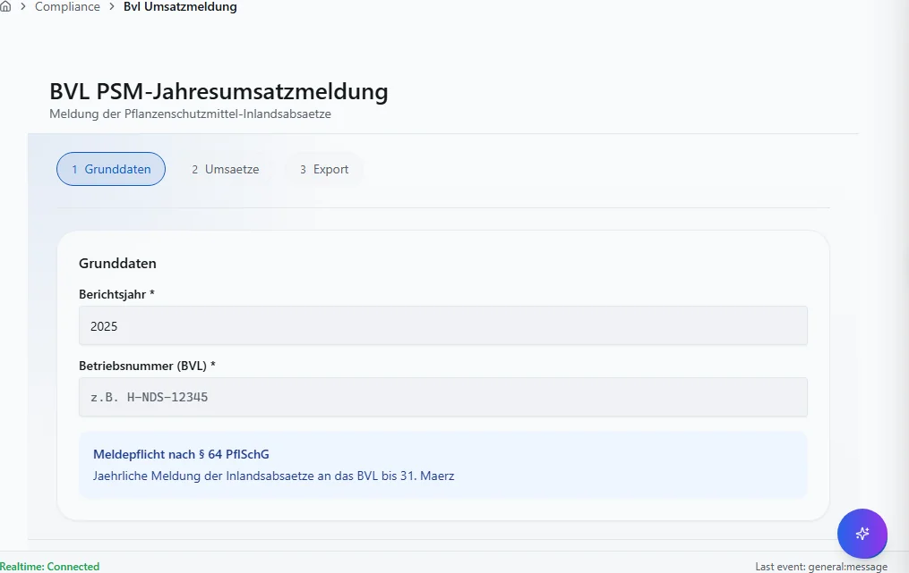

**Schritte:**

1. Sidebar oder Suche: **Bvl Umsatzmeldung** öffnen (`/compliance/bvl-umsatzmeldung`).
2. Filter und Spalten nach Bedarf setzen; bei ListReport Zeilen per Doppelklick oder Aktion öffnen.
3. Bei Belegen: Kopfdaten prüfen, Positionen erfassen oder ändern, **Speichern** bzw. workflowgebundene Aktion (Freigabe, Folgebeleg) ausführen.
4. Ergebnis in Liste, Detailansicht oder Folgebeleg verifizieren; bei Fehlern Meldungstext und Status prüfen.

**Ergebnis:** Datensatz gespeichert, Liste aktualisiert oder Folgeprozess ausgelöst.

**Häufige Fehler:**

| Symptom | Ursache | Maßnahme |
|---------|---------|----------|
| Maske lädt nicht | Modul nicht freigeschaltet oder fehlende Berechtigung | Administrator: Modul/RBAC prüfen |
| Speichern fehlgeschlagen | Pflichtfeld, Status oder Validierung | Meldung lesen, Pflichtfelder ergänzen |
| Aktion ausgegraut | Workflow-Status oder Sperre | Vorbeleg freigeben oder Berechtigung klären |

### Cross Compliance

**Route:** `/compliance/cross-compliance` · **Modul:** `@/pages/compliance/cross-compliance`

**Ziel:** Cross Compliance in VALEO NeuroERP öffnen, Daten prüfen oder erfassen und das Ergebnis in Liste bzw. Folgebeleg kontrollieren.

**Schritte:**

1. Sidebar oder Suche: **Cross Compliance** öffnen (`/compliance/cross-compliance`).
2. Filter und Spalten nach Bedarf setzen; bei ListReport Zeilen per Doppelklick oder Aktion öffnen.
3. Bei Belegen: Kopfdaten prüfen, Positionen erfassen oder ändern, **Speichern** bzw. workflowgebundene Aktion (Freigabe, Folgebeleg) ausführen.
4. Ergebnis in Liste, Detailansicht oder Folgebeleg verifizieren; bei Fehlern Meldungstext und Status prüfen.

**Ergebnis:** Datensatz gespeichert, Liste aktualisiert oder Folgeprozess ausgelöst.

**Häufige Fehler:**

| Symptom | Ursache | Maßnahme |
|---------|---------|----------|
| Maske lädt nicht | Modul nicht freigeschaltet oder fehlende Berechtigung | Administrator: Modul/RBAC prüfen |
| Speichern fehlgeschlagen | Pflichtfeld, Status oder Validierung | Meldung lesen, Pflichtfelder ergänzen |
| Aktion ausgegraut | Workflow-Status oder Sperre | Vorbeleg freigeben oder Berechtigung klären |

### Datenpannen

**Route:** `/compliance/datenpannen` · **Modul:** `@/pages/compliance/datenpannen`

**Ziel:** Datenpannen in VALEO NeuroERP öffnen, Daten prüfen oder erfassen und das Ergebnis in Liste bzw. Folgebeleg kontrollieren.

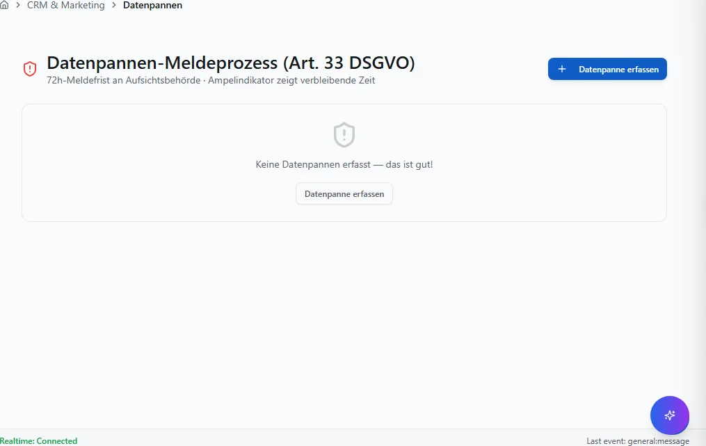

**Schritte:**

1. Sidebar oder Suche: **Datenpannen** öffnen (`/compliance/datenpannen`).
2. Filter und Spalten nach Bedarf setzen; bei ListReport Zeilen per Doppelklick oder Aktion öffnen.
3. Bei Belegen: Kopfdaten prüfen, Positionen erfassen oder ändern, **Speichern** bzw. workflowgebundene Aktion (Freigabe, Folgebeleg) ausführen.
4. Ergebnis in Liste, Detailansicht oder Folgebeleg verifizieren; bei Fehlern Meldungstext und Status prüfen.

**Ergebnis:** Datensatz gespeichert, Liste aktualisiert oder Folgeprozess ausgelöst.

**Häufige Fehler:**

| Symptom | Ursache | Maßnahme |
|---------|---------|----------|
| Maske lädt nicht | Modul nicht freigeschaltet oder fehlende Berechtigung | Administrator: Modul/RBAC prüfen |
| Speichern fehlgeschlagen | Pflichtfeld, Status oder Validierung | Meldung lesen, Pflichtfelder ergänzen |
| Aktion ausgegraut | Workflow-Status oder Sperre | Vorbeleg freigeben oder Berechtigung klären |

### Enni Meldungen

**Route:** `/compliance/enni-meldungen` · **Modul:** `@/pages/compliance/enni-meldungen`

**Ziel:** Enni Meldungen in VALEO NeuroERP öffnen, Daten prüfen oder erfassen und das Ergebnis in Liste bzw. Folgebeleg kontrollieren.

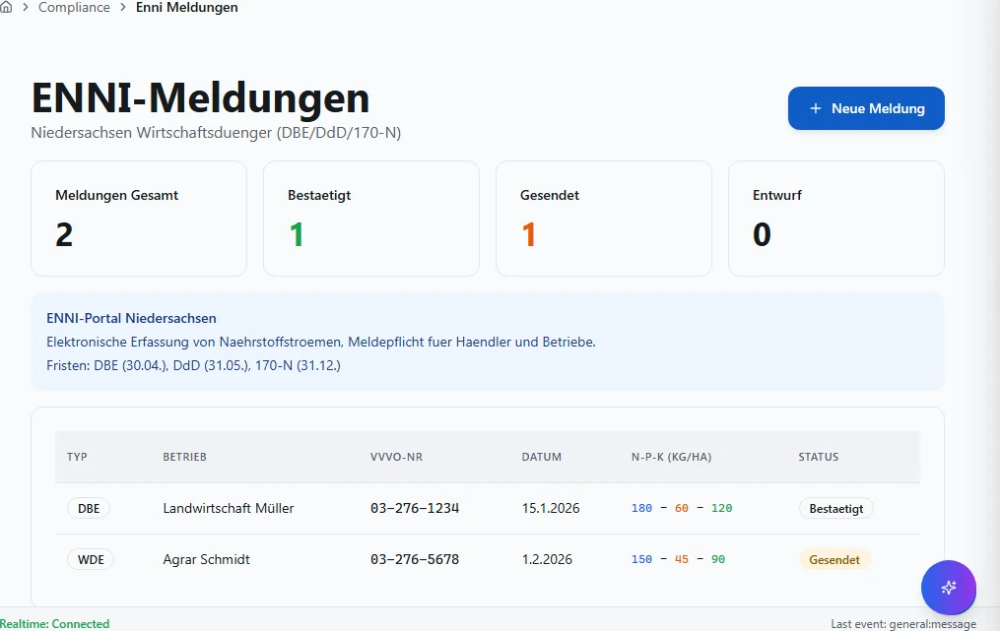

**Schritte:**

1. Sidebar oder Suche: **Enni Meldungen** öffnen (`/compliance/enni-meldungen`).
2. Filter und Spalten nach Bedarf setzen; bei ListReport Zeilen per Doppelklick oder Aktion öffnen.
3. Bei Belegen: Kopfdaten prüfen, Positionen erfassen oder ändern, **Speichern** bzw. workflowgebundene Aktion (Freigabe, Folgebeleg) ausführen.
4. Ergebnis in Liste, Detailansicht oder Folgebeleg verifizieren; bei Fehlern Meldungstext und Status prüfen.

**Ergebnis:** Datensatz gespeichert, Liste aktualisiert oder Folgeprozess ausgelöst.

**Häufige Fehler:**

| Symptom | Ursache | Maßnahme |
|---------|---------|----------|
| Maske lädt nicht | Modul nicht freigeschaltet oder fehlende Berechtigung | Administrator: Modul/RBAC prüfen |
| Speichern fehlgeschlagen | Pflichtfeld, Status oder Validierung | Meldung lesen, Pflichtfelder ergänzen |
| Aktion ausgegraut | Workflow-Status oder Sperre | Vorbeleg freigeben oder Berechtigung klären |

### Enni Neu

**Route:** `/compliance/enni-neu` · **Modul:** `@/pages/compliance/enni-meldungen`

**Ziel:** Enni Neu in VALEO NeuroERP öffnen, Daten prüfen oder erfassen und das Ergebnis in Liste bzw. Folgebeleg kontrollieren.

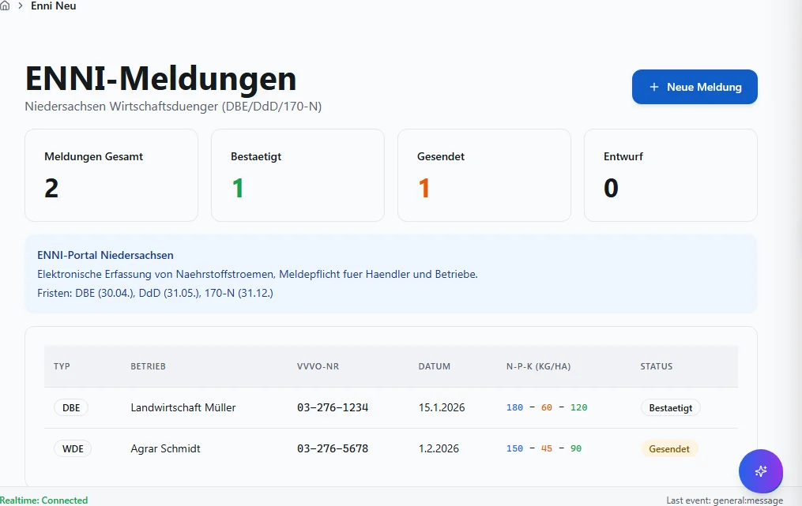

**Schritte:**

1. Sidebar oder Suche: **Enni Neu** öffnen (`/compliance/enni-neu`).
2. Filter und Spalten nach Bedarf setzen; bei ListReport Zeilen per Doppelklick oder Aktion öffnen.
3. Bei Belegen: Kopfdaten prüfen, Positionen erfassen oder ändern, **Speichern** bzw. workflowgebundene Aktion (Freigabe, Folgebeleg) ausführen.
4. Ergebnis in Liste, Detailansicht oder Folgebeleg verifizieren; bei Fehlern Meldungstext und Status prüfen.

**Ergebnis:** Datensatz gespeichert, Liste aktualisiert oder Folgeprozess ausgelöst.

**Häufige Fehler:**

| Symptom | Ursache | Maßnahme |
|---------|---------|----------|
| Maske lädt nicht | Modul nicht freigeschaltet oder fehlende Berechtigung | Administrator: Modul/RBAC prüfen |
| Speichern fehlgeschlagen | Pflichtfeld, Status oder Validierung | Meldung lesen, Pflichtfelder ergänzen |
| Aktion ausgegraut | Workflow-Status oder Sperre | Vorbeleg freigeben oder Berechtigung klären |

### Export Pruefprotokoll

**Route:** `/compliance/export-pruefprotokoll` · **Modul:** `@/pages/compliance/export-pruefprotokoll`

**Ziel:** Export Pruefprotokoll in VALEO NeuroERP öffnen, Daten prüfen oder erfassen und das Ergebnis in Liste bzw. Folgebeleg kontrollieren.

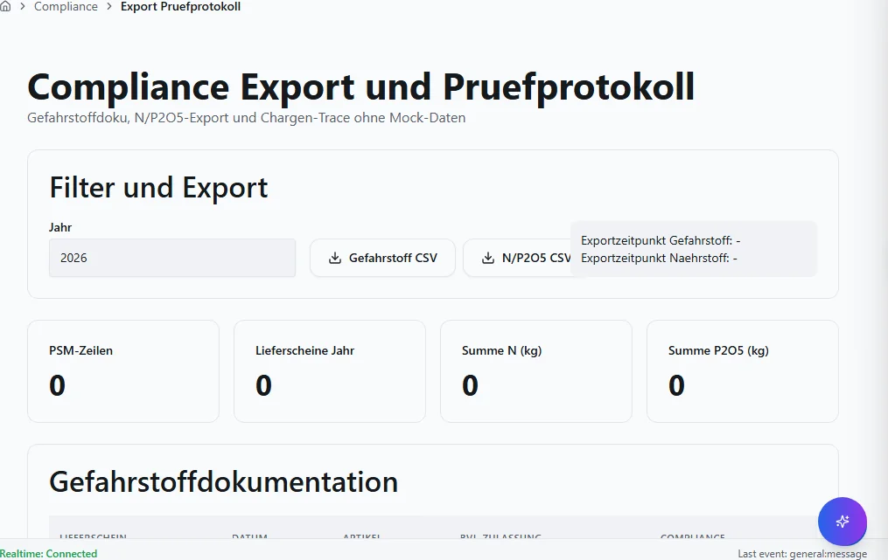

**Schritte:**

1. Sidebar oder Suche: **Export Pruefprotokoll** öffnen (`/compliance/export-pruefprotokoll`).
2. Filter und Spalten nach Bedarf setzen; bei ListReport Zeilen per Doppelklick oder Aktion öffnen.
3. Bei Belegen: Kopfdaten prüfen, Positionen erfassen oder ändern, **Speichern** bzw. workflowgebundene Aktion (Freigabe, Folgebeleg) ausführen.
4. Ergebnis in Liste, Detailansicht oder Folgebeleg verifizieren; bei Fehlern Meldungstext und Status prüfen.

**Ergebnis:** Datensatz gespeichert, Liste aktualisiert oder Folgeprozess ausgelöst.

**Häufige Fehler:**

| Symptom | Ursache | Maßnahme |
|---------|---------|----------|
| Maske lädt nicht | Modul nicht freigeschaltet oder fehlende Berechtigung | Administrator: Modul/RBAC prüfen |
| Speichern fehlgeschlagen | Pflichtfeld, Status oder Validierung | Meldung lesen, Pflichtfelder ergänzen |
| Aktion ausgegraut | Workflow-Status oder Sperre | Vorbeleg freigeben oder Berechtigung klären |

### Gelangensbestaetigung

**Route:** `/compliance/gelangensbestaetigung` · **Modul:** `@/pages/compliance/gelangensbestaetigung`

**Ziel:** Gelangensbestaetigung in VALEO NeuroERP öffnen, Daten prüfen oder erfassen und das Ergebnis in Liste bzw. Folgebeleg kontrollieren.

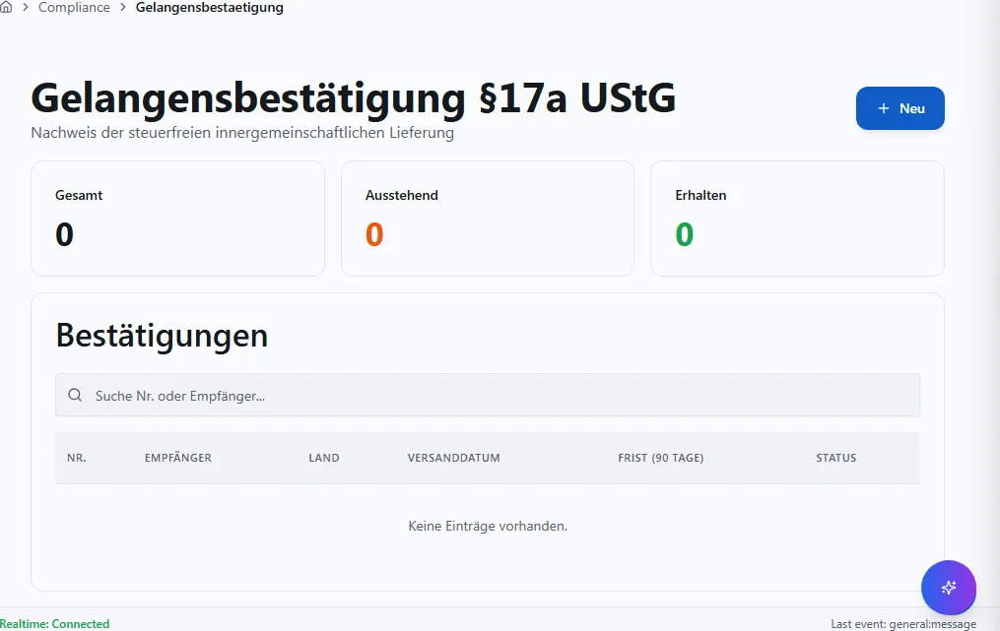

**Schritte:**

1. Sidebar oder Suche: **Gelangensbestaetigung** öffnen (`/compliance/gelangensbestaetigung`).
2. Filter und Spalten nach Bedarf setzen; bei ListReport Zeilen per Doppelklick oder Aktion öffnen.
3. Bei Belegen: Kopfdaten prüfen, Positionen erfassen oder ändern, **Speichern** bzw. workflowgebundene Aktion (Freigabe, Folgebeleg) ausführen.
4. Ergebnis in Liste, Detailansicht oder Folgebeleg verifizieren; bei Fehlern Meldungstext und Status prüfen.

**Ergebnis:** Datensatz gespeichert, Liste aktualisiert oder Folgeprozess ausgelöst.

**Häufige Fehler:**

| Symptom | Ursache | Maßnahme |
|---------|---------|----------|
| Maske lädt nicht | Modul nicht freigeschaltet oder fehlende Berechtigung | Administrator: Modul/RBAC prüfen |
| Speichern fehlgeschlagen | Pflichtfeld, Status oder Validierung | Meldung lesen, Pflichtfelder ergänzen |
| Aktion ausgegraut | Workflow-Status oder Sperre | Vorbeleg freigeben oder Berechtigung klären |

### Intrastat

**Route:** `/compliance/intrastat` · **Modul:** `@/pages/compliance/intrastat`

**Ziel:** Intrastat in VALEO NeuroERP öffnen, Daten prüfen oder erfassen und das Ergebnis in Liste bzw. Folgebeleg kontrollieren.

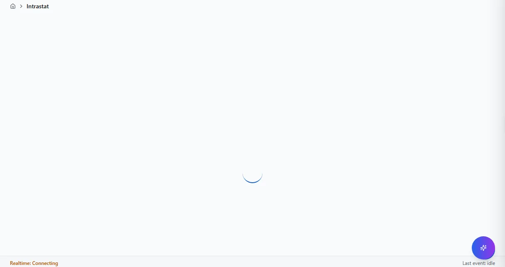

**Schritte:**

1. Sidebar oder Suche: **Intrastat** öffnen (`/compliance/intrastat`).
2. Filter und Spalten nach Bedarf setzen; bei ListReport Zeilen per Doppelklick oder Aktion öffnen.
3. Bei Belegen: Kopfdaten prüfen, Positionen erfassen oder ändern, **Speichern** bzw. workflowgebundene Aktion (Freigabe, Folgebeleg) ausführen.
4. Ergebnis in Liste, Detailansicht oder Folgebeleg verifizieren; bei Fehlern Meldungstext und Status prüfen.

**Ergebnis:** Datensatz gespeichert, Liste aktualisiert oder Folgeprozess ausgelöst.

**Häufige Fehler:**

| Symptom | Ursache | Maßnahme |
|---------|---------|----------|
| Maske lädt nicht | Modul nicht freigeschaltet oder fehlende Berechtigung | Administrator: Modul/RBAC prüfen |
| Speichern fehlgeschlagen | Pflichtfeld, Status oder Validierung | Meldung lesen, Pflichtfelder ergänzen |
| Aktion ausgegraut | Workflow-Status oder Sperre | Vorbeleg freigeben oder Berechtigung klären |

### Lksg

**Route:** `/compliance/lksg` · **Modul:** `@/pages/compliance/lksg`

**Ziel:** Lksg in VALEO NeuroERP öffnen, Daten prüfen oder erfassen und das Ergebnis in Liste bzw. Folgebeleg kontrollieren.

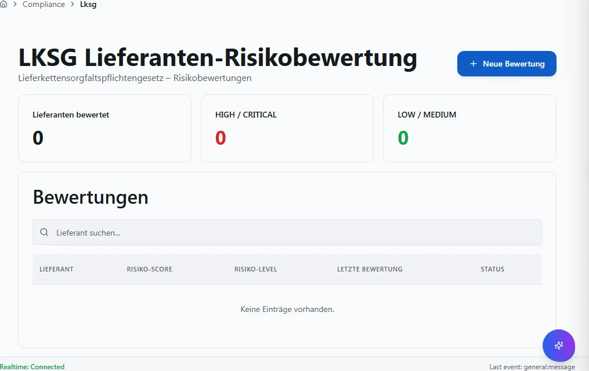

**Schritte:**

1. Sidebar oder Suche: **Lksg** öffnen (`/compliance/lksg`).
2. Filter und Spalten nach Bedarf setzen; bei ListReport Zeilen per Doppelklick oder Aktion öffnen.
3. Bei Belegen: Kopfdaten prüfen, Positionen erfassen oder ändern, **Speichern** bzw. workflowgebundene Aktion (Freigabe, Folgebeleg) ausführen.
4. Ergebnis in Liste, Detailansicht oder Folgebeleg verifizieren; bei Fehlern Meldungstext und Status prüfen.

**Ergebnis:** Datensatz gespeichert, Liste aktualisiert oder Folgeprozess ausgelöst.

**Häufige Fehler:**

| Symptom | Ursache | Maßnahme |
|---------|---------|----------|
| Maske lädt nicht | Modul nicht freigeschaltet oder fehlende Berechtigung | Administrator: Modul/RBAC prüfen |
| Speichern fehlgeschlagen | Pflichtfeld, Status oder Validierung | Meldung lesen, Pflichtfelder ergänzen |
| Aktion ausgegraut | Workflow-Status oder Sperre | Vorbeleg freigeben oder Berechtigung klären |

### Meldewesen Konsole

**Route:** `/compliance/meldewesen-konsole` · **Modul:** `@/pages/compliance/meldewesen-konsole`

**Ziel:** Meldewesen Konsole in VALEO NeuroERP öffnen, Daten prüfen oder erfassen und das Ergebnis in Liste bzw. Folgebeleg kontrollieren.

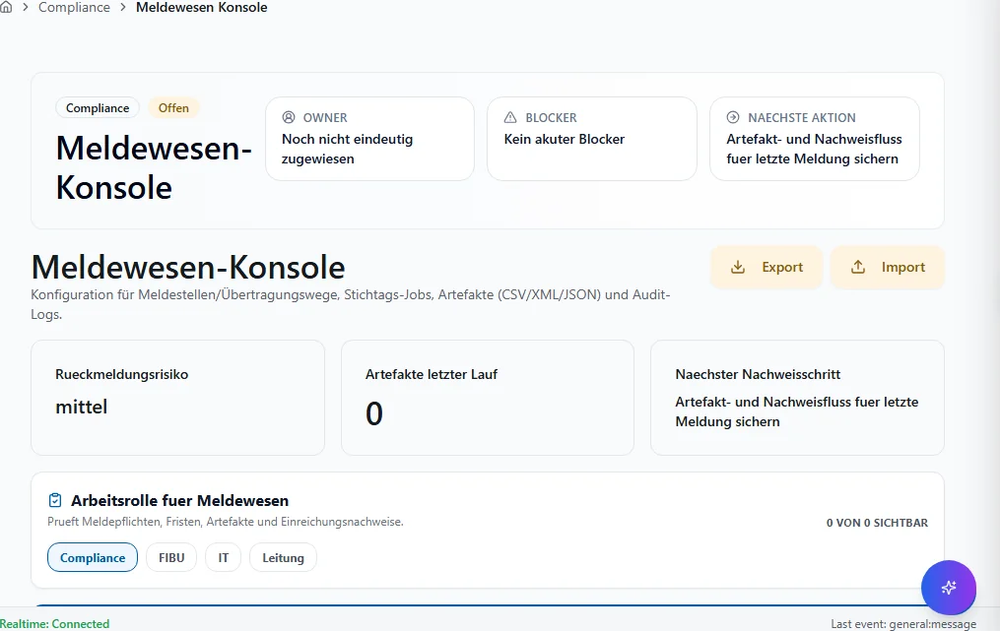

**Schritte:**

1. Sidebar oder Suche: **Meldewesen Konsole** öffnen (`/compliance/meldewesen-konsole`).
2. Filter und Spalten nach Bedarf setzen; bei ListReport Zeilen per Doppelklick oder Aktion öffnen.
3. Bei Belegen: Kopfdaten prüfen, Positionen erfassen oder ändern, **Speichern** bzw. workflowgebundene Aktion (Freigabe, Folgebeleg) ausführen.
4. Ergebnis in Liste, Detailansicht oder Folgebeleg verifizieren; bei Fehlern Meldungstext und Status prüfen.

**Ergebnis:** Datensatz gespeichert, Liste aktualisiert oder Folgeprozess ausgelöst.

**Häufige Fehler:**

| Symptom | Ursache | Maßnahme |
|---------|---------|----------|
| Maske lädt nicht | Modul nicht freigeschaltet oder fehlende Berechtigung | Administrator: Modul/RBAC prüfen |
| Speichern fehlgeschlagen | Pflichtfeld, Status oder Validierung | Meldung lesen, Pflichtfelder ergänzen |
| Aktion ausgegraut | Workflow-Status oder Sperre | Vorbeleg freigeben oder Berechtigung klären |

### Pcn Liste

**Route:** `/compliance/pcn-liste` · **Modul:** `@/pages/compliance/pcn-liste`

**Ziel:** Pcn Liste in VALEO NeuroERP öffnen, Daten prüfen oder erfassen und das Ergebnis in Liste bzw. Folgebeleg kontrollieren.

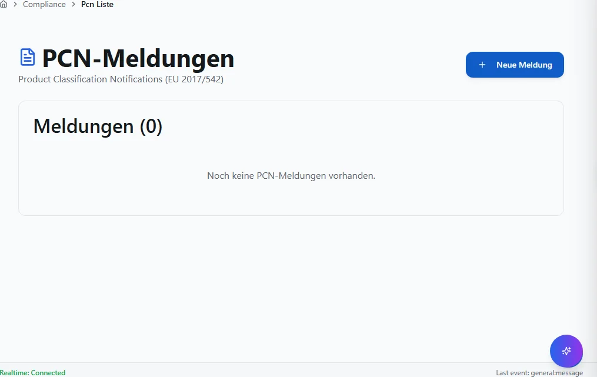

**Schritte:**

1. Sidebar oder Suche: **Pcn Liste** öffnen (`/compliance/pcn-liste`).
2. Filter und Spalten nach Bedarf setzen; bei ListReport Zeilen per Doppelklick oder Aktion öffnen.
3. Bei Belegen: Kopfdaten prüfen, Positionen erfassen oder ändern, **Speichern** bzw. workflowgebundene Aktion (Freigabe, Folgebeleg) ausführen.
4. Ergebnis in Liste, Detailansicht oder Folgebeleg verifizieren; bei Fehlern Meldungstext und Status prüfen.

**Ergebnis:** Datensatz gespeichert, Liste aktualisiert oder Folgeprozess ausgelöst.

**Häufige Fehler:**

| Symptom | Ursache | Maßnahme |
|---------|---------|----------|
| Maske lädt nicht | Modul nicht freigeschaltet oder fehlende Berechtigung | Administrator: Modul/RBAC prüfen |
| Speichern fehlgeschlagen | Pflichtfeld, Status oder Validierung | Meldung lesen, Pflichtfelder ergänzen |
| Aktion ausgegraut | Workflow-Status oder Sperre | Vorbeleg freigeben oder Berechtigung klären |

### Pcn Ufi

**Route:** `/compliance/pcn-ufi` · **Modul:** `@/pages/compliance/pcn-ufi`

**Ziel:** Pcn Ufi in VALEO NeuroERP öffnen, Daten prüfen oder erfassen und das Ergebnis in Liste bzw. Folgebeleg kontrollieren.

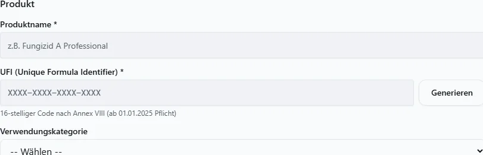

**Schritte:**

1. Sidebar oder Suche: **Pcn Ufi** öffnen (`/compliance/pcn-ufi`).
2. Filter und Spalten nach Bedarf setzen; bei ListReport Zeilen per Doppelklick oder Aktion öffnen.
3. Bei Belegen: Kopfdaten prüfen, Positionen erfassen oder ändern, **Speichern** bzw. workflowgebundene Aktion (Freigabe, Folgebeleg) ausführen.
4. Ergebnis in Liste, Detailansicht oder Folgebeleg verifizieren; bei Fehlern Meldungstext und Status prüfen.

**Ergebnis:** Datensatz gespeichert, Liste aktualisiert oder Folgeprozess ausgelöst.

**Häufige Fehler:**

| Symptom | Ursache | Maßnahme |
|---------|---------|----------|
| Maske lädt nicht | Modul nicht freigeschaltet oder fehlende Berechtigung | Administrator: Modul/RBAC prüfen |
| Speichern fehlgeschlagen | Pflichtfeld, Status oder Validierung | Meldung lesen, Pflichtfelder ergänzen |
| Aktion ausgegraut | Workflow-Status oder Sperre | Vorbeleg freigeben oder Berechtigung klären |

### Qs Checkliste

**Route:** `/compliance/qs-checkliste` · **Modul:** `@/pages/compliance/qs-checkliste`

**Ziel:** Qs Checkliste in VALEO NeuroERP öffnen, Daten prüfen oder erfassen und das Ergebnis in Liste bzw. Folgebeleg kontrollieren.

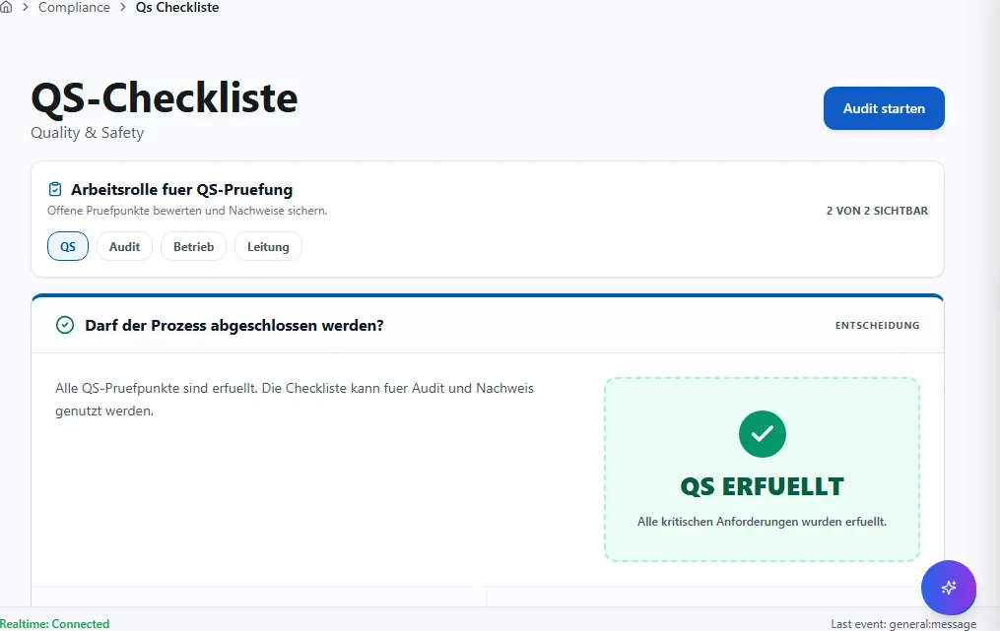

**Schritte:**

1. Sidebar oder Suche: **Qs Checkliste** öffnen (`/compliance/qs-checkliste`).
2. Filter und Spalten nach Bedarf setzen; bei ListReport Zeilen per Doppelklick oder Aktion öffnen.
3. Bei Belegen: Kopfdaten prüfen, Positionen erfassen oder ändern, **Speichern** bzw. workflowgebundene Aktion (Freigabe, Folgebeleg) ausführen.
4. Ergebnis in Liste, Detailansicht oder Folgebeleg verifizieren; bei Fehlern Meldungstext und Status prüfen.

**Ergebnis:** Datensatz gespeichert, Liste aktualisiert oder Folgeprozess ausgelöst.

**Häufige Fehler:**

| Symptom | Ursache | Maßnahme |
|---------|---------|----------|
| Maske lädt nicht | Modul nicht freigeschaltet oder fehlende Berechtigung | Administrator: Modul/RBAC prüfen |
| Speichern fehlgeschlagen | Pflichtfeld, Status oder Validierung | Meldung lesen, Pflichtfelder ergänzen |
| Aktion ausgegraut | Workflow-Status oder Sperre | Vorbeleg freigeben oder Berechtigung klären |

### Saatgut Nachbau

**Route:** `/compliance/saatgut-nachbau` · **Modul:** `@/pages/compliance/saatgut-nachbau`

**Ziel:** Saatgut Nachbau in VALEO NeuroERP öffnen, Daten prüfen oder erfassen und das Ergebnis in Liste bzw. Folgebeleg kontrollieren.

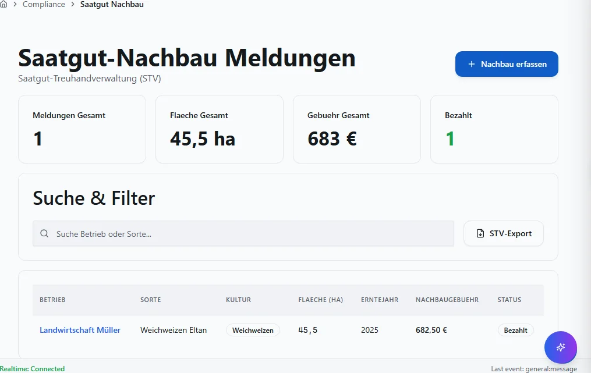

**Schritte:**

1. Sidebar oder Suche: **Saatgut Nachbau** öffnen (`/compliance/saatgut-nachbau`).
2. Filter und Spalten nach Bedarf setzen; bei ListReport Zeilen per Doppelklick oder Aktion öffnen.
3. Bei Belegen: Kopfdaten prüfen, Positionen erfassen oder ändern, **Speichern** bzw. workflowgebundene Aktion (Freigabe, Folgebeleg) ausführen.
4. Ergebnis in Liste, Detailansicht oder Folgebeleg verifizieren; bei Fehlern Meldungstext und Status prüfen.

**Ergebnis:** Datensatz gespeichert, Liste aktualisiert oder Folgeprozess ausgelöst.

**Häufige Fehler:**

| Symptom | Ursache | Maßnahme |
|---------|---------|----------|
| Maske lädt nicht | Modul nicht freigeschaltet oder fehlende Berechtigung | Administrator: Modul/RBAC prüfen |
| Speichern fehlgeschlagen | Pflichtfeld, Status oder Validierung | Meldung lesen, Pflichtfelder ergänzen |
| Aktion ausgegraut | Workflow-Status oder Sperre | Vorbeleg freigeben oder Berechtigung klären |

### Saatgut Nachbau Neu

**Route:** `/compliance/saatgut-nachbau-neu` · **Modul:** `@/pages/compliance/saatgut-nachbau`

**Ziel:** Saatgut Nachbau Neu in VALEO NeuroERP öffnen, Daten prüfen oder erfassen und das Ergebnis in Liste bzw. Folgebeleg kontrollieren.

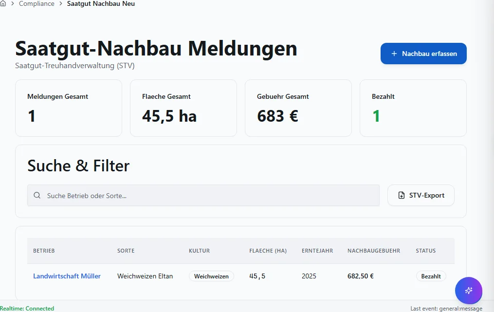

**Schritte:**

1. Sidebar oder Suche: **Saatgut Nachbau Neu** öffnen (`/compliance/saatgut-nachbau-neu`).
2. Filter und Spalten nach Bedarf setzen; bei ListReport Zeilen per Doppelklick oder Aktion öffnen.
3. Bei Belegen: Kopfdaten prüfen, Positionen erfassen oder ändern, **Speichern** bzw. workflowgebundene Aktion (Freigabe, Folgebeleg) ausführen.
4. Ergebnis in Liste, Detailansicht oder Folgebeleg verifizieren; bei Fehlern Meldungstext und Status prüfen.

**Ergebnis:** Datensatz gespeichert, Liste aktualisiert oder Folgeprozess ausgelöst.

**Häufige Fehler:**

| Symptom | Ursache | Maßnahme |
|---------|---------|----------|
| Maske lädt nicht | Modul nicht freigeschaltet oder fehlende Berechtigung | Administrator: Modul/RBAC prüfen |
| Speichern fehlgeschlagen | Pflichtfeld, Status oder Validierung | Meldung lesen, Pflichtfelder ergänzen |
| Aktion ausgegraut | Workflow-Status oder Sperre | Vorbeleg freigeben oder Berechtigung klären |

### Sachkunde Neu

**Route:** `/compliance/sachkunde-neu` · **Modul:** `@/pages/compliance/sachkunde-register`

**Ziel:** Sachkunde Neu in VALEO NeuroERP öffnen, Daten prüfen oder erfassen und das Ergebnis in Liste bzw. Folgebeleg kontrollieren.

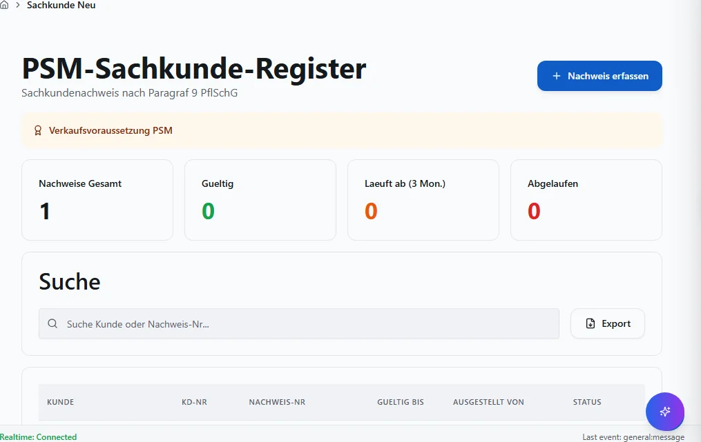

**Schritte:**

1. Sidebar oder Suche: **Sachkunde Neu** öffnen (`/compliance/sachkunde-neu`).
2. Filter und Spalten nach Bedarf setzen; bei ListReport Zeilen per Doppelklick oder Aktion öffnen.
3. Bei Belegen: Kopfdaten prüfen, Positionen erfassen oder ändern, **Speichern** bzw. workflowgebundene Aktion (Freigabe, Folgebeleg) ausführen.
4. Ergebnis in Liste, Detailansicht oder Folgebeleg verifizieren; bei Fehlern Meldungstext und Status prüfen.

**Ergebnis:** Datensatz gespeichert, Liste aktualisiert oder Folgeprozess ausgelöst.

**Häufige Fehler:**

| Symptom | Ursache | Maßnahme |
|---------|---------|----------|
| Maske lädt nicht | Modul nicht freigeschaltet oder fehlende Berechtigung | Administrator: Modul/RBAC prüfen |
| Speichern fehlgeschlagen | Pflichtfeld, Status oder Validierung | Meldung lesen, Pflichtfelder ergänzen |
| Aktion ausgegraut | Workflow-Status oder Sperre | Vorbeleg freigeben oder Berechtigung klären |

### Sachkunde Register

**Route:** `/compliance/sachkunde-register` · **Modul:** `@/pages/compliance/sachkunde-register`

**Ziel:** Sachkunde Register in VALEO NeuroERP öffnen, Daten prüfen oder erfassen und das Ergebnis in Liste bzw. Folgebeleg kontrollieren.

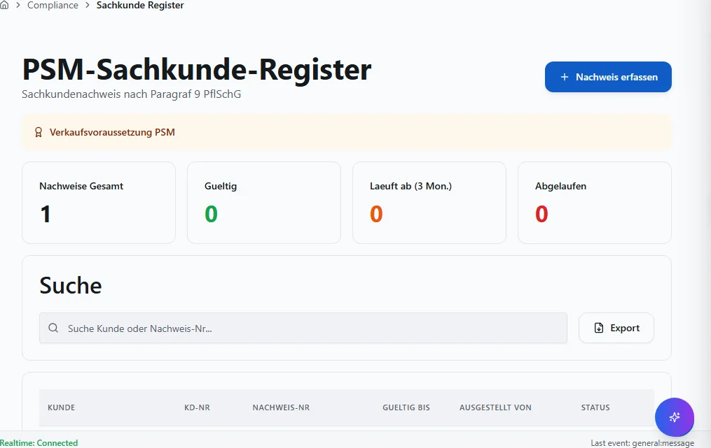

**Schritte:**

1. Sidebar oder Suche: **Sachkunde Register** öffnen (`/compliance/sachkunde-register`).
2. Filter und Spalten nach Bedarf setzen; bei ListReport Zeilen per Doppelklick oder Aktion öffnen.
3. Bei Belegen: Kopfdaten prüfen, Positionen erfassen oder ändern, **Speichern** bzw. workflowgebundene Aktion (Freigabe, Folgebeleg) ausführen.
4. Ergebnis in Liste, Detailansicht oder Folgebeleg verifizieren; bei Fehlern Meldungstext und Status prüfen.

**Ergebnis:** Datensatz gespeichert, Liste aktualisiert oder Folgeprozess ausgelöst.

**Häufige Fehler:**

| Symptom | Ursache | Maßnahme |
|---------|---------|----------|
| Maske lädt nicht | Modul nicht freigeschaltet oder fehlende Berechtigung | Administrator: Modul/RBAC prüfen |
| Speichern fehlgeschlagen | Pflichtfeld, Status oder Validierung | Meldung lesen, Pflichtfelder ergänzen |
| Aktion ausgegraut | Workflow-Status oder Sperre | Vorbeleg freigeben oder Berechtigung klären |

### Sanktionspruefung

**Route:** `/compliance/sanktionspruefung` · **Modul:** `@/pages/compliance/sanktionspruefung`

**Ziel:** Sanktionspruefung in VALEO NeuroERP öffnen, Daten prüfen oder erfassen und das Ergebnis in Liste bzw. Folgebeleg kontrollieren.

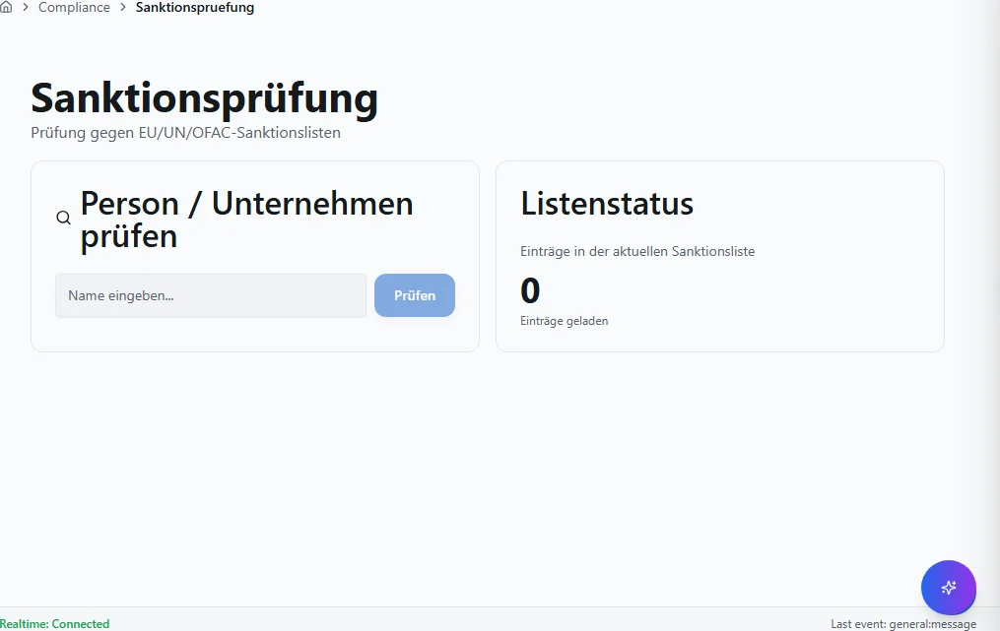

**Schritte:**

1. Sidebar oder Suche: **Sanktionspruefung** öffnen (`/compliance/sanktionspruefung`).
2. Filter und Spalten nach Bedarf setzen; bei ListReport Zeilen per Doppelklick oder Aktion öffnen.
3. Bei Belegen: Kopfdaten prüfen, Positionen erfassen oder ändern, **Speichern** bzw. workflowgebundene Aktion (Freigabe, Folgebeleg) ausführen.
4. Ergebnis in Liste, Detailansicht oder Folgebeleg verifizieren; bei Fehlern Meldungstext und Status prüfen.

**Ergebnis:** Datensatz gespeichert, Liste aktualisiert oder Folgeprozess ausgelöst.

**Häufige Fehler:**

| Symptom | Ursache | Maßnahme |
|---------|---------|----------|
| Maske lädt nicht | Modul nicht freigeschaltet oder fehlende Berechtigung | Administrator: Modul/RBAC prüfen |
| Speichern fehlgeschlagen | Pflichtfeld, Status oder Validierung | Meldung lesen, Pflichtfelder ergänzen |
| Aktion ausgegraut | Workflow-Status oder Sperre | Vorbeleg freigeben oder Berechtigung klären |

### Verarbeitungsverzeichnis

**Route:** `/compliance/verarbeitungsverzeichnis` · **Modul:** `@/pages/compliance/verarbeitungsverzeichnis`

**Ziel:** Verarbeitungsverzeichnis in VALEO NeuroERP öffnen, Daten prüfen oder erfassen und das Ergebnis in Liste bzw. Folgebeleg kontrollieren.

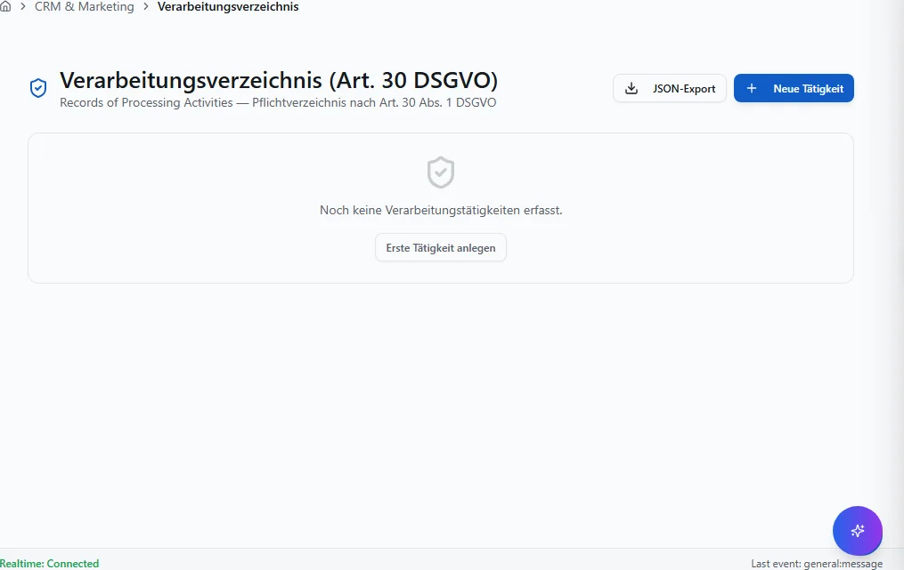

**Schritte:**

1. Sidebar oder Suche: **Verarbeitungsverzeichnis** öffnen (`/compliance/verarbeitungsverzeichnis`).
2. Filter und Spalten nach Bedarf setzen; bei ListReport Zeilen per Doppelklick oder Aktion öffnen.
3. Bei Belegen: Kopfdaten prüfen, Positionen erfassen oder ändern, **Speichern** bzw. workflowgebundene Aktion (Freigabe, Folgebeleg) ausführen.
4. Ergebnis in Liste, Detailansicht oder Folgebeleg verifizieren; bei Fehlern Meldungstext und Status prüfen.

**Ergebnis:** Datensatz gespeichert, Liste aktualisiert oder Folgeprozess ausgelöst.

**Häufige Fehler:**

| Symptom | Ursache | Maßnahme |
|---------|---------|----------|
| Maske lädt nicht | Modul nicht freigeschaltet oder fehlende Berechtigung | Administrator: Modul/RBAC prüfen |
| Speichern fehlgeschlagen | Pflichtfeld, Status oder Validierung | Meldung lesen, Pflichtfelder ergänzen |
| Aktion ausgegraut | Workflow-Status oder Sperre | Vorbeleg freigeben oder Berechtigung klären |

### Vvvo Register

**Route:** `/compliance/vvvo-register` · **Modul:** `@/pages/compliance/vvvo-register`

**Ziel:** Vvvo Register in VALEO NeuroERP öffnen, Daten prüfen oder erfassen und das Ergebnis in Liste bzw. Folgebeleg kontrollieren.

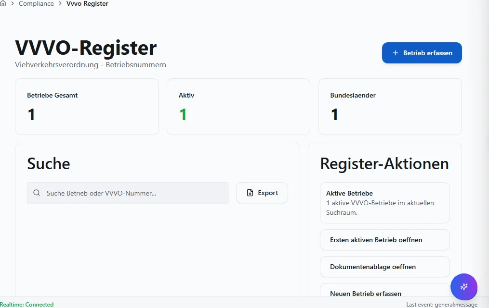

**Schritte:**

1. Sidebar oder Suche: **Vvvo Register** öffnen (`/compliance/vvvo-register`).
2. Filter und Spalten nach Bedarf setzen; bei ListReport Zeilen per Doppelklick oder Aktion öffnen.
3. Bei Belegen: Kopfdaten prüfen, Positionen erfassen oder ändern, **Speichern** bzw. workflowgebundene Aktion (Freigabe, Folgebeleg) ausführen.
4. Ergebnis in Liste, Detailansicht oder Folgebeleg verifizieren; bei Fehlern Meldungstext und Status prüfen.

**Ergebnis:** Datensatz gespeichert, Liste aktualisiert oder Folgeprozess ausgelöst.

**Häufige Fehler:**

| Symptom | Ursache | Maßnahme |
|---------|---------|----------|
| Maske lädt nicht | Modul nicht freigeschaltet oder fehlende Berechtigung | Administrator: Modul/RBAC prüfen |
| Speichern fehlgeschlagen | Pflichtfeld, Status oder Validierung | Meldung lesen, Pflichtfelder ergänzen |
| Aktion ausgegraut | Workflow-Status oder Sperre | Vorbeleg freigeben oder Berechtigung klären |

### Zulassungen Register

**Route:** `/compliance/zulassungen-register` · **Modul:** `@/pages/compliance/zulassungen-register`

**Ziel:** Zulassungen Register in VALEO NeuroERP öffnen, Daten prüfen oder erfassen und das Ergebnis in Liste bzw. Folgebeleg kontrollieren.

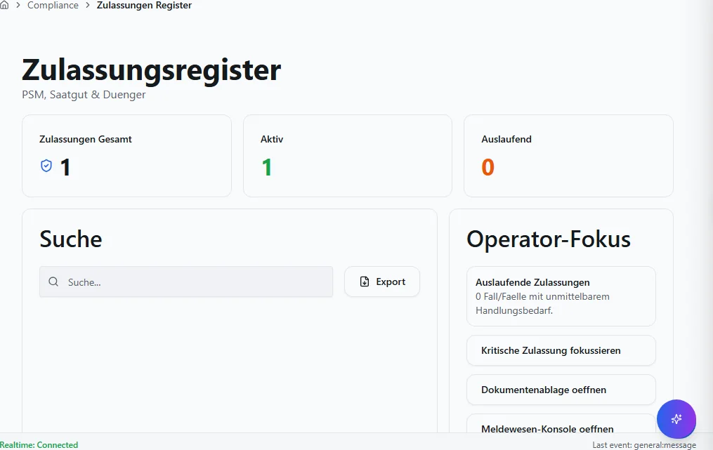

**Schritte:**

1. Sidebar oder Suche: **Zulassungen Register** öffnen (`/compliance/zulassungen-register`).
2. Filter und Spalten nach Bedarf setzen; bei ListReport Zeilen per Doppelklick oder Aktion öffnen.
3. Bei Belegen: Kopfdaten prüfen, Positionen erfassen oder ändern, **Speichern** bzw. workflowgebundene Aktion (Freigabe, Folgebeleg) ausführen.
4. Ergebnis in Liste, Detailansicht oder Folgebeleg verifizieren; bei Fehlern Meldungstext und Status prüfen.

**Ergebnis:** Datensatz gespeichert, Liste aktualisiert oder Folgeprozess ausgelöst.

**Häufige Fehler:**

| Symptom | Ursache | Maßnahme |
|---------|---------|----------|
| Maske lädt nicht | Modul nicht freigeschaltet oder fehlende Berechtigung | Administrator: Modul/RBAC prüfen |
| Speichern fehlgeschlagen | Pflichtfeld, Status oder Validierung | Meldung lesen, Pflichtfelder ergänzen |
| Aktion ausgegraut | Workflow-Status oder Sperre | Vorbeleg freigeben oder Berechtigung klären |

### Foerderung

**Route:** `/foerderung` · **Modul:** `@/pages/foerderung/liste`

**Ziel:** Foerderung in VALEO NeuroERP öffnen, Daten prüfen oder erfassen und das Ergebnis in Liste bzw. Folgebeleg kontrollieren.

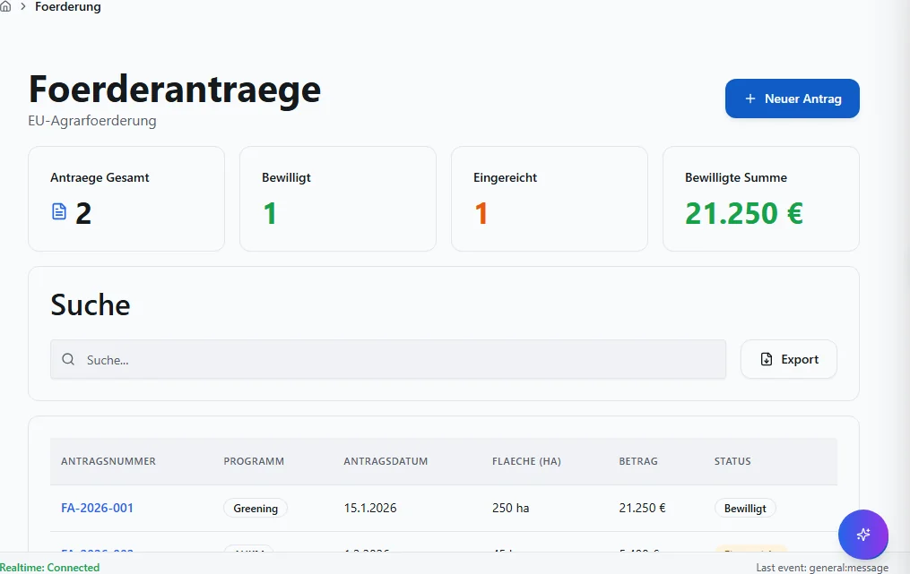

**Schritte:**

1. Sidebar oder Suche: **Foerderung** öffnen (`/foerderung`).
2. Filter und Spalten nach Bedarf setzen; bei ListReport Zeilen per Doppelklick oder Aktion öffnen.
3. Bei Belegen: Kopfdaten prüfen, Positionen erfassen oder ändern, **Speichern** bzw. workflowgebundene Aktion (Freigabe, Folgebeleg) ausführen.
4. Ergebnis in Liste, Detailansicht oder Folgebeleg verifizieren; bei Fehlern Meldungstext und Status prüfen.

**Ergebnis:** Datensatz gespeichert, Liste aktualisiert oder Folgeprozess ausgelöst.

**Häufige Fehler:**

| Symptom | Ursache | Maßnahme |
|---------|---------|----------|
| Maske lädt nicht | Modul nicht freigeschaltet oder fehlende Berechtigung | Administrator: Modul/RBAC prüfen |
| Speichern fehlgeschlagen | Pflichtfeld, Status oder Validierung | Meldung lesen, Pflichtfelder ergänzen |
| Aktion ausgegraut | Workflow-Status oder Sperre | Vorbeleg freigeben oder Berechtigung klären |

### Antrag

**Route:** `/foerderung/antrag` · **Modul:** `@/pages/foerderung/antrag`

**Ziel:** Antrag in VALEO NeuroERP öffnen, Daten prüfen oder erfassen und das Ergebnis in Liste bzw. Folgebeleg kontrollieren.

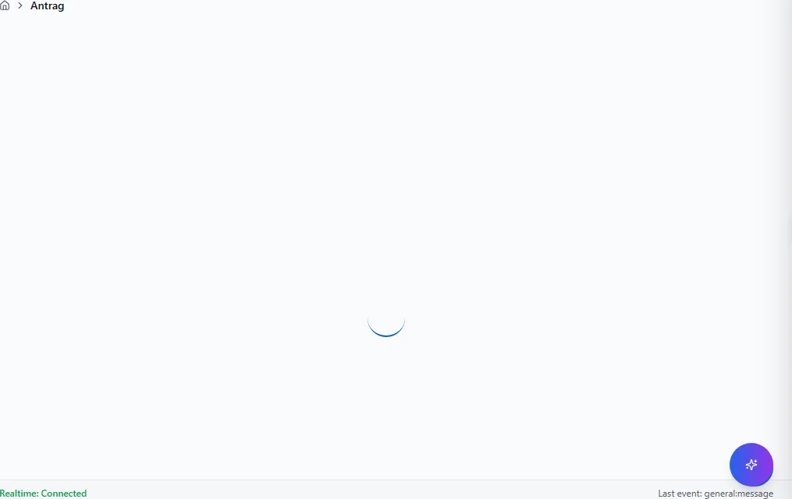

**Schritte:**

1. Sidebar oder Suche: **Antrag** öffnen (`/foerderung/antrag`).
2. Filter und Spalten nach Bedarf setzen; bei ListReport Zeilen per Doppelklick oder Aktion öffnen.
3. Bei Belegen: Kopfdaten prüfen, Positionen erfassen oder ändern, **Speichern** bzw. workflowgebundene Aktion (Freigabe, Folgebeleg) ausführen.
4. Ergebnis in Liste, Detailansicht oder Folgebeleg verifizieren; bei Fehlern Meldungstext und Status prüfen.

**Ergebnis:** Datensatz gespeichert, Liste aktualisiert oder Folgeprozess ausgelöst.

**Häufige Fehler:**

| Symptom | Ursache | Maßnahme |
|---------|---------|----------|
| Maske lädt nicht | Modul nicht freigeschaltet oder fehlende Berechtigung | Administrator: Modul/RBAC prüfen |
| Speichern fehlgeschlagen | Pflichtfeld, Status oder Validierung | Meldung lesen, Pflichtfelder ergänzen |
| Aktion ausgegraut | Workflow-Status oder Sperre | Vorbeleg freigeben oder Berechtigung klären |

### :Id

**Route:** `/foerderung/antrag/:id` · **Modul:** `@/pages/foerderung/antrag`

**Ziel:** :Id in VALEO NeuroERP öffnen, Daten prüfen oder erfassen und das Ergebnis in Liste bzw. Folgebeleg kontrollieren.

**Schritte:**

1. Sidebar oder Suche: **:Id** öffnen (`/foerderung/antrag/:id`).
2. Filter und Spalten nach Bedarf setzen; bei ListReport Zeilen per Doppelklick oder Aktion öffnen.
3. Bei Belegen: Kopfdaten prüfen, Positionen erfassen oder ändern, **Speichern** bzw. workflowgebundene Aktion (Freigabe, Folgebeleg) ausführen.
4. Ergebnis in Liste, Detailansicht oder Folgebeleg verifizieren; bei Fehlern Meldungstext und Status prüfen.

**Ergebnis:** Datensatz gespeichert, Liste aktualisiert oder Folgeprozess ausgelöst.

**Häufige Fehler:**

| Symptom | Ursache | Maßnahme |
|---------|---------|----------|
| Maske lädt nicht | Modul nicht freigeschaltet oder fehlende Berechtigung | Administrator: Modul/RBAC prüfen |
| Speichern fehlgeschlagen | Pflichtfeld, Status oder Validierung | Meldung lesen, Pflichtfelder ergänzen |
| Aktion ausgegraut | Workflow-Status oder Sperre | Vorbeleg freigeben oder Berechtigung klären |

### Liste

**Route:** `/foerderung/liste` · **Modul:** `@/pages/foerderung/liste`

**Ziel:** Liste in VALEO NeuroERP öffnen, Daten prüfen oder erfassen und das Ergebnis in Liste bzw. Folgebeleg kontrollieren.

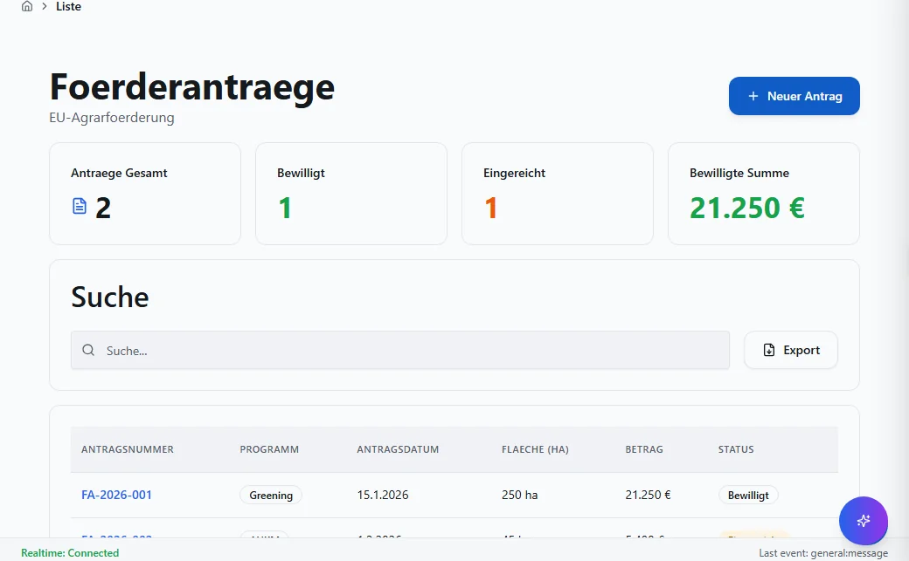

**Schritte:**

1. Sidebar oder Suche: **Liste** öffnen (`/foerderung/liste`).
2. Filter und Spalten nach Bedarf setzen; bei ListReport Zeilen per Doppelklick oder Aktion öffnen.
3. Bei Belegen: Kopfdaten prüfen, Positionen erfassen oder ändern, **Speichern** bzw. workflowgebundene Aktion (Freigabe, Folgebeleg) ausführen.
4. Ergebnis in Liste, Detailansicht oder Folgebeleg verifizieren; bei Fehlern Meldungstext und Status prüfen.

**Ergebnis:** Datensatz gespeichert, Liste aktualisiert oder Folgeprozess ausgelöst.

**Häufige Fehler:**

| Symptom | Ursache | Maßnahme |
|---------|---------|----------|
| Maske lädt nicht | Modul nicht freigeschaltet oder fehlende Berechtigung | Administrator: Modul/RBAC prüfen |
| Speichern fehlgeschlagen | Pflichtfeld, Status oder Validierung | Meldung lesen, Pflichtfelder ergänzen |
| Aktion ausgegraut | Workflow-Status oder Sperre | Vorbeleg freigeben oder Berechtigung klären |

### Biodiversitaet

**Route:** `/nachhaltigkeit/biodiversitaet` · **Modul:** `@/pages/nachhaltigkeit/biodiversitaet`

**Ziel:** Biodiversitaet in VALEO NeuroERP öffnen, Daten prüfen oder erfassen und das Ergebnis in Liste bzw. Folgebeleg kontrollieren.

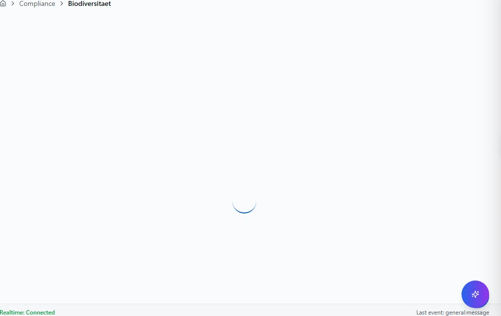

**Schritte:**

1. Sidebar oder Suche: **Biodiversitaet** öffnen (`/nachhaltigkeit/biodiversitaet`).
2. Filter und Spalten nach Bedarf setzen; bei ListReport Zeilen per Doppelklick oder Aktion öffnen.
3. Bei Belegen: Kopfdaten prüfen, Positionen erfassen oder ändern, **Speichern** bzw. workflowgebundene Aktion (Freigabe, Folgebeleg) ausführen.
4. Ergebnis in Liste, Detailansicht oder Folgebeleg verifizieren; bei Fehlern Meldungstext und Status prüfen.

**Ergebnis:** Datensatz gespeichert, Liste aktualisiert oder Folgeprozess ausgelöst.

**Häufige Fehler:**

| Symptom | Ursache | Maßnahme |
|---------|---------|----------|
| Maske lädt nicht | Modul nicht freigeschaltet oder fehlende Berechtigung | Administrator: Modul/RBAC prüfen |
| Speichern fehlgeschlagen | Pflichtfeld, Status oder Validierung | Meldung lesen, Pflichtfelder ergänzen |
| Aktion ausgegraut | Workflow-Status oder Sperre | Vorbeleg freigeben oder Berechtigung klären |

### Co2 Bilanz

**Route:** `/nachhaltigkeit/co2-bilanz` · **Modul:** `@/pages/nachhaltigkeit/co2-bilanz`

**Ziel:** Co2 Bilanz in VALEO NeuroERP öffnen, Daten prüfen oder erfassen und das Ergebnis in Liste bzw. Folgebeleg kontrollieren.

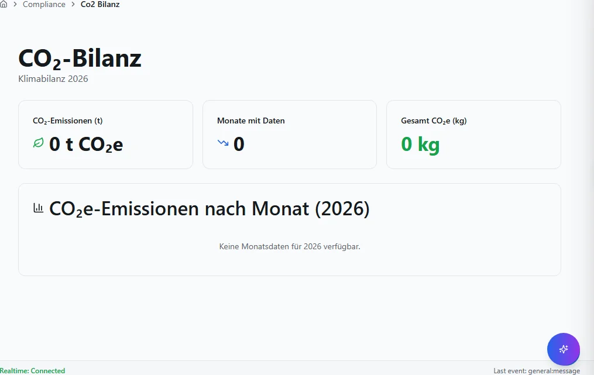

**Schritte:**

1. Sidebar oder Suche: **Co2 Bilanz** öffnen (`/nachhaltigkeit/co2-bilanz`).
2. Filter und Spalten nach Bedarf setzen; bei ListReport Zeilen per Doppelklick oder Aktion öffnen.
3. Bei Belegen: Kopfdaten prüfen, Positionen erfassen oder ändern, **Speichern** bzw. workflowgebundene Aktion (Freigabe, Folgebeleg) ausführen.
4. Ergebnis in Liste, Detailansicht oder Folgebeleg verifizieren; bei Fehlern Meldungstext und Status prüfen.

**Ergebnis:** Datensatz gespeichert, Liste aktualisiert oder Folgeprozess ausgelöst.

**Häufige Fehler:**

| Symptom | Ursache | Maßnahme |
|---------|---------|----------|
| Maske lädt nicht | Modul nicht freigeschaltet oder fehlende Berechtigung | Administrator: Modul/RBAC prüfen |
| Speichern fehlgeschlagen | Pflichtfeld, Status oder Validierung | Meldung lesen, Pflichtfelder ergänzen |
| Aktion ausgegraut | Workflow-Status oder Sperre | Vorbeleg freigeben oder Berechtigung klären |

### Esg Report

**Route:** `/nachhaltigkeit/esg-report` · **Modul:** `@/pages/nachhaltigkeit/esg-report`

**Ziel:** Esg Report in VALEO NeuroERP öffnen, Daten prüfen oder erfassen und das Ergebnis in Liste bzw. Folgebeleg kontrollieren.

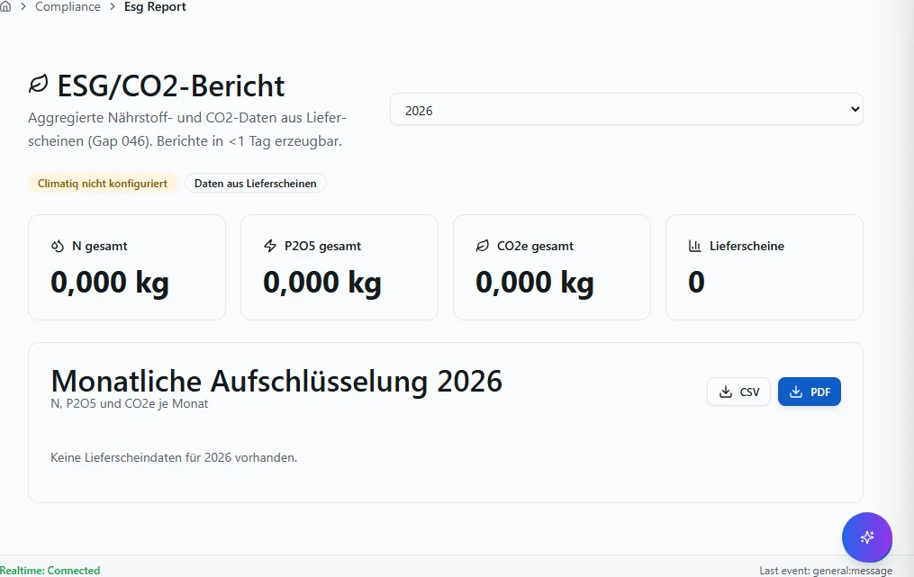

**Schritte:**

1. Sidebar oder Suche: **Esg Report** öffnen (`/nachhaltigkeit/esg-report`).
2. Filter und Spalten nach Bedarf setzen; bei ListReport Zeilen per Doppelklick oder Aktion öffnen.
3. Bei Belegen: Kopfdaten prüfen, Positionen erfassen oder ändern, **Speichern** bzw. workflowgebundene Aktion (Freigabe, Folgebeleg) ausführen.
4. Ergebnis in Liste, Detailansicht oder Folgebeleg verifizieren; bei Fehlern Meldungstext und Status prüfen.

**Ergebnis:** Datensatz gespeichert, Liste aktualisiert oder Folgeprozess ausgelöst.

**Häufige Fehler:**

| Symptom | Ursache | Maßnahme |
|---------|---------|----------|
| Maske lädt nicht | Modul nicht freigeschaltet oder fehlende Berechtigung | Administrator: Modul/RBAC prüfen |
| Speichern fehlgeschlagen | Pflichtfeld, Status oder Validierung | Meldung lesen, Pflichtfelder ergänzen |
| Aktion ausgegraut | Workflow-Status oder Sperre | Vorbeleg freigeben oder Berechtigung klären |

### Eudr Compliance

**Route:** `/nachhaltigkeit/eudr-compliance` · **Modul:** `@/pages/nachhaltigkeit/eudr-compliance`

**Ziel:** Eudr Compliance in VALEO NeuroERP öffnen, Daten prüfen oder erfassen und das Ergebnis in Liste bzw. Folgebeleg kontrollieren.

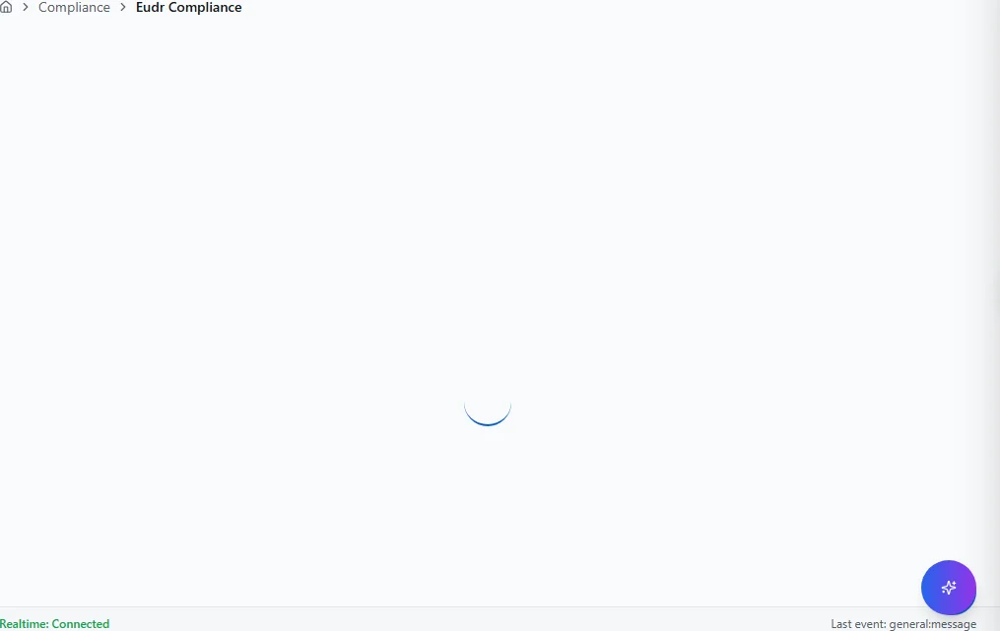

**Schritte:**

1. Sidebar oder Suche: **Eudr Compliance** öffnen (`/nachhaltigkeit/eudr-compliance`).
2. Filter und Spalten nach Bedarf setzen; bei ListReport Zeilen per Doppelklick oder Aktion öffnen.
3. Bei Belegen: Kopfdaten prüfen, Positionen erfassen oder ändern, **Speichern** bzw. workflowgebundene Aktion (Freigabe, Folgebeleg) ausführen.
4. Ergebnis in Liste, Detailansicht oder Folgebeleg verifizieren; bei Fehlern Meldungstext und Status prüfen.

**Ergebnis:** Datensatz gespeichert, Liste aktualisiert oder Folgeprozess ausgelöst.

**Häufige Fehler:**

| Symptom | Ursache | Maßnahme |
|---------|---------|----------|
| Maske lädt nicht | Modul nicht freigeschaltet oder fehlende Berechtigung | Administrator: Modul/RBAC prüfen |
| Speichern fehlgeschlagen | Pflichtfeld, Status oder Validierung | Meldung lesen, Pflichtfelder ergänzen |
| Aktion ausgegraut | Workflow-Status oder Sperre | Vorbeleg freigeben oder Berechtigung klären |

### Dashboard

**Route:** `/subventionen/dashboard` · **Modul:** `@/pages/subventionen/dashboard`

**Ziel:** Dashboard in VALEO NeuroERP öffnen, Daten prüfen oder erfassen und das Ergebnis in Liste bzw. Folgebeleg kontrollieren.

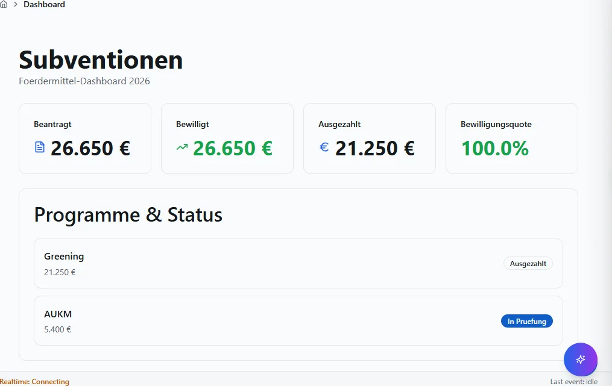

**Schritte:**

1. Sidebar oder Suche: **Dashboard** öffnen (`/subventionen/dashboard`).
2. Filter und Spalten nach Bedarf setzen; bei ListReport Zeilen per Doppelklick oder Aktion öffnen.
3. Bei Belegen: Kopfdaten prüfen, Positionen erfassen oder ändern, **Speichern** bzw. workflowgebundene Aktion (Freigabe, Folgebeleg) ausführen.
4. Ergebnis in Liste, Detailansicht oder Folgebeleg verifizieren; bei Fehlern Meldungstext und Status prüfen.

**Ergebnis:** Datensatz gespeichert, Liste aktualisiert oder Folgeprozess ausgelöst.

**Häufige Fehler:**

| Symptom | Ursache | Maßnahme |
|---------|---------|----------|
| Maske lädt nicht | Modul nicht freigeschaltet oder fehlende Berechtigung | Administrator: Modul/RBAC prüfen |
| Speichern fehlgeschlagen | Pflichtfeld, Status oder Validierung | Meldung lesen, Pflichtfelder ergänzen |
| Aktion ausgegraut | Workflow-Status oder Sperre | Vorbeleg freigeben oder Berechtigung klären |

### Zertifikate

**Route:** `/zertifikate` · **Modul:** `@/pages/zertifikate/liste`

**Ziel:** Zertifikate in VALEO NeuroERP öffnen, Daten prüfen oder erfassen und das Ergebnis in Liste bzw. Folgebeleg kontrollieren.

**Schritte:**

1. Sidebar oder Suche: **Zertifikate** öffnen (`/zertifikate`).
2. Filter und Spalten nach Bedarf setzen; bei ListReport Zeilen per Doppelklick oder Aktion öffnen.
3. Bei Belegen: Kopfdaten prüfen, Positionen erfassen oder ändern, **Speichern** bzw. workflowgebundene Aktion (Freigabe, Folgebeleg) ausführen.
4. Ergebnis in Liste, Detailansicht oder Folgebeleg verifizieren; bei Fehlern Meldungstext und Status prüfen.

**Ergebnis:** Datensatz gespeichert, Liste aktualisiert oder Folgeprozess ausgelöst.

**Häufige Fehler:**

| Symptom | Ursache | Maßnahme |
|---------|---------|----------|
| Maske lädt nicht | Modul nicht freigeschaltet oder fehlende Berechtigung | Administrator: Modul/RBAC prüfen |
| Speichern fehlgeschlagen | Pflichtfeld, Status oder Validierung | Meldung lesen, Pflichtfelder ergänzen |
| Aktion ausgegraut | Workflow-Status oder Sperre | Vorbeleg freigeben oder Berechtigung klären |

### :Id

**Route:** `/zertifikate/:id` · **Modul:** `@/pages/zertifikate/liste`

**Ziel:** :Id in VALEO NeuroERP öffnen, Daten prüfen oder erfassen und das Ergebnis in Liste bzw. Folgebeleg kontrollieren.

**Schritte:**

1. Sidebar oder Suche: **:Id** öffnen (`/zertifikate/:id`).
2. Filter und Spalten nach Bedarf setzen; bei ListReport Zeilen per Doppelklick oder Aktion öffnen.
3. Bei Belegen: Kopfdaten prüfen, Positionen erfassen oder ändern, **Speichern** bzw. workflowgebundene Aktion (Freigabe, Folgebeleg) ausführen.
4. Ergebnis in Liste, Detailansicht oder Folgebeleg verifizieren; bei Fehlern Meldungstext und Status prüfen.

**Ergebnis:** Datensatz gespeichert, Liste aktualisiert oder Folgeprozess ausgelöst.

**Häufige Fehler:**

| Symptom | Ursache | Maßnahme |
|---------|---------|----------|
| Maske lädt nicht | Modul nicht freigeschaltet oder fehlende Berechtigung | Administrator: Modul/RBAC prüfen |
| Speichern fehlgeschlagen | Pflichtfeld, Status oder Validierung | Meldung lesen, Pflichtfelder ergänzen |
| Aktion ausgegraut | Workflow-Status oder Sperre | Vorbeleg freigeben oder Berechtigung klären |

### Liste

**Route:** `/zertifikate/liste` · **Modul:** `@/pages/zertifikate/liste`

**Ziel:** Liste in VALEO NeuroERP öffnen, Daten prüfen oder erfassen und das Ergebnis in Liste bzw. Folgebeleg kontrollieren.

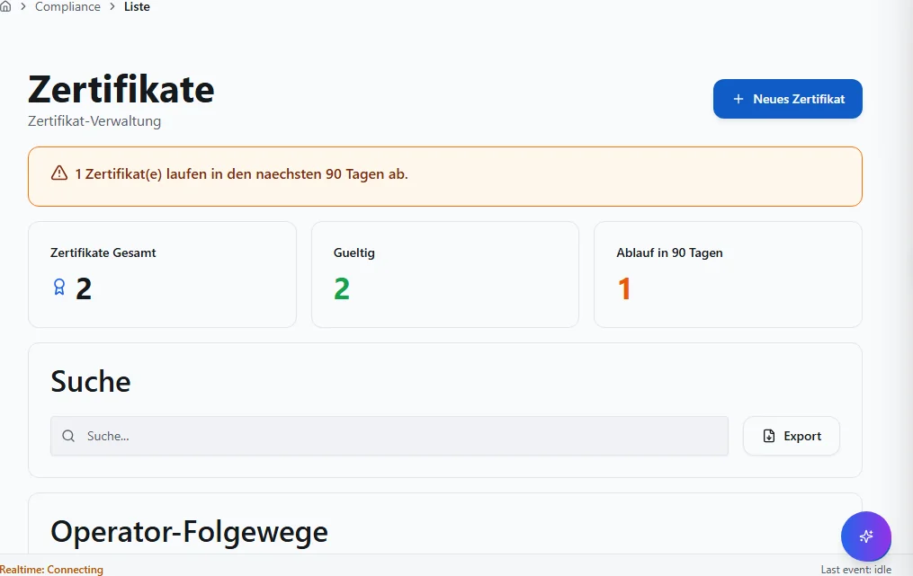

**Schritte:**

1. Sidebar oder Suche: **Liste** öffnen (`/zertifikate/liste`).
2. Filter und Spalten nach Bedarf setzen; bei ListReport Zeilen per Doppelklick oder Aktion öffnen.
3. Bei Belegen: Kopfdaten prüfen, Positionen erfassen oder ändern, **Speichern** bzw. workflowgebundene Aktion (Freigabe, Folgebeleg) ausführen.
4. Ergebnis in Liste, Detailansicht oder Folgebeleg verifizieren; bei Fehlern Meldungstext und Status prüfen.

**Ergebnis:** Datensatz gespeichert, Liste aktualisiert oder Folgeprozess ausgelöst.

**Häufige Fehler:**

| Symptom | Ursache | Maßnahme |
|---------|---------|----------|
| Maske lädt nicht | Modul nicht freigeschaltet oder fehlende Berechtigung | Administrator: Modul/RBAC prüfen |
| Speichern fehlgeschlagen | Pflichtfeld, Status oder Validierung | Meldung lesen, Pflichtfelder ergänzen |
| Aktion ausgegraut | Workflow-Status oder Sperre | Vorbeleg freigeben oder Berechtigung klären |

### Neu

**Route:** `/zertifikate/neu` · **Modul:** `@/pages/zertifikate/liste`

**Ziel:** Neu in VALEO NeuroERP öffnen, Daten prüfen oder erfassen und das Ergebnis in Liste bzw. Folgebeleg kontrollieren.

**Schritte:**

1. Sidebar oder Suche: **Neu** öffnen (`/zertifikate/neu`).
2. Filter und Spalten nach Bedarf setzen; bei ListReport Zeilen per Doppelklick oder Aktion öffnen.
3. Bei Belegen: Kopfdaten prüfen, Positionen erfassen oder ändern, **Speichern** bzw. workflowgebundene Aktion (Freigabe, Folgebeleg) ausführen.
4. Ergebnis in Liste, Detailansicht oder Folgebeleg verifizieren; bei Fehlern Meldungstext und Status prüfen.

**Ergebnis:** Datensatz gespeichert, Liste aktualisiert oder Folgeprozess ausgelöst.

**Häufige Fehler:**

| Symptom | Ursache | Maßnahme |
|---------|---------|----------|
| Maske lädt nicht | Modul nicht freigeschaltet oder fehlende Berechtigung | Administrator: Modul/RBAC prüfen |
| Speichern fehlgeschlagen | Pflichtfeld, Status oder Validierung | Meldung lesen, Pflichtfelder ergänzen |
| Aktion ausgegraut | Workflow-Status oder Sperre | Vorbeleg freigeben oder Berechtigung klären |

## Quellen und Reverse-Pflege

- `packages/frontend-web/src/app/navigation/domains/*.tsx` — Sidebar-Navigation.
- `packages/frontend-web/src/app/routing/route-inventory.gen.json` — Routen-Inventar.
- `docs/MASKEN.md` — Layout-Standard (Gewohnheits-Prinzip).

Reverse-Pflege: Bei neuen Routen Generator `scripts/generate_benutzerhandbuch_full.py`
ausführen; `mkdocs.yml`, `index.md` und `generate_inapp_help_map.py` mitziehen.
