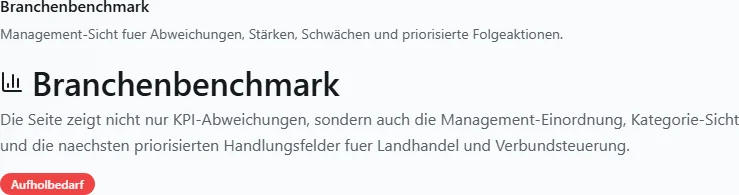
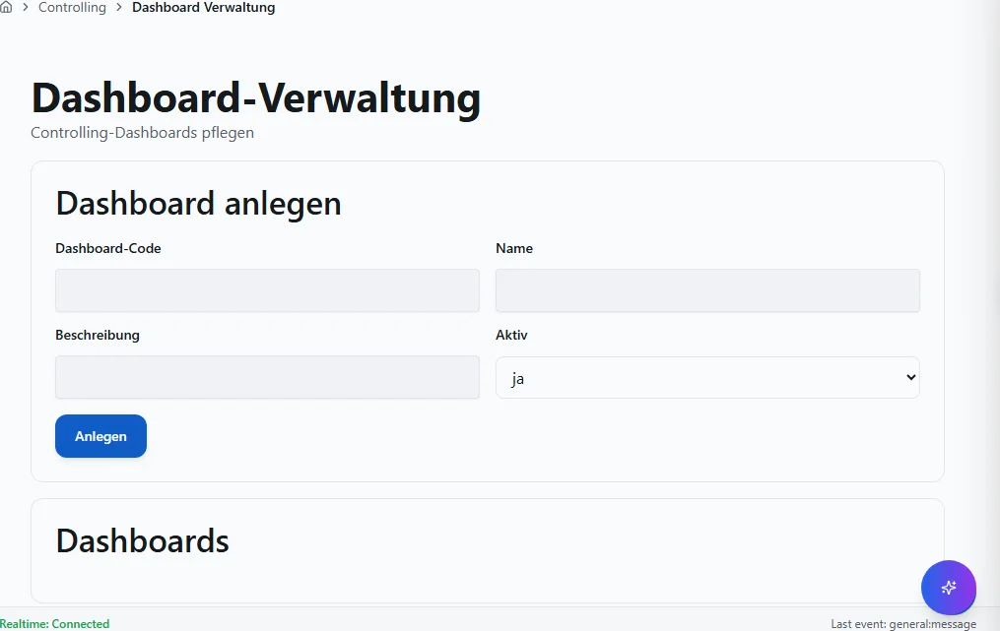
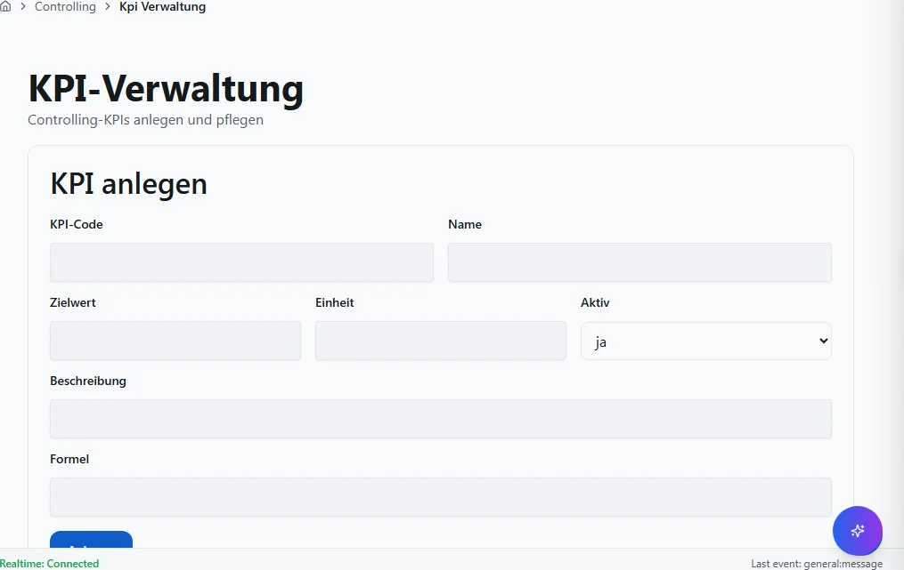
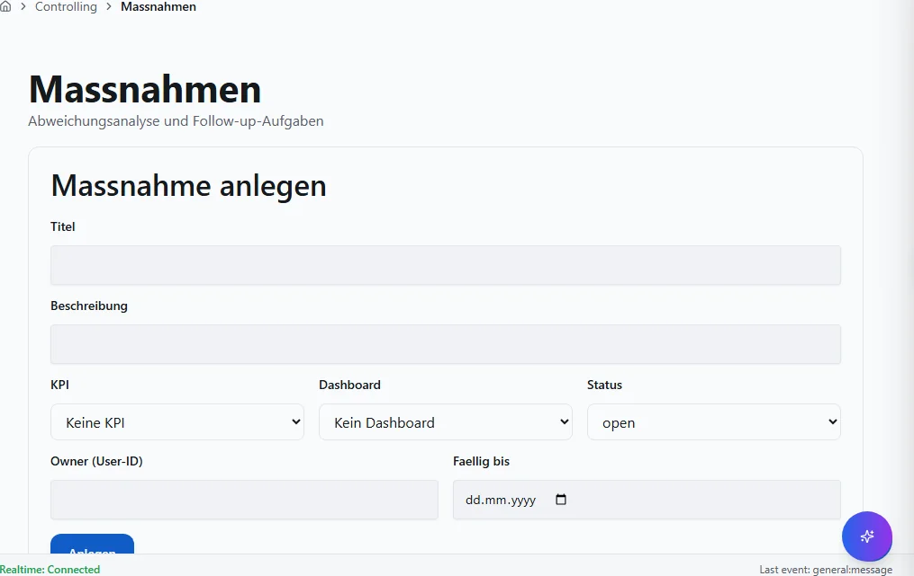
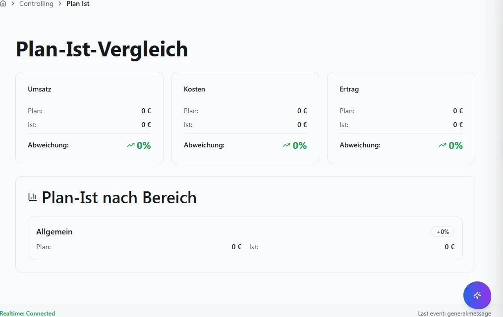
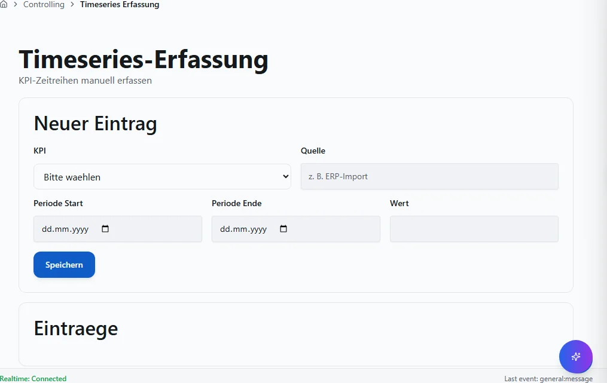
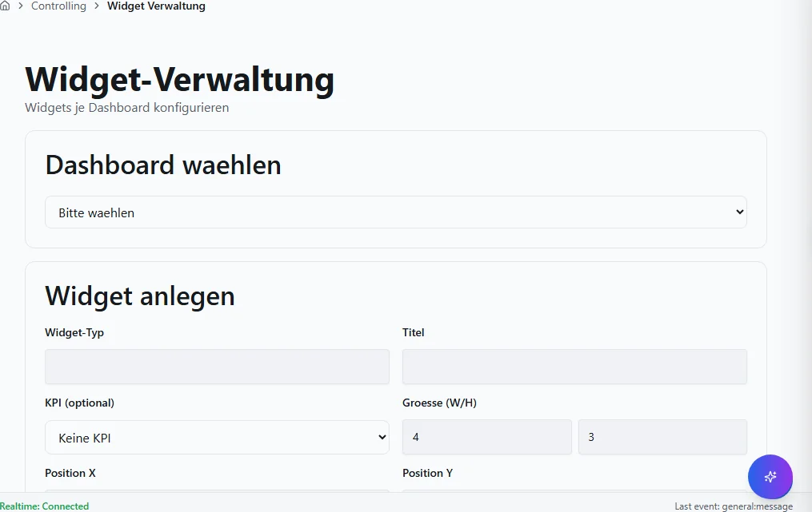

# Controlling und Kostenrechnung

Kostenstellen, Umlagen, Auswertungen.

## Ziel

Sie arbeiten sicher in allen Masken des Bereichs **Controlling und Kostenrechnung** — von der Navigation
bis zu Speichern, Freigabe und Folgebelegen.

## Voraussetzungen

- Gültige Anmeldung und Mandant (`X-Tenant-ID`).
- Modul für diesen Fachbereich ist installiert (siehe Administration → Module).
- Ihre Rolle hat Lese- bzw. Schreibberechtigung für die jeweilige Maske.

## Maskenregister

Vollständige Abdeckung: **7** App-Routen
(0 explizit in der Sidebar-Navigation).

| Maske | Route | Modul |
|-------|-------|-------|
| Benchmark Cockpit | `/controlling/benchmark-cockpit` | `@/pages/controlling/benchmark-cockpit` |
| Dashboard Verwaltung | `/controlling/dashboard-verwaltung` | `@/pages/controlling/dashboard-verwaltung` |
| Kpi Verwaltung | `/controlling/kpi-verwaltung` | `@/pages/controlling/kpi-verwaltung` |
| Massnahmen | `/controlling/massnahmen` | `@/pages/controlling/massnahmen` |
| Plan Ist | `/controlling/plan-ist` | `@/pages/controlling/plan-ist` |
| Timeseries Erfassung | `/controlling/timeseries-erfassung` | `@/pages/controlling/timeseries-erfassung` |
| Widget Verwaltung | `/controlling/widget-verwaltung` | `@/pages/controlling/widget-verwaltung` |

## Masken im Detail

Für jede Route: Navigation, Bearbeitung, Ergebnis und typische Fehler.

### Benchmark Cockpit

**Route:** `/controlling/benchmark-cockpit` · **Modul:** `@/pages/controlling/benchmark-cockpit`

**Ziel:** Benchmark Cockpit in VALEO NeuroERP öffnen, Daten prüfen oder erfassen und das Ergebnis in Liste bzw. Folgebeleg kontrollieren.

**Schritte:**

1. Sidebar oder Suche: **Benchmark Cockpit** öffnen (`/controlling/benchmark-cockpit`).
2. Filter und Spalten nach Bedarf setzen; bei ListReport Zeilen per Doppelklick oder Aktion öffnen.
3. Bei Belegen: Kopfdaten prüfen, Positionen erfassen oder ändern, **Speichern** bzw. workflowgebundene Aktion (Freigabe, Folgebeleg) ausführen.
4. Ergebnis in Liste, Detailansicht oder Folgebeleg verifizieren; bei Fehlern Meldungstext und Status prüfen.

**Ergebnis:** Datensatz gespeichert, Liste aktualisiert oder Folgeprozess ausgelöst.

**Häufige Fehler:**

| Symptom | Ursache | Maßnahme |
|---------|---------|----------|
| Maske lädt nicht | Modul nicht freigeschaltet oder fehlende Berechtigung | Administrator: Modul/RBAC prüfen |
| Speichern fehlgeschlagen | Pflichtfeld, Status oder Validierung | Meldung lesen, Pflichtfelder ergänzen |
| Aktion ausgegraut | Workflow-Status oder Sperre | Vorbeleg freigeben oder Berechtigung klären |

### Dashboard Verwaltung

**Route:** `/controlling/dashboard-verwaltung` · **Modul:** `@/pages/controlling/dashboard-verwaltung`

**Ziel:** Dashboard Verwaltung in VALEO NeuroERP öffnen, Daten prüfen oder erfassen und das Ergebnis in Liste bzw. Folgebeleg kontrollieren.

**Schritte:**

1. Sidebar oder Suche: **Dashboard Verwaltung** öffnen (`/controlling/dashboard-verwaltung`).
2. Filter und Spalten nach Bedarf setzen; bei ListReport Zeilen per Doppelklick oder Aktion öffnen.
3. Bei Belegen: Kopfdaten prüfen, Positionen erfassen oder ändern, **Speichern** bzw. workflowgebundene Aktion (Freigabe, Folgebeleg) ausführen.
4. Ergebnis in Liste, Detailansicht oder Folgebeleg verifizieren; bei Fehlern Meldungstext und Status prüfen.

**Ergebnis:** Datensatz gespeichert, Liste aktualisiert oder Folgeprozess ausgelöst.

**Häufige Fehler:**

| Symptom | Ursache | Maßnahme |
|---------|---------|----------|
| Maske lädt nicht | Modul nicht freigeschaltet oder fehlende Berechtigung | Administrator: Modul/RBAC prüfen |
| Speichern fehlgeschlagen | Pflichtfeld, Status oder Validierung | Meldung lesen, Pflichtfelder ergänzen |
| Aktion ausgegraut | Workflow-Status oder Sperre | Vorbeleg freigeben oder Berechtigung klären |

### Kpi Verwaltung

**Route:** `/controlling/kpi-verwaltung` · **Modul:** `@/pages/controlling/kpi-verwaltung`

**Ziel:** Kpi Verwaltung in VALEO NeuroERP öffnen, Daten prüfen oder erfassen und das Ergebnis in Liste bzw. Folgebeleg kontrollieren.

**Schritte:**

1. Sidebar oder Suche: **Kpi Verwaltung** öffnen (`/controlling/kpi-verwaltung`).
2. Filter und Spalten nach Bedarf setzen; bei ListReport Zeilen per Doppelklick oder Aktion öffnen.
3. Bei Belegen: Kopfdaten prüfen, Positionen erfassen oder ändern, **Speichern** bzw. workflowgebundene Aktion (Freigabe, Folgebeleg) ausführen.
4. Ergebnis in Liste, Detailansicht oder Folgebeleg verifizieren; bei Fehlern Meldungstext und Status prüfen.

**Ergebnis:** Datensatz gespeichert, Liste aktualisiert oder Folgeprozess ausgelöst.

**Häufige Fehler:**

| Symptom | Ursache | Maßnahme |
|---------|---------|----------|
| Maske lädt nicht | Modul nicht freigeschaltet oder fehlende Berechtigung | Administrator: Modul/RBAC prüfen |
| Speichern fehlgeschlagen | Pflichtfeld, Status oder Validierung | Meldung lesen, Pflichtfelder ergänzen |
| Aktion ausgegraut | Workflow-Status oder Sperre | Vorbeleg freigeben oder Berechtigung klären |

### Massnahmen

**Route:** `/controlling/massnahmen` · **Modul:** `@/pages/controlling/massnahmen`

**Ziel:** Massnahmen in VALEO NeuroERP öffnen, Daten prüfen oder erfassen und das Ergebnis in Liste bzw. Folgebeleg kontrollieren.

**Schritte:**

1. Sidebar oder Suche: **Massnahmen** öffnen (`/controlling/massnahmen`).
2. Filter und Spalten nach Bedarf setzen; bei ListReport Zeilen per Doppelklick oder Aktion öffnen.
3. Bei Belegen: Kopfdaten prüfen, Positionen erfassen oder ändern, **Speichern** bzw. workflowgebundene Aktion (Freigabe, Folgebeleg) ausführen.
4. Ergebnis in Liste, Detailansicht oder Folgebeleg verifizieren; bei Fehlern Meldungstext und Status prüfen.

**Ergebnis:** Datensatz gespeichert, Liste aktualisiert oder Folgeprozess ausgelöst.

**Häufige Fehler:**

| Symptom | Ursache | Maßnahme |
|---------|---------|----------|
| Maske lädt nicht | Modul nicht freigeschaltet oder fehlende Berechtigung | Administrator: Modul/RBAC prüfen |
| Speichern fehlgeschlagen | Pflichtfeld, Status oder Validierung | Meldung lesen, Pflichtfelder ergänzen |
| Aktion ausgegraut | Workflow-Status oder Sperre | Vorbeleg freigeben oder Berechtigung klären |

### Plan Ist

**Route:** `/controlling/plan-ist` · **Modul:** `@/pages/controlling/plan-ist`

**Ziel:** Plan Ist in VALEO NeuroERP öffnen, Daten prüfen oder erfassen und das Ergebnis in Liste bzw. Folgebeleg kontrollieren.

**Schritte:**

1. Sidebar oder Suche: **Plan Ist** öffnen (`/controlling/plan-ist`).
2. Filter und Spalten nach Bedarf setzen; bei ListReport Zeilen per Doppelklick oder Aktion öffnen.
3. Bei Belegen: Kopfdaten prüfen, Positionen erfassen oder ändern, **Speichern** bzw. workflowgebundene Aktion (Freigabe, Folgebeleg) ausführen.
4. Ergebnis in Liste, Detailansicht oder Folgebeleg verifizieren; bei Fehlern Meldungstext und Status prüfen.

**Ergebnis:** Datensatz gespeichert, Liste aktualisiert oder Folgeprozess ausgelöst.

**Häufige Fehler:**

| Symptom | Ursache | Maßnahme |
|---------|---------|----------|
| Maske lädt nicht | Modul nicht freigeschaltet oder fehlende Berechtigung | Administrator: Modul/RBAC prüfen |
| Speichern fehlgeschlagen | Pflichtfeld, Status oder Validierung | Meldung lesen, Pflichtfelder ergänzen |
| Aktion ausgegraut | Workflow-Status oder Sperre | Vorbeleg freigeben oder Berechtigung klären |

### Timeseries Erfassung

**Route:** `/controlling/timeseries-erfassung` · **Modul:** `@/pages/controlling/timeseries-erfassung`

**Ziel:** Timeseries Erfassung in VALEO NeuroERP öffnen, Daten prüfen oder erfassen und das Ergebnis in Liste bzw. Folgebeleg kontrollieren.

**Schritte:**

1. Sidebar oder Suche: **Timeseries Erfassung** öffnen (`/controlling/timeseries-erfassung`).
2. Filter und Spalten nach Bedarf setzen; bei ListReport Zeilen per Doppelklick oder Aktion öffnen.
3. Bei Belegen: Kopfdaten prüfen, Positionen erfassen oder ändern, **Speichern** bzw. workflowgebundene Aktion (Freigabe, Folgebeleg) ausführen.
4. Ergebnis in Liste, Detailansicht oder Folgebeleg verifizieren; bei Fehlern Meldungstext und Status prüfen.

**Ergebnis:** Datensatz gespeichert, Liste aktualisiert oder Folgeprozess ausgelöst.

**Häufige Fehler:**

| Symptom | Ursache | Maßnahme |
|---------|---------|----------|
| Maske lädt nicht | Modul nicht freigeschaltet oder fehlende Berechtigung | Administrator: Modul/RBAC prüfen |
| Speichern fehlgeschlagen | Pflichtfeld, Status oder Validierung | Meldung lesen, Pflichtfelder ergänzen |
| Aktion ausgegraut | Workflow-Status oder Sperre | Vorbeleg freigeben oder Berechtigung klären |

### Widget Verwaltung

**Route:** `/controlling/widget-verwaltung` · **Modul:** `@/pages/controlling/widget-verwaltung`

**Ziel:** Widget Verwaltung in VALEO NeuroERP öffnen, Daten prüfen oder erfassen und das Ergebnis in Liste bzw. Folgebeleg kontrollieren.

**Schritte:**

1. Sidebar oder Suche: **Widget Verwaltung** öffnen (`/controlling/widget-verwaltung`).
2. Filter und Spalten nach Bedarf setzen; bei ListReport Zeilen per Doppelklick oder Aktion öffnen.
3. Bei Belegen: Kopfdaten prüfen, Positionen erfassen oder ändern, **Speichern** bzw. workflowgebundene Aktion (Freigabe, Folgebeleg) ausführen.
4. Ergebnis in Liste, Detailansicht oder Folgebeleg verifizieren; bei Fehlern Meldungstext und Status prüfen.

**Ergebnis:** Datensatz gespeichert, Liste aktualisiert oder Folgeprozess ausgelöst.

**Häufige Fehler:**

| Symptom | Ursache | Maßnahme |
|---------|---------|----------|
| Maske lädt nicht | Modul nicht freigeschaltet oder fehlende Berechtigung | Administrator: Modul/RBAC prüfen |
| Speichern fehlgeschlagen | Pflichtfeld, Status oder Validierung | Meldung lesen, Pflichtfelder ergänzen |
| Aktion ausgegraut | Workflow-Status oder Sperre | Vorbeleg freigeben oder Berechtigung klären |

## Quellen und Reverse-Pflege

- `packages/frontend-web/src/app/navigation/domains/*.tsx` — Sidebar-Navigation.
- `packages/frontend-web/src/app/routing/route-inventory.gen.json` — Routen-Inventar.
- `docs/MASKEN.md` — Layout-Standard (Gewohnheits-Prinzip).

Reverse-Pflege: Bei neuen Routen Generator `scripts/generate_benutzerhandbuch_full.py`
ausführen; `mkdocs.yml`, `index.md` und `generate_inapp_help_map.py` mitziehen.
