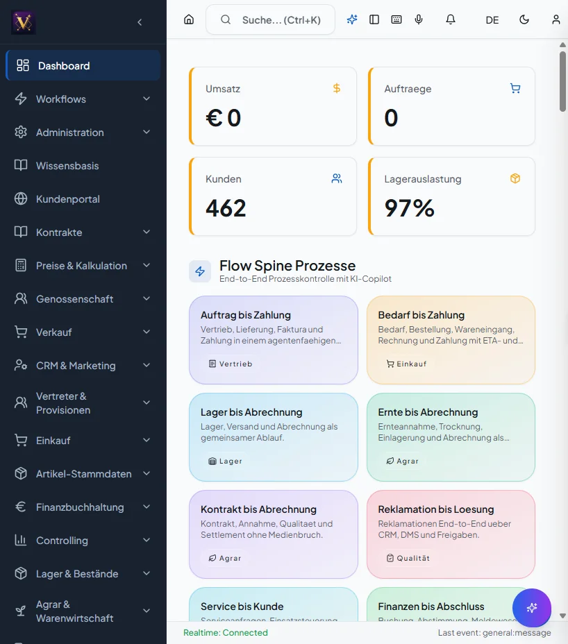

# Benutzerhandbuch

Aufgabenorientierte Anleitungen für die tägliche Arbeit — gegliedert nach
Fachdomäne, nicht nach Menüstruktur. Jede Anleitung folgt dem Muster: Ziel →
Voraussetzungen → Schritte → Ergebnis → häufige Fehler.

## Bereiche

- [**Einstieg**](einstieg.md) — Anmeldung, Mandantenwahl, Navigation, Tastatur.
- [**Annahme**](annahme.md) — LKW-Registrierung, Waage, Qualität, Ernteannahme.
- [**Verkauf**](verkauf.md) — Auftrag → Lieferschein → Rechnung.
- [**Einkauf**](einkauf.md) — Bestellung, Wareneingang, 3-Wege-Match.
- [**Lager**](lager.md) — Bestand, Umlagerung, Inventur, Silo.
- [**Finanzbuchhaltung**](finanzbuchhaltung.md) — Offene Posten, Mahnwesen, Zahlungen.
- [**CRM**](crm.md) — Kontakte, Leads, Aktivitäten.
- [**Glossar**](glossar.md) — Fachbegriffe Landhandel/Agrar.
- [**In-App-Hilfe**](in-app-hilfe.md) — kontextsensitive Deep-Links.

## Screenshots

Screenshots liegen als **WebP** unter `benutzerhandbuch/img/` und werden so
eingebunden:

```markdown

```

**Aufnahme-Verfahren** (lokale Dev-/Docker-Umgebung):

1. Frontend öffnen (Docker: `valeo-neuro-erp-frontend`, Port 3000).
2. Dev-Session aktivieren: Im Browser `localStorage.setItem('access_token','dev-token')`
   setzen und neu laden. Der `AuthService` erzeugt damit einen Mock-Admin und
   umgeht den OIDC-Login (siehe `src/lib/auth.ts`); das Backend akzeptiert den
   Wert aus `API_DEV_TOKEN`.
3. Zielmaske öffnen, **dem ersten Aufruf genügend Zeit geben** (Vite kompiliert
   Lazy-Chunks on-demand — bis ~20 s), dann Screenshot erstellen.
4. Rohbild (PNG) als `img/<bereich>-<maske>.png` ablegen und mit
   `python scripts/compress_screenshots.py` zu WebP komprimieren
   (ersetzt die PNG, ~60–80 % kleiner, Text bleibt scharf).
5. WebP-Bild in der jeweiligen How-to einbinden.

!!! note "Aktueller Stand"
    Die Kern-Masken sind als komprimierte WebP-Screenshots hinterlegt: Dashboard,
    Rohware-Annahme, Auftrags-Erfassung, Einkauf-Bestellungen, Bestandsübersicht,
    Hauptbuch und CRM-Kontakte. Die Aufnahme erfolgte über die Dev-Token-Session
    ohne externen OIDC-Provider.
