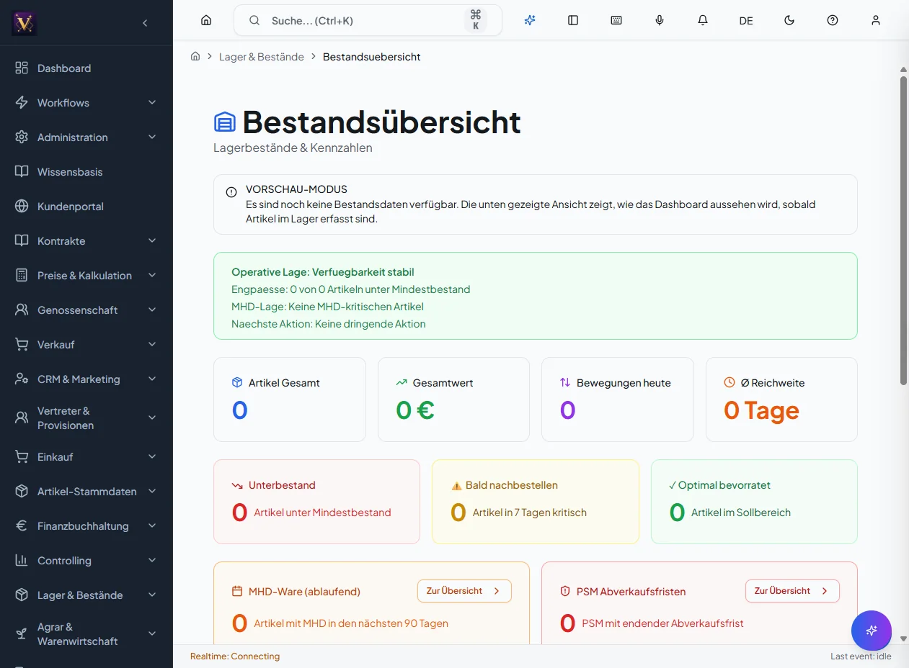

# Lager – Bestand, Umlagerung, Inventur

Verwalten Sie Bestände, Umlagerungen zwischen Silozellen/Lagerorten und führen
Sie Inventuren durch.

## Bestand einsehen

1. Bereich *Lager* → *Bestände*.
2. Nach Artikel, Lagerort oder Silozelle filtern.
3. Detailzeile öffnen für Lots, Mengen und QS-Status.

## Umlagerung buchen

1. *Lager* → *Umlagerung* → *Neu*.
2. Quelle (Silozelle/Lagerort) und Ziel wählen.
3. Menge erfassen; bei Materialwechsel ggf. **Spülcharge** berücksichtigen.
4. **Buchen**. Der Bestand wird umgebucht und als Bewegung protokolliert.

## Inventur durchführen

1. *Lager* → *Inventur* → *Neue Inventur*.
2. Zählbereich (Lagerorte/Zellen) festlegen.
3. Zählmengen erfassen.
4. Differenzen prüfen und **Inventur abschließen** (Buchung der Differenzen).

**Ergebnis:** Bestände sind aktuell, Bewegungen und Differenzen sind
nachvollziehbar dokumentiert.

## Häufige Fehler

- **QS-Sperre verhindert Buchung:** QS-Status der Zelle prüfen/freigeben lassen.
- **Spülpflicht ignoriert:** bei Materialwechsel Spülcharge buchen, sonst
  Kontaminationsrisiko.
- **Inventurdifferenz unerwartet:** offene Bewegungen vor der Zählung abschließen.
