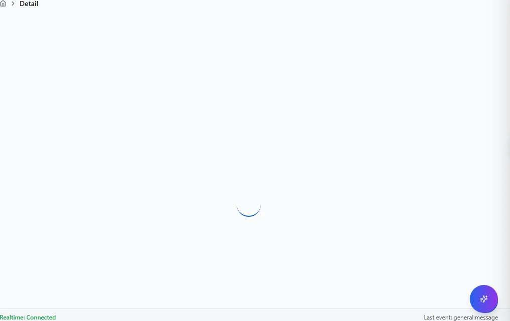

# Masken-Plattform (Universal Mask Runtime)

VALEO NeuroERP führt schrittweise **einheitliche Detailmasken** ein: dieselbe Bedienlogik
für Mensch und KI-Agent, mit serverseitiger Paginierung, strukturierten Filtern und
nachvollziehbaren Aktionen.

!!! note "Abgrenzung"
    Spezialmasken (Waage, POS, Ernteannahme, dichte Operator-UIs) bleiben erlaubt.
    Die Masken-Plattform ersetzt **schrittweise** Standard-Stamm- und Cockpit-Masken —
    nicht alles auf einmal.

## Voraussetzungen

- Mandant und Modul für die jeweilige Domäne freigeschaltet.
- Für **Rollout-Piloten:** Umgebungsvariable `VITE_ENABLE_UNIVERSAL_MASK_ROLLOUTS=true`
  (Dev/Staging; produktiv über Admin/Feature-Flags).
- Für **CRM 360 nativ:** `VITE_ENABLE_UNIVERSAL_MASK_CUSTOMER=true`.

## Gemeinsame Bedienelemente

| Element | Funktion |
|---------|----------|
| **Kennzahlen-Leiste** | KPIs oberhalb der Tabs (z. B. Umsatz, offene Posten) |
| **Workflow-Panel** | Prozessstatus, Sperrgründe, nächste erlaubte Schritte |
| **Tabs** | Lazy geladen — Daten erst beim Tab-Wechsel |
| **Sortieren** | Klick auf Spaltenheader; nur freigegebene Spalten |
| **Filter-Chips** | Vordefinierte Filter + Freitextsuche `q` |
| **Sticky Submit Bar** | Erscheint bei geänderten Stammdaten; Speichern mit Doppelklick-Schutz |
| **Aktionsleiste** | Bearbeiten, Folgebelege — nur mit Berechtigung |

## Native Masken (Produktionsreife)

Diese Masken nutzen die **native Runtime** (`adapter.temporary = false`):

| Maske | Route / Zugang | Handbuch |
|-------|----------------|----------|
| **CRM Kundenstamm 360°** | `/crm/kunden/:id` | [CRM — Kundenstamm 360°](crm.md#kundenstamm-360-cockpit) |
| **Einkauf Lieferantenstamm** | Legacy-Route oder Rollout-Pilot | [Einkauf — Lieferantenstamm 360°](einkauf.md#lieferantenstamm-360-native) |

## Rollout-Piloten (Waves 42–51)

Zehn weitere Domänen sind als **Pilot** über eine generische Route erreichbar:

```text
/mask-rollout/{screenId}/{entityId}
```

`screenId` verwendet `__` statt `/`, z. B. `einkauf__supplier` für Lieferant,
`crm__opportunity` für Opportunity, `lager__article-stock` für Artikelbestand.

### Pilot öffnen

1. Feature-Flag `VITE_ENABLE_UNIVERSAL_MASK_ROLLOUTS=true` setzen.
2. Route aufrufen, z. B. `/mask-rollout/einkauf__supplier/{lieferanten-id}`.
3. Kennzahlen-Leiste und Tabs wie bei nativen Masken bedienen.
4. **Mutationen** (Speichern, Freigabe, Zahlungslauf) bleiben auf den **Legacy-Masken** —
   Pilot ist primär read-only bzw. Analyse.

| Wave | Domäne | screenId (Beispiel) |
|------|--------|---------------------|
| 47 | Lieferant | `einkauf__supplier` |
| 48 | Opportunity | `crm__opportunity` |
| 43 | Artikelbestand | `lager__article-stock` |
| 49 | Lieferschein | `sales__delivery-note` |
| 46 | Bestellung | `einkauf__purchase-order` |
| 44 | Eingangsrechnung | `finance__ap-invoice` |
| 45 | OP Debitoren | `finance__ar-open-item` |
| 42 | Lagerbewegung | `lager__stock-movement` |
| 50 | Ernte-Abrechnung | `agrar__harvest-settlement` |
| 51 | Zahlungslauf | `finance__payment-run` |

!!! warning "Hohes Risiko"
    Zahlungslauf und Ernte-Abrechnung sind bewusst **zuletzt** in der Promotions-Reihenfolge.
    Dort sind Agenten- und Automatisierungsfehler besonders teuer.

## KI-Agenten-Modus (Überblick für Power-User)

Agenten (Copilot, externe Integrationen) lesen pro Maske einen **AgentMaskContract**:
welche Felder lesbar/editierbar/sensibel sind, welche Aktionen erlaubt sind und ob
**menschliche Freigabe** nötig ist.

Typischer Ablauf:

1. Agent **analysiert** (lesen, filtern, zusammenfassen) — ohne Seiteneffekt.
2. Agent schlägt Aktion vor (`propose` / `dryRun`) — z. B. „Aktivität anlegen“.
3. **Sie bestätigen** — erst dann wird ausgeführt (`execute`).
4. Sensible Felder (Kreditlimit, Zahlungsbedingungen, Notizen) werden markiert und
   nicht automatisch an externe Systeme weitergegeben.

Details für Betreiber: [Agent-Runbook Mask Runtime](../agent-docs/runbooks/mask-runtime-agent-modus.md).

## Häufige Fehler

| Symptom | Ursache | Lösung |
|---------|---------|--------|
| Leere Tabs | Lazy-Load noch nicht abgeschlossen | Tab erneut öffnen; Netzwerk prüfen |
| Sortierung reagiert nicht | Spalte nicht freigegeben | Andere Spalte wählen |
| Filter 422 | Ungültiger Filter-JSON (Agent/API) | Filter zurücksetzen |
| Legacy statt native Maske | Feature-Flag aus oder `temporary=true` | Flag prüfen; Admin kontaktieren |
| Rollout-Route 404 | Flag `VITE_ENABLE_UNIVERSAL_MASK_ROLLOUTS` aus | Flag setzen |

## Maskenregister

Vollständige Abdeckung: **1** App-Routen
(0 explizit in der Sidebar-Navigation).

| Maske | Route | Modul |
|-------|-------|-------|
| :Entityid | `/mask-rollout/:screenId/:entityId` | `@/pages/workflow/mask-rollout/MaskRolloutRoute` |

## Masken im Detail

Für jede Route: Navigation, Bearbeitung, Ergebnis und typische Fehler.

### :Entityid

**Route:** `/mask-rollout/:screenId/:entityId` · **Modul:** `@/pages/workflow/mask-rollout/MaskRolloutRoute`

**Ziel:** :Entityid in VALEO NeuroERP öffnen, Daten prüfen oder erfassen und das Ergebnis in Liste bzw. Folgebeleg kontrollieren.




**Schritte:**

1. Sidebar oder Suche: **:Entityid** öffnen (`/mask-rollout/:screenId/:entityId`).
2. Filter und Spalten nach Bedarf setzen; bei ListReport Zeilen per Doppelklick oder Aktion öffnen.
3. Bei Belegen: Kopfdaten prüfen, Positionen erfassen oder ändern, **Speichern** bzw. workflowgebundene Aktion (Freigabe, Folgebeleg) ausführen.
4. Ergebnis in Liste, Detailansicht oder Folgebeleg verifizieren; bei Fehlern Meldungstext und Status prüfen.

**Ergebnis:** Datensatz gespeichert, Liste aktualisiert oder Folgeprozess ausgelöst.

**Häufige Fehler:**

| Symptom | Ursache | Maßnahme |
|---------|---------|----------|
| Maske lädt nicht | Modul nicht freigeschaltet oder fehlende Berechtigung | Administrator: Modul/RBAC prüfen |
| Speichern fehlgeschlagen | Pflichtfeld, Status oder Validierung | Meldung lesen, Pflichtfelder ergänzen |
| Aktion ausgegraut | Workflow-Status oder Sperre | Vorbeleg freigeben oder Berechtigung klären |

## Weiterführend

- [Release Notes v3.1.0](release-notes.md) — Änderungsprotokoll
- [In-App-Hilfe](in-app-hilfe.md) — Route → Dokumentation
- Entwickler-API: [Mask Runtime API](../entwickler/mask-runtime-api.md)
- Architektur: [Universal Mask Runtime Status](../architecture/uix/universal-mask-runtime-status.md)

Reverse-Pflege: Bei neuen nativen Masken oder Rollout-Routen
`scripts/generate_inapp_help_map.py` ausführen und dieses Kapitel ergänzen.
