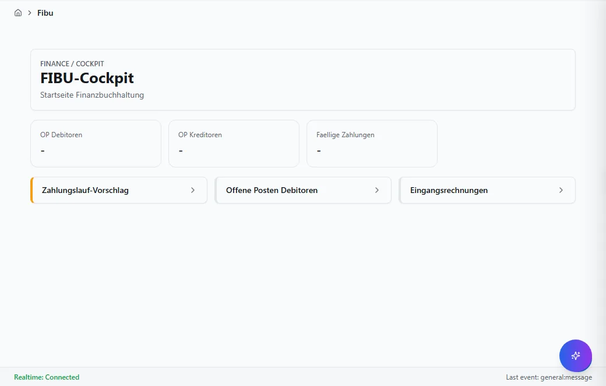
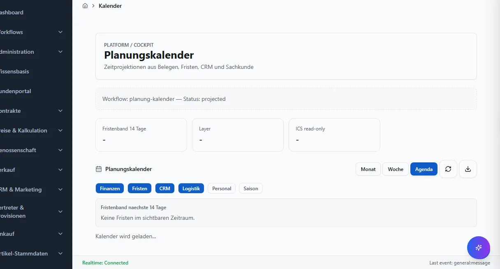

# Moderne Bedienung

VALEO NeuroERP fuehrt schrittweise Bedienmuster ein, mit denen Sie **sagen statt
suchen** und **haeufige Aufgaben ohne Klickpfad** erreichen. Alle diese Muster
laufen ueber dieselbe Masken-Plattform: Es gibt kein Parallelsystem, und
Sicherheits-/Freigaberegeln gelten unveraendert.

!!! note "Grundsatz"
    Kein Vorschlag wird still ausgefuehrt. Aktionen mit Wirkung durchlaufen
    **immer** dasselbe Bestaetigungs-Ritual wie in der Maske. Sprache und
    Vorschlaege koennen **navigieren und vorbefuellen**, aber niemals eine
    gefaehrliche Aktion allein ausloesen.

---

## Omnibox — die Kommandoleiste (Strg+K)

Die Omnibox ist ein Eingabefeld fuer die ganze Anwendung. Sie oeffnen sie mit
**Strg+K** (bzw. **Cmd+K**) oder ueber das Suchfeld oben in der Kopfzeile.

**Ziel:** Eine Maske oder gefilterte Liste in einem Schritt erreichen — ohne
das Menue.

**Schritte:**
1. Strg+K druecken.
2. In natuerlicher Sprache tippen, z. B. `offene posten folkerts`,
   `ueberfaellige rechnungen`, `op > 30 tage`, `lieferscheine heute`.
3. Unter **„Verstanden als"** zeigt die Omnibox, wie Ihre Eingabe interpretiert
   wurde: die getroffene Maske, erkannte Filter (als Chips) und eine
   Konfidenz-Angabe.
4. Mit den Pfeiltasten waehlen, **Enter** navigiert.

**Erkannte Filter (Beispiele):** `ueberfaellig`, `heute`, `naechste Woche`,
`> 30 tage`, sowie freier Suchtext (z. B. ein Kundenname), der als Volltext an
die Zielliste angehaengt wird.

**Ergebnis:** Sie landen direkt in der richtigen Liste/Maske mit gesetzten
Filtern.

### Aktion vorbereiten

Nennen Sie ein Aktions-Verb zusammen mit der Maske (z. B.
`kunde folkerts aktivitaet anlegen`), erscheint zusaetzlich der Abschnitt
**„Aktion vorbereiten"**. Die Omnibox bereitet die Aktion vor und fuellt die
erkannten Felder vor — **ausgefuehrt wird nichts automatisch**:

- **Sichere Aktionen** oeffnen die Maske mit vorbefuellten Feldern (Sie pruefen
  und loesen selbst aus).
- **Bestaetigungspflichtige Aktionen** (z. B. Mahnen, Freigeben) fuehren in das
  bestehende Bestaetigungs-Ritual mit Zusammenfassung; erst dort loesen Sie aus.
- **Hochriskante Aktionen** (kritisch/genehmigungspflichtig) sind ueber die
  Omnibox **nicht** ausloesbar — Sie werden nur zur Maske geleitet.

---

## Rollen-Workspaces — Ihre Startseite

Rollen-Workspaces sind cockpitartige Startseiten je Aufgabengebiet:
`Einkauf`, `Verkauf`, `Lager`, `FIBU`, `Leitung`.

- Jeder Workspace zeigt **Kennzahlen** und **Kacheln** zu den wichtigsten
  Arbeitsvorraeten (z. B. „Zahlungslauf-Vorschlag", „Offene Posten (ueberfaellig)",
  „Qualitaets-Nachtrag"). Ein Klick auf eine Kachel fuehrt direkt in die
  zugehoerige Maske.
- Die Kachel-Farbe zeigt die Dringlichkeit (neutral / Warnung / kritisch).
- Ist der rollenbasierte Start aktiviert, landen Sie nach der Anmeldung
  automatisch auf dem Workspace Ihrer Rolle; andernfalls erreichen Sie ihn ueber
  die Navigation oder die Omnibox (z. B. `fibu cockpit`).

!!! tip "Saisonale Sortierung"
    In definierten Zeitraeumen (z. B. Erntekampagne) kann die Kachel-Reihenfolge
    automatisch umsortiert werden — der Inhalt bleibt gleich, nur die
    Wichtigkeit wird angepasst.

---

## Sprach-Eingabe & Diktat (VoiceBar)

Wo die Sprachleiste verfuegbar ist, koennen Sie Text **diktieren** oder per
Stimme **navigieren**.

**Bedienung:**
- Mikrofon-Knopf gedrueckt halten (Push-to-talk) oder mit **Alt+V** umschalten.
- Das **Transkript ist immer sichtbar und editierbar** — es wird erst
  **bei Bestaetigung** uebernommen. Mit „Verwerfen" brechen Sie ab.
- Navigations-Saetze mit Praefix (`oeffne`, `zeige`, `filtere`, `suche`) fuehren
  ueber die Omnibox zur Zielmaske.

!!! warning "Sicherheit"
    Ueber Sprache sind ausschliesslich **Navigation und Vorbefuellen** moeglich.
    Eine Aktion mit Wirkung wird per Stimme **nie** allein ausgeloest — dafuer
    gilt immer das Bestaetigungs-Ritual in der Maske.

**Datenschutz:** Es wird **kein Audio gespeichert**; Transkript-Inhalte werden
nicht protokolliert (nur anonyme Nutzungsmetadaten). Wenn Sie „reduzierte
Bewegung" bevorzugen, pulsiert das Mikrofon nicht.

---

## Persoenliche Ansichten (Overlays)

Sie koennen Masken **fuer sich persoenlich** anpassen, ohne eine Kopie der Maske
anzulegen:

- **Spalten** ein-/ausblenden und umsortieren, **Spaltenbreiten** merken,
  eigene **Tabellen-Varianten** speichern, **Dichte** und **Kachel-Reihenfolge**
  einstellen, Abschnitte einklappen.
- Ihre Anpassungen bleiben ueber Neuanmeldungen erhalten und ueberleben kleinere
  Masken-Updates; passt eine Anpassung nach einem Update nicht mehr, erhalten Sie
  einen Hinweis „Anpassung pruefen".

!!! note "Was nicht anpassbar ist"
    Aus Sicherheitsgruenden lassen sich **Aktionen, Berechtigungen,
    Gefahrenstufen, Pflichtfelder** und die Grundstruktur der Maske **nicht**
    per persoenlicher Ansicht veraendern.

---

## Prozessband

Belegmasken zeigen ihre **Prozesskette** als Band unter dem Kopf (z. B.
Auftrag → Lieferschein → Offene Posten → Zahlung). Der aktuelle Schritt ist
hervorgehoben; ein Klick auf einen Schritt navigiert in die zugehoerige Maske.
Das Band ist per Tastatur bedienbar.

---

## Notizen & Erwaehnungen am Datensatz

In der Kontext-Leiste vieler Masken koennen Sie **Notizen** zum Datensatz
erfassen und Kolleg:innen per **@-Erwaehnung** benachrichtigen. Notizen sind
reiner Text (keine aktiven Inhalte); Erwaehnungen erzeugen einen Eintrag im
Postfach der genannten Person.

---

## Planungskalender

Der Planungskalender zeigt Termine als **Projektion** aus dem System —
Faelligkeiten offener Posten, Kontrakt-/Rabattfristen, CRM-Wiedervorlagen,
Sachkunde-/Zertifikatstermine und periodische Buchungen — jeweils mit
Durchstich zum Objekt.

- **Termine aus E-Mails:** Aus Lieferanten-Mails erkannte Termine erscheinen als
  **Vorschlag** (gestrichelt, mit ✉-Kennzeichen) im Logistik-Layer. Sie
  **bestaetigen** oder **verwerfen** — **kein Vorschlag wird automatisch zum
  Termin**, auch nicht bei hoher Erkennungssicherheit.

---

## Leitstand mit Belegungsplan (Twin-Panel)

Der Lager-Leitstand kann die physische **Silo-/Hofbelegung** als interaktiven
2D-Plan zeigen: Fuellstand (Farbverlauf), Feuchte-Warnungen (rote Kontur),
Sperren (Schraffur) und QS-Status. Ein Klick auf eine Zelle fuehrt zur
Zellen-Maske. Der Plan ist per Tastatur bedienbar und zeigt den Datenstand
(„Stand HH:MM:SS").

---

## Hinweis-Agenten (Ambient-Worklists)

Beobachtende Agenten pruefen naechtlich definierte Sachverhalte und erzeugen
**erklaerte Hinweise** in Ihren Arbeitsvorraeten — z. B. „Kontrakt
untererfuellt", „Preisabweichung Einkauf", „OP eskaliert", „Zertifikat laeuft
ab". Jeder Hinweis nennt **Begruendung** und **Beleg** und fuehrt zur Zielmaske.

!!! warning "Agenten buchen nie"
    Diese Agenten **schlagen nur vor** und mutieren nichts. Die Abarbeitung
    erfolgt ausschliesslich ueber die Zielmaske; einen Hinweis koennen Sie mit
    Begruendung „erledigt" oder „verworfen" setzen.

---

## ESG: CO₂e je Charge

Auf Charge-/Kontraktmasken kann eine **ESG-Kachel** den CO₂e-Fussabdruck
anzeigen. Die Herleitung ist **auditierbar**: Jede Komponente (Trocknung,
Transport, Strom) nennt ihren Emissionsfaktor samt Quelle und einen
Beleg-Verweis. Der verwendete **Faktorstand** (z. B. `2026-07`) ist sichtbar.
Fehlt ein Input, wird die Komponente weggelassen — es wird **nicht geschaetzt**.
