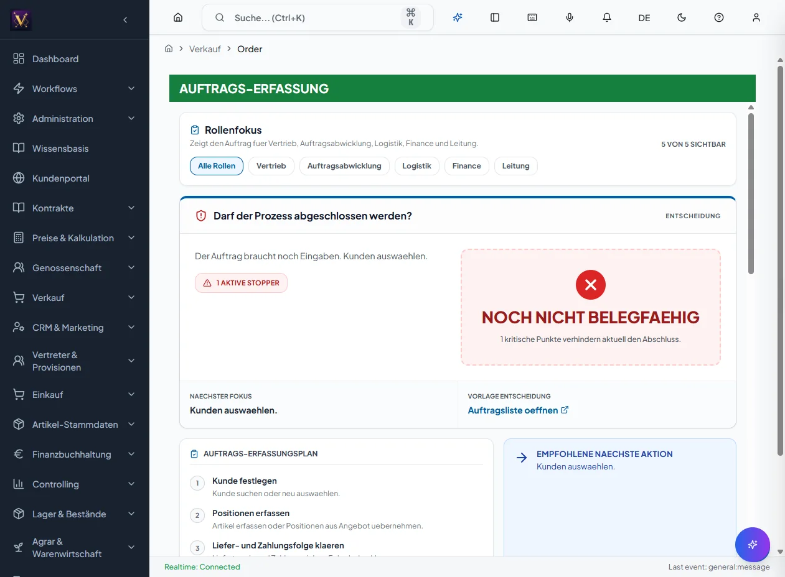

# Vom Auftrag zur Rechnung

Der Verkaufsprozess folgt der Belegkette **Auftrag → Lieferschein → Rechnung**.
Die Belege teilen dasselbe Layout (Gewohnheits-Prinzip), sodass Sie sich überall
sofort zurechtfinden.

## Voraussetzungen

- Modul **Verkauf** ist freigeschaltet.
- Kunde und Artikel sind als Stammdaten vorhanden.

## 1. Auftrag anlegen

1. Bereich *Verkauf* → *Aufträge* → *Neu*.
2. Kunde wählen (Kundenauswahl), Lieferbedingungen prüfen.
3. Positionen erfassen (Artikel, Menge, Preis).
4. **Speichern**. Der Auftrag erhält eine Auftragsnummer.

## 2. Lieferschein erzeugen

1. Auftrag öffnen → Aktion **Lieferschein erstellen**.
2. Liefermengen und Gewichte prüfen (ggf. Gefahrgutpunkte/Gewicht beachten).
3. **Speichern**. Der Lieferschein referenziert den Auftrag.

## 3. Rechnung erstellen

1. Lieferschein öffnen → Aktion **Rechnung erstellen**.
2. Rechnungsdatum und Positionen prüfen (Netto, MwSt).
3. **Speichern/Freigeben**. Die Rechnung geht in die Offene-Posten-Verwaltung.

**Ergebnis:** Eine durchgängige, nachvollziehbare Belegkette vom Auftrag bis zur
Rechnung.

## Häufige Fehler

- **Kunde nicht gefunden:** über die Kundenauswahl suchen oder Stammdaten anlegen.
- **Aktion „Folgebeleg" fehlt:** Vorbeleg ist nicht im passenden Status
  (z. B. Auftrag nicht freigegeben).
- **Preis weicht ab:** Konditionen/Preisliste am Kunden prüfen.

## Quellen und Reverse-Pflege

- `packages/frontend-web/src/app/navigation/domains/commercial.tsx`: Verkauf O2C-Menü.
- `docs/benutzerhandbuch/finanzbuchhaltung.md`: Übergang Rechnung → Offene Posten.
- `docs/agent-ops/slices/DOM-SALES-004.yaml`: O2C-Vertiefung (Match, Kreditlimit).

Reverse-Pflege: Bei neuen O2C-Status, Folgebeleg-Aktionen oder Layout-Änderungen
diese Seite und `docs/MASKEN.md` gemeinsam aktualisieren.
