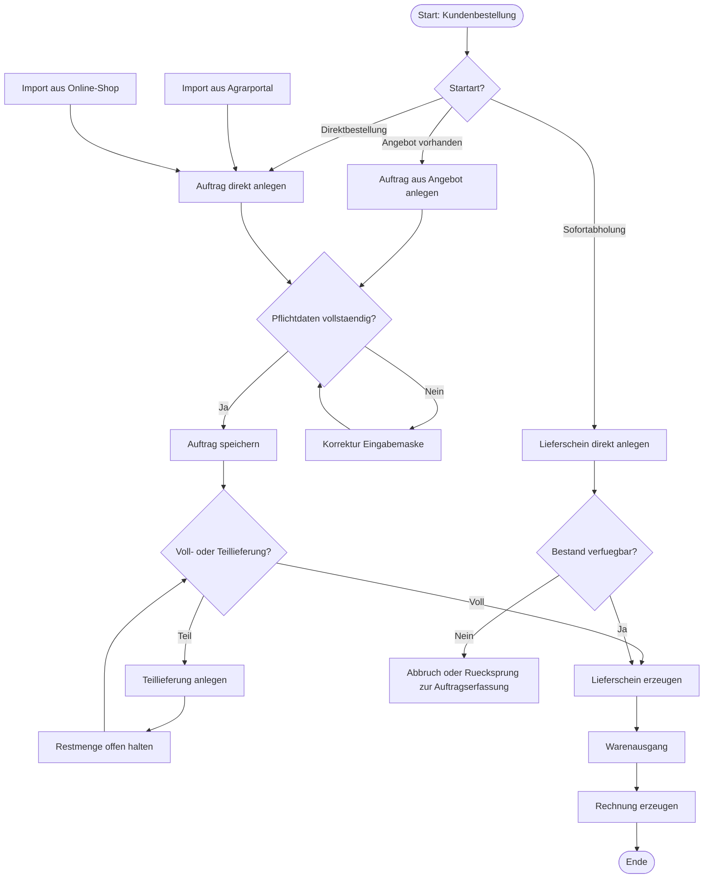

# Card Template

## Vollversion

```markdown
# Card: {{CARD_ID}} - {{NAME}}

## 1. Einordnung
- Prozessbereich:
- Workflow:
- Teilprozess:
- Rolle(n):
- Prioritaet:
- Status:

## 2. Fachlicher Zweck
- Ziel des Schrittes:
- Fachliche Beschreibung:
- Geschaeftlicher Nutzen:

## 3. Start / Trigger
- Startbedingung:
- Ausloeser:
- Startpunkt-Typ:
  - [ ] Standardstart
  - [ ] Alternativstart
  - [ ] Externer Import
  - [ ] Manueller Direktstart
  - [ ] Systemtrigger
- Quelle des Triggers:

## 4. Vorbedingungen
- Muss vorhanden sein:
- Muss geprueft sein:
- Ausschlussbedingungen:
- Abhaengige Vorprozesse:

## 5. Eingaben
- Stammdaten:
- Bewegungsdaten:
- Pflichtfelder:
- Optionale Felder:
- Vorbelegte Werte:
- Externe Datenquellen:

## 6. UI / Systembezug
- Seite / Maske:
- Dialog / Untermaske:
- Button / Aktion:
- Status vor Ausfuehrung:
- Status nach Ausfuehrung:
- Sichtbare Felder:
- Fehlende Felder / Aktionen:

## 7. Aktion
- Benutzeraktion:
- Systemaktion:
- Automatische Folgeaktion:
- Synchron / asynchron:
- Notwendige Bestaetigung:

## 8. Geschaeftsregeln
- Validierungsregeln:
- Preis-/Mengenlogik:
- Berechtigungen:
- Pflichtpruefungen:
- Sonderregeln:
- Verbote / Sperren:

## 9. Ergebnisse
- Output-Daten:
- Erzeugte Belege / Datensaetze:
- Geaenderte Status:
- Folgeprozess Standard:
- Folgeprozess alternativ:

## 10. Verzweigungen / Loops / Rueckspruenge
- Entscheidungspunkt:
- Moegliche Alternativen:
- Ruecksprung moeglich zu:
- Schleife moeglich:
- Abbruchpfad:
- Sprungpfad:
- Direkteinstieg moeglich:

## 11. Fehlerfaelle / Edge Cases
- Typische Fehler:
- Fachliche Sonderfaelle:
- Technische Sonderfaelle:
- Teilmengen / Splittung:
- Storno / Korrektur:
- Ruecknahme / Retoure:
- Preisabweichung:
- Bestandsproblem:
- Medienbruch moeglich:

## 12. CRUD-Pruefung
- Create moeglich:
- Read / Suchen moeglich:
- Update moeglich:
- Delete fachlich zulaessig:
- Storno statt Delete:
- Historisierung vorhanden:
- Audit / Nachvollziehbarkeit:
- UI vollstaendig fuer CRUD:
- Browser-Use pruefbar:

## 13. Soll-Ist-Bewertung
- Soll-Prozess:
- Ist-Umsetzung:
- Abweichung:
- Fehlende Umsetzung:
- Unklare Umsetzung:
- Workaround aktuell noetig:

## 14. Risiko
- Risiko-Level:
  - [ ] kritisch
  - [ ] hoch
  - [ ] mittel
  - [ ] niedrig
- Risiko-Beschreibung:
- Auswirkung im Tagesgeschaeft:
- Betroffene Rollen:
- Betroffene Folgeprozesse:

## 15. Empfehlung
- Empfohlene Massnahme:
- Fachlich:
- Technisch:
- UI-seitig:
- Prioritaet der Umsetzung:
- Sofortmassnahme:
- Spaetere Optimierung:

## 16. Annahmen
- Annahme 1:
- Annahme 2:
- Offene Fragen:

## 17. Testhinweise
- Positiver Testfall:
- Negativer Testfall:
- Edge-Case-Test:
- Browser-Use-Pruefschritt:
- Erwartetes Ergebnis:
```

## Kurzversion

```markdown
## {{CARD_ID}} - {{NAME}}

**Prozessbereich:**
**Trigger:**
**Vorbedingungen:**
**Input:**
**UI / Maske:**
**Aktion:**
**Geschaeftsregel:**
**Output:**
**Naechster Schritt:**
**Alternativen / Spruenge:**
**Loops / Rueckspruenge:**
**Fehlerfaelle / Edge Cases:**
**CRUD-Pruefung:**
**Soll-Ist-Abweichung:**
**Risiko:**
**Empfehlung:**
**Annahmen:**
```

## Mermaid-Beispiel


