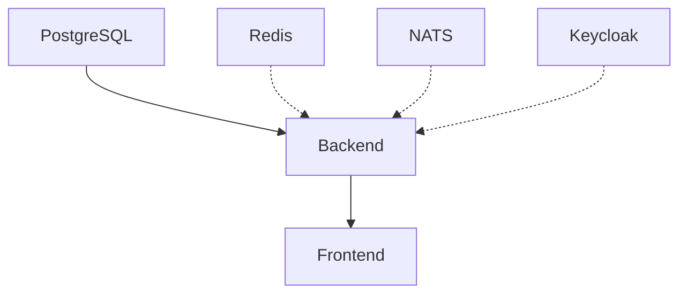

# VALEO-NeuroERP Service-Management

**Version:** 3.0.0  
**Letzte Aktualisierung:** 13. Oktober 2025  

---

## 📋 Übersicht aller Services

| Service | Port | Typ | Required | Status-Command |
|---------|------|-----|----------|----------------|
| **Frontend** | 3000 | Node | ✅ JA | `http://localhost:3000` |
| **Backend** | 8000 | Python | ✅ JA | `http://localhost:8000/health` |
| **PostgreSQL** | 5432 | Docker | ✅ JA | `docker exec valeo-postgres pg_isready` |
| **Redis** | 6379 | Docker | ⚪ Optional | `docker exec valeo-redis redis-cli ping` |
| **NATS** | 4222 + 8222 | Docker | ⚪ Optional | `curl http://localhost:8222/healthz` |
| **Keycloak** | 8080 | Docker | ⚪ Optional | `curl http://localhost:8080/health/ready` |
| **Prometheus** | 9090 | Docker | ⚪ Optional | `curl http://localhost:9090/-/healthy` |
| **Grafana** | 3001 | Docker | ⚪ Optional | `curl http://localhost:3001/api/health` |
| **Loki** | 3100 | Docker | ⚪ Optional | `curl http://localhost:3100/ready` |

---

## 🚀 Quick Start (Lokale Entwicklung)

### Minimal-Setup (nur Testing):
```powershell
# 1. Service-Manager-Status-Check
python scripts/service_manager.py status

# 2. Alte Prozesse aufräumen
python scripts/service_manager.py cleanup

# 3. Minimal-Stack starten (nur required services)
python scripts/service_manager.py start

# 4. Backend starten (manuell)
python -m uvicorn main:app --host 0.0.0.0 --port 8000 --reload

# 5. Frontend starten (manuell, separates Terminal)
cd packages/frontend-web
pnpm vite

# 6. Browser öffnen
# http://localhost:3000
```

---

## 🔧 Häufige Probleme & Lösungen

### Problem 1: Port bereits belegt

**Symptom:**
```
Error: listen EADDRINUSE: address already in use :::3000
ERROR: [Errno 48] Address already in use
```

**Lösung:**
```powershell
# Option A: Automatisches Cleanup
python scripts/service_manager.py cleanup

# Option B: Manuelles Cleanup
# Finde Prozess auf Port
netstat -ano | findstr ":3000"
# Stoppe Prozess
Stop-Process -Id <PID> -Force

# Option C: Alle Node/Python-Prozesse stoppen
Get-Process python,node -ErrorAction SilentlyContinue | Stop-Process -Force
```

---

### Problem 2: Backend startet nicht (PostgreSQL-Verbindung)

**Symptom:**
```
sqlalchemy.exc.OperationalError: (psycopg2.OperationalError)
ERROR: Application startup failed. Exiting.
```

**Ursachen:**
1. ❌ PostgreSQL-Container läuft nicht
2. ❌ Falsche Credentials in `app/core/config.py`
3. ❌ Schemas fehlen in der Datenbank
4. ❌ Windows kann nicht zu Docker-PostgreSQL verbinden

**Lösung:**
```powershell
# 1. Prüfe Container
docker ps | findstr postgres

# 2. Starte Container falls nötig
docker start valeo-postgres

# 3. Prüfe Schemas
docker exec valeo-postgres psql -U valeo -d valeo_neuro_erp -c "\dn"

# 4. Erstelle Schemas falls fehlend
docker exec valeo-postgres psql -U valeo -d valeo_neuro_erp -c "
  CREATE SCHEMA IF NOT EXISTS domain_shared;
  CREATE SCHEMA IF NOT EXISTS domain_crm;
  CREATE SCHEMA IF NOT EXISTS domain_inventory;
  CREATE SCHEMA IF NOT EXISTS domain_erp;
"

# 5. Prüfe Credentials in app/core/config.py
# DATABASE_URL muss match en mit Docker-Container:
# User: valeo
# Password: valeo_secure_password_2025 (aus .env)
# Database: valeo_neuro_erp
```

**Wichtig:** Auf Windows kann psycopg2 manchmal nicht zu Docker-PostgreSQL verbinden.  
**Workaround:** Backend akzeptiert DB-Fehler und startet trotzdem (Testing-Modus in `app/core/database.py`)

---

### Problem 3: Frontend zeigt keine Daten (CORS-Fehler)

**Symptom:**
```
Access to XMLHttpRequest at 'http://localhost:8000/api/...' from origin 'http://localhost:3000' has been blocked by CORS policy
```

**Lösung:**
```python
# In app/core/config.py:
BACKEND_CORS_ORIGINS: List[AnyHttpUrl] = [
    "http://localhost:3000",  # ← Frontend-Port muss hier sein!
    "http://localhost:5173",
]
```

**Nach Änderung:** Uvicorn lädt automatisch neu (--reload)

---

### Problem 4: Docker-Container "unhealthy"

**Symptom:**
```
valeo-keycloak: Up 5 minutes (unhealthy)
valeo-nats: Up 2 minutes (unhealthy)
```

**Lösung:**
```bash
# A. Container-Logs prüfen
docker logs valeo-keycloak --tail=50

# B. Healthcheck-Konfiguration prüfen
docker inspect valeo-keycloak --format='{{json .State.Health}}'

# C. Container neu starten
docker restart valeo-keycloak

# D. Falls Healthcheck fehlerhaft: Fix in docker-compose.production.yml
```

**Bekannte Fixes:**
- **NATS:** Braucht `--http_port=8222` für Healthcheck
- **Keycloak:** Braucht 90-120s Start-Zeit, `start_period: 120s`

---

## 📚 Service-Manager Commands

```bash
# Status aller Services anzeigen
python scripts/service_manager.py status

# Alle Ports aufräumen (alte Prozesse stoppen)
python scripts/service_manager.py cleanup

# Minimal-Stack für Testing starten
python scripts/service_manager.py start

# Health-Checks durchführen
python scripts/service_manager.py health

# Alle Services stoppen
python scripts/service_manager.py stop-all
```

---

## 🔄 Typischer Workflow

### Morgens / Neustart:

```powershell
# 1. System-Status prüfen
python scripts/startup_check.py

# 2. Alte Services aufräumen
python scripts/service_manager.py cleanup

# 3. Docker-Services starten
docker-compose -f docker-compose.production.yml up -d postgres redis nats

# 4. Backend starten
python -m uvicorn main:app --host 0.0.0.0 --port 8000 --reload

# 5. Frontend starten (separates Terminal)
cd packages/frontend-web && pnpm vite
```

### Abends / Herunterfahren:

```powershell
# Option A: Alles stoppen (inkl. Docker)
python scripts/service_manager.py stop-all

# Option B: Nur lokale Prozesse stoppen (Docker läuft weiter)
Get-Process python,node -ErrorAction SilentlyContinue | Stop-Process -Force
```

---

## 🎯 Service-Dependencies



**Legende:**
- Durchgezogene Linie: Hard Dependency (muss laufen)
- Gestrichelte Linie: Soft Dependency (optional)

---

## ⚙️ Konfigurationsdateien

| Datei | Zweck |
|-------|-------|
| `config/services.yml` | Zentrale Service-Definitionen |
| `.env` | Environment-Variablen für Docker |
| `app/core/config.py` | Backend-Konfiguration (Ports, DB-URL, CORS) |
| `docker-compose.production.yml` | Docker-Stack-Definition |
| `package.json` (Frontend) | Frontend-Scripts und Port-Konfiguration |

---

## 🐛 Debugging-Checkliste

Bei Problemen der Reihe nach prüfen:

- [ ] **1. Ports frei?** `python scripts/service_manager.py status`
- [ ] **2. Docker läuft?** `docker ps`
- [ ] **3. PostgreSQL erreichbar?** `docker exec valeo-postgres psql -U valeo -d valeo_neuro_erp -c "SELECT 1;"`
- [ ] **4. Schemas existieren?** `docker exec valeo-postgres psql -U valeo -d valeo_neuro_erp -c "\dn"`
- [ ] **5. Backend-Health-Check?** `curl http://localhost:8000/health`
- [ ] **6. Frontend-Health-Check?** `curl http://localhost:3000`
- [ ] **7. CORS korrekt?** Prüfe Browser-Console für CORS-Errors
- [ ] **8. Logs prüfen:** Backend-Terminal, Frontend-Terminal, Docker-Logs

---

## 📊 Installation vs. Produktiv

Das System erkennt automatisch ob es sich in der **Installation** oder **Produktiv**-Phase befindet:

### Installation-Phase:
- **Marker:** `.installation_complete` fehlt
- **Verhalten:** 
  - Erstellt fehlende Schemas
  - Erstellt Tabellen beim ersten Backend-Start
  - Führt Seed-Scripts aus

### Produktiv-Phase:
- **Marker:** `.installation_complete` existiert
- **Verhalten:**
  - **KEINE** Schema-Änderungen
  - **KEINE** Tabellen-Drops
  - **KEINE** Datenbank-Resets
  - Nur Tabellen-Updates via Alembic-Migrationen

### Marker zurücksetzen (für Neuinstallation):
```powershell
# ACHTUNG: Löscht Installation-Marker (Datenbank bleibt erhalten!)
Remove-Item .installation_complete -ErrorAction SilentlyContinue

# Für KOMPLETTE Neuinstallation (inkl. Datenbank-Reset):
docker-compose -f docker-compose.production.yml down -v
Remove-Item .installation_complete -ErrorAction SilentlyContinue
Remove-Item dev_test.db -ErrorAction SilentlyContinue
```

---

## 🎓 Lessons Learned (aus heutigem Testing)

### 1. Port-Konflikte vermeiden
**Problem:** Grafana lief auf Port 3000 und blockierte Frontend  
**Fix:** Grafana auf Port 3001 verschoben, Frontend nutzt Standard-Port 3000  
**Learning:** Zentrale Port-Registry in `config/services.yml`

### 2. Windows + Docker + PostgreSQL
**Problem:** psycopg2 kann nicht zu Docker-PostgreSQL verbinden (trotz korrektem Port-Mapping)  
**Fix:** `create_tables()` fängt Fehler ab und startet Backend trotzdem (Testing-Modus)  
**Learning:** Für lokales Testing: Tabellen im Container direkt erstellen oder SQLite nutzen

### 3. Background-Prozesse auf Windows
**Problem:** `Start-Process -WindowStyle Hidden` verschluckt Fehlerme ldungen  
**Fix:** Prozesse im Vordergrund starten beim Debugging  
**Learning:** Nur im Production-Deployment Background-Modus nutzen

### 4. CORS-Origins dynamisch
**Problem:** Frontend wechselt zwischen Port 3000/3001/5173  
**Fix:** Alle möglichen Ports in CORS-Origins aufnehmen  
**Learning:** Frontend-Port sollte fix sein (immer 3000)

### 5. Service-Dependencies
**Problem:** Backend startet ohne PostgreSQL und crasht  
**Fix:** Startup-Check prüft Dependencies vor dem Start  
**Learning:** Dependency-Graph in `config/services.yml` definiert

---

## 📝 Maintenance-Commands

### Regelmäßige Wartung:
```powershell
# Wöchentlich: Docker-Cleanup
docker system prune -f

# Monatlich: Image-Updates
docker-compose -f docker-compose.production.yml pull
docker-compose -f docker-compose.production.yml build --no-cache

# Bei Problemen: Kompletter Neustart
python scripts/service_manager.py stop-all
docker-compose -f docker-compose.production.yml down
# Warte 10 Sekunden
python scripts/service_manager.py start
```

---

## 🆘 Notfall-Kommandos

### System hängt sich komplett auf:
```powershell
# 1. Alle Prozesse killen
Get-Process python,node -ErrorAction SilentlyContinue | Stop-Process -Force

# 2. Alle Docker-Container stoppen
docker stop $(docker ps -aq)

# 3. Port-Check
netstat -ano | findstr ":3000 :8000 :5432"

# 4. System neu starten
python scripts/service_manager.py start
```

---

**Ansprechpartner:** DevOps-Team  
**Dokumentation:** `docs/operations/`  
**Tools:** `scripts/service_manager.py`, `scripts/startup_check.py`

