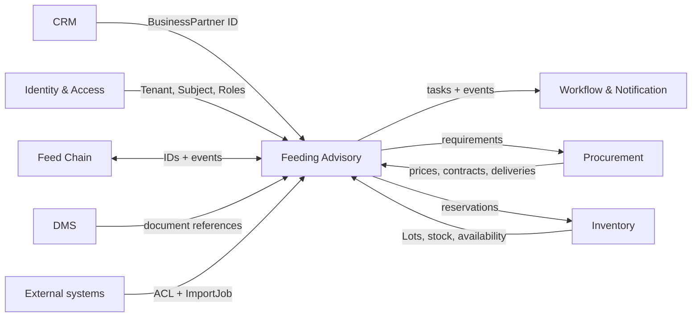
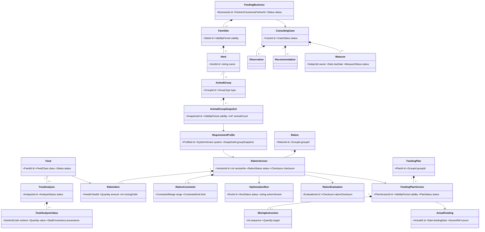

# 04 — Fachliches Domaenenmodell

## 1. Modellierungsziel

Das Modell trennt wissenschaftliche Berechnung, fachliche Entscheidung,
betriebliche Ausfuehrung und ERP-Nachbarkontexte. Es verhindert insbesondere,
dass ein Solverergebnis bereits als freigegebene Ration gilt oder eine aktive
Ration ohne skalierte Planversion direkt an eine Maschine gesendet wird.

## 2. Bounded Contexts und Context Map

| Context | Verantwortung | Beziehung zu Feeding |
|---|---|---|
| Feeding Advisory | Betriebssicht, Tiergruppe, Futter/Analyse, Bedarf, Ration, Evaluation, Plan, Ist, Beratung | Kernkontext |
| CRM | BusinessPartner, Kontakte, Beziehungen | Upstream; Feeding referenziert `business_partner_id` |
| Inventory | Artikel, Charge, Standortbestand, Sperre, Reservierung | Upstream fuer Verfuegbarkeit; Downstream fuer Planreservierung |
| Procurement | Lieferant, Kontrakt, Bestellung, Preis | Upstream Preis/Lieferung; Downstream Bestellvorschlag |
| Feed Chain | Produktion, Rezeptur, Deklaration, Qualitaet | getrennte Sprache; Integration ueber IDs/Events |
| DMS | Originaldatei, Version, Aufbewahrung | Upstream Dokumentreferenz fuer Analyse/Bericht/Foto |
| Identity & Access | Subject, IdP-Rolle, Tenant | Upstream; Feeding ergaenzt Ressourcen-Grants |
| Workflow & Notification | generische Aufgabe, Kanal, Zustellung | Downstream aus Feeding-Events |
| Finance/Controlling | abrechnungsrelevante Geldwerte, Buchung | Feeding liefert fachliche Kennzahlen, bucht nicht |
| External Integration | Labor, Herd Data, MLP, AMS, Mischtechnik | Anti-Corruption Layer zum kanonischen Modell |



## 3. Module innerhalb des Kernkontexts

1. `business`: FeedingBusiness, FarmSite, Herd, Grant.
2. `herd`: AnimalGroup und zeitliche Snapshots.
3. `feed`: Feed, FeedProduct, ReferenceValue, Analysis.
4. `requirements`: EvaluationSystemVersion, NutrientDefinition, UnitDefinition,
   RequirementProfile.
5. `ration`: Ration, RationVersion, Constraint, OptimizationRun, Evaluation.
6. `plan`: FeedingPlan, PlanVersion, MixingInstruction.
7. `actuals`: ActualFeeding, PerformanceRecord, Deviation.
8. `consulting`: ConsultingCase, Observation, Recommendation, Measure, Report.
9. `integration`: Connection, ImportJob, Mapping, QuarantineRecord.

Module duerfen keine fremden Aggregate durch ORM-Beziehungen mutieren. Referenzen
sind IDs; Konsistenz ueber Aggregate entsteht durch Application Service, Outbox
und idempotente Projektoren.

## 4. Aggregate und Invarianten

### 4.1 FeedingBusiness

**Root:** `FeedingBusiness`

**Entities:** FarmSite, Herd. **Referenzen:** BusinessPartner, Kontakte.

Invarianten:

- Tenant und BusinessPartner sind nach Anlage nicht still austauschbar.
- ein aktiver Betrieb besitzt mindestens einen aktiven Standort;
- Herdenschluessel sind je Betrieb eindeutig;
- Archivierung ist nur ohne aktive Planversion oder mit dokumentierter Migration
  zulaessig;
- Zugriff braucht Domainrolle und passenden BusinessGrant.

### 4.2 AnimalGroup

**Root:** `AnimalGroup`; **Entity:** `AnimalGroupSnapshot`.

- jeder fachlich verwendete Parameterstand besitzt `valid_from` und optional
  `valid_to`;
- Zeitintervalle derselben Gruppe duerfen sich nicht ueberlappen;
- Rationsversionen referenzieren den verwendeten Snapshot, nicht den mutablen Kopf;
- Tierzahl ist null oder nichtnegativ; null bedeutet unbekannt, nicht null Tiere;
- importierte Gruppenwechsel bleiben durch externe Referenz idempotent.

Lieferstand FEED-CORE-016: `feeding_groups` ist der aktuelle Gruppenkopf mit
optimistischer `revision`; jede Anlage/Aenderung erzeugt einen unveraenderlichen
Snapshot in `feeding_group_revisions`. Profile, Traechtigkeitsstatus,
Milchinhaltsstoffe, Risiko und Gueltigkeit sind typisiert. Zeitliche
Tiermitgliedschaften und ueberlappungsfreie Provider-Gruppenwechsel bleiben im
geplanten `animal_group_memberships`-Teil von FEED-HERD-003.

### 4.3 Feed

**Root:** `Feed`; **Entities:** FeedProduct, FeedReferenceValue.

- Bezeichnung, Klasse und Herkunft sind versionierbar;
- ein Wert hat NutrientDefinition, Wert, Einheit, Bezugsbasis, Quelle, Gueltigkeit
  und Schaetzstatus;
- Referenzwerte duerfen gemessene aktive Analysewerte nicht unsichtbar ersetzen;
- Lagercharge und Handelsartikel bleiben externe Referenzen.

### 4.4 FeedAnalysis

**Root:** `FeedAnalysis`; **Entities:** FeedAnalysisValue.

- importiert -> gemappt -> validiert -> freigegeben oder verworfen;
- Originalwert und Originaleinheit bleiben unveraendert erhalten;
- Umrechnung erzeugt einen nachvollziehbaren kanonischen Rechenwert;
- nur eine freigegebene Version kann je Feed/Scope/Gueltigkeitszeitpunkt aktiv sein;
- Aktivierung aendert keine bestehende Rationsversion;
- fehlende oder unplausible Werte werden nicht als Null gespeichert.

### 4.5 RequirementProfile

**Root:** `RequirementProfile`; Referenz auf EvaluationSystemVersion und
AnimalGroupSnapshot.

- Normsystemversion ist unveraenderlich Teil jeder Profilversion;
- Overrides tragen Actor, Grund, Quelle, Gueltigkeit und Delta;
- kanonische Einheiten werden vor Berechnung validiert;
- ein Profil ist erst `ready`, wenn alle Pflichtparameter bekannt oder explizit
  als fachlich zulaessige Schaetzung markiert sind.

### 4.6 Ration

**Root:** `Ration`; **Entities:** RationVersion, RationItem, RationConstraint.

- Versionen sind append-only und durch Checksum gesichert;
- genau eine Version je Gruppe kann `active` sein;
- Statusfolge: draft -> in_review -> approved -> scheduled/active -> retired ->
  archived; unerlaubte Spruenge schlagen fachlich fehl;
- Freigabe braucht Readiness und bei Blocker eine zulaessige begruendete Ausnahme;
- Approved/Active-Versionen werden nicht editiert; Aenderung erzeugt neue Version;
- jede Position hat Feed-/Analysebezug, Menge, FM/TM-Bezug und Mischreihenfolge;
- Constraint-Quelle und Hard/Soft-Semantik sind sichtbar.

### 4.7 OptimizationRun

**Root:** `OptimizationRun`; **Entity:** OptimizationResult.

- Run speichert Inputchecksums, Solver-/Normversion, Parameter, Start/Ende, Status;
- identischer Idempotency-Key erzeugt keinen zweiten Run;
- Ergebnis kann `feasible`, `infeasible`, `failed` oder `cancelled` sein;
- Infeasibility benoetigt erklaerte Konfliktgrenzen, soweit technisch bestimmbar;
- ein Ergebnis erzeugt hoechstens einen Entwurf, nie Approved/Active.

### 4.8 RationEvaluation

**Root:** `RationEvaluation`; **Entity:** EvaluationFinding.

- Bewertung gehoert exakt zu einer Rationsversionschecksum;
- Finding enthaelt Kennzahl, Wert, Ziel, Einheit, Prioritaet, Ursache, Folge,
  Empfehlung, Quelle und Regelversion;
- kritische Findings koennen Freigabe blockieren;
- Farbe ist Darstellung, nie fachlicher Zustand.

### 4.9 FeedingPlan

**Root:** `FeedingPlan`; **Entities:** FeedingPlanVersion, MixingInstruction.

- Planversion leitet sich aus genau einer freigegebenen Rationsversion ab;
- Planversion ist nach Publish unveraenderlich;
- Tierzahl, Skalierungszeitpunkt, Rundungs-/Dosierregeln und Gueltigkeit sind Teil
  der Version;
- Maschinenexport referenziert die Planversions-ID und ist idempotent;
- veraltete Planversionen bleiben lesbar, aber nicht als aktuell ausfuehrbar.

### 4.10 ActualFeeding

**Root:** `ActualFeeding`.

- eindeutiger Schluessel aus Tenant, Planversion, Gruppe, Datum, Quelle und
  Quellenreferenz;
- Komponenten-Istwerte behalten Originaleinheit und kanonischen Wert;
- Konflikte zwischen Offline-/Maschinen-/Manuell-Rueckmeldung werden nicht still
  ueberschrieben;
- Abweichung wird gegen die referenzierte Planversion berechnet.

### 4.11 ConsultingCase

**Root:** `ConsultingCase`; **Entities:** Observation, Recommendation, Measure.

- Case gehoert zu Betrieb und Zeitraum, optional Tiergruppe/Rationsversion;
- Observation ist Quelle, Recommendation ist Vorschlag, Measure ist verantwortete
  Aktion — diese Begriffe duerfen nicht vermischt werden;
- Measure hat Owner, DueDate, Status und Wirksamkeitspruefung;
- Abschluss mit offenen kritischen Massnahmen braucht Grund;
- Bericht referenziert unveraenderliche Datenstaende und DMS-Artefakt.

### 4.12 ImportJob

**Root:** `ImportJob`; **Entities:** ImportRecord, QuarantineRecord.

- Eingang wird vor Transformation unveraendert gehasht/auditiert;
- Mapping ist provider-, tenant- und versionsgebunden;
- unklare Identitaet/Einheit fuehrt in Quarantaene, nicht in Produktivdaten;
- Wiederholung desselben Provider-Events ist idempotent;
- Liveausfuehrung braucht aktive Connection plus Contract/Consent/Secret/Egress.

## 5. Value Objects

| Value Object | Bestandteile | Regeln |
|---|---|---|
| TenantId | UUID/String | nie leer; aus Security Context, nicht Request Body |
| BusinessId/HerdId/GroupId | UUIDv7 | stabil, tenantgebunden |
| ValidityPeriod | from, to? | `to > from`; halboffenes Intervall empfohlen |
| Quantity | Decimal, UnitCode | Dimension kompatibel; keine implizite Umrechnung |
| DryMatterBasis | AS_FED/DRY_MATTER | fuer jeden Nährstoffwert explizit |
| NutrientValue | NutrientCode, Decimal, Unit, Basis | Definition/Dimension muss existieren |
| Money | Decimal, Currency | kein Float in persistenter/abrechnungsnaher Semantik |
| Price | Money, QuantityBasis, Validity | Umrechnung dokumentiert |
| Percentage | Decimal | fachlicher Bereich je Definition, nicht pauschal 0–100 |
| DataProvenance | source, external_ref, observed_at, imported_at | Quelle und Zeit verpflichtend |
| EstimatedFlag | boolean, method?, confidence? | `true` braucht Methode/Begruendung |
| SnapshotChecksum | algorithm, digest | kanonische Serialisierung |
| AuditReason | code, text | fuer kritische Aktionen verpflichtend |
| IdempotencyKey | provider/source, key | tenantgescopet eindeutig |
| ConstraintRange | min?, max?, unit, hard/soft | min <= max; mindestens eine Grenze |
| Priority | critical/high/medium/info | stabiler Code, Anzeige lokalisiert |

## 6. Domain Services

| Service | Verantwortung | Darf nicht |
|---|---|---|
| RequirementCalculationService | Bedarf aus Snapshot + Normversion berechnen | Stammdaten mutieren |
| UnitConversionService | dimensionssichere FM/TM-/Einheitenumrechnung | fehlende Werte schaetzen |
| RationOptimizationService | Solver orchestrieren und Run persistieren | freigeben/aktivieren |
| RationEvaluationService | strukturierte Findings erzeugen | Findings durch UI-Farbe ersetzen |
| RationLifecycleService | Status, Readiness, Audit, Ein-Aktiv-Regel | freigegebene Inhalte editieren |
| FeedingPlanService | freigegebene Ration skalieren/publizieren | fremde Rationsversion umdeuten |
| FeedingControlService | Ist gegen Plan, Restfutter und Abweichung | Quellenkonflikte still ueberschreiben |
| SupplyProjectionService | Bedarf/Reichweite/Unterdeckung projizieren | Lagerbuchung direkt schreiben |
| ConsultingOutcomeService | Vorher/Nachher und Wirksamkeit bewerten | Kausalitaet ohne Evidenz behaupten |
| ImportNormalizationService | Providerpayload kanonisieren/validieren | unklare Records produktiv speichern |

## 7. Repository Ports

Repositories sind Aggregate-Ports, keine generischen Tabellen-DAOs:

- FeedingBusinessRepository
- AnimalGroupRepository
- FeedRepository
- FeedAnalysisRepository
- RequirementProfileRepository
- RationRepository
- OptimizationRunRepository
- RationEvaluationRepository
- FeedingPlanRepository
- ActualFeedingRepository
- PerformanceRecordRepository
- ConsultingCaseRepository
- ImportJobRepository

Jeder Port erwartet TenantId. Schreibmethoden verwenden Optimistic Lock oder
expected status/version. Listen liefern Pagination und explizite Filter.

## 8. Domain Events

| Event | Ausloeser | Mindestpayload | Typische Konsumenten |
|---|---|---|---|
| feeding.business.activated | CRM-Partner wird FeedingBusiness | tenant, business, partner, actor | Betriebsworklist, Audit |
| feeding.group.snapshot.changed | neuer gueltiger Gruppenstand | business, herd, group, snapshot, validity | Readiness, Bedarf |
| feeding.analysis.received | Import/Erfassung | analysis, source, hash | Mapping/Quarantaene |
| feeding.analysis.verified | fachliche Freigabe | feed, analysis_version, actor | Readiness, Notification |
| feeding.ration.version.created | neuer Entwurf | ration, version, checksum, source | Evaluation |
| feeding.optimization.completed | Run beendet | run, status, result_ref, solver_version | Editor, Monitoring |
| feeding.ration.version.approved | Freigabe | ration, version, approver, reason | Planerstellung |
| feeding.ration.version.activated | Aktivierung | group, version, valid_from | Controlling, Mobil |
| feeding.plan.published | Plan freigegeben | plan_version, ration_version, group, validity | Mobil, Maschine, Bestand |
| feeding.actuals.recorded | Ist gespeichert | actual, plan_version, source | Abweichung, Controlling |
| feeding.deviation.exceeded | Schwelle verletzt | metric/component, target, actual, threshold | Task/Notification |
| feeding.measure.created | Massnahme angelegt | case, measure, owner, due | Workflow/Notification |
| feeding.measure.completed | Massnahme abgeschlossen | measure, outcome, actor | Bericht, Wirksamkeit |
| feeding.import.quarantined | Record unklar | job, record, reason_codes | Integrationsmonitor |

Events werden via transaktionaler Outbox publiziert. Payloads enthalten keine
Secrets und nur erforderliche personenbezogene Referenzen.

## 9. UML-Klassensicht



## 10. Event-Storming — Happy Path und Ausnahmen

```text
[Analyse eingegangen]
  -> (Import normalisieren)
  -> AnalyseReceived
  -> <Mapping eindeutig?> --nein--> ImportQuarantined -> [Mapping klaeren]
  -> [Analyse fachlich pruefen]
  -> AnalysisVerified
  -> (Readiness neu bewerten)
  -> [Rationsentwurf anlegen/optimieren]
  -> RationVersionCreated
  -> OptimizationCompleted
  -> [Evaluation pruefen]
  -> <kritischer Blocker?> --ja--> [Korrigieren oder begruendete Ausnahme]
  -> [Vier-Augen-Freigabe]
  -> RationVersionApproved
  -> [Plan skalieren und veroeffentlichen]
  -> FeedingPlanPublished
  -> [Mischen/Fuettern]
  -> ActualsRecorded
  -> (Soll-Ist und Leistung bewerten)
  -> <Schwelle verletzt?> --ja--> DeviationExceeded -> MeasureCreated
  -> [Massnahme umsetzen und Wirkung pruefen]
  -> MeasureCompleted
  -> [Bericht freigeben]
```

Hotspots fuer Detailentscheidungen:

- mehrere gleichzeitige aktive Analysen fuer verschiedene Chargen/Silos;
- Offline-Ist gegen inzwischen abgeloeste Planversion;
- Tierzahlwechsel zwischen Publish und Ausfuehrung;
- Bestandsreservierung bei gruppenuebergreifender Optimierung;
- vier-augen-faehige Notfallfreigabe;
- Kausalitaet von Rationswechsel und Leistung bei externen Einflussfaktoren.

## 11. Bestehende Codeanker und Migration

- Lifecycle: `app/agrar/rations/lifecycle/domain.py`
- Solver: `app/agrar/rations/solver/`
- Readiness: `app/agrar/rations/readiness.py`

## 14. Planversorgung und Einkaufs-Handoff FEED-SUP-028

`SupplyProjection` ist ein unveraenderliches Value Object aus Planinstruction,
Horizont, Sicherheitsprozentsatz, bekanntem Bestand und optionaler expliziter
Handelseinheit. Es ist kein Lager-Aggregat und wird nicht persistiert.

`FeedingSupplyHandoff` ist ein append-only Uebergabe-Aggregat mit Planversion,
Gruppe, Feed, Entscheidungsprojektion, Pflichtgrund, Akteur, Tenant und
Idempotenzvertrag. Das Domain Event
`feeding.supply.procurement_handoff.created` signalisiert einen zu pruefenden
Bedarf. Die Einkaufsdomaene allein entscheidet ueber Bestellvorschlag,
Lieferant, Kontrakt und Freigabe.

## 15. ActualFeeding FEED-ACT-029

`ActualFeedingRecord` ist ein append-only Root mit Planversion, Zeitpunkt,
Quelle, Ursache, Kommentar, Idempotenz und optionalem Korrekturvorgaenger.
`ActualFeedingComponent` referenziert genau eine MixingInstruction und bewahrt
Soll, Ist, absolutes/prozentuales Delta sowie die zum Zeitpunkt aufgeloeste
Kosten-/Naehrstofffolge samt Provenienz. `feeding.actual.recorded` ist das
atomare Folgeereignis. Tages-KPI und Massnahmen konsumieren diese Evidenz, sind
aber keine Verantwortung des Aggregats.
- Controlling: `app/agrar/rations/controlling.py`
- Integrations-ACL: `app/agrar/rations/integrations/`
- Zielentscheidungen: `target-architecture.md`
- aktuelle Aggregate werden additiv eingefuehrt; bestehende Snapshot-JSONB-
  Versionen bleiben lesbar und dienen als Migrationsanker.

## 12. Offene Modellentscheidungen

1. Animal als eigenes Feeding-Aggregat erst bei echtem Einzeltier-Use-Case;
   bis dahin externe ID und Gruppenprojektion.
2. RationItem/Constraint physisch materialisieren erst bei Editor-/Querybedarf;
   Snapshot bleibt unveraenderliche Quelle bestehender Versionen.
3. Inventory-Reservierung nur ueber Inventory-Port/Event, nie Feeding-Tabelle.
4. Pareto-/Sensitivity-Ergebnisse als OptimizationResult-Artefakte, nicht als
   RationVersion, bis ein Mensch eine Variante speichert.
5. Notification bleibt Nachbarkontext; Feeding definiert Ereignis und fachliche
   Empfaengerregel, nicht den Versandkanal selbst.

## 13. Implementierter Referenzdatenkern (FEED-CORE-017)

`NutrientDefinition` und `UnitDefinition` sind versionierte Referenzaggregate im
Requirements-/Reference-Data-Kontext. `UnitConversionService` akzeptiert nur
gleiche Dimensionen. `MatterBasis`, `BasisValueKind` und `RoundingMode` sind
Value Objects; eine FM/TM-Konvertierung ohne Mengen-/Konzentrationssemantik ist
ungueltig. Globale Definitionen sind lesbar, tenantgebundene Definitionen duerfen
spaeter denselben Code kontrolliert ueberschreiben. Historische Revisionen sind
append-only. Der Solver-Adapter folgt explizit in FEED-CORE-018.

## 14. Implementierter Feed-Katalog (FEED-CORE-018)

Der vorhandene Einzelfuttermittelstamm ist der Aggregate Root `Feed`.
`FeedProduct` bildet die lieferbare SKU samt Gebinde, Mindestabnahme, Preis,
Fracht und Gueltigkeit. `FeedReferenceValue` verbindet Feed,
NutrientDefinition, UnitDefinition, FM/TM-Basis, Wertstatus, Quelle und
Gueltigkeit. `FeedRevision` ist append-only. Der `SolverFeedAdapter` ist ein
Anti-Corruption-Layer: flexible gueltige Werte gewinnen, feste Legacyfelder
dienen nur als golden-getesteter Fallback.

## 15. Realisierter FeedAnalysis-Kern FEED-CORE-019

`domain_shared.grundfutter_analysen` ist der bestehende und kanonische
Aggregate Root. `FeedAnalysisValue` bewahrt Originalwert/-einheit und den
separaten kanonischen Decimal-Rechenwert samt Basis, Methode und Provenienz.
`FeedAnalysisFinding` ist ein reproduzierbarer Plausibilitaetsbefund;
`FeedAnalysisRevision` ist append-only. Der Lifecycle und die atomare
Aktivierung gelten pro Tenant, Feed und `scope_code`. Fehlende Werte sind
unbekannt und niemals implizit Null.

## 16. Abweichungspolicy und ActualMeasure FEED-ACT-030

`FeedingDeviationPolicy` ist ein append-only Policy-Aggregat je Tenant und
Komponentenklasse. Jede Version besitzt Warn-/Kritischgrenze,
Gueltigkeitsbeginn und Pflichtgrund. Das Finding bleibt eine reproduzierbare
Projektion aus Policyversion und `ActualFeedingComponent`, kein Task-Aggregat.

`FeedingActualMeasure` entsteht ausschliesslich durch einen menschlichen
Command und friert Actual-Komponente, Finding, Owner, Termin, Grund, Akteur und
Idempotenz ein. Ein Agent oder Finding darf keine Massnahme still erzeugen.
