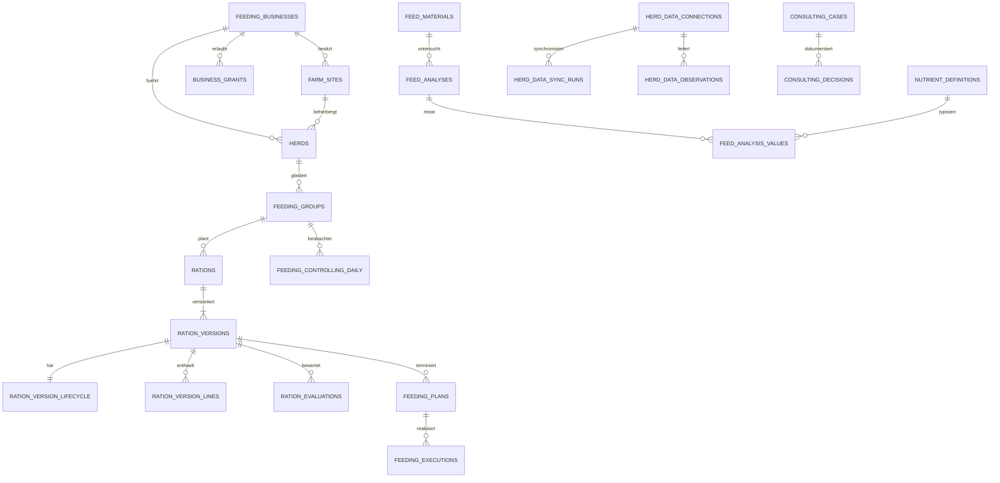

# 05 — Datenmodell

## 1. Zweck und Verbindlichkeit

Dieses Kapitel definiert das logische Gesamtmodell und ordnet jedem Objekt seine
physische Quelle und seinen Lieferstatus zu. Für ausgelieferte Tabellen ist die
jeweilige Alembic-Migration normativ. Zieltabellen sind fachliche Verträge, aber
noch kein Nachweis einer produktiven Implementierung.

- **BESTAND**: Migration und Laufzeitcode sind vorhanden.
- **IN ARBEIT**: ein reservierter Slice implementiert den Vertrag.
- **GEPLANT**: fachlich beschlossen, physischer Vertrag folgt separat.
- **EXTERN**: Referenz auf einen anderen Bounded Context; keine lokale Kopie.

## 2. Globale Modellierungsregeln

| ID | Regel |
|---|---|
| FEED-DATA-001 | Jede fachliche Zeile trägt direkt oder transitiv `tenant_id`; tenantübergreifende Fremdschlüssel sind verboten. |
| FEED-DATA-002 | Fachliche IDs sind opake Strings/UUIDs ohne Clientsemantik. |
| FEED-DATA-003 | Mengen und Preise werden als `NUMERIC`, nie als binäre Fließkommazahl persistiert. |
| FEED-DATA-004 | Einheiten stehen im Schema oder versionierten Nährstoffkatalog. |
| FEED-DATA-005 | Rationsversionen und freigegebene Analysen sind append-only; Korrekturen erzeugen Versionen. |
| FEED-DATA-006 | JSONB ist nur für signierte Snapshots, Rohpayloads oder providerabhängige Erweiterungen zulässig. |
| FEED-DATA-007 | Personenbezug wird minimiert; keine kopierten Benutzerprofile. |
| FEED-DATA-008 | Zeitpunkte sind `TIMESTAMPTZ` in UTC, Produktionstage `DATE`. |
| FEED-DATA-009 | Jede externe Lieferung besitzt Idempotenzschlüssel, Quellversion oder Payload-Hash. |
| FEED-DATA-010 | Freigabe-, Audit- und Beratungsnachweise werden nicht hart gelöscht. |
| FEED-DATA-011 | Tabellen liegen in `domain_agrar`; Tenant, Partner, Artikel und Bestand bleiben in ihren Contexts. |
| FEED-DATA-012 | Neue Indizes benötigen eine dokumentierte Query. |

## 3. Tenant-, Sicherheits- und Auditmodell

`tenant_id` stammt aus dem authentifizierten Kontext, nie aus einem unvalidierten
Request-Feld. `business_id` schränkt innerhalb des Tenants weiter ein. Repository-
Abfragen filtern mindestens Tenant und gegebenenfalls erlaubten Betrieb.

Fachliche Eindeutigkeiten beginnen mit `tenant_id`. Zeigt ein physischer FK nur
auf `id`, prüft die Service-Schicht vor dem Schreiben die Tenantgleichheit. Für
kritische Beziehungen werden zusammengesetzte FKs oder PostgreSQL-RLS evaluiert.

`business_grants` erweitert keine Rollenrechte. Wirksam ist die Schnittmenge aus
Plattformrolle, Tenantmitgliedschaft, Business-Grant und Objektzustand.

| Auditklasse | Beispiele | Persistenz |
|---|---|---|
| Fachereignis | Ration freigegeben, Analyse ersetzt | append-only Domain Event |
| Sicherheit | Grant vergeben/entzogen, Export verweigert | Security-/Operational-Audit |
| Integration | Sync, Quarantäne, Retry | Sync-/Importjournal |
| Stammdaten | Gruppe oder Material editiert | Zeitstempel plus relevantes Ereignis |

Secrets, Tokens und vollständige personenbezogene Profile sind in Auditpayloads
verboten. Jedes Ereignis führt Tenant, Objekt, Akteur, Zeitpunkt und Korrelation.

## 4. Schemaübersicht

## 5. Vollständiger Tabellenkatalog

### 5.1 Organisation und Berechtigung

#### `feeding_businesses` — BESTAND

Fütterungsfachliche Sicht auf einen Betrieb; Partnerstammdaten werden referenziert,
nicht dupliziert.

| Spalte | Typ | Pflicht | Bedeutung |
|---|---|---:|---|
| id | VARCHAR PK | ja | opake Betriebs-ID |
| tenant_id | VARCHAR FK | ja | Tenant |
| business_partner_id | VARCHAR(64) | nein | Link zum Partnerstamm |
| name | VARCHAR(240) | ja | fachlicher Anzeigename |
| production_type/husbandry_form | VARCHAR(80) | nein | Produktions- und Haltungsprofil |
| feeding_system/milking_system | VARCHAR | nein | betriebliche Systeme |
| advisory_status | VARCHAR(40) | ja | Beratungsstatus |
| preferences | JSONB | ja | additive betriebliche Einstellungen |
| active | BOOLEAN | ja | aktive fachliche Projektion |
| created_by/at | VARCHAR/TIMESTAMPTZ | ja | Anlageaudit |
| updated_by/at | VARCHAR/TIMESTAMPTZ | ja | Änderungsaudit |

Quelle: `feed_core_business_20260715.py`. Indizes: `(tenant_id,active,name)` und
unique `(tenant_id,business_partner_id)`. Deaktivierte Betriebe bleiben referenzierbar.

#### `farm_sites`, `herds`, `feeding_business_grants` — BESTAND

`farm_sites` hält Standortname, Adresse und Aktivstatus. `herds` hält stabile
Herdenidentität, Tierart und optionale Standortzuordnung. Der Service erzwingt,
dass eine Herde nur auf einen Standort desselben Betriebs und Tenants verweist.

Ein Grant enthält `tenant_id`, `business_id`, `subject`, Scope (`read`, `write`,
`approve`, `admin`), Gültigkeit, Vergabe- und Widerrufsnachweis. Widerrufene
Grants werden nicht gelöscht; ein partieller Unique-Index verhindert doppelte
aktive Grants und erlaubt revisionssichere Neuvergabe.

### 5.2 Tierbestand und Gruppen

#### `feeding_groups` — BESTAND

Quellen: `feed_advice_lifecycle_20260714.py`, `feed_core_business_20260715.py`
und `feed_core_groups_20260715.py`. Gruppe, Tierart, typisiertes Profil,
Tierzahl, Körpermasse, Laktationsparameter, Milchziel/-fett/-protein/-harnstoff,
Trächtigkeitstag, Risiko, Gültigkeit, Fütterungssystem und Ort.
`animal_count >= 0`; `external_ref` ist tenantweit eindeutig. Die additive
Migration `feed_core_business_20260715.py` ergänzt nullable Business-/Herd-FKs;
der administrative Backfill ordnet Bestandsgruppen kontrolliert zu. `revision`
schuetzt optimistische Updates; Wertebereiche und Cross-Field-Regeln liegen als
API-/Domainvalidierung und DB-Checks vor.

#### `feeding_group_revisions` — BESTAND

Append-only Snapshot jeder Anlage/Aenderung: Tenant, Gruppe, Revision, JSONB-
Snapshot, Pflichtgrund, Actor und Zeitpunkt. Unique `(tenant_id,group_id,revision)`;
ein Trigger verbietet Update und Delete. Legacygruppen erhalten idempotent
Revision 1 mit Grund `Bestandsuebernahme`.

#### `animal_group_memberships` — GEPLANT

Zeitliche Tierzuordnung: `tenant_id`, `herd_id`, `group_id`, externe Tier-ID,
`valid_from`, `valid_until`, Quelle und Quellreferenz. Ein Exclusion Constraint
verhindert überlappende Gruppenzuordnungen. Roh-Tierdetails bleiben beim Provider.

#### `group_requirement_profiles` — GEPLANT

Versionierter Bedarfskontext je Gruppe: Tierklasse, Lebendmasse, Leistung,
Laktation, Trächtigkeit, Haltung, Klima, Bewegung und Normsystemversion. Unique
`(tenant_id,group_id,version_no)`; Gültigkeitszeiträume überlappen nicht.

### 5.3 Futtermittel, Nährstoffe und Analysen

#### `feed_materials` — GEPLANT

Fachlicher Futtermittelstamm mit Betrieb, Artikelreferenz, Code, Kategorie,
Herkunft, Trockensubstanzbasis, Standarddichte, Lieferant und Aktivstatus. Kein
Lagerbestand. Unique `(tenant_id,business_id,code)`, Suchindex auf normalisiertem
Namen/Code, Filterindex auf Betrieb, Kategorie und Status.

#### `nutrient_definitions` — GEPLANT

Versionierter Katalog aus stabilem Nährstoffcode, Dimension, Basiseinheit,
Bezugsbasis (`as_fed`, `dry_matter`, `organic_matter`), Präzision und Wertebereich.
Formeln referenzieren Codes, nicht UI-Texte.

#### `feed_analyses` und `feed_analysis_values` — GEPLANT

Der Analysekopf enthält Futtermittel, Probe, Labor, Datumswerte, Methodensystem,
Status (`draft`, `validated`, `released`, `superseded`, `rejected`), Dokumenthash,
Version und `supersedes_analysis_id`. Nur `released` darf berechnet werden.

Werte enthalten Nährstoffcode, Dezimalwert, Einheit, Basis, Nachweisgrenze,
Messunsicherheit, Methode und Qualifikator. Unique `(tenant_id,analysis_id,
nutrient_code)`. Vor Berechnung erfolgt kanonische Einheitenkonvertierung.

#### `feed_price_versions`, `feed_availability_windows` — GEPLANT

Preise besitzen Betrag, Währung, Preisart, Standort, Herkunft, Freigabe und ein
nicht überlappendes Gültigkeitsintervall. Verfügbarkeit bildet Min/Max-Mengen und
optional eine Inventory-Lot-Referenz ab, ersetzt aber keine Lagerbuchung.

### 5.4 Rationen und Bewertung

#### `rations`, `ration_versions` — BESTAND

Der editierbare Kopf hält Gruppe, Name und Beschreibung. Inhalt liegt in einer
unveränderlichen Version mit Nummer, JSONB-Snapshot, SHA-256-Prüfsumme, Quelle und
Vorgänger. Ein Datenbanktrigger verhindert Update/Delete. Unique gelten für
Versionsnummer und Snapshotchecksumme innerhalb der Ration.

Der Snapshot ist atomarer Reproduktionsnachweis. Normalisierte Projektionen müssen
deterministisch daraus erzeugbar sein.

#### `ration_version_lines` — GEPLANT

Positionen mit `version_id`, Zeilennummer, Material-/Analyse-ID, Frisch-/Trocken-
masse, Preis-Snapshot, Einmischreihenfolge und Min/Max. Unique je Version/Zeile und
nach Versionserzeugung unveränderlich.

#### `ration_version_lifecycle`, `ration_audit_events` — BESTAND

Status: `draft`, `in_review`, `approved`, `scheduled`, `active`, `retired`,
`archived`. Partial Unique Index garantiert höchstens eine aktive Version je
Gruppe. Audit hält Statuswechsel, Akteur, Grund und Delta als Timeline.

#### `ration_evaluations`, `ration_evaluation_findings` — GEPLANT

Reproduzierbare Bewertung gegen genau eine Anforderungsprofil- und Regelversion
mit Input-/Engine-Checksumme. Findings führen stabilen Regelcode, Severity, Ist,
Soll/Grenzen, Einheit, betroffene Position und begründete Empfehlung.

#### `optimization_runs`, `optimization_candidates` — GEPLANT

Run enthält Zielmodell, Solver-/Regelversion, Constraints, Seed, Status, Laufzeit,
Abbruchgrund und Inputhash. Candidate enthält Rang, Zielwerte, Snapshot und
Feasibility. Übernahme erzeugt immer eine neue Rationsversion.

### 5.5 Planung, Ausführung und Soll-Ist

#### `feeding_plans`, `feeding_plan_batches` — GEPLANT

Plan terminiert eine freigegebene Version für Gruppe, Schicht und Zeitraum.
Status: draft, released, exported, executing, completed, cancelled. Batches halten
Zielmenge, Tierzahl, Skalierung, Gerät, Reihenfolge, Rundung und Zielpositionen.

#### `feeding_executions`, `feeding_execution_lines` — GEPLANT

Ist-Ausführung mit Plan, Zeit, Gerät, Operator, Tierzahl, Kontext und Quellreferenz.
Positionen halten Ziel-/Istmenge, Toleranz, Substitution und Quellenqualität.
Korrekturen sind neue Observations mit Vorgängerreferenz.

#### `feeding_controlling_daily` — BESTAND

Tägliche Gruppenbeobachtung mit DMI, Kosten, Milch, Fett, Protein, ECM,
N-Effizienz und Methan. Unique `(tenant_id,group_id,observation_date,source,
source_ref)`. `cow_count` ist für gewichtete Aggregationen maßgeblich.

### 5.6 Beratung und Zusammenarbeit — GEPLANT

`consulting_cases` bildet Anlass, Ziel, Verantwortlichen, Betrieb/Gruppe, Status,
Termin und Vertraulichkeit ab. `consulting_decisions` ist append-only und verknüpft
Hypothese, Evidenz, Beschluss, Verantwortlichen und Wirksamkeitsprüfung.
`consulting_tasks` und `consulting_comments` unterstützen Nachverfolgung; nach
Freigabe werden Kommentare nur durch Nachtrag korrigiert.

### 5.7 Integrationen

#### `herd_data_connections`, `herd_data_sync_runs` — BESTAND

Connection hält Provider, externe Herde, Basis-URL, Endpoint-Templates,
Queryparameter, Credential-Environment-Key, Vertrag, Consent und zweistufiges
Live-Gate. Secrets liegen nicht in der DB. Sync Runs halten Delta-Cursor, Status,
Zähler, Fehler und Laufzeit. Cursorfortschritt erfolgt erst nach erfolgreichem Run.

#### `herd_data_observations` — BESTAND

Providerneutrale Observation mit Entität, fachlichem Zeitpunkt, Providerupdate,
Gruppenwechsel, Löschmarker, Payload und Hash. Unique verhindert doppelte Delta-
Ingestion.

#### `rations_integration_imports` — BESTAND

Importjournal mit Adapter, externer ID, Quellversion, Payloadhash, Zielmodell und
Ergebnis. Unique `(tenant_id,adapter,external_id)`.

#### `connector_quarantine_entries` — GEPLANT

Fehlerklasse, redigierter Payload, Retry-Zähler und Disposition (`pending`,
`retried`, `resolved`, `dead_letter`). Unbekannte Einheiten oder Tierbewegungen
werden nie still übersprungen.

#### `mixer_export_jobs`, `mixer_export_receipts` — GEPLANT

Job hält unveränderlichen Rations-/Plan-Snapshot, Adapter, Status, Idempotenz und
Freigabe. Receipt hält Providerquittung und Prüfsumme. Rückimportierte Istmengen
referenzieren beide.

## 6. Historisierung

| Objekt | Strategie | Korrektur |
|---|---|---|
| Betrieb/Standort/Herde | Type-1 plus Audit | Feld ändern, Ereignis schreiben |
| Gruppenzusammensetzung | Gültigkeitsintervalle | Intervall schließen/neu öffnen |
| Analyse | append-only Version | neue Analyse mit `supersedes` |
| Preis | Gültigkeitsintervalle | Zeitraum schließen |
| Ration | unveränderliche Version | neue Version |
| Bewertung | reproduzierbarer Run | neuer Run |
| Plan | Status plus Snapshot | Revision vor Ausführung |
| Ausführung | append-only Observation | Korrekturobservation |
| Beratung | append-only Entscheidung | Nachtrag |
| Connector | Runjournal plus Observation | Retry/Disposition |

## 7. Index-, Partitions- und Retentionstrategie

1. Worklists: `(tenant_id,business_id,status,updated_at desc)`.
2. Zeitreihen: `(tenant_id,group_id,effective_date desc)`; bei Bedarf monatliche
   Range-Partitionen für Observations und Audit.
3. Idempotenz: unique auf Tenant, Provider/Quelle und Quellschlüssel.
4. JSONB-GIN nur für nachgewiesene stabile Queries.
5. Partial Indices für aktive Ration, Grants und offene Quarantäne.
6. Normalisierte Suchspalten statt Wildcards auf Rohpayloads.

Rations-/Freigabenachweise werden standardmäßig zehn Jahre konfigurierbar
archiviert; Rohpayloads 90 Tage, abgeschlossene Quarantäne 180 Tage und technische
Logs 30–90 Tage. Konkrete Fristen sind Rechtsraum-/Tenantkonfiguration und ein
externes Legal-/Datenschutz-Gate.

## 8. Migrationsreihenfolge

1. FEED-CORE-015: Business, Site, Herd, Grants, Gruppenzuordnung.
2. FEED-DATA-MASTER: Material-, Nährstoff- und Analysemodell.
3. FEED-DATA-RATION: normalisierte Positionen und Evaluationen.
4. FEED-DATA-PLAN: Plan, Batch, Execution und Positionen.
5. FEED-DATA-CONSULT: Fall, Entscheidung, Aufgabe und Kommentar.
6. FEED-DATA-CONNECT: Quarantäne, Mixer-Jobs und Receipts.
7. Nach Pilotmessung: Partitionierung ohne API-Vertragsänderung.

Jeder Schritt benötigt Forward-/Downgrade-Test, Tenant-Leak-Test, Backfill mit
Zählprotokoll, Query-Plan-Nachweis und aktualisierte Traceability.

## 9. Offene Entscheidungen

| ID | Frage | Gate |
|---|---|---|
| FEED-DATA-ADR-001 | Zusammengesetzte Tenant-FKs oder zusätzliche RLS? | Security-/Performance-Test |
| FEED-DATA-ADR-002 | Rationslinien Tabelle oder Projektion? | Reporting-/Write-Benchmark |
| FEED-DATA-ADR-003 | TimescaleDB für Zeitreihen? | Pilotvolumen |
| FEED-DATA-ADR-004 | Rechtsverbindliche Archivschnittstelle? | Legal/Compliance |
| FEED-DATA-ADR-005 | Tier-Level-Daten lokal oder providerseitig? | Datenschutz/Minimierung |

## 10. Abnahme

- Jede Tabelle ist Aggregate oder Projektion zugeordnet.
- Migrationen erzwingen Kerninvarianten zusätzlich zur API.
- Tenant-/Business-Isolation ist negativ getestet.
- Freigegebene Rationen und Analysen sind reproduzierbar.
- Importe sind idempotent, beobachtbar und quarantänefähig.
- Daten-, API-, DDD- und Traceability-Begriffe stimmen überein.

## 11. Ist-Ausbau FEED-CORE-017

| Tabelle | Scope/Schluessel | Invarianten |
|---|---|---|
| `domain_agrar.feeding_unit_definitions` | global (`tenant_id NULL`) oder Tenant + `code` | Faktor > 0, Praezision 0..12, Revision > 0 |
| `domain_agrar.feeding_nutrient_definitions` | global oder Tenant + `code` | kontrollierte FM/TM-Basis und ValueKind; max >= min |
| `domain_agrar.feeding_reference_revisions` | Scope + Typ + Entitaet + Revision | append-only Trigger, JSONB-Snapshot, Grund/Akteur/Zeit |

Die Migration `feed_core_reference_data_20260715` seeded Einheiten und einen
erweiterbaren DLG-/VALEO-Ausgangskatalog idempotent. Der effektive Read-Pfad
bevorzugt eine tenantgebundene Definition vor dem globalen Code. Bestehende
Solver-Tabellen bleiben unveraendert.

## 12. Ist-Ausbau FEED-CORE-018

- `domain_shared.futtermittel_einzelfutter` bleibt der Feed-Kopf und traegt
  additiv `feed_kind`, Tierartscope, Konservierung, Freigabe, Gueltigkeit und
  optimistische Revision.
- `domain_agrar.feeding_feed_reference_values` speichert beliebige
  Naehrstoffwerte mit Einheit, Basis, Status, Quelle, Prioritaet und Zeitbezug.
- `domain_agrar.feeding_feed_products` speichert Liefer-SKU, Gebinde,
  Mindestabnahme, Preis, Fracht und Zeitbezug.
- `domain_agrar.feeding_feed_revisions` bewahrt jeden Kopfstand append-only.

Migration und Backfill sind additiv; vorhandene Feed-/Artikel-/Bestands-IDs
bleiben stabil.

## 19. FeedAnalysis-Persistenz FEED-CORE-019

- Der bestehende Kopf `domain_shared.grundfutter_analysen` traegt Feed- und
  Scope-Bezug, Status, Aktivflag, Methode, Gueltigkeit, DMS-ID/SHA-256,
  optimistische Revision und Freigabeaudit.
- `feeding_feed_analysis_values` speichert Original- und Rechenwert,
  Original-/Recheneinheit, FM/TM-Basis, Methode, Konfidenz und Wertstatus.
- `feeding_feed_analysis_findings` speichert Info, Warnung oder Blocker ohne
  fehlende Werte in Null umzudeuten.
- `feeding_feed_analysis_revisions` ist triggergeschuetzt append-only.
- Ein partieller Unique-Index erlaubt hoechstens eine aktive `released` Analyse
  pro Tenant, Feed und `scope_code`.

Migration `feed_core_feed_analyses_20260715` ist linear, additiv und bewahrt
alle vorhandenen Analyse-IDs und Legacy-Messspalten.
