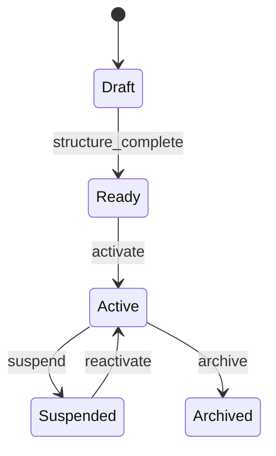
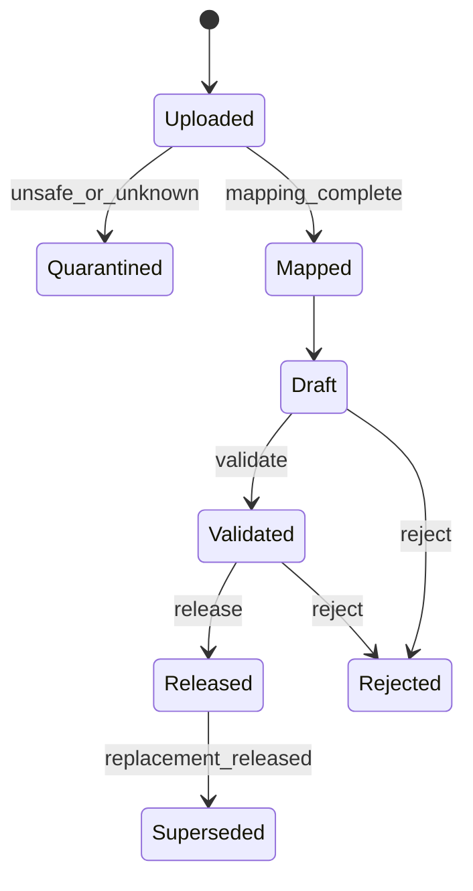
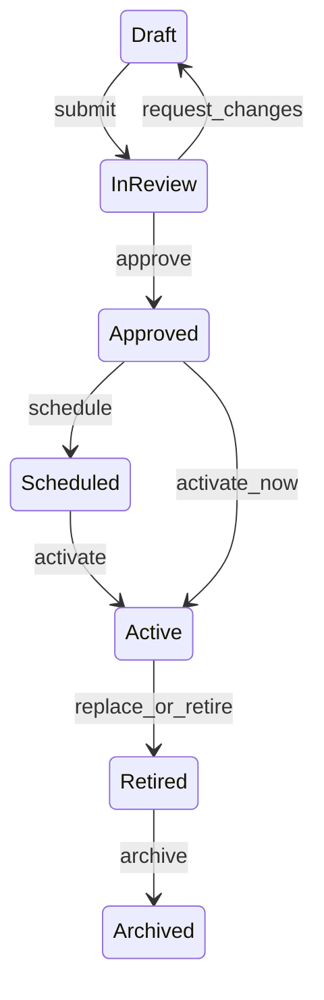
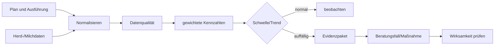

# 08 — Workflowkatalog

## 1. Zweck

Der Katalog beschreibt durchgängige fachliche Abläufe, nicht Klickfolgen einer
einzelnen Oberfläche. Jeder Workflow besitzt Auslöser, Rollen, Vorbedingungen,
Ergebnis, Zustände, Kompensationen, Audit und Testnachweise. UI-Masken und APIs
realisieren dieselben Commands und Zustandsübergänge.

## 2. Workflow-Prinzipien

| ID | Prinzip |
|---|---|
| FEED-WF-001 | Ein Zustandswechsel erfolgt nur über einen benannten Command. |
| FEED-WF-002 | Jeder Command validiert Rolle, Tenant, Betrieb, Zustand und fachliche Invarianten. |
| FEED-WF-003 | Nicht reversible Aktionen verlangen Dry-run/Propose und gegebenenfalls Bestätigung. |
| FEED-WF-004 | Freigaben dokumentieren Entscheidung, Evidenzstand, Akteur und Zeitpunkt. |
| FEED-WF-005 | Externe Nebenwirkungen sind idempotent und werden über Outbox/Jobjournal beobachtet. |
| FEED-WF-006 | Fehler nach externem Commit werden kompensiert, nicht durch Datenbankrollback verschleiert. |
| FEED-WF-007 | KI-Agenten schlagen Commands vor; Policy und Mensch kontrollieren risikobehaftete Ausführung. |
| FEED-WF-008 | Blocking Reasons sind maschinenlesbar und mit konkreter Abhilfe versehen. |
| FEED-WF-009 | Wiederaufnahme nach Abbruch nutzt persistierten Zustand und Korrelation. |
| FEED-WF-010 | Jeder Abschluss erzeugt messbare fachliche Ergebnisse oder einen begründeten Abbruch. |

## 3. Gemeinsamer Command-Vertrag

```json
{
  "command_id": "cmd_01J...",
  "aggregate_id": "rat_42",
  "expected_version": 7,
  "reason": "Neue Maissilageanalyse",
  "effective_at": "2026-07-20T04:00:00Z",
  "payload": {},
  "correlation_id": "corr_01J..."
}
```

Antworten enthalten `result`, neue Version/ETag, Domain Events, Warnungen,
Blocking Reasons und nächste erlaubte Aktionen. Commandwiederholung mit derselben
ID ist idempotent.

## 4. Rollen und Verantwortlichkeit

| Rolle | Verantwortet | Darf nicht allein |
|---|---|---|
| Farmer/Betriebsleiter | Ziele, Betriebskontext, operative Entscheidung | fremde Betriebe, Policy umgehen |
| Advisor | fachlicher Entwurf, Bewertung, Beratung | bei SoD eigenen Entwurf freigeben |
| Analyst | Analysezuordnung, Plausibilität, Provenienz | Ration aktivieren |
| Approver | unabhängige Freigabe | Evidenzblocker übergehen |
| Operator | Mischen, Füttern, Ist-Rückmeldung | freigegebene Ration verändern |
| Controller | Kosten-/Erfolgsbewertung | fachliche Gesundheitsfreigabe |
| Veterinär | Gesundheitskontext | ohne Consent Tierdetails exportieren |
| Tenantadmin | Struktur, Grants, Connectorpolicy | fachliche Freigabe ersetzen |
| Agent/Service | analysieren, vorschlagen, normalisieren | Grants/Freigaben autonom verändern |

## 5. Workflowübersicht

| ID | Workflow | Primäraggregate | Ergebnis |
|---|---|---|---|
| FEED-WF-101 | Betrieb aktivieren | FeedingBusiness | nutzbarer Betriebsscope |
| FEED-WF-102 | Analyse importieren/freigeben | FeedAnalysis | released Analyseversion |
| FEED-WF-103 | Ration neu anlegen | Ration | bewertbarer Entwurf |
| FEED-WF-104 | Ration optimieren | OptimizationRun/Ration | übernommener Candidate als Version |
| FEED-WF-105 | Varianten vergleichen | Ration/ConsultingCase | dokumentierte Auswahl |
| FEED-WF-106 | Ration prüfen/freigeben | RationVersionLifecycle | approved Version |
| FEED-WF-107 | Ration planen/veröffentlichen | FeedingPlan | released Plan |
| FEED-WF-108 | Mischwagen exportieren | MixerExportJob | quittierter Geräteauftrag |
| FEED-WF-109 | Fütterung ausführen | FeedingExecution | vollständige Ist-Ausführung |
| FEED-WF-110 | Soll-Ist kontrollieren | FeedingControlling | priorisiertes Signal/Maßnahme |
| FEED-WF-111 | Beratungsfall bearbeiten | ConsultingCase | Entscheidung plus Wirksamkeit |
| FEED-WF-112 | Herd-Data Delta-Sync | HerdDataConnection | normalisierte Observations |
| FEED-WF-113 | Analyse ersetzen | FeedAnalysis | neue released Version |
| FEED-WF-114 | Aktive Ration wechseln | RationLifecycle/Plan | kontrollierter Gruppenwechsel |
| FEED-WF-115 | Report erzeugen | ReportJob | autorisierte Momentaufnahme |

## 6. FEED-WF-101 — Betrieb aktivieren

### Ziel und Scope

Aus einem Partner oder einer Neuanlage entsteht ein fütterungsfachlicher Betrieb
mit Standort, Herde, Gruppe und expliziten Zugriffsrechten.

| Merkmal | Vertrag |
|---|---|
| Auslöser | Admin wählt „für Fütterung aktivieren“ oder legt Betrieb an. |
| Vorbedingungen | Tenant aktiv; Partnerzugriff erlaubt; kein aktiver Duplikatlink. |
| Hauptrollen | Tenantadmin; Betriebsverantwortlicher bestätigt Stammdaten. |
| Ergebnis | aktiver Business-Scope mit mindestens einem Standort/Herde/Gruppe oder klarer Setup-Aufgabe. |
| Events | `FeedingBusinessActivated`, `FarmSiteAdded`, `HerdAdded`, `BusinessGrantIssued`. |
| Audit | Herkunft, Admin, bestätigende Person, erzeugte IDs, Grants. |

Happy Path:

1. Quelle wählen und Tenant-/Partnerberechtigung prüfen.
2. Dry-run zeigt übernommene und nicht übernommene Partnerfelder.
3. Land, Zeitzone und fachlichen Anzeigenamen bestätigen.
4. Standort und Herde anlegen oder vorhandene referenzieren.
5. erste Fütterungsgruppe definieren/importieren.
6. Betriebsverantwortlichen mit minimalem Scope berechtigen.
7. Setup-Readiness berechnen und Betrieb aktivieren.

Ausnahmen: Duplikat → vorhandenen Betrieb verlinken; fehlende Zeitzone → Blocker;
teilweiser Backfill → transaktional je Betrieb und mit Wiederaufnahmecursor.



Abnahme: Fremdtenant bleibt unsichtbar; Grants werden nicht implizit tenantweit;
Backfill ist wiederholbar; Partnerdatenänderung überschreibt keine Fachdaten.

## 7. FEED-WF-102 — Analyse importieren und freigeben

| Merkmal | Vertrag |
|---|---|
| Auslöser | Datei, Laboradapter oder manuelle Erfassung. |
| Vorbedingungen | Material/Betrieb bekannt oder Mapping erlaubt; Importberechtigung. |
| Rollen | Analyst/Advisor importiert; Approver/Fachrolle gibt frei. |
| Ergebnis | unveränderliche released Analyse mit Provenienz und kanonischen Einheiten. |
| Events | `AnalysisImported`, `AnalysisMapped`, `AnalysisValidated`, `AnalysisReleased`. |

1. Upload/Providerpayload erhalten, Hash und Idempotenz prüfen.
2. Schadcode-/Formatprüfung; Original geschützt ablegen.
3. Laborfelder auf kanonische Nährstoffcodes und Einheiten mappen.
4. Material/Probe zuordnen; unsichere Zuordnung verlangt menschliche Bestätigung.
5. Werte konvertieren, Plausibilitäts- und Pflichtprüfungen ausführen.
6. Warnungen entscheiden; Blocker verhindern Freigabe.
7. unabhängige Freigabe erzeugt released Version und Readiness-Neuberechnung.
8. betroffene Entwürfe werden als „neue Analyse verfügbar“ markiert, nicht verändert.

Kompensation: Providerretry dupliziert nicht; unbekannte Einheit geht in Quarantäne;
falsches Mapping vor Release kann korrigiert, nach Release nur ersetzt werden.



Abnahme: Einheitenpräzision bleibt erhalten; Dokumenthash verhindert Duplikat;
Release ohne Provenienz/Scope scheitert; alte Rationen bleiben reproduzierbar.

## 8. FEED-WF-103 — Neue Ration

| Merkmal | Vertrag |
|---|---|
| Auslöser | Gruppe benötigt neue Ration; Kopie; neue Analyse; Beratung. |
| Vorbedingungen | autorisierte Gruppe und gültiges Bedarfsprofil. |
| Rollen | Advisor/Farmer erstellt; Analyst liefert Daten. |
| Ergebnis | unveränderliche Version im Status draft mit Bewertung. |
| Events | `RationCreated`, `RationVersionCreated`, `RationEvaluated`. |

1. Gruppe und gültiges Bedarfsprofil wählen.
2. optional Basisversion kopieren; Herkunft bleibt sichtbar.
3. Materialien mit konkreten Analyse-/Preisständen hinzufügen.
4. Mengen, Grenzen und Zielsetzung erfassen.
5. Readiness prüft Analyse, Preis, Verfügbarkeit und Einheiten.
6. Regelengine bewertet Nährstoffversorgung, Struktur, Kosten und Umwelt.
7. Blocker beheben oder fachlich zulässige Warnungen begründen.
8. Snapshot mit Checksummen als neue Version speichern.

Der Editor darf Autosave für einen Arbeitsentwurf verwenden, aber ein fachlich
gespeicherter Versionssnapshot ist atomar und unveränderlich. Konflikte werden als
Diff gezeigt, nie last-write-wins aufgelöst.

Abnahme: negative Mengen blockiert; Fremdmaterial unsichtbar; Snapshot exakt
reproduzierbar; Seitenreload verliert keinen bestätigten Entwurf.

## 9. FEED-WF-104 — Ration optimieren

| Merkmal | Vertrag |
|---|---|
| Auslöser | Nutzer startet Optimierung aus Entwurf/Bedarfsprofil. |
| Vorbedingungen | Readiness ohne Blocker; Solver-/Regelversion bereit. |
| Rollen | Advisor/Farmer startet; Agent darf Vorschlag vorbereiten. |
| Ergebnis | Kandidaten oder erklärtes infeasible Ergebnis; Übernahme als neue Version. |
| Events | `OptimizationStarted`, `OptimizationCompleted`, `CandidateAdopted`. |

1. Zielmodell wählen: Kosten, Robustheit, Umwelt oder gewichtetes Profil.
2. harte/weiche Constraints mit Quelle anzeigen.
3. Dry-run zeigt ausgeschlossene Materialien und fehlende Inputs.
4. Job speichert Inputhash, Engine-/Regelversion, Seed und Parameter.
5. Solver liefert Kandidaten mit Feasibility, Trade-offs und Sensitivität.
6. Nutzer vergleicht Candidate mit Basis; Agent erklärt nur belegte Differenzen.
7. Übernahme erzeugt neue draft-Version mit `based_on_version_id`.

Infeasible ist ein fachliches Ergebnis: Antwort nennt minimale Konfliktmenge und
mögliche Lockerungen. Timeout/Enginefehler ist technisch fehlgeschlagen und darf
nicht als fachlich unlösbar erscheinen.

Abnahme: gleicher Input/Engine/Seed reproduziert Ergebnis innerhalb definierter
Toleranz; Solver überschreibt nie; unzulässige Materialien bleiben ausgeschlossen.

## 10. FEED-WF-105 — Varianten vergleichen

1. Zwei bis fünf Versionen derselben Gruppe/Basis wählen.
2. Bewertungen auf kompatible Regel-/Preisstände bringen oder Unterschiede
   ausdrücklich markieren.
3. Mengen-, Nährstoff-, Struktur-, Kosten-, Robustheits- und Umwelt-Deltas zeigen.
4. Fehlende Werte als unbekannt mit Grund darstellen.
5. Trade-off und betroffene Inputs aufklappen.
6. Auswahl mit Begründung im Beratungsfall oder Audit dokumentieren.
7. Gewählte Variante als neue draft-Version übernehmen oder Review starten.

Rollen: Advisor führt, Farmer entscheidet, Approver prüft. Ein Ranking darf keine
fachlich ungeklärten Blocker verdecken. Abnahme: Vergleich ändert keine Version;
Preiszeitpunkt sichtbar; PDF entspricht Rollen-/Scopefilter.

## 11. FEED-WF-106 — Prüfen und freigeben



| Übergang | Pflichtprüfungen |
|---|---|
| draft → in_review | vollständiger Snapshot, Bewertung, keine technischen Blocker |
| in_review → draft | Grund und offene Punkte |
| in_review → approved | Approver-Scope, SoD, aktuelle Inputs, keine Blocking Findings |
| approved → scheduled | Gruppe, Start, konfliktfreier Plan |
| approved/scheduled → active | operative Readiness, höchstens eine aktive Version |
| active → retired | Ersatz oder begründete Stilllegung |
| retired → archived | keine operative Referenz, Retention eingehalten |

Ändert sich nach Einreichung ein referenzierter Preis oder eine Analyse, bleibt der
Snapshot intakt; das Review zeigt „neuere Quelle verfügbar“. Kritische Rückrufe
blockieren Freigabe/Aktivierung und erzeugen einen Sicherheitsfall.

Abnahme: SoD-Regel; jeder Übergang auditiert; parallele Aktivierung wird DB-seitig
verhindert; abgelehnte Version bleibt lesbar.

## 12. FEED-WF-107 — Planen und veröffentlichen

1. approved Rationsversion und Gruppe auswählen.
2. Gültigkeitsfenster, Schichten, Tierzahl und Batchprofil festlegen.
3. Mengen deterministisch skalieren und Rundungsdifferenz ausweisen.
4. Überlappung, Material-/Lotreadiness und Gerätefähigkeit prüfen.
5. Plan im Dry-run mit Batches und Ausnahmehinweisen anzeigen.
6. Plan freigeben; danach nur neue Revision oder Storno.
7. Kalender und Operator-Tagesliste aktualisieren.

Übergangsphase zwischen alter und neuer Ration ist explizit; sie darf nicht durch
zwei unkommentierte aktive Pläne entstehen. Abnahme: Zeitzone/Tagesgrenze korrekt;
Rundungssumme nachvollziehbar; Storno nach Ausführungsstart nur als Ausnahme.

## 13. FEED-WF-108 — Mischwagenexport

| Phase | Verhalten |
|---|---|
| Prepare | Plan, Ration, Einheitenprofil und Zielgerät snapshotten. |
| Validate | Grant, Freigabe, Gerät, Adapter, Limits und Mapping prüfen. |
| Propose | exportierte Batches/Mengen und Rundung anzeigen. |
| Commit | Exportjob mit Idempotenzschlüssel anlegen. |
| Deliver | Provideradapter senden; Quittung/Checksumme persistieren. |
| Reconcile | Providerstatus und gegebenenfalls Ist-Rücklauf zuordnen. |

Fehler vor Providerannahme sind retrybar. Nach unbekanntem Timeout wird zuerst per
Idempotenz-/Statusabfrage reconciled, bevor erneut gesendet wird. Ablehnung geht in
Quarantäne mit konkreter Mapping-/Limitursache.

Abnahme: Doppelklick erzeugt einen Auftrag; falsches Gerät blockiert; Export ist
bitgenau rekonstruierbar; Credential erscheint nie in Log/Audit.

## 14. FEED-WF-109 — Fütterung ausführen

1. Operator öffnet autorisierte Tagesliste und wählt Batch.
2. App prüft, ob Batch bereits begonnen/abgeschlossen ist.
3. Komponenten erscheinen in freigegebener Reihenfolge mit Ziel und Toleranz.
4. Waage oder Nutzer meldet Ist; innerhalb Toleranz genügt Bestätigung.
5. Außerhalb Toleranz: warnen oder klassenspezifisch blockieren; Grund erfassen.
6. Substitution benötigt erlaubtes Material und ggf. Supervisorfreigabe.
7. Auslieferung an Gruppe bestätigen; Rest-/Verlustmenge erfassen.
8. Abschluss erzeugt immutable Execution und Controlling-Observation.
9. Offlinequeue synchronisiert idempotent; Konflikt geht in Review.

Abnahme: Einhand-/Offlineflow; kein doppelter Batch; QS-gesperrtes Lot blockiert;
Soll/Ist bleibt auf Rationsversion und Plan zurückführbar.

## 15. FEED-WF-110 — Soll-Ist kontrollieren



Tierzahlgewichtung ist verbindlich. Signale benötigen Mindestabdeckung und
Hysterese, damit einzelne Ausreißer keine Alarmflut erzeugen. Schätzwerte, etwa
Methan, bleiben als geschätzt markiert.

Ergebnis: normaler Verlauf, beobachtungswürdiges Signal oder kritischer Blocker.
Abnahme: fehlende Tierzahl degradiert Qualität; Datenquelle/Stand sichtbar;
Trendpunkt ist bis Observation und Rationsversion drillbar.

## 16. FEED-WF-111 — Beratungsfall

1. Signal, Kundenanfrage oder Review eröffnet Fall mit Ziel.
2. Advisor sammelt verlinkte Evidenz, ohne Daten zu kopieren.
3. Hypothese wird als Hypothese, nicht als Diagnose dokumentiert.
4. Entscheidung nennt Option, Begründung, Verantwortlichen und Fälligkeit.
5. Rationsänderung/Aufgabe wird in zuständigem Aggregate ausgeführt und verlinkt.
6. Monitoringzeitraum und Erfolgskriterien festlegen.
7. Wirkung anhand Soll-Ist/Leistung prüfen.
8. Fall mit Ergebnis schließen oder mit Begründung neu öffnen.

Interne und kundenfreigegebene Notizen sind getrennt. Veterinärische Hinweise
werden nicht als automatisierte Diagnose ausgegeben. Abnahme: Abschluss ohne
Ergebnis scheitert; jede Entscheidung besitzt Evidenzstand und Verantwortlichen.

## 17. FEED-WF-112 — Herd-Data Delta-Sync

1. Scheduler erzeugt Run aus letztem erfolgreich bestätigtem Cursor.
2. Connection, Vertrag, Consent, Credential und Live-Gate prüfen.
3. Providerseiten mit `updated_since`/Cursor abrufen; Rate Limits respektieren.
4. Payload gegen versionierten Providervertrag validieren.
5. In kanonische Observation-Typen normalisieren.
6. Hash/Unique-Key dedupliziert; Moves und Deletions werden explizit persistiert.
7. Unbekannte Felder/Einheiten in Quarantäne, valide Zeilen dürfen policyabhängig
   weiterlaufen.
8. Aggregatprojektionen und Controlling deterministisch aktualisieren.
9. Cursor erst nach Persistenz und Journalabschluss bestätigen.
10. Metriken, Runstatus und Benachrichtigung schreiben.

Kompensation: Seite N fehlgeschlagen → ab bestätigtem Cursor wiederholen;
Credentialfehler → suspendieren statt Endlosschleife; nach Contractdrift kein
stilles Feldfallenlassen.

Abnahme: wiederholter Run dupliziert nicht; Löschung/Move korrekt; Cursorverlust
führt höchstens zu Wiederholung, nie Datenlücke; Mockmodus benötigt keine Live-API.

## 18. FEED-WF-113 — Analyse ersetzen

1. Released Analyse auswählen und Korrekturgrund erfassen.
2. Neue Draftversion mit Herkunft erzeugen; alte bleibt unverändert.
3. Werte/Dokument korrigieren und vollständig neu validieren.
4. Unabhängig freigeben.
5. Alte Analyse auf superseded setzen und neue verlinken.
6. Aktive/geplante Rationen mit betroffener alter Analyse identifizieren.
7. Kritikalität bewerten: Information, Reviewpflicht oder Aktivierungsblocker.
8. Niemals bestehende Rationssnapshots still umschreiben.

Abnahme: Historie lückenlos; Wirkungsliste vollständig; Rückruf erzeugt Aufgaben;
alte Berechnungen bleiben reproduzierbar.

## 19. FEED-WF-114 — Aktive Ration wechseln

1. Neue Version muss approved und operativ ready sein.
2. Wechselzeitpunkt und optional Übergangsplan definieren.
3. Konflikt mit aktiver/geplanter Ration prüfen.
4. Dry-run zeigt alte/neue Mengen, Materialbedarf, Geräteplan und Risiken.
5. Wechsel planen oder sofort mit erhöhtem Bestätigungsniveau aktivieren.
6. Zeitpunkt atomar: alte active → retired, neue scheduled/active → active.
7. Operator und Beteiligte informieren; Controlling-Baseline setzen.
8. erste Wirksamkeitskontrolle terminieren.

DB-Constraint verhindert zwei aktive Versionen. Scheitert eine externe
Benachrichtigung, bleibt der fachliche Wechsel committed und die Zustellung wird
retrybar nachgeführt.

## 20. FEED-WF-115 — Report erzeugen

1. Rollenprofil und autorisierten Scope wählen.
2. Zeitraum, Versionen und Inhalt validieren.
3. Datenstand und Checksummen snapshotten.
4. Job erzeugt PDF/CSV mit Quellen-, Einheiten- und Statushinweisen.
5. Ergebnis wird verschlüsselt abgelegt; Downloadtoken kurzlebig binden.
6. Download und planmäßige Zustellung auditieren.
7. Ergebnis nach Retention ablaufen lassen.

Abnahme: Rollenfilter serverseitig; Report ist aus Snapshot reproduzierbar;
abgelaufener/entzogener Zugriff funktioniert nicht; große Jobs blockieren API
nicht.

## 21. Übergreifende Blocking Reasons

| Code | Bedeutung | Abhilfe |
|---|---|---|
| FEED_BLOCK_ANALYSIS_MISSING | keine freigegebene Analyse | Analyse importieren/freigeben |
| FEED_BLOCK_ANALYSIS_RECALLED | Analyse kritisch zurückgerufen | Ersatz prüfen und Version neu bewerten |
| FEED_BLOCK_REQUIREMENT_INVALID | Bedarfsprofil unvollständig | Gruppe/Profil korrigieren |
| FEED_BLOCK_RULESET_UNAVAILABLE | Regelversion nicht validiert | aktive validierte Version wählen |
| FEED_BLOCK_PRICE_STALE | Preis älter als Policy | Preis aktualisieren oder begründet bestätigen |
| FEED_BLOCK_STOCK_SHORTAGE | Material nicht verfügbar | Plan/Menge/Material ändern |
| FEED_BLOCK_QS_LOT | Lot nicht freigegeben | anderes Lot oder QS-Freigabe |
| FEED_BLOCK_APPROVAL_REQUIRED | fachliche Freigabe fehlt | Review starten |
| FEED_BLOCK_SOD | Einreicher darf nicht freigeben | unabhängigen Approver zuweisen |
| FEED_BLOCK_PLAN_CONFLICT | Zeit-/Gruppenkonflikt | Plan verschieben/Übergabe definieren |
| FEED_BLOCK_DEVICE_MAPPING | Gerät/Einheit nicht gemappt | Connector-Setup korrigieren |
| FEED_BLOCK_CONSENT | Providerdaten ohne Consent | Consent/Vertrag klären |

## 22. Benachrichtigungsregeln

Benachrichtigungen entstehen aus Ereignis plus Policy, nicht direkt aus UI-Code.
Kritische Rückrufe und heutige Ausführungsblocker sind sofortig; Reviewaufgaben
zeitnah; Trends werden gebündelt. Nutzer können Kanäle konfigurieren, aber keine
gesetzlich/fachlich zwingenden Sicherheitsmeldungen vollständig deaktivieren.

Jede Nachricht enthält Betrieb/Gruppe, Bedeutung, Fälligkeit, sichere Deep-Link-
Aktion und keine unnötigen Tier-/Gesundheitsdetails.

## 23. Workflow-Testmuster

Für jeden Workflow sind mindestens nachzuweisen:

1. Happy Path mit fachlichem Endergebnis.
2. fehlende Rolle und fehlender Business-Grant.
3. Fremdtenant-/Fremdbetriebszugriff.
4. ungültiger Ausgangszustand.
5. veraltete Aggregateversion/ETag.
6. identische Commandwiederholung.
7. konkurrierende Commands.
8. technischer Fehler vor Persistenz.
9. Fehler nach externer Nebenwirkung samt Reconciliation.
10. Audit, Events und Benachrichtigung.
11. UI-Wiederaufnahme nach Reload/Offline.
12. Accessibility von Blocker, Fehler und Bestätigung.

## 24. Definition of Done

- Domain, API, ScreenDefinition und Tests verwenden identische Zustände/Commands.
- Jeder Übergang hat Guard, Audit und stabile Fehler-/Blocking-Codes.
- Externe Calls sind idempotent, beobachtbar und kompensierbar.
- Happy Path und wichtigste Ausnahme sind als Integrations-/E2E-Test belegt.
- Menschliche Freigabe kann durch Agenten nicht umgangen werden.
- Workflowmetriken messen Durchlauf, Wartezeit, Fehler und Abbruch ohne sensible
  Payloaddaten.
- Dokumentation verweist auf implementierte Source-of-Truth-Dateien und wird bei
  Vertragsänderung im selben Slice aktualisiert.
