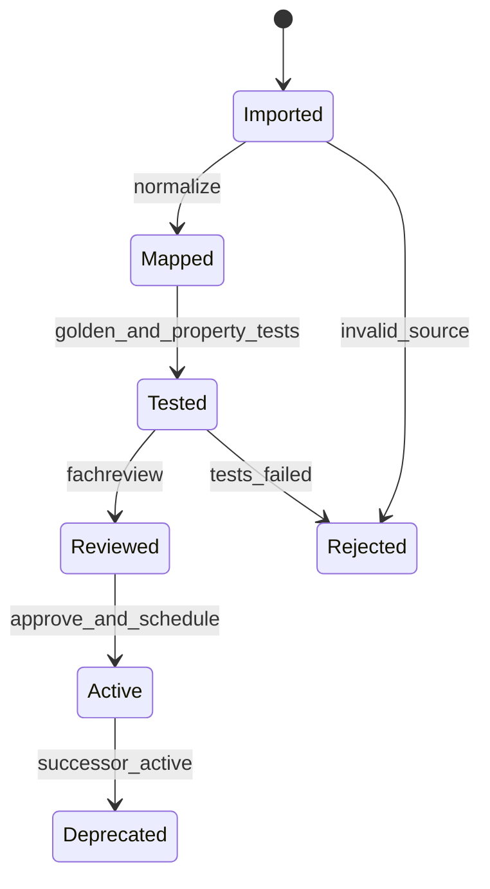

# 09 — Berechnungs- und Regelwerk

## 1. Normativer Vertrag

Dieses Kapitel ist Regelkatalog und Traceability, keine zweite Implementierung der
Formeln. Normativ für Rechenergebnisse sind versionierter Code, geladene
Regeldaten, Primärquellenreferenz und Golden Tests. Zahlen werden hier nur genannt,
wenn sie bereits als überprüfbare Konstante im Repository vorliegen. Neue GfE-,
DLG- oder NRC-Werte benötigen Fachreview und einen eigenen Regelslice.

Status:

- **IMPLEMENTIERT**: Code und Tests vorhanden.
- **TEILWEISE**: fachliche Teilmenge vorhanden; Einsatzbereich begrenzt.
- **GEPLANT**: gefordert, aber kein freigegebener Rechenvertrag.
- **EXTERNES GATE**: Primärquelle/Lizenz/Fachfreigabe noch erforderlich.

## 2. Regelengine-Grundsätze

| ID | Regel |
|---|---|
| FEED-RULE-001 | Jeder Rechenlauf speichert Regelwerk-, Engine- und Inputversion/Checksumme. |
| FEED-RULE-002 | Einheiten und Bezugsbasis werden vor der Formel kanonisch normalisiert. |
| FEED-RULE-003 | Fehlende Werte werden nicht still als 0 ersetzt, außer die konkrete Regel definiert dies ausdrücklich. |
| FEED-RULE-004 | Gültigkeitsbereich einer Formel wird geprüft und als Finding ausgegeben. |
| FEED-RULE-005 | Fachgrenzwerte, Praxisdefaults und Solverparameter sind getrennte Klassen. |
| FEED-RULE-006 | Harte Constraints verhindern unzulässige Kandidaten; weiche Ziele erzeugen Penalties/Findings. |
| FEED-RULE-007 | Eine Warnung enthält Code, Severity, Evidenz, Grenze, Einheit und Abhilfe. |
| FEED-RULE-008 | Keine automatische Diagnose; Gesundheitssignale sind fachlich zu prüfen. |
| FEED-RULE-009 | Regelupdates werden validiert und freigegeben, nie ungeprüft live aktiviert. |
| FEED-RULE-010 | Rundung erfolgt nur für Anzeige/Export; intern wird mit definierter Dezimalpräzision gerechnet. |

## 3. Quellen- und Prioritätsmodell

| Priorität | Klasse | Beispiel | Konfliktregel |
|---:|---|---|---|
| 1 | Recht/Sicherheit/Produktfreigabe | QS-Sperre, verbotener Stoff | immer blockierend |
| 2 | validierte Fachnorm | GfE/DLG-Regelversion | gilt im deklarierten Scope |
| 3 | betrieblich freigegebene Policy | Materiallimit, Zielkorridor | darf Norm nicht unzulässig lockern |
| 4 | Beratungsvorgabe | Ziel, Präferenz, Variante | begründbar/änderbar |
| 5 | Solverdefault | Penalty, Relaxationsstrategie | technische Policy, kein Fachgesetz |
| 6 | UI-Default | Ansicht, Vorbelegung | niemals Berechnungswahrheit |

Bei Normkonflikt wird nicht „der strengere Wert“ blind gewählt. Regelset, Tierart,
Produktionsphase, Region und Gültigkeitsdatum entscheiden. Ungeklärte Konflikte
blockieren Freigabe und nennen beide Quellen.

## 4. Regelmetamodell

Jede Regeldefinition besitzt:

```yaml
rule_id: FEED-GFE23-FAN-001
status: implemented
ruleset: GFE_2023_DLG_2025
scope: dairy_cow
inputs: [fani_in, feed_properties]
outputs: [fani_out, convergence_delta]
unit_contract: dimensionless
validity: {min: 2.0, max: 5.0}
severity_policy: {outside_validity: blocking, not_converged: warning}
implementation: app/agrar/rations/...
tests: [tests/test_rations_optimization_fan_mode_003_iteration.py]
source_ref: versionierte Primärquellenreferenz
```

## 5. Regelset-Inventar

| Regelset | Status | Einsatz |
|---|---|---|
| GfE Workshop 2023 / deutsches Milchkuhmodell | TEILWEISE/IMPLEMENTIERT | FAN, Bedarf, Futterbewertung |
| DLG-Information 01/2025 | TEILWEISE/IMPLEMENTIERT | Struktur, pabKH, FAN, Effizienz, DCAB, Fütterungskontrolle |
| DLG 01/2023 Fallback | IMPLEMENTIERT, historisch | stärkeadaptives aNDFomGF-Modell |
| Zebeli 2008 pH-Modell | IMPLEMENTIERT mit Gültigkeitsprüfung | Pansen-pH-/Strukturrisiko |
| NRC/NASEM Dairy | GEPLANT + EXTERNES GATE | internationale/US-Konfiguration |
| Betriebs-/Beratungspolicies | TEILWEISE | Limits, Ziele, Preis, Materialeinsatz |
| Solverstrategien | IMPLEMENTIERT | lexikografische Optimierung/Relaxation |

NRC/NASEM wird nicht durch umbenannte GfE-Formeln simuliert. Vor Implementierung
sind Ausgabe-/Editionwahl, Nutzungsrechte, Einheitenmodell, Tierklassen, Golden
Cases und Umschaltregeln fachlich freizugeben.

## 6. Implementierte GfE-/DLG-Konstanten

Quelle für die folgenden Werte sind ausschließlich die genannten Konstantenmodule.

### 6.1 pH-Modell-Gültigkeitsbereich — IMPLEMENTIERT

| Code | Größe | Min | Max | Einheit |
|---|---|---:|---:|---|
| FEED-DLG-PH-001 | peNDF-Dichte | 60 | 250 | g/kg TM gemäß Codevertrag |
| FEED-DLG-PH-002 | Stärke | 50 | 350 | g/kg TM |
| FEED-DLG-PH-003 | Trockenmasseaufnahme | 10 | 25 | kg TM/Tag |

Außerhalb des Bereichs wird das Ergebnis nicht als gleichwertig valide präsentiert.
Die Regelengine liefert mindestens ein Validity Finding; produktive Freigabepolicy
entscheidet zwischen Warnung und Blocker.

### 6.2 Fermentationsindex Kohlenhydrate — IMPLEMENTIERT

| Code | Ziel | Wert |
|---|---|---:|
| FEED-DLG-FIKH-001 | FIKH-Ziel | 50 % |

Der Zielwert ist kein universeller Einzelentscheid. Finding und Optimierung müssen
Tiergruppe, Datenvollständigkeit und andere Strukturregeln gemeinsam ausweisen.

### 6.3 FAN-Iteration — IMPLEMENTIERT

| Code | Parameter | Wert |
|---|---|---|
| FEED-GFE23-FAN-001 | Standardmodus | `auto_iterative` |
| FEED-GFE23-FAN-002 | Konvergenztoleranz | 0,05 |
| FEED-GFE23-FAN-003 | Warnschwelle | 0,10 |
| FEED-GFE23-FAN-004 | maximale Iterationen | 5 |
| FEED-GFE23-FAN-005 | Referenzpresets | 2,5 / 3,0 / 3,5 |
| FEED-GFE23-FAN-006 | erlaubter Referenzbereich | 2,0 bis 5,0 |
| FEED-GFE23-FAN-007 | Modi | auto_iterative, reference, evaluation_only |

Priorität: Auto-Iteration ist Standard. Referenzmodus erfordert bewusste Auswahl
und zeigt den festen Wert. Evaluation-only bewertet, verändert aber keinen
Kandidaten. Nichtkonvergenz nach maximalen Iterationen erzeugt Finding mit Delta.

### 6.4 aNDFomGF+CoP und pabKH — IMPLEMENTIERT

| Code | Bedingung/Größe | Wert | Einheit |
|---|---|---:|---|
| FEED-DLG25-STRUCT-001 | pabKH Schwelle niedrig | 210 | g/kg TM |
| FEED-DLG25-STRUCT-002 | pabKH Warnobergrenze | 260 | g/kg TM |
| FEED-DLG25-STRUCT-003 | aNDFomGF+CoP bei pabKH ≤ 210 | 200 | g/kg TM |
| FEED-DLG25-STRUCT-004 | aNDFomGF+CoP bei pabKH > 210 | 280 | g/kg TM |
| FEED-DLG25-STRUCT-005 | PMR+Weide niedrige Schwelle | 180 | g/kg TM |

Die Kaskade ist abhängig vom Fütterungssystem. Weide-/PMR-Einstufung darf nicht
aus einem freien Namen geraten werden, sondern stammt aus dem validierten
Systemprofil.

### 6.5 Historisches DLG-2023-Fallback — IMPLEMENTIERT

| Parameter | Nicht-Weide | Weide/sonstiger Wert |
|---|---:|---:|
| Basis aNDFomGF | 200 | 180 |
| Stärkeschwelle | 180 | 180 |
| Schrittweite Stärke | 20 | 20 |
| Zusatz je Schritt | 10 | 10 |
| maximaler Zusatz | 40 | 40 |

Fallback wird nur bei expliziter Regelsetauswahl verwendet. Ergebnisse tragen den
historischen Regelsetcode, damit sie nicht als DLG-2025-Ergebnis erscheinen.

## 7. Fütterungssystem- und Mischregeln

### 7.1 Konzentratabruf — IMPLEMENTIERT als Praxispolicy

| Code | Regel | Wert |
|---|---|---:|
| FEED-PRACTICE-CONC-001 | Konzentrat je zusätzlichem kg Milch | 0,45–0,50 kg FM |
| FEED-PRACTICE-CONC-002 | Default-TM-Anteil Konzentrat | 0,88 |
| FEED-PRACTICE-CONC-003 | harter Sicherheitsfaktor | 1,5 × empfohlenes Tagesmaximum |

Diese Werte sind als Praxisrichtwerte klassifiziert, nicht als GfE-/DLG-Norm.
Mandantenpolicy darf innerhalb fachlich freigegebener Grenzen konfigurieren; die
harte Sicherheitsgrenze darf nicht als Komfortoption deaktiviert werden.

### 7.2 Mischprotokoll — IMPLEMENTIERT als Default

| Code | Regel | Wert |
|---|---|---:|
| FEED-MIX-001 | Ziel-TM-Anteil | 0,40 |
| FEED-MIX-002 | Mischverlust-/Overfill-Default | 5 % |
| FEED-MIX-003 | Gruppe 1 | Strukturfutter |
| FEED-MIX-004 | Gruppe 2 | Silagen |
| FEED-MIX-005 | Gruppe 3 | Saftfutter/Co-Produkte |
| FEED-MIX-006 | Gruppe 4 | Sonstiges |
| FEED-MIX-007 | Gruppe 5 | Kraftfutter/Mineralien |

Mischreihenfolge ist Material-/Gerätepolicy und muss im Export snapshotten. Der
pauschale 5-%-Toleranzwert der bestehenden Kontrolle wird künftig durch
klassenspezifische Schwellen ergänzt; bis dahin ist jede Abweichung transparent.

### 7.3 Fütterungskontrolle — IMPLEMENTIERT

Bestehende Regeln berechnen Trockenmasseverzehr je Kuh, Komponentenabweichung,
Mischgenauigkeit, Schüttelboxbewertung und Nacherwärmung.

| Code | Bedingung | Ergebnis |
|---|---|---|
| FEED-CTRL-001 | Mischgenauigkeit > 5 % | Warnung |
| FEED-CTRL-002 | Komponentenabweichung außerhalb Toleranz | Komponentenfinding |
| FEED-CTRL-003 | hoher Obersiebanteil | Selektions-/Entmischungsrisiko |
| FEED-CTRL-004 | Futtertischtemperatur > Umgebung + 5 °C | Nacherwärmungswarnung |

Geplante Verfeinerung: Mineral-/Mikrokomponenten erhalten strengere relative und
absolute Toleranzen als Grobfutter; Geräteauflösung wird berücksichtigt.

## 8. Solverregeln

Solverdefaults sind Implementierungs-/Produktpolitik, keine externe Fachnorm.

### 8.1 Relaxation und Penalties — IMPLEMENTIERT

| Code | Parameter | Wert |
|---|---|---|
| FEED-SOLVER-RELAX-001 | Policies | strict, standard, soft |
| FEED-SOLVER-RELAX-002 | Standard | standard |
| FEED-SOLVER-RELAX-003 | Faktoren | 3,0 / 1,0 / 0,3 |
| FEED-SOLVER-PEN-001 | Klassen A/B/C | 10,0 / 3,0 / 1,0 |
| FEED-SOLVER-PEN-002 | Basiskosten | 1,0 |

Klasse A repräsentiert höchste Policypriorität, ersetzt aber keine harte
Sicherheitsconstraint. Relaxation muss in Antwort und Candidate sichtbar sein.

### 8.2 Zielstrategien — IMPLEMENTIERT

- `balance_then_cost`: Balance-/Welfare-Kette, dann Kosten je kg TM.
- `balance_only`: Balance mit Welfare-Zuschlag; aktuelles Gewicht 1,28.
- `cost_only`: Milchziel, dann Kosten; keine eigene Welfare-Stufe.

Milchziel besitzt 5 % Planungskorridor. Der Default für maximalen Verlust der
limitierenden Milch zwischen Solverstufen beträgt 2,5 % pro Stufe, sofern die
Trade-off-Sperre nicht aktiviert ist. Antwort muss Zielstrategie und Trade-off
ausweisen.

### 8.3 Infeasibility und Relaxationskaskade

| Priorität | Verhalten |
|---:|---|
| 1 | Sicherheits-/Verbotsconstraints bleiben hart. |
| 2 | Tierphysiologische harte Grenzen bleiben hart oder blockieren. |
| 3 | betriebliche harte Materialgrenzen nur mit expliziter Policyänderung. |
| 4 | Zielkorridore dürfen gemäß Relaxationspolicy weich werden. |
| 5 | Präferenz-/Kostenoptimierung passt sich zuletzt an. |

Die Engine liefert eine minimale Konfliktmenge bzw. nachvollziehbare
Relaxationsvorschläge. Sie darf keine Constraint still entfernen.

## 9. Bedarfs- und Bilanzregelgruppen

Der Bestand deckt Teile der folgenden Dimensionen ab; Details bleiben an Code und
Golden Tests gebunden.

| ID-Familie | Dimension | Status | Mindestfinding |
|---|---|---|---|
| FEED-REQ-ENERGY-* | Erhaltung, Milch, Aktivität, Trächtigkeit | TEILWEISE | Unter-/Überversorgung |
| FEED-REQ-PROTEIN-* | Protein-/N-Versorgung, sidP/RNB-nahe Größen | TEILWEISE | Balance und Datenqualität |
| FEED-REQ-INTAKE-* | TM-Aufnahme/FAN-Iteration | IMPLEMENTIERT/TEILWEISE | Konvergenz/Gültigkeit |
| FEED-REQ-STRUCT-* | aNDFom, peNDF, pabKH, Stärke, pH | IMPLEMENTIERT/TEILWEISE | Struktur-/Azidoserisiko |
| FEED-REQ-MINERAL-* | Ca, P, Na, K, DCAB | TEILWEISE | Defizit/Überschuss |
| FEED-REQ-EFF-* | Futter-/N-Effizienz | TEILWEISE | Zielabweichung |
| FEED-REQ-ENV-* | N-Ausscheidung, Methan, CO₂e | TEILWEISE/GEPLANT | Schätzstatus/Unsicherheit |

Für jede Dimension werden Inputs, Tierklasse, Formelversion, Einheiten,
Gültigkeitsbereich und Golden Cases im jeweiligen Implementierungsslice ergänzt.

## 10. Readiness- und Plausibilitätsregeln

| Code | aktuelle Bedingung | Severity |
|---|---|---|
| stock_low | Reichweite unter 14 Tagen | warning |
| inventory_unmapped | keine eindeutige Bestandszuordnung | warning |
| analysis_stale | Analyse älter als 90 Tage | warning |
| analysis_changed | neuere Analyse seit Entwurf | warning |
| price_stale | Preis älter als 90 Tage | warning |

Diese Schwellen sind aktuelle Produktdefaults. Das Zielmodell versioniert sie als
Tenant-/Materialklassenpolicy. Fehlende Pflichtanalyse, gesperrtes Lot oder
unbekannte Einheit sind Blocker. Ein veralteter Preis kann je Workflow Warnung oder
Freigabeblocker sein.

### 10.1 Allgemeine Eingangsplausibilität

- keine negativen Tierzahlen, Mengen, Preise oder Nährstoffwerte, sofern die
  Dimension keine negativen Werte erlaubt;
- Prozentwerte im definierten Bereich und Basis eindeutig;
- Frischmasse/Trockenmasse konsistent innerhalb Rundungstoleranz;
- Datum nicht unplausibel in Zukunft; Proben-, Labor- und Freigabereihenfolge;
- Material-/Analyse-/Preis-/Lotreferenzen gehören zu Tenant und Betrieb;
- Tierart und Regelset sind kompatibel;
- unbekannte Nährstoffcodes/Einheiten gehen in Mapping/Quarantäne;
- NaN/Infinity sind in Snapshot und API verboten.

## 11. Severity- und Prioritätsmodell

| Severity | Wirkung | Beispiel |
|---|---|---|
| info | Erklärung/Optimierungshinweis | neuerer Preis verfügbar |
| warning | Entscheidung möglich, Begründung ggf. nötig | Analyse/Preis stale |
| critical | Freigabepolicy verlangt bewusste Fachentscheidung | deutliche Zielabweichung |
| blocking | Command unzulässig | QS-Sperre, fehlende Pflichtanalyse |

Priorität im Cockpit kombiniert Severity, Eintrittsnähe, betroffene Tierzahl,
Datenqualität und Dauer. Eine unsichere Schätzung kann sichtbar, aber nicht
gleichrangig mit bestätigtem Sicherheitsblocker sein.

## 12. Regelupdate und Freigabe



Ein Update enthält Primärquellenreferenz, Lizenz-/Nutzungsstatus, Änderungsliste,
Mapping, Datenmigration, Golden Cases, Regressionsergebnis und Freigaben. Laufende
Rationsversionen behalten ihre alte Regelversion; Neubewertung erzeugt neuen Run.

## 13. Teststrategie pro Regel

| Testart | Zweck |
|---|---|
| Golden Test | veröffentlichter/fachlich freigegebener Referenzfall |
| Boundary Test | exakt unter/auf/über Grenzwert |
| Property Test | Monotonie, Erhaltung, Einheitenäquivalenz, keine NaN |
| Metamorphic Test | skalierte Tierzahl/Batch ändert Dichte nicht unzulässig |
| Differential Test | alte/neue Regelversion mit erklärtem Delta |
| Mutation Test | Test schlägt bei absichtlicher Grenzwert-/Operatoränderung an |
| Snapshot Test | Rule IDs, Findings und Provenienz stabil |
| Performance Test | große Futtermittelliste/Varianten innerhalb Zielzeit |

Mindestfälle je numerischer Grenze: `min-ε`, `min`, `min+ε`, nominal, `max-ε`,
`max`, `max+ε`, fehlend, falsche Einheit und extreme valide Präzision.

## 14. Golden-Test-Inventar im Bestand

Relevante Nachweise umfassen unter anderem:

- `tests/test_rations_optimization_dlg2025.py`
- `tests/test_rations_fan_precision_dlg2025.py`
- `tests/test_rations_optimization_fan_mode_003_iteration.py`
- `tests/test_rations_optimization_pendf_demotion.py`
- `tests/test_rations_feeding_control_dlg2025.py`
- `tests/test_rations_efficiency_dlg2025.py`
- `tests/test_rations_dcab_dlg2025.py`
- `tests/test_rations_mixing_protocol.py`
- `tests/test_rations_lp_constraints.py`
- `tests/test_rations_milk_lexicographic.py`
- `tests/test_rations_optimization_milk_plausibility.py`
- `tests/test_rations_objective_strategy_calibration.py`

Der detaillierte Testkatalog in Kapitel 13 ordnet diese Dateien einzelnen
Anforderungen und Regeln zu.

## 15. Offene fachliche Gates

| ID | Gate | Erforderlicher Nachweis |
|---|---|---|
| FEED-RULE-GATE-001 | vollständige GfE-2023-Abdeckung | Fachmatrix Regel → Primärquelle → Golden Case |
| FEED-RULE-GATE-002 | DLG-01/2025-Gesamtabdeckung | unabhängiges Review aller Grenzwerte |
| FEED-RULE-GATE-003 | NRC/NASEM | Edition, Rechte, Modell, Golden Cases, Umschaltregeln |
| FEED-RULE-GATE-004 | Schwein/Geflügel/Mast | getrennte Tierklassen-Regelpakete |
| FEED-RULE-GATE-005 | Methan/CO₂e | Methodik, Systemgrenze, Unsicherheit, Reportingstandard |
| FEED-RULE-GATE-006 | Gesundheitsalerts | veterinärische Validierung und Haftungstexte |
| FEED-RULE-GATE-007 | klassenspezifische Mischschwellen | Geräte-/Praxisvalidierung |

## 16. Nicht akzeptierte Lösungen

- Werte aus Blogs, Suchtreffern oder Wettbewerber-UIs als Fachnorm übernehmen.
- GfE, DLG und NRC ohne Regelset-/Versionskennzeichen mischen.
- Regelgrenzen nur in UI oder Prompt hinterlegen.
- fehlende Eingaben still schätzen, ohne Schätzstatus und Unsicherheit.
- Solver-Penalties als physiologische Grenzwerte ausgeben.
- Agenten erlauben, Blocker durch Textbegründung technisch zu umgehen.
- neue Regelversion auf historische Snapshots rückwirkend anwenden.

## 17. Definition of Done für ein Regelpaket

1. Stabile Rule IDs und klassifizierte Quelle.
2. Kanonische Inputs/Outputs, Einheiten, Basis und Gültigkeitsbereich.
3. Implementierung ohne duplizierte Magic Numbers.
4. Golden-, Boundary-, Property- und Negativtests.
5. Findings mit Severity, Evidenz und Abhilfe.
6. API-/UI-Provenienz mit Regelset und Version.
7. Fachreview und dokumentierter Lizenz-/Nutzungsstatus.
8. Migrations-/Kompatibilitätsentscheidung für bestehende Versionen.
9. Performance- und Determinismusnachweis.
10. Traceability, Workboard und Referenzwerk aktualisiert.
