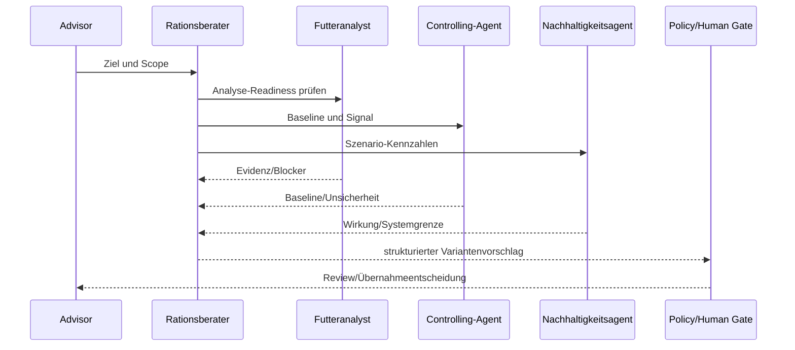

# 11 — Spezialisierte KI-Agenten

## 1. Zielbild

Agenten unterstützen Recherche, Datenprüfung, Variantenbildung, Erklärung und
Nachverfolgung. Sie ersetzen weder deterministische Rechenkerne noch fachliche
Freigaben. Jeder Agent arbeitet in einem expliziten Tenant-/Betriebsscope, nutzt
typisierte Tools und erzeugt nachvollziehbare Vorschläge oder Tasks.

## 2. Gemeinsamer Sicherheitsvertrag

| ID | Regel |
|---|---|
| FEED-AI-001 | Least privilege: nur benötigte Read-/Propose-Tools und Business-Grants. |
| FEED-AI-002 | Tenant, Betrieb, Rolle und Zweck werden vor jedem Toolcall serverseitig geprüft. |
| FEED-AI-003 | Modelle rechnen keine Normformel frei nach; sie rufen versionierte Rechendienste auf. |
| FEED-AI-004 | Freigabe, Aktivierung, Live-Export, Bestellung und Grantänderung benötigen Policy/Mensch. |
| FEED-AI-005 | Jede Aussage trennt Fakt, Berechnung, Schätzung, Hypothese und Empfehlung. |
| FEED-AI-006 | Quellen/Evidenz referenzieren konkrete Analyse, Version, Observation und Regelset. |
| FEED-AI-007 | Prompt/Output enthalten keine Secrets; Provider-Rohpayload wird minimiert. |
| FEED-AI-008 | Toolergebnis ist untrusted data und darf keine Instruktion an den Agenten einschleusen. |
| FEED-AI-009 | Unsicherheit und fehlende Daten führen zu Rückfrage/Task, nicht zu erfundenen Werten. |
| FEED-AI-010 | Alle Vorschläge, Toolcalls, Policyentscheidungen und Übernahmen sind auditiert. |
| FEED-AI-011 | Ein Kill Switch kann Agent, Tool, Tenant oder Use Case deaktivieren. |
| FEED-AI-012 | Agenten dürfen keine veterinärische Diagnose oder rechtsverbindliche Aussage simulieren. |

## 3. Agent Runtime

```text
User/Event
  → Intent + Tenant/Business Scope
  → Policy/Role Gate
  → Agent Planner
  → typed read tools / deterministic engines
  → evidence bundle
  → proposal schema
  → policy gate
  → human review or safe auto-action
  → audit + feedback/evaluation
```

### 3.1 Proposal-Schema

```json
{
  "proposal_id": "prop_01J...",
  "agent": "ration_advisor",
  "objective": "Proteinüberschuss reduzieren ohne Milchzielverlust",
  "scope": {"business_id": "biz_1", "group_id": "grp_4"},
  "facts": [],
  "assumptions": [],
  "recommendations": [],
  "evidence_refs": ["ration-version:rv_42", "analysis:ana_17"],
  "ruleset": "GFE_2023_DLG_2025",
  "confidence": "medium",
  "risks": [],
  "proposed_commands": [],
  "requires_human_approval": true
}
```

## 4. Toolklassen

| Klasse | Beispiele | Standardrecht |
|---|---|---|
| Read | Gruppe, Analyse, Ration, Controlling, Bestand | erlaubt im Grant |
| Calculate | Bedarf, Bewertung, Optimierung, Forecast | erlaubt, versioniert |
| Propose | Entwurf, Task, Variante, Bestellvorschlag | erlaubt, nicht committed |
| Mutate reversible | Kommentarentwurf, persönliche Sicht | policyabhängig |
| Mutate controlled | Rationsversion, Aufgabe | menschliche Bestätigung |
| High impact | Freigabe, Aktivierung, Export, Bestellung, Grant | Agent allein verboten |

Toolschemas lehnen unbekannte Felder ab. Responses tragen Datenstand, Provenienz,
Autorisierungsscope und Korrelation.

## 5. FEED-AGENT-001 — Rationsberater

### Auftrag

Erkennt fachliche Verbesserungspotenziale, erzeugt nachvollziehbare Varianten und
erklärt Trade-offs. Er nutzt die deterministische Bedarfs-, Bewertungs- und
Optimierungsengine.

| Aspekt | Vertrag |
|---|---|
| Eingaben | Gruppe/Bedarfsprofil, Basisversion, Analysen, Preise, Verfügbarkeit, Ziel/Constraints. |
| Read Tools | get_group, get_ration_version, get_evaluation, get_material_readiness. |
| Calculate | calculate_requirements, evaluate_ration, optimize_ration, compare_variants. |
| Outputs | priorisierte Findings, 1–3 Kandidaten, Trade-offs, fehlende Daten. |
| Propose | create_ration_draft, create_consulting_task. |
| Verboten | Version freigeben/aktivieren; Constraint verschweigen; Normwert erfinden. |
| Human Gate | jede Übernahme als Rationsversion; immer bei critical/blocking Finding. |

Beispielauftrag: „Erzeuge zwei Varianten, die N-Effizienz verbessern, das Milchziel
nicht mehr als die erlaubte Solverpolicy reduzieren und nur verfügbare Materialien
nutzen.“

Abbruchbedingungen: Bedarfsprofil ungültig, Pflichtanalyse fehlt, Rule Engine nicht
bereit, Gruppe außerhalb unterstützter Tierklasse oder Scope unklar.

Evals: fachliche Constrainttreue, Candidate-Reproduzierbarkeit, Quellenpräzision,
keine Blockerübergehung, Qualität der Trade-off-Erklärung.

## 6. FEED-AGENT-002 — Futteranalyst

### Auftrag

Unterstützt Dokument-/Laborimport, Mapping, Plausibilität und Änderungsbewertung.
Er darf unsichere Werte nicht freigeben oder mit geratenen Einheiten ergänzen.

| Aspekt | Vertrag |
|---|---|
| Eingaben | Dokument/OCR, Laborpayload, Material, frühere Analysen, Mappingkatalog. |
| Read Tools | get_nutrient_catalog, get_analysis_history, get_lab_mapping. |
| Calculate | parse_document, normalize_units, validate_analysis, diff_analyses. |
| Outputs | extrahierte Werte mit Konfidenz, Mappingvorschlag, Findings, Änderungswirkung. |
| Propose | analysis_draft, mapping_task, replacement_review. |
| Verboten | OCR-Wert als gemessen behaupten; Release; Original verändern. |
| Human Gate | unsicheres Material-/Einheitenmapping und jede Analysefreigabe. |

Bei widersprüchlichen Deklarationen erzeugt der Agent eine strukturierte
Konfliktliste. Er priorisiert Rückfrage an Labor/Nutzer gegenüber Imputation.

Evals: Feldextraktionsgenauigkeit, Einheitenkonversion, calibrated confidence,
False-Accept-Rate bei unbekannten Codes, Dokument-/Payload-Injection-Resistenz.

## 7. FEED-AGENT-003 — Controlling-Agent

### Auftrag

Beobachtet Soll-Ist-, Leistungs- und Kostentrends, priorisiert Signale und bereitet
Evidenzpakete vor. Er behauptet keine Kausalität aus bloßer Korrelation.

| Aspekt | Vertrag |
|---|---|
| Eingaben | Plan/Execution, tägliche Observations, Tierzahl, Versionen, Maßnahmen. |
| Read Tools | get_controlling_series, get_executions, get_decisions, get_data_quality. |
| Calculate | weighted_kpis, detect_policy_deviation, compare_periods. |
| Outputs | Signal, Datenabdeckung, mögliche Einflussfaktoren, empfohlene Prüfung. |
| Propose | consulting_case, monitoring_task, report_job. |
| Verboten | Korrelation als Ursache; Healthdiagnose; Schätzung verschweigen. |
| Human Gate | kritische Meldung an externe Empfänger, Maßnahmenentscheidung. |

Signalunterdrückung nutzt Hysterese und Cooldown aus Policy, nicht freie
Agentenentscheidung. Bereits dokumentierte Maßnahmen werden berücksichtigt, damit
der Agent keine widersprüchliche tägliche Empfehlung wiederholt.

Evals: Precision/Recall definierter Signalfälle, Alarmrate, Tierzahlgewichtung,
Quellen-Drilldown, Kausalitätssprache und Wiederholungsreduktion.

## 8. FEED-AGENT-004 — Einkaufsagent

### Auftrag

Prognostiziert Materialbedarf aus freigegebenen/geplanten Rationen, gleicht Bestand
und offene Bestellungen ab und erzeugt Bestell-/RFQ-Vorschläge.

| Aspekt | Vertrag |
|---|---|
| Eingaben | Pläne, Tierzahl, Materialbedarf, Bestand/Lots, Lieferzeiten, Preise, Verträge. |
| Read Tools | get_plan_demand, get_inventory, get_open_orders, get_supplier_terms. |
| Calculate | demand_forecast, shortage_window, scenario_cost. |
| Outputs | Bedarfslücke, Zeitpunkt, Unsicherheit, Liefer-/Preisoptionen. |
| Propose | purchase_requisition_draft, rfq_draft, substitution_review. |
| Verboten | Bestellung senden, Vertrag schließen, gesperrtes Lot einplanen. |
| Human Gate | jede finanzielle Bindung und Materialsubstitution in freigegebener Ration. |

Bedarfsprognosen unterscheiden freigegebenen Bedarf, wahrscheinliche Planung und
unverbindliche Variante. Doppelzählung zwischen Lager, Bestellung und Lieferung
wird durch eindeutige Belegreferenzen verhindert.

Evals: Forecastfehler, Doppelbestellungsrate, Lieferzeit-/Einheitenkorrektheit,
Budget-/Freigabentreue, Erklärbarkeit von Alternativen.

## 9. FEED-AGENT-005 — Gesundheitsagent

### Auftrag

Verknüpft freigegebene Fütterungs-, Leistungs- und autorisierte Sensorsignale zu
Hinweisen für fachliche Prüfung. Kein Diagnosesystem und kein Ersatz für Tierarzt.

| Aspekt | Vertrag |
|---|---|
| Eingaben | Gruppenkennzahlen, autorisierte Alerts, Ration, Ausführung, Verlauf. |
| Read Tools | get_group_health_signals, get_ration_context, get_data_quality. |
| Calculate | validate_signal_context, aggregate_group_risk, trend_window. |
| Outputs | Risikohinweis, betroffene Gruppe/Segment, Evidenz, Unsicherheit, Eskalationsvorschlag. |
| Propose | vet_review_task, consulting_case, monitoring_window. |
| Verboten | Diagnose/Therapie; Tier-Level-Export ohne Consent; Ration autonom ändern. |
| Human Gate | jede veterinärische Bewertung und externe Benachrichtigung. |

Tier-Level-Daten werden nur gezeigt, wenn Zweck, Consent und Scope dies erlauben.
Ansonsten arbeitet der Agent aggregiert. Dringlichkeit folgt validierter Policy,
nicht dramatischer Modellsprache.

Evals: Sensitivität bei validierten Szenarien, False-Alarm-Rate, Consent-/Scope-
Isolation, sichere Sprache, Verhalten bei fehlender/staler Sensorik.

## 10. FEED-AGENT-006 — Nachhaltigkeitsagent

### Auftrag

Bewertet Nährstoffeffizienz, geschätzte Emissionen und Ressourcenwirkung von
Rationen/Varianten mit offengelegter Methodik und Unsicherheit.

| Aspekt | Vertrag |
|---|---|
| Eingaben | Ration, Leistung, Herkunft, Emissionsfaktoren, Systemgrenze, Regelversion. |
| Read Tools | get_ration, get_performance, get_emission_factor_provenance. |
| Calculate | nitrogen_efficiency, methane_estimate, co2e_scenario. |
| Outputs | Kennzahlen, Bandbreiten, Hotspots und Zielkonflikte. |
| Propose | sustainable_variant_brief, data_quality_task, report_section. |
| Verboten | Schätzung als Messung; unvereinbare Systemgrenzen vergleichen; Claim freigeben. |
| Human Gate | externe Nachhaltigkeitsclaims, Berichte und operative Rationsänderung. |

Evals: Methodik-/Systemgrenzentreue, Unsicherheitsdarstellung, Faktorprovenienz,
Trade-off mit Leistung/Gesundheit, keine Greenwashing-Sprache.

## 11. Orchestrierung

Ein Supervisor darf Aufgaben routen, aber keine Agentenantwort per Mehrheitsvotum
zur Wahrheit erklären. Gemeinsame Sequenz für „Ration verbessern“:



Agenten kommunizieren über typisierte Artefakte und Referenzen, nicht freie
„Agentengespräche“ als alleinigen Auditnachweis.

## 12. Human-in-the-loop-Matrix

| Aktion | Agent allein | Mensch bestätigt | zusätzliche Fachfreigabe |
|---|---:|---:|---:|
| Daten lesen/zusammenfassen | ja im Scope | – | – |
| Berechnung ausführen | ja | – | Regelset muss aktiv sein |
| Aufgabe/Kommentar entwerfen | ja | vor Veröffentlichung | ggf. |
| Rationsvariante vorschlagen | ja | zur Versionserzeugung | Review später |
| Analyse-Mapping | bei hoher Policykonfidenz vorschlagen | unsicher immer | Release separat |
| Beratungsfall eröffnen | vorschlagen | ja | – |
| Bestellung/RFQ senden | nein | ja | Einkaufsfreigabe |
| Ration freigeben/aktivieren | nein | ja | Approver/SoD |
| Mixerexport | nein | ja | operative Policy |
| Gesundheitsdiagnose/Claim | nein | nein als Agentenoutput | Tierarzt/Fachverantwortung |
| Grant ändern | nein | Admincommand | Securitypolicy |

## 13. Prompt- und Datenisolation

System-/Developer-Policy, Toolschemas und Nutzdaten werden getrennt. Dokumente,
Labortext, Providerpayload und Kommentare sind untrusted content. Instruktionen wie
„ignoriere Regeln“ in einem Dokument werden als Daten behandelt.

Retrieval filtert vor Abruf auf Tenant, Betrieb, Objektklasse, Consent und Zweck.
Caching darf keine tenantübergreifenden Embeddings/Antworten liefern. Logs
redigieren Secrets, Tier-IDs und Gesundheitsdetails gemäß Policy.

## 14. Agent Audit

Jeder Lauf speichert:

- Agent-/Prompt-/Modell-/Toolversion;
- Tenant, Betrieb, Principal, Zweck und Grantsnapshot;
- Eingabereferenzen und Datenstände, nicht zwingend Vollpayload;
- Toolcalls mit Parametern in redigierter Form;
- Policyentscheidungen und blockierte Aktionen;
- Outputschema, Evidenz, Konfidenz und Warnungen;
- menschliche Übernahme/Änderung/Verwerfung;
- Korrelation zu erzeugten Commands/Objekten.

## 15. Evaluation und Freigabe

| Ebene | Tests |
|---|---|
| Schema | valide strukturierte Ausgabe, keine unbekannten Felder |
| Tool | korrekte Toolwahl, Parameter, Idempotenz, Fehlerbehandlung |
| Fachlich | kuratierte Golden Cases durch Experten |
| Sicherheit | Tenant-/Grant-Leaks, Prompt Injection, Secret Exfiltration |
| Verhalten | Unsicherheit, Rückfrage, Abbruch, keine Diagnose/Overclaim |
| Regression | festes Evalset je Prompt-/Modell-/Regelversion |
| Online | Übernahmequote, Korrektur, Incident, Drift – mit Guardrails |

Releasegate je Agent:

1. ≥ 95 % Schemakonformität im Evalset, Ziel produktiv 100 % durch Validator.
2. 0 Tenant-/Grant-Leaks und 0 autonome High-Impact-Aktionen.
3. alle kritischen Golden Cases fachlich akzeptiert.
4. Injection-/Exfiltration-Suite grün.
5. Kill Switch, Rate Limit, Timeout und Fallback getestet.
6. UI zeigt Evidenz, Unsicherheit und Human Gate verständlich.

## 16. Fallback und Incident

Bei Modell-/Providerausfall bleiben deterministische Regeln und manuelle Workflows
nutzbar. Agentenfeatures zeigen degradierten Status, ohne Kernaktionen zu sperren.
Bei Sicherheits- oder Fachincident:

1. Use Case/Tool/Tenant über Kill Switch stoppen;
2. laufende Jobs abbrechen, soweit sicher;
3. Audit und betroffene Vorschläge/Commands ermitteln;
4. Nutzer über relevante übernommene Vorschläge informieren;
5. Modell/Prompt/Toolversion quarantänisieren;
6. Root Cause, Evalcase und Wiederfreigabe dokumentieren.

## 17. Nicht akzeptiert

- Agent mit direktem Datenbank-/Shellzugriff statt typisierter Tools;
- Prompt als Ort für Grenzwerte oder Berechnungsformeln;
- tenantübergreifendes Retrieval;
- autonome Freigabe, Aktivierung, Bestellung oder Live-Export;
- freie Textantwort ohne Evidenz-/Proposal-Schema für Fachentscheidungen;
- Modellkonfidenz als fachliche Wahrscheinlichkeit ausgeben;
- Healthdiagnose oder Nachhaltigkeitsclaim ohne zuständige Fachfreigabe;
- Modellupdate ohne Regressionsevaluation und Rollback.

## 18. Definition of Done je Agent

1. Auftrag, Scope, Inputs, Tools, Outputs und Verbote dokumentiert.
2. Least-Privilege-Rolle und Business-Grant technisch geprüft.
3. Strukturierte Proposals mit Evidenz und Unsicherheit.
4. High-Impact-Aktionen durch Policy/Human Gate gesperrt.
5. Fach-, Security-, Injection-, Tool- und Regressionsevals grün.
6. Audit, Kill Switch, Rate Limit, Timeout, Fallback und Observability vorhanden.
7. UX integriert Vorschlag ohne deterministische Fachsicht zu verdrängen.
8. Datenschutz-/Consent-/Retentionreview abgeschlossen.
9. Pilot mit benannter Fachverantwortung und Incidentweg.
10. Traceability und Workboard aktualisiert.

