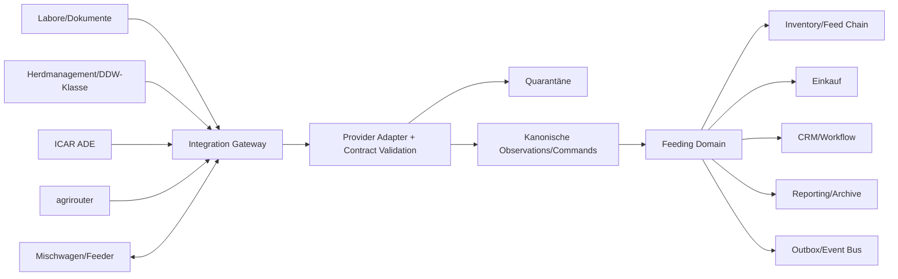

# 12 — Integrationsarchitektur

## 1. Ziel

Fütterungsberatung verbindet Labor, Herdmanagement, Sensorik, Bestand, Einkauf,
Mischtechnik, Reporting und Plattformdienste. Providerdetails dürfen nicht in
Domain, UI oder Agentenprompts durchsickern. Jeder Adapter übersetzt einen
versionierten externen Vertrag in kanonische Commands, Observations oder Dokumente.

## 2. Architekturprinzipien

| ID | Prinzip |
|---|---|
| FEED-INT-001 | Anti-Corruption Layer zwischen Providerpayload und Domainmodell. |
| FEED-INT-002 | Kein behaupteter Livevertrag ohne verifizierte Providerdokumentation, Vertrag und Credentials. |
| FEED-INT-003 | Eingänge sind untrusted: Schema, Größe, Malware, Einheit und Semantik validieren. |
| FEED-INT-004 | Idempotenz über Provider-/Quellschlüssel und Payloadhash. |
| FEED-INT-005 | Delta-Cursor wird erst nach persistiertem, abgeschlossenem Run bestätigt. |
| FEED-INT-006 | Moves, Deletes und Korrekturen sind Ereignisse, keine stillen Überschreibungen. |
| FEED-INT-007 | Unbekannte Werte gehen in Quarantäne; kein stilles Feldfallenlassen. |
| FEED-INT-008 | Secrets liegen in Vault/Environment, nicht Payload, DB, Audit oder UI. |
| FEED-INT-009 | Live-Aktivierung benötigt Vertrag, Consent, Test, Policy und benannten Owner. |
| FEED-INT-010 | Externe Writes nutzen Job, Idempotenz, Receipt und Reconciliation. |
| FEED-INT-011 | Adapter sind durch Contract Fixtures und Replaytests isoliert testbar. |
| FEED-INT-012 | Provider-Ausfall degradiert Integration, nicht deterministische Kernfunktionen. |

## 3. Integrationslandkarte



## 4. Integrationskatalog

| ID | Integration | Richtung | Bestand | Ziel |
|---|---|---|---|---|
| FEED-INT-101 | Labor/Analyse | inbound | normalisierter JSON-Adapter, Dokumentparser | Laborspezifische Mappings, Signatur/Receipt |
| FEED-INT-102 | Herd-Data Provider/DDW-Klasse | inbound | Connection, Delta-Sync, Observations, Mock | verifizierte Liveproviderverträge |
| FEED-INT-103 | ICAR ADE | inbound | Adapter auf CowProfile | versionierter Vollvertrag |
| FEED-INT-104 | agrirouter | inbound/bidirektional | Feeding-Log-Adapter | zertifizierter Gerätefluss |
| FEED-INT-105 | Mischwagen | outbound/inbound | Zielkonzept | Exportjob, Receipt, Ist-Rücklauf |
| FEED-INT-106 | Inventory/Feed Chain | intern | APIs/Domain vorhanden | Lot-/QS-/Verfügbarkeitsprojektion |
| FEED-INT-107 | Einkauf | intern | ERP-Domain vorhanden | Bedarfs-/Bestellvorschläge |
| FEED-INT-108 | Partner/CRM | intern | Partnerbasis vorhanden | Business-Aktivierung/Fallverknüpfung |
| FEED-INT-109 | Workflow/Tasks | intern | Plattform vorhanden | Freigaben, Beratung, Eskalation |
| FEED-INT-110 | Reporting/Archiv | intern/extern | Plattformteile | rollenprofilierte PDFs, Archivreceipt |
| FEED-INT-111 | Event Bus/Outbox | intern | Plattformvertrag | vollständige Feeding Events |
| FEED-INT-112 | Identity/Authorization | intern | zentral | Business-Grants und Service Scopes |

## 5. Kanonischer Inbound-Ablauf

```text
receive → authenticate → rate/size gate → persist envelope/hash
→ schema validate → semantic/unit validate → normalize
→ deduplicate → authorize tenant/business mapping
→ persist observation/import result → project domain/read models
→ outbox event → acknowledge cursor/receipt
```

Ein 2xx an einen Provider wird nur entsprechend dessen Deliveryvertrag gesendet.
Wo ein späterer fachlicher Fehler möglich ist, bleiben Importjournal und
Quarantäne dispositionierbar.

### 5.1 Envelope

```json
{
  "provider": "provider_key",
  "contract_version": "v2",
  "tenant_mapping_ref": "map_17",
  "external_id": "evt_9981",
  "provider_updated_at": "2026-07-14T23:10:00Z",
  "received_at": "2026-07-14T23:11:03Z",
  "payload_hash": "sha256:...",
  "content_type": "application/json",
  "correlation_id": "corr_01J..."
}
```

## 6. Labor- und Analyseintegration

### 6.1 Unterstützte Eingangsklassen

- normalisiertes JSON;
- CSV/XLSX über versioniertes Mappingprofil;
- PDF mit Textschicht;
- Bild/OCR als unsicherer Entwurf;
- providerseitiger API-Pull/Webhook nach Vertrag.

### 6.2 Mapping

| Providerfeld | Kanonisches Ziel | Pflichtprüfung |
|---|---|---|
| sample/reference | Probe/external_ref | Eindeutigkeit und Tenantmapping |
| material/feed | feed_material_id | Konfidenz oder Human Mapping |
| analyte | nutrient_code | versionierter Synonymkatalog |
| value | Decimal | Locale, Nachweisgrenze, kein NaN |
| unit/basis | Unit + basis | Dimension und Konversion |
| method | analysis_method | erlaubter Code/Freitextprovenienz |
| dates | sample/received/analysed | Reihenfolge/Plausibilität |

OCR-Ergebnisse sind nie automatisch released. Der Originalnachweis bleibt mit
Hash und Extraktionsversion referenziert. Dokumentinhalte sind untrusted und können
keine Agenten-/Systeminstruktion liefern.

## 7. Herd-Data-/DDW-Klasse

Das Repository besitzt providerneutrale Normalisierer für Gruppen-KPIs,
Gesundheitsalerts und genetische Profile sowie Connection, Delta-Run und
Observation. Beispielpayloads dienen Mock-/Contracttests. Sie sind kein Beweis für
öffentlich verfügbare DDW-Endpunkte.

### 7.1 Connection-Gates

| Gate | Prüfung |
|---|---|
| contract | Vertrag, erlaubte Endpunkte, Rate Limits, Datenfelder, SLA |
| consent | Betriebseinwilligung, Zweck, Tier-Level-Erlaubnis, Widerruf |
| credential | Vault-Referenz, Rotation, geringster Scope |
| endpoint | HTTPS, Allowlist, DNS/SSRF-Schutz, Zertifikat |
| mapping | externe Herde/Gruppe eindeutig intern zugeordnet |
| mock | Fixtures für KPI, Alert, Genetics, Move, Delete, Fehler |
| dry-run | keine produktive Projektion; Zähler/Findings sichtbar |
| live | explizite Admin-/Policyfreigabe |

### 7.2 Delta-Semantik

`updated_since` ist Adapterkonzept, kein universeller Providerparameter. Der
Adapter bildet Cursor, Zeitfenster, Seitentoken oder Änderungsfeed ab. Ein Run
speichert `cursor_from`, `cursor_to`, Zähler, Status und Fehler.

Moves enthalten alte und neue Gruppe. Deletes werden als Tombstone persistiert.
Providerkorrekturen mit gleicher fachlicher Zeit aber neuer Updatezeit erzeugen
eine nachvollziehbare neue Observation/Revision gemäß Contract.

## 8. ICAR ADE

Der vorhandene Adapter normalisiert ADE-Version und externe Tieridentität auf ein
CowProfile-Ziel. Für produktiven Ausbau gelten:

- unterstützte ADE-Versionen explizit allowlisten;
- Rasse-, Laktations-, Kalbe- und Tierstatuscodes vollständig mappen;
- unbekannte Codes quarantänisieren;
- Tier-ID-Pseudonymisierung und Consent prüfen;
- Bewegungen, Merger und Löschungen testen;
- kein Tierprofil in Feeding duplizieren, wenn Provider-/Animal-Context zuständig.

## 9. agrirouter und Gerätekommunikation

Der vorhandene Adapter übersetzt einen Feeding Log in ein kanonisches Zielmodell.
Produktiver bidirektionaler Betrieb benötigt zertifizierte Message-/Capability-
Profile, Tenant-/Maschinenbindung und Reconciliation.

| Richtung | Vertrag |
|---|---|
| inbound | Istmengen, Zeit, Gerät, Kontext-ID, Einheiten, Status |
| outbound | Plan-/Batch-Snapshot, Reihenfolge, Mengen, Einheit, Version |
| receipt | angenommen/abgelehnt, Provider-ID, Checksumme, Zeit |
| status | queued, delivered, applied, failed, unknown |

„unknown“ nach Timeout führt zur Statusabfrage, nicht sofortigem Resend.

## 10. Mischwagenadapter

### 10.1 Capability-Profil

Jeder Adapter deklariert:

- maximale Batches, Komponenten und Namenslängen;
- unterstützte Einheiten/Dezimalstellen;
- Rundungs-/Mindestmengen;
- Reihenfolge- und Gruppierungsfähigkeit;
- Lot-/Barcodefähigkeit;
- Rückkanal für Istmengen/Status;
- Idempotenz-/Receipt-Verhalten;
- Zeitzone/Schichtmodell;
- Online-/Dateiexportmodus.

### 10.2 Exportvertrag

Vor Export werden Zielgerät, Planrevision, Rationsversion, Tierzahl, Einheiten und
Rundung snapshotten. Mappingverlust ist blockierend. Exportreceipt wird mit Hash
gespeichert; Nutzer sieht Providerstatus und kann sichere Reconciliation starten.

## 11. Interne ERP-Integrationen

### 11.1 Inventory und Feed Chain

Feeding liest verfügbare Menge, Lot, QS-Status, Standort, Reservierung und
Reichweite. Es schreibt keine freie Bestandszahl. Verbrauch aus bestätigter
Ausführung wird als idempotenter Materialflusscommand an Inventory übergeben.

### 11.2 Einkauf

Bedarfsprognosen unterscheiden freigegeben, geplant und hypothetisch. Übergabe an
Einkauf erzeugt einen Vorschlag/Bedarfsbeleg mit Zeitraum, Material, Menge,
Unsicherheit und Quelle. Lieferantenauswahl, Bestellung und finanzielle Freigabe
bleiben im Procurement-Context.

### 11.3 CRM/Partner und Beratung

FeedingBusiness referenziert Partner; Aktivierung ist kontrollierte Projektion.
Beratungsfälle können CRM-Aktivitäten/Tasks referenzieren, duplizieren jedoch weder
Kundenstamm noch allgemeine Kommunikation.

### 11.4 Identity und Grants

Service-to-Service Tokens enthalten Tenant, Actor/Service, Scopes, Ablauf und
Audience. Business-Grant wird zusätzlich geprüft. Delegation wird explizit
auditiert; kein technischer Superuser für normale Syncjobs.

## 12. Outbox und Ereignisse

Domaintransaktion und Outboxeintrag sind atomar. Publisher liefert at-least-once;
Consumer deduplizieren `event_id`.

| Event | Konsumenten |
|---|---|
| `feeding.analysis.released.v1` | Readiness, Rationshinweis, Reporting |
| `feeding.ration.version.approved.v1` | Planung, Workflow, Reporting |
| `feeding.ration.version.activated.v1` | Stall, Controlling, Notification |
| `feeding.plan.exported.v1` | Gerätejournal, Operations |
| `feeding.execution.completed.v1` | Inventory, Controlling, Beratung |
| `feeding.controlling.deviation.detected.v1` | Workflow, Agenten, Notification |

PII-/Gesundheitsdetails werden nicht in breit publizierte Events eingebettet;
Konsumenten laden autorisiert über Referenzen nach.

## 13. Quarantäne

| Fehlerklasse | Beispiel | Default-Disposition |
|---|---|---|
| schema | Pflichtfeld fehlt | nach Mappingfix retry |
| semantic | unbekannte Einheit/Code | manuell mappen |
| authorization | Tenant/Herde nicht erlaubt | suspendieren/escalate |
| duplicate_conflict | gleiche ID, anderer Inhalt | Contractreview |
| transient | Timeout/429/5xx | Backoff/Jitter retry |
| permanent | 4xx, ungültiges Objekt | dead-letter nach Review |
| security | Malware/SSRF/Injection | isolieren, Incident |

Retry ist begrenzt und idempotent. Operator kann redigierten Payload, Fehler,
Mappingkontext und vorgeschlagene Abhilfe sehen. Resolve/Dead-letter benötigt Grund
und Audit.

## 14. Resilienz

- Timeouts pro Provider und Operation;
- exponential Backoff mit Jitter und `Retry-After`;
- Circuit Breaker pro Tenant/Connection;
- Bulkhead für große Imports;
- Rate-Limit-Budget und Seitencheckpoint;
- Dead-letter/Quarantäne statt Endlosschleife;
- Replay aus unverändertem Envelope;
- Status „degraded“ bei stale Daten;
- Kernberechnung verwendet letzten freigegebenen Snapshot und zeigt Aktualität.

## 15. Security und Datenschutz

1. egress Allowlist, HTTPS, Zertifikatsprüfung und SSRF-Schutz;
2. Vault-/Environment-Secrets, Rotation und Redaction;
3. signierte Webhooks plus Replayfenster;
4. Dateigröße, MIME/Magic Bytes, Malware-/Archive-Bomb-Prüfung;
5. Schema- und Felderallowlist; keine dynamische Codeausführung;
6. Tenant-/Businessmapping vor Persistenz/Projektion;
7. Datenminimierung, Consent, Zweckbindung und Retention;
8. Tier-Level-/Gesundheitsdaten separat schützen;
9. Audit für Credential-/Live-/Mappingänderung;
10. Providerpayload als untrusted gegenüber KI/Agenten.

## 16. Observability und SLA

Metriken je Provider/Connection: Runanzahl, Dauer, Lag, Seiten/Records,
Import/Skip/Quarantäne, Retries, Rate Limits, Cursoralter, Receiptlatenz und
Contractversion. Logs enthalten Korrelation und IDs, keine Secrets/Rohgesundheit.

Alerts:

- Credential/Consent/Contract abgelaufen;
- kein erfolgreicher Run innerhalb SLA;
- Cursor bewegt sich trotz Providerdaten nicht;
- Quarantänerate über Schwelle;
- Schema-/Contractdrift;
- unbekannter Exportstatus über Reconciliationfrist;
- wiederholte Tenantmappingfehler.

## 17. Contract-Testmatrix

| ID | Fall |
|---|---|
| FEED-INT-T001 | identischer Inbound wird einmal projiziert |
| FEED-INT-T002 | gleiche ID/anderer Hash wird Konflikt |
| FEED-INT-T003 | Seitenfehler bestätigt Cursor nicht zu weit |
| FEED-INT-T004 | Move persistiert vorherige/neue Gruppe |
| FEED-INT-T005 | Delete wird Tombstone |
| FEED-INT-T006 | unbekannte Einheit quarantänisiert |
| FEED-INT-T007 | Fremdtenantmapping wird abgewiesen/auditiert |
| FEED-INT-T008 | Credential erscheint in keinem Log/Problem |
| FEED-INT-T009 | 429 respektiert Retry-After |
| FEED-INT-T010 | Circuit Breaker isoliert eine Connection |
| FEED-INT-T011 | Webhook-Replay wird dedupliziert |
| FEED-INT-T012 | OCR bleibt Draft und zeigt Konfidenz |
| FEED-INT-T013 | Exportdoppelklick erzeugt einen Providerauftrag |
| FEED-INT-T014 | Timeout nach Commit wird reconciled statt blind resent |
| FEED-INT-T015 | Receiptchecksumme stimmt mit Export-Snapshot |
| FEED-INT-T016 | Consentwiderruf stoppt neuen Tier-Level-Sync |
| FEED-INT-T017 | Providerstale degradiert UI, Kern bleibt nutzbar |
| FEED-INT-T018 | Contractdrift fällt nicht still Felder |
| FEED-INT-T019 | Replay erzeugt deterministisch gleiche Normalisierung |
| FEED-INT-T020 | Outboxwiederholung ist beim Consumer idempotent |

## 18. Live-Onboarding-Checkliste

1. Providervertrag und technische Dokumentation versioniert abgelegt.
2. Datenschutz, Consent, AVV und Zweck geprüft.
3. Daten-/Einheiten-/Code-Mapping fachlich freigegeben.
4. Credentials mit geringstem Scope und Rotation eingerichtet.
5. Contractfixtures einschließlich Fehler, Move und Delete vorhanden.
6. Mock-, Dry-run-, Last-, Retry- und Securitytests grün.
7. Monitoring, SLA, Alertempfänger und Runbook aktiv.
8. Backfill-/Cutover-/Rollbackplan abgestimmt.
9. Live-Gate durch Admin und Fachowner freigegeben.
10. Pilotdaten reconciled und Abnahme protokolliert.

## 19. Nicht akzeptiert

- Suchmaschinensnippet oder Beispielpayload als Live-API-Vertrag behandeln;
- Providerfeld direkt in UI/Domain durchreichen;
- Secrets in Connectiontabellen oder Logs;
- Cursor vor vollständiger Persistenz bestätigen;
- unbekannte Codes als 0/„sonstige“ ohne Finding importieren;
- automatischer unlimitierter Retry;
- Geräteexport ohne Version, Idempotenz und Receipt;
- Fremdtenantdaten in gemeinsamer Quarantäneansicht;
- Provider-Ausfall als Ausfall der gesamten Fütterungsberatung.

## 20. Definition of Done je Integration

1. Owner, Vertrag, Version, SLA, Datenschutz und Scope dokumentiert.
2. Kanonisches Mapping und Anti-Corruption Layer implementiert.
3. Idempotenz, Cursor, Delete/Move/Korrektur und Quarantäne getestet.
4. Secrets, SSRF, Upload und Tenantisolation gehärtet.
5. Mock/Fixtures, Contract-, Replay-, Last- und Fehlertests grün.
6. Metrics, Logs, Alerts, Runbook, Retry und Circuit Breaker vorhanden.
7. Live-Gate, Pilot, Reconciliation und Rollback abgenommen.
8. API, Datenmodell, Workflow und Traceability aktualisiert.

