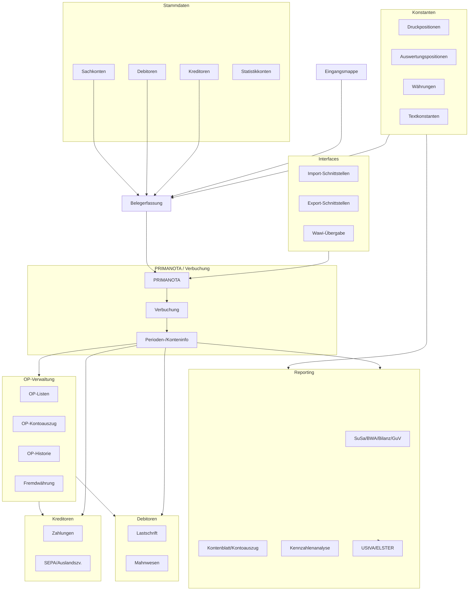

# FiBu-Domain – Architekturmodell für VALEO-NeuroERP

> Referenzmodell abgeleitet aus der bestehenden FiBu-Übersichtsgrafik.  
> Ziel: Strukturvorlage für die Domänenmodellierung und Microservice-Zerlegung in VALEO-NeuroERP.

---

## 1. Überblick

Die FiBu-Domain wird als eigenständiger Bereich modelliert, der alle Funktionen der
Finanzbuchhaltung, Debitoren-/Kreditorenverwaltung, Auswertungen, Schnittstellen und gesetzlichen Meldungen abdeckt.

Zentraler Kern ist die **PRIMANOTA** (Buchungsengine), die Daten aus:

- Stammdaten & Konstanten  
- Belegerfassung / Eingangsmappe  
- Importschnittstellen und Warenwirtschaft

entgegennimmt und daraus:

- Buchungen, Perioden- und Konteninformationen  
- Auswertungen (SuSa, BWA, Bilanz, GuV, Kennzahlen)  
- Debitoren-/Kreditoren-Workflows  
- Steuer- und Meldewesen

generiert.

---

## 2. Domänenübersicht (Top-Level)

- **Stammdaten & Konstanten**
- **Belegfluss & PRIMANOTA (FiBu-Core)**
- **Periodische Prozesse & Nebenbuchhaltungen**
- **Import-/Export-Schnittstellen & Warenwirtschaftsübergabe**
- **Auswertungen & Reporting**
- **Debitorenmanagement (Accounts Receivable)**
- **Kreditorenmanagement (Accounts Payable)**
- **OP-Verwaltung (Offene Posten)**
- **Steuern & Behördenmeldungen (UStVA / ELSTER)**

---

## 3. Stammdaten & Konstanten

### 3.1 Stammdaten

Verantwortlich für alle grundlegenden FiBu-Stammdatensätze:

- **Sachkonten**
- **Oberkonten**
- **Debitoren**
- **Kreditoren**
- **Statistikkonten**

**Aufgaben:**

- Anlegen, Pflegen, Sperren von Konten
- Plausibilitätsprüfungen (Nummernkreise, Kontenarten, Steuerkennzeichen)
- Bereitstellung der Stammdaten für:
  - Belegerfassung
  - PRIMANOTA
  - Debitoren-/Kreditorenprozesse
  - Reporting & Auswertungen

### 3.2 Konstanten

Parametrisierung der FiBu:

- **Druckpositionen**
- **Auswertungspositionen**
- **Währungen**
- **Textkonstanten**

**Aufgaben:**

- Definition von Layout- und Aggregationslogik für Auswertungen
- Steuerung von Druck- und Exportformaten
- Zentrale Ablage von FiBu-weit verwendeten Konfigurationen

---

## 4. Belegfluss & PRIMANOTA (FiBu-Core)

### 4.1 Belegfluss

**Eingangsmappe**

- Vorstufe der FiBu-Buchung
- Sammelpunkt für noch nicht verbuchte Belege

**Belegerfassung**

- Erfassung und Vorprüfung von:
  - Eingangs- und Ausgangsrechnungen
  - Kassenbelegen
  - Sonstigen Buchungsbelegen
- Validierung gegen Stammdaten & Konstanten

### 4.2 PRIMANOTA (Buchungsengine)

Zentrales Modul der FiBu-Domain.

**Unterfunktionen:**

- **PRIMANOTA**
  - Annahme von vorgeprüften Belegen
  - Zuweisung von Buchungssätzen, Konten, Kostenstellen, Steuerschlüsseln
- **Verbuchung**
  - Verbuchung in Hauptbuch / Nebenbücher
  - Erstellung von Journaleinträgen
- **Perioden/Konteninformation**
  - Pflege von Salden, Bewegungen je Periode
  - Bereitstellung für Auswertungen und OP-Verwaltung

**Zuliefernde/verbrauchende Module:**

- Journale
- Korrekturen
- Ereignisprotokolle
- Periodische Buchungen
- Importschnittstellen
- Warenwirtschafts-Übergabe
- Auswertungs- und OP-Module

---

## 5. Periodische Prozesse & Nebenbuchhaltungen

Aus der Grafik (rechter oberer Block):

- **Jahreswechsel**
- **Periodische Buchungen**
- **Mahnwesen**
- **Zahlungsverkehr**
- **Zinswesen**
- **e-Clearing**
- **Anlagenbuchhaltung**
- **Wechselbuchhaltung**

**Aufgaben:**

- Automatisierte / wiederkehrende Buchungsläufe
- Periodenabschluss (Monats-, Quartals-, Jahresabschluss)
- Integration von Nebenbüchern (Anlagen, Wechsel)
- Abbildung von Mahnläufen und Zahlungsabläufen
- Zinsberechnungen und e-Clearing-Prozessen

---

## 6. Import-/Export-Schnittstellen & Warenwirtschaft

### 6.1 Importschnittstellen

**Diverse Importschnittstellen:**

- Lexware Lohn & Gehalt  
- Softresearch  
- GDI-FIBU  
- Quadrix Anlagenbuchhaltung  
- Datev Import Lohndaten  
- Datev ASCII-Schnittstelle  
- (weitere nach Bedarf)

**Aufgaben:**

- Übernahme externer Buchungsdaten in standardisierte FiBu-Importformate
- Mapping auf interne Konten, Kostenstellen, Steuerkennzeichen
- Validierung und Übergabe an PRIMANOTA

### 6.2 Fibu-Übergang aus der Warenwirtschaft

- Übernahme von:
  - Rechnungen
  - Gutschriften
  - Lager-/Bewertungsinformationen (sofern relevant)
- Transformation in FiBu-Buchungssätze

### 6.3 Exportschnittstellen

**Diverse Exportschnittstellen:**

- Excel-Export  
- OP-Export  
- IBM Finanzwesen  
- KHK-Finanzbuchhaltung  
- Datev  
- (weitere nach Bedarf)

**Aufgaben:**

- Bereitstellung von FiBu-Daten für externe Systeme
- Export von Journaldaten, OP-Listen, Auswertungen

---

## 7. Auswertungen & Reporting

Module direkt an PRIMANOTA angebunden:

- **UStVA / ELSTER**
- **Kontenblatt / Kontoauszug / Druck**
- **SuSa / BWA / Bilanz / GuV / IFRS-Bilanz**
- **OP-Verwaltung**
- **Kostenrechnung**
- **Kennzahlenanalyse**
- **Zinswesen**
- **Wechselbuchhaltung**

### 7.1 Finanzberichte

- Summen- und Saldenlisten (SuSa)
- BWA (Betriebswirtschaftliche Auswertung)
- Bilanz
- GuV
- ggf. IFRS-Bilanz

### 7.2 Kontenbezogene Auswertungen

- Kontenblätter
- Kontoauszüge
- Druckfunktionen gemäß Konstanten (Druckpositionen, Layouts)

### 7.3 Kennzahlen & Analysen

- Kennzahlenanalyse (z. B. Liquidität, Debitorenlaufzeiten, Verbindlichkeitsstruktur)
- Anbindung an Kostenrechnung
- Zins- und Wechselbuchhaltungsauswertungen

---

## 8. Debitorenmanagement (Accounts Receivable)

Top-Level Modul: **Debitoren**

Untergeordnete Funktionen:

- **Lastschrift**
  - Einzug offener Forderungen per Lastschrift
  - Übergabe an Zahlungsverkehr / Datenträgeraustausch
- **Vorschlagsliste (Debitoren-Lastschriften)**
- **Datenträgeraustausch**
  - SEPA-/Bank-Formate für Debitorenlastschriften
- **Autom. Buchung (Debitoren)**
  - Automatische Verbuchung von Einzügen

- **Mahnungen**
  - Ermittlung mahnsperrfreier, überfälliger Posten
- **Vorschlagsliste (Mahnwesen)**
- **Mahnschreiben**
- **Autom. Buchung (Mahngebühren, Zinsen)**

Diese Funktionen greifen auf:

- OP-Verwaltung (Offene Debitorenposten)
- PRIMANOTA (für Buchungen)
- Stammdaten (Debitoren, Konten, Konditionen)

---

## 9. OP-Verwaltung (Offene Posten)

Direkt an PRIMANOTA angebundenes Modul:

- **OP-Verwaltung**

Unterfunktionen:

- **OP-Listen**
- **OP-Kontoauszug**
- **OP-Historie**
- **Fremdwährung**

**Aufgaben:**

- Führung und Auswertung aller offenen Posten
- Historisierung von Ausgleichsvorgängen
- Unterstützung von Fremdwährungs-OPs
- Basis für Mahnwesen und Zahlungsverkehr

---

## 10. Kreditorenmanagement (Accounts Payable)

Top-Level Modul: **Kreditoren**

Untergeordnete Funktionen:

- **Zahlungen**
  - Erstellen von Zahlungsvorschlägen
  - Auslösen von Zahlungen (Inland/Ausland)
- **Vorschlagsliste (Kreditorenzahlungen)**
- **Scheck / Datenträgeraustausch**
- **Auslandszahlungsverkehr**
- **SEPA**
- **Kontrolllisten**
- **Autom. Buchungen (Zahlungsläufe)**

Diese Funktionen greifen auf:

- OP-Verwaltung (Offene Kreditorenposten)
- PRIMANOTA (Buchung von Zahlungen, Skonti, Kursdifferenzen)
- Stammdaten (Kreditoren, Bankverbindungen)

---

## 11. Steuern & Behördenmeldungen

Modul: **UStVA / ELSTER**

**Aufgaben:**

- Aufbereitung der Umsatzsteuervoranmeldung (UStVA)
- Ermittlung steuerrelevanter Summen aus PRIMANOTA / Hauptbuch
- Erstellung der ELSTER-konformen Meldedaten
- Übergabe an ELSTER-Schnittstelle oder Export

---

## 12. Beispielhafte Microservice-/Bounded-Context-Zerlegung

> Vorschlag für VALEO-NeuroERP (FiBu-Domäne):

- `fibu-core`  
  - PRIMANOTA, Verbuchung, Perioden/Konteninformation, Journale, Korrekturen, Ereignisprotokolle
- `fibu-master-data`  
  - Stammdaten (Konten, Debitoren, Kreditoren, Statistikkonten), Konstanten
- `fibu-doc-capture`  
  - Eingangsmappe, Belegerfassung
- `fibu-periodic`  
  - Jahreswechsel, periodische Buchungen, Mahnwesen-Steuerung, Zahlungsverkehrssteuerung
- `fibu-interfaces`  
  - Import-/Exportschnittstellen, Warenwirtschafts-Übergabe
- `fibu-reporting`  
  - SuSa, BWA, Bilanz, GuV, Kennzahlen, Kontenblätter
- `fibu-op`  
  - OP-Verwaltung, OP-Listen, OP-Historie, Fremdwährung
- `fibu-ar`  
  - Debitoren, Lastschrift, Mahnungen, Datenträgeraustausch (AR)
- `fibu-ap`  
  - Kreditoren, Zahlungen, Auslandszahlungsverkehr, SEPA, Kontrolllisten
- `fibu-tax`  
  - UStVA / ELSTER, steuerliche Auswertungen

---

## 13. Mermaid-Kontextdiagramm (vereinfacht)

