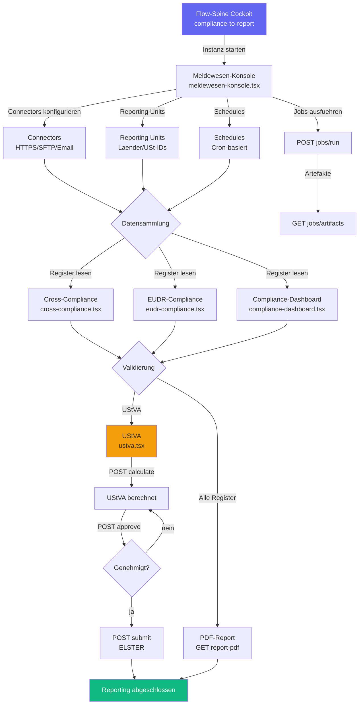

# CMP-001 — Compliance-to-Report End-to-End Workflow-Analyse

**Slice:** CMP-001 | **Lane:** Compliance-to-Report | **Status:** abgeschlossen | **Owner:** Claude Opus 4.6
**Datum:** 2026-03-27

---

## A — Übersicht

Die Compliance-to-Report Lane deckt den Meldewesen-Prozess ab: Datensammlung aus verschiedenen
Compliance-Registern, Aggregation, Validierung, Freigabe und Reporting (PDF/CSV/ELSTER/XML).
Im Landhandel umfasst das Cross-Compliance, EUDR-Entwaldung, UStVA, Sachkunde, QS-Checklisten,
Gefahrstoffdokumentation und Nährstoffstrom-Meldungen.

### Beteiligte Masken

| Schritt | Datei | Hauptaktion |
|---|---|---|
| 1 | `workflow/flow-spine-compliance-to-report.tsx` | Cockpit mit FlowSpineWorkspace |
| 2 | `compliance/meldewesen-konsole.tsx` | Konfiguration: Connectors, Reporting Units, Schedules, Jobs |
| 3 | `compliance/cross-compliance.tsx` | Cross-Compliance-Register (read-only) |
| 4 | `nachhaltigkeit/eudr-compliance.tsx` | EUDR-Entwaldungsfreiheit Dashboard |
| 5 | `finance/ustva.tsx` | UStVA: Berechnung, Genehmigung, ELSTER-Submit |
| 6 | `admin/compliance-dashboard.tsx` | Admin-Übersicht aller Compliance-Register |

### Flow-Spine Steps (Registry)

`datensammlung` → `aggregation` → `validierung` → `freigabe` → `reporting`

---

## B — Vollständige Card-Liste

1. `CMP-001-C1` Flow-Spine Cockpit (Instanzsteuerung, Statuskarten)
2. `CMP-001-C2` Meldewesen-Konsole: Connectors verwalten (HTTPS, SFTP, Email, File-Drop)
3. `CMP-001-C3` Meldewesen-Konsole: Reporting Units konfigurieren (Länder, USt-IDs)
4. `CMP-001-C4` Meldewesen-Konsole: Schedules verwalten (Cron-basiert)
5. `CMP-001-C5` Meldewesen-Konsole: Jobs ausführen und Artefakte abrufen
6. `CMP-001-C6` Cross-Compliance-Register lesen (Gewässerschutz, DüV, PSM-Doku)
7. `CMP-001-C7` EUDR-Compliance Dashboard (Batches, Due-Diligence, Risikobewertung)
8. `CMP-001-C8` UStVA berechnen und validieren
9. `CMP-001-C9` UStVA genehmigen (Approval-Status, Decision-View)
10. `CMP-001-C10` UStVA an ELSTER übermitteln
11. `CMP-001-C11` Compliance-Dashboard: Alle Register aggregiert (Sachkunde, QS, Zulassungen)
12. `CMP-001-C12` PDF-Report generieren und downloaden

---

## C — Mermaid-Diagramm

---

## D — Soll-Ist-Abweichungen

| # | Soll | Ist nach CMP-001 | Bewertung |
|---|---|---|---|
| D-01 | Meldewesen-Konsole: Full CRUD Connectors | GET/PUT/PATCH/DELETE vollständig via TanStack Mutations | ok |
| D-02 | Meldewesen-Konsole: Full CRUD Schedules | GET/PUT/PATCH/DELETE vollständig | ok |
| D-03 | Meldewesen-Konsole: Jobs ausführen | POST `/jobs/run` + GET `/jobs/{id}/artifacts` korrekt | ok |
| D-04 | Cross-Compliance: Register lesen | GET via `useCrossCompliance()` Hook, Fallback auf 3 Seed-Items | ok |
| D-05 | EUDR-Compliance: Dashboard | GET `/compliance/eudr` korrekt mit `.data`-Extraktion | ok |
| D-06 | UStVA: ELSTER-Flow vollständig | GET list, POST calculate/approve/submit — alles vorhanden | ok |
| D-07 | UStVA: apiClient-Import | Nutzt `@/lib/axios` (Legacy) statt `@/lib/api-client` | offen CMP-001-P1 |
| D-08 | UStVA: `.data`-Extraktion Zeile 469 | `applyVATReturnResponse(result)` statt `result.data` — Workaround in Transform-Funktion | offen CMP-001-P2 |
| D-09 | Compliance-Dashboard: Alle Register | Sachkunde, QS, Zulassungen, Cross-Compliance — echte API | ok |
| D-10 | Compliance-Dashboard: PDF-Download | GET `/compliance/report-pdf` via Blob-Download | ok |
| D-11 | Compliance-Register: Mutationen | Cross-Compliance, ENNI, QS, Zulassungen, Sachkunde nur read-only (GET) | offen CMP-001-P3 |
| D-12 | PCN-Meldungen: POST Endpoint | Backend-Endpoint fehlt — Frontend zeigt Error-Toast | offen CMP-001-P4 |
| D-13 | Flow-Spine: Instance-ID durchreichen | Keine Maske liest `workflowInstanceId` aus SearchParams | offen CMP-001-P5 |

---

## E — UI/CRUD-Status

### `meldewesen-konsole.tsx` (Custom Hooks `@/lib/api/meldewesen`)

| Funktion | Status |
|---|---|
| Connectors CRUD | OK — Full CRUD |
| Reporting Units CRUD | OK — Full CRUD |
| Schedules CRUD | OK — Full CRUD |
| Jobs Run + Artifacts | OK |

### `cross-compliance.tsx` (Hook `useCrossCompliance`)

| Funktion | Status |
|---|---|
| Register lesen (GET) | OK |
| Items anlegen/bearbeiten/löschen | Fehlt — read-only |

### `eudr-compliance.tsx` (`@/lib/api-client`)

| Funktion | Status |
|---|---|
| Dashboard lesen (GET) | OK |
| Batches verwalten | Fehlt — read-only |

### `ustva.tsx` (`@/lib/axios` — Legacy)

| Funktion | Status |
|---|---|
| Liste (GET) | OK |
| Detail (GET/{id}) | OK |
| Berechnung (POST calculate) | OK |
| Genehmigung (POST approve) | OK |
| ELSTER-Submit (POST submit) | OK |
| Update Kennzahlen (PUT) | Fehlt |

### `compliance-dashboard.tsx` (`@/lib/api-client` + `@/lib/axios`)

| Funktion | Status |
|---|---|
| Stats-Übersicht (GET) | OK |
| Register-Tabellen (GET) | OK |
| PDF-Download (GET blob) | OK |
| Dual-Client (JSON + Blob) | Funktioniert, minor Inkonsistenz |

---

## F — Risiken

### hoch

- **PCN-Meldungen Endpoint fehlt**: `POST /api/v1/compliance/pcn-meldungen` nicht implementiert.
  Frontend-Seite `pcn-ufi.tsx` zeigt Fehler-Toast — Funktionslücke.

### mittel

- **Compliance-Register read-only**: Cross-Compliance, ENNI, QS, Zulassungen, Sachkunde haben
  keine Mutations-Endpoints. Geschäft kann Items nicht über die UI anlegen oder bearbeiten.
- **UStVA Legacy-apiClient**: `@/lib/axios` statt `@/lib/api-client` — bei Auth-Token-Änderungen
  kann die Maske brechen.
- **UStVA `.data`-Bug**: Zeile 469 übergibt AxiosResponse statt Payload — Workaround in
  Transform-Funktion maskiert das Problem.

### niedrig

- **Dual-Client in compliance-dashboard.tsx**: JSON via `apiClient`, Blob via `api` — funktional,
  aber wartungsintensiv.
- **Flow-Spine Instance-Tracking fehlt**: Keine Maske verfolgt den Workflow-Fortschritt.

---

## G — Empfehlungen

1. **CMP-001-P1:** `ustva.tsx` — Import auf `@/lib/api-client` umstellen (gleich wie FIN-001-P5).
2. **CMP-001-P2:** `ustva.tsx` Zeile 469 — `applyVATReturnResponse(result.data)` statt `result`.
3. **CMP-001-P3:** CRUD-Endpoints für Compliance-Register (mindestens POST/PUT für Sachkunde, QS).
4. **CMP-001-P4:** `POST /api/v1/compliance/pcn-meldungen` Backend-Endpoint implementieren.
5. **CMP-001-P5:** `useSearchParams()` für `workflowInstanceId` in alle Masken einbauen.

---

*Erstellt von Claude Opus 4.6 — Slice CMP-001 — 2026-03-27*

## Status

| Slice | Beschreibung | Status |
|-------|-------------|--------|
| COM-001 | Workflow-Analyse + Mermaid | abgeschlossen |
| COM-002 | BVL-Umsaetze Endpoint | abgeschlossen |
| COM-003 | CamelCase-Mismatch in Registern gefixt | abgeschlossen |
| COM-004 | Audit-Evidence API registriert | abgeschlossen |
| COM-005 | PCN-Liste Seite + Route | abgeschlossen |
