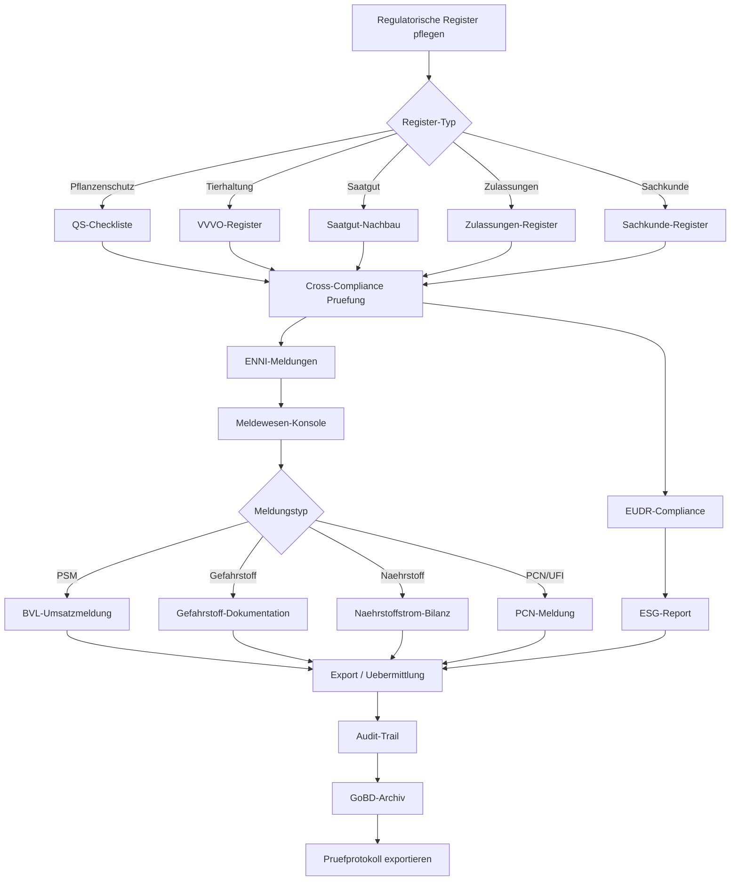

# COM-001 — Compliance-to-Audit (Meldewesen bis Pruefung)

## Zweck

Vollstaendige Workflow-Analyse des Compliance-Prozesses — von regulatorischen
Registern (Cross-Compliance, QS, ENNI, VVVO, Sachkunde, Saatgut-Nachbau,
Zulassungen) ueber Meldewesen-Konsole, BVL-PSM-Umsatzmeldung, PCN/UFI,
Gefahrstoff-/Naehrstoff-Exporte bis zum Audit-Trail und GoBD-Archivierung.

## Flow-Spine

- **processKey**: `compliance-to-report`
- **Einstiegsmodi**: Datensammlung, Aggregation, Validierung, Freigabe, Reporting
- **Zielmasken**: `/nachhaltigkeit/co2-bilanz`, `/nachhaltigkeit/eudr-compliance`

## Mermaid — Compliance-to-Audit Prozessfluss

## Betroffene Bereiche

### Frontend (11 Seiten unter pages/compliance/)

| Seite | Reifegrad | API |
|-------|-----------|-----|
| `cross-compliance.tsx` | Mittel | `GET /compliance/cross-compliance` |
| `enni-meldungen.tsx` | Mittel | `GET /compliance/enni-meldungen` |
| `qs-checkliste.tsx` | Mittel (CamelCase-Mismatch) | `GET /compliance/qs-checkliste` |
| `zulassungen-register.tsx` | Mittel (CamelCase-Mismatch) | `GET /compliance/zulassungen-register` |
| `vvvo-register.tsx` | Mittel (CamelCase-Mismatch) | `GET /compliance/vvvo-register` |
| `sachkunde-register.tsx` | Mittel (CamelCase-Mismatch) | `GET /compliance/sachkunde-register` |
| `saatgut-nachbau.tsx` | Mittel | `GET /compliance/saatgut-nachbau` |
| `bvl-umsatzmeldung.tsx` | **Jetzt funktional** (Endpoint war fehlend) | `GET /compliance/bvl-umsaetze` |
| `pcn-ufi.tsx` | Mittel (Navigation zu pcn-liste fehlt) | `POST /compliance/pcn-meldungen` |
| `export-pruefprotokoll.tsx` | Hoch | Exporte (Gefahrstoff, Naehrstoff, Chargen) |
| `meldewesen-konsole.tsx` | Hoch (Konfiguration) | `/config/*`, `/jobs` |

### Backend

| Datei | Reifegrad |
|-------|-----------|
| `compliance.py` | Gemischt (DB-Listen real, EUDR/USTVA statisch, BVL jetzt implementiert) |
| `audit.py` | Hoch (persistente AuditLog-Abfragen) |
| `gobd_archiv.py` | Hoch (Audit-Package-Export) |

## Umgesetzte Fixes (COM-001)

### COM-002: BVL-Umsaetze Endpoint
- `compliance.py`: `GET /compliance/bvl-umsaetze` implementiert — aggregiert PSM-Absatzmengen aus StockMovements

## Offene P2-Gaps

- CamelCase-Mismatch: Backend liefert `snake_case`, Frontend-Typen erwarten `camelCase` (QS, Zulassungen, VVVO, Sachkunde)
- `audit_evidence.py` nicht in `api.py` registriert
- PCN: Navigation zu `/compliance/pcn-liste` ohne Route
- Flow-Spine heisst `compliance-to-report`, nicht `compliance-to-audit`

## Status

**Erstanalyse + P1-Fixes abgeschlossen** (2026-03-28).
