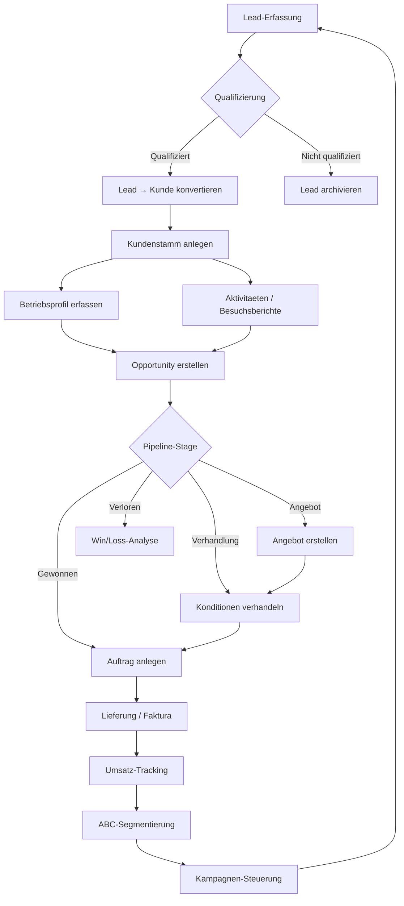

# CRM-001 — CRM-to-Revenue (Kundenmanagement bis Umsatz)

## Zweck

Vollstaendige Workflow-Analyse des CRM-Prozesses — von Lead-Erfassung ueber
Kundenqualifizierung, Opportunity-Management, Angebote, Auftragsanbahnung bis
zur Umsatzanalyse (ABC-Segmentierung).

## Flow-Spine

- **processKey**: Kein eigener Flow-Spine; CRM-Einstieg ueber `order-to-cash`
- **Zielmasken**: `/crm/kunden`, `/crm/leads`, `/crm/opportunities`, `/vertrieb/kundenumsatz`

## Mermaid — CRM-to-Revenue Prozessfluss

## Betroffene Bereiche

### Frontend (49 Seiten unter pages/crm/ + pages/vertrieb/)

| Bereich | Seiten | Reifegrad |
|---------|--------|-----------|
| Kunden-Stamm | `kunden-stamm-modern.tsx`, `kunden-liste.tsx` | Hoch (CRUD via crmService) |
| Leads | `leads.tsx`, `lead-detail/` | Hoch |
| Kontakte | `kontakte-liste.tsx`, `kontakt-detail.tsx` | Hoch |
| Aktivitaeten | `aktivitaeten.tsx`, `aktivitaet-detail.tsx` | Hoch |
| Betriebsprofile | `betriebsprofile-liste.tsx`, `betriebsprofil-detail.tsx` | Hoch |
| Opportunities | `opportunities-liste.tsx`, `opportunity-detail.tsx` | Mittel (CRUD ok) |
| Opportunities Kanban | `opportunities-kanban.tsx` | Niedrig (Stages-Endpoint fehlt) |
| Opportunities Forecast | `opportunities-forecast.tsx` | Niedrig (Endpoint fehlt) |
| Kundenumsatz | `vertrieb/kundenumsatz.tsx` | **Jetzt API-angebunden** (war statisch) |
| Kampagnen | `campaigns.tsx`, `campaign-builder.tsx` | Mittel (eigener Service-Pfad) |
| GDPR | `gdpr-requests.tsx`, `consent-management.tsx` | Mittel |
| CRM-Dashboard | `crm-dashboard.tsx` | Hoch (compat-Endpoint) |

### Backend (10+ Endpoint-Dateien)

| Datei | Reifegrad |
|-------|-----------|
| `customers.py` | Hoch (crm-core + DB-Fallback) |
| `leads.py` | Hoch |
| `contacts.py` | Hoch |
| `opportunities.py` | Mittel (nur CRUD, kein Forecast/Stages) |
| `activities.py` | Hoch |
| `farm_profiles.py` | Hoch |
| `crm_reports.py` | Hoch (SQL: Pipeline, Win/Loss, Lead-Sources) |
| `business_partners.py` | Hoch (umfangreich) |

## Umgesetzte Fixes (CRM-001)

### CRM-002: Kundenumsatz API-Anbindung
- `vertrieb/kundenumsatz.tsx`: Von statischen Demo-Daten auf `GET /api/v1/crm/customers` umgestellt
- ABC-Segmentierung wird jetzt aus echten Kundendaten berechnet

## Offene P2-Gaps

- Opportunities Kanban: `/opportunities/stages` Endpoint fehlt im v1-Router
- Opportunities Forecast: `/opportunities/forecast` Endpoint fehlt
- crm-service.ts erwartet `{ data: [] }` statt `{ items: [] }` — Format-Mismatch
- Legacy-Pfade `/api/crm/kunden` vs. kanonisch `/api/v1/crm/customers`

## Status

**Erstanalyse + P1-Fixes abgeschlossen** (2026-03-28).
