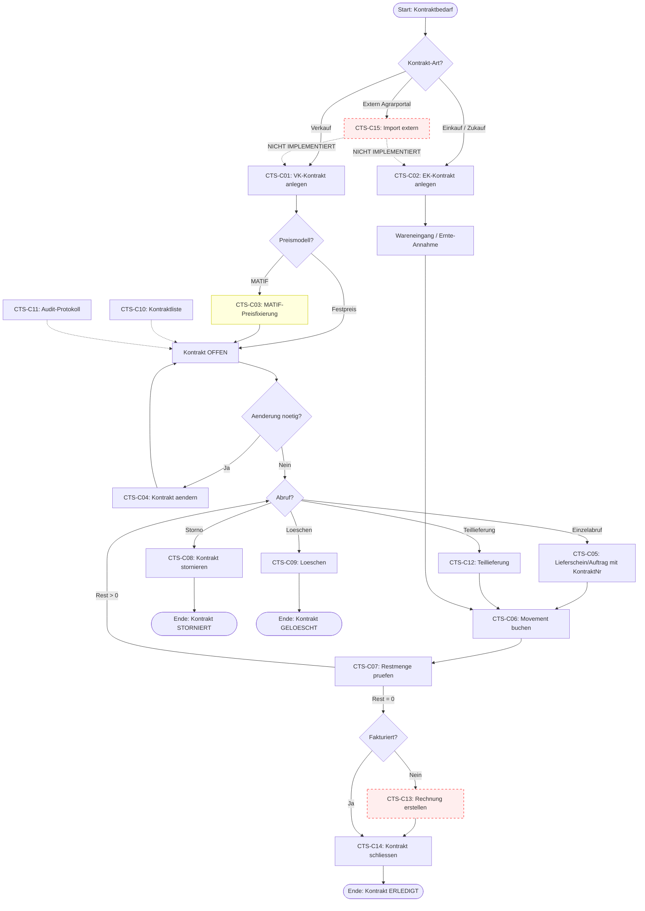

# CTS-001 — Contract-to-Settlement (Kontrakt bis Abrechnung)

> **Flow-Spine:** `flow-spine-contract-to-settlement`
> **Slice:** CTS-001
> **Status:** Erstanalyse — Durchlauf 1 + 2 + 3
> **Erstellt:** 2026-03-27
> **Bearbeiter:** Cursor Agent (OTC-Lane)

---

## A — Workflow-Uebersicht

Der Workflow **Contract-to-Settlement** bildet den vollstaendigen Lebenszyklus eines Handels-/Agrar-Kontrakts ab — von der Kontraktanlage ueber Lieferung, Fakturierung, Mengenabgleich bis zur finanziellen Abrechnung und Kontraktschliessung.

Im Landhandel und in Agrargenossenschaften ist der Kontrakthandel das Rueckgrat des operativen Geschaefts: Getreide, Oelsaaten, Duengemittel und Futtermittel werden auf Kontraktbasis gehandelt — mit Festpreisen, MATIF-Kopplungen, Prämien, Staffeln, Qualitaetsbedingungen und saisonalen Laufzeiten.

**Beteiligte Masken (Ist-Stand):**
- `LstKontraktUebersicht` — Kontraktliste mit Filter und Export
- `FrmKontraktDetail` — Kontraktstammdaten, Positionen, Tabs, Status
- `DlgAuswahlVerkaufKontrakte` — Lookup bestehender Verkaufskontrakte
- `DlgKontraktUmSaetze` — Umsaetze/Movements pro Kontrakt
- `FrmKontraktProtokoll` — Audit-Trail (wer, wann, was)
- `order-editor.tsx` — Verkaufsauftrag (Kontraktnr. auf Position)
- `lieferschein-erfassung.tsx` — Lieferschein (Kontraktnr. auf Position)

**Beteiligte APIs (Ist-Stand):**
- `GET/POST/PATCH/DELETE /api/v1/kontrakte`
- `POST /api/v1/kontrakte/{id}/cancel`
- `GET/POST /api/v1/kontrakte/{id}/movements`
- `GET /api/v1/kontrakte/{id}/audit`
- `POST /api/v1/kontrakte/lookup/verkauf`
- `POST /api/v1/contract-pricing/price-matrix`
- `POST /api/v1/contract-pricing/lots`

---

## B — Vollstaendige Card-Liste

### CTS-001-C01: Kontraktanlage (Verkauf)

```
Card-ID: CTS-001-C01
Name: Verkaufskontrakt anlegen
Prozessbereich: Kontraktverwaltung / Erfassung

Kurzbeschreibung:
Ein neuer Verkaufskontrakt wird fuer einen Kunden erfasst mit Artikel,
Menge, Preis, Laufzeit und Bedingungen.

Ziel des Schrittes:
Verbindliche Vereinbarung ueber Ware, Menge und Preis schaffen.

Trigger / Startbedingung:
- Telefonische/schriftliche Bestellung eines Kunden
- Abschluss nach Angebotsphase
- Uebernahme aus Agrarportal oder Online-Shop
- Workflow-Handover aus Flow-Spine

Vorbedingungen:
- Kunde existiert im System (party_id)
- Artikel verfuegbar
- Preisfindung moeglich (fest, MATIF, Praemie)
- Laufzeitdaten bekannt

Input-Daten:
- Kontrakt-Typ: VERKAUF
- Kunde (party_id + Debitor-Konto)
- Niederlassung, Bediener
- Laufzeit (gueltig von / bis)
- Mengen-Art (Gesamtkontrakt / Einzelmengen)
- Gesamtmenge + Einheit
- 1-3 Artikelpositionen (Artikel, Menge, Einh.-Preis, Rabatt, Zuschlag)
- Preismodell (fixed / matif / premium)
- Zahlungsbedingungen, Bedingungen-JSON, Notizen

UI-Maske / Seite / Komponente:
FrmKontraktDetail (Neuanlage: /kontrakte/neu)

Aktion des Benutzers oder Systems:
Benutzer erfasst alle Felder und klickt "Speichern".
System vergibt Kontraktnummer aus Nummernkreis.
System prueft PositionGuard (Short-Violation-Check).

Geschaeftsregel / Validierungsregel:
- party_id + contract_type Pflicht
- 1-3 Positionen, jede mit article_id
- Bei GESAMTKONTRAKT: Summe Positionsmengen = Gesamtmenge
- PositionGuard: Verkaufsmenge darf Bestand-Toleranz nicht verletzen
- Manuelle Kontraktnummer nur mit KONTRAKT_ADMIN

Output-Daten:
- contract_id (UUID7)
- contract_no (aus Nummernkreis)
- Status: OFFEN
- Audit-Eintrag: CREATE

Naechster Standardschritt:
CTS-001-C05 (Lieferung/Abruf gegen Kontrakt)

Alternative Folgeschritte:
- CTS-001-C03 (MATIF-Preisfestsetzung, wenn pricing_model=matif)
- CTS-001-C04 (Aenderung vor erstem Abruf)
- Abbruch ohne Speicherung

Schleifen / Rueckspruenge:
- Ruecksprung zur Korrektur bei Validierungsfehler
- Erneuter PositionGuard-Check nach Mengenkorrektur

Fehlerfaelle / Edge Cases:
- Kunde gesperrt (keine Pruefung im Ist-Stand)
- Artikel nicht lieferbar
- Kontraktmenge zu hoch (PositionGuard blockiert)
- Doppelte Kontraktnummer (409 Conflict)
- MATIF-Preis noch nicht festgelegt
- Bio-Kontrakt mit Nicht-Bio-Artikel

Fehlende Umsetzung:
- Keine Kundensperr-Pruefung
- Kein Import aus Agrarportal oder Online-Shop
- Kein Freigabe-/Genehmigungsworkflow (4-Augen)
- Keine automatische Kreditlimit-Pruefung
- Keine Duplikat-Warnung (gleicher Kunde + Artikel + Zeitraum)

Soll-Ist-Bewertung:
Grundfunktion umgesetzt, wesentliche Praxisprüfungen fehlen.

Risiko bei fehlender oder falscher Umsetzung:
HOCH — Kontrakte ohne Kreditpruefung koennen zu Forderungsausfaellen fuehren.

Annahmen:
Nummernkreis-Vergabe funktioniert serverseitig zuverlaessig.
PositionGuard ist fuer Verkaufskontrakte aktiv.
```

### CTS-001-C02: Kontraktanlage (Einkauf/Zukauf)

```
Card-ID: CTS-001-C02
Name: Einkaufs- oder Zukaufskontrakt anlegen
Prozessbereich: Kontraktverwaltung / Erfassung

Kurzbeschreibung:
Ein Ankaufs- oder Zukaufskontrakt wird fuer einen Lieferanten erfasst.
Typisch fuer Getreideankauf von Landwirten oder Zukauf von anderen Haendlern.

Ziel des Schrittes:
Absicherung der Beschaffungsseite — Menge, Preis, Qualitaet, Lieferzeitraum.

Trigger / Startbedingung:
- Lieferant bietet Ware an (Ernte-Vorvertrag, Rahmenvereinbarung)
- Einkaufsabteilung schliesst Kontrakt ab
- Uebernahme aus Agrarportal (Lieferanten-Self-Service)

Vorbedingungen:
- Lieferant existiert (party_id)
- Artikel/Sorte bekannt
- Preis oder Preismodell vereinbart

Input-Daten:
- Kontrakt-Typ: EINKAUF oder ZUKAUF
- Lieferant (party_id + Kreditor-Konto)
- Artikelpositionen, Qualitaetsmerkmale
- Preis, Praemien, Trocknungsregelwerk-Verweis
- Lieferzeitraum

UI-Maske / Seite / Komponente:
FrmKontraktDetail (Kontrakt-Typ auf EINKAUF/ZUKAUF)

Aktion:
Benutzer waehlt Typ EINKAUF/ZUKAUF, erfasst Lieferant und Positionen.

Geschaeftsregel:
- Gleiche Basisvalidierung wie C01
- PositionGuard NICHT aktiv fuer Einkauf (nur Verkauf)
- Kreditor-Konto statt Debitor-Konto

Output-Daten:
- contract_id, contract_no, Status OFFEN

Naechster Standardschritt:
Wareneingang / Ernte-Annahme gegen Kontrakt

Alternative Folgeschritte:
- Preisverhandlung / Nachverhandlung
- Storno vor Lieferbeginn

Fehlerfaelle / Edge Cases:
- Lieferant gesperrt
- Qualitaetsabweichung bei Ernte (anderer Feuchtegehalt)
- Doppelkontrakt gleicher Lieferant + Artikel + Zeitraum
- Kontraktmengen-Splitting auf mehrere Erntepartien

Fehlende Umsetzung:
- Keine Lieferantensperr-Pruefung
- Keine Verknuepfung zu Trocknungsregelwerk (DryingRuleSet hat contract_id-Feld, aber UI fehlt)
- Kein Agrarportal-Import
- Keine Qualitaetsparameter auf Kontraktebene (nur im Bedingungen-JSON lose)

Soll-Ist-Bewertung:
Grundstruktur vorhanden, agrarspezifische Anbindung lueckenhaft.

Risiko:
HOCH — Agrargenossenschaften brauchen Ankaufskontrakte als Kern ihres Geschaeftsmodells.

Annahmen:
Lieferantenstamm ist separat gepflegt. Trocknungsregeln werden ueber agrar_settlements verlinkt.
```

### CTS-001-C03: MATIF-/Boersenpreis-Kopplung und Preisfestsetzung

```
Card-ID: CTS-001-C03
Name: Preisfestsetzung bei MATIF-Kopplung
Prozessbereich: Kontraktverwaltung / Preisfindung

Kurzbeschreibung:
Bei Kontrakten mit Boersenpreisbindung (MATIF) muss der endgueltige Preis
innerhalb eines definierten Zeitfensters fixiert werden.

Ziel:
Festlegung des finalen Kontraktpreises auf Basis von Boersennotierungen.

Trigger:
- Kontrakt hat pricing_model = "matif"
- Preisfenster (pricing_window_from/to) ist eroeffnet
- Haendler oder Kunde ruft Fixierung ab

Vorbedingungen:
- Kontrakt OFFEN
- Preisfenster aktiv
- Basis-Referenz (basis_reference) definiert
- MATIF-Kurs verfuegbar

Input-Daten:
- Aktueller MATIF-Kurs
- Praemie (premium_value, premium_type: absolute/prozentual)
- Mindestpreis (min_price)

UI-Maske:
FrmKontraktDetail — ProcessStatusPanel zeigt "MATIF-Preisfestsetzung offen"

Aktion:
Benutzer fixiert Preis manuell (aktuell kein automatisierter Boersenabruf).

Geschaeftsregel:
- Preis darf nicht unter min_price fallen
- Fixierung nur innerhalb pricing_window

Output:
- Aktualisierter unit_price auf Positionen
- Audit-Eintrag

Fehlende Umsetzung:
- KEIN automatischer Boersenkurs-Abruf (Schnittstelle fehlt)
- KEIN Preisfixierungs-Dialog (nur manuell ueber Einh.-Preis-Feld)
- KEIN Preisfenster-Ablauf-Alarm
- KEINE Mehrfach-Fixierung (Teilmenge auf verschiedene Kurse)

Soll-Ist-Bewertung:
Datenmodell vorhanden (Felder existieren), Prozesslogik nicht implementiert.

Risiko:
KRITISCH — MATIF-Kontrakte sind im Getreidehandel Standardgeschaeft. Ohne Prozessunterstuetzung manueller Workaround noetig.

Annahmen:
MATIF-Kopplung wird initial manuell abgebildet, automatisierte Anbindung ist Ausbaustufe.
```

### CTS-001-C04: Kontrakt aendern / korrigieren

```
Card-ID: CTS-001-C04
Name: Kontrakt aendern
Prozessbereich: Kontraktverwaltung / Pflege

Kurzbeschreibung:
Aenderung von Mengen, Preisen, Laufzeiten oder Bedingungen eines offenen Kontrakts.

Trigger:
- Nachverhandlung mit Kunde/Lieferant
- Preisanpassung
- Mengenaenderung
- Laufzeitverlaengerung

Vorbedingungen:
- Kontrakt Status = OFFEN
- Benutzer hat Rolle KONTRAKT_BEARBEITEN

UI-Maske:
FrmKontraktDetail (Bearbeitungsmodus)

Aktion:
Benutzer aendert Felder und speichert (PATCH-Endpunkt).

Geschaeftsregel:
- Statuswechsel zu ERLEDIGT/STORNIERT nur mit KONTRAKT_ADMIN
- PositionGuard-Check bei Mengenerhöhung (Verkauf)
- Kontraktnummer-Aenderung nur mit KONTRAKT_ADMIN
- Alle Aenderungen werden im Audit-Log protokolliert

Output:
- Aktualisierter Kontrakt
- Audit-Diff (Feld, alter Wert, neuer Wert)

Fehlerfaelle:
- Aenderung nach bereits gelieferten Mengen (Restmenge < 0)
- Preisaenderung nach Teilfakturierung
- Mengenreduzierung unter bereits abgerufene Menge

Fehlende Umsetzung:
- Keine Sperre bei laufender Lieferung (kein Check: bereits gelieferte Menge > neue Gesamtmenge)
- Kein Aenderungsgrund-Pflichtfeld
- Kein Genehmigungs-Workflow fuer wesentliche Aenderungen
- Keine Versionierung (nur Audit-Trail, kein Snapshot alter Versionen)

Soll-Ist-Bewertung:
Grundmechanik funktioniert, Absicherung gegen inkonsistente Aenderungen fehlt.

Risiko:
HOCH — Aenderungen koennen bestehende Umsaetze inkonsistent machen.
```

### CTS-001-C05: Abruf / Lieferung gegen Kontrakt (Verkauf)

```
Card-ID: CTS-001-C05
Name: Lieferschein oder Auftrag mit Kontraktbezug
Prozessbereich: Auftragsabwicklung / Warenausgang

Kurzbeschreibung:
Ein Verkaufsauftrag oder Lieferschein wird unter Bezug auf einen Kontrakt
erstellt. Dabei wird die Kontraktnummer auf der Position mitgefuehrt.

Trigger:
- Kunde ruft Ware ab
- Disponentin erstellt Lieferschein fuer Kontraktmenge
- Direktabholung am Lager

Vorbedingungen:
- Kontrakt OFFEN
- Restmenge > 0 (oder allow_overdelivery = true)

Input-Daten:
- Kontraktnummer (manuell auf Position eingetragen)
- Artikel, Menge, Preis aus Kontrakt

UI-Maske:
- order-editor.tsx: Feld "Kontrakt-Nr." auf Position
- lieferschein-erfassung.tsx: Feld "Kontrakt-Nr." auf Position
- Button "Kontrakte" in der Toolbar zum Lookup

Aktion:
Benutzer traegt Kontraktnummer manuell ein oder nutzt Lookup-Dialog.

Geschaeftsregel (Soll):
- Preis aus Kontrakt automatisch uebernehmen
- Restmenge pruefen und warnen bei Ueberschreitung
- Kontraktbindung auf Positionsebene durchsetzen

Output:
- Lieferschein/Auftrag mit Kontraktbezug
- Movement-Eintrag im Kontrakt (CTS-001-C06)

Fehlende Umsetzung:
- KEIN automatischer Preisabzug aus Kontrakt (Benutzer muss Preis manuell eingeben)
- KEIN Restmengen-Check bei Auftrags-/Lieferschein-Erstellung
- KEINE automatische Movement-Buchung (Movement wird nicht aus Auftrag/Lieferschein erstellt)
- Kontraktnummer ist nur ein Freitext-Feld — KEINE Referenz-Validierung
- Kein Lookup im Auftrag fuer Einkaufskontrakte (nur Verkauf)

Soll-Ist-Bewertung:
KRITISCHE LUECKE — Kontraktbezug existiert nur als loses Textfeld ohne Prueflogik.

Risiko:
KRITISCH — Ohne automatische Mengen-/Preisuebernahme ist der Kontrakt nicht operativ wirksam.

Annahmen:
Der Kontraktbezug soll langfristig eine echte Fremdschluessel-Beziehung mit automatischer Preisuebernahme werden.
```

### CTS-001-C06: Kontraktumsatz-Buchung (Movement)

```
Card-ID: CTS-001-C06
Name: Umsatz/Movement gegen Kontrakt buchen
Prozessbereich: Kontraktverwaltung / Mengenabgleich

Kurzbeschreibung:
Jede Lieferung, Rechnung oder Warenbewegung, die auf einen Kontrakt
entfaellt, wird als Movement erfasst. Daraus ergibt sich die Restmenge.

Trigger:
- Lieferschein wird gebucht
- Rechnung wird erstellt
- Manueller Umsatzeintrag

Vorbedingungen:
- Kontrakt existiert
- line_id zuordenbar

Input-Daten:
- line_id (Kontraktposition)
- Menge (quantity > 0)
- Auftragsnr., Lieferscheinnr., Rechnungsnr.
- Datum, Einh.-Preis, Strecke-Nr.
- is_invoiced, is_archived

UI-Maske:
DlgKontraktUmSaetze (Lese-Dialog) — keine Erfassungsmaske im UI

Aktion:
Aktuell nur ueber API (POST /kontrakte/{id}/movements).
Kein UI-Button fuer manuelle Movement-Erfassung.

Geschaeftsregel:
- Menge muss > 0 sein
- quantity + bestehende Movements ≤ Kontraktmenge (oder allow_overdelivery)
- Bei Gesamtkontrakt: Summe ueber alle Positionen zaehlt

Output:
- movement_id
- Aktualisierte Restmenge auf Kontrakt und Position

Fehlende Umsetzung:
- KEIN UI zur manuellen Movement-Erfassung
- KEINE automatische Movement-Erstellung aus Lieferschein/Rechnung
- Restmengen-Warnung nur im Umsaetze-Dialog lesbar, nicht beim Buchen
- Kein Storno-Movement (negative Buchung bei Retoure)

Soll-Ist-Bewertung:
API vorhanden, aber nicht in den operativen Belegfluss integriert.

Risiko:
KRITISCH — Ohne automatische Movements ist die Restmengen-Ermittlung manuell und fehleranfaellig.
```

### CTS-001-C07: Restmengen-Ueberwachung und Kontrakterfuellung

```
Card-ID: CTS-001-C07
Name: Restmengen pruefen und Kontrakterfuellung ueberwachen
Prozessbereich: Kontraktverwaltung / Monitoring

Kurzbeschreibung:
Die Restmenge eines Kontrakts wird laufend ueberwacht. Bei vollstaendiger
Erfuellung oder Ablauf der Laufzeit soll der Kontrakt geschlossen werden.

Trigger:
- Neue Movement-Buchung
- Manueller Check durch Sachbearbeiter
- Laufzeitende erreicht

UI-Maske:
- LstKontraktUebersicht: Spalte Rest-Menge
- FrmKontraktDetail: Feld Rest-Menge (berechnet)
- DlgKontraktUmSaetze: Umsaetze-Detail

Aktion:
Benutzer prueft Restmenge und entscheidet ueber Schliessung.

Fehlende Umsetzung:
- KEIN automatischer Statuswechsel bei Restmenge = 0
- KEIN Alarm/Dashboard fuer ablaufende Kontrakte
- KEIN Batch-Job fuer Laufzeit-Ueberwachung
- KEINE Toleranz-Logik (z. B. Restmenge < 1% = als erfuellt betrachten)

Soll-Ist-Bewertung:
Restmenge wird berechnet und angezeigt, aber nicht automatisch ausgewertet.

Risiko:
MITTEL — Kontrakte bleiben ewig "OFFEN", wenn niemand manuell schliesst.
```

### CTS-001-C08: Kontrakt stornieren

```
Card-ID: CTS-001-C08
Name: Kontrakt stornieren
Prozessbereich: Kontraktverwaltung / Abbruch

Kurzbeschreibung:
Ein Kontrakt wird vollstaendig storniert (z. B. bei Vertragsruecktritt).

Trigger:
- Kunde oder Lieferant tritt zurueck
- Fachliche Fehlanlage
- Ware nicht lieferbar

Vorbedingungen:
- Kontrakt existiert
- Benutzer hat KONTRAKT_BEARBEITEN oder KONTRAKT_ADMIN

UI-Maske:
FrmKontraktDetail — Button "Workflow erledigt/stornieren"

Aktion:
POST /kontrakte/{id}/cancel mit optionalem Grund.
Status wechselt auf STORNIERT.

Geschaeftsregel:
- Status wird auf STORNIERT gesetzt
- Stornierter Kontrakt ist nicht mehr bearbeitbar (isDraftEditable = false)
- ProcessStatusPanel zeigt "gesperrt"

Output:
- Status: STORNIERT
- Toast "Storniert"
- Detailquery wird refreshed

Fehlende Umsetzung:
- KEIN Stornogrund-Pflichtfeld (nur optionaler Parameter, nicht in UI eingegeben)
- KEINE Pruefung auf bereits gelieferte Mengen (Storno trotz Teilerfuellung moeglich)
- KEINE Folgeprozesse (offene Lieferscheine, Rechnungen bleiben haengen)
- KEIN Rueckgaengig-machen eines Stornos

Soll-Ist-Bewertung:
Mechanisch funktional, fachlich unvollstaendig.

Risiko:
MITTEL — Storno ohne Folgebeleg-Bereinigung verursacht Inkonsistenzen.
```

### CTS-001-C09: Kontrakt loeschen

```
Card-ID: CTS-001-C09
Name: Kontrakt loeschen (physisch)
Prozessbereich: Kontraktverwaltung / Bereinigung

Kurzbeschreibung:
Ein Kontrakt wird physisch geloescht (nur bei Fehlanlage, vor erstem Abruf).

Trigger:
- Fehlanlage erkannt

Vorbedingungen:
- Kontrakt Status = OFFEN
- Benutzer hat KONTRAKT_LOESCHEN oder KONTRAKT_ADMIN
- Keine Movements vorhanden (Soll)

UI-Maske:
FrmKontraktDetail — Button "Loeschen"

Geschaeftsregel:
- DELETE-Endpunkt mit optionalem ?force=true
- Loeschen setzt isDraftEditable voraus

Fehlende Umsetzung:
- KEINE Pruefung auf vorhandene Movements vor Loeschung
- KEIN Soft-Delete (physische Loeschung)
- Kein Bestaetigung-Dialog im UI (nur direkte Aktion)

Soll-Ist-Bewertung:
Technisch moeglich, fachliche Absicherung fehlt.

Risiko:
HOCH — Physisches Loeschen verletzt Revisionssicherheit (GoBD).
```

### CTS-001-C10: Kontraktliste und Suche

```
Card-ID: CTS-001-C10
Name: Kontraktliste filtern, suchen, exportieren
Prozessbereich: Kontraktverwaltung / Recherche

Kurzbeschreibung:
Uebersicht aller Kontrakte mit Filter nach Typ, Zeitraum, Matchcode,
Nummernbereich und Sortierung.

UI-Maske:
LstKontraktUebersicht

Aktion:
Benutzer filtert und oeffnet Kontrakt per Doppelklick.

Geschaeftsregel:
- Filter: Kontrakt-Art, Datum von/bis, Kontrakt-Nr. von/bis, Matchcode 1+2
- Checkbox: nur unerledigte / auch erledigte
- Export: CSV mit Semikolon-Trenner
- Sortierung: Kontrakt-Nr. auf-/absteigend

CRUD-Befund:
- Create: Button "Neu" → /kontrakte/neu ✓
- Read: Tabelle mit Kontrakt-Nr., Datum, Gueltigkeit, Partner, Mengen ✓
- Update: Doppelklick → Detail ✓
- Delete: nicht in Liste (nur im Detail) — OK

Fehlende Umsetzung:
- Spalten "Artikel-Nr" und "Bezeichnung" zeigen "-" (nicht aufgeloest)
- Spalte "Einh.-Preis" zeigt "-" (nicht aus Positionen aggregiert)
- Kein Statusfilter in der UI (API hat ihn)
- Kein Party-Name-Aufloesung (nur party_id)
- Kein Paginierung im UI (max. 200 Datensaetze)
- Export enthält keinen Einheitspreis

Soll-Ist-Bewertung:
Funktional, aber optisch unvollstaendig und fuer groessere Datenmengen nicht skaliert.

Risiko:
NIEDRIG (operativ nutzbar, aber unprofessionell bei Kundenpraesentationen).
```

### CTS-001-C11: Kontrakt-Auditprotokoll

```
Card-ID: CTS-001-C11
Name: Aenderungsprotokoll einsehen
Prozessbereich: Kontraktverwaltung / Compliance

UI-Maske:
FrmKontraktProtokoll (Tab "PROTOKOLL" im Detail)

Aktion:
Anzeige aller Aenderungen mit Zeitstempel, Benutzer, Feldname, alt/neu.
Filter nach Feld und Benutzer.

CRUD-Befund:
- Read: ✓ (vollstaendige Tabelle mit Filter)
- Write: nur Backend-seitig beim Speichern

Fehlende Umsetzung:
- Keine Export-Funktion (PDF/CSV)
- Kein Audit fuer Movement-Buchungen (nur Stammdaten)

Soll-Ist-Bewertung:
Gut umgesetzt, Erweiterung fuer Revisionsprüfung wuenschenswert.

Risiko:
NIEDRIG
```

### CTS-001-C12: Teillieferung und Restmengen-Splitting

```
Card-ID: CTS-001-C12
Name: Teillieferung und Restmengen-Handling
Prozessbereich: Auftragsabwicklung / Mengenlogik

Kurzbeschreibung:
Im Landhandel sind Teillieferungen der Normalfall — ein 500t-Kontrakt wird
ueber Wochen in 25t-LKW-Ladungen abgerufen.

Trigger:
- Einzelne LKW-Ladung wird abgerufen
- Teile der Kontraktmenge werden in separaten Auftraegen disponiert

Fehlende Umsetzung:
- KEINE automatische Restmengen-Fortschreibung aus Lieferscheinen
- KEIN Splitting-Mechanismus (z. B. Kontrakt auf mehrere Lieferadressen aufteilen)
- KEINE Toleranzsteuerung (± 5% Ueber-/Unterlieferung branchenüblich)
- KEINE Mengenstaffel-Logik (Preis abhaengig von Abrufmenge)
- KEINE Abruf-/Lieferplan-Sicht

Soll-Ist-Bewertung:
Datenmodell erlaubt Teillieferungen (Movements), aber operativer Prozess nicht verdrahtet.

Risiko:
KRITISCH — Teillieferungen sind Kerngeschaeft im Landhandel.
```

### CTS-001-C13: Fakturierung gegen Kontrakt

```
Card-ID: CTS-001-C13
Name: Rechnungserstellung mit Kontraktbezug
Prozessbereich: Faktura / Abrechnung

Kurzbeschreibung:
Rechnungen werden fuer kontraktgebundene Lieferungen erstellt.
Kontraktnummer muss auf Rechnung erscheinen.

Trigger:
- Lieferschein gebucht
- Sammelrechnung zum Monatsende

Fehlende Umsetzung:
- KEIN automatischer Rechnungslauf aus Kontraktumsaetzen
- KEIN Sammelrechnungs-Mechanismus (mehrere Lieferscheine → eine Rechnung)
- Kontraktnummer nicht automatisch auf Rechnung uebernommen
- is_invoiced-Flag auf Movements wird nicht automatisch gesetzt

Soll-Ist-Bewertung:
Nicht implementiert als integrierter Prozess.

Risiko:
HOCH — Ohne Faktura-Integration entsteht Medienbruch.
```

### CTS-001-C14: Kontrakt schliessen (Erledigt)

```
Card-ID: CTS-001-C14
Name: Kontrakt als erfuellt markieren
Prozessbereich: Kontraktverwaltung / Abschluss

Trigger:
- Alle Mengen geliefert und fakturiert
- Laufzeitende erreicht, keine offenen Abrufe

Aktion:
Status auf ERLEDIGT setzen (nur KONTRAKT_ADMIN).

Fehlende Umsetzung:
- KEIN automatischer Abschluss
- KEIN Abschluss-Check (Restmenge, offene Rechnungen, offene Lieferscheine)
- KEIN Abschluss-Bericht / -Zusammenfassung

Soll-Ist-Bewertung:
Manueller Statuswechsel moeglich, kein strukturierter Abschlussprozess.

Risiko:
MITTEL — Kontrakte werden vergessen und bleiben offen.
```

### CTS-001-C15: Externe Uebernahme (Agrarportal / Online-Shop)

```
Card-ID: CTS-001-C15
Name: Kontraktuebernahme aus externen Systemen
Prozessbereich: Schnittstelle / Import

Kurzbeschreibung:
Lieferanten koennen ueber das Agrarportal Kontrakte self-service erfassen.
Kunden koennen ueber den Online-Shop Rahmenvereinbarungen auslösen.

Fehlende Umsetzung:
- KOMPLETT nicht implementiert
- Portal-Frontend (portal/vertraege.tsx) existiert, aber keine Schnittstelle zum Kontraktmodul
- Kein Import-Mechanismus
- Kein Freigabe-Workflow fuer extern erfasste Kontrakte

Soll-Ist-Bewertung:
Nicht umgesetzt.

Risiko:
MITTEL — Wird erst in spaeterer Ausbaustufe relevant, aber strategisch wichtig.
```

---

## C — Mermaid-Diagramm



---

## D — Soll-Ist-Abweichungen

| Nr | Card | Abweichung | Schwere |
|----|------|-----------|---------|
| 1 | C01/C02 | Keine Kundensperr-/Lieferantensperr-Pruefung bei Kontraktanlage | hoch |
| 2 | C01/C02 | Kein Kreditlimit-Check bei Verkaufskontrakt | hoch |
| 3 | C01/C02 | Kein 4-Augen-Freigabeworkflow | mittel |
| 4 | C01/C02 | Keine Duplikat-Warnung (gleicher Partner + Artikel + Zeitraum) | mittel |
| 5 | C03 | MATIF-Preisfixierung: Datenmodell vorhanden, Prozess fehlt komplett | kritisch |
| 6 | C03 | Kein Boersenkurs-Abruf, kein Preisfixierungs-Dialog, kein Ablauf-Alarm | kritisch |
| 7 | C04 | Keine Sperre bei inkonsistenten Aenderungen (Menge < bereits geliefert) | hoch |
| 8 | C04 | Kein Aenderungsgrund-Pflichtfeld | niedrig |
| 9 | C05 | **Kontraktnummer ist nur Freitext — keine echte Referenz** | kritisch |
| 10 | C05 | Kein automatischer Preisabzug aus Kontrakt in Auftrag/Lieferschein | kritisch |
| 11 | C05 | Keine Restmengen-Pruefung bei Abruf | kritisch |
| 12 | C06 | Movements werden nicht automatisch aus Belegfluss erstellt | kritisch |
| 13 | C06 | Kein UI fuer manuelle Movement-Erfassung | hoch |
| 14 | C07 | Kein automatischer Statuswechsel bei Restmenge = 0 | mittel |
| 15 | C07 | Kein Dashboard/Alarm fuer ablaufende Kontrakte | mittel |
| 16 | C08 | Kein Stornogrund in der UI (nur API-Parameter) | niedrig |
| 17 | C08 | Storno ohne Folgebeleg-Pruefung | mittel |
| 18 | C09 | Physisches Loeschen ohne Soft-Delete → GoBD-Risiko | hoch |
| 19 | C09 | Kein Movement-Check vor Loeschung | hoch |
| 20 | C10 | Artikel/Bezeichnung/Einh.-Preis in Liste nicht aufgeloest (nur "-") | niedrig |
| 21 | C10 | Party-Name nicht aufgeloest (nur ID) | niedrig |
| 22 | C10 | Kein Statusfilter in der UI | niedrig |
| 23 | C12 | Teillieferungs-Mechanismus nicht verdrahtet | kritisch |
| 24 | C12 | Keine Toleranzsteuerung (± % Ueber-/Unterlieferung) | hoch |
| 25 | C13 | Kein Faktura-Lauf aus Kontraktumsaetzen | hoch |
| 26 | C13 | Kein Sammelrechnungs-Mechanismus | hoch |
| 27 | C14 | Kein automatischer Kontraktabschluss | mittel |
| 28 | C15 | Externe Uebernahme komplett fehlend | mittel |

---

## E — UI-/CRUD-Befunde

| Maske | Create | Read | Update | Delete/Storno | Befund |
|-------|--------|------|--------|---------------|--------|
| LstKontraktUebersicht | ✓ (Button Neu) | ✓ (Tabelle) | ✓ (Doppelklick → Detail) | – (korrekt) | Artikel/Preis nicht aufgeloest, kein Statusfilter |
| FrmKontraktDetail | ✓ | ✓ | ✓ | ✓ Storno + ✓ Loeschen | Kein Bestaetigung-Dialog bei Loeschen; Storno ohne Grund; Tab-Inhalte teilweise identisch (3x gleicher Textarea fuer notes) |
| DlgAuswahlVerkaufKontrakte | – | ✓ (Suche) | – | – | Gut, funktional |
| DlgKontraktUmSaetze | – | ✓ | – | – | Nur lesend, keine Movement-Erfassung |
| FrmKontraktProtokoll | – | ✓ (Filter) | – | – | Gut, kein Export |
| order-editor: Kontrakt-Nr. | – | ✓ (Freitext) | ✓ (Freitext) | – | **Nur Freitext, keine Referenz-Validierung** |
| lieferschein-erfassung: Kontrakt-Nr. | – | ✓ (Freitext) | ✓ (Freitext) | – | **Nur Freitext, keine Referenz-Validierung** |

**Spezifische UI-Probleme:**
1. Tabs "KUNDE", "LIEFERANT", "LIEFERANSCHR", "INFO", "TEXTE" verweisen teilweise auf dasselbe Feld (`party_id` bzw. `notes`) — keine differenzierte Datenhaltung
2. Tab "BEDINGUNGEN" zeigt rohes JSON — kein strukturierter Editor
3. Tab "UNTERLAGEN/DATEIEN" hat nur einen Link zu /dokumente/ablage — keine kontraktspezifische Dokumentenliste
4. Positionstabelle: Move-Buttons zeigen "?" statt Pfeil-Icons (Zeichenkodierungsproblem)
5. Kein Pflichtfeld-Markierung (Sternchen) in der UI
6. Kein Tooltip oder Hilfetext fuer Felder wie "basis_reference" oder "premium_type"
7. Kontrakttyp-Wechsel nach Anlage nicht gesperrt (VERKAUF → EINKAUF → inkonsistent)

---

## F — Risiken (priorisiert)

### Kritisch
1. **Kontraktnummer auf Belegen ist nur Freitext** — keine Preisuebernahme, keine Mengensteuerung, keine Integritaet
2. **Movements werden nicht automatisch aus Belegfluss erzeugt** — Restmengen sind manuell und fehleranfaellig
3. **MATIF-Preisfixierung hat kein UI** — Getreidehandel ohne Boersenpreis-Kopplung nicht praxistauglich
4. **Teillieferungen nicht verdrahtet** — 500t Kontrakte koennen nicht in 25t-Ladungen abgerufen werden

### Hoch
5. Keine Kundensperr-/Kreditlimit-Pruefung — Forderungsausfallrisiko
6. Physisches Loeschen statt Soft-Delete — GoBD-Verstoss
7. Aenderungen ohne Konsistenz-Check (Menge < geliefert) — Datenkorruption
8. Kein Faktura-Lauf aus Kontrakt — Medienbruch bei Rechnungsstellung

### Mittel
9. Kein automatischer Kontraktabschluss bei Restmenge = 0
10. Kein Alarm fuer ablaufende Kontrakte
11. Storno ohne Folgebeleg-Pruefung
12. Kein 4-Augen-Freigabeworkflow

### Niedrig
13. Spalten in Kontraktliste unvollstaendig
14. Tabs mit redundanten Feldern
15. Kein Audit-Export

---

## G — Konkrete Empfehlungen (priorisiert)

### Prio 1: Kontraktbindung auf Belegen (CTS-002)
**Aufwand: mittel | Wirkung: sehr hoch**

Das `kontraktNr`-Freitext-Feld auf Auftrags- und Lieferschein-Positionen muss zu einer echten Referenz werden:
- `contract_id` + `contract_line_id` als Fremdschluessel auf Position
- Lookup-Dialog (DlgAuswahlVerkaufKontrakte) im Auftrag und Lieferschein einbinden
- Automatische Preisuebernahme (unit_price, discount_pct, surcharge)
- Restmengen-Check bei Positionserfassung

### Prio 2: Automatische Movement-Buchung (CTS-003)
**Aufwand: mittel | Wirkung: sehr hoch**

Bei Lieferschein-Buchung (Warenausgang) oder Rechnungserstellung automatisch:
- POST /kontrakte/{id}/movements mit Menge, Belegbezug
- is_invoiced setzen bei Rechnungsverknuepfung
- Restmenge aktualisieren und bei Restmenge = 0 optional Status auf ERLEDIGT

### Prio 3: MATIF-Preisfixierungs-Dialog (CTS-004)
**Aufwand: hoch | Wirkung: hoch**

- Neuer Dialog oder Tab in FrmKontraktDetail
- Eingabe: MATIF-Kurs, Praemie, Fixierungsdatum, Teilmenge
- Berechnung: Endpreis = MATIF + Praemie
- Mehrfachfixierung (z. B. 200t von 500t auf Kurs X, Rest spaeter)
- Preisfenster-Ablauf-Warnung

### Prio 4: Soft-Delete und Bestaetigung (CTS-005)
**Aufwand: niedrig | Wirkung: hoch**

- DELETE-Endpunkt aendert Status auf "GELOESCHT" statt physisch zu loeschen
- Movement-Check vor Loeschung (409 wenn Movements vorhanden)
- Bestaetigung-Dialog im UI ("Wirklich loeschen?")

### Prio 5: Kontraktliste aufwerten (CTS-006)
**Aufwand: niedrig | Wirkung: mittel**

- Artikel-Nr und Bezeichnung aus erster Position aufloesen
- Party-Name statt party_id anzeigen
- Statusfilter hinzufuegen
- Paginierung fuer grosse Datenmengen
- Einh.-Preis aus Positionen aggregieren

### Prio 6: Tabs in FrmKontraktDetail differenzieren (CTS-007)
**Aufwand: niedrig | Wirkung: mittel**

- Tab "KUNDE": Kundendetails (Name, Anschrift, Ansprechpartner) — read-only aus Kundenstamm
- Tab "LIEFERANT": Lieferantendetails — read-only aus Lieferantenstamm
- Tab "LIEFERANSCHR": Lieferadresse (eigenes Feld)
- Tab "BEDINGUNGEN": Strukturierter Editor statt JSON-Textarea
- Tab "UNTERLAGEN": Kontraktspezifische Dokumente filtern

### Prio 7: Alarm-Dashboard und Batch-Monitoring (CTS-008)
**Aufwand: mittel | Wirkung: mittel**

- Dashboard: Kontrakte kurz vor Laufzeitende (< 30 Tage)
- Dashboard: Kontrakte mit Restmenge < 10%
- Taeglich/woechentlich: Batch-Job prueft Ablaufdaten
- E-Mail-/In-App-Benachrichtigung an Sachbearbeiter

---

## H — Annahmen (explizit)

| Nr | Annahme |
|----|---------|
| A1 | Der Nummernkreis-Service (KontraktNumberRangeService) funktioniert zuverlaessig und mandantensicher. |
| A2 | Der PositionGuard (Short-Violation-Check) ist nur fuer Verkaufskontrakte relevant. |
| A3 | MATIF-Kopplung ist eine haeufig verwendete Funktion im Getreidehandel und muss mittelfristig unterstuetzt werden. |
| A4 | Teillieferungen in 25t-LKW-Ladungen sind der Normalfall bei Getreide- und Futtermittel-Kontrakten. |
| A5 | GoBD-Konformitaet erfordert mindestens Soft-Delete statt physischem Loeschen fuer gebuchte Belege. |
| A6 | Der Party-Stamm (Kunden/Lieferanten) wird ueber einen separaten Stammdaten-Service gepflegt. |
| A7 | Online-Shop- und Agrarportal-Import sind spaetere Ausbaustufen und nicht P1-kritisch. |
| A8 | Trocknungsregelwerk (DryingRuleSet) mit contract_id-Bezug wird ueber agrar_settlements verknuepft, nicht ueber das Kontraktmodul direkt. |

---

## I — Umsetzungsstand (2026-03-27)

Die folgenden Folge-Slices wurden nach der Erstanalyse umgesetzt:

### CTS-002: Kontraktbindung auf Belegen (umgesetzt)

**Was:** Das Freitext-Feld `kontraktNr` auf Auftrags- und Lieferschein-Positionen wurde zu einem echten Referenzfeld mit:
- **Lookup-Button** (oeffnet `DlgAuswahlVerkaufKontrakte`) in `order-editor.tsx` und `lieferschein-erfassung.tsx`
- **Auto-Resolve** bei onBlur: Kontrakt wird ueber API aufgeloest, Preis + Rabatt werden automatisch uebernommen
- **Restmengen-Warnung**: Wenn die Bestellmenge die Kontraktrestmenge ueberschreitet, wird der Benutzer gewarnt
- **Wiederverwendbarer Hook**: `useKontraktLookup.ts` kapselt die Resolve-Logik

**Dateien:**
- `packages/frontend-web/src/hooks/useKontraktLookup.ts` (NEU)
- `packages/frontend-web/src/pages/sales/order-editor.tsx` (GEAENDERT)
- `packages/frontend-web/src/pages/verkauf/lieferschein-erfassung.tsx` (GEAENDERT)

### CTS-003: Automatische Movement-Buchung (umgesetzt)

**Was:** Bei Lieferschein-Erstellung werden Positionen mit `kontrakt_nr` automatisch als Movements im Kontrakt gebucht.
- Neuer Service `kontrakt_movement_sync.py` mit `sync_movements_for_delivery_note()`
- Integration in `sales_delivery_notes.py` (create_delivery_note)
- Bestehende Movements werden aktualisiert (Idempotenz ueber delivery_note_no)
- Separate Funktion `sync_invoice_flag()` fuer spaetere Rechnungsverknuepfung

**Dateien:**
- `app/services/kontrakt_movement_sync.py` (NEU)
- `app/api/v1/endpoints/sales_delivery_notes.py` (GEAENDERT)

### CTS-004: MATIF-Preisfixierungs-Dialog (umgesetzt)

**Was:** Neuer Dialog `DlgMatifPreisfixierung` in der Kontraktmaske:
- Eingabe: MATIF-Kurs (EUR/t)
- Berechnung: Endpreis = MATIF + Praemie (absolut oder prozentual)
- Mindestpreis-Absicherung: Preis wird automatisch auf min_price angehoben
- Preisfenster-Pruefung: Warnung wenn Fenster inaktiv
- Pro-Position fixierbar (Teilmengen-Fixierung vorbereitet)
- Button "MATIF-Preisfixierung" erscheint nur bei pricing_model=matif

**Dateien:**
- `packages/frontend-web/src/pages/kontrakte/DlgMatifPreisfixierung.tsx` (NEU)
- `packages/frontend-web/src/pages/kontrakte/FrmKontraktDetail.tsx` (GEAENDERT)

### CTS-005: Soft-Delete + Bestaetigung (umgesetzt)

**Was:**
- DELETE-Endpunkt setzt Status auf "GELOESCHT" statt physisch zu loeschen (Soft-Delete)
- Nur mit `force=true` + KONTRAKT_ADMIN wird physisch geloescht
- Geloeschte Kontrakte werden aus der Standard-Listensicht ausgeblendet
- Bestaetigung-Dialog im Frontend vor dem Loeschen
- StatusType erweitert um "GELOESCHT"

**Dateien:**
- `app/api/v1/endpoints/kontrakte.py` (GEAENDERT)
- `packages/frontend-web/src/pages/kontrakte/FrmKontraktDetail.tsx` (GEAENDERT)
- `packages/frontend-web/src/lib/api/kontrakte.ts` (GEAENDERT)
