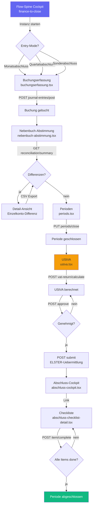

# FIN-001 — Finance-to-Close End-to-End Workflow-Analyse

**Slice:** FIN-001 | **Lane:** Finance-to-Close | **Status:** abgeschlossen | **Owner:** Claude Sonnet 4.6
**Datum:** 2026-03-27

---

## A — Übersicht

Die Finance-to-Close Lane deckt den Kernprozess vom Buchungsbeleg über Nebenbuch-Abstimmung,
Meldewesen (UStVA), Abschluss-Checkliste bis zur Periodenabschluss-Genehmigung ab.
Im Landhandel ist das der Monats-/Quartals-/Jahresabschluss-Zyklus.

### Beteiligte Masken

| Schritt | Datei | Hauptaktion |
|---|---|---|
| 1 | `workflow/flow-spine-finance-to-close.tsx` | Cockpit mit FlowSpineWorkspace |
| 2 | `finance/buchungserfassung.tsx` | Buchungsbeleg erfassen (Journal Entry) |
| 3 | `finance/nebenbuch-abstimmung.tsx` | Nebenbuch-Abstimmung (AR/AP/BANK) |
| 4 | `finance/periods.tsx` | Periodenmanagement (Open/Close) |
| 5 | `fibu/abschluss-cockpit.tsx` | Abschluss-Dashboard mit Blockern |
| 6 | `fibu/abschluss-checklist-detail.tsx` | Checklisten-Positionen abhaken |
| 7 | `finance/ustva.tsx` | UStVA berechnen, genehmigen, ELSTER-Übermittlung |

### Flow-Spine Steps (Registry)

`buchung` → `abstimmung` → `meldewesen` → `abschluss-check` → `genehmigung` → `abschluss`

---

## B — Vollständige Card-Liste

1. `FIN-001-C1` Buchungsbeleg erfassen (Periodenprüfung, Sollkonto/Habenkonto, Betrag, Buchungstext)
2. `FIN-001-C2` DATEV-Export (Liste → CSV/DATEV-Format)
3. `FIN-001-C3` Nebenbuch-Abstimmung lesen (Zusammenfassung AR/AP/BANK pro Periode)
4. `FIN-001-C4` Nebenbuch-Details und Export (Einzelkonto-Differenzen, CSV-Download)
5. `FIN-001-C5` Perioden verwalten (Create, Close — kein Reopen, kein Delete)
6. `FIN-001-C6` Abschluss-Cockpit Dashboard (Blocker, KPIs, Checklisten-Status)
7. `FIN-001-C7` Checklisten-Position abschließen (Item-Code → POST complete)
8. `FIN-001-C8` UStVA berechnen und validieren (Kennzahlen, Berechnung, Prüfung)
9. `FIN-001-C9` UStVA genehmigen (Approval-Status, Freigabe-Workflow)
10. `FIN-001-C10` UStVA an ELSTER übermitteln (Submit, Referenznummer)
11. `FIN-001-C11` Flow-Spine Cockpit (Instanzsteuerung: Monats-/Quartals-/Sonderabschluss)

---

## C — Mermaid-Diagramm

---

## D — Soll-Ist-Abweichungen

| # | Soll | Ist nach FIN-001 | Bewertung |
|---|---|---|---|
| D-01 | Buchungserfassung POST funktioniert | POST `/finance/journal-entries/post` korrekt, Periodenprüfung vorhanden | ok |
| D-02 | Buchungserfassung nutzt einheitlichen apiClient | Migriert auf `@/lib/api-client` (2026-03-30) | ok ~~FIN-001-P1~~ |
| D-03 | Buchungserfassung: Edit/Delete | Edit via `?id=<entryId>`, PUT + DELETE implementiert (2026-03-30) | ok ~~FIN-001-P2~~ |
| D-04 | Nebenbuch-Abstimmung: Summary + Details | GET summary + GET details korrekt via `@/lib/api-client` | ok |
| D-05 | Nebenbuch-Abstimmung: Matching buchen | POST Matching-Endpoint + "Offene Posten abstimmen"-Button (2026-03-30) | ok ~~FIN-001-P3~~ |
| D-06 | Perioden: Create + Close | GET list, POST create, PUT close korrekt via `@/lib/api-client` | ok |
| D-07 | Perioden: Reopen fuer Korrekturbuchungen | `reopenPeriod()` mit PUT status OPEN implementiert | ok ~~FIN-001-P4~~ |
| D-08 | Abschluss-Cockpit: Dashboard | GET `/closing-checklists/cockpit/summary` korrekt mit `.data` | ok |
| D-09 | Checkliste: Positionen abhaken | GET detail + POST complete korrekt via `@/lib/api-client` | ok |
| D-10 | UStVA: Berechnung + Genehmigung + Submit | GET list, POST calculate/approve/submit — vollstaendiger ELSTER-Flow | ok |
| D-11 | UStVA nutzt einheitlichen apiClient | Bereits auf `@/lib/api-client` | ok ~~FIN-001-P5~~ |
| D-12 | Flow-Spine: Redirect-Ziel existiert | `finance/abschluss.tsx` existiert | ok ~~FIN-001-P6~~ |
| D-13 | Flow-Spine: Instance-ID durch alle Masken | Alle 3 Kern-Masken lesen `workflowInstanceId` aus SearchParams | ok ~~FIN-001-P7~~ |
| D-14 | Flow-Spine: Transition-API aufrufen | Buchungserfassung + Perioden rufen Transitions-API auf | ok ~~FIN-001-P8~~ |

---

## E — UI/CRUD-Status

### `buchungserfassung.tsx` (`@/lib/axios` — Legacy)

| Funktion | Status |
|---|---|
| Periodenprüfung (GET periods/check) | OK |
| POST journal-entries/post | OK |
| DATEV-Export (POST export/list) | OK |
| GET/{id} für Edit | Fehlt |
| PUT/{id} für Update | Fehlt |
| DELETE/{id} | Fehlt |

### `nebenbuch-abstimmung.tsx` (`@/lib/api-client` — korrekt)

| Funktion | Status |
|---|---|
| Summary pro Periode (GET) | OK |
| Detail pro Konto (GET) | OK |
| CSV-Export (GET export) | OK — nutzt raw fetch() |
| Match/Ausgleichsbuchung (POST) | Fehlt |

### `periods.tsx` (`@/lib/api-client` — korrekt)

| Funktion | Status |
|---|---|
| Periodenliste (GET) | OK |
| Periode anlegen (POST) | OK |
| Periode schließen (PUT) | OK |
| Reopen (PUT status OPEN) | Fehlt |
| Delete | Fehlt |

### `abschluss-cockpit.tsx` (`@/lib/api-client` — korrekt)

| Funktion | Status |
|---|---|
| Cockpit-Summary (GET) | OK |
| Link zu Checkliste | OK |
| Flow-Spine Context | Fehlt |

### `abschluss-checklist-detail.tsx` (`@/lib/api-client` — korrekt)

| Funktion | Status |
|---|---|
| Checkliste laden (GET/{id}) | OK |
| Item abschließen (POST complete) | OK |
| Item rückgängig (DELETE/PUT) | Fehlt |
| Backlink zum Cockpit | OK |

### `ustva.tsx` (`@/lib/axios` — Legacy)

| Funktion | Status |
|---|---|
| Liste (GET) | OK |
| Detail (GET/{id}) | OK |
| Berechnung (POST calculate) | OK |
| Genehmigung (POST approve) | OK |
| ELSTER-Submit (POST submit) | OK |
| Update Kennzahlen (PUT) | Fehlt |

---

## F — Risiken

### hoch

- **Flow-Spine Redirect-Ziel fehlt**: `/finance/abschluss` existiert nicht als Datei. Jede
  neue Instanz landet auf 404. Muss auf `/fibu/abschluss-cockpit` umgeleitet werden.
- **Kein Flow-Spine Instance-Threading**: Alle 6 Masken ignorieren `workflowInstanceId` —
  der Abschluss-Fortschritt ist nicht nachvollziehbar.

### mittel

- **2 von 6 Masken nutzen Legacy-Client** (`@/lib/axios`): buchungserfassung.tsx und ustva.tsx.
  Bei Änderungen am Auth-Token-Handling können diese Masken brechen.
- **Kein Reconciliation-Matching**: Nebenbuch-Abstimmung ist read-only — Differenzen können
  nicht direkt über die UI ausgeglichen werden.
- **Kein Perioden-Reopen**: Einmal geschlossene Perioden können nicht für Korrekturbuchungen
  wiedereröffnet werden.

### niedrig

- **Buchungsbeleg nur Create**: Kein Edit/Delete für bestehende Journal Entries.
- **UStVA kein Update**: Berechnete Kennzahlen können nicht manuell korrigiert werden.

---

## G — Empfehlungen

1. **FIN-001-P1:** `buchungserfassung.tsx` — Import auf `@/lib/api-client` umstellen.
2. **FIN-001-P2:** Buchungserfassung — GET/{id} + PUT/{id} + DELETE für CRUD-Vollständigkeit.
3. **FIN-001-P3:** Nebenbuch-Abstimmung — POST Endpoint für Matching-Buchungen.
4. **FIN-001-P4:** Perioden — Reopen-Funktion (PUT status OPEN) für Korrekturbuchungen.
5. **FIN-001-P5:** `ustva.tsx` — Import auf `@/lib/api-client` umstellen.
6. **FIN-001-P6:** Flow-Spine Redirect von `/finance/abschluss` auf `/fibu/abschluss-cockpit` korrigieren.
7. **FIN-001-P7:** `useSearchParams()` in alle 6 Masken für `workflowInstanceId` einbauen.
8. **FIN-001-P8:** Nach Domain-Aktion `POST /flow-spines/.../transitions` aufrufen.

---

*Erstellt von Claude Sonnet 4.6 — Slice FIN-001 — 2026-03-27*

## Status

| Slice | Beschreibung | Status |
|-------|-------------|--------|
| FIN-001 | Workflow-Analyse + Mermaid | abgeschlossen |
| FIN-002 | Kontenplan API-Pfad korrigiert | abgeschlossen |
| FIN-003 | Finance Follow-up Router registriert | abgeschlossen |
| FIN-004 | Abschluss-Aktionen (calculate/lock/run) | abgeschlossen |
| FIN-005 | Journal-Pfad in reports.tsx korrigiert | abgeschlossen |
| FIN-006 | Reporting-API registriert | abgeschlossen |
