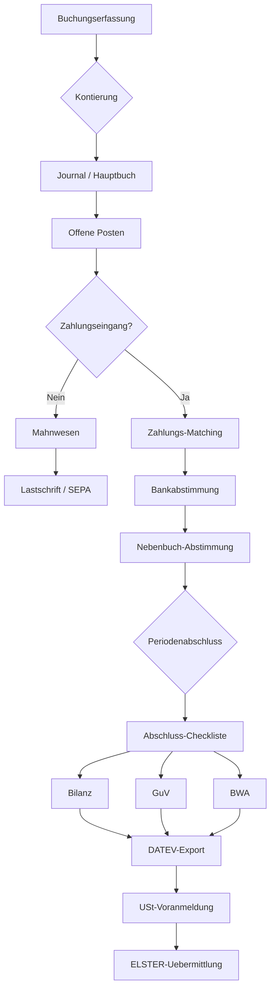

# FIN-001 — Finance-to-Reporting (Finanzbuchhaltung bis Abschluss)

## Zweck

Vollstaendige Workflow-Analyse des Finanzprozesses — von Buchungserfassung ueber
Kontenplan, Offene Posten, Zahlungslaeufe, Mahnwesen bis zum Periodenabschluss und
Reporting (Bilanz, GuV, BWA).

## Flow-Spine

- **processKey**: `finance-to-close`
- **Einstiegsmodi**: Monatsabschluss, Jahresabschluss, Adhoc-Buchung
- **Zielmaske**: `/fibu/abschluss-cockpit`

## Mermaid — Finance-to-Reporting Prozessfluss

## Betroffene Bereiche

### Frontend (41+ Seiten unter pages/finance/ + pages/fibu/)

| Bereich | Seiten | Reifegrad |
|---------|--------|-----------|
| Buchungserfassung | `buchungserfassung.tsx` | Hoch (Journal CRUD + Post) |
| Kontenplan | `kontenplan.tsx` | Mittel (Pfad-Fix: /finance/chart-of-accounts) |
| Offene Posten | `op-debitoren.tsx` | Hoch (Settle, Dunning, Export) |
| Zahlungs-Matching | `payment-matching.tsx` | Hoch |
| AP-Rechnungen | `ap-invoices-list.tsx`, `ap-invoice-form.tsx` | Hoch |
| Reports | `reports.tsx` (Bilanz, GuV, BWA) | Mittel (Journal-Pfad-Abweichung) |
| Abschluss | `abschluss.tsx` | Niedrig (Backend-Stubs) |
| Mahnwesen | `mahnwesen.tsx` | Mittel (Router jetzt registriert) |
| Audit-Trail | `audit-trail.tsx` | Hoch |

### Backend (20+ Endpoint-Dateien)

| Datei | Reifegrad |
|-------|-----------|
| `financial_reports.py` | Hoch (SQL auf Kontenplan/Journal) |
| `finance_actions.py` | Gemischt (Post real, Closing/Cash Stub) |
| `finance_followup.py` | Stub (jetzt registriert) |
| `closing_checklists.py` | Mittel |
| `payment_runs.py` | Hoch (SEPA) |

## Umgesetzte Fixes (FIN-001)

### FIN-002: Kontenplan-Pfad korrigiert
- `kontenplan.tsx`: `baseUrl` von `/api/v1/chart-of-accounts` auf `/api/v1/finance/chart-of-accounts` geaendert

### FIN-003: Finance-Followup Router registriert
- `api.py`: `finance_followup.router` eingebunden — Mahnwesen-Export und Lastschriften-Endpoints jetzt erreichbar

## Weitere Fixes (2026-03-28)

### FIN-004: Abschluss-Aktionen implementiert
- `POST /closing/calculate` — Summen und Salden fuer Periode aus Journal-Entries
- `POST /closing/lock` — Periode sperren (UPDATE accounting_periods SET status=closed)
- `POST /closing/run` — Periodenabschluss durchfuehren (berechnen + sperren)

### FIN-005: Journal-Pfad korrigiert
- `reports.tsx`: `/api/v1/finance/journal-entries` → `/api/v1/journal-entries` (passend zum Backend-Mount)

### FIN-006: reporting_api.py registriert
- `api.py`: `reporting_api.router` eingebunden — Data-Products und Process-Mining Endpoints erreichbar

## Status

**Alle Gaps geschlossen** (2026-03-28).
