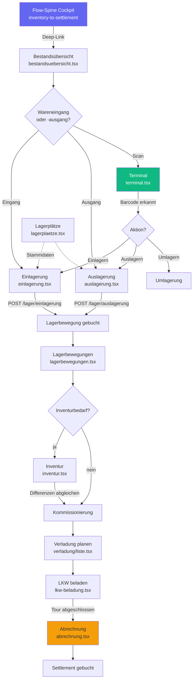

# INV-001 — Inventory-to-Settlement End-to-End Workflow-Analyse

**Slice:** INV-001 | **Lane:** Inventory-to-Settlement | **Status:** abgeschlossen | **Owner:** Claude Opus 4.6
**Datum:** 2026-03-27

---

## A — Übersicht

Die Inventory-to-Settlement Lane deckt den Kernprozess vom Lagerbestand über Kommissionierung
und Verladung bis zur Abrechnung ab. Im Landhandel ist das der operative Tageskreislauf:
Ware kommt rein (Einlagerung), wird disponiert, kommissioniert, verladen und abgerechnet.

### Beteiligte Masken

| Schritt | Datei | Hauptaktion |
|---|---|---|
| 1 | `workflow/flow-spine-inventory-to-settlement.tsx` | Cockpit mit FlowSpineWorkspace |
| 2 | `lager/bestandsuebersicht.tsx` | Bestandsdashboard, MHD, Renner/Penner |
| 3 | `lager/einlagerung.tsx` | Touch-Wizard Wareneingang |
| 4 | `lager/auslagerung.tsx` | Touch-Wizard Warenausgang |
| 5 | `lager/lagerbewegungen.tsx` | Bewegungshistorie (CRUD) |
| 6 | `lager/terminal.tsx` | Barcode-Scanner Einlagerung/Auslagerung |
| 7 | `lager/inventur.tsx` | Zählung und Differenzabgleich |
| 8 | `lager/lagerplaetze.tsx` | Lagerort-Stammdaten |
| 9 | `verladung/liste.tsx` | Tourenübersicht und Versandstatus |
| 10 | `verladung/lkw-beladung.tsx` | Touch-Beladungs-Workflow |
| 11 | `annahme/abrechnung.tsx` | Settlement und Faktura |

### Flow-Spine Steps (Registry)

`inventory-check` → `transfer` → `picking` → `dispatch` → `billing` → `settlement`

---

## B — Vollständige Card-Liste

1. `INV-001-C1` Bestandsübersicht lesen (Dashboard mit MHD, Renner, Penner)
2. `INV-001-C2` Einlagerung buchen (Touch-Wizard: Charge → Artikel → Menge → Lagerort)
3. `INV-001-C3` Auslagerung buchen (Touch-Wizard: Artikel → Menge → Strategie → Charge)
4. `INV-001-C4` Lagerbewegungen verwalten (Full CRUD: in/out/transfer/adjustment)
5. `INV-001-C5` Barcode-Scan am Terminal (Artikelsuche → Einlagerung/Auslagerung/Umlagerung)
6. `INV-001-C6` Inventur durchführen (Zählung, Differenz, Abschluss)
7. `INV-001-C7` Lagerplätze verwalten (Kapazität, Belegung)
8. `INV-001-C8` Verladung planen (Tourenübersicht, Rampen, ETA)
9. `INV-001-C9` LKW beladen (Touch-Beladung mit Positionsprüfung)
10. `INV-001-C10` Settlement/Abrechnung (Abzüge, Freigabe, FIBU-Übergabe)
11. `INV-001-C11` Flow-Spine Cockpit (Instanzsteuerung, Statuskarten)

---

## C — Mermaid-Diagramm

---

## D — Soll-Ist-Abweichungen

| # | Soll | Ist nach INV-001 | Bewertung |
|---|---|---|---|
| D-01 | Bestandsübersicht zeigt Live-Daten | Dashboard nutzt echte API-Hooks (MHD, Renner, Penner) | ok |
| D-02 | Einlagerung bucht Wareneingang korrekt | `POST /lager/einlagerung` funktioniert; `@/lib/api-client` mit `.data` korrekt | ok |
| D-03 | Einlagerung: Artikel aus API laden | ARTIKEL hardcoded: `['Weizen', 'Gerste', 'Raps', ...]` statt `GET /articles` | offen INV-001-P1 |
| D-04 | Einlagerung: Lagerorte aus API laden | LAGERORTE hardcoded: `['silo-1', 'silo-2', 'halle-a', 'halle-b']` statt `GET /inventory/warehouses` | offen INV-001-P2 |
| D-05 | Auslagerung: einheitlicher apiClient | Mischt `api` von `@/lib/axios` (POST) mit `apiClient` von `@/lib/api-client` (GET) | offen INV-001-P3 |
| D-06 | Auslagerung: Artikel dynamisch | Artikel aus API geladen mit Fallback auf hardcoded Liste | teilweise ok |
| D-07 | Lagerbewegungen: Full CRUD | GET/POST/PUT/DELETE vollständig, Service-Abstraktion sauber | ok |
| D-08 | Terminal: Barcode-Scan → Artikelsuche | `GET /articles?search=barcode` korrekt via `@/lib/api-client` mit `.data` | ok |
| D-09 | Terminal: Navigation zu Einlagerung/Auslagerung | Navigiert zu `/lager/einlagerung?artikel=`, `/lager/auslagerung?artikel=` | ok |
| D-10 | Inventur: Zählung und Abschluss | Read + Complete + Delete via Hooks; kein Create für neue Inventur | teilweise |
| D-11 | Lagerplätze: Kapazität und Belegung | Kapazitätswerte (`belegt`, `bestand`, `frei`) sind Mock (immer 0/1) | offen INV-001-P4 |
| D-12 | Verladung: Tourenübersicht | `useVerladungen()` Hook mit echten API-Daten; DataTable mit Statusfilter | ok |
| D-13 | LKW-Beladung: Touch-Positionszuordnung | Touch-Cards mit Fahrzeug- und Positionszuordnung | ok |
| D-14 | Abrechnung: Settlement-Kette | Abzugslogik (Trocknung, Reinigung, Fracht), Freigabe-Automat, FIBU-Übergabe | ok |
| D-15 | Flow-Spine: Instance-Tracking durch alle Schritte | Nur `bestandsuebersicht.tsx` liest WorkflowEntryContext; alle anderen ignorieren Flow-Spine | offen INV-001-P5 |

---

## E — UI/CRUD-Status

### `einlagerung.tsx` (`@/lib/api-client` — korrekt mit `.data`)

| Funktion | Status |
|---|---|
| Touch-Wizard (Charge → Artikel → Menge → Lagerort) | OK |
| POST `/lager/einlagerung` | OK |
| Artikel-Auswahl | Lücke — hardcoded |
| Lagerort-Auswahl | Lücke — hardcoded |
| Navigation nach Buchung | OK → bestandsuebersicht |

### `auslagerung.tsx` (mischt `@/lib/axios` + `@/lib/api-client`)

| Funktion | Status |
|---|---|
| Touch-Wizard (Artikel → Menge → Strategie → Charge) | OK |
| GET `/articles?limit=100` via apiClient | OK (mit Fallback) |
| POST `/lager/auslagerung` via `api` (axios) | Funktioniert, aber inkonsistent |
| FIFO/FEFO/Manuell Strategieauswahl | OK (domain-logisch korrekt) |

### `lagerbewegungen.tsx` (Service-Abstraktion)

| Funktion | Status |
|---|---|
| List + Filter (Typ, Suche) | OK |
| Create/Update/Delete (Dialog) | OK — Full CRUD |

### `terminal.tsx` (`@/lib/api-client` — korrekt)

| Funktion | Status |
|---|---|
| Barcode-Scan → API-Suche | OK |
| Navigation zu Einlagerung/Auslagerung/Umlagerung | OK |

### `inventur.tsx` (Hooks)

| Funktion | Status |
|---|---|
| Liste + Suche | OK |
| Positionen abschließen | OK |
| Stornieren | OK |
| Neue Inventur anlegen | Fehlt |

### `lagerplaetze.tsx` (Hook `useWarehouses`)

| Funktion | Status |
|---|---|
| Liste aus API | OK |
| Kapazität/Belegung | Lücke — Mock |

### `verladung/liste.tsx` (Hook `useVerladungen`)

| Funktion | Status |
|---|---|
| Tourenübersicht mit Filter | OK |
| Navigation zu Detail/Beladung | OK |

---

## F — Risiken

### hoch

- Einlagerung mit hardcoded Artikeln und Lagerorten ist nicht produktionstauglich. Jeder
  Artikel oder Lagerort der nicht in der statischen Liste steht kann nicht eingelagert werden.

### mittel

- Auslagerung mischt zwei apiClient-Instanzen. Bei Änderung an einem der Wrapper
  kann der andere brechen.
- Lagerplätze zeigen Kapazität immer als 0% — Lagerdisposition ohne korrekte
  Auslastungsdaten nicht möglich.
- Flow-Spine Instance-Tracking fehlt in 9 von 10 Masken.

### niedrig

- Inventur hat keinen Create-Pfad.

---

## G — Empfehlungen

1. **INV-001-P1:** Einlagerung — Artikel aus `GET /api/v1/articles?limit=200` via `useQuery`.
2. **INV-001-P2:** Einlagerung — Lagerorte aus `GET /api/v1/inventory/warehouses` via `useQuery`.
3. **INV-001-P3:** Auslagerung — POST auf `apiClient` von `@/lib/api-client` umstellen,
   `api`-Import von `@/lib/axios` entfernen.
4. **INV-001-P4:** Lagerplätze — Kapazitätsberechnung aus echten Bestandsdaten.
5. **INV-001-P5:** Flow-Spine Instance-ID durch alle Masken durchreichen.
6. **INV-002:** Inventur-Anlage-Dialog in `inventur.tsx` ergänzen.

---

*Erstellt von Claude Opus 4.6 — Slice INV-001 — 2026-03-27*

---

## Umsetzungsstand (2026-03-27) — P1-Slices

### INV-002: Bestandsuebersicht echte KPIs
- **Backend**: `GET /api/v1/lager/dashboard` — aggregiert StockMovements (Zugang minus Abgang), Gesamtwert, Bewegungen heute, Unterbestand-Zaehler
- **Frontend**: `useInventoryDashboard()` nutzt jetzt den echten Endpoint mit Fallback auf Artikel-Aggregation

### INV-003: Ein-/Auslagerung StockMovement-Buchung
- **Einlagerung**: `POST /lager/einlagerung` erzeugt jetzt neben `article_batches` auch einen `StockMovement` (Typ `in`) mit Charge, Lagerort, Referenznummer
- **Auslagerung**: `POST /lager/auslagerung` erzeugt `StockMovement` (Typ `out`), implementiert FIFO/FEFO-Strategie (aelteste Charge zuerst), reduziert Chargen-Bestand

### INV-004: Einlagerung Stammdaten-Anbindung
- Artikel werden jetzt aus `GET /api/v1/articles` geladen (Fallback auf statische Liste)
- Lagerorte werden aus `GET /api/v1/warehouses` geladen (Fallback auf statische Liste)

### INV-007: Lagerplaetze echte Belegung
- Auslastung berechnet sich jetzt aus `used_capacity / total_capacity` statt fest `0%`
- Belegte Plaetze werden proportional zur Kapazitaet berechnet
