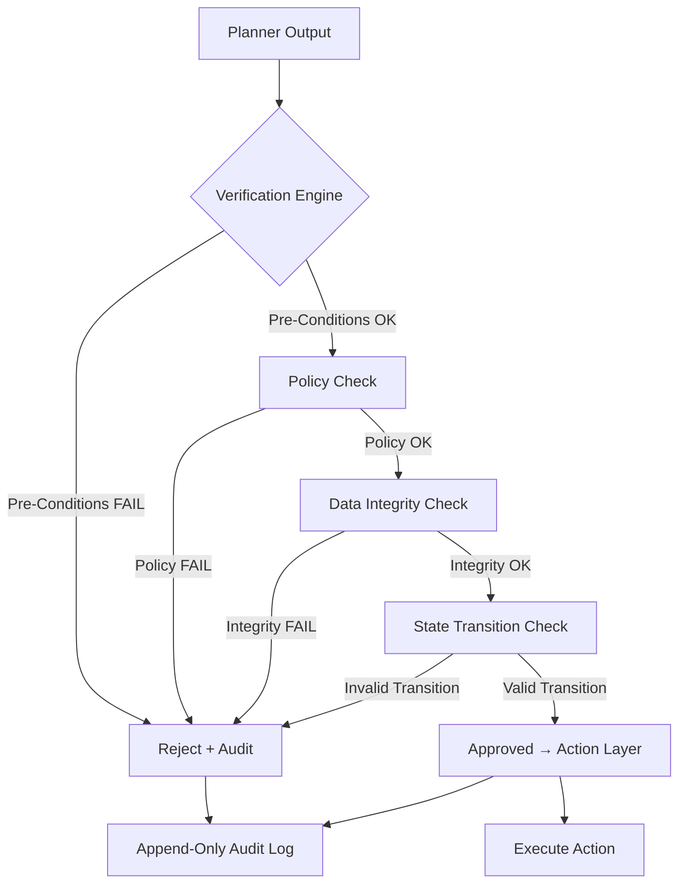

# NC-001 — Neuro Verification Engine

## Zweck
Formale Verifikationsschicht zwischen Planner und Action Layer im Neuro-Core.
Prueft jeden geplanten Schritt VOR Ausfuehrung auf:
- Vorbedingungen (Pre-Conditions)
- Policy-Konformitaet
- Datenintegritaet
- Zustandsuebergaenge (State Transitions)

## Mermaid

## Komponenten

| Komponente | Beschreibung |
|------------|-------------|
| PreConditionValidator | Prueft ob alle Eingabedaten vorhanden und gueltig |
| PolicyConformityChecker | Validiert gegen aktive Policy-Regeln |
| DataIntegrityValidator | Schema-Validierung, Referenzielle Integritaet |
| StateTransitionValidator | Prueft ob Zustandsuebergang erlaubt (FSM) |
| VerificationResult | Ergebnis mit Status, Violations, Audit-Trace |

## API

- `POST /api/v1/neuro/verify` — Plan verifizieren
- `GET /api/v1/neuro/verify/{trace_id}` — Verifikationsergebnis abrufen

## Status

| Slice | Beschreibung | Status |
|-------|-------------|--------|
| NC-001-A | Verification Service + API | umgesetzt |
| NC-001-B | Policy-Integration | umgesetzt |
| NC-001-C | Audit-Trail-Anbindung | umgesetzt |
