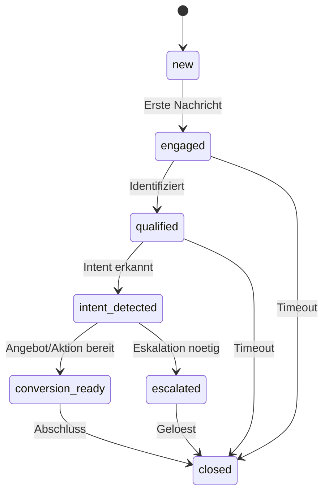

# NC-002 — Interaction State Manager

## Zweck
Verwaltet den Kanal-/Dialogzustand fuer alle Interaktionskanaele (Chat, WhatsApp, Voice, Email).
Getrennt vom Business State — steuert Timing, Tonalitaet und Compliance pro Konversation.

## Mermaid

## API

- `POST /api/v1/neuro/interactions` — Neue Interaktion starten
- `PUT /api/v1/neuro/interactions/{id}/transition` — Zustandsuebergang
- `GET /api/v1/neuro/interactions/{id}` — Aktuellen Zustand abrufen
- `GET /api/v1/neuro/interactions` — Aktive Interaktionen listen

## Status

| Slice | Beschreibung | Status |
|-------|-------------|--------|
| NC-002-A | State Machine + API | umgesetzt |
| NC-002-B | Channel-Integration | umgesetzt |
