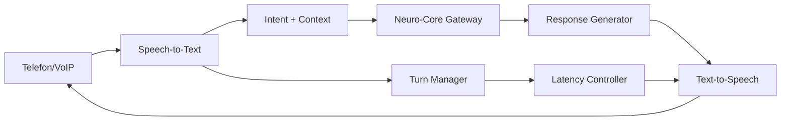

# NC-003 — Voice Adapter Layer

## Zweck
Adapter-Schicht zwischen Voice-Kanaelen und dem Neuro-Core Gateway.
Voice ist kein Chat — es ist ein Echtzeit-System mit Latenz-Anforderungen.

## Mermaid

## Komponenten

| Komponente | Beschreibung |
|------------|-------------|
| STTAdapter | Speech-to-Text (Whisper/Azure/Google) |
| TTSAdapter | Text-to-Speech (Azure Neural/ElevenLabs) |
| TurnManager | Sprecherwechsel-Erkennung |
| LatencyController | Max 500ms Response-Latenz |
| VoiceSessionManager | Session-Verwaltung mit Timeout |

## API

- `POST /api/v1/neuro/voice/session` — Voice-Session starten
- `POST /api/v1/neuro/voice/transcribe` — Audio → Text
- `POST /api/v1/neuro/voice/synthesize` — Text → Audio
- `DELETE /api/v1/neuro/voice/session/{id}` — Session beenden

## Status

| Slice | Beschreibung | Status |
|-------|-------------|--------|
| NC-003-A | STT/TTS Adapter + API | umgesetzt |
| NC-003-B | Turn Manager | umgesetzt |
