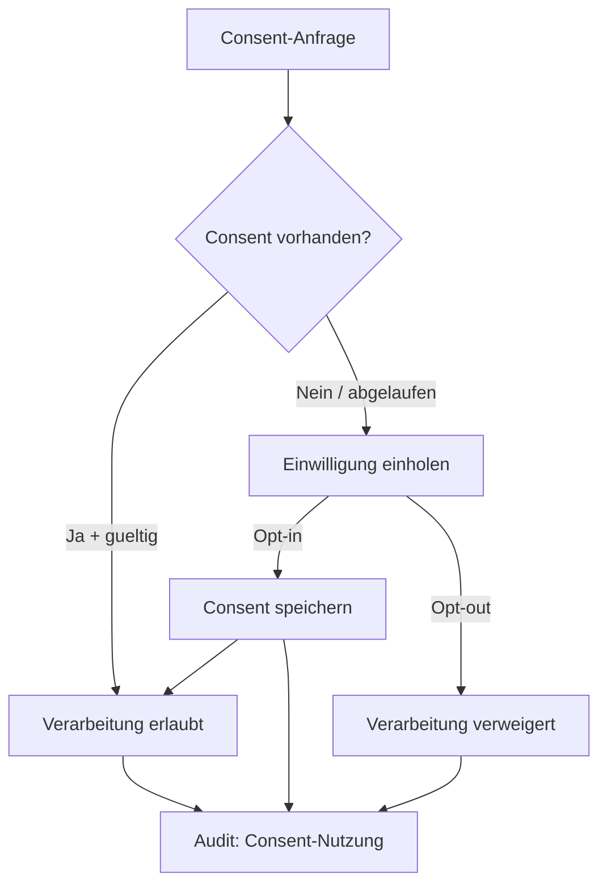

# NC-004 — Consent Engine

## Zweck
Verwaltet den vollstaendigen Einwilligungs-Lifecycle (DSGVO Art. 6, 7).
Jede Kanalnutzung und Datenverarbeitung erfordert expliziten, nachweisbaren Consent.

## Mermaid

## Consent-Typen

| Typ | Beschreibung | Rechtsgrundlage |
|-----|-------------|-----------------|
| data_processing | Allgemeine Datenverarbeitung | Art. 6(1)(a) DSGVO |
| marketing_email | E-Mail-Marketing | Art. 6(1)(a) + UWG |
| marketing_whatsapp | WhatsApp-Kontakt | Art. 6(1)(a) DSGVO |
| marketing_phone | Telefonische Kontaktaufnahme | Art. 6(1)(a) + UWG |
| profiling | Profilbildung | Art. 22 DSGVO |

## API

- `POST /api/v1/neuro/consent/check` — Consent pruefen
- `POST /api/v1/neuro/consent/grant` — Einwilligung erteilen
- `POST /api/v1/neuro/consent/revoke` — Einwilligung widerrufen
- `GET /api/v1/neuro/consent/{entity_id}` — Consent-Status abrufen

## Status

| Slice | Beschreibung | Status |
|-------|-------------|--------|
| NC-004-A | Consent Service + API | umgesetzt |
| NC-004-B | Audit-Trail | umgesetzt |
